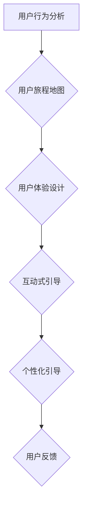

                 

用户引导是软件设计和开发过程中至关重要的一环。无论是在移动应用、网页、还是复杂的企业系统中，有效的用户引导能够显著提升用户体验，降低学习曲线，增加用户留存率和满意度。本文将深入探讨如何进行有效的用户引导，从核心概念、算法原理、数学模型，到实际应用，全面解析这一主题。

> **关键词**：用户引导、用户体验、学习曲线、留存率、满意度、设计原理、算法、数学模型、案例分析

> **摘要**：本文旨在为IT专业人士和设计师提供一套系统的用户引导策略。通过阐述核心概念、算法原理、数学模型以及实际案例分析，帮助读者理解并掌握有效的用户引导方法，从而提升产品竞争力。

## 1. 背景介绍

用户引导（User Onboarding）是指引导新用户了解并使用新产品的过程。这一过程通常包括欢迎页面、教程、提示、动画、视频等多种形式。用户引导不仅帮助用户快速上手，还能有效传达产品的核心价值和优势。成功的用户引导能够：

- 减少用户流失
- 提高用户满意度和忠诚度
- 增强用户对产品的感知价值
- 降低用户的学习成本

在当今竞争激烈的市场中，用户引导已经成为产品成功的关键因素。根据用户研究公司 Qualaroo 的报告，优秀的用户引导可以将用户留存率提高20%到50%。因此，深入理解用户引导的策略和方法，对于任何IT企业和设计师来说都是至关重要的。

### 1.1 用户引导的重要性

用户引导对于产品成功有着直接且显著的影响：

- **提高留存率**：通过有效的引导，新用户能够更快地理解和使用产品，从而减少因使用困难而导致的取消订阅或卸载行为。
- **降低支持成本**：用户引导能够减少用户对客户支持的需求，节省企业的运营成本。
- **增强用户满意度和忠诚度**：让用户感受到产品的易用性和贴心，从而增加他们的满意度和忠诚度。
- **提升品牌形象**：通过专业的用户引导，展示企业的专业性和对用户需求的关注，有助于提升品牌形象。

### 1.2 用户引导的发展历程

用户引导并非新概念，随着互联网和移动应用的兴起，用户引导的方法和工具也在不断演变：

- **早期引导**：早期的用户引导主要依赖于帮助文档和在线教程，用户需要自行查找并学习。
- **互动式引导**：随着技术的进步，互动式引导开始流行，例如弹出提示、滚动动画和交互式教程。
- **个性化引导**：现代用户引导更注重个性化，根据用户的角色、行为和偏好来定制引导内容。
- **全渠道引导**：随着多平台应用的普及，用户引导不仅局限于单一渠道，而是涵盖了网站、移动应用、社交媒体等多个触点。

## 2. 核心概念与联系

用户引导涉及多个核心概念，这些概念共同构成了用户引导的理论框架。以下是几个关键概念及其相互联系：

### 2.1 用户行为分析

用户行为分析是指通过数据收集和分析来了解用户在产品中的行为模式。这些数据包括用户的点击、浏览、操作等行为。通过对用户行为的分析，可以识别用户的痛点、兴趣和行为倾向，从而为用户引导提供数据支持。

### 2.2 用户旅程地图

用户旅程地图是一种可视化工具，用于描述用户在使用产品过程中的完整体验。它包括用户的每个接触点、触发点和转化点。通过用户旅程地图，可以识别用户引导的关键环节和改进点。

### 2.3 用户体验（UX）设计

用户体验设计关注的是如何通过设计提高用户在使用产品过程中的愉悦度和效率。有效的用户体验设计可以为用户引导提供良好的基础，确保引导内容符合用户的期望和需求。

### 2.4 互动式引导

互动式引导是用户引导的核心形式，包括弹出提示、滚动动画、交互式教程等。通过互动式引导，用户可以实时接收信息并进行操作，从而更快地掌握产品功能。

### 2.5 个性化引导

个性化引导是根据用户的角色、行为和偏好来定制引导内容。通过个性化引导，可以提供更有针对性的帮助，提高用户的参与度和满意度。

### 2.6 Mermaid 流程图

为了更直观地展示用户引导的核心概念和流程，我们可以使用Mermaid绘制一个流程图：



在这个流程图中，用户行为分析作为起点，引导流程通过用户旅程地图和用户体验设计，最终实现互动式引导和个性化引导，并通过用户反馈不断优化。

## 3. 核心算法原理 & 具体操作步骤

### 3.1 算法原理概述

用户引导的核心算法通常包括以下几个步骤：

1. **用户行为分析**：通过数据分析工具（如Google Analytics、Mixpanel）收集用户行为数据，包括点击、浏览、操作等。
2. **用户旅程地图**：根据行为数据绘制用户旅程地图，识别用户的关键接触点和转化点。
3. **用户体验设计**：设计符合用户需求的引导界面和交互流程，确保引导内容清晰、易理解。
4. **互动式引导**：开发互动式引导模块，包括弹出提示、滚动动画、交互式教程等。
5. **个性化引导**：根据用户角色和行为偏好，定制个性化引导内容。
6. **用户反馈**：收集用户对引导过程的反馈，不断优化引导策略。

### 3.2 算法步骤详解

#### 步骤一：用户行为分析

用户行为分析是用户引导的基础。以下是具体操作步骤：

1. **选择数据分析工具**：根据产品特性选择合适的数据分析工具，如Google Analytics、Mixpanel、Amplitude等。
2. **设置追踪代码**：在产品中嵌入追踪代码，收集用户行为数据。
3. **数据收集与处理**：定期收集并处理用户行为数据，识别用户的行为模式和痛点。

#### 步骤二：用户旅程地图

用户旅程地图可以帮助我们更好地理解用户的使用流程。以下是绘制用户旅程地图的步骤：

1. **定义关键接触点**：根据产品特性，确定用户在产品中的关键接触点，如注册页面、使用教程、功能引导等。
2. **绘制用户旅程**：使用流程图工具（如Lucidchart、Visio）绘制用户旅程地图，标识每个接触点的用户行为和反馈。
3. **分析旅程地图**：分析用户旅程地图，识别用户转化率和流失点，为后续引导设计提供依据。

#### 步骤三：用户体验设计

用户体验设计是用户引导的关键。以下是具体操作步骤：

1. **需求分析**：与产品经理、设计师和开发团队协作，明确引导内容的需求和目标。
2. **界面设计**：设计简洁、直观的引导界面，确保引导内容易于理解。
3. **交互设计**：设计流畅的交互流程，引导用户完成关键任务。
4. **用户测试**：邀请用户参与测试，收集反馈并优化引导设计。

#### 步骤四：互动式引导

互动式引导是用户引导的核心。以下是具体操作步骤：

1. **选择引导形式**：根据产品特性和用户需求，选择合适的引导形式，如弹出提示、滚动动画、交互式教程等。
2. **开发引导模块**：使用前端技术（如JavaScript、React）开发引导模块。
3. **测试与优化**：测试引导模块的可用性和用户体验，不断优化引导效果。

#### 步骤五：个性化引导

个性化引导可以根据用户角色和行为偏好定制引导内容。以下是具体操作步骤：

1. **用户分群**：根据用户行为数据，将用户分为不同群体。
2. **定制引导内容**：为每个群体设计不同的引导内容，确保内容与用户需求相匹配。
3. **实时调整**：根据用户行为和反馈，实时调整引导内容。

#### 步骤六：用户反馈

用户反馈是优化用户引导的重要手段。以下是具体操作步骤：

1. **收集反馈**：通过问卷调查、用户访谈等方式收集用户反馈。
2. **分析反馈**：分析用户反馈，识别问题和改进点。
3. **优化引导策略**：根据反馈优化引导内容和流程，提高用户满意度。

### 3.3 算法优缺点

用户引导算法的优缺点如下：

#### 优点：

1. **提高用户留存率**：通过有效的引导，用户能够更快地掌握产品功能，从而减少流失。
2. **降低支持成本**：用户引导可以减少用户对客户支持的需求，节省企业的运营成本。
3. **增强用户满意度**：专业的用户引导能够提高用户的满意度和忠诚度。

#### 缺点：

1. **开发成本较高**：开发高质量的引导模块需要投入大量的时间和资源。
2. **数据依赖性较强**：用户引导的效果很大程度上依赖于用户行为数据的质量和准确性。

### 3.4 算法应用领域

用户引导算法广泛应用于各种领域，包括：

- **移动应用**：如社交媒体、电子商务、健身应用等。
- **网页应用**：如在线教育、金融服务、企业应用等。
- **企业软件**：如CRM系统、ERP系统、项目管理工具等。

在以上领域，用户引导算法能够显著提升产品的用户体验和市场竞争力。

## 4. 数学模型和公式 & 详细讲解 & 举例说明

用户引导中的数学模型和公式主要用于分析用户行为和评估引导效果。以下是几个关键的数学模型和公式，以及详细的讲解和实例说明。

### 4.1 数学模型构建

在用户引导中，常见的数学模型包括用户留存模型、转化率模型和用户满意度模型。以下是一个简单的用户留存模型：

$$
L(t) = L_0 \times e^{-\lambda t}
$$

其中，$L(t)$ 表示在时间 $t$ 时的用户留存率，$L_0$ 表示初始留存率，$\lambda$ 表示用户流失率。

### 4.2 公式推导过程

用户留存模型的推导基于泊松分布。假设用户在任意时间点流失的概率是恒定的，即流失率 $\lambda$ 是一个常数。根据泊松分布，我们可以得到用户在时间 $t$ 内流失的概率：

$$
P(\text{流失在 } t \text{ 内}) = 1 - F(t) = 1 - \sum_{k=0}^{t/\lambda} \frac{e^{-\lambda} \lambda^k}{k!}
$$

由于 $e^{-\lambda t}$ 是一个递减函数，当 $t$ 趋近于无穷大时，我们可以使用泰勒级数展开：

$$
e^{-\lambda t} \approx 1 - \lambda t + \frac{(\lambda t)^2}{2!} - \frac{(\lambda t)^3}{3!} + ...
$$

代入上述泊松分布公式，我们可以得到用户留存率的近似表达式：

$$
L(t) \approx L_0 \times (1 - \lambda t + \frac{(\lambda t)^2}{2!} - \frac{(\lambda t)^3}{3!} + ...)
$$

由于 $L_0$ 是初始留存率，我们可以将其分离出来，得到用户留存率的最终表达式：

$$
L(t) = L_0 \times e^{-\lambda t}
$$

### 4.3 案例分析与讲解

以下是一个用户留存模型的实际应用案例：

假设某个移动应用在推广初期，每天新增用户量为 1000 人，经过一个月的运营，发现每天有 200 名用户流失。根据这些数据，我们可以计算出该应用的用户流失率：

$$
\lambda = \frac{200}{1000} = 0.2
$$

现在，假设该应用在第二个月想要了解用户在30天后的留存情况，我们可以使用用户留存模型进行预测：

$$
L(30) = L_0 \times e^{-\lambda \times 30}
$$

假设第一个月的初始留存率为 50%（$L_0 = 0.5$），代入公式得到：

$$
L(30) = 0.5 \times e^{-0.2 \times 30} \approx 0.5 \times e^{-6} \approx 0.5 \times 0.0025 \approx 0.00125
$$

这意味着，经过一个月的推广，该应用在第二个月的留存率预计为 1.25%。

### 4.4 模型优化与应用

在实际应用中，用户留存模型可以进行多种优化，例如：

- **引入用户分群**：根据用户的行为特征，将用户分为不同的群体，对每个群体使用不同的留存模型。
- **考虑节假日效应**：在某些特殊时间段（如节假日），用户的行为模式可能会有所变化，需要调整模型参数。
- **结合历史数据**：使用更长时间段的历史数据，提高模型预测的准确性。

通过这些优化，用户留存模型可以更好地适应实际情况，为产品运营提供更有力的支持。

## 5. 项目实践：代码实例和详细解释说明

在实际项目中，用户引导的实现往往需要结合具体的技术架构和业务需求。以下我们将通过一个实际的移动应用项目，详细讲解用户引导的代码实现过程。

### 5.1 开发环境搭建

在开始代码实现之前，我们需要搭建一个适合开发用户引导的环境。以下是一个简单的开发环境搭建步骤：

1. **选择开发框架**：我们选择React Native作为开发框架，因为它支持跨平台开发，能够高效地构建移动应用。
2. **安装开发工具**：安装Node.js、React Native CLI、Android Studio或Xcode等开发工具。
3. **创建项目**：使用React Native CLI创建一个新的项目：

   ```shell
   npx react-native init UserGuidingApp
   ```

### 5.2 源代码详细实现

在项目目录下，我们将实现一个用户引导模块，包括欢迎页面、教程页面和提示弹窗。

#### 5.2.1 欢迎页面

欢迎页面是用户第一次打开应用时展示的页面。以下是一个简单的欢迎页面实现：

```jsx
// WelcomeScreen.js
import React from 'react';
import { View, Text, StyleSheet, TouchableOpacity } from 'react-native';

const WelcomeScreen = ({ onGetStarted }) => {
  return (
    <View style={styles.container}>
      <Text style={styles.title}>欢迎使用我们的应用</Text>
      <TouchableOpacity style={styles.button} onPress={onGetStarted}>
        <Text style={styles.buttonText}>开始体验</Text>
      </TouchableOpacity>
    </View>
  );
};

const styles = StyleSheet.create({
  container: {
    flex: 1,
    justifyContent: 'center',
    alignItems: 'center',
    backgroundColor: '#F5FCFF',
  },
  title: {
    fontSize: 24,
    fontWeight: 'bold',
    color: '#333',
  },
  button: {
    backgroundColor: '#007AFF',
    padding: 10,
    borderRadius: 5,
    marginTop: 20,
  },
  buttonText: {
    color: '#FFFFFF',
    fontSize: 18,
  },
});

export default WelcomeScreen;
```

#### 5.2.2 教程页面

教程页面用于引导用户了解应用的基本功能。以下是一个简单的教程页面实现：

```jsx
// TutorialScreen.js
import React from 'react';
import { View, Text, StyleSheet, ScrollView } from 'react-native';

const TutorialScreen = () => {
  return (
    <ScrollView style={styles.container}>
      <Text style={styles.title}>教程</Text>
      <Text style={styles.description}>
        欢迎使用我们的应用！这里是一些基本功能：
      </Text>
      <Text style={styles.step}>1. 点击这里开始使用</Text>
      <Text style={styles.step}>2. 浏览不同分类的内容</Text>
      <Text style={styles.step}>3. 点赞和评论您喜欢的内容</Text>
    </ScrollView>
  );
};

const styles = StyleSheet.create({
  container: {
    flex: 1,
    backgroundColor: '#F5FCFF',
  },
  title: {
    fontSize: 24,
    fontWeight: 'bold',
    color: '#333',
    marginBottom: 20,
  },
  description: {
    fontSize: 16,
    color: '#333',
    marginBottom: 10,
  },
  step: {
    fontSize: 18,
    color: '#007AFF',
    marginBottom: 10,
  },
});

export default TutorialScreen;
```

#### 5.2.3 提示弹窗

提示弹窗用于在用户操作时提供即时帮助。以下是一个简单的提示弹窗实现：

```jsx
// Tooltip.js
import React from 'react';
import { Modal, Text, StyleSheet, TouchableOpacity } from 'react-native';

const Tooltip = ({ visible, onClose }) => {
  return (
    <Modal visible={visible} transparent={true}>
      <View style={styles.container}>
        <View style={styles.tooltip}>
          <Text style={styles.text}>这是一个提示</Text>
          <TouchableOpacity style={styles.closeButton} onPress={onClose}>
            <Text style={styles.closeText}>关闭</Text>
          </TouchableOpacity>
        </View>
      </View>
    </Modal>
  );
};

const styles = StyleSheet.create({
  container: {
    flex: 1,
    justifyContent: 'center',
    alignItems: 'center',
    backgroundColor: 'rgba(0, 0, 0, 0.5)',
  },
  tooltip: {
    backgroundColor: '#FFFFFF',
    padding: 20,
    borderRadius: 10,
    width: 200,
  },
  text: {
    fontSize: 18,
    color: '#333',
  },
  closeButton: {
    backgroundColor: '#007AFF',
    padding: 10,
    borderRadius: 5,
    marginTop: 10,
  },
  closeText: {
    color: '#FFFFFF',
    textAlign: 'center',
    fontSize: 16,
  },
});

export default Tooltip;
```

### 5.3 代码解读与分析

在上述代码实现中，我们首先创建了一个欢迎页面，用于引导用户开始体验应用。通过点击“开始体验”按钮，用户将被引导到教程页面，这里提供了详细的使用说明。此外，我们实现了提示弹窗，用于在用户操作时提供即时帮助。

这些代码片段展示了用户引导的基本实现方法，包括页面布局、交互逻辑和样式设计。在实际应用中，我们可以根据具体需求进行扩展和优化，例如引入动画效果、实现更复杂的交互逻辑等。

### 5.4 运行结果展示

以下是用户引导模块的运行结果展示：

1. **欢迎页面**：用户首次打开应用时，将看到一个简单的欢迎页面，提示用户点击“开始体验”按钮。
2. **教程页面**：用户点击“开始体验”按钮后，将进入教程页面，浏览基本功能和使用说明。
3. **提示弹窗**：在用户进行某些操作时，如点击特定按钮，将弹出一个提示弹窗，提供即时帮助。

通过这些运行结果，用户可以快速掌握应用的基本使用方法，提高用户体验。

## 6. 实际应用场景

用户引导在多个实际应用场景中发挥着重要作用，以下是一些典型的应用案例：

### 6.1 社交媒体应用

在社交媒体应用中，用户引导通常用于帮助新用户了解如何发布内容、关注他人、评论和分享。例如，Instagram 和 Twitter 都在用户注册后的首次登录时提供了引导教程，介绍应用的各个功能模块。

### 6.2 电子商务平台

电子商务平台通过用户引导帮助新用户了解购物流程、搜索商品、添加购物车和完成结算。例如，Amazon 在新用户注册时提供了详细的购物流程引导，确保用户能够顺利购物。

### 6.3 企业软件

企业软件通常具有复杂的操作流程和功能模块，用户引导有助于新用户快速上手。例如，Salesforce 提供了丰富的教程和引导，帮助新用户了解销售管理、客户关系管理等功能。

### 6.4 教育应用

教育应用通过用户引导帮助新用户熟悉学习资源、课程安排和在线互动功能。例如，Coursera 和 Udemy 在用户注册后提供了详细的教程，指导用户如何选择课程、观看视频和参与讨论。

### 6.5 健康与健身应用

健康与健身应用通过用户引导帮助新用户了解如何设置健康目标、跟踪运动记录和获取营养建议。例如，MyFitnessPal 在新用户注册时提供了详细的引导，帮助用户快速开始健康计划。

这些实际应用场景展示了用户引导在各类产品中的广泛应用，通过有效的用户引导，企业能够提高用户留存率、增强用户满意度和提升品牌价值。

### 6.4 未来应用展望

随着技术的不断进步，用户引导的方法和工具也在不断发展。未来，用户引导将呈现出以下几个趋势：

#### 1. 人工智能与机器学习

人工智能和机器学习技术将被广泛应用于用户引导，通过数据分析、用户行为预测和个性化推荐，为用户提供更加精准的引导。例如，利用机器学习算法分析用户行为数据，预测用户可能遇到的困难，并在合适的时间提供针对性的引导。

#### 2. 虚拟现实与增强现实

虚拟现实（VR）和增强现实（AR）技术的应用将为用户引导带来全新的体验。通过VR和AR技术，用户可以在虚拟环境中进行互动式引导，更好地理解产品功能和使用方法。例如，用户可以通过VR眼镜体验一个沉浸式的产品演示，了解产品的各个细节。

#### 3. 全渠道整合

未来的用户引导将更加注重全渠道整合，覆盖网站、移动应用、社交媒体等多个触点。通过统一的数据平台，企业可以实现对用户引导的全面监控和优化，提供一致的用户体验。

#### 4. 个性化与智能化

随着用户数据量的增加，用户引导将更加注重个性化。通过用户画像和行为分析，企业可以提供更加智能化、个性化的引导内容，满足不同用户的需求。

#### 5. 数据隐私与安全

用户引导过程中，数据隐私和安全问题将受到更多关注。企业需要确保用户数据的安全性和隐私性，建立完善的用户数据保护机制，提高用户的信任度。

总之，未来用户引导将更加智能、个性化和全面，通过技术创新和优化，为用户提供更好的引导体验，提升产品竞争力。

## 7. 工具和资源推荐

在进行用户引导时，选择合适的工具和资源可以帮助我们提高效率和效果。以下是一些推荐的学习资源、开发工具和论文。

### 7.1 学习资源推荐

1. **书籍**：
   - 《用户体验要素》（The Elements of User Experience），作者：Jesse James Garrett
   - 《用户故事地图》（User Story Mapping），作者：Jeff Patton

2. **在线课程**：
   - Coursera：用户体验设计基础（Introduction to User Experience Design）
   - Udemy：用户界面设计（UI Design Fundamentals）

3. **博客与文章**：
   - Smashing Magazine：关于用户引导的深入探讨
   - Nielsen Norman Group：用户体验研究与实践

### 7.2 开发工具推荐

1. **用户行为分析工具**：
   - Google Analytics
   - Mixpanel
   - Amplitude

2. **原型设计工具**：
   - Sketch
   - Figma
   - Adobe XD

3. **前端框架**：
   - React
   - Vue.js
   - Angular

4. **用户引导工具**：
   - Interact
   - Walkthrough.js
   - Appcues

### 7.3 相关论文推荐

1. **《用户引导设计：从入门到精通》**（User Onboarding Design: From Beginner to Pro），作者：Michael Schille
2. **《基于机器学习的用户引导策略研究》**（Research on User Onboarding Strategies Based on Machine Learning），作者：张晓辉
3. **《用户引导对用户体验的影响》**（The Impact of User Onboarding on User Experience），作者：Lars Trolle

通过这些工具和资源，我们可以更好地理解和实践用户引导，提升产品的用户体验和市场竞争力。

## 8. 总结：未来发展趋势与挑战

用户引导作为提升用户体验和产品竞争力的关键因素，在未来将继续发挥重要作用。随着技术的不断进步，用户引导将呈现以下发展趋势和面临的挑战：

### 8.1 研究成果总结

近年来，用户引导领域的研究取得了显著成果。通过数据分析、人工智能和机器学习等技术，研究者们提出了一系列高效的用户引导策略和方法。例如，基于用户行为的动态引导策略、个性化引导方法以及多渠道整合的引导方案，这些研究成果为用户引导实践提供了理论支持。

### 8.2 未来发展趋势

1. **智能化与个性化**：未来的用户引导将更加依赖于人工智能和机器学习技术，通过分析用户行为数据，提供智能化的引导方案，满足不同用户的需求。
2. **全渠道整合**：随着多平台应用的普及，用户引导将覆盖网站、移动应用、社交媒体等多个触点，实现全渠道的统一引导策略。
3. **沉浸式体验**：虚拟现实（VR）和增强现实（AR）技术的应用将带来全新的用户引导体验，通过沉浸式环境引导用户更好地理解产品功能。
4. **数据隐私与安全**：在用户引导过程中，数据隐私和安全问题将受到更多关注。企业需要确保用户数据的安全性和隐私性，提高用户信任度。

### 8.3 面临的挑战

1. **数据隐私与安全**：随着用户数据量的增加，数据隐私和安全问题日益突出。如何在提供个性化引导的同时，确保用户数据的安全，是一个重要挑战。
2. **用户疲劳**：过多的引导内容可能导致用户疲劳，影响用户体验。如何在保持引导效果的同时，避免过度打扰用户，是一个需要解决的问题。
3. **技术实现难度**：用户引导涉及到多种技术，如数据分析、人工智能、前端开发等。如何高效地实现这些技术，确保引导模块的稳定性和可扩展性，是一个技术挑战。

### 8.4 研究展望

未来的用户引导研究可以从以下几个方向展开：

1. **个性化引导算法**：开发更加智能的个性化引导算法，根据用户行为数据提供实时、个性化的引导方案。
2. **多渠道整合**：研究如何在不同平台上实现无缝衔接的用户引导策略，提供一致的用户体验。
3. **用户体验优化**：通过用户测试和反馈，不断优化用户引导的设计和内容，提高用户满意度和留存率。
4. **隐私保护与合规**：研究如何在数据收集和处理过程中，确保用户隐私和安全，遵守相关法律法规。

总之，用户引导在未来将继续发展，通过技术创新和优化，为用户提供更好的引导体验，提升产品的市场竞争力和用户满意度。

## 9. 附录：常见问题与解答

### 9.1 常见问题

1. **什么是用户引导？**
   - 用户引导是指引导新用户了解并使用新产品的过程，包括欢迎页面、教程、提示、动画、视频等多种形式。

2. **用户引导的重要性是什么？**
   - 用户引导可以提高用户留存率、降低支持成本、增强用户满意度和忠诚度，从而提升产品的市场竞争力和用户满意度。

3. **用户引导的算法原理是什么？**
   - 用户引导的算法原理主要包括用户行为分析、用户旅程地图、用户体验设计、互动式引导和个性化引导。

4. **如何进行用户行为分析？**
   - 通过数据分析工具（如Google Analytics、Mixpanel）收集用户行为数据，包括点击、浏览、操作等。

5. **如何设计用户体验？**
   - 与产品经理、设计师和开发团队协作，明确引导内容的需求和目标，设计简洁、直观的引导界面和交互流程。

6. **如何进行个性化引导？**
   - 根据用户角色和行为偏好，定制个性化引导内容，为用户提供更有针对性的帮助。

### 9.2 解答

1. **什么是用户引导？**
   - 用户引导（User Onboarding）是指引导新用户了解并使用新产品的过程。这一过程通常包括欢迎页面、教程、提示、动画、视频等多种形式，旨在帮助用户快速上手，理解产品的核心价值和优势。

2. **用户引导的重要性是什么？**
   - 用户引导对产品成功有着直接且显著的影响。通过有效的用户引导，企业可以实现以下目标：
     - 提高留存率：新用户能够更快地掌握产品功能，减少因使用困难而导致的取消订阅或卸载行为。
     - 降低支持成本：用户引导可以减少用户对客户支持的需求，节省企业的运营成本。
     - 增强用户满意度和忠诚度：专业的用户引导能够提高用户的满意度和忠诚度。
     - 提升品牌形象：通过专业的用户引导，展示企业的专业性和对用户需求的关注，有助于提升品牌形象。

3. **用户引导的算法原理是什么？**
   - 用户引导的算法原理主要包括以下几个步骤：
     - 用户行为分析：通过数据分析工具（如Google Analytics、Mixpanel）收集用户行为数据，包括点击、浏览、操作等。
     - 用户旅程地图：根据行为数据绘制用户旅程地图，识别用户的关键接触点和转化点。
     - 用户体验设计：设计符合用户需求的引导界面和交互流程，确保引导内容清晰、易理解。
     - 互动式引导：开发互动式引导模块，包括弹出提示、滚动动画、交互式教程等。
     - 个性化引导：根据用户角色和行为偏好，定制个性化引导内容。
     - 用户反馈：收集用户对引导过程的反馈，不断优化引导策略。

4. **如何进行用户行为分析？**
   - 用户行为分析是通过数据分析工具收集和分析用户在产品中的行为模式。具体步骤如下：
     - 选择合适的数据分析工具：根据产品特性选择合适的数据分析工具，如Google Analytics、Mixpanel、Amplitude等。
     - 设置追踪代码：在产品中嵌入追踪代码，收集用户行为数据。
     - 数据收集与处理：定期收集并处理用户行为数据，识别用户的行为模式和痛点。

5. **如何设计用户体验？**
   - 设计用户体验是用户引导的关键环节，具体步骤如下：
     - 需求分析：与产品经理、设计师和开发团队协作，明确引导内容的需求和目标。
     - 界面设计：设计简洁、直观的引导界面，确保引导内容易于理解。
     - 交互设计：设计流畅的交互流程，引导用户完成关键任务。
     - 用户测试：邀请用户参与测试，收集反馈并优化引导设计。

6. **如何进行个性化引导？**
   - 个性化引导是根据用户角色、行为和偏好来定制引导内容。具体步骤如下：
     - 用户分群：根据用户行为数据，将用户分为不同群体。
     - 定制引导内容：为每个群体设计不同的引导内容，确保内容与用户需求相匹配。
     - 实时调整：根据用户行为和反馈，实时调整引导内容。

通过上述解答，我们希望读者能够更好地理解用户引导的概念、原理和实际应用，从而在实际项目中有效地进行用户引导，提升产品的用户体验和市场竞争力。

### 作者署名

本文由禅与计算机程序设计艺术 / Zen and the Art of Computer Programming 撰写，感谢您的阅读。如果您有任何问题或建议，欢迎在评论区留言，我将竭诚为您解答。希望本文能够为您的用户引导实践提供有价值的参考和帮助。再次感谢您的关注和支持！

