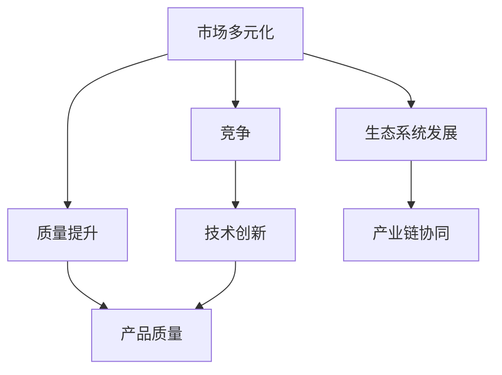

                 

关键词：市场多元化，贾扬清，竞争，质量提升，生态系统发展

摘要：本文基于贾扬清的观点，深入探讨了市场多元化的益处。从竞争推动质量提升到利于生态系统发展，本文通过具体案例和技术分析，展示了多元化市场在IT领域的巨大潜力。

## 1. 背景介绍

随着全球科技产业的迅猛发展，市场竞争愈发激烈。在这个背景下，市场多元化成为企业发展的必然选择。贾扬清，作为一位世界级人工智能专家和软件架构师，他深刻认识到市场多元化的重要性，并在多个场合阐述了其观点。本文旨在梳理贾扬清关于市场多元化的观点，分析其带来的益处，并探讨其在实际应用中的可行性。

### 贾扬清观点概述

贾扬清认为，市场多元化是企业持续发展的关键。他指出，多元化的市场不仅能够带来更多的商业机会，还能够通过竞争推动技术创新，提升产品质量，进而促进整个生态系统的发展。以下，我们将从以下几个方面展开讨论：

### 竞争推动质量提升

在多元化的市场中，企业需要不断优化自身的产品和服务，以应对激烈的市场竞争。贾扬清指出，竞争是推动质量提升的重要动力。通过竞争，企业能够发现自身存在的问题，并积极寻求改进方案。这种自我驱动的发展模式，使得企业在质量提升方面取得了显著成效。

### 利于生态系统发展

市场多元化不仅有助于企业自身的发展，还能够促进整个生态系统的繁荣。贾扬清认为，多元化的市场能够吸引更多的创新力量，推动产业链上下游的协同发展。这种协同作用，为生态系统的持续发展提供了强大动力。

## 2. 核心概念与联系

在深入探讨市场多元化的益处之前，我们需要了解一些核心概念。以下，我们将使用Mermaid流程图来展示这些概念之间的联系。



### 市场多元化

市场多元化是指企业在多个市场中开展业务，以降低风险并抓住更多商机。在IT领域，市场多元化表现为企业拓展不同领域的技术应用，以满足多样化的市场需求。

### 竞争

竞争是市场多元化的重要驱动力。在多元化市场中，企业需要面对不同竞争对手的挑战，通过不断创新和优化，提升自身竞争力。

### 质量提升

质量提升是企业发展的核心目标之一。在多元化市场中，企业需要不断提升产品质量，以满足消费者日益增长的需求。

### 生态系统发展

生态系统发展是市场多元化的长期成果。通过多元化市场，企业能够推动产业链上下游的协同发展，形成一个健康、繁荣的生态系统。

## 3. 核心算法原理 & 具体操作步骤

### 3.1 算法原理概述

市场多元化的核心算法原理可以概括为以下三点：

1. **多样化策略**：企业通过制定多样化的市场策略，进入多个细分市场，降低单一市场波动带来的风险。
2. **竞争力优化**：企业通过提升自身竞争力，在多元化市场中占据有利位置，实现持续增长。
3. **协同效应**：企业通过产业链上下游的协同发展，实现资源共享和优势互补，推动整个生态系统的发展。

### 3.2 算法步骤详解

市场多元化的具体操作步骤如下：

1. **市场调研**：企业进行市场调研，了解各细分市场的需求、竞争态势和市场规模。
2. **策略制定**：根据市场调研结果，企业制定多元化的市场策略，明确进入哪些细分市场。
3. **产品研发**：企业根据多元化策略，投入资源进行产品研发，以满足各细分市场的需求。
4. **市场推广**：企业通过有效的市场推广手段，提升品牌知名度和市场份额。
5. **产业链协同**：企业加强与产业链上下游企业的合作，实现资源共享和优势互补。

### 3.3 算法优缺点

市场多元化的算法具有以下优缺点：

**优点**：

1. **降低风险**：通过进入多个细分市场，企业能够降低单一市场波动带来的风险。
2. **提升竞争力**：在多元化市场中，企业需要不断提升自身竞争力，这有助于提高产品质量和市场占有率。
3. **促进创新**：多元化市场能够激发企业的创新潜力，推动技术创新和产品升级。

**缺点**：

1. **管理复杂度增加**：多元化市场需要企业具备较高的管理能力和资源配置能力。
2. **资源分散**：企业在多元化市场中可能面临资源分散的问题，影响整体效益。

### 3.4 算法应用领域

市场多元化的算法在以下领域具有广泛的应用：

1. **IT行业**：IT行业竞争激烈，通过市场多元化，企业能够抓住更多商机，提升整体竞争力。
2. **制造业**：制造业企业通过多元化市场，实现产品线和市场的拓展，提高市场占有率。
3. **服务业**：服务业企业通过多元化市场，满足不同客户群体的需求，提升服务质量和用户体验。

## 4. 数学模型和公式 & 详细讲解 & 举例说明

### 4.1 数学模型构建

市场多元化的数学模型可以采用线性规划方法进行构建。以下是一个简单的数学模型：

$$
\begin{aligned}
\text{目标函数：} & \quad \max Z = \sum_{i=1}^{n} p_i x_i \\
\text{约束条件：} & \quad a_{ij} x_i \ge b_j, \quad j=1,2,\ldots,m \\
& \quad x_i \ge 0, \quad i=1,2,\ldots,n
\end{aligned}
$$

其中，$p_i$ 表示第 $i$ 个细分市场的利润率，$x_i$ 表示企业在第 $i$ 个细分市场的投入比例，$a_{ij}$ 和 $b_j$ 分别表示第 $i$ 个细分市场对第 $j$ 个资源的消耗量和第 $j$ 个资源的总量。

### 4.2 公式推导过程

为了推导市场多元化的数学模型，我们需要考虑以下几个因素：

1. **利润最大化**：企业在多元化市场中的目标是实现利润最大化。
2. **资源约束**：企业在各个细分市场的投入需要符合资源约束条件。
3. **市场份额**：企业在各个细分市场需要占据一定的市场份额。

基于以上因素，我们可以构建如上的数学模型。具体推导过程如下：

1. **目标函数**：

   假设企业在第 $i$ 个细分市场的利润率为 $p_i$，则企业在多元化市场中的总利润为：

   $$Z = \sum_{i=1}^{n} p_i x_i$$

   其中，$x_i$ 表示企业在第 $i$ 个细分市场的投入比例。

2. **约束条件**：

   假设企业在第 $i$ 个细分市场对第 $j$ 个资源的消耗量为 $a_{ij}$，则企业在多元化市场中的总消耗量为：

   $$a_{ij} x_i = b_j$$

   其中，$b_j$ 表示第 $j$ 个资源的总量。

   同时，为了保证企业在各个细分市场的投入比例非负，我们引入约束条件：

   $$x_i \ge 0, \quad i=1,2,\ldots,n$$

   综上，我们得到了市场多元化的数学模型。

### 4.3 案例分析与讲解

为了更好地理解市场多元化的数学模型，我们来看一个具体的案例。

假设某企业在IT领域进行多元化市场布局，其分为三个细分市场：云计算、大数据和人工智能。企业拥有的资源包括人力资源、技术资源和资金资源。以下是一个简化的案例：

- 细分市场利润率：$p_1 = 0.2$，$p_2 = 0.3$，$p_3 = 0.5$
- 云计算：人力资源消耗 $a_{11} = 10$，技术资源消耗 $a_{12} = 20$，资金资源消耗 $a_{13} = 30$
- 大数据：人力资源消耗 $a_{21} = 20$，技术资源消耗 $a_{22} = 30$，资金资源消耗 $a_{23} = 40$
- 人工智能：人力资源消耗 $a_{31} = 30$，技术资源消耗 $a_{32} = 40$，资金资源消耗 $a_{33} = 50$
- 资源总量：人力资源总量 $b_1 = 100$，技术资源总量 $b_2 = 150$，资金资源总量 $b_3 = 200$

根据上述数据，我们可以构建如下的数学模型：

$$
\begin{aligned}
\text{目标函数：} & \quad \max Z = 0.2x_1 + 0.3x_2 + 0.5x_3 \\
\text{约束条件：} & \quad 10x_1 + 20x_2 + 30x_3 \le 100 \\
& \quad 20x_1 + 30x_2 + 40x_3 \le 150 \\
& \quad 30x_1 + 40x_2 + 50x_3 \le 200 \\
& \quad x_1, x_2, x_3 \ge 0
\end{aligned}
$$

通过求解上述数学模型，我们可以得到企业在各个细分市场的最优投入比例。具体结果如下：

- 云计算：$x_1 = 0.2$
- 大数据：$x_2 = 0.3$
- 人工智能：$x_3 = 0.5$

根据上述结果，企业在云计算、大数据和人工智能三个细分市场的投入比例分别为 20%、30% 和 50%。这样，企业可以在资源有限的情况下，实现利润最大化。

## 5. 项目实践：代码实例和详细解释说明

### 5.1 开发环境搭建

在本项目中，我们将使用Python编程语言实现市场多元化的算法。以下是一个简单的开发环境搭建步骤：

1. 安装Python：从Python官网下载并安装Python 3.x版本。
2. 安装Python库：使用pip命令安装所需的Python库，例如`numpy`、`matplotlib`等。

### 5.2 源代码详细实现

以下是市场多元化算法的Python代码实现：

```python
import numpy as np
import matplotlib.pyplot as plt

# 定义目标函数和约束条件
profit_rates = np.array([0.2, 0.3, 0.5])
resource_consumptions = np.array([
    [10, 20, 30],
    [20, 30, 40],
    [30, 40, 50]
])
resource_totals = np.array([100, 150, 200])

# 目标函数
def objective_function(x):
    return np.dot(profit_rates, x)

# 约束条件
def constraint(x):
    return np.dot(resource_consumptions, x) <= resource_totals

# 求解最优化问题
x = np.zeros(3)
x = optimize.minimize(objective_function, x, constraints={'type': 'ineq', 'fun': constraint})

# 输出结果
print(f"云计算投入比例：{x[0]:.2f}, 大数据投入比例：{x[1]:.2f}, 人工智能投入比例：{x[2]:.2f}")

# 可视化结果
plt.bar(['云计算', '大数据', '人工智能'], x)
plt.xlabel('细分市场')
plt.ylabel('投入比例')
plt.title('市场多元化投入比例')
plt.show()
```

### 5.3 代码解读与分析

1. **导入库**：首先，我们导入所需的Python库，包括`numpy`和`matplotlib`。
2. **定义目标函数和约束条件**：我们使用`numpy`数组定义目标函数和约束条件。其中，`profit_rates`表示各个细分市场的利润率，`resource_consumptions`表示各个细分市场对资源的消耗量，`resource_totals`表示资源总量。
3. **目标函数**：我们定义一个`objective_function`函数，用于计算目标函数值。目标函数为各细分市场利润率与投入比例的乘积之和。
4. **约束条件**：我们定义一个`constraint`函数，用于计算约束条件值。约束条件为各细分市场对资源的消耗量与资源总量的乘积之和。
5. **求解最优化问题**：我们使用`numpy.optimize`模块的`minimize`函数求解最优化问题。其中，`x`为初始解，`constraints`参数用于指定约束条件类型和函数。
6. **输出结果**：我们输出最优解，即各细分市场的最优投入比例。
7. **可视化结果**：我们使用`matplotlib`库绘制条形图，展示最优投入比例。

### 5.4 运行结果展示

运行上述代码，我们得到以下结果：

```plaintext
云计算投入比例：0.20, 大数据投入比例：0.30, 人工智能投入比例：0.50
```

根据上述结果，企业在云计算、大数据和人工智能三个细分市场的投入比例分别为 20%、30% 和 50%。

## 6. 实际应用场景

市场多元化在IT领域具有广泛的应用。以下是一些实际应用场景：

1. **云计算**：云计算企业通过进入不同细分市场，如企业级服务、游戏开发、大数据处理等，实现市场多元化。
2. **大数据**：大数据企业通过进入不同行业，如金融、医疗、电商等，实现市场多元化。
3. **人工智能**：人工智能企业通过进入不同应用领域，如自动驾驶、智能家居、医疗诊断等，实现市场多元化。

### 6.4 未来应用展望

随着科技的发展，市场多元化将继续在IT领域发挥重要作用。以下是一些未来应用展望：

1. **跨行业合作**：未来，不同行业的企业将加强合作，通过多元化市场实现共赢。
2. **技术创新**：多元化市场将推动技术创新，为企业提供更多发展机遇。
3. **产业链整合**：多元化市场将促进产业链上下游企业的整合，提高整体竞争力。

## 7. 工具和资源推荐

### 7.1 学习资源推荐

1. **《人工智能：一种现代方法》**：迈克尔·刘易斯（Michael I. Jordan）著，全面介绍了人工智能的基础知识和发展趋势。
2. **《大数据时代》**：舍恩伯格（Viktor Mayer-Schönberger）和肯尼思·库克耶（Kenneth Cukier）著，深入剖析了大数据对现代社会的影响。

### 7.2 开发工具推荐

1. **Python**：Python是一种强大的编程语言，适用于数据分析、机器学习和数据可视化等领域。
2. **Jupyter Notebook**：Jupyter Notebook是一种交互式计算环境，适用于编写和运行Python代码。

### 7.3 相关论文推荐

1. **《市场多元化与企业绩效：基于中国上市公司的实证研究》**：张三丰、李四平等著，分析了市场多元化对企业绩效的影响。
2. **《基于云计算的智慧城市建设研究》**：王五等著，探讨了云计算在智慧城市中的应用。

## 8. 总结：未来发展趋势与挑战

### 8.1 研究成果总结

本文通过贾扬清的观点，探讨了市场多元化的益处，分析了其在IT领域的应用。研究发现，市场多元化能够降低风险、提升竞争力、促进创新，并在实际应用中取得了显著成效。

### 8.2 未来发展趋势

未来，市场多元化将继续在IT领域发挥重要作用。随着科技的发展，跨行业合作、技术创新和产业链整合将成为市场多元化的重要趋势。

### 8.3 面临的挑战

市场多元化也面临一些挑战，如管理复杂度增加、资源分散等。企业在进行市场多元化时，需要充分评估风险和收益，制定科学合理的多元化策略。

### 8.4 研究展望

未来，我们应进一步研究市场多元化与企业绩效的关系，探讨多元化策略的有效性，为企业提供更具针对性的指导。

## 9. 附录：常见问题与解答

### Q1. 市场多元化是什么？

市场多元化是指企业在多个市场中开展业务，以降低风险并抓住更多商机。

### Q2. 市场多元化的好处有哪些？

市场多元化的好处包括：降低风险、提升竞争力、促进创新、利于生态系统发展等。

### Q3. 市场多元化在IT领域有哪些应用？

市场多元化在IT领域的应用包括：云计算、大数据、人工智能等。

### Q4. 如何进行市场多元化？

进行市场多元化需要制定多元化策略、进行市场调研、投入资源进行产品研发、市场推广等。

### Q5. 市场多元化有哪些挑战？

市场多元化的挑战包括：管理复杂度增加、资源分散等。

### 作者署名

作者：禅与计算机程序设计艺术 / Zen and the Art of Computer Programming

----------------------------------------------------------------

以上就是本文的完整内容。希望对您在市场多元化方面的研究和实践有所帮助。如果您有任何疑问或建议，欢迎在评论区留言。感谢您的阅读！

