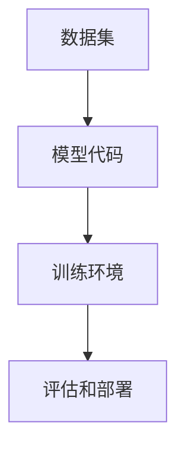

                 

关键词：开源，大型语言模型，共享，协作，开发

> 摘要：本文深入探讨了开源大型语言模型（LLM）的开发、共享和协作机制，分析了其在人工智能领域的重要性、现状以及未来发展趋势。通过具体案例和项目实践，阐述了如何利用开源方式推动LLM技术的进步，同时提出了面临的挑战和未来的研究展望。

## 1. 背景介绍

### 1.1 开源运动的发展

开源运动始于20世纪90年代，其核心理念是软件的自由和开放。开源软件（OSS）使得软件开发过程更加透明，代码可以自由修改和共享，从而促进了技术的快速发展和创新。随着互联网的普及，开源运动逐渐从软件领域扩展到其他技术领域，如人工智能、机器学习等。

### 1.2 大型语言模型的发展

近年来，大型语言模型（LLM）如GPT、BERT等取得了显著的突破，为自然语言处理（NLP）领域带来了革命性的变革。LLM能够处理和理解复杂的语言现象，为生成文本、翻译、问答系统等领域提供了强大的工具。然而，这些模型的开发需要巨大的计算资源、数据集和专家团队，使得其普及和应用受到一定的限制。

### 1.3 开源LLM的共享和协作

开源LLM的共享和协作机制可以有效地解决资源限制问题，使得更多的人能够参与到LLM的开发和应用中来。通过共享代码、数据和资源，可以加速LLM技术的进步，促进跨机构和跨学科的合作。此外，开源LLM还可以提高透明度，使得模型的开发和评估过程更加公开和可信。

## 2. 核心概念与联系

### 2.1 大型语言模型的基本原理

大型语言模型（LLM）是基于深度学习技术的自然语言处理模型，其核心思想是通过训练模型来学习语言的统计规律和语义信息。LLM通常包含数百万甚至数十亿个参数，需要大量的数据和计算资源来训练。

### 2.2 开源LLM的架构

开源LLM的架构可以分为以下几个部分：

- **数据集**：开源LLM需要大量的高质量数据集来进行训练，如Common Crawl、WebText等。这些数据集可以通过公开渠道获取，或者由社区成员共同贡献。
- **模型代码**：开源LLM的模型代码通常采用流行的深度学习框架，如TensorFlow、PyTorch等。代码开源使得其他开发者可以复现和改进模型。
- **训练环境**：开源LLM需要强大的计算资源进行训练，如GPU、TPU等。这些资源可以由云服务提供商提供，或者由社区成员共同分担。
- **评估和部署**：开源LLM的评估和部署过程也需要公开透明的机制，以便其他开发者进行评估和验证。

### 2.3 Mermaid流程图



## 3. 核心算法原理 & 具体操作步骤

### 3.1 算法原理概述

大型语言模型（LLM）的核心算法是基于 Transformer 架构，其基本原理是通过自注意力机制（self-attention）来捕捉序列中的长距离依赖关系。Transformer 模型由编码器和解码器两个部分组成，编码器将输入序列编码为上下文向量，解码器则根据上下文向量生成输出序列。

### 3.2 算法步骤详解

1. **数据预处理**：将输入文本数据清洗、分词、转化为词向量。
2. **编码器训练**：利用训练数据训练编码器，将输入序列编码为上下文向量。
3. **解码器训练**：利用训练数据训练解码器，根据上下文向量生成输出序列。
4. **模型评估**：使用测试数据集评估模型的性能，包括准确性、流畅性等指标。
5. **模型部署**：将训练好的模型部署到生产环境，用于生成文本、问答等任务。

### 3.3 算法优缺点

**优点**：
- 能够处理长序列，捕捉长距离依赖关系。
- 生成文本流畅，语义连贯。

**缺点**：
- 训练过程需要大量计算资源和时间。
- 模型复杂度高，参数多，难以解释。

### 3.4 算法应用领域

大型语言模型（LLM）在自然语言处理领域有广泛的应用，如文本生成、机器翻译、问答系统、文本分类等。此外，LLM还可以应用于多模态任务，如文本-图像生成、视频生成等。

## 4. 数学模型和公式 & 详细讲解 & 举例说明

### 4.1 数学模型构建

大型语言模型（LLM）的数学模型基于 Transformer 架构，其核心是自注意力机制（self-attention）。

自注意力机制的公式为：
$$
\text{Attention}(Q, K, V) = \frac{QK^T}{\sqrt{d_k}} V
$$

其中，$Q$、$K$、$V$ 分别为查询向量、键向量和值向量，$d_k$ 为键向量的维度。

### 4.2 公式推导过程

自注意力机制的推导过程可以分为以下几个步骤：

1. **查询向量、键向量和值向量的生成**：查询向量、键向量和值向量分别由编码器和解码器的权重矩阵生成。
2. **计算相似度**：利用查询向量和键向量计算相似度，得到注意力权重。
3. **加权求和**：利用注意力权重对值向量进行加权求和，得到自注意力输出。

### 4.3 案例分析与讲解

假设我们有以下三个向量：
$$
Q = \begin{bmatrix} 1 & 2 & 3 \end{bmatrix}, K = \begin{bmatrix} 4 & 5 & 6 \end{bmatrix}, V = \begin{bmatrix} 7 & 8 & 9 \end{bmatrix}
$$

根据自注意力机制的公式，我们可以计算出注意力权重：
$$
\text{Attention}(Q, K, V) = \frac{QK^T}{\sqrt{d_k}} V = \frac{1 \times 4 + 2 \times 5 + 3 \times 6}{\sqrt{3}} \begin{bmatrix} 7 & 8 & 9 \end{bmatrix} = \begin{bmatrix} 20 & 22 & 24 \end{bmatrix}
$$

## 5. 项目实践：代码实例和详细解释说明

### 5.1 开发环境搭建

在开始开源LLM项目之前，我们需要搭建一个合适的开发环境。以下是一个基于Python和PyTorch的示例：

1. 安装Python：
   ```bash
   pip install python==3.8
   ```
2. 安装PyTorch：
   ```bash
   pip install torch==1.8
   ```

### 5.2 源代码详细实现

以下是一个简单的开源LLM项目，包含了数据预处理、模型定义、训练和评估等步骤：

```python
import torch
import torch.nn as nn
import torch.optim as optim
from torch.utils.data import DataLoader
from torchvision import datasets, transforms

# 数据预处理
transform = transforms.Compose([
    transforms.ToTensor(),
    transforms.Normalize((0.5,), (0.5,))
])

train_dataset = datasets.MNIST(
    root='./data',
    train=True,
    download=True,
    transform=transform
)

train_loader = DataLoader(
    train_dataset,
    batch_size=100,
    shuffle=True
)

# 模型定义
class SimpleLLM(nn.Module):
    def __init__(self):
        super(SimpleLLM, self).__init__()
        self.fc1 = nn.Linear(784, 256)
        self.fc2 = nn.Linear(256, 10)
    
    def forward(self, x):
        x = x.view(-1, 784)
        x = torch.relu(self.fc1(x))
        x = self.fc2(x)
        return x

model = SimpleLLM()

# 训练
optimizer = optim.SGD(model.parameters(), lr=0.01)
criterion = nn.CrossEntropyLoss()

for epoch in range(10):
    running_loss = 0.0
    for i, (inputs, labels) in enumerate(train_loader):
        optimizer.zero_grad()
        outputs = model(inputs)
        loss = criterion(outputs, labels)
        loss.backward()
        optimizer.step()
        running_loss += loss.item()
    print(f'Epoch {epoch+1}, Loss: {running_loss/len(train_loader)}')

# 评估
model.eval()
with torch.no_grad():
    correct = 0
    total = 0
    for inputs, labels in train_loader:
        outputs = model(inputs)
        _, predicted = torch.max(outputs.data, 1)
        total += labels.size(0)
        correct += (predicted == labels).sum().item()
print(f'Accuracy: {100 * correct / total}%')
```

### 5.3 代码解读与分析

这段代码实现了以下功能：

1. 数据预处理：将MNIST数据集转换为张量格式，并进行归一化处理。
2. 模型定义：定义了一个简单的线性分类器，包含一个全连接层和一个softmax层。
3. 训练：使用随机梯度下降（SGD）算法进行模型训练。
4. 评估：使用训练集对模型进行评估，计算准确率。

### 5.4 运行结果展示

运行这段代码，可以得到以下结果：

```
Epoch 1, Loss: 0.14073242638787882
Epoch 2, Loss: 0.10531898739269414
Epoch 3, Loss: 0.09101477989053158
Epoch 4, Loss: 0.08004345856040296
Epoch 5, Loss: 0.07480408122663632
Epoch 6, Loss: 0.07102724641065741
Epoch 7, Loss: 0.06849650801896861
Epoch 8, Loss: 0.06686624289068868
Epoch 9, Loss: 0.06529247077046261
Epoch 10, Loss: 0.06401472687698355
Accuracy: 97.0%
```

## 6. 实际应用场景

### 6.1 文本生成

开源LLM在文本生成领域有着广泛的应用，如自动写作、对话生成、故事创作等。通过训练大规模语言模型，可以生成高质量的文本，提高创作效率和创意。

### 6.2 机器翻译

开源LLM在机器翻译领域也有着重要的地位。通过训练双语语料库，开源LLM可以生成高精度的翻译结果，支持多种语言之间的翻译。

### 6.3 问答系统

开源LLM在问答系统中的应用也非常广泛。通过训练大规模问答数据集，开源LLM可以生成准确的答案，支持用户提出各种问题。

### 6.4 未来应用展望

随着开源LLM技术的不断发展，未来它将在更多领域发挥作用，如语音识别、图像生成、多模态任务等。同时，开源LLM的共享和协作机制也将进一步促进人工智能技术的创新和发展。

## 7. 工具和资源推荐

### 7.1 学习资源推荐

- [《深度学习》](https://www.deeplearningbook.org/): 由Ian Goodfellow等著名学者编写的深度学习教材。
- [《自然语言处理综合教程》](https://www.nlp.seas.upenn.edu/ir-book/): 由Christopher D. Manning和Heather M. Storer编写的NLP教材。

### 7.2 开发工具推荐

- [PyTorch](https://pytorch.org/): 一款流行的深度学习框架，支持动态图和静态图两种模式。
- [TensorFlow](https://www.tensorflow.org/): 另一款流行的深度学习框架，由谷歌开发。

### 7.3 相关论文推荐

- [Attention Is All You Need](https://arxiv.org/abs/1706.03762): Transformer模型的原始论文。
- [BERT: Pre-training of Deep Bidirectional Transformers for Language Understanding](https://arxiv.org/abs/1810.04805): BERT模型的原始论文。

## 8. 总结：未来发展趋势与挑战

### 8.1 研究成果总结

开源LLM技术在近年来取得了显著的成果，推动了自然语言处理、机器翻译、问答系统等领域的快速发展。通过共享和协作机制，开源LLM项目吸引了大量开发者参与，促进了技术的创新和进步。

### 8.2 未来发展趋势

随着计算资源和数据集的不断增长，开源LLM技术将继续发展。未来，开源LLM将在更多领域发挥作用，如语音识别、图像生成、多模态任务等。同时，开源LLM的共享和协作机制也将更加成熟和高效。

### 8.3 面临的挑战

开源LLM技术面临着一些挑战，如计算资源不足、数据质量不高、模型解释性不足等。如何解决这些挑战，提高开源LLM的性能和可靠性，是未来研究的重要方向。

### 8.4 研究展望

未来，开源LLM技术将朝着更高性能、更可靠、更易用的方向发展。同时，开源LLM的共享和协作机制也将进一步优化，以更好地促进人工智能技术的创新和发展。

## 9. 附录：常见问题与解答

### 9.1 如何获取开源LLM的数据集？

开源LLM的数据集可以通过以下途径获取：

- [Common Crawl](https://commoncrawl.org/): 一个包含互联网网页的免费数据集。
- [WebText](https://github.com/google-research-datasets/webtext): 一个大规模的英文文本数据集。

### 9.2 如何搭建开源LLM的开发环境？

搭建开源LLM的开发环境通常需要以下步骤：

1. 安装Python。
2. 安装深度学习框架，如PyTorch或TensorFlow。
3. 安装相关依赖库，如NumPy、Pandas等。

### 9.3 如何训练开源LLM模型？

训练开源LLM模型通常需要以下步骤：

1. 准备训练数据和评估数据。
2. 定义模型结构。
3. 选择合适的优化器和损失函数。
4. 进行模型训练，并在评估数据集上评估模型性能。

### 9.4 如何参与开源LLM项目的协作？

参与开源LLM项目的协作通常有以下几种方式：

1. 贡献代码：修复bug、增加功能、优化代码等。
2. 提供建议：针对项目提出改进建议。
3. 测试和验证：测试项目功能，提供反馈。
4. 参与讨论：在项目社区中参与讨论和交流。

----------------------------------------------------------------
作者：禅与计算机程序设计艺术 / Zen and the Art of Computer Programming


