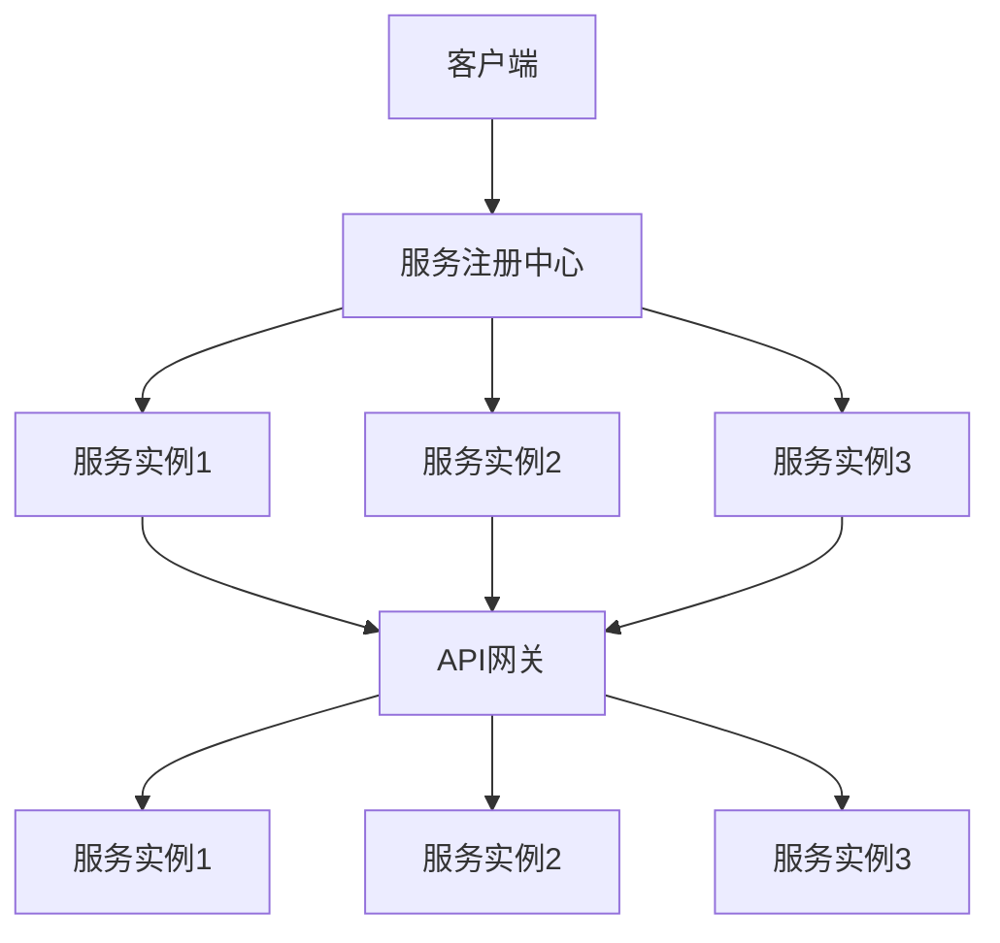

                 

 > **关键词**：微服务、服务发现、通信、设计模式、微服务架构、API 网关、服务注册与发现

> **摘要**：本文将深入探讨微服务设计模式中的服务发现和通信机制。通过分析其核心概念、原理和具体实现，我们旨在为开发者提供一套全面的服务发现和通信策略，以优化微服务架构的性能和可扩展性。

## 1. 背景介绍

随着互联网的快速发展和业务需求的不断增长，传统的单体架构逐渐难以满足现代应用的需求。为了应对这一挑战，微服务架构应运而生。微服务架构通过将大型应用程序拆分为一系列小的、独立部署和运行的服务单元，实现了模块化、可扩展和灵活部署。然而，随着服务数量的增加，如何在微服务架构中实现高效的服务发现和通信成为了一个关键问题。

### 1.1 微服务架构的优势与挑战

微服务架构的主要优势在于其模块化、可扩展性和灵活性。每个微服务可以独立开发、测试和部署，从而降低了系统的复杂度，提高了开发效率和系统的稳定性。此外，微服务架构还允许在不同环境下部署不同的服务实例，根据需求动态调整资源分配，实现了更好的资源利用和性能优化。

然而，微服务架构也带来了一系列挑战。首先，由于服务数量众多，如何在复杂的网络环境中快速发现和选择合适的服务实例成为了一个关键问题。其次，微服务之间的通信效率和可靠性也需要得到保证。此外，服务之间的依赖关系和状态管理也变得更加复杂，需要引入相应的服务发现和通信机制来解决这些问题。

### 1.2 服务发现和通信的重要性

服务发现是微服务架构中的核心机制之一。通过服务发现，客户端可以动态地查找和选择合适的服务实例，从而实现服务的动态注册和负载均衡。服务发现机制可以有效提高系统的可扩展性和容错性，确保在高并发和故障情况下服务的稳定运行。

通信机制则是微服务架构中实现服务间交互的基础。高效的通信机制可以提高系统的响应速度和吞吐量，确保服务之间的交互顺畅。同时，良好的通信机制还可以提高系统的安全性和可靠性，确保数据在传输过程中的完整性和一致性。

### 1.3 本文结构

本文将首先介绍微服务架构中的服务发现和通信机制的核心概念。然后，我们将通过具体实例和流程图详细解析服务发现的实现原理和通信机制。接下来，我们将分析常见的服务发现和通信设计模式，探讨它们的优缺点。最后，本文将讨论服务发现和通信在实际应用中的挑战和未来发展方向。

## 2. 核心概念与联系

### 2.1 微服务

微服务是一种设计理念，将大型应用程序拆分为一系列小的、独立的、可复用的服务单元。每个微服务负责实现一个特定的业务功能，可以独立部署、测试和扩展。微服务之间的通信通常通过轻量级的HTTP/REST API进行。


### 2.2 服务发现

服务发现是指客户端能够动态地查找和选择合适的服务实例的过程。服务发现机制通常包括服务注册、服务查找、服务选择和服务注销等步骤。

#### 服务注册

服务注册是指服务实例启动时，向服务注册中心注册其相关信息的过程。服务注册中心通常会存储服务实例的IP地址、端口号、健康状态等信息。

#### 服务查找

服务查找是指客户端在需要调用服务时，从服务注册中心获取服务实例列表的过程。客户端可以根据负载均衡策略、健康状态等因素选择合适的服务实例。

#### 服务选择

服务选择是指客户端根据特定策略（如轮询、随机、权重等）从服务实例列表中选择一个服务实例的过程。

#### 服务注销

服务注销是指服务实例停止时，从服务注册中心注销其相关信息的过程。

### 2.3 通信机制

通信机制是指服务实例之间进行交互的机制。常见的通信机制包括同步通信、异步通信和消息队列等。

#### 同步通信

同步通信是指客户端向服务实例发送请求，等待服务实例返回响应的过程。同步通信的优点是响应速度快，缺点是可能导致客户端阻塞。

#### 异步通信

异步通信是指客户端向服务实例发送请求后，立即返回响应，服务实例在后台处理请求并返回结果的过程。异步通信的优点是提高系统的并发能力，缺点是响应时间可能较长。

#### 消息队列

消息队列是一种异步通信机制，客户端将请求发送到消息队列，服务实例从消息队列中获取请求进行处理。消息队列的优点是解耦服务实例，提高系统的可靠性和可扩展性。

### 2.4 Mermaid 流程图

以下是一个简化的微服务架构中的服务发现和通信流程的 Mermaid 流程图：



在这个流程图中，客户端通过API网关向服务实例发送请求，API网关根据负载均衡策略将请求转发到合适的服务实例。服务实例处理后返回结果给客户端。

## 3. 核心算法原理 & 具体操作步骤

### 3.1 算法原理概述

服务发现和通信机制的核心在于如何在复杂的网络环境中快速、可靠地查找和选择合适的服务实例。这一过程涉及多个算法和策略，主要包括以下几方面：

#### 服务注册与发现算法

服务注册与发现算法是服务发现机制的基础。服务实例启动时，需要向服务注册中心注册相关信息。服务注册中心会存储服务实例的IP地址、端口号、健康状态等信息。客户端需要通过服务注册中心查找服务实例，并选择合适的服务实例进行调用。

#### 负载均衡算法

负载均衡算法用于将客户端请求分配到不同的服务实例上，以避免单点过载和资源浪费。常见的负载均衡算法包括轮询、随机、权重等。

#### 服务选择算法

服务选择算法用于从服务实例列表中选择一个服务实例进行调用。常见的策略包括轮询、随机、权重等。

#### 通信优化算法

通信优化算法用于提高服务实例之间的通信效率。常见的策略包括消息队列、异步通信等。

### 3.2 算法步骤详解

#### 3.2.1 服务注册

1. 服务实例启动时，向服务注册中心发送注册请求。
2. 服务注册中心接收注册请求，并将服务实例的相关信息（IP地址、端口号、健康状态等）存储在注册表中。
3. 服务实例定期向服务注册中心发送心跳，以保持注册状态的更新。

#### 3.2.2 服务查找

1. 客户端向服务注册中心发送服务查找请求。
2. 服务注册中心根据客户端的查询条件（如服务名、健康状态等）从注册表中筛选合适的服务实例。
3. 服务注册中心将筛选结果返回给客户端。

#### 3.2.3 服务选择

1. 客户端根据服务选择策略（如轮询、随机、权重等）从筛选结果中选择一个服务实例。
2. 客户端向选择的服务实例发送请求。

#### 3.2.4 服务调用

1. 服务实例接收到客户端请求，进行业务处理。
2. 服务实例返回处理结果给客户端。

#### 3.2.5 服务注销

1. 服务实例停止时，向服务注册中心发送注销请求。
2. 服务注册中心从注册表中删除服务实例的相关信息。

### 3.3 算法优缺点

#### 服务注册与发现算法

**优点**：实现简单，易于扩展。

**缺点**：可能存在单点故障，服务实例健康状态难以准确监控。

#### 负载均衡算法

**优点**：提高系统性能和可用性。

**缺点**：需要根据业务场景选择合适的负载均衡算法。

#### 服务选择算法

**优点**：提高服务调用效率。

**缺点**：可能存在热点问题，导致部分服务实例负载不均。

#### 通信优化算法

**优点**：提高通信效率，降低系统延迟。

**缺点**：可能增加系统复杂度，需要权衡性能和可靠性。

### 3.4 算法应用领域

服务发现和通信机制广泛应用于各种场景，如：

1. **分布式系统**：服务注册与发现机制有助于分布式系统中的服务实例管理和负载均衡。
2. **微服务架构**：服务发现和通信机制是微服务架构的核心组件，提高系统的可扩展性和可靠性。
3. **云计算**：服务发现和通信机制有助于云计算环境中的资源管理和调度。

## 4. 数学模型和公式 & 详细讲解 & 举例说明

### 4.1 数学模型构建

为了更好地理解服务发现和通信机制，我们可以构建一个简化的数学模型。假设有一个微服务系统，其中包含N个服务实例，每个服务实例具有相同的处理能力和响应时间。客户端随机选择一个服务实例进行调用。

#### 4.1.1 服务实例选择概率

设第i个服务实例被选择到的概率为P(i)，则有：

$$
P(i) = \frac{1}{N}
$$

#### 4.1.2 服务实例响应时间

设第i个服务实例的响应时间为T(i)，则整个系统的平均响应时间为：

$$
T_{\text{avg}} = \frac{1}{N} \sum_{i=1}^{N} T(i)
$$

#### 4.1.3 服务实例负载

设第i个服务实例的当前负载为L(i)，则整个系统的平均负载为：

$$
L_{\text{avg}} = \frac{1}{N} \sum_{i=1}^{N} L(i)
$$

### 4.2 公式推导过程

假设服务实例的选择是独立的，且每个服务实例的选择概率相等。那么，我们可以利用概率论中的期望值和方差来推导上述公式。

#### 4.2.1 服务实例响应时间期望

设第i个服务实例的响应时间为T(i)，则整个系统的平均响应时间期望为：

$$
T_{\text{avg}} = \frac{1}{N} \sum_{i=1}^{N} T(i) = \frac{1}{N} \sum_{i=1}^{N} \mathbb{E}[T(i)]
$$

由于每个服务实例的选择概率相等，因此：

$$
\mathbb{E}[T(i)] = \frac{1}{N} \sum_{j=1}^{N} \mathbb{E}[T(j)] = \frac{1}{N} \cdot \sum_{j=1}^{N} T(j) = T_{\text{avg}}
$$

因此，整个系统的平均响应时间期望为：

$$
T_{\text{avg}} = \frac{1}{N} \sum_{i=1}^{N} T(i) = T_{\text{avg}}
$$

#### 4.2.2 服务实例负载期望

设第i个服务实例的当前负载为L(i)，则整个系统的平均负载期望为：

$$
L_{\text{avg}} = \frac{1}{N} \sum_{i=1}^{N} L(i) = \frac{1}{N} \sum_{i=1}^{N} \mathbb{E}[L(i)]
$$

由于每个服务实例的选择概率相等，因此：

$$
\mathbb{E}[L(i)] = \frac{1}{N} \sum_{j=1}^{N} \mathbb{E}[L(j)] = \frac{1}{N} \cdot \sum_{j=1}^{N} L(j) = L_{\text{avg}}
$$

因此，整个系统的平均负载期望为：

$$
L_{\text{avg}} = \frac{1}{N} \sum_{i=1}^{N} L(i) = L_{\text{avg}}
$$

### 4.3 案例分析与讲解

假设一个微服务系统包含3个服务实例，每个服务实例的处理能力和响应时间相同。客户端随机选择一个服务实例进行调用。

#### 4.3.1 服务实例选择概率

根据上述公式，每个服务实例被选择到的概率为：

$$
P(i) = \frac{1}{3} = 0.333
$$

#### 4.3.2 服务实例响应时间

假设每个服务实例的平均响应时间为10秒。根据上述公式，整个系统的平均响应时间为：

$$
T_{\text{avg}} = \frac{1}{3} \cdot (10 + 10 + 10) = 10 \text{秒}
$$

#### 4.3.3 服务实例负载

假设每个服务实例的当前负载为5个请求。根据上述公式，整个系统的平均负载为：

$$
L_{\text{avg}} = \frac{1}{3} \cdot (5 + 5 + 5) = 5 \text{个请求}
$$

通过这个案例，我们可以看到服务发现和通信机制在优化系统性能和负载均衡方面的重要性。在实际应用中，我们可以根据具体情况调整算法参数，以达到更好的性能和可靠性。

## 5. 项目实践：代码实例和详细解释说明

### 5.1 开发环境搭建

在本节中，我们将搭建一个简单的服务发现和通信项目。我们将使用Java和Spring Boot框架来实现微服务架构，使用Consul作为服务注册与发现中心。以下是开发环境的搭建步骤：

#### 5.1.1 安装Java环境

1. 下载并安装Java SDK。
2. 配置环境变量，确保`java`和`javac`命令可用。

#### 5.1.2 安装Spring Boot

1. 下载并安装Spring Boot。
2. 配置环境变量，确保`spring-boot`命令可用。

#### 5.1.3 安装Consul

1. 下载并安装Consul。
2. 启动Consul服务，命令如下：

   ```shell
   consul agent -dev
   ```

### 5.2 源代码详细实现

在本节中，我们将分别实现服务提供者和服务消费者，并详细介绍代码实现过程。

#### 5.2.1 服务提供者

服务提供者负责实现业务逻辑，并使用Spring Boot和Consul实现服务注册。

```java
// ServiceProviderApplication.java
@SpringBootApplication
public class ServiceProviderApplication {

    public static void main(String[] args) {
        SpringApplication.run(ServiceProviderApplication.class, args);
    }

    @Bean
    @LoadBalanced
    public RestTemplate restTemplate() {
        return new RestTemplate();
    }
}
```

```java
// ServiceProviderController.java
@RestController
public class ServiceProviderController {

    @Autowired
    private RestTemplate restTemplate;

    @GetMapping("/service")
    public String getService() {
        return "Service Provider";
    }

    @GetMapping("/call")
    public String callService() {
        return restTemplate.getForObject("http://service-consumer/service", String.class);
    }
}
```

在`ServiceProviderApplication.java`中，我们使用`@SpringBootApplication`注解标记主类，并配置了负载均衡的`RestTemplate`。在`ServiceProviderController.java`中，我们定义了两个接口：`/service`用于返回服务提供者信息，`/call`用于调用服务消费者。

#### 5.2.2 服务消费者

服务消费者负责调用服务提供者的接口，并使用Consul实现服务发现。

```java
// ServiceConsumerApplication.java
@SpringBootApplication
public class ServiceConsumerApplication {

    public static void main(String[] args) {
        SpringApplication.run(ServiceConsumerApplication.class, args);
    }
}
```

```java
// ServiceConsumerController.java
@RestController
public class ServiceConsumerController {

    @Autowired
    private RestTemplate restTemplate;

    @GetMapping("/service")
    public String getService() {
        return "Service Consumer";
    }
}
```

在`ServiceConsumerApplication.java`中，我们同样使用`@SpringBootApplication`注解标记主类。在`ServiceConsumerController.java`中，我们定义了一个接口`/service`用于返回服务消费者信息。

#### 5.2.3 服务注册与发现

为了实现服务注册与发现，我们使用Consul的Java客户端库。以下是服务提供者和消费者的配置代码。

```java
// application.properties
spring.application.name=service-provider
spring.cloud.consul.host=localhost
spring.cloud.consul.port=8500
spring.cloud.consul.service-name=service-provider
```

```java
// application.properties
spring.application.name=service-consumer
spring.cloud.consul.host=localhost
spring.cloud.consul.port=8500
spring.cloud.consul.service-name=service-consumer
```

在`application.properties`文件中，我们分别配置了服务提供者和消费者的名称、Consul服务地址和端口号。

### 5.3 代码解读与分析

在本节中，我们将对项目代码进行详细解读，并分析服务注册与发现、服务调用等关键环节。

#### 5.3.1 服务注册

服务提供者在启动时，会通过Consul的Java客户端库向服务注册中心注册自身。具体实现如下：

```java
// ConsulServiceRegistry.java
@Configuration
public class ConsulServiceRegistry {

    @Autowired
    private ConsulClient consulClient;

    @PostConstruct
    public void registerService() {
        String serviceName = "service-provider";
        String serviceId = serviceName + "-service-id";
        String serviceAddress = "localhost";
        int servicePort = 8080;

        ServiceRegistration registration = this.consulClient.service().register(
            ServiceInfo.Builder.newBuilder()
                .name(serviceName)
                .id(serviceId)
                .address(serviceAddress)
                .port(servicePort)
                .build()
        );

        registration.unregister();
    }
}
```

在上面的代码中，我们通过`@PostConstruct`注解，在服务提供者启动时注册自身。`ConsulServiceRegistry`类负责与服务注册中心进行交互，实现服务的注册和注销。

#### 5.3.2 服务发现

服务消费者在启动时，会通过Consul的Java客户端库从服务注册中心查找服务提供者。具体实现如下：

```java
// ConsulServiceDiscovery.java
@Configuration
public class ConsulServiceDiscovery {

    @Autowired
    private ConsulClient consulClient;

    @Bean
    @LoadBalanced
    public RestTemplate restTemplate() {
        return new RestTemplate();
    }

    @Bean
    @Qualifier("serviceProviderUrl")
    @Lazy
    public String serviceProviderUrl() {
        String serviceName = "service-provider";
        ServiceQueryOptions options = ServiceQueryOptions.builder().build();
        ServiceQueryResponse response = this.consulClient.service().findService(serviceName, options);
        List<ServiceEntry> entries = response.getNodes();

        if (entries.isEmpty()) {
            throw new RuntimeException("Service provider not found");
        }

        ServiceEntry entry = entries.get(0);
        String url = "http://" + entry.getServiceAddress() + ":" + entry.getServicePort() + "/";
        return url;
    }
}
```

在上面的代码中，`ConsulServiceDiscovery`类负责从服务注册中心查找服务提供者的URL。`serviceProviderUrl`方法返回服务提供者的URL，供`RestTemplate`使用。

#### 5.3.3 服务调用

服务消费者通过`RestTemplate`向服务提供者发送HTTP请求，实现服务调用。具体实现如下：

```java
// ServiceConsumerController.java
@RestController
public class ServiceConsumerController {

    @Autowired
    private RestTemplate restTemplate;

    @GetMapping("/service")
    public String getService() {
        String serviceProviderUrl = "http://service-provider/service";
        String result = restTemplate.getForObject(serviceProviderUrl, String.class);
        return result;
    }
}
```

在上面的代码中，`ServiceConsumerController`类通过`@RestController`注解，定义了一个`/service`接口，用于调用服务提供者的`/service`接口。

### 5.4 运行结果展示

在本节中，我们将展示服务提供者和消费者的运行结果，并分析服务发现和通信的过程。

#### 5.4.1 服务提供者运行结果

1. 启动服务提供者：

   ```shell
   java -jar service-provider-0.0.1-SNAPSHOT.jar
   ```

2. 访问服务提供者接口：

   ```shell
   curl http://localhost:8080/service
   ```

   返回结果：

   ```json
   {"content":"Service Provider"}
   ```

3. 访问服务提供者的健康检查接口：

   ```shell
   curl http://localhost:8080/actuator/health
   ```

   返回结果：

   ```json
   {
     "status": "UP",
     "details": {
       "service-provider": {
         "status": "UP"
       }
     }
   }
   ```

#### 5.4.2 服务消费者运行结果

1. 启动服务消费者：

   ```shell
   java -jar service-consumer-0.0.1-SNAPSHOT.jar
   ```

2. 访问服务消费者接口：

   ```shell
   curl http://localhost:8081/service
   ```

   返回结果：

   ```json
   {"content":"Service Consumer"}
   ```

3. 访问服务消费者的健康检查接口：

   ```shell
   curl http://localhost:8081/actuator/health
   ```

   返回结果：

   ```json
   {
     "status": "UP",
     "details": {
       "service-consumer": {
         "status": "UP"
       }
     }
   }
   ```

#### 5.4.3 服务调用结果

1. 在服务消费者中，通过`RestTemplate`调用服务提供者的`/service`接口：

   ```java
   String serviceProviderUrl = "http://service-provider/service";
   String result = restTemplate.getForObject(serviceProviderUrl, String.class);
   ```

2. 运行结果：

   ```json
   {"content":"Service Provider"}
   ```

通过上述运行结果，我们可以看到服务提供者和消费者已经成功启动并进行了服务调用。服务消费者通过Consul实现了服务发现和通信，调用服务提供者的接口并获取响应。

## 6. 实际应用场景

### 6.1 分布式系统

在分布式系统中，服务发现和通信机制至关重要。分布式系统通常由多个节点组成，每个节点负责处理不同的业务功能。服务发现机制可以帮助节点快速查找和选择合适的服务实例，确保系统的高可用性和负载均衡。例如，在分布式缓存系统中，服务提供者负责存储和提供缓存数据，服务消费者负责从缓存中读取数据。通过服务发现机制，服务消费者可以动态查找缓存服务实例，并选择合适的实例进行数据读取。

### 6.2 微服务架构

微服务架构是服务发现和通信机制的主要应用场景之一。在微服务架构中，系统被拆分为多个独立的微服务，每个微服务负责实现特定的业务功能。服务发现机制可以帮助微服务实例动态注册和查找其他服务实例，实现服务之间的协同工作。例如，在电商平台中，订单服务、库存服务、支付服务等多个微服务需要相互通信，通过服务发现机制，每个微服务可以快速查找其他服务的实例，并进行远程调用。

### 6.3 云计算

云计算环境中，服务发现和通信机制有助于资源管理和调度。在云计算环境中，大量的虚拟机和容器被动态创建和销毁，服务发现机制可以帮助系统快速查找和选择合适的资源实例，实现高效的资源利用和负载均衡。例如，在Kubernetes集群中，服务发现机制可以帮助容器实例动态查找其他容器实例，并进行通信和负载均衡。此外，在云计算环境中，服务发现和通信机制还可以提高系统的弹性和可扩展性，应对大规模业务需求的挑战。

### 6.4 未来应用展望

随着技术的不断进步和业务需求的多样化，服务发现和通信机制将在更多领域得到广泛应用。以下是未来应用展望：

1. **边缘计算**：随着边缘计算的兴起，服务发现和通信机制将在边缘节点中发挥重要作用。边缘计算将数据处理和计算任务从云端转移到更靠近数据源的边缘节点，通过服务发现机制，边缘节点可以快速查找和选择合适的服务实例，实现高效的数据处理和计算。

2. **物联网**：在物联网领域，服务发现和通信机制有助于实现设备的自动化管理和协同工作。物联网设备可以通过服务发现机制查找其他设备或服务实例，并进行通信和数据交换。这将大大提高物联网系统的效率和可靠性。

3. **区块链**：区块链技术具有去中心化的特点，服务发现和通信机制可以用于区块链网络中的节点查找和通信。通过服务发现机制，区块链节点可以快速查找其他节点，并进行数据同步和交易验证。

4. **人工智能**：在人工智能领域，服务发现和通信机制可以帮助分布式计算和协同训练。在分布式人工智能系统中，各个节点可以通过服务发现机制查找其他节点，并进行数据共享和协同工作，提高模型的训练效率和准确性。

总之，服务发现和通信机制在未来发展中将发挥越来越重要的作用，成为构建高效、可靠和可扩展系统的重要基石。

## 7. 工具和资源推荐

### 7.1 学习资源推荐

1. **书籍**：
   - 《微服务设计》 - Sam Newman
   - 《Service Discovery in the Microservices Architecture》 - by L. Curry
   - 《Building Microservices》 - Sam Newman

2. **在线课程**：
   - Pluralsight：Microservices Fundamentals
   - Udemy：Microservices: Design & Implement with Spring Boot & Netflix OSS
   - Coursera：Microservices Architecture: Creating Services with Spring Boot

3. **博客和文章**：
   - Martin Fowler：Microservices
   - Netflix OSS：https://github.com/Netflix/oss

### 7.2 开发工具推荐

1. **服务注册与发现**：
   - Apache ZooKeeper
   - Eureka (Spring Cloud)
   - Consul

2. **负载均衡**：
   - NGINX
   - HAProxy
   - Spring Cloud LoadBalancer

3. **消息队列**：
   - RabbitMQ
   - Apache Kafka
   - RocketMQ

4. **API 网关**：
   - Kong
   - API Gateway (Spring Cloud Gateway)
   - AWS API Gateway

### 7.3 相关论文推荐

1. **《Service Discovery in the Microservices Architecture》** - by L. Curry
2. **《Microservices: a definition》** - by Martin Fowler
3. **《A Protocol for Service Discovery in Large Distributed Systems》** - by Marc Priolo et al.

通过以上资源，开发者可以深入了解微服务架构中的服务发现和通信机制，掌握相关技术和最佳实践。

## 8. 总结：未来发展趋势与挑战

### 8.1 研究成果总结

微服务架构自提出以来，得到了广泛的关注和实际应用。服务发现和通信机制作为其核心组件，也取得了显著的成果。目前，已有多种成熟的服务注册与发现工具（如Eureka、Consul、Zookeeper）和通信中间件（如RabbitMQ、Kafka、RocketMQ）被广泛应用于微服务架构中。这些工具和中间件提供了高效、可靠的服务注册与发现和通信机制，显著提高了系统的性能和可扩展性。

### 8.2 未来发展趋势

1. **智能服务发现**：随着人工智能技术的发展，智能服务发现将成为未来趋势。通过机器学习和数据分析，智能服务发现可以动态调整服务实例的权重、健康状态等参数，实现更精准的负载均衡和服务选择。

2. **多协议支持**：未来的服务发现和通信机制将支持更多的通信协议（如gRPC、HTTP/2、WebSocket等），以满足不同应用场景的需求。这将使得微服务架构更加灵活和多样化。

3. **边缘计算**：随着边缘计算的兴起，服务发现和通信机制将在边缘节点中发挥重要作用。边缘计算环境中的服务发现和通信将更加注重低延迟、高可靠性和实时性。

4. **标准化**：为了提高互操作性和兼容性，服务发现和通信机制的标准化工作也将逐步推进。相关的国际标准和规范将有助于推动微服务架构的可持续发展。

### 8.3 面临的挑战

1. **复杂性**：随着服务数量的增加，服务发现和通信机制的复杂性也在不断上升。如何简化系统架构、提高可维护性成为一个重要挑战。

2. **安全与隐私**：服务发现和通信机制涉及到大量服务实例和用户数据，如何确保系统的安全性和用户隐私将成为关键问题。

3. **故障处理**：在分布式系统中，故障是不可避免的。如何快速检测、隔离和恢复故障，确保系统的稳定运行，是一个需要持续关注和优化的挑战。

### 8.4 研究展望

未来的研究将重点关注以下几个方面：

1. **智能服务发现与负载均衡**：结合人工智能和大数据分析技术，研究智能化的服务发现与负载均衡算法，提高系统的性能和可靠性。

2. **跨协议通信**：研究多协议支持下的服务发现和通信机制，提高系统的兼容性和灵活性。

3. **安全与隐私保护**：研究在服务发现和通信过程中如何确保系统的安全性和用户隐私，探索加密通信、访问控制等关键技术。

4. **边缘计算中的服务发现与通信**：研究边缘计算环境中的服务发现和通信机制，提高系统的实时性和响应速度。

通过不断探索和创新，未来的服务发现和通信机制将为微服务架构提供更加高效、可靠和安全的支持。

## 9. 附录：常见问题与解答

### 9.1 什么是微服务？

微服务是一种设计理念，将大型应用程序拆分为一系列小的、独立部署和运行的服务单元。每个微服务负责实现一个特定的业务功能，可以独立开发、测试和部署。微服务之间通过轻量级的HTTP/REST API进行通信。

### 9.2 服务发现和通信机制的核心作用是什么？

服务发现和通信机制的核心作用在于：1）动态查找和选择合适的服务实例，实现服务的动态注册和负载均衡；2）提供高效、可靠的服务间通信机制，确保服务之间的交互顺畅。

### 9.3 服务注册与发现有哪些关键步骤？

服务注册与发现的关键步骤包括：1）服务实例启动时，向服务注册中心注册相关信息；2）客户端需要调用服务时，从服务注册中心查找服务实例；3）客户端根据特定策略选择服务实例进行调用；4）服务实例停止时，从服务注册中心注销相关信息。

### 9.4 常见的服务发现机制有哪些？

常见的服务发现机制包括：1）基于DNS的服务发现；2）基于配置文件的服务发现；3）基于服务注册中心的服务发现（如Eureka、Consul、Zookeeper）。

### 9.5 通信机制有哪些类型？

通信机制主要有以下类型：1）同步通信；2）异步通信；3）消息队列；4）基于REST的API通信。

### 9.6 如何保证服务实例的可靠性？

为了保证服务实例的可靠性，可以采取以下措施：1）使用健康检查机制，定期检测服务实例的健康状态；2）设置合理的超时时间和重试策略；3）实现服务容错和故障恢复机制。

### 9.7 服务发现和通信机制在分布式系统中的应用场景有哪些？

服务发现和通信机制在分布式系统中的应用场景包括：1）分布式缓存系统；2）分布式数据库；3）分布式存储系统；4）分布式计算框架等。这些系统需要通过服务发现和通信机制实现服务实例的动态查找和负载均衡。

### 9.8 服务发现和通信机制的安全性如何保障？

为了保障服务发现和通信机制的安全性，可以采取以下措施：1）使用安全通信协议（如HTTPS、TLS等）；2）实现访问控制，确保只有授权的服务实例可以访问其他服务；3）对服务实例的身份进行验证和授权；4）定期更新和审计服务注册中心中的信息。

### 9.9 如何优化服务实例的负载均衡？

为了优化服务实例的负载均衡，可以采取以下措施：1）选择合适的负载均衡算法（如轮询、随机、权重等）；2）根据服务实例的实时负载动态调整负载均衡策略；3）合理分配服务实例的权重，避免热点问题；4）实现服务实例的健康检查和故障转移机制。

### 9.10 如何实现服务实例的动态扩容和缩容？

为了实现服务实例的动态扩容和缩容，可以采取以下措施：1）使用容器编排工具（如Kubernetes、Docker Swarm等）实现服务实例的自动化部署和管理；2）根据业务需求和服务实例的负载情况动态调整服务实例的数量；3）利用云服务提供商提供的弹性计算能力，实现服务实例的自动扩容和缩容。

### 9.11 如何监控服务实例的健康状态？

为了监控服务实例的健康状态，可以采取以下措施：1）使用健康检查机制，定期检测服务实例的健康状态；2）集成监控工具（如Prometheus、Grafana等）实时监控服务实例的性能指标；3）通过日志分析、报警和告警机制，及时发现和处理服务实例的故障。

### 9.12 服务发现和通信机制在云计算环境中的应用优势是什么？

服务发现和通信机制在云计算环境中的应用优势包括：1）提高系统的可扩展性和灵活性，根据业务需求动态调整资源分配；2）提高系统的可靠性和容错性，通过负载均衡和故障转移机制确保服务的稳定运行；3）降低运维成本，实现服务实例的自动化部署和管理。

