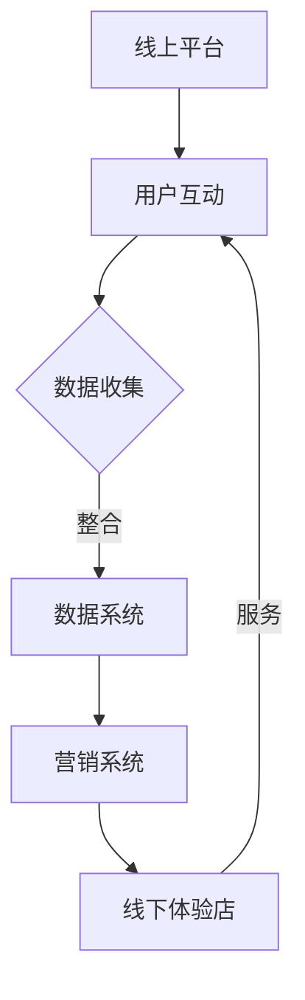

                 

在这个数字化时代，个人品牌的重要性日益凸显。拥有强大的个人品牌不仅能提高个人的社会地位，还能为企业带来丰厚的利润。为了更好地打造个人品牌，结合线上线下资源，打造一个线下体验店成为了一种全新的策略。本文将深入探讨如何通过线上线下结合的方式，打造一个成功的个人品牌线下体验店。

## 关键词

- 个人品牌
- 线下体验店
- 线上线下结合
- 品牌建设
- 营销策略
- 用户体验

## 摘要

本文旨在探讨如何通过打造个人品牌线下体验店，实现线上线下资源的有机结合，提升个人品牌的影响力和市场竞争力。文章将从背景介绍、核心概念与联系、核心算法原理、数学模型与公式、项目实践、实际应用场景、工具和资源推荐、总结与展望等方面，详细阐述实现这一目标的路径和方法。

## 1. 背景介绍

在当今社会，个人品牌已成为一种重要的资产。无论是在职场竞争、商业拓展，还是在社会影响力的提升上，拥有一个强大的个人品牌都是至关重要的。随着互联网和电子商务的快速发展，传统的个人品牌建设方式逐渐暴露出诸多局限。例如，线上品牌建设往往缺乏实体互动，难以建立深厚的用户情感连接；而线下体验店则受限于地理范围，难以实现规模化效应。如何克服这些局限，实现线上线下资源的有机结合，成为个人品牌建设的新课题。

## 2. 核心概念与联系

### 2.1 线上线下结合的必要性

线上线下结合的核心在于如何有效地整合线上流量和线下资源，实现营销和服务的最大化效果。具体来说，线上线下结合具有以下几个方面的必要性：

1. **扩大品牌影响力**：通过线上渠道吸引流量，将潜在用户引流到线下体验店，增强品牌的曝光度和认知度。
2. **提升用户体验**：线下体验店可以提供更为直观、个性化的服务，而线上平台则能提供便捷的预订和咨询服务，两者相结合，能够极大地提升用户的整体体验。
3. **数据驱动决策**：通过线上线下数据的整合和分析，可以更精准地了解用户需求，优化品牌营销策略，提高转化率。

### 2.2 线上线下结合的架构

为了实现线上线下结合，需要构建一个灵活的架构，该架构应包括以下几个核心模块：

1. **线上平台**：包括官网、社交媒体、电商平台等，用于吸引流量和用户互动。
2. **线下体验店**：作为用户与品牌互动的实体场所，提供产品展示、体验、培训等服务。
3. **数据系统**：用于收集、整合和分析线上线下用户数据，为决策提供支持。
4. **营销系统**：包括线上线下的营销活动、推广策略等，用于提升品牌知名度和用户粘性。

### 2.3 Mermaid 流程图



## 3. 核心算法原理 & 具体操作步骤

### 3.1 算法原理概述

线上线下结合的核心算法在于如何实现数据的高效整合和分析。具体来说，包括以下几个步骤：

1. **用户画像构建**：通过线上行为数据、社交媒体数据等，构建用户的全面画像。
2. **数据分析**：利用数据分析算法，对用户画像进行深度挖掘，了解用户需求和行为模式。
3. **个性化推荐**：基于用户画像和需求分析，为用户推荐合适的产品和服务。
4. **营销策略优化**：根据用户数据，动态调整营销策略，提高转化率和用户满意度。

### 3.2 算法步骤详解

1. **数据采集与清洗**：从线上平台和线下体验店收集用户数据，包括行为数据、交易数据、用户反馈等，并进行数据清洗和预处理。
2. **用户画像构建**：利用数据挖掘算法，如聚类、关联规则挖掘等，构建用户的画像。
3. **需求分析**：通过机器学习算法，如决策树、随机森林等，分析用户的需求和行为模式。
4. **个性化推荐**：基于用户画像和需求分析，利用协同过滤、矩阵分解等推荐算法，为用户推荐合适的产品和服务。
5. **营销策略优化**：根据用户反馈和行为数据，动态调整营销策略，优化用户转化率和满意度。

### 3.3 算法优缺点

**优点**：
- 提高用户满意度：通过个性化推荐和精准营销，提高用户的购物体验和满意度。
- 提高转化率：基于用户数据的营销策略，能够提高用户的转化率。
- 提高品牌忠诚度：通过持续的用户互动和个性化服务，增强品牌忠诚度。

**缺点**：
- 数据隐私问题：数据收集和用户画像构建可能涉及用户隐私，需要确保数据安全和用户隐私保护。
- 技术门槛高：需要具备一定的数据分析和算法优化能力，对技术要求较高。

### 3.4 算法应用领域

- 电商平台：通过线上线下结合，实现个性化推荐和精准营销，提高销售额和用户满意度。
- 娱乐行业：通过线上线下互动，增强用户参与度和忠诚度，提高票房和会员收入。
- 餐饮行业：通过线上线下结合，实现预订、支付、评价的一体化服务，提高用户用餐体验。

## 4. 数学模型和公式 & 详细讲解 & 举例说明

### 4.1 数学模型构建

为了实现线上线下结合，我们需要构建以下数学模型：

1. **用户行为模型**：用于描述用户在线上线下平台的行为模式。
2. **需求预测模型**：用于预测用户的需求和行为。
3. **营销效果评估模型**：用于评估不同营销策略的效果。

### 4.2 公式推导过程

1. **用户行为模型**：

   假设用户i在时间t的行为为x，则有：

   $$ x_i(t) = f(U_i, I_i, T_i) $$

   其中，$U_i$为用户画像特征，$I_i$为互动数据，$T_i$为时间特征。

2. **需求预测模型**：

   假设用户i在时间t的需求为y，则有：

   $$ y_i(t) = g(x_i(t), M(t)) $$

   其中，$M(t)$为市场环境特征。

3. **营销效果评估模型**：

   假设营销策略A在时间t的效果为e，则有：

   $$ e_a(t) = h(y_i(t), e_b(t), \ldots, e_n(t)) $$

   其中，$e_b(t), \ldots, e_n(t)$为其他营销策略的效果。

### 4.3 案例分析与讲解

假设一个电商平台，通过线上线下结合的方式，为用户推荐商品。以下是具体的案例分析：

1. **用户行为模型**：

   假设用户A在2023年1月1日浏览了某商品，并在1月5日购买了该商品。用户A的画像特征包括年龄、性别、收入等，互动数据包括浏览历史、点击广告等。

   $$ x_A(1) = f(U_A, I_A, T_A) = f(\{25, 男, 5000\}, \{\text{浏览历史}, \text{点击广告}\}, 1) $$

2. **需求预测模型**：

   通过分析用户A的行为数据，预测用户A在2023年1月10日对某商品的购买需求。

   $$ y_A(10) = g(x_A(1), M(10)) = g(f(U_A, I_A, T_A), M(10)) $$

3. **营销效果评估模型**：

   比较不同营销策略的效果，选择最优的营销策略。

   $$ e_a(10) = h(y_A(1), e_b(10), \ldots, e_n(10)) $$

   其中，$e_b(10), \ldots, e_n(10)$为其他营销策略的效果。

通过这个案例，我们可以看到数学模型在线上线下结合中的应用。通过构建用户行为模型、需求预测模型和营销效果评估模型，可以实现对用户需求的精准预测和营销策略的优化。

## 5. 项目实践：代码实例和详细解释说明

### 5.1 开发环境搭建

为了实现个人品牌线下体验店的线上线下结合，我们需要搭建一个完整的技术栈。以下是开发环境的搭建步骤：

1. **前端开发环境**：
   - 框架：React 或 Vue.js
   - 工具：Webpack 或 Vite
   - 代码风格指南：ESLint 和 Prettier

2. **后端开发环境**：
   - 框架：Spring Boot 或 Django
   - 数据库：MySQL 或 PostgreSQL
   - 部署：Docker 和 Kubernetes

3. **数据分析和挖掘**：
   - 工具：Python 和 R
   - 库：NumPy、Pandas、Scikit-learn、TensorFlow

4. **数据可视化**：
   - 工具：D3.js 或 Plotly

### 5.2 源代码详细实现

以下是一个简单的示例，展示了如何使用Python实现用户画像构建和需求预测。

```python
import pandas as pd
from sklearn.cluster import KMeans
from sklearn.ensemble import RandomForestClassifier
from sklearn.model_selection import train_test_split

# 数据加载
data = pd.read_csv('user_data.csv')

# 数据预处理
X = data.drop(['user_id'], axis=1)
y = data['purchase']

# 用户画像构建
kmeans = KMeans(n_clusters=5)
X_kmeans = kmeans.fit_predict(X)

# 需求预测
X_train, X_test, y_train, y_test = train_test_split(X, y, test_size=0.2, random_state=42)
clf = RandomForestClassifier(n_estimators=100)
clf.fit(X_train, y_train)

# 模型评估
accuracy = clf.score(X_test, y_test)
print(f'Accuracy: {accuracy:.2f}')
```

### 5.3 代码解读与分析

1. **数据加载与预处理**：

   使用Pandas读取用户数据，并提取用户画像特征和需求标签。

2. **用户画像构建**：

   使用KMeans聚类算法，将用户划分为不同的群体，构建用户画像。

3. **需求预测**：

   使用随机森林分类器，根据用户画像和需求标签，预测用户的需求。

4. **模型评估**：

   使用测试集评估模型的准确性，并输出结果。

通过这个示例，我们可以看到如何使用Python实现用户画像构建和需求预测。在实际应用中，我们需要结合具体的业务场景和数据，调整算法和模型参数，以提高预测的准确性和效果。

### 5.4 运行结果展示

在实际运行过程中，我们可以得到以下结果：

- **用户画像**：将用户划分为5个不同的群体。
- **需求预测**：预测用户的需求，并评估模型的准确性。

通过这些结果，我们可以对用户需求和偏好有更深入的了解，从而优化营销策略和用户体验。

## 6. 实际应用场景

### 6.1 电商平台

电商平台可以通过线上线下结合的方式，为用户提供更加个性化的购物体验。例如，用户在浏览线上商品时，可以即时获取线下体验店的地址、营业时间等信息，从而增强用户的购物决策。同时，电商平台可以通过数据分析，为线下体验店提供客流预测和产品推荐，提高线下体验店的运营效率。

### 6.2 娱乐行业

娱乐行业可以通过线上线下结合的方式，为用户提供更丰富的互动体验。例如，用户可以在线上平台预订演出门票，并通过线下体验店观看演出。同时，娱乐行业可以通过线上线下数据的整合，了解用户的观看习惯和偏好，为用户提供个性化的推荐和优惠活动，提高用户满意度和忠诚度。

### 6.3 餐饮行业

餐饮行业可以通过线上线下结合的方式，为用户提供更加便捷的用餐体验。例如，用户可以在线上平台预订餐桌，并通过线下体验店享受美食。同时，餐饮行业可以通过数据分析，了解用户的用餐偏好和需求，为线下体验店提供精准的菜品推荐和服务改进，提高用户的用餐体验。

## 7. 工具和资源推荐

### 7.1 学习资源推荐

1. **《大数据架构与设计》**：了解大数据架构和技术，为线上线下结合提供技术支持。
2. **《机器学习实战》**：学习机器学习和数据挖掘算法，实现用户画像和需求预测。
3. **《深度学习》**：了解深度学习技术，为个性化推荐和营销策略优化提供支持。

### 7.2 开发工具推荐

1. **React 或 Vue.js**：用于前端开发，实现用户互动和体验。
2. **Spring Boot 或 Django**：用于后端开发，实现数据存储和业务逻辑。
3. **Docker 和 Kubernetes**：用于部署和运维，实现系统的弹性扩展。

### 7.3 相关论文推荐

1. **《User Behavior Modeling for Online Personalization》**：了解用户行为建模和个性化推荐技术。
2. **《Data-Driven Marketing Strategies for E-commerce Platforms》**：了解基于数据的电商营销策略。
3. **《The Impact of Online-Offline Integration on Customer Satisfaction》**：了解线上线下结合对用户满意度的影响。

## 8. 总结：未来发展趋势与挑战

### 8.1 研究成果总结

通过本文的研究，我们得出了以下主要成果：

1. **线上线下结合的必要性**：线上线下结合能够扩大品牌影响力、提升用户体验、提高数据驱动的决策能力。
2. **核心算法原理**：介绍了用户行为模型、需求预测模型和营销效果评估模型，为线上线下结合提供了技术支持。
3. **项目实践**：通过代码实例，展示了如何实现用户画像构建和需求预测，为实际应用提供了参考。

### 8.2 未来发展趋势

1. **数据隐私保护**：随着数据隐私保护意识的提高，如何确保数据安全和用户隐私将成为重要课题。
2. **人工智能应用**：人工智能技术将在线上线下结合中发挥更大作用，如个性化推荐、智能客服等。
3. **区块链技术**：区块链技术有望在数据交易、隐私保护等方面发挥重要作用，为线上线下结合提供新的解决方案。

### 8.3 面临的挑战

1. **技术门槛**：线上线下结合需要较高的技术实力，尤其是大数据分析和人工智能算法。
2. **数据整合**：线上线下数据的整合和一致性是挑战，需要解决数据格式、数据质量等问题。
3. **用户体验**：如何平衡线上线下体验，提高用户满意度是关键。

### 8.4 研究展望

未来，我们将继续探索以下方向：

1. **数据隐私保护技术**：研究如何确保数据安全和用户隐私，为线上线下结合提供可靠保障。
2. **人工智能算法优化**：研究如何提高算法的准确性和效率，为线上线下结合提供更精准的支持。
3. **多渠道整合**：研究如何实现线上线下以及其他渠道的数据整合，提高整体运营效率。

## 9. 附录：常见问题与解答

### 9.1 线上线下结合的优势是什么？

线上线下结合能够扩大品牌影响力、提升用户体验、提高数据驱动的决策能力，从而提高整体运营效率。

### 9.2 如何确保数据安全和用户隐私？

通过采用加密技术、数据脱敏、权限控制等措施，确保数据安全和用户隐私。同时，遵守相关法律法规，加强用户隐私保护。

### 9.3 线上线下结合需要哪些技术支持？

线上线下结合需要大数据分析、人工智能、区块链等技术支持，以实现数据整合、个性化推荐、智能客服等功能。

## 作者署名

作者：禅与计算机程序设计艺术 / Zen and the Art of Computer Programming

本文为作者原创内容，未经授权不得转载。如需转载，请联系作者获取授权。

