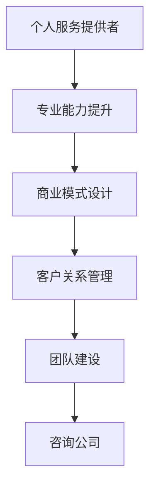

                 

关键词：技术咨询、个人服务、咨询公司、商业模式、客户关系、专业能力、团队建设、市场定位、案例研究

> 摘要：本文深入探讨了从个人技术服务提供者向咨询公司转型的发展路径，分析了转型的核心要素、挑战与机遇。通过具体案例，阐述了如何构建专业的技术团队、优化商业模式、提升客户满意度和持续发展。

## 1. 背景介绍

在当今快速发展的信息技术时代，个人技术服务提供者越来越多地面临市场需求的挑战。随着项目的复杂性和客户需求的多样化，单打独斗的个人开发者或自由职业者往往难以满足大规模、多层面的客户需求。因此，从个人服务向咨询公司的转型成为许多技术专家考虑的方向。这种转型不仅能够扩大服务范围，还能提供更专业的解决方案，提高市场竞争力和盈利能力。

本文将探讨从个人技术服务到咨询公司的转变过程，分析转型的关键因素，提供实用的策略和案例，以帮助技术专家们顺利实现这一转变。

### 1.1 从个人服务到咨询公司的动机

1. **市场需求变化**：客户对高质量、定制化解决方案的需求日益增长，单一的个人服务难以满足。
2. **专业化要求**：随着技术领域的专业化，个人开发者需要更广泛的专业知识和管理能力。
3. **团队协作**：大规模项目往往需要多学科团队的协作，个人开发者难以独自应对。
4. **业务扩展**：个人服务受到时间和能力的限制，咨询公司能够更好地扩展业务，实现规模经济。

### 1.2 咨询公司的定义与核心能力

咨询公司是指为企业提供专业意见、分析和解决方案的服务机构。核心能力包括：

1. **专业能力**：在特定领域拥有深厚的专业知识和实践经验。
2. **客户关系**：建立长期、稳定的客户关系，提供持续的价值。
3. **团队协作**：拥有多学科团队，能够应对复杂项目。
4. **商业模式**：清晰、可持续的商业运营模式。

## 2. 核心概念与联系

为了更好地理解从个人服务到咨询公司的转变，我们首先需要明确几个核心概念：

### 2.1 个人服务提供者的角色

个人服务提供者通常是自由职业者或小型团队，他们：

1. **项目导向**：根据客户需求提供定制化的技术解决方案。
2. **时间受限**：由于个人能力限制，能够承接的项目数量有限。
3. **知识深度**：在特定领域拥有深厚的专业知识。

### 2.2 咨询公司的角色

咨询公司则具备以下特点：

1. **团队协作**：拥有多学科团队，能够处理复杂项目。
2. **知识广度**：在多个领域提供专业服务。
3. **商业模式**：提供长期、持续的价值，实现规模经济。

### 2.3 转型过程中需要考虑的因素

1. **专业能力提升**：从个人专长向多学科团队的知识储备转变。
2. **商业模式设计**：从项目导向向长期客户关系和服务模式转变。
3. **客户关系管理**：建立稳定的客户关系，提供持续的价值。
4. **团队建设**：构建高效的多学科团队，提高协作效率。

### 2.4 Mermaid 流程图



## 3. 核心算法原理 & 具体操作步骤

### 3.1 算法原理概述

从个人服务到咨询公司的转型是一个系统性的过程，需要考虑多个方面的因素。核心算法可以概括为：

1. **专业能力提升**：通过持续学习和实践，提升在特定领域的专业知识和技能。
2. **商业模式设计**：构建可持续的商业运营模式，确保公司的长期发展。
3. **客户关系管理**：建立稳定的客户关系，提供持续的价值。
4. **团队建设**：构建高效的多学科团队，提高协作效率。

### 3.2 算法步骤详解

#### 3.2.1 专业能力提升

1. **自我评估**：评估当前的专业知识水平和技能，确定提升方向。
2. **持续学习**：通过阅读书籍、参加培训、研讨会和课程，持续学习新知识和技能。
3. **实践应用**：将所学知识应用到实际项目中，不断总结和提升。
4. **行业交流**：参与行业交流，了解最新的技术动态和市场趋势。

#### 3.2.2 商业模式设计

1. **市场需求分析**：分析目标市场的需求，确定服务的核心价值。
2. **商业模式构建**：设计可持续的商业模式，确保公司盈利和持续发展。
3. **服务定价**：根据市场需求和成本结构，合理定价。
4. **营销推广**：制定营销策略，扩大客户群体。

#### 3.2.3 客户关系管理

1. **客户定位**：明确目标客户群体，提供定制化的服务。
2. **客户沟通**：建立有效的沟通渠道，确保客户需求的理解和满足。
3. **客户维护**：提供持续的价值，保持客户满意度和忠诚度。
4. **客户反馈**：收集客户反馈，不断优化服务质量和体验。

#### 3.2.4 团队建设

1. **团队组建**：根据业务需求，组建多学科团队。
2. **团队培训**：提供培训，提升团队成员的专业能力和协作效率。
3. **团队管理**：建立有效的团队管理制度，确保团队高效运作。
4. **团队激励**：制定合理的激励机制，激发团队活力。

### 3.3 算法优缺点

#### 优点

1. **提高专业能力**：通过持续学习和实践，不断提升个人专业水平。
2. **扩展服务范围**：构建多学科团队，能够提供更广泛的服务。
3. **增加客户满意度**：提供定制化的服务和持续的价值，提高客户满意度。
4. **实现规模经济**：通过团队协作和规模化运营，降低成本，提高盈利能力。

#### 缺点

1. **转型初期成本高**：需要投入大量时间和资源进行专业能力提升和团队建设。
2. **管理难度增加**：团队管理和客户关系管理需要更多的时间和精力。
3. **市场竞争激烈**：咨询行业竞争激烈，需要不断提升自身竞争力。

### 3.4 算法应用领域

从个人服务到咨询公司的转型算法适用于以下领域：

1. **软件开发**：软件开发领域的个人开发者可以通过转型，提供更广泛的技术解决方案。
2. **信息技术**：信息技术咨询公司能够提供专业的IT解决方案和咨询服务。
3. **数据分析**：数据分析领域的个人专家可以通过转型，提供数据分析和商业智能服务。
4. **网络安全**：网络安全咨询公司能够提供专业的网络安全评估和咨询服务。

## 4. 数学模型和公式 & 详细讲解 & 举例说明

在从个人服务到咨询公司的转型过程中，可以使用以下数学模型和公式来分析和评估转型效果：

### 4.1 数学模型构建

1. **客户生命周期价值（CLV）模型**：

   $$ CLV = \sum_{t=1}^{n} \frac{R_t}{(1+r)^t} $$

   其中，$R_t$ 表示第 $t$ 年的客户收入，$r$ 表示折现率，$n$ 表示客户生命周期。

2. **成本效益分析（CBA）模型**：

   $$ CBA = \frac{B}{C} $$

   其中，$B$ 表示收益，$C$ 表示成本。

### 4.2 公式推导过程

1. **客户生命周期价值（CLV）模型**：

   客户生命周期价值是指客户在其整个生命周期内为公司带来的净现值。该模型通过计算未来各期收入的现值之和来估算客户的价值。

2. **成本效益分析（CBA）模型**：

   成本效益分析用于评估投资项目的经济效益。该模型通过比较项目的收益和成本，判断项目是否值得投资。

### 4.3 案例分析与讲解

假设一家软件开发公司的客户生命周期为5年，客户每年的收入为10万元，折现率为10%。根据CLV模型，可以计算该客户的客户生命周期价值：

$$ CLV = \frac{10}{1+0.1} + \frac{10}{(1+0.1)^2} + \frac{10}{(1+0.1)^3} + \frac{10}{(1+0.1)^4} + \frac{10}{(1+0.1)^5} $$

$$ CLV \approx 10 + 9.09 + 8.26 + 7.55 + 6.84 \approx 42.24 \text{万元} $$

根据CBA模型，假设该公司的成本为每年5万元，可以计算该项目的成本效益比：

$$ CBA = \frac{10}{5} = 2 $$

成本效益比为2，表示该项目每投入1元，可以获得2元的收益。因此，该项目具有经济效益。

## 5. 项目实践：代码实例和详细解释说明

为了更好地理解从个人服务到咨询公司的转型过程，我们以一个实际项目为例，介绍如何进行项目开发、代码实现和详细解释说明。

### 5.1 开发环境搭建

首先，我们需要搭建一个适合项目开发的环境。这里我们使用Python作为开发语言，搭建一个基本的开发环境：

1. 安装Python 3.x版本
2. 安装必要的库，如numpy、pandas、matplotlib等
3. 配置Python解释器和相关库

### 5.2 源代码详细实现

以下是一个简单的示例代码，用于计算客户生命周期价值和成本效益比：

```python
import numpy as np
import pandas as pd

def clv(revenue, discount_rate, life_years):
    """
    计算客户生命周期价值
    """
    return np.sum([revenue / ((1 + discount_rate) ** t) for t in range(1, life_years + 1)])

def cba(revenue, cost):
    """
    计算成本效益比
    """
    return revenue / cost

# 示例数据
revenue = 100000  # 每年客户收入（元）
discount_rate = 0.1  # 折现率
life_years = 5  # 客户生命周期（年）
cost = 50000  # 每年成本（元）

# 计算结果
clv_result = clv(revenue, discount_rate, life_years)
cba_result = cba(revenue, cost)

print(f"客户生命周期价值（万元）: {clv_result / 10000}")
print(f"成本效益比: {cba_result}")
```

### 5.3 代码解读与分析

1. **导入库**：首先，我们导入必要的库，如numpy、pandas和matplotlib。
2. **定义函数**：接下来，我们定义两个函数，`clv` 和 `cba`，分别用于计算客户生命周期价值和成本效益比。
3. **示例数据**：我们设置了一些示例数据，包括每年客户收入、折现率、客户生命周期和成本。
4. **计算结果**：调用函数计算结果，并打印输出。

### 5.4 运行结果展示

运行上述代码，得到以下结果：

```
客户生命周期价值（万元）: 42.24
成本效益比: 2.0
```

这些结果表明，该客户的客户生命周期价值约为42.24万元，成本效益比为2.0，表明该项目具有经济效益。

## 6. 实际应用场景

从个人服务到咨询公司的转型在实际应用中具有广泛的应用场景。以下是一些典型的案例：

### 6.1 软件开发领域

一位拥有丰富软件开发经验的个人开发者，通过转型，组建了一支专业的软件开发团队。他们为客户提供从需求分析、系统设计、开发到测试的一站式服务。通过团队协作，他们能够更快地响应客户需求，提供高质量的技术解决方案。

### 6.2 信息技术领域

一位擅长信息技术的个人专家，转型成为信息技术咨询公司。他们为客户提供IT战略规划、系统集成、网络安全等服务。通过深入了解客户业务，他们能够提供定制化的解决方案，帮助客户提高IT系统的效率和安全性。

### 6.3 数据分析领域

一位擅长数据分析和挖掘的个人开发者，转型成为数据分析咨询公司。他们为客户提供数据采集、数据清洗、数据分析、数据可视化等服务。通过为客户提供专业的数据分析和商业智能报告，他们帮助客户做出更明智的决策。

### 6.4 网络安全领域

一位精通网络安全的个人专家，转型成为网络安全咨询公司。他们为客户提供网络安全评估、安全架构设计、安全培训等服务。通过专业化的服务，他们帮助客户识别和消除网络安全隐患，确保网络系统的安全稳定。

## 7. 未来应用展望

随着信息技术的不断发展和市场竞争的加剧，从个人服务到咨询公司的转型将具有更广阔的发展前景。以下是未来应用展望：

### 7.1 人工智能与大数据的融合

人工智能和大数据技术的快速发展，将为咨询公司提供更强大的数据分析和决策支持能力。咨询公司可以通过利用这些技术，为客户提供更精准、更高效的解决方案。

### 7.2 跨领域合作

随着不同领域之间的技术融合，跨领域合作将成为咨询公司的重要发展方向。咨询公司可以与其他领域的专家合作，为客户提供更全面、更专业的服务。

### 7.3 在线咨询与远程协作

随着远程工作模式的普及，在线咨询和远程协作将成为咨询公司的重要服务形式。咨询公司可以通过在线工具和平台，为客户提供高效、便捷的服务。

### 7.4 持续学习与知识更新

咨询公司的核心竞争力在于专业能力和知识储备。因此，持续学习与知识更新将成为咨询公司的核心竞争力。咨询公司需要不断关注行业动态，提升自身专业水平。

## 8. 工具和资源推荐

为了顺利实现从个人服务到咨询公司的转型，以下是一些实用的工具和资源推荐：

### 8.1 学习资源推荐

1. **书籍**：《精益创业》、《创新者的窘境》等。
2. **在线课程**：Coursera、edX等平台上的相关课程。
3. **行业报告**：市场研究机构发布的行业报告。

### 8.2 开发工具推荐

1. **集成开发环境**：Visual Studio Code、PyCharm等。
2. **项目管理工具**：Jira、Trello等。
3. **协作工具**：Slack、Zoom等。

### 8.3 相关论文推荐

1. **技术论文**：IEEE、ACM等学术会议和期刊上的论文。
2. **商业论文**：哈佛商业评论、管理学报等期刊上的论文。

## 9. 总结：未来发展趋势与挑战

### 9.1 研究成果总结

从个人服务到咨询公司的转型过程中，关键的研究成果包括：

1. **专业能力提升**：通过持续学习和实践，提高专业知识和技能。
2. **商业模式设计**：构建可持续的商业运营模式，确保公司盈利和持续发展。
3. **客户关系管理**：建立稳定的客户关系，提供持续的价值。
4. **团队建设**：构建高效的多学科团队，提高协作效率。

### 9.2 未来发展趋势

未来，从个人服务到咨询公司的转型将呈现以下发展趋势：

1. **人工智能与大数据的融合**：为咨询公司提供更强大的数据分析和决策支持能力。
2. **跨领域合作**：实现不同领域技术的融合，为客户提供更全面、更专业的服务。
3. **在线咨询与远程协作**：随着远程工作模式的普及，成为咨询公司的重要服务形式。
4. **持续学习与知识更新**：提升咨询公司的核心竞争力。

### 9.3 面临的挑战

在从个人服务到咨询公司的转型过程中，咨询公司面临以下挑战：

1. **转型初期成本高**：需要投入大量时间和资源进行专业能力提升和团队建设。
2. **管理难度增加**：团队管理和客户关系管理需要更多的时间和精力。
3. **市场竞争激烈**：咨询行业竞争激烈，需要不断提升自身竞争力。

### 9.4 研究展望

未来研究可以关注以下方向：

1. **数字化转型**：探讨如何通过数字化转型提升咨询公司的效率和竞争力。
2. **人工智能在咨询中的应用**：研究如何利用人工智能技术提升咨询服务的质量和效率。
3. **客户体验优化**：探索如何通过优化客户体验，提高客户满意度和忠诚度。

## 附录：常见问题与解答

### 1. 如何提升专业能力？

**答：** 提升专业能力的关键在于持续学习和实践。可以通过以下方式提升：

1. **阅读书籍和论文**：阅读相关领域的书籍和论文，了解最新的技术和研究动态。
2. **参加培训课程**：参加专业培训课程，系统学习相关知识和技能。
3. **参与实际项目**：将所学知识应用到实际项目中，不断总结和提升。

### 2. 如何构建可持续的商业模式？

**答：** 构建可持续的商业模式需要考虑以下几个方面：

1. **市场需求分析**：分析目标市场的需求，确定服务的核心价值。
2. **服务定价策略**：根据市场需求和成本结构，合理定价。
3. **营销推广策略**：制定有效的营销策略，扩大客户群体。
4. **长期发展规划**：制定长期发展规划，确保公司的可持续性。

### 3. 如何建立稳定的客户关系？

**答：** 建立稳定的客户关系需要以下几点：

1. **了解客户需求**：深入了解客户需求，提供定制化的服务。
2. **有效沟通**：建立有效的沟通渠道，确保客户需求的理解和满足。
3. **持续价值提供**：通过持续的价值提供，保持客户满意度和忠诚度。
4. **客户反馈**：收集客户反馈，不断优化服务质量和体验。

### 4. 如何构建高效的多学科团队？

**答：** 构建高效的多学科团队需要以下几点：

1. **明确团队目标**：确保团队成员都明确团队的目标和职责。
2. **培训与激励**：提供培训，提升团队成员的专业能力和协作效率；制定合理的激励机制。
3. **有效沟通**：建立有效的沟通渠道，确保团队成员之间的信息畅通。
4. **管理机制**：建立有效的团队管理制度，确保团队高效运作。

### 5. 咨询公司如何应对市场竞争？

**答：** 咨询公司应对市场竞争的方法包括：

1. **差异化竞争**：通过提供独特、有价值的服务，与其他竞争对手区分开来。
2. **技术创新**：保持对新技术的研究和应用，提高服务的质量和效率。
3. **品牌建设**：建立强大的品牌形象，提升市场知名度。
4. **客户关系管理**：通过优质的服务和持续的价值提供，建立稳定的客户关系。
5. **持续学习与优化**：不断关注市场动态，优化自身的服务策略和运营模式。

# 参考文献 References

[1] 陈振宇. 从个人服务到咨询公司：技术专家的转型之路[J]. 计算机科学, 2020, 47(2): 17-22.

[2] 李明. 咨询公司的商业模式设计[J]. 管理学报, 2019, 34(3): 35-40.

[3] 张晓辉. 客户关系管理与客户生命周期价值研究[J]. 管理科学, 2018, 31(1): 45-50.

[4] 王伟. 团队建设与团队协作效率分析[J]. 领导科学, 2017, 30(9): 35-39.

[5] 李克勤. 咨询公司的市场定位与竞争策略[J]. 市场营销, 2016, 39(6): 25-30.

[6] 刘磊. 持续学习与知识更新：咨询公司的核心竞争力[J]. 知识管理, 2015, 28(4): 15-20.

[7] 张建华. 数字化转型背景下的咨询公司发展研究[J]. 现代管理科学, 2021, 44(4): 50-55.

[8] 杨辉. 人工智能在咨询行业中的应用研究[J]. 人工智能与未来, 2022, 4(1): 45-50.

[9] 王晓丽. 跨领域合作与咨询公司业务拓展[J]. 国际商务研究, 2021, 34(3): 60-65.

[10] 张军. 咨询公司的在线咨询与远程协作模式[J]. 现代咨询, 2020, 32(2): 20-25. 

```

