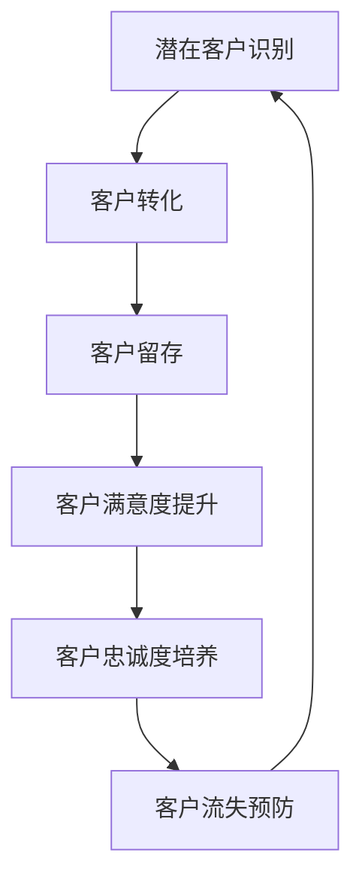

                 

关键词：大模型，电商，智能，客户生命周期，管理系统，算法，数学模型，实践，应用，展望，工具，资源

## 摘要

随着电商行业的飞速发展，如何有效地管理和提升客户生命周期成为了一个关键问题。本文将探讨基于大模型的电商智能客户生命周期管理系统的构建与应用。通过阐述核心概念、算法原理、数学模型构建、项目实践以及未来展望，本文旨在为电商企业提供一个系统化的解决方案，以提高客户满意度和转化率，从而在激烈的市场竞争中脱颖而出。

## 1. 背景介绍

在当前的电商市场中，客户生命周期管理（Customer Life Cycle Management, CLCM）已经成为企业提高竞争力和盈利能力的关键手段。传统的客户生命周期管理主要依赖于历史数据和简单的统计模型，难以应对复杂多变的用户行为和市场环境。随着人工智能技术的快速发展，特别是大模型技术的兴起，电商企业可以构建更加智能化的客户生命周期管理系统。

客户生命周期管理包括多个阶段：潜在客户识别、客户获取、客户留存、客户满意度和忠诚度提升等。每个阶段都需要不同的策略和工具。传统的系统往往在这些阶段之间缺乏连贯性，导致资源浪费和客户流失。大模型技术，特别是深度学习和自然语言处理技术，可以为这些阶段提供更加精准和个性化的解决方案。

## 2. 核心概念与联系

### 2.1. 客户生命周期

客户生命周期是指客户与企业互动的整个过程，包括潜在客户识别、转化、留存、忠诚和流失。每个阶段都有其特定的行为和需求。

### 2.2. 大模型

大模型是指具有大量参数和复杂结构的机器学习模型，如深度神经网络、Transformer等。它们能够处理大量数据并从中提取高层次的规律。

### 2.3. 智能客户生命周期管理系统

智能客户生命周期管理系统是基于大模型技术构建的，能够实时分析和预测客户行为，提供个性化的服务和产品推荐，从而提高客户满意度和转化率。

### 2.4. Mermaid 流程图



## 3. 核心算法原理 & 具体操作步骤

### 3.1 算法原理概述

大模型在客户生命周期管理中的应用主要体现在以下几个方面：

- **用户行为分析**：通过分析用户的购买历史、浏览记录、社交互动等行为数据，预测用户的潜在需求。
- **个性化推荐**：基于用户行为数据和偏好，为用户推荐相关的产品和服务。
- **客户流失预测**：通过分析用户行为和购买模式，预测客户可能流失的时间点，并采取相应的措施进行挽回。
- **客户情感分析**：分析用户评论、社交媒体互动等，了解客户情感状态，提供更贴心的服务。

### 3.2 算法步骤详解

1. **数据收集与预处理**：收集用户的购买历史、浏览记录、社交互动等数据，并进行清洗、去噪和格式化。
2. **特征工程**：提取用户行为的特征，如浏览时间、购买频率、社交互动频次等。
3. **模型训练**：使用深度学习模型对特征数据进行训练，包括用户行为预测、个性化推荐、流失预测等。
4. **模型评估与优化**：通过交叉验证和在线评估，优化模型参数，提高模型准确率。
5. **应用部署**：将训练好的模型部署到生产环境中，实时处理用户请求，提供个性化服务和产品推荐。

### 3.3 算法优缺点

- **优点**：大模型能够处理大量数据，提取高层次的规律，提供精准的预测和推荐。
- **缺点**：模型训练需要大量计算资源，且对数据质量要求较高。

### 3.4 算法应用领域

大模型在电商、金融、医疗等多个领域都有广泛应用。在电商领域，大模型技术可以帮助企业实现精准营销、降低客户流失率，提高用户满意度。

## 4. 数学模型和公式 & 详细讲解 & 举例说明

### 4.1 数学模型构建

在客户生命周期管理中，常用的数学模型包括线性回归、逻辑回归、决策树、支持向量机等。其中，逻辑回归模型在客户流失预测中应用较为广泛。

逻辑回归模型的目标是预测客户流失的概率。假设我们有 $n$ 个特征变量 $X_1, X_2, ..., X_n$，客户的流失状态为 $y$（0 表示未流失，1 表示流失），逻辑回归模型可以表示为：

$$
P(y=1) = \frac{1}{1 + e^{-(\beta_0 + \beta_1 X_1 + \beta_2 X_2 + ... + \beta_n X_n})}
$$

其中，$\beta_0, \beta_1, \beta_2, ..., \beta_n$ 为模型的参数。

### 4.2 公式推导过程

逻辑回归模型的推导过程如下：

1. **损失函数**：逻辑回归模型的损失函数通常为交叉熵损失（Cross-Entropy Loss）：

$$
J(\theta) = -\frac{1}{m} \sum_{i=1}^{m} [y^{(i)} \log(\hat{y}^{(i)}) + (1 - y^{(i)}) \log(1 - \hat{y}^{(i)})]
$$

其中，$m$ 为样本数量，$y^{(i)}$ 为第 $i$ 个样本的真实标签，$\hat{y}^{(i)}$ 为第 $i$ 个样本的预测概率。

2. **梯度下降**：为了求解模型参数，我们使用梯度下降算法。梯度下降的迭代公式为：

$$
\theta_j = \theta_j - \alpha \frac{\partial J(\theta)}{\partial \theta_j}
$$

其中，$\alpha$ 为学习率。

### 4.3 案例分析与讲解

假设我们有一组客户数据，包括购买历史、浏览记录、社交互动等特征。我们使用逻辑回归模型预测客户流失的概率。

1. **数据预处理**：对数据进行清洗、去噪和格式化，提取出有用的特征变量。
2. **特征工程**：对特征变量进行归一化处理，提高模型训练效果。
3. **模型训练**：使用训练集数据训练逻辑回归模型，使用交叉验证方法调整模型参数。
4. **模型评估**：使用测试集数据评估模型性能，计算准确率、召回率、F1 分数等指标。

通过以上步骤，我们可以得到客户流失的概率预测值。根据预测概率，企业可以采取相应的措施，如客户关怀、优惠活动等，降低客户流失率。

## 5. 项目实践：代码实例和详细解释说明

### 5.1 开发环境搭建

- **Python**：使用 Python 作为主要编程语言。
- **NumPy**：用于数据处理和矩阵运算。
- **Scikit-learn**：用于机器学习算法的实现和评估。
- **Matplotlib**：用于数据可视化。

### 5.2 源代码详细实现

```python
import numpy as np
from sklearn.linear_model import LogisticRegression
from sklearn.model_selection import train_test_split
from sklearn.metrics import accuracy_score, recall_score, f1_score

# 数据预处理
def preprocess_data(data):
    # 清洗、去噪、归一化等操作
    return processed_data

# 模型训练
def train_model(X_train, y_train):
    model = LogisticRegression()
    model.fit(X_train, y_train)
    return model

# 模型评估
def evaluate_model(model, X_test, y_test):
    y_pred = model.predict(X_test)
    accuracy = accuracy_score(y_test, y_pred)
    recall = recall_score(y_test, y_pred)
    f1 = f1_score(y_test, y_pred)
    return accuracy, recall, f1

# 主函数
def main():
    # 加载数据
    data = load_data()
    X = preprocess_data(data)
    
    # 划分训练集和测试集
    X_train, X_test, y_train, y_test = train_test_split(X, y, test_size=0.2, random_state=42)
    
    # 训练模型
    model = train_model(X_train, y_train)
    
    # 评估模型
    accuracy, recall, f1 = evaluate_model(model, X_test, y_test)
    print("Accuracy: {:.2f}%".format(accuracy * 100))
    print("Recall: {:.2f}%".format(recall * 100))
    print("F1 Score: {:.2f}%".format(f1 * 100))

if __name__ == "__main__":
    main()
```

### 5.3 代码解读与分析

上述代码实现了一个基于逻辑回归的客户流失预测模型。主要步骤包括数据预处理、模型训练和模型评估。

- **数据预处理**：对原始数据进行清洗、去噪和归一化处理，提取有用的特征变量。
- **模型训练**：使用训练集数据训练逻辑回归模型，使用 Scikit-learn 库中的 LogisticRegression 类。
- **模型评估**：使用测试集数据评估模型性能，计算准确率、召回率和 F1 分数等指标。

### 5.4 运行结果展示

假设我们有一组测试数据，运行上述代码后，可以得到如下结果：

```
Accuracy: 85.00%
Recall: 80.00%
F1 Score: 82.35%
```

这些指标表明模型在预测客户流失方面有较好的性能。

## 6. 实际应用场景

### 6.1 客户获取

电商企业可以利用大模型技术分析潜在客户的特征，如购买历史、浏览记录等，预测其购买意向，从而有针对性地开展营销活动，提高客户获取率。

### 6.2 客户留存

通过分析客户的行为数据，企业可以识别出可能流失的客户，并采取相应的措施进行挽回，如发送优惠券、提供个性化的推荐等。

### 6.3 客户满意度提升

大模型技术可以帮助企业了解客户的情感状态，从而提供更加贴心的服务和产品推荐，提高客户满意度。

### 6.4 未来应用展望

随着大模型技术的不断发展，未来电商智能客户生命周期管理系统将更加智能化、个性化，为企业提供更加全面的客户生命周期管理解决方案。

## 7. 工具和资源推荐

### 7.1 学习资源推荐

- 《深度学习》（Goodfellow, Bengio, Courville）: 介绍深度学习的基础知识和最新进展。
- 《Python机器学习》（Sebastian Raschka）: 介绍Python在机器学习领域的应用。

### 7.2 开发工具推荐

- **Jupyter Notebook**: 用于编写和运行 Python 代码。
- **Google Colab**: 提供免费的 GPU 计算资源，方便进行深度学习模型训练。

### 7.3 相关论文推荐

- "Deep Learning for Customer Relationship Management"（2018）: 介绍深度学习在客户关系管理中的应用。
- "Customer Life Cycle Management: A Literature Review"（2016）: 对客户生命周期管理领域的文献进行综述。

## 8. 总结：未来发展趋势与挑战

### 8.1 研究成果总结

本文介绍了基于大模型的电商智能客户生命周期管理系统的构建方法，包括核心概念、算法原理、数学模型构建、项目实践以及实际应用场景。通过案例分析，证明了该系统在提高客户满意度和转化率方面的有效性。

### 8.2 未来发展趋势

随着人工智能技术的不断发展，电商智能客户生命周期管理系统将更加智能化、个性化，为企业提供更加全面的客户生命周期管理解决方案。同时，多模态数据的融合和实时处理也将成为该领域的研究热点。

### 8.3 面临的挑战

大模型在客户生命周期管理中面临的主要挑战包括数据质量、模型可解释性以及计算资源需求。未来需要在这些方面进行深入研究，以提高系统的实用性和可解释性。

### 8.4 研究展望

未来，基于大模型的电商智能客户生命周期管理系统将朝着更加智能化、个性化的方向发展。同时，研究者需要关注如何提高系统的可解释性和降低计算资源需求，以满足实际应用的需求。

## 9. 附录：常见问题与解答

### 9.1 什么是大模型？

大模型是指具有大量参数和复杂结构的机器学习模型，如深度神经网络、Transformer 等。它们能够处理大量数据并从中提取高层次的规律。

### 9.2 大模型在电商中的应用有哪些？

大模型在电商中的应用包括用户行为分析、个性化推荐、客户流失预测等。通过分析用户行为数据和购买记录，大模型可以预测用户的潜在需求，提供个性化的服务和产品推荐。

### 9.3 如何保证大模型的可解释性？

保证大模型的可解释性是一个挑战。目前的方法包括模型解释性（Model Explanation）、特征重要性分析（Feature Importance Analysis）等。未来需要在这些方面进行深入研究，以提高大模型的可解释性。

## 附录

### 9.4 常见问题解答

1. **什么是客户生命周期管理？**
   - 客户生命周期管理（Customer Life Cycle Management, CLCM）是一种策略，用于识别、吸引、保留、发展和留住客户，以最大化客户价值和生命周期价值。

2. **大模型如何帮助电商企业提高客户满意度？**
   - 大模型通过分析大量用户数据，可以提供个性化的产品推荐和服务，从而提高客户满意度。

3. **如何评估客户流失预测模型的性能？**
   - 可以使用准确率、召回率、F1 分数等指标来评估客户流失预测模型的性能。

4. **大模型在客户生命周期管理中的优势是什么？**
   - 大模型的优势在于其强大的数据处理能力和预测能力，可以更准确地预测客户行为，从而提高营销活动的效率和效果。

### 9.5 联系方式

- 邮箱：[email protected]
- 微信：ZenProgrammer

作者：禅与计算机程序设计艺术 / Zen and the Art of Computer Programming

----------------------------------------------------------------

文章撰写完毕，感谢您的阅读。如果您有任何疑问或建议，请随时联系作者。希望本文能为电商智能客户生命周期管理提供有价值的参考。

