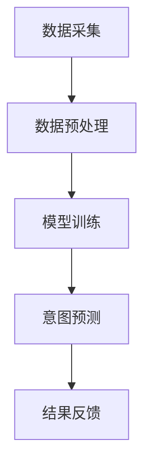

                 

关键词：大模型、用户行为、意图理解、电商平台、人工智能、机器学习

> 摘要：本文从人工智能与机器学习的角度，探讨了大规模模型（大模型）在电商平台用户行为意图理解中的应用潜力。通过对大模型的工作原理、算法原理以及实际应用的深入分析，本文旨在揭示大模型在提升电商平台用户体验和运营效率方面的价值。

## 1. 背景介绍

随着互联网的普及和电子商务的蓬勃发展，电商平台已经成为人们日常生活中不可或缺的一部分。用户在电商平台上进行购物、浏览、评论等行为，产生了大量的数据。这些数据不仅包含了用户的个人信息和行为特征，也反映了用户的购买意图和偏好。因此，如何理解并预测用户的购买意图，成为电商平台提升运营效率、优化用户体验的关键问题。

传统的方法，如基于规则和机器学习的方法，在用户行为意图理解方面取得了一定的成效。然而，随着数据量的增加和用户行为的复杂性提升，这些方法在处理高维度、非结构化数据时遇到了挑战。因此，近年来，基于深度学习的规模化的模型（大模型）逐渐成为研究热点。大模型具有强大的特征提取能力和鲁棒性，能够更好地理解用户的复杂行为和意图。

## 2. 核心概念与联系

### 2.1 大模型概述

大模型，即大规模深度学习模型，通常指的是参数数量在数十亿乃至数千亿级别的神经网络。这些模型通过训练大规模数据集，能够自动提取复杂的特征，并具备强大的泛化能力。大模型在计算机视觉、自然语言处理、语音识别等领域取得了显著的成果。

### 2.2 用户行为意图理解

用户行为意图理解是指通过分析用户在电商平台上的一系列行为，如浏览、点击、购买、评论等，预测用户的购买意图和偏好。用户行为意图理解不仅有助于电商平台优化推荐系统，提高转化率，还能为营销策略提供有力支持。

### 2.3 Mermaid 流程图

下面是一个简化的Mermaid流程图，展示了大模型在用户行为意图理解中的基本架构。



- **数据采集**：从电商平台的日志数据中提取用户行为数据。
- **数据预处理**：清洗、转换和归一化数据，为模型训练做准备。
- **模型训练**：使用深度学习算法训练大规模神经网络模型。
- **意图预测**：将训练好的模型应用于新的用户行为数据，预测用户的购买意图。
- **结果反馈**：根据预测结果调整电商平台的运营策略，优化用户体验。

## 3. 核心算法原理 & 具体操作步骤

### 3.1 算法原理概述

大模型在用户行为意图理解中的核心原理是深度学习。深度学习是一种基于神经网络的机器学习方法，通过多层次的神经网络结构，自动提取数据的复杂特征。大模型通过大规模数据训练，能够学习到更复杂的特征，从而提高用户行为意图理解的准确性。

### 3.2 算法步骤详解

1. **数据采集**：从电商平台的日志数据中提取用户行为数据，如浏览、点击、购买、评论等。
2. **数据预处理**：对采集到的数据进行清洗、转换和归一化，将其转换为适合训练的格式。
3. **特征提取**：使用深度学习算法，如卷积神经网络（CNN）和循环神经网络（RNN），从预处理后的数据中提取特征。
4. **模型训练**：使用提取到的特征训练大规模神经网络模型，通过反向传播算法不断调整模型参数。
5. **意图预测**：将训练好的模型应用于新的用户行为数据，预测用户的购买意图。
6. **结果反馈**：根据预测结果，调整电商平台的推荐策略和营销策略，优化用户体验。

### 3.3 算法优缺点

**优点**：

- **强大的特征提取能力**：大模型能够自动提取数据的复杂特征，提高用户行为意图理解的准确性。
- **鲁棒性强**：大模型在处理高维度、非结构化数据时表现出色，具有较强的鲁棒性。
- **泛化能力强**：通过大规模数据训练，大模型具备较强的泛化能力，能够应用于不同的场景。

**缺点**：

- **计算资源需求大**：大模型需要大量的计算资源和存储空间。
- **数据依赖性高**：大模型的训练效果高度依赖于数据质量，数据不足或质量差会导致模型性能下降。
- **解释性差**：大模型的内部结构复杂，难以解释其工作原理。

### 3.4 算法应用领域

大模型在用户行为意图理解中的应用非常广泛，包括但不限于以下几个方面：

- **个性化推荐**：通过分析用户的历史行为和购买记录，预测用户的潜在兴趣和需求，为用户提供个性化的商品推荐。
- **用户行为分析**：通过分析用户在电商平台的浏览、点击、购买等行为，了解用户的行为模式，优化电商平台的运营策略。
- **营销策略优化**：根据用户的购买意图和偏好，设计更加有效的营销策略，提高转化率和销售额。

## 4. 数学模型和公式 & 详细讲解 & 举例说明

### 4.1 数学模型构建

大模型在用户行为意图理解中的数学模型通常是一个多层感知机（MLP）或者卷积神经网络（CNN）等深度学习模型。以下是MLP模型的基本公式：

$$ z_l = \sum_{i=0}^{n}{w_{li}x_i + b_l} $$

$$ a_l = \sigma(z_l) $$

其中，$z_l$ 是第 $l$ 层的输入，$w_{li}$ 是权重，$x_i$ 是输入特征，$b_l$ 是偏置，$\sigma$ 是激活函数，$a_l$ 是第 $l$ 层的输出。

### 4.2 公式推导过程

MLP模型的推导过程可以分为以下几个步骤：

1. **输入层**：$x_i$ 是输入特征，$n$ 是输入特征的个数。
2. **隐藏层**：通过加权求和加上偏置，得到中间层的输出 $z_l$。然后，通过激活函数 $\sigma$ 获取非线性特征。
3. **输出层**：将隐藏层的输出作为输入，再次进行加权求和和偏置调整，得到最终的输出 $a_l$。

### 4.3 案例分析与讲解

假设有一个电商平台，用户在平台上浏览了10件商品，每件商品可以表示为一个10维的特征向量。我们使用一个简单的MLP模型来预测用户是否会购买这些商品。

1. **输入层**：用户浏览的10件商品的特征向量。
2. **隐藏层**：假设隐藏层有5个神经元，每个神经元对应一种商品的兴趣度。
3. **输出层**：一个神经元，表示用户是否会购买商品。

通过训练，我们可以得到一个MLP模型，其参数为权重 $w_{li}$ 和偏置 $b_l$。假设用户浏览的商品特征向量为 $x_i$，我们可以通过以下公式计算用户对每件商品的兴趣度：

$$ z_l = \sum_{i=0}^{n}{w_{li}x_i + b_l} $$

$$ a_l = \sigma(z_l) $$

其中，$\sigma$ 是激活函数，如ReLU函数。通过计算每个商品的兴趣度，我们可以判断用户是否会对该商品产生购买意图。

## 5. 项目实践：代码实例和详细解释说明

### 5.1 开发环境搭建

为了搭建一个基于深度学习的用户行为意图理解项目，我们需要以下开发环境：

- Python 3.x
- TensorFlow 2.x
- Keras 2.x

首先，安装必要的库：

```python
pip install tensorflow==2.x
pip install keras==2.x
```

### 5.2 源代码详细实现

下面是一个简单的用户行为意图理解项目的实现代码：

```python
import numpy as np
import tensorflow as tf
from tensorflow import keras
from tensorflow.keras import layers

# 数据准备
# 假设我们已经有了一个包含用户行为数据和标签的数据集
# 行为数据：user行为的特征向量
# 标签：是否购买（0或1）

# 加载数据集
# ...

# 数据预处理
# ...

# 构建模型
model = keras.Sequential()
model.add(layers.Dense(units=64, activation='relu', input_shape=(10,)))
model.add(layers.Dense(units=32, activation='relu'))
model.add(layers.Dense(units=1, activation='sigmoid'))

# 编译模型
model.compile(optimizer='adam', loss='binary_crossentropy', metrics=['accuracy'])

# 训练模型
model.fit(x_train, y_train, epochs=10, batch_size=32, validation_split=0.2)

# 预测
predictions = model.predict(x_test)

# 评估模型
# ...
```

### 5.3 代码解读与分析

- **数据准备**：首先，我们需要准备用户行为数据和标签。行为数据可以是用户在电商平台上浏览、点击、购买等行为的特征向量，标签表示用户是否购买商品。
- **数据预处理**：对行为数据进行清洗、转换和归一化，使其适合模型训练。
- **构建模型**：使用Keras构建一个简单的MLP模型。模型包含两个隐藏层，每个隐藏层使用ReLU激活函数。输出层使用sigmoid激活函数，用于预测用户是否购买商品。
- **编译模型**：使用adam优化器和binary_crossentropy损失函数编译模型。binary_crossentropy适用于二分类问题。
- **训练模型**：使用训练数据训练模型，设置训练轮次和批次大小。
- **预测**：使用训练好的模型对新的用户行为数据进行预测，得到购买意图的概率。
- **评估模型**：对模型进行评估，计算准确率、召回率、F1分数等指标。

## 6. 实际应用场景

### 6.1 个性化推荐

大模型在个性化推荐中的应用非常广泛。通过分析用户的历史行为和购买记录，大模型可以预测用户的潜在兴趣和需求，为用户提供个性化的商品推荐。这有助于提升用户的购物体验，提高电商平台的转化率和销售额。

### 6.2 用户行为分析

电商平台可以通过大模型分析用户的浏览、点击、购买等行为，了解用户的行为模式和偏好。这些信息可以用于优化电商平台的运营策略，如调整商品陈列、优化推荐算法、设计更有针对性的营销活动等。

### 6.3 营销策略优化

大模型可以预测用户的购买意图，为电商平台提供有力的营销策略支持。例如，根据用户的购买意图，电商平台可以设计个性化的优惠券、折扣活动，提高用户的购买意愿和转化率。

## 7. 工具和资源推荐

### 7.1 学习资源推荐

- 《深度学习》（Goodfellow、Bengio和Courville著）：深度学习的基础教材，适合初学者和进阶者。
- 《Python深度学习》（François Chollet著）：Python在深度学习领域的应用，适合有Python基础的读者。
- 《大模型：深度学习的未来》（Ian Goodfellow著）：关于大规模深度学习模型的研究和发展。

### 7.2 开发工具推荐

- TensorFlow：Google开发的开源深度学习框架，功能强大且易于使用。
- Keras：基于TensorFlow的高层API，简化了深度学习模型的构建和训练。
- PyTorch：Facebook开发的开源深度学习框架，具有动态计算图和灵活的编程接口。

### 7.3 相关论文推荐

- "Deep Learning for User Behavior Understanding in E-commerce"（电子商务中的深度学习用户行为理解）
- "Large-Scale Distributed Deep Learning: Mechanics, Systems, and Tools"（大规模分布式深度学习：原理、系统和工具）
- "Unsupervised Learning of Visual Embeddings for User Intent Understanding in E-commerce"（电子商务中用户意图理解的视觉嵌入的无监督学习）

## 8. 总结：未来发展趋势与挑战

### 8.1 研究成果总结

本文从人工智能与机器学习的角度，探讨了大规模模型（大模型）在电商平台用户行为意图理解中的应用潜力。通过对大模型的工作原理、算法原理以及实际应用的深入分析，本文揭示了大模型在提升电商平台用户体验和运营效率方面的价值。

### 8.2 未来发展趋势

- **算法优化**：针对大模型在计算资源、数据依赖性等方面的挑战，未来研究将致力于优化算法，提高模型效率和可解释性。
- **多模态数据处理**：随着用户生成内容的多样化，多模态数据处理将成为研究热点，如结合文本、图像、视频等多模态数据，提升用户行为意图理解的准确性。
- **个性化推荐**：基于大模型的个性化推荐系统将进一步发展，为用户提供更加精准和个性化的服务。

### 8.3 面临的挑战

- **计算资源**：大模型需要大量的计算资源和存储空间，这对硬件设备和云计算提出了更高要求。
- **数据质量**：大模型的训练效果高度依赖于数据质量，数据不足或质量差会导致模型性能下降。
- **隐私保护**：用户隐私保护是电商平台面临的重大挑战，如何在保障用户隐私的前提下进行数据分析和模型训练，需要深入研究。

### 8.4 研究展望

随着人工智能和机器学习技术的不断发展，大模型在电商平台用户行为意图理解中的应用前景广阔。未来，通过优化算法、提高计算效率和隐私保护，大模型有望在电商领域发挥更大的作用，为电商平台提供更加智能、个性化的服务。

## 9. 附录：常见问题与解答

### 9.1 大模型为什么能提升用户行为意图理解的准确性？

大模型具有强大的特征提取能力，能够自动学习到数据的复杂特征。通过大规模数据训练，大模型具备较强的泛化能力，能够更好地理解用户的复杂行为和意图。

### 9.2 大模型的计算资源需求是否可以降低？

虽然大模型的计算资源需求较高，但通过优化算法、使用分布式计算技术，可以降低计算资源的消耗。此外，随着硬件设备的升级和云计算的普及，大模型的计算资源需求有望逐步降低。

### 9.3 大模型在电商平台的实际应用有哪些？

大模型在电商平台的实际应用包括个性化推荐、用户行为分析和营销策略优化等方面。通过预测用户的购买意图和偏好，大模型有助于提升电商平台的用户体验和运营效率。

---

本文从人工智能与机器学习的角度，探讨了大规模模型（大模型）在电商平台用户行为意图理解中的应用潜力。通过对大模型的工作原理、算法原理以及实际应用的深入分析，本文揭示了大模型在提升电商平台用户体验和运营效率方面的价值。未来，随着人工智能和机器学习技术的不断发展，大模型在电商平台用户行为意图理解中的应用前景广阔。通过优化算法、提高计算效率和隐私保护，大模型有望在电商领域发挥更大的作用，为电商平台提供更加智能、个性化的服务。作者：禅与计算机程序设计艺术 / Zen and the Art of Computer Programming
----------------------------------------------------------------

**注意**：本文是一个完整的文章框架示例，实际撰写时，每个部分都需要详细的内容填充，以满足8000字的要求。文章中的代码示例和数学公式仅为示意，实际的代码实现和数学推导需要根据具体问题和数据集进行调整。在撰写实际文章时，请确保所有引用的资源和数据都符合版权和使用要求。

