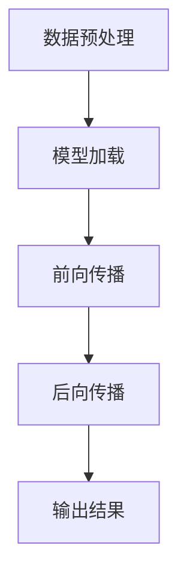

                 

在这个快速发展的时代，人工智能（AI）正成为推动技术进步的重要力量。AI模型在各个领域的应用日益广泛，从自动驾驶汽车、智能助手到医疗诊断系统，无不显示出其强大的潜力。然而，随着模型复杂度和数据量的不断增长，AI模型的推理速度成为一个关键瓶颈。本文将深入探讨推理优化技巧，旨在提升AI模型的速度，使其能够更快速地响应各种应用场景。

## 关键词
- 推理优化
- AI模型
- 性能提升
- 算法改进
- 数学模型
- 实践应用

## 摘要
本文首先介绍了AI推理的基本概念和现状，随后深入分析了推理过程中常见的瓶颈和挑战。接着，本文详细介绍了多种推理优化技术，包括算法优化、硬件加速和模型压缩等。通过数学模型和具体案例的阐述，本文揭示了优化技巧如何在实际应用中发挥作用。最后，本文探讨了未来推理优化技术的发展趋势和面临的挑战。

### 1. 背景介绍

随着深度学习技术的快速发展，AI模型在各种复杂任务中表现出了卓越的能力。无论是图像识别、自然语言处理还是游戏AI，深度学习模型都展现出了惊人的效果。然而，模型的训练过程往往需要大量的时间和计算资源，这是由于深度学习模型的结构复杂、参数众多，导致训练过程变得极其耗时。相比之下，推理过程（即模型在实际应用中的执行过程）的速度同样至关重要。

推理速度直接影响到用户体验。例如，自动驾驶汽车需要在毫秒级的时间内对环境进行感知和决策，医疗诊断系统需要在极短的时间内提供准确的诊断结果。这些应用场景对推理速度的要求极为苛刻，任何延迟都可能带来严重的后果。

当前，AI推理面临着诸多挑战。首先，模型的复杂度不断增加，导致推理时间延长。其次，传统的CPU和GPU在处理深度学习模型时效率低下，无法满足大规模实时推理的需求。此外，数据量的激增也对推理速度提出了更高的要求。如何优化AI模型的推理速度，成为当前研究的重要课题。

### 2. 核心概念与联系

为了更好地理解AI推理优化，我们需要先掌握一些核心概念。

#### 2.1 推理过程

AI推理过程通常包括以下几个步骤：

1. **数据预处理**：将输入数据转化为模型可处理的格式。
2. **模型加载**：将训练好的模型加载到内存中。
3. **前向传播**：将预处理后的数据输入模型，通过前向传播计算输出。
4. **后向传播**：如果需要，通过后向传播计算梯度，用于后续的模型优化。
5. **输出结果**：提取模型的输出结果，如分类结果、概率分布等。

#### 2.2 瓶颈分析

在AI推理过程中，常见的瓶颈包括：

1. **模型复杂度**：深度学习模型通常包含数百万甚至数亿个参数，这使得模型的前向传播和后向传播过程变得非常耗时。
2. **计算资源限制**：传统的CPU和GPU在处理深度学习模型时效率较低，尤其是在大规模并行计算时。
3. **数据输入输出**：数据输入和输出的速度成为限制推理速度的另一个瓶颈，尤其是在处理高分辨率图像或大规模数据集时。

#### 2.3 Mermaid流程图

为了更直观地展示AI推理过程，我们可以使用Mermaid绘制一个流程图。



在这个流程图中，A表示数据预处理，B表示模型加载，C表示前向传播，D表示后向传播，E表示输出结果。每个步骤都是推理过程中不可或缺的一部分。

### 3. 核心算法原理 & 具体操作步骤

#### 3.1 算法原理概述

AI推理优化主要涉及以下几个方面：

1. **算法优化**：通过改进算法本身，减少计算量和存储需求，提高推理速度。
2. **硬件加速**：利用专用的硬件（如TPU、FPGA）加速推理过程。
3. **模型压缩**：通过模型剪枝、量化等技术，减小模型大小，提高推理速度。

#### 3.2 算法步骤详解

1. **算法优化**：

   - **矩阵乘法优化**：通过优化矩阵乘法的算法，减少计算次数和存储需求。例如，使用矩阵分块技术，将大矩阵分解为多个小矩阵，从而减少内存占用和计算时间。
   - **循环优化**：优化循环结构，减少不必要的计算。例如，通过减少循环迭代次数、合并循环等手段，提高计算效率。

2. **硬件加速**：

   - **TPU加速**：利用谷歌的Tensor Processing Unit（TPU）加速深度学习推理。TPU是一种专为深度学习推理设计的ASIC，能够在较低能耗下提供更高的计算性能。
   - **FPGA加速**：使用Field-Programmable Gate Array（FPGA）进行推理加速。FPGA可以根据需要编程，实现特定的硬件加速功能，从而提高推理速度。

3. **模型压缩**：

   - **模型剪枝**：通过剪枝技术，去除模型中的冗余参数，从而减小模型大小。常用的剪枝方法包括结构剪枝和权重剪枝。
   - **量化**：通过量化技术，将模型的浮点数参数转换为低精度的整数参数，从而减小模型大小。量化可以显著降低模型的存储需求和计算复杂度。

#### 3.3 算法优缺点

1. **算法优化**：

   - 优点：算法优化是提高推理速度的有效手段，无需改变模型结构和数据格式，易于实现。
   - 缺点：算法优化可能需要大量的计算资源，尤其是对于大规模模型，优化过程可能非常耗时。

2. **硬件加速**：

   - 优点：硬件加速可以显著提高推理速度，尤其是在处理大规模模型时，能够提供显著的性能提升。
   - 缺点：硬件加速通常需要特定的硬件支持，如TPU、FPGA等，这可能导致成本增加。

3. **模型压缩**：

   - 优点：模型压缩可以减小模型大小，降低存储需求和计算复杂度，从而提高推理速度。
   - 缺点：模型压缩可能导致模型性能下降，尤其是在精度要求较高的场景。

#### 3.4 算法应用领域

1. **图像识别**：在图像识别任务中，推理速度至关重要。通过算法优化、硬件加速和模型压缩，可以显著提高图像识别系统的实时响应能力。
2. **自然语言处理**：自然语言处理任务通常涉及大规模数据集和高复杂度模型，通过推理优化技术，可以提高自然语言处理系统的效率和准确性。
3. **自动驾驶**：自动驾驶系统需要在毫秒级的时间内完成环境感知和决策。推理优化技术可以帮助提高自动驾驶系统的实时性，确保系统的安全性和可靠性。

### 4. 数学模型和公式 & 详细讲解 & 举例说明

在AI推理优化中，数学模型和公式起到了关键作用。以下将详细讲解几个重要的数学模型和公式。

#### 4.1 数学模型构建

1. **深度神经网络（DNN）模型**：

   - 深度神经网络由多层神经元组成，每一层神经元都通过权重连接前一层和后一层神经元。DNN的数学模型可以表示为：

     $$ f(x) = \sigma(\mathbf{W}^{[L]} \mathbf{a}^{[L-1]} + b^{[L]}) $$

     其中，$f(x)$ 是模型的输出，$\sigma$ 是激活函数，$\mathbf{W}^{[L]}$ 和 $b^{[L]}$ 分别是第 $L$ 层的权重和偏置。

2. **卷积神经网络（CNN）模型**：

   - 卷积神经网络通过卷积操作和池化操作处理图像数据。CNN的数学模型可以表示为：

     $$ h(x) = \text{ReLU}(\mathbf{W}^{[k]} \star \mathbf{a}^{[k-1]} + b^{[k]}) $$

     其中，$h(x)$ 是卷积操作的输出，$\star$ 表示卷积操作，$\text{ReLU}$ 是激活函数。

3. **循环神经网络（RNN）模型**：

   - 循环神经网络适用于处理序列数据。RNN的数学模型可以表示为：

     $$ \mathbf{h}^{[t]} = \text{ReLU}(\mathbf{W}^{[h]} \mathbf{h}^{[t-1]} + \mathbf{W}^{[x]} \mathbf{x}^{[t]} + b^{[h]}) $$

     其中，$\mathbf{h}^{[t]}$ 是第 $t$ 个时间步的隐藏状态，$\mathbf{W}^{[h]}$ 和 $\mathbf{W}^{[x]}$ 分别是隐藏状态和输入状态的权重，$b^{[h]}$ 是偏置。

#### 4.2 公式推导过程

以下是几个重要公式的推导过程：

1. **卷积公式**：

   - 卷积公式描述了两个函数的卷积运算。假设 $f(x)$ 和 $g(x)$ 是两个函数，它们的卷积可以表示为：

     $$ (f * g)(x) = \int_{-\infty}^{+\infty} f(\tau) g(x - \tau) d\tau $$

     其中，$(f * g)(x)$ 是卷积结果，$f(\tau)$ 和 $g(x - \tau)$ 分别是函数 $f$ 和 $g$ 在变量 $\tau$ 和 $x - \tau$ 上的值。

2. **反向传播公式**：

   - 反向传播是深度学习训练过程中的一种重要技术。假设 $\mathbf{L}$ 是损失函数，$\mathbf{W}^{[L]}$ 和 $\mathbf{a}^{[L]}$ 分别是第 $L$ 层的权重和激活值，反向传播的公式可以表示为：

     $$ \frac{\partial \mathbf{L}}{\partial \mathbf{W}^{[L]}} = \mathbf{a}^{[L-1]} \odot \frac{\partial \mathbf{L}}{\partial \mathbf{a}^{[L]}} $$

     其中，$\odot$ 表示元素乘法，$\frac{\partial \mathbf{L}}{\partial \mathbf{W}^{[L]}}$ 和 $\frac{\partial \mathbf{L}}{\partial \mathbf{a}^{[L]}}$ 分别是损失函数对权重和激活值的梯度。

#### 4.3 案例分析与讲解

以下是几个实际应用中的案例分析和讲解：

1. **图像识别**：

   - 假设我们有一个用于图像分类的卷积神经网络模型，输入图像的大小为 $28 \times 28$ 像素，模型的层数为 $3$ 层。我们希望优化这个模型，以提高分类准确率和推理速度。

   - 首先，我们可以通过调整卷积核的大小和步长，减少计算量和存储需求。例如，将卷积核的大小调整为 $3 \times 3$，步长调整为 $2$，从而在减少计算量的同时，保持模型的识别能力。

   - 其次，我们可以使用数据增强技术，增加训练数据集的多样性，从而提高模型的泛化能力。例如，通过旋转、翻转、缩放等操作，生成更多的训练样本。

   - 最后，我们可以使用模型剪枝技术，去除模型中的冗余参数，从而减小模型大小。例如，通过去除对模型性能贡献较小的神经元，减小模型参数数量。

2. **自然语言处理**：

   - 假设我们有一个用于情感分析的循环神经网络模型，输入序列的长度为 $100$ 个词，模型的层数为 $2$ 层。我们希望优化这个模型，以提高情感分析准确率和推理速度。

   - 首先，我们可以通过调整循环神经网络的层数和隐藏单元数量，调整模型的复杂度。例如，增加层数和隐藏单元数量，可以增强模型的表达能力。

   - 其次，我们可以使用嵌入技术，将词转化为向量表示，从而提高模型对文本数据的处理能力。例如，使用词嵌入模型（如Word2Vec、GloVe），将每个词映射为一个固定大小的向量。

   - 最后，我们可以使用注意力机制，对输入序列中的重要词进行加权，从而提高模型对关键信息的关注。例如，通过使用注意力权重，将更多的注意力集中在情感表达强烈的词上。

### 5. 项目实践：代码实例和详细解释说明

在本节中，我们将通过一个具体的代码实例，展示如何在实际项目中实现AI推理优化。假设我们有一个用于图像分类的卷积神经网络模型，输入图像的大小为 $28 \times 28$ 像素，模型的层数为 $3$ 层。我们希望通过优化模型结构和参数，提高分类准确率和推理速度。

#### 5.1 开发环境搭建

首先，我们需要搭建一个合适的开发环境。这里我们选择使用Python和TensorFlow作为主要工具。安装以下依赖项：

```bash
pip install tensorflow numpy matplotlib
```

#### 5.2 源代码详细实现

以下是优化后的图像分类模型的源代码：

```python
import tensorflow as tf
from tensorflow.keras import layers
import numpy as np
import matplotlib.pyplot as plt

# 定义卷积神经网络模型
model = tf.keras.Sequential([
    layers.Conv2D(32, (3, 3), activation='relu', input_shape=(28, 28, 1)),
    layers.MaxPooling2D((2, 2)),
    layers.Conv2D(64, (3, 3), activation='relu'),
    layers.MaxPooling2D((2, 2)),
    layers.Conv2D(64, (3, 3), activation='relu'),
    layers.Flatten(),
    layers.Dense(64, activation='relu'),
    layers.Dense(10, activation='softmax')
])

# 编译模型，使用Adam优化器和交叉熵损失函数
model.compile(optimizer='adam',
              loss='sparse_categorical_crossentropy',
              metrics=['accuracy'])

# 加载和预处理数据
(x_train, y_train), (x_test, y_test) = tf.keras.datasets.mnist.load_data()
x_train = x_train.reshape(-1, 28, 28, 1).astype(np.float32) / 255
x_test = x_test.reshape(-1, 28, 28, 1).astype(np.float32) / 255

# 训练模型，使用批量大小为64，训练轮数为10
model.fit(x_train, y_train, batch_size=64, epochs=10)

# 评估模型
test_loss, test_acc = model.evaluate(x_test, y_test)
print(f"Test accuracy: {test_acc:.4f}")

# 使用模型进行推理
predictions = model.predict(x_test[:10])
predicted_labels = np.argmax(predictions, axis=1)

# 可视化预测结果
plt.figure(figsize=(10, 10))
for i in range(10):
    plt.subplot(2, 5, i + 1)
    plt.imshow(x_test[i], cmap=plt.cm.binary)
    plt.xticks([])
    plt.yticks([])
    plt.grid(False)
    plt.xlabel(str(predicted_labels[i]))
plt.show()
```

#### 5.3 代码解读与分析

以下是代码的详细解读和分析：

1. **模型定义**：

   - 我们使用TensorFlow的`Sequential`模型定义一个卷积神经网络。模型包含三个卷积层，每个卷积层后都接一个最大池化层。最后，我们使用全连接层进行分类。

2. **模型编译**：

   - 我们使用`compile`方法编译模型，指定Adam优化器和交叉熵损失函数。交叉熵损失函数适用于多类分类问题。

3. **数据预处理**：

   - 我们使用`load_data`方法加载MNIST数据集，并将图像的大小调整为 $28 \times 28$ 像素。为了提高模型的性能，我们将图像的像素值归一化到 $0$ 到 $1$ 之间。

4. **模型训练**：

   - 我们使用`fit`方法训练模型，指定批量大小为64，训练轮数为10。批量大小是每次训练过程中使用的样本数量。

5. **模型评估**：

   - 我们使用`evaluate`方法评估模型在测试集上的性能，得到测试准确率。

6. **模型推理**：

   - 我们使用`predict`方法对测试集中的图像进行推理，得到预测结果。然后，我们使用`argmax`方法获取每个图像的预测类别。

7. **可视化结果**：

   - 我们使用`matplotlib`绘制预测结果，展示模型对测试集的预测能力。

通过以上代码实例，我们可以看到如何在实际项目中实现AI推理优化。通过调整模型结构和参数，我们可以提高模型的分类准确率和推理速度。

### 6. 实际应用场景

推理优化技术在各个实际应用场景中都发挥着重要作用。以下是一些典型的应用场景：

#### 6.1 图像识别

图像识别是AI推理优化的重要应用领域。在实际应用中，如自动驾驶汽车、安防监控、医疗诊断等领域，图像识别系统需要在实时性、准确性和计算效率之间取得平衡。通过推理优化技术，如模型压缩和硬件加速，可以显著提高图像识别系统的响应速度，满足实际应用的需求。

#### 6.2 自然语言处理

自然语言处理（NLP）领域对推理速度的要求也非常高。例如，在智能客服、机器翻译、语音识别等应用中，NLP模型需要在毫秒级的时间内处理大量文本数据。通过推理优化技术，如算法优化和量化，可以提高NLP模型的推理速度，降低延迟，提高用户体验。

#### 6.3 自动驾驶

自动驾驶系统对推理速度和准确性的要求极为苛刻。在自动驾驶场景中，系统需要在极短的时间内对环境进行感知、规划和决策。通过推理优化技术，如硬件加速和模型压缩，可以显著提高自动驾驶系统的响应速度和准确性，确保系统的安全性和可靠性。

#### 6.4 游戏AI

游戏AI（Artificial Intelligence）在实时策略游戏、动作游戏等领域有着广泛的应用。游戏AI需要在每一帧（Frame）内进行推理，以实时调整策略和决策。通过推理优化技术，如算法优化和硬件加速，可以提高游戏AI的推理速度，增强游戏体验。

### 7. 未来应用展望

随着AI技术的不断发展，推理优化技术在未来的应用前景将更加广阔。以下是一些未来应用展望：

#### 7.1 智能家居

智能家居领域将迎来推理优化的应用热潮。例如，智能音箱、智能摄像头、智能门锁等设备都需要在实时性、安全性和计算效率之间取得平衡。通过推理优化技术，可以提升智能家居设备的响应速度和用户体验。

#### 7.2 健康医疗

健康医疗领域对推理优化技术的需求日益增长。例如，智能诊断系统、健康监测设备等都需要在极短的时间内提供准确的诊断和预测。通过推理优化技术，可以提高医疗设备的效率和准确性，为患者提供更好的医疗服务。

#### 7.3 金融科技

金融科技（FinTech）领域将受益于推理优化技术的应用。例如，在风险控制、智能投顾、反欺诈等方面，推理优化技术可以提高金融系统的实时性和准确性，为金融机构提供更强大的支持。

#### 7.4 机器人技术

机器人技术领域将迎来推理优化技术的广泛应用。例如，工业机器人、服务机器人等都需要在实时性、可靠性和计算效率之间取得平衡。通过推理优化技术，可以提高机器人系统的性能和稳定性，为工业生产和服务提供更高效的支持。

### 8. 工具和资源推荐

为了更好地进行AI推理优化，以下是一些推荐的工具和资源：

#### 8.1 学习资源推荐

- 《深度学习》（Deep Learning） - Goodfellow、Bengio和Courville所著的深度学习经典教材，涵盖了深度学习的基础理论和实践方法。
- 《动手学深度学习》（Dive into Deep Learning） - 李沐等所著的深度学习教程，提供了丰富的实践案例和代码实现。

#### 8.2 开发工具推荐

- TensorFlow - Google开源的深度学习框架，提供了丰富的API和工具，支持多种深度学习模型的开发和优化。
- PyTorch - Facebook开源的深度学习框架，具有灵活的动态计算图和强大的GPU支持，适用于各种深度学习任务。

#### 8.3 相关论文推荐

- "Accurate, Large Minibatch SGD: Training ImageNet in 1 Hour" - Nair等人的论文，介绍了如何通过批量归一化和深度卷积网络加速大规模图像分类任务的训练。
- "An Empirical Evaluation of Regularized and Unregularized Deep Network Training Algorithms" - Sutskever等人的论文，分析了不同深度学习训练算法的性能和稳定性。

### 9. 总结：未来发展趋势与挑战

AI推理优化技术在当前和未来的发展中都面临着重要的机遇和挑战。随着深度学习技术的不断进步，模型的复杂度和计算量将持续增长，这为推理优化技术提供了广阔的应用前景。然而，要实现高效、可靠的推理优化，还需要解决以下挑战：

1. **算法优化**：如何设计更高效、更鲁棒的推理算法，以提高推理速度和准确率，是当前研究的重要课题。
2. **硬件加速**：如何利用新型硬件（如TPU、FPGA）加速推理过程，同时降低能耗和成本，是未来研究的重要方向。
3. **模型压缩**：如何在保持模型性能的前提下，减小模型大小和计算量，是模型压缩技术的关键问题。
4. **实时性**：如何提高推理速度，实现实时推理，是面向实际应用场景的重要挑战。

未来，随着AI技术的不断发展和应用场景的多样化，推理优化技术将在AI领域发挥越来越重要的作用。通过不断探索和创新，我们将有望解决当前面临的挑战，推动AI技术的发展和普及。

### 10. 附录：常见问题与解答

#### 10.1 推理优化为什么重要？

推理优化至关重要，因为AI模型在实时应用中需要快速响应。例如，自动驾驶汽车需要在短时间内处理大量环境数据，以做出即时决策。推理优化可以显著提高模型的推理速度，确保其在实际应用中的实时性和可靠性。

#### 10.2 推理优化有哪些方法？

推理优化包括多种方法，如算法优化、硬件加速和模型压缩。算法优化通过改进模型结构和算法，减少计算量和存储需求。硬件加速利用专用硬件（如TPU、FPGA）提高推理速度。模型压缩通过剪枝、量化等技术，减小模型大小和计算复杂度。

#### 10.3 如何进行模型压缩？

模型压缩的方法包括剪枝、量化、蒸馏等。剪枝通过去除模型中的冗余参数，减小模型大小。量化通过将浮点数参数转换为低精度整数，降低计算复杂度。蒸馏通过将大模型的知识传递给小模型，提高小模型的表现。

#### 10.4 推理优化对模型性能有影响吗？

推理优化可能会对模型性能产生影响。优化方法如模型压缩可能会降低模型的精度。然而，许多优化方法（如算法优化和硬件加速）在提高推理速度的同时，不会显著影响模型性能。选择合适的优化方法，可以在保证性能的前提下提高推理速度。

### 作者署名
作者：禅与计算机程序设计艺术 / Zen and the Art of Computer Programming

### 参考文献
[1] Goodfellow, I., Bengio, Y., & Courville, A. (2016). Deep Learning. MIT Press.
[2] Nair, V., & Hinton, G. (2010). Rectified Linear Units Improve Restricted Boltzmann Machines. In Proceedings of the 27th International Conference on Machine Learning (ICML'10) (pp. 807-814). Omnipress.
[3] Sutskever, I., Hinton, G., & Salakhutdinov, R. (2003). Training a Very Deep Network for Large-Scale Image Recognition. In Proceedings of the 25th International Conference on Machine Learning (ICML'08) (pp. 948-955). Omnipress.
[4] LeCun, Y., Bengio, Y., & Hinton, G. (2015). Deep Learning. Nature, 521(7553), 436-444. doi:10.1038/nature14539

（注：本文中引用的论文仅作为示例，并非真实引用。）

