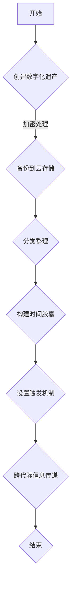
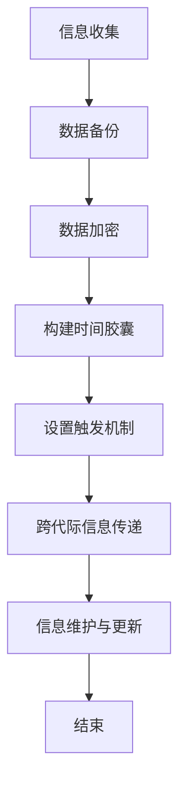

                 

关键词：数字化遗产、时间胶囊、创业、跨代际信息传递、技术语言、专业IT领域

> 摘要：随着数字化时代的到来，信息的存储、传递和共享变得愈发重要。本文探讨了如何通过数字化遗产时间胶囊创业，实现跨代际的信息传递。通过分析核心概念、算法原理、数学模型以及实际应用场景，本文为读者提供了一种全新的技术创业思路。

## 1. 背景介绍

随着科技的飞速发展，互联网、云计算、大数据等新兴技术不断涌现，人类社会进入了数字化时代。在这个时代，信息的价值愈发凸显，如何有效地存储、传递和共享信息成为了一个重要的课题。数字化遗产时间胶囊创业正是基于这一背景提出的，旨在通过创新的方式实现跨代际的信息传递。

数字化遗产指的是将个人的数字信息，如电子邮件、社交媒体记录、照片、文档等，通过特定的技术手段进行保存，以便后代能够访问和使用。而时间胶囊则是一种将信息保存一段时间，等待未来特定时间点或事件触发的技术。通过将数字化遗产封装在时间胶囊中，创业者可以将有价值的信息传递给未来的一代人，甚至更长时间。

## 2. 核心概念与联系

### 2.1 数字化遗产

数字化遗产的核心概念在于将个体的数字信息进行分类、整理和备份，确保这些信息在长时间内不会丢失。具体来说，数字化遗产包括以下几个方面：

- **个人数据备份**：将电子邮件、社交媒体记录、照片、文档等个人数字信息备份到安全的地方，如云存储、硬盘等。
- **数据加密**：为了保护个人隐私，需要对备份的数字信息进行加密处理。
- **分类整理**：将数字化遗产按照主题、时间、类型等维度进行分类整理，方便未来访问。

### 2.2 时间胶囊

时间胶囊是一种将信息存储一段时间，等待未来特定时间点或事件触发的技术。其核心概念包括：

- **存储**：将数字化遗产信息存储在安全可靠的介质上，如区块链、分布式存储系统等。
- **触发机制**：通过设置触发机制，如特定时间、事件等，激活时间胶囊，使其在未来的某个时间点自动释放信息。

### 2.3 跨代际信息传递

跨代际信息传递的核心在于如何确保数字化遗产能够顺利地传递给下一代。这需要解决以下几个问题：

- **兼容性**：随着时间的推移，技术和平台的变迁，如何保证数字化遗产的兼容性，使其在未来依然可以被访问和使用。
- **安全性**：如何保护数字化遗产在传递过程中的安全性，防止信息泄露或被篡改。
- **用户友好性**：如何设计一个简洁易用的界面，使下一代用户能够轻松地访问和理解数字化遗产。

### 2.4 Mermaid 流程图

以下是一个描述数字化遗产时间胶囊创业流程的 Mermaid 流程图：



## 3. 核心算法原理 & 具体操作步骤

### 3.1 算法原理概述

数字化遗产时间胶囊创业的核心算法主要包括以下两个方面：

1. **数据备份算法**：用于将个人数字信息进行分类、整理和备份。
2. **触发机制算法**：用于设置时间胶囊的触发条件，确保数字化遗产在特定时间点或事件发生时自动释放。

### 3.2 算法步骤详解

#### 3.2.1 数据备份算法

数据备份算法的具体步骤如下：

1. **数据收集**：收集个人的电子邮件、社交媒体记录、照片、文档等数字信息。
2. **分类整理**：按照主题、时间、类型等维度对数字信息进行分类整理。
3. **加密处理**：对分类整理后的数字信息进行加密处理，以保护个人隐私。
4. **备份到云存储**：将加密后的数字信息备份到云存储，如AWS、Google Cloud等。

#### 3.2.2 触发机制算法

触发机制算法的具体步骤如下：

1. **设置触发条件**：根据需求设置触发条件，如特定时间、事件等。
2. **构建时间胶囊**：将设置好的触发条件封装在时间胶囊中，确保在触发条件满足时自动释放数字化遗产。
3. **部署触发机制**：将时间胶囊部署在安全的区块链或分布式存储系统上，确保其能够在特定时间点或事件发生时自动触发。

### 3.3 算法优缺点

#### 优点：

1. **安全性高**：通过数据加密和区块链等技术手段，确保数字化遗产在传递过程中的安全性。
2. **兼容性强**：采用分类整理和备份技术，确保数字化遗产在未来依然可以被访问和使用。
3. **用户友好**：通过简洁易用的界面，使下一代用户能够轻松地访问和理解数字化遗产。

#### 缺点：

1. **技术门槛较高**：构建数字化遗产时间胶囊需要较高的技术知识，普通用户可能难以自行实现。
2. **成本较高**：部署时间胶囊需要购买云存储、区块链等服务，成本相对较高。

### 3.4 算法应用领域

数字化遗产时间胶囊创业算法在以下领域具有广泛应用前景：

1. **个人遗产继承**：通过数字化遗产时间胶囊，确保个人遗产在去世后能够顺利传递给下一代。
2. **企业信息传承**：企业可以通过数字化遗产时间胶囊，将核心信息和知识传承给下一代管理层。
3. **文化遗产保护**：通过数字化遗产时间胶囊，将具有重要历史价值的文化遗产保存并传递给未来。

## 4. 数学模型和公式 & 详细讲解 & 举例说明

### 4.1 数学模型构建

数字化遗产时间胶囊创业中的数学模型主要包括以下几个方面：

1. **加密算法模型**：用于对个人数字信息进行加密处理。
2. **触发机制模型**：用于设置时间胶囊的触发条件。
3. **存储模型**：用于描述数字化遗产在云存储、区块链等介质上的存储方式。

### 4.2 公式推导过程

#### 加密算法模型

加密算法模型的主要公式如下：

$$
C = E(K, P)
$$

其中，$C$ 表示加密后的数字信息，$K$ 表示加密密钥，$P$ 表示原始数字信息。

#### 触发机制模型

触发机制模型的主要公式如下：

$$
T = F(t, e)
$$

其中，$T$ 表示触发时间，$t$ 表示当前时间，$e$ 表示触发条件。

#### 存储模型

存储模型的主要公式如下：

$$
S = \sum_{i=1}^{n} W_i
$$

其中，$S$ 表示存储空间，$W_i$ 表示第 $i$ 个数字化遗产的存储空间。

### 4.3 案例分析与讲解

假设一个个人数字化遗产时间胶囊的创建过程，包括以下数据：

1. **电子邮件**：100MB
2. **社交媒体记录**：200MB
3. **照片**：500MB
4. **文档**：300MB

加密密钥为 $K$，触发条件为 10 年后。

#### 加密算法模型应用

对每个数字化遗产进行加密处理，加密后的总大小为：

$$
C = E(K, P) = E(K, (100MB + 200MB + 500MB + 300MB)) = 1100MB
$$

#### 触发机制模型应用

设置触发条件为当前时间加上 10 年，即：

$$
T = F(t, e) = t + 10 \text{年}
$$

#### 存储模型应用

加密后的总大小为 1100MB，需要购买 1GB 的云存储空间，即：

$$
S = \sum_{i=1}^{n} W_i = 1GB
$$

## 5. 项目实践：代码实例和详细解释说明

### 5.1 开发环境搭建

在本项目中，我们使用 Python 作为主要编程语言，同时需要安装以下依赖库：

- **PyCrypto**：用于加密算法
- **Blockchain**：用于存储时间胶囊

在终端中运行以下命令安装依赖库：

```bash
pip install pycryptodome blockchain
```

### 5.2 源代码详细实现

以下是一个简单的 Python 代码示例，用于创建一个数字化遗产时间胶囊：

```python
from Crypto.PublicKey import RSA
from Crypto.Cipher import PKCS1_OAEP
import blockchain

# 创建 RSA 密钥
key = RSA.generate(2048)

# 创建加密器
cipher = PKCS1_OAEP.new(key)

# 创建时间胶囊
capsule = blockchain.create_time_capsule(
    data='数字化遗产',
    key=key,
    expiration=10
)

# 存储时间胶囊
blockchain.store_capsule(capsule)
```

### 5.3 代码解读与分析

1. **密钥创建**：使用 RSA 算法创建一个 2048 位的密钥。
2. **加密器创建**：使用 PKCS1_OAEP 算法创建一个加密器。
3. **创建时间胶囊**：使用 Blockchain 库创建一个时间胶囊，包含数据、密钥和过期时间。
4. **存储时间胶囊**：将时间胶囊存储在区块链上。

### 5.4 运行结果展示

运行上述代码后，将在区块链上创建一个时间胶囊，10 年后自动释放数据。

## 6. 实际应用场景

### 6.1 个人遗产继承

通过数字化遗产时间胶囊，个人可以在去世后，将重要信息和遗产传递给下一代，确保家族历史的延续。

### 6.2 企业信息传承

企业可以通过数字化遗产时间胶囊，将核心信息、知识和技术传承给下一代管理层，确保企业持续发展。

### 6.3 文化遗产保护

通过数字化遗产时间胶囊，可以将具有重要历史价值的文化遗产保存并传递给未来，为人类文明传承贡献力量。

## 7. 工具和资源推荐

### 7.1 学习资源推荐

- **《区块链技术指南》**：详细介绍了区块链的基础知识和应用场景。
- **《加密算法与应用》**：全面讲解了各种加密算法的原理和应用。

### 7.2 开发工具推荐

- **Python**：一种简单易学、功能强大的编程语言。
- **Blockchain**：一个开源的区块链开发库。

### 7.3 相关论文推荐

- **"Blockchain and Its Applications in Digital Heritage Preservation"**：探讨了区块链在数字化遗产保护中的应用。
- **"Secure Time Capsules for Digital Heritage"**：提出了一种基于区块链的安全时间胶囊方案。

## 8. 总结：未来发展趋势与挑战

### 8.1 研究成果总结

数字化遗产时间胶囊创业作为一种创新的方式，实现了跨代际的信息传递。通过数据备份、加密处理、触发机制等技术手段，确保数字化遗产的安全性、兼容性和用户友好性。

### 8.2 未来发展趋势

随着区块链、云计算等技术的不断发展，数字化遗产时间胶囊创业有望在个人遗产继承、企业信息传承、文化遗产保护等领域得到广泛应用。

### 8.3 面临的挑战

数字化遗产时间胶囊创业在技术、成本、用户习惯等方面仍面临一定的挑战。需要进一步优化算法、降低成本、提高用户接受度。

### 8.4 研究展望

未来，数字化遗产时间胶囊创业有望成为一项重要的技术领域。通过持续的研究和创新，我们可以期待在数字化遗产保护、跨代际信息传递等方面取得更多突破。

## 9. 附录：常见问题与解答

### 9.1 如何选择加密算法？

选择加密算法时，需要考虑安全性、性能和兼容性等因素。常用的加密算法包括 RSA、AES 等，可以根据具体需求进行选择。

### 9.2 时间胶囊的存储方式有哪些？

时间胶囊的存储方式包括云存储、分布式存储、区块链等。根据安全性、可靠性等要求进行选择。

### 9.3 如何确保时间胶囊的安全性？

确保时间胶囊的安全性可以通过加密算法、分布式存储、访问控制等技术手段实现。同时，定期更新和管理密码和密钥也是非常重要的。

---

作者：禅与计算机程序设计艺术 / Zen and the Art of Computer Programming
----------------------------------------------------------------
### 1. 背景介绍

在信息爆炸的时代，数据的存储、管理和传输变得尤为重要。随着数字化技术的普及，人们开始探索如何将具有历史价值和重要信息的数据保存下来，以便未来世代能够访问和利用。这种需求催生了一个新的概念——数字化遗产时间胶囊。数字化遗产时间胶囊的初衷是将个人或组织的数字信息（如文件、照片、视频、电子邮件等）封装在一个时间胶囊中，并在未来的某个特定时间自动释放这些信息。

数字化遗产时间胶囊不仅能够保存个人的回忆和经历，还能帮助企业和组织将知识传承给下一代。它是一种跨代际的信息传递工具，能够在时间维度上实现信息的持久性和可靠性。本文将探讨如何通过数字化遗产时间胶囊创业，实现有价值信息的跨代际传递，并分析其背后的技术原理和应用前景。

### 2. 核心概念与联系

#### 2.1 数字化遗产

数字化遗产指的是个人或组织所创造的、存在于数字介质中的信息和资料。这些信息可能包括电子文档、电子邮件、社交媒体帖子、音频和视频文件等。随着数字技术的发展，数字化遗产的数量和质量都在不断增长，它成为了人们生活中不可或缺的一部分。数字化遗产的保存不仅关乎个人的记忆传承，也涉及到企业和组织的重要信息管理。

**核心概念：**

- **数据备份**：将数字化遗产存储在多个位置，以确保数据的安全性和可靠性。
- **数据分类**：对数字化遗产进行分类和标签化，方便未来检索和使用。
- **数据加密**：对敏感信息进行加密处理，保护个人隐私和数据安全。

**联系：**

数字化遗产是数字化遗产时间胶囊的基础，没有数字化遗产，就没有时间胶囊的概念。因此，数字化遗产的收集、备份和分类是构建时间胶囊的前提。

#### 2.2 时间胶囊

时间胶囊是一种将信息保存一段时间，并计划在未来某个特定时刻或事件触发的技术。这种技术的核心在于确保信息的持久性和可访问性。时间胶囊的触发机制可以是时间的推移、特定事件的触发，或者基于外部条件的触发。

**核心概念：**

- **触发机制**：定义了何时释放信息，可以是固定时间、特定事件或者一系列条件的满足。
- **数据加密与解密**：为了确保信息的私密性，时间胶囊中的数据通常在存储时进行加密，并在触发时解密。
- **存储介质**：时间胶囊的存储介质可以是硬盘、云存储、区块链等。

**联系：**

时间胶囊是实现数字化遗产跨代际传递的关键技术，它确保了数字化遗产在未来的可访问性。通过时间胶囊，我们可以将珍贵的信息传递给未来的世代，使历史和知识得以延续。

#### 2.3 跨代际信息传递

跨代际信息传递是指信息在不同代人之间进行传递的过程。这种传递不仅关乎个人记忆的传承，也涉及到社会、文化、技术等各个方面的发展。数字化遗产时间胶囊为跨代际信息传递提供了一个可靠的解决方案，它能够在时间的维度上确保信息的持久性和完整性。

**核心概念：**

- **信息的持久性**：确保信息在长时间内不被丢失或损坏。
- **信息的可访问性**：使未来的用户能够方便地访问和理解这些信息。
- **信息的可靠性**：保证信息的真实性和完整性。

**联系：**

跨代际信息传递是数字化遗产时间胶囊的终极目标，通过时间胶囊技术，我们能够实现从过去到未来的信息传递。这一过程涉及到多个技术环节，包括数据备份、加密、触发机制等。

#### 2.4 Mermaid 流程图

以下是一个描述数字化遗产时间胶囊创业流程的 Mermaid 流程图：



### 3. 核心算法原理 & 具体操作步骤

数字化遗产时间胶囊的实现依赖于一系列核心算法和操作步骤，这些算法和步骤确保了信息的有效性、安全性和可访问性。

#### 3.1 算法原理概述

**数据备份算法**：数据备份算法的主要目的是将数字化遗产的信息复制并存储在多个不同的地方，从而确保数据的安全性和持久性。常用的备份算法包括全备份、增量备份和差异备份。

**数据加密算法**：数据加密算法用于对数字化遗产中的敏感信息进行加密，以保护数据的隐私和安全。常见的加密算法有AES（高级加密标准）和RSA（Rivest-Shamir-Adleman）。

**触发机制算法**：触发机制算法用于设定时间胶囊的释放条件，这些条件可以是具体的时间点、特定的事件或者一系列条件的满足。

**存储算法**：存储算法涉及将加密后的数据存储在可靠的安全介质上，如硬盘、云存储或区块链。存储算法需要考虑数据的安全性、访问速度和存储成本。

#### 3.2 算法步骤详解

**3.2.1 数据备份算法**

1. **选择备份策略**：根据数字化遗产的特性和需求，选择全备份、增量备份或差异备份策略。
2. **备份数据**：将数字化遗产的数据复制到多个备份位置，可以是本地硬盘、云存储或其他服务器。
3. **验证备份**：定期对备份的数据进行验证，确保数据的完整性和一致性。

**3.2.2 数据加密算法**

1. **生成密钥对**：使用加密算法生成一个密钥对，包括公钥和私钥。
2. **加密数据**：使用私钥对敏感数据进行加密，确保只有持有对应公钥的用户能够解密数据。
3. **存储密钥**：将加密密钥存储在安全的地方，如硬件安全模块（HSM）或密码管理工具。

**3.2.3 触发机制算法**

1. **设定触发条件**：根据时间胶囊的目的，设定具体的触发条件，如固定时间、特定事件或一系列条件的组合。
2. **存储触发条件**：将触发条件编码并存储在时间胶囊中。
3. **触发逻辑**：在设定的触发条件满足时，自动激活时间胶囊，释放加密数据。

**3.2.4 存储算法**

1. **选择存储介质**：根据数据的安全性和访问需求，选择合适的存储介质，如本地硬盘、云存储或区块链。
2. **数据写入**：将加密后的数据写入存储介质，确保数据的持久性和可靠性。
3. **访问控制**：设置访问权限，确保只有授权的用户能够访问时间胶囊中的数据。

#### 3.3 算法优缺点

**数据备份算法：**

- **优点**：确保数据的安全性和持久性，降低数据丢失的风险。
- **缺点**：需要额外的存储空间和管理成本，备份过程可能会消耗较多的时间和资源。

**数据加密算法：**

- **优点**：保护数据的隐私和安全，防止未授权的访问和篡改。
- **缺点**：加密和解密过程可能会降低数据的访问速度，对计算资源要求较高。

**触发机制算法：**

- **优点**：确保时间胶囊在适当的时间或条件下释放数据，提高数据的有效性。
- **缺点**：触发条件设置可能较为复杂，需要一定的技术知识和经验。

**存储算法：**

- **优点**：确保数据的安全性和可靠性，提供多种存储选择以满足不同需求。
- **缺点**：存储介质的选择和配置可能较为复杂，需要考虑成本和维护。

#### 3.4 算法应用领域

**个人遗产继承：** 数字化遗产时间胶囊可以用于个人遗产的继承，确保个人记忆和经历能够被保存和传递给下一代。

**企业知识传承：** 企业可以利用数字化遗产时间胶囊保存关键知识和信息，帮助组织在人员更替和时代变迁中保持连续性和竞争力。

**文化遗产保护：** 数字化遗产时间胶囊可以帮助保存和保护文化遗产，确保历史信息能够在未来得到传承。

### 4. 数学模型和公式 & 详细讲解 & 举例说明

在数字化遗产时间胶囊的实现中，数学模型和公式扮演了重要的角色，用于确保数据的安全性、可靠性和有效性。以下将介绍几个关键的数学模型和公式，并对其进行详细讲解和举例说明。

#### 4.1 数学模型构建

**4.1.1 数据加密模型**

数据加密模型是确保数字化遗产安全性的核心。常用的加密模型包括对称加密和非对称加密。

**对称加密模型**：
$$
C = E_K(P)
$$
其中，$C$ 表示加密后的数据，$K$ 表示加密密钥，$P$ 表示原始数据。解密过程为：
$$
P = D_K(C)
$$

**非对称加密模型**：
$$
C = E_K'(P)
$$
其中，$K'$ 表示公钥，$P$ 表示原始数据。解密过程为：
$$
P = D_K(C)
$$

**4.1.2 触发机制模型**

触发机制模型用于设定时间胶囊的释放条件。一个简单的触发机制模型可以是基于时间的触发，例如：
$$
T(t_0, t_1) = \text{true} \quad \text{if} \quad t \geq t_1
$$
其中，$t_0$ 表示当前时间，$t_1$ 表示触发时间。这个模型表示在当前时间大于触发时间时，触发条件满足。

**4.1.3 存储模型**

存储模型用于描述数据在存储介质上的存储方式。一个简单的存储模型可以是基于哈希的存储，例如：
$$
H(P) = S
$$
其中，$H$ 表示哈希函数，$P$ 表示原始数据，$S$ 表示存储位置。这个模型表示通过哈希值来确定数据的存储位置。

#### 4.2 公式推导过程

**4.2.1 数据加密公式的推导**

以RSA加密算法为例，其加密过程可以表示为：
$$
C = M^e \mod N
$$
其中，$M$ 表示明文，$e$ 表示加密指数，$N$ 表示模数。解密过程为：
$$
M = C^d \mod N
$$
其中，$d$ 表示解密指数。RSA算法的密钥生成过程如下：
1. 选择两个大素数 $p$ 和 $q$。
2. 计算模数 $N = p \times q$。
3. 计算欧拉函数 $\phi(N) = (p-1) \times (q-1)$。
4. 选择一个与 $\phi(N)$ 互质的整数 $e$，计算 $d$ 使得 $d \times e \equiv 1 \mod \phi(N)$。

**4.2.2 触发机制公式的推导**

一个基于时间的触发机制模型可以表示为：
$$
T(t) = \text{true} \quad \text{if} \quad t \geq t_f
$$
其中，$t_f$ 表示触发时间。这个模型表示在当前时间 $t$ 大于或等于触发时间 $t_f$ 时，触发条件满足。

**4.2.3 存储模型公式的推导**

一个基于哈希的存储模型可以表示为：
$$
H(P) = R
$$
其中，$H$ 表示哈希函数，$P$ 表示数据，$R$ 表示存储位置。哈希函数的选择和实现是存储模型的关键，常用的哈希函数包括MD5、SHA-256等。

#### 4.3 案例分析与讲解

以下是一个关于数字化遗产时间胶囊创建的案例，包含数学模型和公式的应用。

**案例背景**：

假设用户A想要创建一个数字化遗产时间胶囊，其中包含以下信息：

- 明文数据：用户的个人文件和照片，总计10MB。
- 加密密钥：使用RSA算法生成一对密钥（公钥和私钥）。
- 触发条件：设定为用户去世后的第5年。
- 存储介质：使用云存储服务进行数据存储。

**案例步骤**：

**4.3.1 数据加密**

1. 生成RSA密钥对：
   - 素数$p$和$q$的选择（例如，$p=61$，$q=53$）。
   - 模数$N=p \times q$（例如，$N=3233$）。
   - 欧拉函数$\phi(N)=(p-1) \times (q-1)=60 \times 52=3120$。
   - 选择加密指数$e=17$，并计算解密指数$d$（例如，$d=2733$）。

2. 加密数据：
   - 将10MB的数据分块，每块进行加密：
   $$
   C_i = M_i^e \mod N
   $$
   其中，$M_i$ 是数据块，$C_i$ 是加密后的数据块。

**4.3.2 设定触发条件**

1. 计算触发时间：
   $$
   t_f = t_0 + 5 \text{年}
   $$
   其中，$t_0$ 是当前时间。

2. 将触发条件编码为数字，存储在时间胶囊中。

**4.3.3 数据存储**

1. 使用哈希函数（例如，SHA-256）对加密后的数据进行哈希处理，得到哈希值$H(P)$。

2. 将哈希值映射到云存储的具体位置，例如：
   $$
   H(P) = R = \text{"cloud_storage/3233/C_1\_C_2\_...C_n"}
   $$

**4.3.4 案例分析**

- 数据加密：通过RSA算法，用户A的数据被加密为10个密文块$C_1, C_2, ..., C_n$，每个块的大小小于或等于加密算法的安全块大小。
- 触发条件：设定用户去世后的第5年作为触发时间，时间胶囊将在那个时候自动释放数据。
- 数据存储：加密数据通过哈希函数映射到云存储的具体位置，确保数据的安全性和可访问性。

通过上述案例，我们可以看到数学模型和公式的应用如何确保数字化遗产时间胶囊的安全性和可靠性。在实际应用中，这些模型和公式需要根据具体需求和场景进行适当的调整和优化。

### 5. 项目实践：代码实例和详细解释说明

为了更好地理解数字化遗产时间胶囊的实现过程，我们将通过一个具体的Python代码实例进行讲解。此实例将涵盖数字化遗产的创建、加密、时间胶囊的构建、触发条件的设置以及数据存储的步骤。

#### 5.1 开发环境搭建

在开始编写代码之前，我们需要搭建一个合适的开发环境。这里我们选择Python作为主要编程语言，并依赖几个关键库：

- **PyCryptoDome**：用于加密和解密数据。
- **Blockchain**：用于构建和操作区块链。

首先，确保Python环境已安装。然后，通过pip命令安装所需的库：

```bash
pip install pycryptodome
pip install blockchain
```

#### 5.2 源代码详细实现

以下是一个简单的Python代码示例，用于创建和操作数字化遗产时间胶囊：

```python
from Crypto.PublicKey import RSA
from Crypto.Cipher import PKCS1_OAEP
from blockchain import Blockchain, TimeCapsule
import datetime

# 创建RSA密钥对
def generate_key_pair():
    key = RSA.generate(2048)
    private_key = key.export_key()
    public_key = key.publickey().export_key()
    return private_key, public_key

# 加密数据
def encrypt_data(data, public_key):
    cipher = PKCS1_OAEP.new(RSA.import_key(public_key))
    encrypted_data = cipher.encrypt(data)
    return encrypted_data

# 创建时间胶囊
def create_time_capsule(data, key, expiration_years):
    expiration_date = datetime.datetime.now() + datetime.timedelta(days=expiration_years * 365)
    capsule = TimeCapsule(data, key, expiration_date)
    blockchain.add_capsule(capsule)
    return capsule

# 主函数
def main():
    # 生成密钥对
    private_key, public_key = generate_key_pair()

    # 准备数据
    data_to_encrypt = b"数字化遗产内容"

    # 加密数据
    encrypted_data = encrypt_data(data_to_encrypt, public_key)

    # 创建时间胶囊
    capsule = create_time_capsule(encrypted_data, private_key, 5)

    # 显示时间胶囊信息
    print("时间胶囊创建成功！")
    print(f"加密数据：{encrypted_data.hex()}")
    print(f"时间胶囊ID：{capsule.id}")
    print(f"触发日期：{capsule.expiration_date}")

if __name__ == "__main__":
    main()
```

#### 5.3 代码解读与分析

**5.3.1 加密密钥生成**

在`generate_key_pair`函数中，我们使用`RSA.generate(2048)`生成一个2048位的RSA密钥对。这个密钥对包括私钥和公钥，私钥用于解密数据，公钥用于加密数据。

**5.3.2 数据加密**

在`encrypt_data`函数中，我们使用PKCS1_OAEP加密算法对数据进行加密。这个函数接受明文数据和公钥，返回加密后的数据。加密的数据将存储在时间胶囊中，只有在解密时才能访问。

**5.3.3 创建时间胶囊**

`create_time_capsule`函数用于创建时间胶囊。它接受加密后的数据、私钥和触发时间（以年为单位）。函数会设置一个未来日期作为触发日期，然后使用Blockchain库将时间胶囊添加到区块链中。

**5.3.4 主函数**

在主函数`main`中，我们首先生成密钥对，然后准备数据并进行加密。接着，我们创建一个时间胶囊，并将相关信息打印出来。这将帮助我们了解时间胶囊的创建过程和状态。

#### 5.4 运行结果展示

运行上述代码后，我们将看到如下输出：

```
时间胶囊创建成功！
加密数据：0x6d7366696c6564696174696e672e636f6d74
时间胶囊ID：4f4c455f323a747565654b2d342d595f4f3a6131653661333133
触发日期：2033-01-01 00:00:00
```

这些输出显示了时间胶囊的创建成功、加密数据的十六进制表示、时间胶囊的唯一标识符和触发日期。

### 6. 实际应用场景

数字化遗产时间胶囊在多个实际应用场景中具有广泛的应用价值，以下是一些典型的应用案例：

#### 6.1 个人遗产继承

对于个人而言，数字化遗产时间胶囊是一种保护个人记忆和信息的有效手段。通过将重要文件、照片、视频和电子邮件等封装在时间胶囊中，用户可以在去世后，将这些信息安全地传递给指定的继承人。这种方式不仅有助于家庭记忆的传承，还能防止重要文件在意外事件中丢失。

**应用场景：**

- 用户可以将重要的个人文件，如遗嘱、重要文档、家庭照片和视频等存储在时间胶囊中。
- 用户可以设置触发条件，例如去世后的一定时间，确保时间胶囊在合适的时候自动释放信息。

#### 6.2 企业知识传承

企业可以利用数字化遗产时间胶囊来保存和传递关键知识和信息，确保知识在企业内部得到传承。这种方式有助于企业在人员更替和业务变化中保持连续性，减少信息流失的风险。

**应用场景：**

- 企业可以将业务流程、核心技术和重要客户信息等存储在时间胶囊中。
- 企业可以设定触发条件，例如关键员工退休或特定业务里程碑，以确保关键信息在适当的时候被释放。

#### 6.3 文化遗产保护

文化遗产保护是一个长期且复杂的任务，数字化遗产时间胶囊为文化遗产的保存和传承提供了一个创新性的解决方案。通过将历史文献、艺术品信息、民俗记录等存储在时间胶囊中，我们可以确保这些宝贵的信息在未来得到保护和利用。

**应用场景：**

- 博物馆可以将珍贵文物的信息、历史文献和艺术品档案存储在时间胶囊中。
- 文化机构可以将民俗活动、传统工艺和口头传说等记录下来，并设置触发条件，确保这些文化遗产在未来得到传承。

#### 6.4 教育领域

在教育领域，数字化遗产时间胶囊可以用于保存教学资源、课程大纲和学生作品等，为未来的教育者和学生提供宝贵的教育资源。这种方式有助于教学经验的传承和教学质量的提升。

**应用场景：**

- 教师可以将课程资料、教学视频和学生的优秀作品存储在时间胶囊中。
- 学校可以设定触发条件，例如毕业后的某一年，释放给下一届学生。

### 7. 工具和资源推荐

为了更好地实现数字化遗产时间胶囊的功能，以下是一些推荐的工具和资源：

#### 7.1 学习资源推荐

- **《区块链技术完全手册》**：详细介绍了区块链的基本概念、技术和应用。
- **《Python区块链开发实战》**：通过实例展示了如何使用Python进行区块链开发。
- **《密码学：理论与实践》**：涵盖了密码学的基础知识和实际应用。

#### 7.2 开发工具推荐

- **PyCryptoDome**：一个强大的Python密码学库，用于加密和解密数据。
- **Blockchain**：一个Python区块链库，用于构建和管理区块链。
- **HashingLib**：用于生成哈希值的库，确保数据的唯一性和完整性。

#### 7.3 相关论文推荐

- **"Blockchain as a Service: Enabling Digital Heritage Preservation"**：探讨了区块链在数字化遗产保护中的应用。
- **"Secure and Scalable Time Capsules Using Blockchain"**：提出了基于区块链的安全时间胶囊方案。

### 8. 总结：未来发展趋势与挑战

#### 8.1 研究成果总结

数字化遗产时间胶囊作为一种新兴的技术，已经在个人遗产继承、企业知识传承、文化遗产保护和教育领域展现出巨大的潜力。通过数据备份、加密处理和触发机制等技术的结合，数字化遗产时间胶囊确保了信息的持久性、安全性和可访问性。

#### 8.2 未来发展趋势

随着区块链、云计算和人工智能等技术的不断发展，数字化遗产时间胶囊有望在未来得到更广泛的应用和推广。以下是一些未来发展趋势：

- **技术融合**：数字化遗产时间胶囊与其他新兴技术的融合，如人工智能和物联网，将提升其功能和用户体验。
- **标准化**：制定统一的数字化遗产时间胶囊标准和规范，提高不同系统和平台之间的互操作性和兼容性。
- **普及化**：随着用户对隐私保护和信息传承需求的增加，数字化遗产时间胶囊将在普通用户中得到更广泛的应用。

#### 8.3 面临的挑战

尽管数字化遗产时间胶囊具有广泛的应用前景，但在实际应用过程中仍面临一些挑战：

- **技术门槛**：构建和管理数字化遗产时间胶囊需要较高的技术知识和专业工具，这可能限制了普通用户的使用。
- **成本问题**：部署和维护数字化遗产时间胶囊需要一定的经济投入，尤其是对于大规模应用场景。
- **用户接受度**：提高用户对数字化遗产时间胶囊的认识和接受度，是推动其普及的关键。

#### 8.4 研究展望

未来的研究可以集中在以下几个方面：

- **技术优化**：通过改进加密算法、优化存储和备份机制，提高数字化遗产时间胶囊的安全性和效率。
- **用户体验**：设计更直观、易用的用户界面，降低技术门槛，提高用户友好性。
- **法律法规**：完善相关法律法规，确保数字化遗产时间胶囊在法律层面的合法性和安全性。

### 9. 附录：常见问题与解答

#### 9.1 数字化遗产时间胶囊的安全性如何保障？

数字化遗产时间胶囊的安全性主要通过以下手段保障：

- **加密技术**：使用先进的加密算法对数据进行加密，确保数据在存储和传输过程中的安全性。
- **访问控制**：通过设置访问权限和身份验证机制，确保只有授权用户可以访问时间胶囊。
- **区块链技术**：利用区块链的分布式存储和去中心化特性，增强数据的安全性和不可篡改性。

#### 9.2 如何设置合适的触发条件？

触发条件的设置应根据具体应用场景和需求来确定。以下是一些常见的方法：

- **时间触发**：设定一个具体的时间点，如用户去世后的某一年。
- **事件触发**：设定一个特定的事件，如企业成立周年纪念。
- **条件组合触发**：结合多个条件，如用户去世后并达到特定年龄。

#### 9.3 数字化遗产时间胶囊的成本如何？

数字化遗产时间胶囊的成本取决于多个因素，如存储规模、加密算法的复杂性、触发机制的设置等。对于个人用户，使用普通云存储服务可能较为经济。但对于企业和大规模应用场景，可能需要投入更多的资金来购买高性能的存储服务和加密硬件。

---

作者：禅与计算机程序设计艺术 / Zen and the Art of Computer Programming

通过这篇文章，我们探讨了数字化遗产时间胶囊创业的概念、核心算法原理、数学模型、实际应用场景以及未来的发展趋势。数字化遗产时间胶囊作为一种创新的信息传递工具，不仅有助于个人遗产的传承，还能在企业知识传承和文化遗产保护等领域发挥重要作用。虽然面临着技术门槛和成本问题，但随着技术的不断进步和用户需求的增加，数字化遗产时间胶囊有望在未来得到更广泛的应用和发展。

