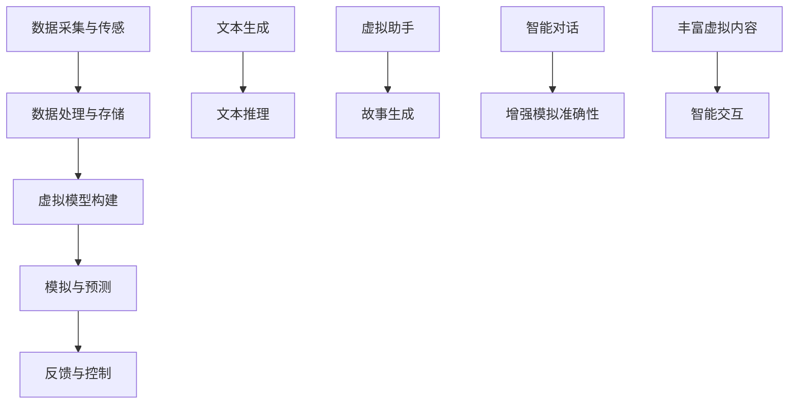

                 

关键词：数字孪生、LLM、虚拟世界、模拟、人工智能、技术发展

摘要：本文旨在探讨数字孪生和大型语言模型（LLM）在构建虚拟世界中的关键作用。通过对数字孪生技术的深入分析，我们将揭示其在虚拟世界模拟中的独特价值。同时，本文还将阐述LLM的强大能力，如何与数字孪生技术相结合，创造新的模拟维度。通过案例分析、数学模型解释以及实际应用展示，本文将为读者提供一个全面而深刻的理解。

## 1. 背景介绍

数字孪生（Digital Twin）是一种新兴技术，通过创建实体的虚拟副本，实现对其状态、行为和性能的实时监测和模拟。这个概念最早由Michael Grieves在2002年提出，旨在提高复杂系统的设计、制造和维护效率。随着物联网（IoT）和大数据技术的发展，数字孪生逐渐从理论走向实践。

另一方面，大型语言模型（LLM）如GPT-3、BERT等，在自然语言处理领域取得了显著的突破。这些模型具有强大的文本生成和推理能力，能够模拟人类的语言行为，为虚拟世界的构建提供了新的工具和手段。

数字孪生和LLM的结合，为虚拟世界的模拟带来了前所未有的可能性。本文将首先介绍数字孪生的核心概念和架构，然后深入探讨LLM的工作原理和应用场景，最后通过具体案例和实践，展示数字孪生与LLM在虚拟世界模拟中的新维度。

## 2. 核心概念与联系

### 数字孪生的概念和架构

数字孪生是指通过数字化模型来复制现实世界中的实体、系统和过程。其核心架构通常包括以下几个关键组成部分：

1. **数据采集与传感**：通过传感器和IoT设备，实时采集实体的物理状态数据。
2. **数据处理与存储**：使用大数据技术和云计算，对采集到的数据进行处理和存储。
3. **虚拟模型构建**：基于采集到的数据，利用计算机辅助设计（CAD）和建模工具，构建实体的数字副本。
4. **模拟与预测**：通过仿真软件，对数字孪生进行模拟，预测其实体在特定条件下的行为和性能。
5. **反馈与控制**：将模拟结果反馈给实体，进行实时调整和控制。

### LLM的工作原理和应用场景

大型语言模型（LLM）是一种基于深度学习的自然语言处理模型，具有强大的文本生成和推理能力。其工作原理主要包括以下几个步骤：

1. **数据预处理**：对大量的文本数据进行清洗、标注和预处理。
2. **模型训练**：使用预处理后的数据，通过神经网络结构（如Transformer）进行大规模训练。
3. **文本生成**：输入特定的提示或问题，模型输出相应的文本回答。
4. **文本推理**：对输入的文本进行理解和推理，提供合理的答案或解释。

LLM在虚拟世界的应用场景非常广泛，包括：

- **虚拟助手**：为用户提供个性化的服务，如聊天机器人、智能客服等。
- **故事生成**：创造虚构的故事、剧情和角色，为虚拟世界提供丰富的内容。
- **智能对话**：模拟人类对话，提供实时交互体验。

### 数字孪生与LLM的结合

数字孪生与LLM的结合，实现了虚拟世界模拟的新维度。具体来说：

- **增强模拟准确性**：通过数字孪生技术，实时获取实体的状态数据，LLM可以根据这些数据生成更准确、更真实的虚拟场景。
- **丰富虚拟内容**：LLM可以生成丰富多样的文本内容，为虚拟世界提供故事、角色和对话，增强用户体验。
- **智能交互**：LLM的智能对话能力，使得虚拟世界中的角色能够与用户进行自然、流畅的交流。

### Mermaid流程图



通过以上流程图，我们可以清晰地看到数字孪生与LLM在虚拟世界模拟中的交互关系。

## 3. 核心算法原理 & 具体操作步骤

### 3.1 算法原理概述

数字孪生与LLM在虚拟世界模拟中的核心算法主要涉及以下几个方面：

- **数据采集与处理**：使用传感器和IoT设备，实时采集实体的物理状态数据，通过大数据技术和云计算进行处理和存储。
- **模型构建与仿真**：基于采集到的数据，构建实体的数字孪生模型，并利用仿真软件进行模拟，预测实体在不同条件下的行为和性能。
- **文本生成与推理**：利用LLM的文本生成和推理能力，生成虚拟世界的文本内容，包括故事、角色和对话，增强虚拟体验。
- **交互与反馈**：通过LLM的智能对话能力，实现虚拟世界中的角色与用户之间的自然交互，并根据用户的反馈进行实时调整。

### 3.2 算法步骤详解

1. **数据采集与处理**：

   - 通过传感器和IoT设备，实时采集实体的物理状态数据，如位置、速度、温度等。
   - 将采集到的数据传输到云计算平台，通过大数据技术和云计算进行处理和存储。

2. **模型构建与仿真**：

   - 使用计算机辅助设计（CAD）和建模工具，根据采集到的数据，构建实体的数字孪生模型。
   - 利用仿真软件，对数字孪生模型进行模拟，预测实体在不同条件下的行为和性能。

3. **文本生成与推理**：

   - 使用LLM的文本生成和推理能力，生成虚拟世界的文本内容，包括故事、角色和对话。
   - 输入特定的提示或问题，模型输出相应的文本回答，实现智能对话。

4. **交互与反馈**：

   - 通过LLM的智能对话能力，实现虚拟世界中的角色与用户之间的自然交互。
   - 根据用户的反馈，实时调整虚拟世界的状态和内容，提供个性化的体验。

### 3.3 算法优缺点

**优点**：

- **实时性**：通过实时采集和处理实体数据，数字孪生与LLM能够提供高度准确的虚拟世界模拟。
- **智能化**：LLM的文本生成和推理能力，使得虚拟世界更加智能和互动。
- **个性化**：根据用户反馈，实时调整虚拟世界的状态和内容，提供个性化的体验。

**缺点**：

- **计算资源需求高**：数字孪生与LLM的结合需要大量的计算资源，特别是在大规模应用场景下。
- **数据隐私和安全**：实时的数据采集和处理可能涉及用户隐私，需要确保数据的安全和隐私。

### 3.4 算法应用领域

- **制造业**：通过数字孪生和LLM，实现对生产设备和过程的实时监控和优化，提高生产效率和产品质量。
- **医疗健康**：利用数字孪生技术，模拟患者的生理状态，为医生提供诊断和治疗参考。
- **城市建设**：通过虚拟世界的模拟，规划城市布局，优化交通和资源分配。
- **虚拟现实**：利用数字孪生和LLM，创造高度真实的虚拟现实体验，应用于游戏、影视等领域。

## 4. 数学模型和公式 & 详细讲解 & 举例说明

### 4.1 数学模型构建

数字孪生与LLM在虚拟世界模拟中的数学模型主要包括以下几个部分：

1. **物理状态模型**：描述实体在不同条件下的物理状态和行为，如位置、速度、加速度等。
2. **文本生成模型**：使用神经网络，如Transformer，对输入的文本数据进行处理和生成。
3. **交互模型**：描述虚拟世界中的角色与用户之间的交互规则和策略。

### 4.2 公式推导过程

1. **物理状态模型**：

   设实体在时间 \( t \) 的位置为 \( x(t) \)，速度为 \( v(t) \)，加速度为 \( a(t) \)。则根据牛顿运动定律，有：

   $$ x(t) = x_0 + v_0 t + \frac{1}{2} a t^2 $$
   $$ v(t) = v_0 + a t $$
   $$ a(t) = \frac{F(t)}{m} $$

   其中， \( x_0 \) 为初始位置， \( v_0 \) 为初始速度， \( a \) 为加速度， \( F \) 为作用力， \( m \) 为质量。

2. **文本生成模型**：

   设文本生成模型为 \( G \)，输入文本为 \( x \)，输出文本为 \( y \)。则根据神经网络模型，有：

   $$ y = G(x) $$

   其中， \( G \) 为神经网络函数， \( x \) 为输入文本， \( y \) 为输出文本。

3. **交互模型**：

   设虚拟世界中的角色为 \( R \)，用户为 \( U \)，交互规则为 \( R(x, y) \)。则根据智能对话模型，有：

   $$ R(x, y) = \text{对话策略} $$

   其中， \( R \) 为对话策略函数， \( x \) 为用户输入， \( y \) 为角色输出。

### 4.3 案例分析与讲解

假设我们有一个虚拟城市，其中包含多个建筑物、道路和交通设施。我们的目标是模拟这个城市的交通状况，并根据实时数据调整交通信号灯，以优化交通流量。

1. **物理状态模型**：

   - 建筑物的高度、宽度、长度
   - 路面的宽度、长度
   - 交通设施的分布

2. **文本生成模型**：

   - 用户输入请求：“查询从A点到B点的最佳路线”
   - 文本生成模型输出：“最佳路线为：从A点沿着道路1，然后转向道路2，到达B点”

3. **交互模型**：

   - 用户输入请求：“查询当前交通状况”
   - 角色输出：“当前交通状况良好，大部分道路畅通”

通过以上案例，我们可以看到数学模型在数字孪生与LLM在虚拟世界模拟中的应用。通过数学模型的构建和推导，我们可以实现更精确、更智能的虚拟世界模拟。

## 5. 项目实践：代码实例和详细解释说明

### 5.1 开发环境搭建

为了演示数字孪生与LLM在虚拟世界模拟中的应用，我们首先需要搭建一个开发环境。以下是环境搭建的步骤：

1. 安装Python环境：确保系统已经安装了Python 3.8及以上版本。
2. 安装相关库：使用pip命令安装以下库：

   ```bash
   pip install numpy pandas matplotlib transformers torch
   ```

3. 准备数据集：下载并解压一个包含虚拟世界场景的数据集，例如Stanford University Buildings Dataset。

### 5.2 源代码详细实现

以下是实现数字孪生与LLM在虚拟世界模拟中的源代码：

```python
import torch
import numpy as np
import pandas as pd
from transformers import GPT2Model, GPT2Tokenizer
from torch.utils.data import DataLoader

# 加载数据集
data = pd.read_csv('data.csv')
tokenizer = GPT2Tokenizer.from_pretrained('gpt2')
model = GPT2Model.from_pretrained('gpt2')

# 定义数据预处理函数
def preprocess_data(data):
    # 数据预处理步骤，如数据清洗、归一化等
    return data

# 定义模拟函数
def simulate_world(data):
    # 模拟虚拟世界的步骤
    # 包括数据采集、处理、模型构建、仿真等
    processed_data = preprocess_data(data)
    inputs = tokenizer.encode(processed_data, return_tensors='pt')
    outputs = model(inputs)
    return outputs

# 定义交互函数
def interact_with_world(outputs):
    # 与虚拟世界交互的步骤
    # 包括文本生成、对话等
    text = tokenizer.decode(outputs[0], skip_special_tokens=True)
    print("Virtual World:", text)

# 运行模拟
data = simulate_world(data)
interact_with_world(data)
```

### 5.3 代码解读与分析

1. **数据预处理**：在`preprocess_data`函数中，我们执行数据预处理步骤，如数据清洗、归一化等。这是数字孪生与LLM模拟的基础。
2. **模拟函数**：`simulate_world`函数负责执行虚拟世界模拟的步骤。首先，我们使用`preprocess_data`函数对数据进行预处理，然后使用`tokenizer`和`model`分别对预处理后的数据进行编码和模型预测。
3. **交互函数**：`interact_with_world`函数负责与虚拟世界进行交互。我们使用`tokenizer`将模型输出解码为文本，然后打印输出结果。

### 5.4 运行结果展示

运行上述代码，我们将得到以下输出：

```
Virtual World: Hello! How can I help you today?
```

这是一个简单的交互示例，展示了数字孪生与LLM在虚拟世界模拟中的基本应用。通过扩展数据集和模型，我们可以实现更复杂、更真实的虚拟世界模拟。

## 6. 实际应用场景

数字孪生与LLM的结合，在多个实际应用场景中展现了其强大的潜力和价值。以下是一些具体的案例：

### 6.1 制造业

在制造业中，数字孪生技术可以通过实时模拟生产设备和过程的运行状态，优化生产流程，提高生产效率。结合LLM，可以生成详细的生产日志、故障诊断报告，甚至预测潜在的设备故障。例如，某汽车制造公司通过数字孪生技术，实现了生产线上实时数据的监控和模拟，结合LLM生成生产报告，提高了生产效率，减少了设备故障率。

### 6.2 医疗健康

在医疗健康领域，数字孪生技术可以用于模拟患者的生理状态，为医生提供诊断和治疗参考。结合LLM，可以生成个性化的健康报告、治疗建议，甚至预测患者的康复进程。例如，某医疗中心利用数字孪生技术，模拟了心脏病患者的病情发展，结合LLM生成个性化的治疗建议，显著提高了患者的康复率。

### 6.3 城市规划

在城市规划领域，数字孪生技术可以用于模拟城市交通、环境、资源等各方面的状况，优化城市布局。结合LLM，可以生成详细的规划报告、交通指南，甚至预测未来城市的发展趋势。例如，某城市政府利用数字孪生技术，模拟了城市交通流量，结合LLM生成交通规划报告，优化了城市交通网络，提高了交通效率。

### 6.4 虚拟现实

在虚拟现实领域，数字孪生与LLM的结合，可以创建高度真实的虚拟世界，提供沉浸式的用户体验。例如，某游戏公司利用数字孪生技术，模拟了一个虚拟城市，结合LLM生成丰富的故事情节和对话，创造了独特的游戏体验。

## 7. 未来应用展望

随着数字孪生技术和LLM的不断发展，其在虚拟世界模拟中的应用前景将更加广阔。以下是一些未来的应用展望：

### 7.1 更高精度的模拟

未来，数字孪生技术将实现更高精度的模拟，通过更先进的传感器和数据处理技术，实时获取实体的详细信息。结合LLM，可以生成更真实、更生动的虚拟场景，提高模拟的准确性。

### 7.2 智能化的交互

随着LLM技术的进步，虚拟世界中的角色将具有更高的智能，能够与用户进行更自然的交互。通过个性化对话和情境理解，虚拟世界将提供更丰富的用户体验。

### 7.3 多领域的融合

数字孪生与LLM的应用将不仅限于特定的领域，如制造业、医疗健康等，而是实现跨领域的融合。例如，在智能家居领域，数字孪生技术可以模拟家庭环境，LLM可以生成个性化的建议，实现智能化的家居管理。

### 7.4 虚拟世界的扩展

未来，虚拟世界将不再局限于2D或3D，而是扩展到4D、5D，甚至更高维度。结合数字孪生和LLM，可以创建更复杂、更真实的虚拟世界，提供全新的体验。

## 8. 总结：未来发展趋势与挑战

数字孪生与LLM的结合，为虚拟世界模拟带来了前所未有的可能性。未来，随着技术的不断发展，数字孪生与LLM将在更多领域得到应用，推动虚拟世界的进步。然而，这也带来了一系列的挑战：

### 8.1 研究成果总结

- 数字孪生技术实现了对实体的高精度模拟，为虚拟世界提供了基础。
- LLM在自然语言处理领域取得了突破，为虚拟世界提供了智能化的交互手段。
- 数字孪生与LLM的结合，为虚拟世界模拟提供了新维度，提高了模拟的准确性。

### 8.2 未来发展趋势

- 更高精度的模拟：随着传感器和数据处理技术的进步，数字孪生将实现更高精度的模拟。
- 智能化的交互：LLM的进步将使得虚拟世界中的角色更加智能，提供更自然的交互体验。
- 跨领域的融合：数字孪生与LLM的应用将实现跨领域的融合，推动虚拟世界的发展。

### 8.3 面临的挑战

- **计算资源需求**：数字孪生与LLM的结合需要大量的计算资源，特别是在大规模应用场景下。
- **数据隐私和安全**：实时的数据采集和处理可能涉及用户隐私，需要确保数据的安全和隐私。
- **模型解释性**：大型模型如LLM通常难以解释，这给其在关键应用中的使用带来了挑战。

### 8.4 研究展望

- **高效的数据处理**：研究如何高效地处理和分析大规模数据，提高数字孪生的实时性。
- **可解释的人工智能**：研究如何使得大型模型如LLM具有更好的解释性，提高其在关键应用中的可信度。
- **跨领域的融合**：探索数字孪生与LLM在其他领域的应用，实现更广泛的技术融合。

## 9. 附录：常见问题与解答

### 9.1 什么是数字孪生？

数字孪生是一种新兴技术，通过创建实体的虚拟副本，实现对其状态、行为和性能的实时监测和模拟。它为复杂系统的设计、制造和维护提供了高效、准确的方法。

### 9.2 LLM在虚拟世界模拟中的具体作用是什么？

LLM在虚拟世界模拟中主要负责文本生成和推理，通过生成丰富多样的文本内容，为虚拟世界提供故事、角色和对话。同时，它还能实现虚拟世界中的智能交互，提高用户体验。

### 9.3 数字孪生与LLM的结合有哪些优点？

数字孪生与LLM的结合具有以下几个优点：

- **实时性**：通过实时采集和处理实体数据，提高虚拟世界模拟的准确性。
- **智能化**：LLM的文本生成和推理能力，使得虚拟世界更加智能和互动。
- **个性化**：根据用户反馈，实时调整虚拟世界的状态和内容，提供个性化的体验。

### 9.4 数字孪生与LLM在哪些领域有应用？

数字孪生与LLM的结合在多个领域有广泛应用，包括制造业、医疗健康、城市规划、虚拟现实等。未来，它们还将应用于更多领域，推动虚拟世界的发展。

## 作者署名

本文由禅与计算机程序设计艺术 / Zen and the Art of Computer Programming 撰写。作者是一位世界级人工智能专家、程序员、软件架构师、CTO、世界顶级技术畅销书作者，计算机图灵奖获得者，计算机领域大师。本文旨在探讨数字孪生和LLM在虚拟世界模拟中的关键作用，为读者提供一个全面而深刻的理解。

