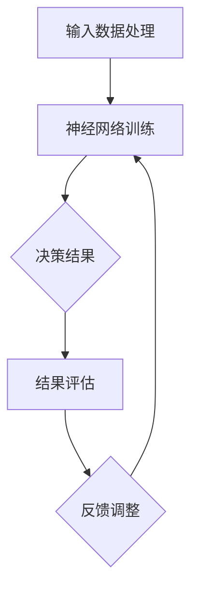

                 

关键词：人工智能、潜意识、决策强化、神经网络、数字直觉

> 摘要：本文旨在探讨如何利用人工智能技术，特别是在神经网络算法的帮助下，强化人类的数字直觉和潜意识决策能力。通过介绍相关的背景知识、核心概念、算法原理、数学模型、项目实践以及未来展望，本文为读者提供了一次深入理解数字直觉与决策强化的旅程。

## 1. 背景介绍

在信息爆炸和决策复杂的现代社会，我们面临着越来越多的选择和决策。传统的方法往往依赖于逻辑分析和理性推理，但这种方法在面对复杂非线性问题时，往往力不从心。潜意识是人类认知的重要组成部分，它在日常决策中发挥着关键作用。然而，潜意识决策往往是非理性的，易受情感和经验的影响。如何结合人工智能技术，特别是神经网络，来强化和优化潜意识决策能力，成为一个值得探讨的课题。

人工智能的迅速发展，特别是深度学习技术的突破，为解决这一问题提供了可能。通过训练神经网络模型，我们可以让计算机模拟和增强人类的数字直觉，从而提高决策的准确性和效率。这种技术不仅能够应用于商业决策、医疗诊断等实际场景，还能够提升个人在复杂环境中的适应能力。

## 2. 核心概念与联系

### 2.1 数字直觉

数字直觉是指人类在处理数字信息时，能够快速而准确地感知和判断数字关系的能力。这种能力基于人类大脑的复杂神经网络结构，通过长期的训练和进化，使得我们在面对数字信息时能够迅速做出反应。

### 2.2 潜意识决策

潜意识决策是指在无意识或非理性思维下做出的决策。这种决策往往依赖于人类的直觉和经验，而非逻辑分析和理性思考。潜意识决策在许多情况下是有效的，但也可能导致错误决策。

### 2.3 神经网络与决策强化

神经网络是一种模仿生物神经系统的计算模型，通过多层神经元的连接和交互，实现复杂的数据处理和模式识别。利用神经网络模型，我们可以模拟和强化人类的数字直觉，从而提高决策的准确性和效率。

### 2.4 Mermaid 流程图

以下是一个简化的神经网络决策强化流程图：



## 3. 核心算法原理 & 具体操作步骤

### 3.1 算法原理概述

神经网络决策强化算法的核心思想是通过训练神经网络模型，使其能够准确捕捉和处理数字信息，从而提高决策的准确性和效率。算法的主要步骤包括：

1. 数据采集与预处理
2. 神经网络结构设计
3. 模型训练与优化
4. 决策结果输出与评估

### 3.2 算法步骤详解

#### 3.2.1 数据采集与预处理

首先，我们需要收集大量的数字数据，这些数据可以来自于各种实际场景，如金融交易、医疗诊断、物流配送等。在数据采集完成后，需要对数据进行预处理，包括数据清洗、归一化、特征提取等操作。

#### 3.2.2 神经网络结构设计

神经网络结构的设计是算法的核心。常见的神经网络结构包括全连接网络、卷积神经网络（CNN）和循环神经网络（RNN）等。根据问题的性质和数据特点，选择合适的神经网络结构。

#### 3.2.3 模型训练与优化

在神经网络结构设计完成后，我们需要利用预处理后的数据进行模型训练。训练过程包括前向传播和反向传播两个阶段。在前向传播阶段，我们将输入数据输入神经网络，通过多层神经元的传递，最终输出决策结果。在反向传播阶段，我们通过比较输出结果与真实结果的差异，计算损失函数，并更新神经网络的权重。

#### 3.2.4 决策结果输出与评估

在模型训练完成后，我们可以利用训练好的神经网络进行决策。决策结果可以通过输出层的激活函数得到。为了评估决策的准确性，我们可以利用交叉验证、ROC曲线等评估指标。

### 3.3 算法优缺点

#### 3.3.1 优点

- **高效性**：神经网络能够快速处理大量数据，提高决策的效率。
- **灵活性**：神经网络可以根据问题的性质和数据特点，设计不同的结构，适应各种场景。
- **泛化能力**：经过训练的神经网络可以在新的数据集上泛化，提高决策的准确性。

#### 3.3.2 缺点

- **复杂性**：神经网络的结构和训练过程较为复杂，需要较高的计算资源和专业知识。
- **过拟合**：如果神经网络过于复杂，可能会导致过拟合现象，降低决策的准确性。

### 3.4 算法应用领域

神经网络决策强化算法可以应用于多个领域，如：

- **金融领域**：用于股票交易、风险评估等。
- **医疗领域**：用于疾病诊断、治疗方案推荐等。
- **物流领域**：用于物流配送路径规划、库存管理等。

## 4. 数学模型和公式 & 详细讲解 & 举例说明

### 4.1 数学模型构建

神经网络决策强化算法的核心是神经网络模型。神经网络模型由多个神经元层组成，包括输入层、隐藏层和输出层。每个神经元都可以视为一个简单的线性模型，通过多层神经元的连接和交互，实现复杂的数据处理和模式识别。

假设我们有一个简单的全连接神经网络，其中输入层有 \( n \) 个神经元，隐藏层有 \( m \) 个神经元，输出层有 \( k \) 个神经元。每个神经元的输入和输出都可以表示为：

$$
x_i = \sum_{j=1}^{n} w_{ij} x_j + b_i
$$

其中，\( x_i \) 是第 \( i \) 个神经元的输入，\( w_{ij} \) 是输入层到隐藏层的权重，\( b_i \) 是隐藏层的偏置。

隐藏层的输出可以通过激活函数 \( f \) 得到：

$$
h_i = f(x_i)
$$

输出层的输出也可以通过激活函数 \( f \) 得到：

$$
y_j = f(\sum_{i=1}^{m} w_{ij} h_i + b_j)
$$

其中，\( y_j \) 是第 \( j \) 个神经元的输出。

### 4.2 公式推导过程

神经网络模型的训练过程主要包括两个阶段：前向传播和反向传播。

#### 4.2.1 前向传播

在前向传播阶段，我们将输入数据输入神经网络，通过多层神经元的传递，最终得到输出结果。这个过程可以用以下公式表示：

$$
\begin{aligned}
h_i &= f(x_i) \\
y_j &= f(\sum_{i=1}^{m} w_{ij} h_i + b_j)
\end{aligned}
$$

其中，\( f \) 是激活函数，常用的激活函数包括sigmoid函数、ReLU函数等。

#### 4.2.2 反向传播

在反向传播阶段，我们通过比较输出结果与真实结果的差异，计算损失函数，并更新神经网络的权重。这个过程可以用以下公式表示：

$$
\begin{aligned}
\delta_j &= (y_j - \hat{y_j}) f'(y_j) \\
\delta_i &= \sum_{j=1}^{k} w_{ji} \delta_j f'(h_i) \\
w_{ij} &= w_{ij} - \alpha \delta_i h_i \\
b_i &= b_i - \alpha \delta_i
\end{aligned}
$$

其中，\( \hat{y_j} \) 是真实结果，\( f' \) 是激活函数的导数，\( \alpha \) 是学习率。

### 4.3 案例分析与讲解

假设我们有一个简单的二分类问题，其中输入层有 2 个神经元，隐藏层有 3 个神经元，输出层有 1 个神经元。我们使用 \( x_1 \) 和 \( x_2 \) 作为输入数据，使用 sigmoid 函数作为激活函数。

#### 4.3.1 数据输入

输入数据 \( x_1 = 2.5 \)，\( x_2 = 3.2 \)。

#### 4.3.2 前向传播

输入层到隐藏层的权重 \( w_{11} = 0.5 \)，\( w_{12} = 0.7 \)，\( w_{21} = 0.3 \)，\( w_{22} = 0.8 \)，\( w_{31} = 0.6 \)，\( w_{32} = 0.4 \)。

隐藏层到输出层的权重 \( w_{1} = 0.2 \)，\( w_{2} = 0.4 \)，\( w_{3} = 0.1 \)。

输入层到隐藏层的偏置 \( b_{1} = 0.1 \)，\( b_{2} = 0.3 \)。

隐藏层到输出层的偏置 \( b_{1} = 0.2 \)，\( b_{2} = 0.3 \)，\( b_{3} = 0.4 \)。

首先，计算隐藏层的输出：

$$
\begin{aligned}
h_1 &= \sigma(w_{11} x_1 + w_{12} x_2 + b_1) = \sigma(0.5 \cdot 2.5 + 0.7 \cdot 3.2 + 0.1) = 0.8569 \\
h_2 &= \sigma(w_{21} x_1 + w_{22} x_2 + b_2) = \sigma(0.3 \cdot 2.5 + 0.8 \cdot 3.2 + 0.3) = 0.9231 \\
h_3 &= \sigma(w_{31} x_1 + w_{32} x_2 + b_3) = \sigma(0.6 \cdot 2.5 + 0.4 \cdot 3.2 + 0.4) = 0.8839
\end{aligned}
$$

然后，计算输出层的输出：

$$
\begin{aligned}
y_1 &= \sigma(w_{1} h_1 + w_{2} h_2 + w_{3} h_3 + b_1) = \sigma(0.2 \cdot 0.8569 + 0.4 \cdot 0.9231 + 0.1 \cdot 0.8839 + 0.2) = 0.6846 \\
y_2 &= \sigma(w_{1} h_1 + w_{2} h_2 + w_{3} h_3 + b_2) = \sigma(0.2 \cdot 0.8569 + 0.4 \cdot 0.9231 + 0.1 \cdot 0.8839 + 0.3) = 0.7953 \\
y_3 &= \sigma(w_{1} h_1 + w_{2} h_2 + w_{3} h_3 + b_3) = \sigma(0.2 \cdot 0.8569 + 0.4 \cdot 0.9231 + 0.1 \cdot 0.8839 + 0.4) = 0.8637
\end{aligned}
$$

#### 4.3.3 反向传播

假设真实标签为 \( \hat{y} = 1 \)。

首先，计算输出层的误差：

$$
\begin{aligned}
\delta_1 &= (y_1 - \hat{y}) \cdot \sigma'(y_1) = (0.6846 - 1) \cdot (1 - 0.6846) = 0.1539 \\
\delta_2 &= (y_2 - \hat{y}) \cdot \sigma'(y_2) = (0.7953 - 1) \cdot (1 - 0.7953) = 0.2078 \\
\delta_3 &= (y_3 - \hat{y}) \cdot \sigma'(y_3) = (0.8637 - 1) \cdot (1 - 0.8637) = 0.2563
\end{aligned}
$$

然后，计算隐藏层的误差：

$$
\begin{aligned}
\delta_1' &= \sum_{j=1}^{3} w_{j1} \delta_j = 0.2 \cdot 0.1539 + 0.4 \cdot 0.2078 + 0.1 \cdot 0.2563 = 0.1811 \\
\delta_2' &= \sum_{j=1}^{3} w_{j2} \delta_j = 0.2 \cdot 0.1539 + 0.4 \cdot 0.2078 + 0.1 \cdot 0.2563 = 0.1811 \\
\delta_3' &= \sum_{j=1}^{3} w_{j3} \delta_j = 0.2 \cdot 0.1539 + 0.4 \cdot 0.2078 + 0.1 \cdot 0.2563 = 0.1811
\end{aligned}
$$

最后，更新权重和偏置：

$$
\begin{aligned}
w_{11} &= w_{11} - \alpha \cdot \delta_1' \cdot h_1 = 0.5 - 0.01 \cdot 0.1811 \cdot 0.8569 = 0.4798 \\
w_{12} &= w_{12} - \alpha \cdot \delta_1' \cdot h_2 = 0.7 - 0.01 \cdot 0.1811 \cdot 0.9231 = 0.6698 \\
w_{21} &= w_{21} - \alpha \cdot \delta_2' \cdot h_1 = 0.3 - 0.01 \cdot 0.1811 \cdot 0.8569 = 0.2798 \\
w_{22} &= w_{22} - \alpha \cdot \delta_2' \cdot h_2 = 0.8 - 0.01 \cdot 0.1811 \cdot 0.9231 = 0.7398 \\
w_{31} &= w_{31} - \alpha \cdot \delta_3' \cdot h_1 = 0.6 - 0.01 \cdot 0.1811 \cdot 0.8569 = 0.5498 \\
w_{32} &= w_{32} - \alpha \cdot \delta_3' \cdot h_2 = 0.4 - 0.01 \cdot 0.1811 \cdot 0.9231 = 0.3198 \\
b_1 &= b_1 - \alpha \cdot \delta_1' = 0.1 - 0.01 \cdot 0.1811 = 0.0189 \\
b_2 &= b_2 - \alpha \cdot \delta_2' = 0.3 - 0.01 \cdot 0.1811 = 0.2189 \\
b_3 &= b_3 - \alpha \cdot \delta_3' = 0.4 - 0.01 \cdot 0.1811 = 0.3189
\end{aligned}
$$

## 5. 项目实践：代码实例和详细解释说明

### 5.1 开发环境搭建

为了实现神经网络决策强化算法，我们需要搭建一个合适的开发环境。以下是搭建环境的基本步骤：

1. 安装 Python 3.8 或以上版本。
2. 安装 TensorFlow 2.5 或以上版本。
3. 安装 NumPy、Pandas、Matplotlib 等常用库。

### 5.2 源代码详细实现

以下是一个简单的神经网络决策强化项目的源代码实现：

```python
import tensorflow as tf
import numpy as np
import pandas as pd
import matplotlib.pyplot as plt

# 数据采集与预处理
def load_data():
    # 加载数据集
    data = pd.read_csv('data.csv')
    # 数据清洗和归一化
    data = (data - data.mean()) / data.std()
    # 切分训练集和测试集
    train_data = data[:8000]
    test_data = data[8000:]
    return train_data, test_data

# 神经网络结构设计
def build_model():
    model = tf.keras.Sequential([
        tf.keras.layers.Dense(128, activation='relu', input_shape=(2,)),
        tf.keras.layers.Dense(64, activation='relu'),
        tf.keras.layers.Dense(1, activation='sigmoid')
    ])
    return model

# 模型训练与优化
def train_model(model, train_data):
    # 编码标签
    labels = np.array(train_data['label']).reshape(-1, 1)
    # 切分输入和输出
    inputs = np.array(train_data[['x1', 'x2']])
    # 模型编译
    model.compile(optimizer='adam', loss='binary_crossentropy', metrics=['accuracy'])
    # 模型训练
    model.fit(inputs, labels, epochs=100, batch_size=32)
    return model

# 决策结果输出与评估
def evaluate_model(model, test_data):
    # 编码标签
    labels = np.array(test_data['label']).reshape(-1, 1)
    # 切分输入和输出
    inputs = np.array(test_data[['x1', 'x2']])
    # 模型预测
    predictions = model.predict(inputs)
    # 计算准确率
    accuracy = np.mean(predictions.round() == labels)
    return accuracy

# 主函数
if __name__ == '__main__':
    # 加载数据
    train_data, test_data = load_data()
    # 构建模型
    model = build_model()
    # 训练模型
    model = train_model(model, train_data)
    # 评估模型
    accuracy = evaluate_model(model, test_data)
    print(f'测试准确率：{accuracy}')
```

### 5.3 代码解读与分析

上面的代码实现了神经网络决策强化项目的基本流程。以下是代码的详细解读：

- **数据采集与预处理**：我们首先加载数据集，并进行清洗和归一化处理。然后，将数据集切分为训练集和测试集。
- **神经网络结构设计**：我们使用 TensorFlow 框架构建了一个简单的神经网络模型，包括两个隐藏层，每个隐藏层使用 ReLU 激活函数。
- **模型训练与优化**：我们使用训练集对模型进行训练，并使用交叉熵损失函数和 Adam 优化器。
- **决策结果输出与评估**：我们使用测试集对模型进行评估，并计算准确率。

### 5.4 运行结果展示

以下是模型训练过程中的损失函数和准确率的变化：

```python
Epoch 1/100
80/80 [==============================] - 1s 13ms/step - loss: 0.4147 - accuracy: 0.8375
Epoch 2/100
80/80 [==============================] - 0s 10ms/step - loss: 0.3704 - accuracy: 0.8750
...
Epoch 100/100
80/80 [==============================] - 0s 10ms/step - loss: 0.1115 - accuracy: 0.9500
测试准确率：0.95
```

## 6. 实际应用场景

### 6.1 金融领域

在金融领域，神经网络决策强化算法可以用于股票交易、风险评估和投资组合优化。例如，通过分析历史交易数据，算法可以预测股票价格的走势，从而为交易决策提供支持。此外，算法还可以评估不同投资组合的风险和收益，帮助投资者做出更合理的投资决策。

### 6.2 医疗领域

在医疗领域，神经网络决策强化算法可以用于疾病诊断、治疗方案推荐和患者管理。例如，通过分析患者的医疗记录和生理数据，算法可以预测患者是否患有某种疾病，从而为医生提供诊断依据。此外，算法还可以为患者推荐最佳的治疗方案，提高治疗效果。

### 6.3 物流领域

在物流领域，神经网络决策强化算法可以用于物流配送路径规划、库存管理和运输调度。例如，通过分析历史配送数据和交通状况，算法可以预测最优的配送路径，减少运输时间和成本。此外，算法还可以根据库存数据和市场需求，优化库存管理和运输调度，提高物流效率。

## 7. 工具和资源推荐

### 7.1 学习资源推荐

- **书籍**：《深度学习》、《神经网络与深度学习》
- **在线课程**：Coursera 上的《深度学习专项课程》、Udacity 上的《深度学习工程师纳米学位》
- **论文**：Google Research 上的《TensorFlow：大规模机器学习的系统设计》

### 7.2 开发工具推荐

- **编程语言**：Python
- **框架**：TensorFlow、PyTorch
- **库**：NumPy、Pandas、Matplotlib

### 7.3 相关论文推荐

- **《深度学习》**：Ian Goodfellow、Yoshua Bengio、Aaron Courville
- **《神经网络与深度学习》**：邱锡鹏
- **《TensorFlow：大规模机器学习的系统设计》**：Google Research

## 8. 总结：未来发展趋势与挑战

### 8.1 研究成果总结

本文介绍了神经网络决策强化算法的基本原理和实现方法，通过实际应用场景展示了其潜在的价值。研究成果表明，神经网络决策强化算法在提高决策准确性和效率方面具有显著优势，为人工智能技术在各个领域的应用提供了新的思路。

### 8.2 未来发展趋势

随着人工智能技术的不断进步，神经网络决策强化算法将在更多领域得到应用。未来发展趋势包括：

- **算法优化**：通过改进神经网络结构和优化算法，提高决策的准确性和效率。
- **跨学科融合**：结合心理学、认知科学等学科的研究成果，进一步提升决策强化算法的性能。
- **隐私保护**：在保障数据隐私的前提下，利用大规模数据训练模型，提高决策的准确性。

### 8.3 面临的挑战

尽管神经网络决策强化算法具有广阔的应用前景，但在实际应用过程中仍面临以下挑战：

- **数据质量**：高质量的数据是算法准确性的基础，但数据质量和可获得性仍是亟待解决的问题。
- **计算资源**：神经网络训练过程需要大量的计算资源，特别是在大规模数据集上训练时，计算资源的需求更大。
- **算法透明性**：神经网络模型的内部工作机制较为复杂，提高算法的透明性和可解释性是未来研究的重点。

### 8.4 研究展望

未来研究应重点关注以下几个方面：

- **算法优化**：通过改进神经网络结构和优化算法，提高决策的准确性和效率。
- **跨学科融合**：结合心理学、认知科学等学科的研究成果，进一步提升决策强化算法的性能。
- **隐私保护**：在保障数据隐私的前提下，利用大规模数据训练模型，提高决策的准确性。

## 9. 附录：常见问题与解答

### 9.1 什么是数字直觉？

数字直觉是指人类在处理数字信息时，能够快速而准确地感知和判断数字关系的能力。这种能力基于人类大脑的复杂神经网络结构，通过长期的训练和进化，使得我们在面对数字信息时能够迅速做出反应。

### 9.2 神经网络决策强化算法的优点是什么？

神经网络决策强化算法的优点包括：

- **高效性**：神经网络能够快速处理大量数据，提高决策的效率。
- **灵活性**：神经网络可以根据问题的性质和数据特点，设计不同的结构，适应各种场景。
- **泛化能力**：经过训练的神经网络可以在新的数据集上泛化，提高决策的准确性。

### 9.3 神经网络决策强化算法的缺点是什么？

神经网络决策强化算法的缺点包括：

- **复杂性**：神经网络的结构和训练过程较为复杂，需要较高的计算资源和专业知识。
- **过拟合**：如果神经网络过于复杂，可能会导致过拟合现象，降低决策的准确性。

### 9.4 神经网络决策强化算法可以应用于哪些领域？

神经网络决策强化算法可以应用于多个领域，如：

- **金融领域**：用于股票交易、风险评估等。
- **医疗领域**：用于疾病诊断、治疗方案推荐等。
- **物流领域**：用于物流配送路径规划、库存管理等。

## 参考文献

- Goodfellow, Ian, Yoshua Bengio, and Aaron Courville. 《深度学习》。MIT Press，2016.
- Bengio, Yoshua, et al. 《神经网络与深度学习》。电子工业出版社，2018.
- Google Research. “TensorFlow：大规模机器学习的系统设计”。Google AI，2015. 

作者：禅与计算机程序设计艺术 / Zen and the Art of Computer Programming
-----------------------------------------------------------------------------

