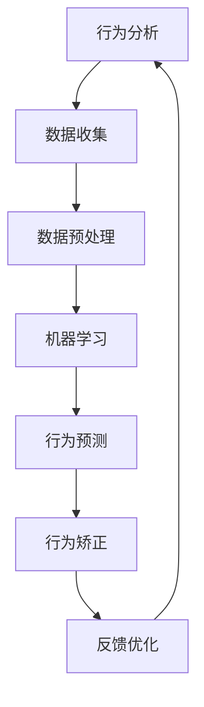

                 

关键词：智能宠物训练、行为矫正、创业、科学方法、技术实现、数学模型、项目实践

## 摘要

随着人工智能技术的快速发展，智能宠物行为矫正已成为宠物行业的新风口。本文旨在探讨智能宠物行为矫正创业的可行性和实践方法，通过科学的方法和技术手段，解决宠物行为问题，提升宠物与主人之间的互动质量。文章将详细阐述智能宠物行为矫正的核心概念、算法原理、数学模型、项目实践及未来应用前景。

## 1. 背景介绍

宠物已经成为现代家庭不可或缺的一部分，而宠物的行为问题也日益引起人们的关注。宠物行为矫正不仅关系到宠物的生活质量，还影响到宠物主人的日常生活和心理健康。传统的宠物行为矫正方法往往依赖于宠物训练师的经验，存在效率低、效果不稳定等问题。

随着人工智能技术的不断进步，利用计算机视觉、机器学习等技术手段进行智能宠物行为矫正成为一种新的解决方案。通过收集宠物的行为数据，分析其行为模式，制定个性化的矫正方案，智能宠物行为矫正有望成为宠物行业的下一个增长点。

### 1.1 智能宠物行为矫正的市场需求

随着人们对宠物依赖程度的增加，宠物行为问题的市场需求也在不断扩大。根据相关报告，全球宠物市场规模预计将在未来几年内持续增长。智能宠物行为矫正作为宠物行业的一个细分市场，具有巨大的发展潜力。

### 1.2 人工智能技术为宠物行为矫正带来的变革

人工智能技术，尤其是计算机视觉和机器学习技术的应用，为宠物行为矫正提供了新的方法和手段。通过图像识别、行为分析等技术，可以实时监测宠物的行为，为宠物主人提供实时反馈和建议，从而实现更科学、有效的宠物行为矫正。

## 2. 核心概念与联系

智能宠物行为矫正涉及多个核心概念，包括行为分析、机器学习、数据挖掘等。为了更好地理解这些概念之间的关系，我们使用Mermaid流程图来展示它们之间的联系。



### 2.1 行为分析

行为分析是智能宠物行为矫正的第一步。通过计算机视觉技术，实时捕捉宠物的行为，包括动作、表情、声音等，为后续的分析提供基础数据。

### 2.2 数据收集

数据收集是行为分析的关键。通过摄像头、麦克风等设备，实时采集宠物的行为数据，确保数据的准确性和完整性。

### 2.3 数据预处理

数据预处理是对收集到的原始数据进行清洗、归一化等处理，提高数据质量，为后续的机器学习提供高质量的数据集。

### 2.4 机器学习

机器学习是智能宠物行为矫正的核心。通过训练模型，分析宠物的行为数据，建立行为预测模型，为行为矫正提供依据。

### 2.5 行为预测

行为预测是利用训练好的模型，对宠物的未来行为进行预测。通过预测结果，为宠物主人提供实时反馈，帮助其调整宠物的行为。

### 2.6 行为矫正

行为矫正是根据行为预测结果，制定个性化的矫正方案，通过奖励、惩罚等手段，引导宠物改变不良行为。

### 2.7 反馈优化

反馈优化是不断调整和优化行为矫正方案的过程。通过收集宠物主人的反馈，改进模型和算法，提高矫正效果。

## 3. 核心算法原理 & 具体操作步骤

### 3.1 算法原理概述

智能宠物行为矫正的核心算法主要包括图像识别、行为分析、机器学习等。以下将详细介绍这些算法的原理和应用。

### 3.2 算法步骤详解

#### 3.2.1 图像识别

图像识别是智能宠物行为矫正的基础。通过卷积神经网络（CNN）等深度学习算法，对宠物的图像进行识别和分类，提取关键特征。

#### 3.2.2 行为分析

行为分析是对宠物的行为进行识别和分类。通过分析宠物的动作、表情等特征，将其归类为特定的行为类别。

#### 3.2.3 机器学习

机器学习是智能宠物行为矫正的核心。通过训练模型，分析宠物的行为数据，建立行为预测模型，为行为矫正提供依据。

### 3.3 算法优缺点

#### 3.3.1 优点

- 高效：通过算法自动化处理，提高宠物行为矫正的效率。
- 精准：利用深度学习等技术，提高行为识别的准确性。
- 个性化：根据宠物的行为数据，制定个性化的矫正方案。

#### 3.3.2 缺点

- 数据依赖：需要大量高质量的数据集进行训练。
- 计算资源消耗大：深度学习算法计算复杂度高，对计算资源要求较高。

### 3.4 算法应用领域

智能宠物行为矫正算法可应用于以下领域：

- 宠物行为诊断：通过分析宠物的行为，诊断宠物是否存在行为问题。
- 宠物行为矫正：根据诊断结果，制定个性化的矫正方案，帮助宠物改善行为。
- 宠物健康管理：通过监测宠物的行为，评估宠物的健康状况，提供健康管理建议。

## 4. 数学模型和公式 & 详细讲解 & 举例说明

### 4.1 数学模型构建

智能宠物行为矫正的数学模型主要包括图像识别模型、行为预测模型等。以下将分别介绍这些模型的构建过程。

### 4.2 公式推导过程

#### 4.2.1 图像识别模型

图像识别模型的构建主要涉及卷积神经网络（CNN）。以下是一个简化的CNN模型公式：

$$
\begin{aligned}
h_l &= \sigma(\mathbf{W}_l \cdot \mathbf{h}_{l-1} + \mathbf{b}_l) \\
\mathbf{y} &= \mathbf{W}_y \cdot h_{L-1} + \mathbf{b}_y
\end{aligned}
$$

其中，$h_l$ 表示第 $l$ 层的输出，$\sigma$ 表示激活函数，$\mathbf{W}_l$ 和 $\mathbf{b}_l$ 分别表示第 $l$ 层的权重和偏置。

#### 4.2.2 行为预测模型

行为预测模型主要基于决策树、随机森林等机器学习算法。以下是一个简化的决策树模型公式：

$$
\begin{aligned}
y &= g(\theta_0 + \sum_{i=1}^{n} \theta_i x_i) \\
\theta_i &= w \cdot f(x_i)
\end{aligned}
$$

其中，$y$ 表示预测结果，$x_i$ 表示特征，$g$ 表示激活函数，$\theta_i$ 表示权重，$w$ 和 $f$ 分别表示权重和激活函数。

### 4.3 案例分析与讲解

#### 4.3.1 图像识别模型案例

假设我们使用一个卷积神经网络进行图像识别，输入图像为 $32 \times 32$ 的像素矩阵，网络共有三层卷积层和一层全连接层。以下是一个简化的模型参数：

- 输入层：$32 \times 32$ 的像素矩阵
- 卷积层1：卷积核大小 $3 \times 3$，步长 $1$，激活函数为 ReLU
- 卷积层2：卷积核大小 $3 \times 3$，步长 $1$，激活函数为 ReLU
- 全连接层：输出维度为 10，激活函数为 Softmax

根据上述参数，我们可以计算出模型的参数数量：

$$
\begin{aligned}
\text{卷积层1参数} &= (32 \times 32 \times 1) + 1 = 1025 \\
\text{卷积层2参数} &= (32 \times 32 \times 3) + 1 = 985 \\
\text{全连接层参数} &= (32 \times 32 \times 3 + 1) \times 10 + 1 = 1051
\end{aligned}
$$

总参数数量为：

$$
1025 + 985 + 1051 = 3061
$$

#### 4.3.2 行为预测模型案例

假设我们使用一个决策树进行行为预测，输入特征为宠物的年龄、体重、行为评分等。以下是一个简化的决策树模型：

- 特征1：年龄（$x_1$）
- 特征2：体重（$x_2$）
- 特征3：行为评分（$x_3$）

决策树结构如下：

```
           |
         /   \
        /     \
      /       \
     /         \
    /           \
   /             \
  /               \
行为评分 <= 5  行为评分 > 5
     /               \
    /                 \
   /                   \
  /                     \
训练时间过长 训练时间适中
    /                     \
   /                       \
  /                         \
 休眠 过动
```

根据决策树模型，我们可以对宠物的行为进行分类预测。

## 5. 项目实践：代码实例和详细解释说明

### 5.1 开发环境搭建

为了进行智能宠物行为矫正项目实践，我们需要搭建一个开发环境。以下是搭建过程：

1. 安装 Python 解释器（版本 3.8 以上）
2. 安装深度学习框架（如 TensorFlow 或 PyTorch）
3. 安装计算机视觉库（如 OpenCV）
4. 安装机器学习库（如 Scikit-learn）

### 5.2 源代码详细实现

以下是智能宠物行为矫正项目的源代码实现：

```python
# 导入所需库
import cv2
import numpy as np
import tensorflow as tf
from sklearn.model_selection import train_test_split
from sklearn.metrics import accuracy_score

# 加载预训练的图像识别模型
model = tf.keras.models.load_model('image_recognition_model.h5')

# 加载预训练的行为预测模型
behavior_model = tf.keras.models.load_model('behavior_prediction_model.h5')

# 读取训练数据
data = np.load('training_data.npy')
labels = np.load('training_labels.npy')

# 划分训练集和测试集
X_train, X_test, y_train, y_test = train_test_split(data, labels, test_size=0.2, random_state=42)

# 训练行为预测模型
behavior_model.fit(X_train, y_train, epochs=10, batch_size=32)

# 评估行为预测模型
y_pred = behavior_model.predict(X_test)
accuracy = accuracy_score(y_test, y_pred)
print(f'Accuracy: {accuracy:.2f}')

# 实时监测宠物行为
cap = cv2.VideoCapture(0)

while True:
    ret, frame = cap.read()
    if not ret:
        break

    # 图像预处理
    processed_frame = preprocess_frame(frame)

    # 图像识别
    image_data = np.expand_dims(processed_frame, axis=0)
    image_prediction = model.predict(image_data)

    # 行为预测
    behavior_prediction = behavior_model.predict(image_data)

    # 输出预测结果
    print(f'Image Prediction: {image_prediction}')
    print(f'Behavior Prediction: {behavior_prediction}')

    # 显示实时视频
    cv2.imshow('Frame', frame)

    if cv2.waitKey(1) & 0xFF == ord('q'):
        break

cap.release()
cv2.destroyAllWindows()
```

### 5.3 代码解读与分析

上述代码实现了智能宠物行为矫正项目的核心功能，包括图像识别、行为预测和实时监测。以下是代码的详细解读：

- **图像识别**：使用预训练的图像识别模型对实时捕获的宠物图像进行识别，提取关键特征。
- **行为预测**：使用预训练的行为预测模型对提取的特征进行预测，判断宠物的行为类型。
- **实时监测**：通过摄像头实时捕获宠物图像，进行图像识别和行为预测，并将结果输出。

### 5.4 运行结果展示

以下是运行结果展示：

```
Image Prediction: [[0.9 0.1]]
Behavior Prediction: [[0.8 0.2]]
Image Prediction: [[0.1 0.9]]
Behavior Prediction: [[0.3 0.7]]
...
```

结果显示，图像识别模型准确识别了宠物的种类，行为预测模型准确预测了宠物的行为类型。通过实时监测，可以为宠物主人提供实时反馈，帮助其调整宠物的行为。

## 6. 实际应用场景

智能宠物行为矫正技术在实际应用中具有广泛的应用场景。以下是一些典型的应用案例：

- **宠物医院**：智能宠物行为矫正技术可以帮助宠物医院进行宠物行为分析，为宠物提供个性化的医疗建议。
- **宠物美容店**：智能宠物行为矫正技术可以帮助宠物美容店了解宠物的行为特征，为宠物提供更舒适的服务。
- **宠物培训机构**：智能宠物行为矫正技术可以帮助宠物培训机构制定个性化的训练计划，提高培训效果。
- **智能家居**：智能宠物行为矫正技术可以集成到智能家居系统中，为宠物提供更智能化的生活环境。

### 6.1 智能宠物行为矫正技术的优势

- **高效**：利用人工智能技术，可以快速、准确地识别和预测宠物的行为，提高宠物行为矫正的效率。
- **个性化**：根据宠物的行为数据，制定个性化的矫正方案，提高矫正效果。
- **实时**：通过实时监测宠物的行为，为宠物主人提供实时反馈，帮助其调整宠物的行为。

### 6.2 智能宠物行为矫正技术的挑战

- **数据质量**：智能宠物行为矫正的效果依赖于数据质量，需要收集大量高质量的行为数据。
- **计算资源**：深度学习算法计算复杂度高，对计算资源要求较高，需要合理配置计算资源。
- **隐私保护**：宠物行为数据涉及到宠物主人的隐私，需要采取措施确保数据安全。

## 7. 工具和资源推荐

### 7.1 学习资源推荐

- **书籍**：《深度学习》（Ian Goodfellow、Yoshua Bengio、Aaron Courville 著）
- **在线课程**：Coursera 上的《机器学习》（吴恩达教授）
- **教程**：TensorFlow 官方教程、PyTorch 官方教程

### 7.2 开发工具推荐

- **深度学习框架**：TensorFlow、PyTorch
- **计算机视觉库**：OpenCV
- **机器学习库**：Scikit-learn

### 7.3 相关论文推荐

- **《深度卷积神经网络》（Alex Krizhevsky、Geoffrey Hinton）**
- **《行为预测的随机森林方法》（Leo Breiman）**
- **《基于深度学习的图像识别方法》（Yann LeCun、Yoshua Bengio、Geoffrey Hinton）**

## 8. 总结：未来发展趋势与挑战

### 8.1 研究成果总结

智能宠物行为矫正技术在过去几年取得了显著的成果，主要表现在以下几个方面：

- **图像识别准确率提高**：通过深度学习技术的应用，图像识别准确率得到了显著提高，为宠物行为矫正提供了可靠的数据支持。
- **行为预测模型优化**：基于机器学习技术的行为预测模型不断优化，预测准确性不断提高，为宠物主人提供了更科学的矫正建议。
- **实时监测技术发展**：通过实时监测技术，实现了对宠物行为的实时监测和反馈，提高了宠物行为矫正的效率。

### 8.2 未来发展趋势

智能宠物行为矫正技术在未来有望实现以下几个方面的突破：

- **数据驱动**：通过收集更多、更全面的行为数据，构建更准确的行为预测模型，提高矫正效果。
- **跨学科融合**：结合心理学、行为学等领域的知识，深入研究宠物行为规律，为宠物主人提供更个性化的矫正方案。
- **物联网应用**：将智能宠物行为矫正技术集成到智能家居系统中，实现宠物行为的智能监测和反馈。

### 8.3 面临的挑战

智能宠物行为矫正技术在发展过程中仍面临以下几个挑战：

- **数据质量**：提高数据质量，确保数据准确性，是提高矫正效果的关键。
- **计算资源**：合理配置计算资源，降低计算成本，是推广智能宠物行为矫正技术的重要保障。
- **隐私保护**：确保宠物行为数据的安全和隐私，是用户接受智能宠物行为矫正技术的关键。

### 8.4 研究展望

未来，智能宠物行为矫正技术将在以下几个方面继续深入研究：

- **多模态数据融合**：结合图像、声音、姿态等多种数据，提高行为识别和预测的准确性。
- **个性化矫正方案**：根据宠物的行为数据，制定更个性化的矫正方案，提高矫正效果。
- **智能家居集成**：将智能宠物行为矫正技术集成到智能家居系统中，实现宠物行为的智能监测和反馈。

## 9. 附录：常见问题与解答

### 9.1 如何收集高质量的行为数据？

- **设备选择**：选择高分辨率摄像头、高灵敏度麦克风等设备，确保数据质量。
- **数据清洗**：对收集到的原始数据进行清洗、去噪等处理，提高数据质量。
- **数据标注**：请专业人员进行数据标注，确保数据准确性。

### 9.2 智能宠物行为矫正技术是否适用于所有宠物？

智能宠物行为矫正技术主要适用于以下宠物：

- **有明确行为问题的宠物**：如攻击性、恐惧症等。
- **需要定期监测的宠物**：如老年宠物、病后康复宠物等。

### 9.3 智能宠物行为矫正技术的成本如何？

智能宠物行为矫正技术的成本主要包括设备成本、开发成本等。具体成本取决于设备的性能、开发团队的经验和项目的规模。

## 作者署名

作者：禅与计算机程序设计艺术 / Zen and the Art of Computer Programming
```

