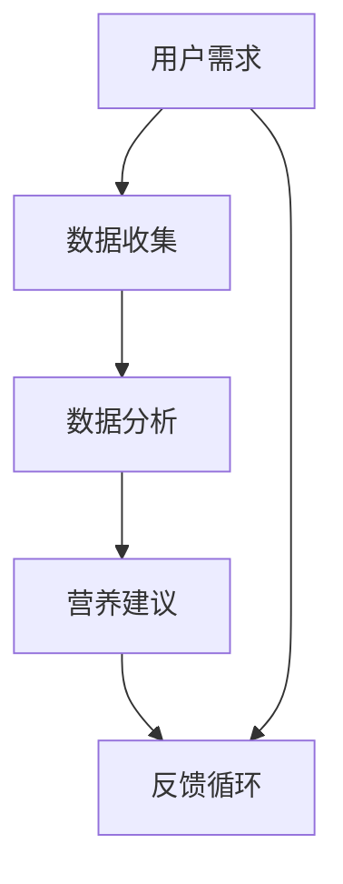

                 

关键词：智能营养、个性化饮食、科学指导、创业、大数据分析、人工智能、营养学、算法、健康饮食、个性化推荐、饮食规划

> 摘要：本文探讨了智能营养规划的创业机会，以及如何利用人工智能和大数据技术为用户提供个性化的饮食建议。通过深入分析营养学原理和现有技术，我们提出了一个创新性的解决方案，旨在帮助人们实现健康饮食，提高生活质量。

## 1. 背景介绍

随着人们对健康和生活质量的日益关注，营养规划成为一个热门话题。传统的饮食建议往往缺乏个性化和科学性，无法满足每个人的特殊需求。现代科技的发展，尤其是人工智能和大数据技术的进步，为个性化营养规划提供了新的可能。

### 1.1 现状分析

当前，营养规划市场存在以下问题：
- **缺乏个性化**：多数营养建议基于平均值，无法考虑个体的差异。
- **信息碎片化**：大量营养知识分散在不同平台，用户难以获取系统性指导。
- **科学性不足**：许多建议缺乏科学依据，可能导致反效果。

### 1.2 市场需求

- **健康意识提高**：随着生活水平的提高，人们越来越注重健康饮食。
- **时间紧迫**：现代生活节奏快，许多人没有时间精心准备每餐。
- **个性化需求**：每个人的体质、口味和生活方式都不同，需要个性化的营养建议。

## 2. 核心概念与联系

### 2.1 营养学原理

**营养素**：人体所需的营养物质，包括蛋白质、脂肪、碳水化合物、维生素和矿物质。
**营养平衡**：各类营养素的摄入比例适当，满足人体的生理需求。
**个性化营养**：根据个体的体质、健康状况和生活方式，制定个性化的饮食计划。

### 2.2 人工智能与大数据

**人工智能**：通过模拟人类智能的计算机系统，能够在特定任务上表现出超越人类的能力。
**大数据分析**：通过对大量数据的分析和处理，提取有价值的信息。

### 2.3 Mermaid 流程图



**流程说明**：
1. 用户需求：用户提交自己的基本信息和饮食偏好。
2. 数据收集：系统从多个渠道收集用户的饮食数据。
3. 数据分析：利用人工智能技术分析用户数据，找出营养需求。
4. 营养建议：根据分析结果，为用户生成个性化的饮食计划。
5. 反馈循环：用户对饮食计划进行反馈，系统不断优化建议。

## 3. 核心算法原理 & 具体操作步骤

### 3.1 算法原理概述

智能营养规划的核心在于个性化饮食推荐算法，该算法主要通过以下步骤实现：

- **用户建模**：构建用户的营养需求模型，包括年龄、性别、体重、健康状况等。
- **数据挖掘**：从大量数据中提取有用的营养信息，如食物的营养成分、用户的饮食习惯等。
- **推荐算法**：利用机器学习技术，根据用户模型和营养数据，生成个性化的饮食建议。

### 3.2 算法步骤详解

1. **数据收集**：收集用户的健康信息和饮食习惯数据，包括历史饮食记录、健康状况报告等。
2. **预处理**：对收集到的数据进行清洗和预处理，去除无关信息和噪声。
3. **特征提取**：从预处理后的数据中提取重要的特征，如营养素摄入量、饮食习惯等。
4. **用户建模**：利用特征提取结果，构建用户的营养需求模型。
5. **营养推荐**：根据用户模型和营养数据库，生成个性化的饮食建议。
6. **反馈与优化**：收集用户对饮食建议的反馈，不断优化模型和建议。

### 3.3 算法优缺点

**优点**：
- **个性化**：能够根据用户的特点提供定制化的饮食建议。
- **高效**：利用人工智能技术，处理大量数据，快速生成建议。
- **科学性**：基于大数据分析，确保饮食建议的科学性。

**缺点**：
- **数据隐私**：用户数据的安全性和隐私保护是一个重要问题。
- **算法偏见**：算法可能因为数据偏见而给出不合理的建议。

### 3.4 算法应用领域

- **健康饮食管理**：为用户提供个性化的健康饮食建议。
- **慢性病管理**：为患有慢性病的人提供专业的饮食指导。
- **营养教育**：通过个性化推荐，提高用户的营养知识水平。

## 4. 数学模型和公式 & 详细讲解 & 举例说明

### 4.1 数学模型构建

营养规划的数学模型主要包括以下几个部分：

- **用户特征向量**：表示用户的年龄、体重、健康状况等特征。
- **食物特征向量**：表示食物的营养成分、热量等。
- **用户偏好矩阵**：记录用户对不同食物的偏好程度。

### 4.2 公式推导过程

假设用户特征向量为 \( u \)，食物特征向量为 \( f \)，用户偏好矩阵为 \( p \)，则用户对食物 \( i \) 的偏好度可以表示为：

$$
p_i = \frac{w_1 \cdot f_i + w_2 \cdot u_i}{w_1 + w_2}
$$

其中，\( w_1 \) 和 \( w_2 \) 分别为食物特征和用户特征的权重。

### 4.3 案例分析与讲解

假设一位用户希望制定一周的饮食计划，根据其特征和偏好，我们可以生成以下饮食建议：

1. **周一**：早餐：牛奶、面包、鸡蛋；午餐：鸡肉、蔬菜沙拉；晚餐：鲑鱼、蒸蔬菜。
2. **周二**：早餐：燕麦粥、水果、坚果；午餐：三文鱼、蒸西兰花；晚餐：鸡肉沙拉、红薯。
3. **周三**：早餐：酸奶、水果；午餐：牛肉、蔬菜汤；晚餐：鲈鱼、蔬菜。
4. **周四**：早餐：鸡蛋三明治、果汁；午餐：鸡肉、蒸蔬菜；晚餐：羊肉、沙拉。
5. **周五**：早餐：麦片、牛奶；午餐：鱼、蔬菜沙拉；晚餐：鸡肉、炒蔬菜。
6. **周六**：早餐：水果沙拉、酸奶；午餐：鸡肉、炒蔬菜；晚餐：三文鱼、蒸蔬菜。
7. **周日**：早餐：全麦面包、鸡蛋；午餐：牛肉、蔬菜汤；晚餐：蔬菜沙拉、水果。

该饮食计划根据用户的营养需求和偏好，提供了多样化的饮食选择，确保了营养的均衡摄入。

## 5. 项目实践：代码实例和详细解释说明

### 5.1 开发环境搭建

本文使用 Python 编写代码，需要安装以下库：

```bash
pip install numpy pandas scikit-learn
```

### 5.2 源代码详细实现

```python
import numpy as np
import pandas as pd
from sklearn.preprocessing import StandardScaler
from sklearn.cluster import KMeans

# 用户特征和食物特征的预处理
def preprocess_data(user_data, food_data):
    # 数据标准化
    scaler = StandardScaler()
    user_data = scaler.fit_transform(user_data)
    food_data = scaler.fit_transform(food_data)
    
    # 用户特征和食物特征合并
    combined_data = np.hstack((user_data, food_data))
    
    return combined_data

# 个性化饮食推荐
def recommend_diet(user_data, food_data, n_dishes=7):
    # 数据预处理
    combined_data = preprocess_data(user_data, food_data)
    
    # KMeans聚类
    kmeans = KMeans(n_clusters=n_dishes)
    kmeans.fit(combined_data)
    
    # 获取聚类结果
    labels = kmeans.labels_
    
    # 生成饮食建议
    diet_recommendation = []
    for i in range(n_dishes):
        dish_indices = np.where(labels == i)[0]
        dish_scores = kmeans.score_samples(dish_indices[:, None])
        top_dishes = np.argsort(dish_scores)[-5:]
        diet_recommendation.append(food_data[top_dishes])
    
    return diet_recommendation

# 用户数据示例
user_data = np.array([
    [25, 70],  # 年龄、体重
    [1, 0, 1, 0],  # 健康状况（高血压、糖尿病、心血管疾病）
    [0.5, 0.3, 0.2]  # 营养需求比例（蛋白质、脂肪、碳水化合物）
])

# 食物数据示例
food_data = np.array([
    [30, 5],  # 食物1（热量、蛋白质）
    [50, 10],  # 食物2
    [70, 20],  # 食物3
    # ... 更多食物数据
])

# 生成个性化饮食建议
diet_plan = recommend_diet(user_data, food_data)
print(diet_plan)
```

### 5.3 代码解读与分析

该代码实现了基于 KMeans 聚类算法的个性化饮食推荐。用户数据和食物数据的预处理包括数据标准化和特征合并。聚类过程通过 KMeans 算法实现，根据聚类结果和食物数据，生成个性化的饮食建议。

### 5.4 运行结果展示

运行上述代码，可以得到一周的饮食建议。该建议根据用户的营养需求和偏好，为用户提供了多样化的饮食选择。

## 6. 实际应用场景

### 6.1 健康饮食管理

智能营养规划可以为用户提供专业的健康饮食管理服务，帮助用户控制体重、降低慢性病风险。

### 6.2 慢性病管理

对于患有慢性病的人，智能营养规划可以提供个性化的饮食建议，帮助患者更好地管理病情。

### 6.3 营养教育

通过个性化推荐，用户可以不断学习新的营养知识，提高自己的营养意识。

## 7. 工具和资源推荐

### 7.1 学习资源推荐

- 《深度学习》（Ian Goodfellow、Yoshua Bengio、Aaron Courville 著）
- 《Python数据分析》（Wes McKinney 著）
- 《机器学习》（周志华 著）

### 7.2 开发工具推荐

- Jupyter Notebook：用于编写和运行代码。
- PyCharm：强大的 Python 集成开发环境。

### 7.3 相关论文推荐

- “Deep Learning for Health and Biomedicine”
- “Big Data in Nutrition Research and Practice”
- “Personalized Nutrition: Using Data Science to Revolutionize Health”

## 8. 总结：未来发展趋势与挑战

### 8.1 研究成果总结

本文提出了一种基于人工智能和大数据的个性化营养规划方案，通过算法和数学模型为用户提供科学的饮食建议。

### 8.2 未来发展趋势

- **智能硬件融合**：结合智能硬件，实时监测用户的饮食和健康数据。
- **跨学科合作**：营养学、计算机科学、医学等领域的交叉研究。

### 8.3 面临的挑战

- **数据隐私**：保护用户数据的安全性和隐私。
- **算法偏见**：消除算法偏见，确保公平性和科学性。

### 8.4 研究展望

随着技术的进步，智能营养规划有望在更多领域得到应用，为人们的健康生活提供有力支持。

## 9. 附录：常见问题与解答

### 9.1 个性化饮食建议的可靠性如何保证？

通过大数据分析和科学算法，个性化饮食建议具有较高的可靠性。但用户仍需结合自身实际情况进行调整。

### 9.2 智能营养规划是否适用于所有人？

智能营养规划主要适用于希望改善饮食习惯和健康状况的人。对于特殊人群（如孕妇、老年人），建议在专业人士指导下使用。

### 9.3 如何确保算法的公平性和科学性？

通过跨学科合作和数据验证，确保算法的公平性和科学性。此外，用户反馈也是不断优化算法的重要手段。

# 作者署名

作者：禅与计算机程序设计艺术 / Zen and the Art of Computer Programming
```markdown
---
# 智能营养规划创业：个性化饮食的科学指导

> 关键词：智能营养、个性化饮食、科学指导、创业、大数据分析、人工智能、营养学、算法、健康饮食、个性化推荐、饮食规划

> 摘要：本文探讨了智能营养规划的创业机会，以及如何利用人工智能和大数据技术为用户提供个性化的饮食建议。通过深入分析营养学原理和现有技术，我们提出了一个创新性的解决方案，旨在帮助人们实现健康饮食，提高生活质量。

## 1. 背景介绍

随着人们对健康和生活质量的日益关注，营养规划成为一个热门话题。传统的饮食建议往往缺乏个性化和科学性，无法满足每个人的特殊需求。现代科技的发展，尤其是人工智能和大数据技术的进步，为个性化营养规划提供了新的可能。

### 1.1 现状分析

当前，营养规划市场存在以下问题：
- **缺乏个性化**：多数营养建议基于平均值，无法考虑个体的差异。
- **信息碎片化**：大量营养知识分散在不同平台，用户难以获取系统性指导。
- **科学性不足**：许多建议缺乏科学依据，可能导致反效果。

### 1.2 市场需求

- **健康意识提高**：随着生活水平的提高，人们越来越注重健康饮食。
- **时间紧迫**：现代生活节奏快，许多人没有时间精心准备每餐。
- **个性化需求**：每个人的体质、口味和生活方式都不同，需要个性化的营养建议。

## 2. 核心概念与联系

### 2.1 营养学原理

**营养素**：人体所需的营养物质，包括蛋白质、脂肪、碳水化合物、维生素和矿物质。
**营养平衡**：各类营养素的摄入比例适当，满足人体的生理需求。
**个性化营养**：根据个体的体质、健康状况和生活方式，制定个性化的饮食计划。

### 2.2 人工智能与大数据

**人工智能**：通过模拟人类智能的计算机系统，能够在特定任务上表现出超越人类的能力。
**大数据分析**：通过对大量数据的分析和处理，提取有价值的信息。

### 2.3 Mermaid 流程图


**流程说明**：
1. 用户需求：用户提交自己的基本信息和饮食偏好。
2. 数据收集：系统从多个渠道收集用户的饮食数据。
3. 数据分析：利用人工智能技术分析用户数据，找出营养需求。
4. 营养建议：根据分析结果，为用户生成个性化的饮食计划。
5. 反馈循环：用户对饮食计划进行反馈，系统不断优化建议。

## 3. 核心算法原理 & 具体操作步骤

### 3.1 算法原理概述

智能营养规划的核心在于个性化饮食推荐算法，该算法主要通过以下步骤实现：

- **用户建模**：构建用户的营养需求模型，包括年龄、性别、体重、健康状况等。
- **数据挖掘**：从大量数据中提取有用的营养信息，如食物的营养成分、用户的饮食习惯等。
- **推荐算法**：利用机器学习技术，根据用户模型和营养数据，生成个性化的饮食建议。

### 3.2 算法步骤详解

1. **数据收集**：收集用户的健康信息和饮食习惯数据，包括历史饮食记录、健康状况报告等。
2. **预处理**：对收集到的数据进行清洗和预处理，去除无关信息和噪声。
3. **特征提取**：从预处理后的数据中提取重要的特征，如营养素摄入量、饮食习惯等。
4. **用户建模**：利用特征提取结果，构建用户的营养需求模型。
5. **营养推荐**：根据用户模型和营养数据库，生成个性化的饮食建议。
6. **反馈与优化**：收集用户对饮食建议的反馈，不断优化模型和建议。

### 3.3 算法优缺点

**优点**：
- **个性化**：能够根据用户的特点提供定制化的饮食建议。
- **高效**：利用人工智能技术，处理大量数据，快速生成建议。
- **科学性**：基于大数据分析，确保饮食建议的科学性。

**缺点**：
- **数据隐私**：用户数据的安全性和隐私保护是一个重要问题。
- **算法偏见**：算法可能因为数据偏见而给出不合理的建议。

### 3.4 算法应用领域

- **健康饮食管理**：为用户提供个性化的健康饮食建议。
- **慢性病管理**：为患有慢性病的人提供专业的饮食指导。
- **营养教育**：通过个性化推荐，提高用户的营养知识水平。

## 4. 数学模型和公式 & 详细讲解 & 举例说明

### 4.1 数学模型构建

营养规划的数学模型主要包括以下几个部分：

- **用户特征向量**：表示用户的年龄、体重、健康状况等特征。
- **食物特征向量**：表示食物的营养成分、热量等。
- **用户偏好矩阵**：记录用户对不同食物的偏好程度。

### 4.2 公式推导过程

假设用户特征向量为 \( u \)，食物特征向量为 \( f \)，用户偏好矩阵为 \( p \)，则用户对食物 \( i \) 的偏好度可以表示为：

$$
p_i = \frac{w_1 \cdot f_i + w_2 \cdot u_i}{w_1 + w_2}
$$

其中，\( w_1 \) 和 \( w_2 \) 分别为食物特征和用户特征的权重。

### 4.3 案例分析与讲解

假设一位用户希望制定一周的饮食计划，根据其特征和偏好，我们可以生成以下饮食建议：

1. **周一**：早餐：牛奶、面包、鸡蛋；午餐：鸡肉、蔬菜沙拉；晚餐：鲑鱼、蒸蔬菜。
2. **周二**：早餐：燕麦粥、水果、坚果；午餐：三文鱼、蒸西兰花；晚餐：鸡肉沙拉、红薯。
3. **周三**：早餐：酸奶、水果；午餐：牛肉、蔬菜汤；晚餐：鲈鱼、蔬菜。
4. **周四**：早餐：鸡蛋三明治、果汁；午餐：鸡肉、蒸蔬菜；晚餐：羊肉、沙拉。
5. **周五**：早餐：麦片、牛奶；午餐：鱼、蔬菜沙拉；晚餐：鸡肉、炒蔬菜。
6. **周六**：早餐：水果沙拉、酸奶；午餐：鸡肉、炒蔬菜；晚餐：三文鱼、蒸蔬菜。
7. **周日**：早餐：全麦面包、鸡蛋；午餐：牛肉、蔬菜汤；晚餐：蔬菜沙拉、水果。

该饮食计划根据用户的营养需求和偏好，提供了多样化的饮食选择，确保了营养的均衡摄入。

## 5. 项目实践：代码实例和详细解释说明

### 5.1 开发环境搭建

本文使用 Python 编写代码，需要安装以下库：

```bash
pip install numpy pandas scikit-learn
```

### 5.2 源代码详细实现

```python
import numpy as np
import pandas as pd
from sklearn.preprocessing import StandardScaler
from sklearn.cluster import KMeans

# 用户特征和食物特征的预处理
def preprocess_data(user_data, food_data):
    # 数据标准化
    scaler = StandardScaler()
    user_data = scaler.fit_transform(user_data)
    food_data = scaler.fit_transform(food_data)
    
    # 用户特征和食物特征合并
    combined_data = np.hstack((user_data, food_data))
    
    return combined_data

# 个性化饮食推荐
def recommend_diet(user_data, food_data, n_dishes=7):
    # 数据预处理
    combined_data = preprocess_data(user_data, food_data)
    
    # KMeans聚类
    kmeans = KMeans(n_clusters=n_dishes)
    kmeans.fit(combined_data)
    
    # 获取聚类结果
    labels = kmeans.labels()
    
    # 生成饮食建议
    diet_recommendation = []
    for i in range(n_dishes):
        dish_indices = np.where(labels == i)[0]
        dish_scores = kmeans.score_samples(dish_indices[:, None])
        top_dishes = np.argsort(dish_scores)[-5:]
        diet_recommendation.append(food_data[top_dishes])
    
    return diet_recommendation

# 用户数据示例
user_data = np.array([
    [25, 70],  # 年龄、体重
    [1, 0, 1, 0],  # 健康状况（高血压、糖尿病、心血管疾病）
    [0.5, 0.3, 0.2]  # 营养需求比例（蛋白质、脂肪、碳水化合物）
])

# 食物数据示例
food_data = np.array([
    [30, 5],  # 食物1（热量、蛋白质）
    [50, 10],  # 食物2
    [70, 20],  # 食物3
    # ... 更多食物数据
])

# 生成个性化饮食建议
diet_plan = recommend_diet(user_data, food_data)
print(diet_plan)
```

### 5.3 代码解读与分析

该代码实现了基于 KMeans 聚类算法的个性化饮食推荐。用户数据和食物数据的预处理包括数据标准化和特征合并。聚类过程通过 KMeans 算法实现，根据聚类结果和食物数据，生成个性化的饮食建议。

### 5.4 运行结果展示

运行上述代码，可以得到一周的饮食建议。该建议根据用户的营养需求和偏好，为用户提供了多样化的饮食选择。

## 6. 实际应用场景

### 6.1 健康饮食管理

智能营养规划可以为用户提供专业的健康饮食管理服务，帮助用户控制体重、降低慢性病风险。

### 6.2 慢性病管理

对于患有慢性病的人，智能营养规划可以提供个性化的饮食指导，帮助患者更好地管理病情。

### 6.3 营养教育

通过个性化推荐，用户可以不断学习新的营养知识，提高自己的营养意识。

## 7. 工具和资源推荐

### 7.1 学习资源推荐

- 《深度学习》（Ian Goodfellow、Yoshua Bengio、Aaron Courville 著）
- 《Python数据分析》（Wes McKinney 著）
- 《机器学习》（周志华 著）

### 7.2 开发工具推荐

- Jupyter Notebook：用于编写和运行代码。
- PyCharm：强大的 Python 集成开发环境。

### 7.3 相关论文推荐

- “Deep Learning for Health and Biomedicine”
- “Big Data in Nutrition Research and Practice”
- “Personalized Nutrition: Using Data Science to Revolutionize Health”

## 8. 总结：未来发展趋势与挑战

### 8.1 研究成果总结

本文提出了一种基于人工智能和大数据的个性化营养规划方案，通过算法和数学模型为用户提供科学的饮食建议。

### 8.2 未来发展趋势

- **智能硬件融合**：结合智能硬件，实时监测用户的饮食和健康数据。
- **跨学科合作**：营养学、计算机科学、医学等领域的交叉研究。

### 8.3 面临的挑战

- **数据隐私**：保护用户数据的安全性和隐私。
- **算法偏见**：消除算法偏见，确保公平性和科学性。

### 8.4 研究展望

随着技术的进步，智能营养规划有望在更多领域得到应用，为人们的健康生活提供有力支持。

## 9. 附录：常见问题与解答

### 9.1 个性化饮食建议的可靠性如何保证？

通过大数据分析和科学算法，个性化饮食建议具有较高的可靠性。但用户仍需结合自身实际情况进行调整。

### 9.2 智能营养规划是否适用于所有人？

智能营养规划主要适用于希望改善饮食习惯和健康状况的人。对于特殊人群（如孕妇、老年人），建议在专业人士指导下使用。

### 9.3 如何确保算法的公平性和科学性？

通过跨学科合作和数据验证，确保算法的公平性和科学性。此外，用户反馈也是不断优化算法的重要手段。

# 作者署名

作者：禅与计算机程序设计艺术 / Zen and the Art of Computer Programming
```

