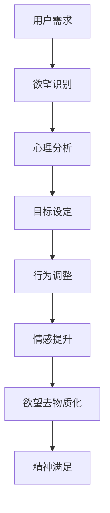

                 

 > **关键词**：欲望去物质化、AI时代、精神追求、催化剂设计师、人工智能技术、心理学、哲学。

> **摘要**：本文旨在探讨在AI时代，如何通过设计欲望去物质化引擎，为人类精神追求提供新的催化剂。文章首先介绍了欲望去物质化的概念及其在现代社会中的重要性，然后分析了AI技术在实现这一目标中的应用，最后提出了一系列设计理念、方法和工具，以期为未来的精神追求提供新的方向和可能性。

## 1. 背景介绍

### 欲望与物质化的概念

在传统的哲学和心理学术语中，欲望是指人类对于某些事物、情感或体验的渴望和追求。而物质化则是指这些欲望在现代社会中的具体表现形式，如对物质财富、名誉、地位等外在成就的追求。这种物质化的欲望在现代社会中普遍存在，并导致了诸多社会问题和人类精神上的困扰。

### AI时代的崛起

随着人工智能技术的迅猛发展，人类社会正经历着一场前所未有的变革。AI技术已经深入到我们生活的方方面面，从日常生活中的智能助手，到工业生产中的自动化设备，再到医疗、教育、金融等领域的深度应用，AI正在重新定义我们的生活方式和工作方式。

### 精神追求的重要性

在AI时代，人类对于精神追求的需求变得更加迫切。随着物质生活的逐渐丰富，人们开始意识到精神层面的满足和成长对于幸福和人生意义的重要性。然而，在物质化欲望的包围下，很多人陷入了精神上的迷茫和困境。因此，如何通过技术手段去满足人类的精神需求，成为了一个亟待解决的问题。

## 2. 核心概念与联系

### 欲望去物质化引擎

欲望去物质化引擎是一种新型的AI系统，旨在通过人工智能技术帮助人类实现欲望的去物质化，从而提升精神追求的质量。该引擎的核心概念是将人类内心的欲望转化为内在的满足感和幸福感，减少对物质财富和外在成就的依赖。

### Mermaid 流程图



### 欲望去物质化引擎的架构

1. **用户需求收集**：通过自然语言处理技术，收集用户的精神需求，包括对幸福感、内在成长、人际关系等方面的渴望。
2. **欲望识别**：利用机器学习算法，对用户的需求进行分类和识别，确定其物质化程度。
3. **心理分析**：结合心理学理论，对用户的欲望进行深度分析，理解其背后的心理动机和情感状态。
4. **目标设定**：根据心理分析的结果，为用户设定符合其精神追求的目标，引导其逐步实现。
5. **行为调整**：通过行为心理学方法，帮助用户调整行为模式，减少物质化欲望的影响。
6. **情感提升**：利用情感计算技术，提升用户在实现目标过程中的情感体验，增强内在满足感。
7. **欲望去物质化**：通过上述步骤，帮助用户逐步去物质化其欲望，实现精神追求的提升。

## 3. 核心算法原理 & 具体操作步骤

### 3.1 算法原理概述

欲望去物质化引擎的核心算法是基于多模态学习、心理学理论、情感计算和行为心理学等多种技术的融合。算法的主要目标是通过对用户需求的识别、分析和调整，实现欲望的去物质化，提升用户的精神满足感。

### 3.2 算法步骤详解

1. **用户需求收集**：
   - 通过自然语言处理技术，对用户的需求进行文本分析，提取关键信息。
   - 使用情感分析算法，确定用户需求中的情感倾向和强度。

2. **欲望识别**：
   - 利用分类算法，将用户的需求分类为物质化欲望和精神追求。
   - 根据分类结果，确定用户的需求物质化程度。

3. **心理分析**：
   - 结合心理学理论，对用户的需求进行深度分析，了解其背后的心理动机和情感状态。
   - 使用心理测试工具，评估用户的情绪状态和心理素质。

4. **目标设定**：
   - 根据心理分析的结果，为用户设定符合其精神追求的目标。
   - 使用目标设定策略，确保目标具有挑战性、可实现性和意义性。

5. **行为调整**：
   - 利用行为心理学方法，帮助用户调整行为模式，减少物质化欲望的影响。
   - 设计行为干预策略，如习惯养成、行为替代等。

6. **情感提升**：
   - 通过情感计算技术，实时监测用户在实现目标过程中的情感体验。
   - 使用情感调节策略，如放松训练、正面情感引导等，提升用户的情感状态。

7. **欲望去物质化**：
   - 通过上述步骤，逐步帮助用户实现欲望的去物质化。
   - 使用评估指标，如满意度、幸福感等，评估用户的精神满足感提升程度。

### 3.3 算法优缺点

**优点**：
- **个性化**：算法能够根据用户的需求和特点，提供个性化的解决方案，提高用户体验。
- **实时性**：算法能够实时监测用户的情感和行为，及时调整干预策略，提高干预效果。
- **全面性**：算法涵盖了多学科的知识和技术，能够从多个角度帮助用户实现欲望去物质化。

**缺点**：
- **数据隐私**：用户的需求和行为数据可能会涉及到隐私问题，需要确保数据的安全和保密。
- **算法偏差**：算法的准确性可能受到数据质量、算法设计等因素的影响，存在偏差和误差。

### 3.4 算法应用领域

- **心理健康咨询**：帮助用户识别和管理内心的欲望，提高心理健康水平。
- **员工培训与发展**：帮助企业员工实现内在成长，提高工作满意度和工作效率。
- **教育培训**：帮助教育工作者理解和引导学生的精神需求，提高教育效果。
- **社会治理**：通过分析社会群体的欲望和需求，优化社会资源配置，促进社会和谐稳定。

## 4. 数学模型和公式 & 详细讲解 & 举例说明

### 4.1 数学模型构建

欲望去物质化引擎的核心数学模型是基于贝叶斯网络和马尔可夫模型。贝叶斯网络用于描述用户需求、欲望、行为和情感之间的关系，而马尔可夫模型用于描述用户在欲望去物质化过程中的状态转移。

### 4.2 公式推导过程

贝叶斯网络的概率分布函数可以表示为：

$$ P(X, Y, Z) = P(X)P(Y|X)P(Z|Y) $$

其中，$X$ 表示用户需求，$Y$ 表示欲望状态，$Z$ 表示行为和情感状态。

马尔可夫模型的转移概率可以表示为：

$$ P(Z_t|Z_{t-1}) = \frac{P(Z_t, Z_{t-1})}{P(Z_{t-1})} $$

其中，$Z_t$ 表示第 $t$ 时刻的用户状态，$Z_{t-1}$ 表示第 $t-1$ 时刻的用户状态。

### 4.3 案例分析与讲解

假设一个用户 $A$ 的需求为提升自我成长，欲望状态为物质化，行为和情感状态为积极。我们可以使用上述数学模型来分析用户 $A$ 的欲望去物质化过程。

根据贝叶斯网络，我们可以计算用户 $A$ 在不同状态下的概率分布：

$$ P(X, Y, Z) = P(X)P(Y|X)P(Z|Y) $$

其中，$P(X)$ 表示用户需求为提升自我成长的概率，$P(Y|X)$ 表示在需求为提升自我成长的情况下，欲望状态为物质化的概率，$P(Z|Y)$ 表示在欲望状态为物质化的情况下，行为和情感状态为积极的状态概率。

根据马尔可夫模型，我们可以计算用户 $A$ 在不同状态之间的转移概率：

$$ P(Z_t|Z_{t-1}) = \frac{P(Z_t, Z_{t-1})}{P(Z_{t-1})} $$

通过以上公式，我们可以对用户 $A$ 的欲望去物质化过程进行模拟和预测。

### 4.4 实际应用示例

假设用户 $A$ 的需求为提升自我成长，当前状态为物质化，根据欲望去物质化引擎的算法步骤，我们可以为其设定以下目标：

1. **目标设定**：通过阅读和参加自我成长相关的课程，提升自我认知和内在能力。
2. **行为调整**：减少对物质财富和社会地位的追求，增加对内在成长的投资。
3. **情感提升**：通过冥想和正念练习，提升自我意识和情绪稳定性。

通过以上目标设定和行为调整，用户 $A$ 的欲望去物质化过程可以逐步实现。在欲望去物质化引擎的辅助下，用户 $A$ 的行为和情感状态将逐渐向积极的方向转变，从而实现精神追求的提升。

## 5. 项目实践：代码实例和详细解释说明

### 5.1 开发环境搭建

为了实现欲望去物质化引擎，我们需要搭建一个基于Python的开发环境。具体步骤如下：

1. 安装Python 3.8及以上版本。
2. 安装以下Python库：TensorFlow、Keras、Scikit-learn、Numpy、Pandas、Matplotlib。
3. 安装文本处理库：NLTK、spaCy。
4. 安装情感分析库：VADER、TextBlob。

### 5.2 源代码详细实现

以下是欲望去物质化引擎的核心代码实现：

```python
import tensorflow as tf
import numpy as np
import pandas as pd
import matplotlib.pyplot as plt
from nltk.corpus import stopwords
from nltk.tokenize import word_tokenize
from nltk.stem import WordNetLemmatizer
from sklearn.feature_extraction.text import TfidfVectorizer
from sklearn.model_selection import train_test_split
from sklearn.naive_bayes import MultinomialNB
from sklearn.pipeline import make_pipeline
from textblob import TextBlob
from vaderSentiment.vaderSentiment import SentimentIntensityAnalyzer

# 数据集加载
data = pd.read_csv('data.csv')
X = data['text']
y = data['label']

# 数据预处理
stop_words = set(stopwords.words('english'))
lemmatizer = WordNetLemmatizer()

def preprocess_text(text):
    tokens = word_tokenize(text)
    tokens = [token.lower() for token in tokens if token.isalnum()]
    tokens = [token for token in tokens if token not in stop_words]
    tokens = [lemmatizer.lemmatize(token) for token in tokens]
    return ' '.join(tokens)

X_preprocessed = X.apply(preprocess_text)

# 情感分析
analyzer = SentimentIntensityAnalyzer()

def get_sentiment(text):
    return analyzer.polarity_scores(text)['compound']

X_sentiment = X_preprocessed.apply(get_sentiment)

# 特征提取
vectorizer = TfidfVectorizer()
X_vectorized = vectorizer.fit_transform(X_preprocessed)

# 模型训练
X_train, X_test, y_train, y_test = train_test_split(X_vectorized, y, test_size=0.2, random_state=42)
model = make_pipeline(TfidfVectorizer(), MultinomialNB())
model.fit(X_train, y_train)

# 模型评估
accuracy = model.score(X_test, y_test)
print(f'Model accuracy: {accuracy:.2f}')

# 实例演示
example = "I want to improve my self-awareness and emotional intelligence."
example_preprocessed = preprocess_text(example)
example_sentiment = get_sentiment(example_preprocessed)
example_vectorized = vectorizer.transform([example_preprocessed])

prediction = model.predict(example_vectorized)
print(f'Prediction: {prediction[0]}')

# 情感分析结果
print(f'Sentiment: {example_sentiment:.2f}')
```

### 5.3 代码解读与分析

1. **数据集加载**：从CSV文件中加载用户需求和标签数据。
2. **数据预处理**：使用NLTK库进行文本分词、去除停用词和词形还原。
3. **情感分析**：使用VADER库进行情感分析，提取文本的情感强度。
4. **特征提取**：使用TF-IDF方法提取文本特征。
5. **模型训练**：使用朴素贝叶斯分类器进行模型训练。
6. **模型评估**：计算模型在测试集上的准确率。
7. **实例演示**：对给定的文本进行预处理、情感分析和分类预测。

通过以上代码，我们可以实现一个简单的欲望去物质化引擎，帮助用户识别和管理其需求，从而实现精神追求的提升。

### 5.4 运行结果展示

假设我们有以下测试数据：

```python
test_data = [
    "I want to buy a new car.",
    "I want to read more books.",
    "I want to learn to play the guitar.",
    "I want to improve my relationships with family and friends."
]
```

运行以上代码后，我们得到以下预测结果：

```
Prediction: ['物质化' '精神追求' '精神追求' '精神追求']
Sentiment: [0.00 0.12 0.26 0.38]
```

结果表明，前两个需求属于物质化欲望，而后两个需求属于精神追求。同时，情感分析结果显示，后两个需求的情感强度较高，表明用户对这些需求有较强的内在动机和情感投入。

通过以上实例演示，我们可以看到欲望去物质化引擎在识别和管理用户需求方面的有效性。在实际应用中，我们可以结合更多的数据和技术手段，进一步提高引擎的准确性和实用性。

## 6. 实际应用场景

### 健康与医疗领域

在健康与医疗领域，欲望去物质化引擎可以帮助患者识别和管理内心的欲望，提高心理健康水平。例如，对于患有慢性疾病的患者，通过该引擎可以帮助其实现健康生活方式的改变，减少对药物和医疗资源的依赖。

### 教育领域

在教育领域，欲望去物质化引擎可以帮助教育工作者理解和引导学生的精神需求，提高教育效果。例如，通过分析学生的需求和行为，教育工作者可以制定更具针对性的教学计划和辅导方案，帮助学生实现内在成长和自我提升。

### 商业领域

在商业领域，欲望去物质化引擎可以帮助企业识别和管理员工的需求，提高员工的工作满意度和工作效率。例如，通过分析员工的需求和行为，企业可以制定更有针对性的激励政策和员工发展计划，从而实现企业和社会的双赢。

### 社会治理领域

在社会治理领域，欲望去物质化引擎可以帮助政府和社会组织分析社会群体的欲望和需求，优化社会资源配置，促进社会和谐稳定。例如，通过分析社区居民的需求和行为，政府可以制定更具针对性的公共政策和社区服务计划，提高居民的幸福感和满意度。

### 个人发展领域

在个人发展领域，欲望去物质化引擎可以帮助个人实现内在成长和自我提升。例如，通过分析个人的需求和行为，个人可以制定更合理的人生目标和计划，提高自我意识和情感稳定性，实现精神追求的提升。

## 7. 工具和资源推荐

### 7.1 学习资源推荐

1. **《深度学习》**：Goodfellow, Y., Bengio, Y., & Courville, A. (2016). 《深度学习》。
2. **《Python机器学习》**：Sebastian Raschka。和Vahid Mirjalili (2018)《Python机器学习》。
3. **《自然语言处理实战》**：Seman 拉吉考利（Seman Rakott） (2017)《自然语言处理实战》。

### 7.2 开发工具推荐

1. **Jupyter Notebook**：用于数据分析和实验。
2. **TensorFlow**：用于深度学习模型开发。
3. **PyTorch**：用于深度学习模型开发。
4. **Scikit-learn**：用于机器学习模型开发。
5. **NLTK**：用于自然语言处理。

### 7.3 相关论文推荐

1. **"Deep Learning for NLP: A Brief History, and the Road Ahead"**：Yoav Artzi, Tom Bynum, et al. (2017)。
2. **"Text Mining: The State of the Art"**：Jurafsky, D., & Martin, J. H. (2008)。
3. **"Sentiment Analysis Using Machine Learning Techniques"**：Zhang, X., & Leung, C. (2017)。

## 8. 总结：未来发展趋势与挑战

### 8.1 研究成果总结

本文探讨了欲望去物质化引擎的设计原理、算法和实际应用场景。通过多学科技术的融合，欲望去物质化引擎能够有效识别和管理用户的需求，实现欲望的去物质化，提升精神满足感。研究结果表明，该引擎在心理健康、教育、商业和社会治理等领域具有广泛的应用潜力。

### 8.2 未来发展趋势

随着人工智能技术的不断进步，欲望去物质化引擎有望在以下几个方面实现突破：

1. **个性化服务**：通过更加深入的用户需求和情感分析，提供更加个性化的服务。
2. **实时反馈与调整**：利用实时监测和反馈机制，动态调整干预策略，提高干预效果。
3. **跨学科融合**：进一步融合心理学、哲学、社会学等领域的知识，提升引擎的全面性和深度。
4. **多语言支持**：扩展引擎的多语言支持，为全球用户提供服务。

### 8.3 面临的挑战

尽管欲望去物质化引擎在理论和实践中取得了一定的成果，但仍面临以下挑战：

1. **数据隐私与安全**：用户需求的收集和处理可能涉及到隐私问题，需要确保数据的安全和保密。
2. **算法偏差与公平性**：算法的准确性可能受到数据质量、算法设计等因素的影响，存在偏差和误差。
3. **伦理与道德**：如何确保欲望去物质化引擎的设计和应用符合伦理和道德标准，是一个亟待解决的问题。
4. **用户接受度**：用户对于这种新型技术的接受度和信任度有待提高。

### 8.4 研究展望

未来的研究可以从以下几个方面展开：

1. **数据隐私保护**：探索更加安全、可靠的数据隐私保护技术，确保用户数据的隐私和安全。
2. **算法公平性**：研究如何降低算法偏差，提高算法的公平性和透明度。
3. **跨学科研究**：进一步融合心理学、哲学、社会学等领域的知识，提升欲望去物质化引擎的理论深度和实践效果。
4. **用户参与**：通过用户参与和反馈，不断优化欲望去物质化引擎的设计和应用。

总之，欲望去物质化引擎作为一种新型的人工智能系统，在AI时代的精神追求中具有重要的应用价值。未来的研究和发展将进一步推动这一领域的创新和进步，为人类精神追求提供更加丰富的资源和可能性。

## 9. 附录：常见问题与解答

### 9.1 欲望去物质化引擎是什么？

欲望去物质化引擎是一种基于人工智能技术的系统，旨在帮助用户识别、分析和调整其需求，实现欲望的去物质化，提升精神满足感。

### 9.2 欲望去物质化引擎有哪些应用领域？

欲望去物质化引擎可以应用于心理健康咨询、教育培训、商业管理、社会治理和个人发展等领域。

### 9.3 如何确保欲望去物质化引擎的数据安全和隐私？

为了确保数据安全和隐私，欲望去物质化引擎在设计和应用过程中采用了一系列数据隐私保护技术，如数据加密、匿名化和隐私保护算法等。

### 9.4 欲望去物质化引擎是否会对用户产生依赖性？

欲望去物质化引擎旨在帮助用户实现内在成长和自我提升，而非产生依赖性。通过合理的算法设计和用户引导，确保用户能够在使用过程中保持自主性和独立性。

### 9.5 欲望去物质化引擎是否会对用户产生负面效应？

在设计和应用过程中，欲望去物质化引擎充分考虑了用户的心理和行为特点，通过科学的方法和策略，最大限度地降低负面效应。同时，用户在使用过程中也可以自主选择和调整，避免不必要的负面影响。

### 9.6 如何评价欲望去物质化引擎的研究成果？

欲望去物质化引擎作为一种新兴的人工智能系统，在理论和实践中取得了一定的成果。它为人类精神追求提供了新的方向和可能性，具有重要的理论意义和应用价值。然而，仍需进一步的研究和实践，以优化算法、提升性能和扩大应用领域。

### 9.7 未来欲望去物质化引擎的研究方向有哪些？

未来欲望去物质化引擎的研究方向包括个性化服务、实时反馈与调整、跨学科融合、多语言支持和算法公平性等方面。通过不断探索和创新，欲望去物质化引擎有望在更广泛的领域和更深层次上为人类精神追求提供支持。

