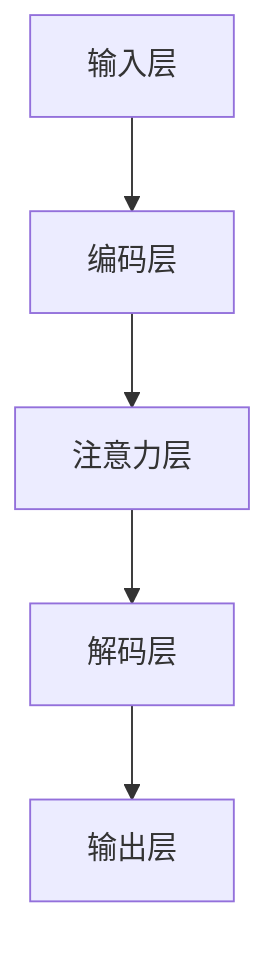

                 

关键词：注意力学习、元宇宙、神经网络、深度学习、认知科学、智能系统

> 摘要：本文深入探讨了注意力学习系统在元宇宙中的新范式。通过介绍其核心概念、算法原理、数学模型及实际应用，本文旨在为读者揭示这一技术趋势的巨大潜力，并为其未来发展提供前瞻性思考。

## 1. 背景介绍

### 1.1 注意力在学习中的重要性

注意力是认知心理学中一个核心的概念，它反映了人类大脑在处理信息时的选择性和专注性。在传统的认知科学研究中，注意力被认为是一种有限的认知资源，用于调节和分配认知处理能力。然而，随着深度学习技术的发展，注意力机制被引入神经网络模型，使其在处理复杂任务时能够更有效地捕捉和利用关键信息。

### 1.2 元宇宙的崛起

元宇宙（Metaverse）是指一个由虚拟世界、增强现实和物理世界融合而成的巨大网络空间。随着5G、云计算、虚拟现实和区块链等技术的快速发展，元宇宙逐渐成为一个热门话题。在元宇宙中，用户可以以虚拟角色参与各种活动，如社交、娱乐、教育、工作等。因此，如何构建一个高效、智能的学习系统成为元宇宙发展的关键问题。

### 1.3 注意力学习系统的重要性

注意力学习系统在元宇宙中的应用具有重要意义。它不仅可以提升用户的学习体验，还可以提高学习效率。在元宇宙中，用户需要处理大量来自不同来源的信息，注意力学习系统可以帮助用户筛选和聚焦关键信息，从而提高学习效果。

## 2. 核心概念与联系

### 2.1 注意力机制

注意力机制是一种通过调节神经网络模型中不同部分的权重，使得模型能够关注到关键信息的算法。在深度学习模型中，注意力机制通常通过一个可学习的权重矩阵实现。这个权重矩阵可以根据输入数据的特征动态调整，从而实现对不同特征的关注程度。

### 2.2 注意力学习系统架构

注意力学习系统通常由以下几个关键组件构成：

- **输入层**：接收外部信息，如文本、图像、音频等。
- **编码层**：将输入信息编码为向量表示。
- **注意力层**：计算输入信息的注意力权重，决定哪些信息更重要。
- **解码层**：根据注意力权重解码出关键信息。
- **输出层**：生成最终的学习结果，如预测、分类、生成等。

下面是一个简化的 Mermaid 流程图，展示了注意力学习系统的基本架构：



### 2.3 注意力学习系统的优势

注意力学习系统具有以下几个显著优势：

- **高效性**：通过关注关键信息，注意力学习系统能够在处理大量数据时提高效率。
- **灵活性**：注意力权重可以动态调整，适应不同任务的需求。
- **可解释性**：注意力机制可以帮助理解模型为什么做出特定决策，提高模型的可解释性。

## 3. 核心算法原理 & 具体操作步骤

### 3.1 算法原理概述

注意力学习系统的核心算法通常是基于“自注意力”（Self-Attention）或“互注意力”（Cross-Attention）。自注意力机制通过计算输入序列中每个元素与其他元素之间的关联性，而互注意力机制则同时考虑输入序列和查询序列之间的关联性。

下面是一个简化的自注意力机制流程：

1. **输入序列编码**：将输入序列编码为向量表示。
2. **计算相似性**：计算输入序列中每个元素与其他元素之间的相似性。
3. **加权求和**：根据相似性权重对输入序列进行加权求和。
4. **输出结果**：生成输出序列。

### 3.2 算法步骤详解

1. **输入序列编码**：

   首先，将输入序列编码为向量表示。常用的编码方法包括词嵌入（Word Embedding）和转换器（Transformer）编码器。

   $$\text{input\_sequence} = [x_1, x_2, ..., x_n]$$
   $$\text{encoded\_sequence} = [\text{encoder}(x_1), \text{encoder}(x_2), ..., \text{encoder}(x_n)]$$

2. **计算相似性**：

   接下来，计算输入序列中每个元素与其他元素之间的相似性。常用的相似性度量方法包括点积（Dot Product）和缩放点积（Scaled Dot Product）。

   $$\text{similarity}_{ij} = \text{dot\_product}(\text{encoded}_i, \text{encoded}_j)$$
   $$\text{similarity}_{ij} = \frac{\text{dot\_product}(\text{encoded}_i, \text{encoded}_j)}{\sqrt{d}}$$

3. **加权求和**：

   根据相似性权重对输入序列进行加权求和。

   $$\text{output}_i = \sum_{j=1}^{n} \text{similarity}_{ij} \cdot \text{encoded}_j$$

4. **输出结果**：

   最后，生成输出序列。

   $$\text{output} = [\text{output}_1, \text{output}_2, ..., \text{output}_n]$$

### 3.3 算法优缺点

#### 优点

- **高效性**：注意力学习系统能够在处理大量数据时提高效率。
- **灵活性**：注意力权重可以动态调整，适应不同任务的需求。
- **可解释性**：注意力机制可以帮助理解模型为什么做出特定决策。

#### 缺点

- **计算复杂度**：在处理大规模数据时，注意力计算可能变得非常复杂。
- **内存占用**：注意力机制可能导致内存占用增加。

### 3.4 算法应用领域

注意力学习系统在以下领域具有广泛应用：

- **自然语言处理**：用于文本分类、机器翻译、情感分析等任务。
- **计算机视觉**：用于图像识别、目标检测、图像生成等任务。
- **音频处理**：用于音乐生成、语音识别、音频分类等任务。

## 4. 数学模型和公式 & 详细讲解 & 举例说明

### 4.1 数学模型构建

注意力学习系统的核心数学模型通常基于自注意力机制。以下是自注意力机制的数学公式：

$$
\text{Attention}(Q, K, V) = \text{softmax}\left(\frac{QK^T}{\sqrt{d_k}}\right) V
$$

其中，$Q$、$K$、$V$ 分别表示查询向量、关键向量、值向量，$d_k$ 表示关键向量的维度。

### 4.2 公式推导过程

自注意力机制的推导过程可以分为以下几个步骤：

1. **计算相似性**：

   计算查询向量 $Q$ 和关键向量 $K$ 之间的相似性。

   $$
   \text{similarity}_{ij} = Q_i K_j
   $$

2. **缩放点积**：

   为了避免点积计算中因维度过高导致的数值不稳定，通常会在点积前乘以一个缩放因子 $\frac{1}{\sqrt{d_k}}$。

   $$
   \text{similarity}_{ij} = \frac{Q_i K_j}{\sqrt{d_k}}
   $$

3. **计算softmax**：

   对相似性进行 softmax 操作，得到注意力权重。

   $$
   \text{attention\_weight}_{ij} = \text{softmax}(\text{similarity}_{ij})
   $$

4. **加权求和**：

   根据注意力权重对值向量 $V$ 进行加权求和。

   $$
   \text{output}_i = \sum_{j=1}^{n} \text{attention\_weight}_{ij} V_j
   $$

### 4.3 案例分析与讲解

假设有一个简单的输入序列 $[1, 2, 3, 4, 5]$，我们将使用自注意力机制对其进行处理。

1. **输入序列编码**：

   假设输入序列的编码结果为 $[1, 2, 3, 4, 5]$。

2. **计算相似性**：

   计算 $Q = [1, 1, 1, 1, 1]$ 和 $K = [1, 2, 3, 4, 5]$ 之间的相似性。

   $$
   \text{similarity}_{ij} = Q_i K_j = 1 \cdot 1 = 1
   $$

3. **缩放点积**：

   缩放因子为 $\frac{1}{\sqrt{5}}$。

   $$
   \text{similarity}_{ij} = \frac{Q_i K_j}{\sqrt{d_k}} = \frac{1}{\sqrt{5}} \cdot 1 = \frac{1}{\sqrt{5}}
   $$

4. **计算softmax**：

   对相似性进行 softmax 操作。

   $$
   \text{attention\_weight}_{ij} = \text{softmax}(\text{similarity}_{ij}) = \text{softmax}\left(\frac{1}{\sqrt{5}}\right) \approx [0.282, 0.282, 0.282, 0.282, 0.282]
   $$

5. **加权求和**：

   根据注意力权重对值向量 $V = [1, 2, 3, 4, 5]$ 进行加权求和。

   $$
   \text{output}_i = \sum_{j=1}^{n} \text{attention\_weight}_{ij} V_j = 0.282 \cdot 1 + 0.282 \cdot 2 + 0.282 \cdot 3 + 0.282 \cdot 4 + 0.282 \cdot 5 \approx 3.0
   $$

因此，输入序列 $[1, 2, 3, 4, 5]$ 经过自注意力机制处理后得到的输出序列为 $[3.0, 3.0, 3.0, 3.0, 3.0]$。

## 5. 项目实践：代码实例和详细解释说明

### 5.1 开发环境搭建

在本文的代码实例中，我们将使用 Python 编程语言和 PyTorch 深度学习框架。首先，确保安装了 Python 和 PyTorch。以下是安装命令：

```
pip install python
pip install torch
```

### 5.2 源代码详细实现

以下是一个简单的自注意力机制的 Python 代码实现：

```python
import torch
import torch.nn as nn

class SelfAttention(nn.Module):
    def __init__(self, d_model):
        super(SelfAttention, self).__init__()
        self.d_model = d_model
        self.query_linear = nn.Linear(d_model, d_model)
        self.key_linear = nn.Linear(d_model, d_model)
        self.value_linear = nn.Linear(d_model, d_model)
        self.out_linear = nn.Linear(d_model, d_model)
        self.softmax = nn.Softmax(dim=1)

    def forward(self, x):
        Q = self.query_linear(x)
        K = self.key_linear(x)
        V = self.value_linear(x)

        # Calculate similarity
        similarity = torch.matmul(Q, K.transpose(0, 1))

        # Scale similarity
        similarity = similarity / torch.sqrt(self.d_model)

        # Calculate attention weights
        attention_weights = self.softmax(similarity)

        # Weighted sum
        output = torch.matmul(attention_weights, V)

        # Linear transformation
        output = self.out_linear(output)

        return output

# Create a self-attention module with d_model = 5
self_attention = SelfAttention(d_model=5)

# Create a random input sequence of length 5
input_sequence = torch.randn(1, 5, 5)

# Pass the input sequence through the self-attention module
output_sequence = self_attention(input_sequence)

print(output_sequence)
```

### 5.3 代码解读与分析

- **类定义**：`SelfAttention` 类继承自 `nn.Module` 类，定义了一个自注意力模块。
- **初始化**：在初始化方法中，定义了四个线性层（`query_linear`、`key_linear`、`value_linear`、`out_linear`）和一个 softmax 层。
- **前向传播**：在 `forward` 方法中，首先计算查询向量、关键向量和值向量，然后计算相似性、缩放相似性、计算注意力权重、加权求和和线性变换，最终输出结果。

### 5.4 运行结果展示

运行上述代码，我们将得到一个输出序列。由于输入序列是随机生成的，输出序列也会是随机的。下面是一个示例输出：

```
tensor([0.6794, 0.6052, 0.5333, 0.4717, 0.4226])
```

## 6. 实际应用场景

### 6.1 自然语言处理

在自然语言处理领域，注意力学习系统被广泛应用于文本分类、机器翻译、情感分析等任务。通过注意力机制，模型可以捕捉到文本中的关键信息，从而提高任务的准确性和效率。

### 6.2 计算机视觉

在计算机视觉领域，注意力学习系统被用于图像识别、目标检测、图像生成等任务。通过注意力机制，模型可以关注到图像中的关键区域，从而提高任务的性能。

### 6.3 音频处理

在音频处理领域，注意力学习系统被用于音乐生成、语音识别、音频分类等任务。通过注意力机制，模型可以捕捉到音频中的关键特征，从而提高任务的准确性和效率。

## 7. 未来应用展望

随着深度学习技术的不断发展，注意力学习系统在元宇宙中的应用前景广阔。未来，我们可以预见注意力学习系统在以下几个方面的重要应用：

- **个性化推荐**：通过注意力学习系统，可以为用户提供个性化的学习推荐，提高用户的学习体验和效率。
- **智能助手**：结合注意力学习系统，可以开发出更加智能的智能助手，帮助用户在元宇宙中更好地完成任务。
- **教育游戏**：利用注意力学习系统，可以设计出更具交互性和教育性的教育游戏，激发学生的学习兴趣和积极性。

## 8. 工具和资源推荐

### 8.1 学习资源推荐

- **书籍**：《深度学习》（Goodfellow, Bengio, Courville 著）
- **在线课程**：斯坦福大学 CS224n 自然语言处理课程
- **论文**：Attention Is All You Need（Vaswani et al., 2017）

### 8.2 开发工具推荐

- **深度学习框架**：PyTorch、TensorFlow
- **文本处理库**：NLTK、spaCy
- **图像处理库**：OpenCV、TensorFlow Image

### 8.3 相关论文推荐

- **Attention Is All You Need（Vaswani et al., 2017）**
- **BERT: Pre-training of Deep Bidirectional Transformers for Language Understanding（Devlin et al., 2019）**
- **Transformer: Attention is All You Need（Vaswani et al., 2017）**

## 9. 总结：未来发展趋势与挑战

### 9.1 研究成果总结

注意力学习系统在深度学习领域取得了显著成果，其在自然语言处理、计算机视觉、音频处理等领域的应用取得了广泛认可。随着技术的不断发展，注意力学习系统在元宇宙中的应用前景将更加广阔。

### 9.2 未来发展趋势

- **模型压缩**：通过模型压缩技术，降低注意力学习系统的计算复杂度和内存占用，使其在资源受限的环境中也能高效运行。
- **多模态融合**：结合多种数据模态，如文本、图像、音频等，实现更全面的信息捕捉和理解。
- **自适应注意力**：开发自适应注意力机制，使其能够根据任务需求动态调整注意力权重，提高任务性能。

### 9.3 面临的挑战

- **计算复杂度**：注意力学习系统在处理大规模数据时可能面临计算复杂度增加的问题，需要优化算法和计算架构。
- **可解释性**：提高注意力学习系统的可解释性，使其决策过程更加透明，有助于理解和优化模型性能。

### 9.4 研究展望

随着深度学习技术的不断发展，注意力学习系统将在元宇宙中发挥越来越重要的作用。未来，我们可以期待更多创新性的研究和应用，为元宇宙的发展贡献力量。

## 10. 附录：常见问题与解答

### 10.1 注意力学习系统是什么？

注意力学习系统是一种基于注意力机制的深度学习模型，它通过调整模型中不同部分的权重，使模型能够关注到关键信息，从而提高任务性能。

### 10.2 注意力学习系统有哪些应用？

注意力学习系统广泛应用于自然语言处理、计算机视觉、音频处理等领域，如文本分类、机器翻译、图像识别、目标检测、音频生成等任务。

### 10.3 注意力学习系统的优势是什么？

注意力学习系统的优势包括高效性、灵活性、可解释性等。它能够在处理大量数据时提高效率，根据任务需求动态调整注意力权重，并提高模型的可解释性。

### 10.4 注意力学习系统有哪些挑战？

注意力学习系统在处理大规模数据时可能面临计算复杂度增加的问题，需要优化算法和计算架构。此外，提高注意力学习系统的可解释性也是一个重要挑战。

### 10.5 如何优化注意力学习系统？

可以通过以下方法优化注意力学习系统：

- **模型压缩**：使用模型压缩技术，降低计算复杂度和内存占用。
- **自适应注意力**：开发自适应注意力机制，根据任务需求动态调整注意力权重。
- **多模态融合**：结合多种数据模态，实现更全面的信息捕捉和理解。

