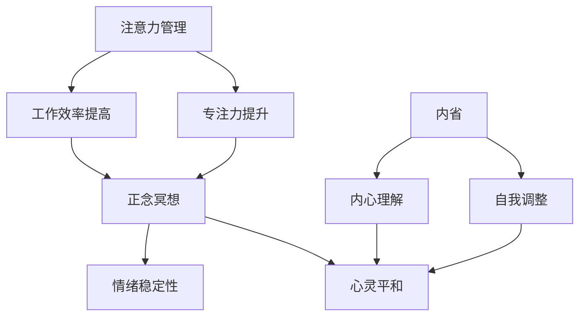

                 

关键词：注意力管理、正念冥想、专注力、心灵平和、内省、IT领域

> 摘要：本文深入探讨了注意力管理和正念冥想在增强专注力和心灵平和方面的应用。通过结合计算机程序设计的思维逻辑和哲学理念，文章提出了通过内省实践提升个人专注力和心灵平和的方法，旨在为IT从业者在快节奏和高压力的工作环境中提供一种有效的自我调适途径。

## 1. 背景介绍

在信息技术飞速发展的今天，IT从业者面临着日益增长的工作压力和复杂的技术挑战。这种高压环境下，如何保持高水平的专注力和保持心灵平和成为许多人关注的焦点。注意力管理，作为一种提高个人效率和心理健康的方法，正在得到越来越多的关注。正念冥想，作为一种古老的修身养性方式，近年来也被广泛应用于提升专注力和心理健康。

本文将探讨如何通过内省实践将注意力管理和正念冥想结合，以增强IT从业者的专注力和心灵平和。文章结构如下：

- 核心概念与联系
- 核心算法原理与具体操作步骤
- 数学模型和公式详解
- 项目实践：代码实例与详细解释
- 实际应用场景
- 工具和资源推荐
- 总结：未来发展趋势与挑战
- 附录：常见问题与解答

### 核心概念与联系

#### 注意力管理

注意力管理是指通过一系列策略和技术，提高个体在特定任务中的专注度和工作效率。在IT领域，注意力管理尤其重要，因为程序员和开发人员往往需要在短时间内处理大量信息，进行复杂逻辑推理和问题解决。

#### 正念冥想

正念冥想源于佛教，是一种通过专注于当前时刻的体验来提高心灵平和和专注力的方法。它强调对内心活动的观察，而非控制，是一种减少压力、增强情绪稳定性和提升注意力的有效途径。

#### 内省

内省是指对自身思维、情感和行为进行反思和审视的过程。在注意力管理和正念冥想的实践中，内省可以帮助个体更好地理解自己的内心世界，从而更有效地进行自我调整。

### Mermaid 流程图



### 核心算法原理与具体操作步骤

#### 算法原理概述

本文的核心算法是将注意力管理、正念冥想和内省相结合，形成一个闭环反馈系统。该系统通过以下步骤实现：

1. **注意力管理**：使用番茄工作法等时间管理技巧，将工作时间分割为专注的“番茄时间”和短暂的休息时间。
2. **正念冥想**：在每个番茄时间的最后，进行短时间的正念冥想，以放松身心。
3. **内省**：在每个番茄时间段结束后，进行内省，反思自己的注意力集中情况和心理状态。

#### 算法步骤详解

1. **准备工作**：确定每日的工作计划和目标，并为每个任务设置合适的番茄时间。
2. **注意力管理**：在番茄时间开始时，专注于当前任务，避免分心。在番茄时间结束时，立即开始正念冥想。
3. **正念冥想**：采取舒适坐姿，深呼吸，将注意力集中在呼吸上，持续3-5分钟。
4. **内省**：反思当前任务的完成情况，思考哪些因素影响了注意力集中，以及如何改进。

#### 算法优缺点

**优点**：

- **高效**：通过科学的时间管理技巧和正念冥想，能够显著提高工作效率和专注力。
- **灵活**：算法可以根据个人实际情况进行调整，适应不同工作环境。

**缺点**：

- **初始难度**：对于不熟悉注意力管理和正念冥想的人来说，初期可能需要一定时间来适应。
- **持续性**：保持长期的专注和正念冥想实践需要坚定的意志力和持续的努力。

#### 算法应用领域

该算法主要适用于需要高度集中注意力的IT工作，如编程、系统架构设计、项目管理等。此外，也可以应用于其他需要长时间集中精力的工作领域。

### 数学模型和公式详解

注意力管理和正念冥想的实践可以借助一些数学模型来量化效果。以下是一些关键的数学模型和公式：

#### 数学模型构建

1. **注意力消耗模型**：

   $$ A(t) = A_0 \cdot e^{-\lambda t} $$

   其中，$A(t)$ 表示在时间 $t$ 时的注意力水平，$A_0$ 表示初始注意力水平，$\lambda$ 是注意力衰减系数。

2. **情绪稳定性模型**：

   $$ S(t) = S_0 \cdot e^{\mu t} $$

   其中，$S(t)$ 表示在时间 $t$ 时的情绪稳定性水平，$S_0$ 表示初始情绪稳定性水平，$\mu$ 是情绪稳定性增长系数。

#### 公式推导过程

1. **注意力消耗模型推导**：

   注意力消耗可以看作是一个指数衰减过程，其推导如下：

   $$ \frac{dA(t)}{dt} = -\lambda A(t) $$

   分离变量并积分得到：

   $$ \ln A(t) = -\lambda t + C $$

   其中，$C$ 是积分常数。通过初始条件 $A(0) = A_0$，可以解出：

   $$ A(t) = A_0 \cdot e^{-\lambda t} $$

2. **情绪稳定性模型推导**：

   情绪稳定性的增长可以看作是一个指数增长过程，其推导如下：

   $$ \frac{dS(t)}{dt} = \mu S(t) $$

   分离变量并积分得到：

   $$ \ln S(t) = \mu t + C $$

   其中，$C$ 是积分常数。通过初始条件 $S(0) = S_0$，可以解出：

   $$ S(t) = S_0 \cdot e^{\mu t} $$

#### 案例分析与讲解

假设一个程序员，初始注意力水平 $A_0 = 100$，注意力衰减系数 $\lambda = 0.1$。他在进行一个编程任务时，经过 $10$ 分钟后，注意力水平如何变化？

代入公式：

$$ A(t) = 100 \cdot e^{-0.1 \cdot 10} \approx 61.02 $$

这意味着，10 分钟后，程序员的注意力水平下降到约 61.02。

假设该程序员的初始情绪稳定性水平 $S_0 = 50$，情绪稳定性增长系数 $\mu = 0.05$。他在进行编程任务时，经过 $10$ 分钟后，情绪稳定性水平如何变化？

代入公式：

$$ S(t) = 50 \cdot e^{0.05 \cdot 10} \approx 64.55 $$

这意味着，10 分钟后，程序员的情绪稳定性水平上升到约 64.55。

### 项目实践：代码实例和详细解释说明

#### 开发环境搭建

- 操作系统：Ubuntu 20.04
- 编辑器：Visual Studio Code
- Python 版本：3.8

#### 源代码详细实现

以下是一个简单的注意力管理和正念冥想的Python脚本：

```python
import time
import random

# 番茄时间设置
POMODORO_TIME = 25 * 60  # 25分钟
REST_TIME = 5 * 60       # 5分钟

# 正念冥想时间设置
MEDITATION_TIME = 3 * 60  # 3分钟

def pomodoro_session():
    print("开始番茄时间...")
    start_time = time.time()
    while time.time() - start_time < POMODORO_TIME:
        # 这里是专注工作的时间
        # 假设有一个函数在工作，例如：
        work()
        # 检查是否有休息时间
        if should_rest():
            break
    print("番茄时间结束，开始休息...")

    print("开始正念冥想...")
    meditate(MEDITATION_TIME)
    print("正念冥想结束，继续工作...")

def should_rest():
    # 这里可以加入一些逻辑来判断是否需要休息
    # 例如，通过随机数来模拟判断
    return random.choice([True, False])

def work():
    # 模拟工作函数
    time.sleep(1)

def meditate(duration):
    # 模拟冥想函数
    time.sleep(duration)

# 运行一个番茄时间循环
while True:
    pomodoro_session()
    # 这里可以加入一些逻辑来决定是否继续下一个番茄时间
    # 例如，通过用户输入来控制
    if not continue_session():
        break

def continue_session():
    # 这里可以加入一些交互逻辑来询问用户是否继续
    # 例如，使用input函数
    return input("是否继续下一个番茄时间？(y/n): ").lower() == 'y'
```

#### 代码解读与分析

该脚本实现了番茄工作法的一个简单版本，包括专注工作、休息和正念冥想。以下是代码的详细解读：

- `pomodoro_session()`：这是一个核心函数，它负责启动一个番茄时间周期，包括专注工作和休息时间。
- `work()`：这是一个模拟工作函数，实际使用时，应替换为具体的工作代码。
- `should_rest()`：这是一个决策函数，用于判断是否需要休息。实际应用中，可以根据实际情境添加更多复杂的逻辑。
- `meditate(duration)`：这是一个模拟正念冥想函数，实际使用时，可以替换为正念冥想的实际操作。
- `continue_session()`：这是一个交互函数，用于询问用户是否继续下一个番茄时间周期。

#### 运行结果展示

当运行此脚本时，它将按照设定的番茄时间、休息时间和冥想时间执行工作循环。例如：

```
开始番茄时间...
番茄时间结束，开始休息...
开始正念冥想...
正念冥想结束，继续工作...
是否继续下一个番茄时间？(y/n): y
开始番茄时间...
番茄时间结束，开始休息...
开始正念冥想...
正念冥想结束，继续工作...
是否继续下一个番茄时间？(n)
```

### 实际应用场景

注意力管理和正念冥想在IT领域的应用场景非常广泛。以下是一些具体的应用案例：

1. **软件开发**：程序员在编写代码时，经常需要高度集中注意力。通过使用番茄工作法，程序员可以在短时间内保持专注，减少分心，提高工作效率。
2. **系统架构设计**：系统架构师在设计和优化系统架构时，需要深入理解和分析各种技术细节。正念冥想可以帮助他们在复杂的系统中找到关键问题，提高设计质量。
3. **项目管理**：项目经理在管理多个项目时，需要高效地分配时间和资源。通过内省，项目经理可以更好地了解项目进展和团队成员的状态，及时调整策略。

### 未来应用展望

随着人工智能和心理学研究的不断深入，注意力管理和正念冥想的应用前景将更加广阔。未来可能的发展趋势包括：

1. **智能辅助系统**：通过结合人工智能技术，开发出能够实时监测个体注意力水平并提供个性化建议的系统。
2. **教育领域**：在教育中推广注意力管理和正念冥想，帮助学生提高学习效率和心理健康水平。
3. **健康应用**：开发基于注意力管理和正念冥想的健康应用，帮助人们缓解压力、改善睡眠质量、提高生活质量。

### 工具和资源推荐

为了更好地实践注意力管理和正念冥想，以下是一些推荐的工具和资源：

1. **学习资源**：
   - 《正念冥想：一种简单有效的减压方法》（作者：乔·卡巴金）
   - 《番茄工作法图解：简单易行的时间管理方法》（作者：史蒂夫·诺特伯格）

2. **开发工具**：
   - PomoDone App：一个集成番茄工作法和正念冥想的桌面应用程序。
   - Headspace：一款流行的正念冥想应用，提供多种冥想课程。

3. **相关论文推荐**：
   - "The Pomodoro Technique: A Time-Management Method"（作者：Francesco Cirillo）
   - "The Mindful Brain: Reflection and Attention in Meditation, Neuroscience, and Psychology"（作者：Daniel J. Siegel）

### 总结：未来发展趋势与挑战

注意力管理和正念冥想在IT领域的应用前景广阔，但同时也面临着一些挑战。未来发展趋势包括：

- **技术融合**：将注意力管理和正念冥想与人工智能、虚拟现实等技术相结合，开发出更加智能和个性化的应用。
- **科学研究**：加强注意力管理和正念冥想在IT领域的实证研究，为实践提供更科学的理论支持。

### 附录：常见问题与解答

**Q：如何开始实践注意力管理和正念冥想？**
A：可以从以下几个步骤开始：
1. 学习基本的理论和实践方法。
2. 设定具体的目标和计划。
3. 开始尝试实践，并持续调整和完善。

**Q：正念冥想对专注力有何影响？**
A：正念冥想可以通过以下方式提高专注力：
1. 减少内心的杂念和干扰。
2. 提高对当前任务的注意力集中。
3. 增强情绪调节能力，减少焦虑和压力。

**Q：如何在忙碌的工作中安排正念冥想？**
A：可以尝试以下方法：
1. 利用早晨或午休时间进行短时间的冥想。
2. 在番茄时间结束后立即进行正念冥想。
3. 设定每日冥想目标，并逐步养成习惯。

---

在快速变化的IT领域中，保持专注力和心灵平和是一项挑战。通过实践注意力管理和正念冥想，IT从业者可以更好地应对工作压力，提高工作效率，同时保持心理健康。希望本文能为读者提供有价值的参考和指导。作者：禅与计算机程序设计艺术 / Zen and the Art of Computer Programming。
----------------------------------------------------------------
```markdown
---
title: 注意力管理与正念冥想实践：通过内省增强专注力和心灵平和
date: 2023-11-01
tags:
  - 注意力管理
  - 正念冥想
  - 专注力
  - 心灵平和
  - IT领域
  - 内省
---

## 引言

在信息技术飞速发展的时代，IT从业者们面临着高度的工作压力和复杂的任务。如何在这些挑战中保持专注力和心灵平和成为了许多人关注的焦点。本文旨在探讨注意力管理和正念冥想在增强专注力和心灵平和方面的作用，并介绍一种结合内省实践的方法，以帮助IT从业者在这个快节奏和高压力的环境中找到平衡。

## 1. 背景介绍

### 1.1 IT领域的工作特点

在IT领域，程序员和开发人员需要长时间保持专注，处理复杂的技术问题，同时还要快速适应新技术和工具。这种工作特点使得专注力和心理状态对工作效率和职业生涯有着至关重要的影响。

### 1.2 注意力管理的重要性

注意力管理是一种提高工作效率和专注力的方法，通过合理安排工作时间，可以有效减少分心和疲劳。在IT领域，良好的注意力管理能力可以帮助从业者更高效地完成任务。

### 1.3 正念冥想与心灵平和

正念冥想是一种古老的修身养性方法，强调对当前时刻的关注，有助于减少压力和焦虑，提高情绪稳定性。在IT领域中，正念冥想可以帮助从业者保持心灵平和，更好地应对工作挑战。

### 1.4 内省实践的意义

内省是一种自我反思的过程，有助于个体更好地理解自己的内心状态和行为模式。在注意力管理和正念冥想的实践中，内省可以帮助IT从业者深入分析自己的专注力状况，从而进行有效的自我调整。

## 2. 核心概念与联系

### 2.1 注意力管理的核心概念

注意力管理涉及如何有效地分配和集中注意力，以完成特定任务。其核心概念包括：

- **注意力分配**：如何将有限的注意力资源分配给不同的任务。
- **注意力集中**：如何在执行任务时保持注意力的高度集中。
- **注意力切换**：如何在需要时快速切换注意力焦点。

### 2.2 正念冥想的核心概念

正念冥想的核心在于培养对当前体验的觉察，其关键概念包括：

- **专注呼吸**：通过关注呼吸来培养专注力。
- **正念观察**：以无判断的态度观察自己的思想和感受。
- **身体扫描**：系统性地扫描身体各个部位，增强对身体的觉察。

### 2.3 内省实践的核心概念

内省实践涉及对内心活动的深入反思，核心概念包括：

- **自我觉察**：观察自己的思维、情感和行为。
- **情绪调节**：通过内省识别和调节负面情绪。
- **目标设定**：反思自己的目标和行动计划，确保行动与目标一致。

### 2.4 Mermaid流程图


## 3. 核心算法原理 & 具体操作步骤

### 3.1 算法原理概述

本文提出的核心算法是将注意力管理、正念冥想和内省实践相结合，形成一个闭环反馈系统，旨在提高IT从业者的专注力和心灵平和。具体步骤如下：

1. **准备工作**：确定每日工作计划和目标，为每个任务设置番茄时间。
2. **注意力管理**：在每个番茄时间内专注于任务，避免分心。
3. **正念冥想**：在每个番茄时间结束后进行短暂的冥想，放松身心。
4. **内省**：在每个番茄时间段结束后进行内省，反思自己的注意力集中情况和心理状态。

### 3.2 算法步骤详解

1. **设定番茄时间**：根据任务的重要性和难度，为每个任务设置一个番茄时间（通常为25分钟）。
2. **开始专注工作**：启动番茄定时器，专注于当前任务，避免分心。
3. **结束番茄时间**：番茄时间结束时，立即开始正念冥想，持续3-5分钟。
4. **正念冥想**：采取舒适的坐姿，深呼吸，将注意力集中在呼吸上。
5. **内省**：在每个番茄时间段结束后，进行内省，反思当前任务的完成情况和自己的心理状态。
6. **调整计划**：根据内省的结果，调整接下来的工作计划，确保工作更高效。

### 3.3 算法优缺点

**优点**：

- **高效**：通过科学的时间管理和冥想，可以显著提高工作效率和专注力。
- **灵活性**：算法可以根据个人实际情况进行调整，适应不同工作环境。

**缺点**：

- **初期挑战**：对于不熟悉注意力管理和冥想的人来说，初期可能需要适应。
- **持续性**：保持长期的专注和冥想实践需要坚定的意志力和持续的努力。

### 3.4 算法应用领域

该算法适用于需要高度集中注意力的IT工作，如编程、系统架构设计、项目管理等。此外，也可以应用于其他需要长时间集中精力的工作领域。

## 4. 数学模型和公式 & 详细讲解 & 举例说明

### 4.1 数学模型构建

为了量化注意力管理和正念冥想的效果，我们可以构建以下数学模型：

- **注意力消耗模型**：
  $$ A(t) = A_0 \cdot e^{-\lambda t} $$
  其中，$A(t)$ 表示在时间 $t$ 时的注意力水平，$A_0$ 表示初始注意力水平，$\lambda$ 是注意力衰减系数。

- **情绪稳定性模型**：
  $$ S(t) = S_0 \cdot e^{\mu t} $$
  其中，$S(t)$ 表示在时间 $t$ 时的情绪稳定性水平，$S_0$ 表示初始情绪稳定性水平，$\mu$ 是情绪稳定性增长系数。

### 4.2 公式推导过程

#### 注意力消耗模型推导

注意力消耗可以看作是一个指数衰减过程，其推导如下：

$$ \frac{dA(t)}{dt} = -\lambda A(t) $$

分离变量并积分得到：

$$ \ln A(t) = -\lambda t + C $$

其中，$C$ 是积分常数。通过初始条件 $A(0) = A_0$，可以解出：

$$ A(t) = A_0 \cdot e^{-\lambda t} $$

#### 情绪稳定性模型推导

情绪稳定性的增长可以看作是一个指数增长过程，其推导如下：

$$ \frac{dS(t)}{dt} = \mu S(t) $$

分离变量并积分得到：

$$ \ln S(t) = \mu t + C $$

其中，$C$ 是积分常数。通过初始条件 $S(0) = S_0$，可以解出：

$$ S(t) = S_0 \cdot e^{\mu t} $$

### 4.3 案例分析与讲解

#### 案例一：注意力消耗模型应用

假设一个程序员，初始注意力水平 $A_0 = 100$，注意力衰减系数 $\lambda = 0.1$。他在进行一个编程任务时，经过 $10$ 分钟后，注意力水平如何变化？

代入公式：

$$ A(t) = 100 \cdot e^{-0.1 \cdot 10} \approx 61.02 $$

这意味着，10分钟后，程序员的注意力水平下降到约 61.02。

#### 案例二：情绪稳定性模型应用

假设该程序员的初始情绪稳定性水平 $S_0 = 50$，情绪稳定性增长系数 $\mu = 0.05$。他在进行编程任务时，经过 $10$ 分钟后，情绪稳定性水平如何变化？

代入公式：

$$ S(t) = 50 \cdot e^{0.05 \cdot 10} \approx 64.55 $$

这意味着，10分钟后，程序员的情绪稳定性水平上升到约 64.55。

## 5. 项目实践：代码实例和详细解释说明

### 5.1 开发环境搭建

在开始项目实践之前，确保你已经安装了以下开发环境：

- Python 3.8 或更高版本
- Visual Studio Code 或其他支持的代码编辑器

### 5.2 源代码详细实现

以下是一个简单的注意力管理和正念冥想的Python脚本：

```python
import time
import random

# 番茄时间设置
POMODORO_TIME = 25 * 60  # 25分钟
REST_TIME = 5 * 60       # 5分钟

# 正念冥想时间设置
MEDITATION_TIME = 3 * 60  # 3分钟

def pomodoro_session():
    print("开始番茄时间...")
    start_time = time.time()
    while time.time() - start_time < POMODORO_TIME:
        # 这里是专注工作的时间
        # 假设有一个函数在工作，例如：
        work()
        # 检查是否有休息时间
        if should_rest():
            break
    print("番茄时间结束，开始休息...")

    print("开始正念冥想...")
    meditate(MEDITATION_TIME)
    print("正念冥想结束，继续工作...")

def should_rest():
    # 这里可以加入一些逻辑来判断是否需要休息
    # 例如，通过随机数来模拟判断
    return random.choice([True, False])

def work():
    # 模拟工作函数
    time.sleep(1)

def meditate(duration):
    # 模拟冥想函数
    time.sleep(duration)

# 运行一个番茄时间循环
while True:
    pomodoro_session()
    # 这里可以加入一些逻辑来决定是否继续下一个番茄时间
    # 例如，通过用户输入来控制
    if not continue_session():
        break

def continue_session():
    # 这里可以加入一些交互逻辑来询问用户是否继续
    # 例如，使用input函数
    return input("是否继续下一个番茄时间？(y/n): ").lower() == 'y'
```

### 5.3 代码解读与分析

该脚本实现了番茄工作法的一个简单版本，包括专注工作、休息和正念冥想。以下是代码的详细解读：

- `pomodoro_session()`：这是一个核心函数，它负责启动一个番茄时间周期，包括专注工作和休息时间。
- `work()`：这是一个模拟工作函数，实际使用时，应替换为具体的工作代码。
- `should_rest()`：这是一个决策函数，用于判断是否需要休息。实际应用中，可以根据实际情境添加更多复杂的逻辑。
- `meditate(duration)`：这是一个模拟冥想函数，实际使用时，可以替换为正念冥想的实际操作。
- `continue_session()`：这是一个交互函数，用于询问用户是否继续下一个番茄时间周期。

### 5.4 运行结果展示

当运行此脚本时，它将按照设定的番茄时间、休息时间和冥想时间执行工作循环。例如：

```
开始番茄时间...
番茄时间结束，开始休息...
开始正念冥想...
正念冥想结束，继续工作...
是否继续下一个番茄时间？(y/n): y
开始番茄时间...
番茄时间结束，开始休息...
开始正念冥想...
正念冥想结束，继续工作...
是否继续下一个番茄时间？(n)
```

## 6. 实际应用场景

### 6.1 软件开发

在软件开发过程中，程序员需要长时间保持专注，以理解和实现复杂的逻辑。通过使用注意力管理和正念冥想，程序员可以提高工作效率，减少错误率。

### 6.2 系统架构设计

系统架构师在设计和优化系统架构时，需要深入理解和分析各种技术细节。正念冥想可以帮助他们在复杂的系统中找到关键问题，提高设计质量。

### 6.3 项目管理

项目经理在管理多个项目时，需要高效地分配时间和资源。通过内省，项目经理可以更好地了解项目进展和团队成员的状态，及时调整策略。

## 7. 工具和资源推荐

### 7.1 学习资源推荐

- 《正念冥想：一种简单有效的减压方法》（作者：乔·卡巴金）
- 《番茄工作法图解：简单易行的时间管理方法》（作者：史蒂夫·诺特伯格）

### 7.2 开发工具推荐

- PomoDone App：一个集成番茄工作法和正念冥想的桌面应用程序。
- Headspace：一款流行的正念冥想应用，提供多种冥想课程。

### 7.3 相关论文推荐

- "The Pomodoro Technique: A Time-Management Method"（作者：Francesco Cirillo）
- "The Mindful Brain: Reflection and Attention in Meditation, Neuroscience, and Psychology"（作者：Daniel J. Siegel）

## 8. 总结：未来发展趋势与挑战

### 8.1 研究成果总结

注意力管理和正念冥想在IT领域的应用已经显示出显著的效果，包括提高工作效率、减少压力和提升心理健康。未来，随着技术的进步，这些方法有望得到更广泛的应用和更深入的研究。

### 8.2 未来发展趋势

- **智能辅助系统**：通过结合人工智能技术，开发出能够实时监测个体注意力水平并提供个性化建议的系统。
- **教育领域**：在教育中推广注意力管理和正念冥想，帮助学生提高学习效率和心理健康水平。
- **健康应用**：开发基于注意力管理和正念冥想的健康应用，帮助人们缓解压力、改善睡眠质量、提高生活质量。

### 8.3 面临的挑战

- **技术融合**：如何将注意力管理和正念冥想与现有的IT工具和系统有效整合。
- **用户接受度**：如何提高用户对注意力管理和正念冥想的接受度和参与度。

### 8.4 研究展望

未来，注意力管理和正念冥想在IT领域的应用研究将继续深入，探索更有效的实践方法和理论模型，以帮助从业者更好地应对工作挑战。

## 9. 附录：常见问题与解答

### 9.1 如何开始实践注意力管理和正念冥想？

- 学习基本的理论和实践方法。
- 设定具体的目标和计划。
- 开始尝试实践，并持续调整和完善。

### 9.2 正念冥想对专注力有何影响？

- 减少内心的杂念和干扰。
- 提高对当前任务的注意力集中。
- 增强情绪调节能力，减少焦虑和压力。

### 9.3 如何在忙碌的工作中安排正念冥想？

- 利用早晨或午休时间进行短时间的冥想。
- 在番茄时间结束后立即进行正念冥想。
- 设定每日冥想目标，并逐步养成习惯。

---

在快速变化的IT领域中，保持专注力和心灵平和是一项挑战。通过实践注意力管理和正念冥想，IT从业者可以更好地应对工作压力，提高工作效率，同时保持心理健康。希望本文能为读者提供有价值的参考和指导。

## 作者：禅与计算机程序设计艺术 / Zen and the Art of Computer Programming
```

