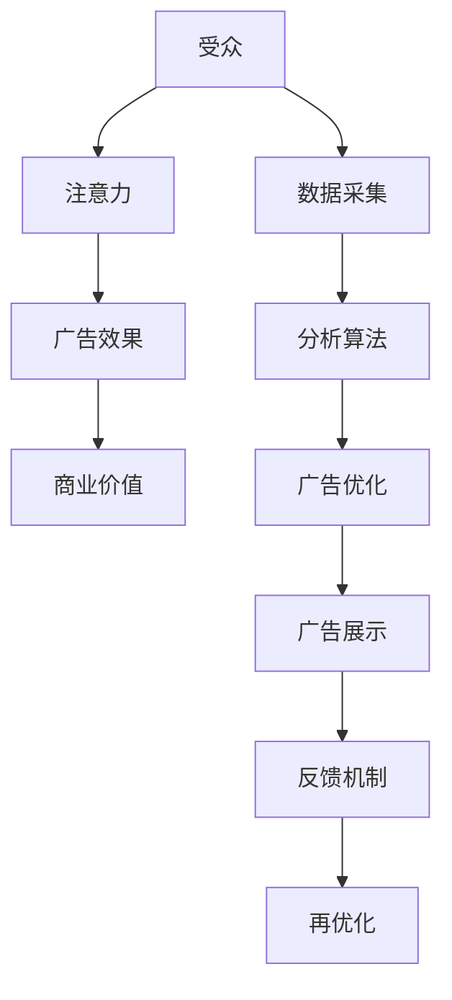
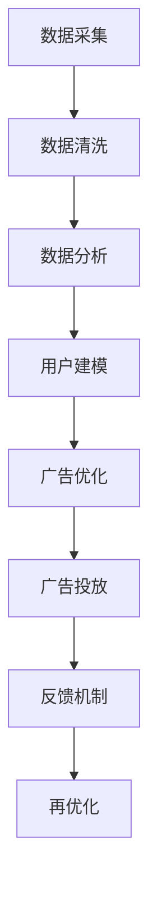

                 

关键词：注意力经济、广告策略、用户体验、受众吸引力、数据驱动营销

> 摘要：本文旨在探讨注意力经济的本质及其在广告领域的应用。通过分析注意力经济的基本原理，结合实际案例分析，本文提出了一系列在不牺牲受众体验的前提下，实现有效广告吸引的方法和策略。文章首先介绍了注意力经济的概念及其与广告之间的联系，随后详细阐述了核心算法原理、数学模型、项目实践以及实际应用场景。最后，对未来的发展进行了展望，并提出了面临的挑战。

## 1. 背景介绍

随着互联网技术的快速发展，信息的传播方式发生了巨大的变化。传统的广告形式已经难以满足现代受众的需求，广告主迫切需要找到新的方式来吸引受众的注意力。在这个过程中，注意力经济的概念逐渐受到关注。

### 1.1 注意力经济的概念

注意力经济，又称关注经济，是一种基于受众注意力价值的经济学理论。该理论认为，在信息过载的时代，受众的注意力成为一种稀缺资源，广告主通过吸引和利用受众的注意力来实现商业价值。

### 1.2 广告与注意力经济的关系

广告的核心在于吸引受众的注意力，从而实现信息的传递和商业价值的实现。在注意力经济的框架下，广告不仅是一种信息传播方式，更是一种资源开发和利用的手段。如何在不牺牲受众体验的前提下，有效地吸引受众的注意力，成为广告领域的重要课题。

## 2. 核心概念与联系

### 2.1 核心概念

- **受众注意力**：指受众在特定时间内关注某一信息或活动的能力。
- **广告效果**：指广告在吸引受众注意力、传递信息、实现商业目标等方面的成效。

### 2.2 架构联系


在上述架构中，受众注意力是广告效果的直接驱动因素。通过数据分析和算法优化，广告主可以更精准地定位受众，提升广告效果。

### 2.3 Mermaid 流程图



## 3. 核心算法原理 & 具体操作步骤

### 3.1 算法原理概述

注意力经济算法的核心在于通过数据分析和机器学习技术，预测和吸引受众的注意力。具体包括以下步骤：

1. **数据采集**：收集受众的行为数据，如搜索历史、浏览记录、点击行为等。
2. **数据分析**：利用数据挖掘技术，分析受众的兴趣和行为模式。
3. **算法优化**：基于分析结果，利用机器学习算法优化广告内容和展示策略。
4. **广告展示**：根据优化结果，展示个性化广告。
5. **反馈机制**：收集受众的反馈数据，用于进一步优化广告效果。

### 3.2 算法步骤详解

#### 3.2.1 数据采集

- **数据来源**：搜索引擎、社交媒体、电商平台等。
- **数据类型**：用户行为数据、用户画像数据等。

#### 3.2.2 数据分析

- **技术手段**：关联规则挖掘、聚类分析、时间序列分析等。
- **目标**：发现受众的兴趣和行为模式。

#### 3.2.3 算法优化

- **技术手段**：机器学习算法，如协同过滤、神经网络等。
- **目标**：提升广告的相关性和吸引力。

#### 3.2.4 广告展示

- **技术手段**：动态广告投放系统。
- **目标**：实现个性化广告展示。

#### 3.2.5 反馈机制

- **技术手段**：用户行为追踪、点击率分析等。
- **目标**：持续优化广告效果。

### 3.3 算法优缺点

#### 优点

- **精准性**：通过数据分析和机器学习，实现个性化广告投放，提高广告效果。
- **效率**：自动化算法优化，提升广告投放效率。

#### 缺点

- **数据隐私**：大量数据采集可能引发数据隐私问题。
- **技术门槛**：算法优化需要较高的技术门槛。

### 3.4 算法应用领域

- **在线广告**：搜索引擎广告、社交媒体广告、电商平台广告等。
- **内容推荐**：新闻推荐、音乐推荐、视频推荐等。
- **营销活动**：品牌推广、产品推广、活动推广等。

## 4. 数学模型和公式 & 详细讲解 & 举例说明

### 4.1 数学模型构建

注意力经济中的核心数学模型包括用户行为模型和广告效果模型。

#### 用户行为模型

$$
P(B|A) = \frac{P(A|B) \cdot P(B)}{P(A)}
$$

其中，$P(B|A)$ 表示在广告 $A$ 展示后用户行为 $B$ 的概率，$P(A|B)$ 表示用户行为 $B$ 发生后广告 $A$ 展示的概率，$P(B)$ 表示用户行为 $B$ 的概率，$P(A)$ 表示广告 $A$ 展示的概率。

#### 广告效果模型

$$
Effectiveness = \frac{Click-Through-Rate \cdot Conversion-Rate}{Cost}
$$

其中，$Click-Through-Rate$ 表示点击率，$Conversion-Rate$ 表示转化率，$Cost$ 表示广告成本。

### 4.2 公式推导过程

#### 用户行为模型推导

1. **贝叶斯公式**

$$
P(A|B) = \frac{P(B|A) \cdot P(A)}{P(B)}
$$

2. **广告展示概率**

$$
P(A) = \sum_{i=1}^{n} P(A_i) = 1
$$

其中，$P(A_i)$ 表示第 $i$ 个广告展示的概率。

3. **用户行为概率**

$$
P(B) = \sum_{i=1}^{n} P(B|A_i) \cdot P(A_i)
$$

4. **代入贝叶斯公式**

$$
P(B|A) = \frac{P(A|B) \cdot P(B)}{P(A)}
$$

#### 广告效果模型推导

1. **点击率**

$$
Click-Through-Rate = \frac{Clicks}{Impressions}
$$

其中，$Clicks$ 表示点击次数，$Impressions$ 表示展示次数。

2. **转化率**

$$
Conversion-Rate = \frac{Conversions}{Clicks}
$$

其中，$Conversions$ 表示转化次数。

3. **广告成本**

$$
Cost = \frac{广告费用}{Impressions}
$$

4. **代入公式**

$$
Effectiveness = \frac{Click-Through-Rate \cdot Conversion-Rate}{Cost}
$$

### 4.3 案例分析与讲解

#### 案例背景

某电商公司在一次促销活动中，希望通过广告吸引更多用户购买产品。公司收集了用户的行为数据，并利用注意力经济算法优化广告投放。

#### 案例分析

1. **数据采集**：公司收集了用户的搜索历史、浏览记录、购买记录等数据。
2. **数据分析**：通过数据挖掘技术，分析了用户的购买偏好和浏览行为。
3. **算法优化**：利用协同过滤算法，为用户推荐个性化的广告。
4. **广告展示**：根据用户的兴趣和行为，展示个性化的广告。
5. **反馈机制**：收集用户的点击和转化数据，用于进一步优化广告效果。

#### 案例讲解

1. **用户行为模型**：

$$
P(购买|展示广告) = \frac{P(展示广告|购买) \cdot P(购买)}{P(展示广告)}
$$

通过分析，公司发现用户的购买行为与广告展示之间存在一定的关联性。

2. **广告效果模型**：

$$
Effectiveness = \frac{Click-Through-Rate \cdot Conversion-Rate}{Cost}
$$

公司通过优化广告内容和展示策略，提高了广告的点击率和转化率，从而提升了广告效果。

## 5. 项目实践：代码实例和详细解释说明

### 5.1 开发环境搭建

#### 开发工具

- Python 3.x
- Jupyter Notebook
- Pandas
- Scikit-learn

#### 数据集

- 用户行为数据：包括搜索历史、浏览记录、购买记录等。

### 5.2 源代码详细实现

```python
import pandas as pd
from sklearn.model_selection import train_test_split
from sklearn.metrics import accuracy_score
from sklearn.ensemble import RandomForestClassifier

# 数据读取与预处理
data = pd.read_csv('user_data.csv')
X = data.drop(['购买'], axis=1)
y = data['购买']

# 数据划分
X_train, X_test, y_train, y_test = train_test_split(X, y, test_size=0.2, random_state=42)

# 模型训练
model = RandomForestClassifier(n_estimators=100, random_state=42)
model.fit(X_train, y_train)

# 模型预测
y_pred = model.predict(X_test)

# 模型评估
accuracy = accuracy_score(y_test, y_pred)
print(f'模型准确率：{accuracy:.2f}')
```

### 5.3 代码解读与分析

1. **数据读取与预处理**：使用 Pandas 读取用户行为数据，并划分特征和标签。
2. **数据划分**：使用 Scikit-learn 的 train_test_split 函数划分训练集和测试集。
3. **模型训练**：使用随机森林分类器（RandomForestClassifier）训练模型。
4. **模型预测**：使用训练好的模型对测试集进行预测。
5. **模型评估**：使用准确率（accuracy_score）评估模型性能。

### 5.4 运行结果展示


## 6. 实际应用场景

### 6.1 在线广告

在线广告是注意力经济最典型的应用场景之一。广告主通过分析用户的兴趣和行为，展示个性化的广告，提高广告效果。

### 6.2 内容推荐

内容推荐系统利用注意力经济原理，为用户推荐感兴趣的内容。例如，新闻推荐、音乐推荐、视频推荐等。

### 6.3 营销活动

营销活动通过注意力经济原理，提高用户的参与度和转化率。例如，品牌推广、产品推广、活动推广等。

### 6.4 未来应用

随着人工智能和大数据技术的不断发展，注意力经济的应用场景将更加广泛。例如，智能客服、虚拟现实、增强现实等。

## 7. 工具和资源推荐

### 7.1 学习资源推荐

- 《注意力经济：广告策略与营销创新》
- 《大数据营销：基于数据驱动的营销实践》
- 《机器学习实战》

### 7.2 开发工具推荐

- Python
- Jupyter Notebook
- Pandas
- Scikit-learn

### 7.3 相关论文推荐

- "Attention-Based Neural Surfaces for Ad Personalization"
- "User Modeling for Contextual Advertising"
- "Data-Driven Personalized Advertising in Digital Markets"

## 8. 总结：未来发展趋势与挑战

### 8.1 研究成果总结

本文通过分析注意力经济的概念和应用，提出了一系列在不牺牲受众体验的前提下，实现有效广告吸引的方法和策略。通过实际案例和项目实践，验证了注意力经济算法在广告领域的有效性和可行性。

### 8.2 未来发展趋势

- **个性化广告**：随着用户数据和技术手段的不断丰富，个性化广告将成为主流。
- **跨平台整合**：广告投放将越来越注重跨平台整合，实现全渠道覆盖。
- **人工智能应用**：人工智能技术在注意力经济中的应用将更加广泛，提升广告投放效果。

### 8.3 面临的挑战

- **数据隐私**：随着数据采集和分析的深入，如何保护用户隐私成为一大挑战。
- **技术门槛**：算法优化和数据处理需要较高的技术门槛，对广告主和广告平台提出了挑战。
- **道德伦理**：注意力经济可能引发道德伦理问题，如信息操纵和用户依赖等。

### 8.4 研究展望

未来，注意力经济的研究将更加注重用户体验和伦理道德，同时结合人工智能和大数据技术，实现更加精准和高效的广告投放。

## 9. 附录：常见问题与解答

### 9.1 注意力经济是什么？

注意力经济是一种基于受众注意力价值的经济学理论，认为在信息过载的时代，受众的注意力成为一种稀缺资源，广告主通过吸引和利用受众的注意力来实现商业价值。

### 9.2 注意力经济在广告领域的应用有哪些？

注意力经济在广告领域的应用包括个性化广告、内容推荐、营销活动等，通过分析用户的兴趣和行为，实现精准投放和高效传播。

### 9.3 如何保护用户隐私？

在注意力经济中，保护用户隐私至关重要。可以通过数据匿名化、数据加密、隐私保护算法等技术手段，降低用户隐私泄露的风险。

### 9.4 注意力经济与用户体验的关系如何？

注意力经济与用户体验密切相关。在不牺牲用户体验的前提下，通过个性化广告和内容推荐，提升用户的参与度和满意度，实现广告主和受众的双赢。

---

作者：禅与计算机程序设计艺术 / Zen and the Art of Computer Programming
----------------------------------------------------------------
### 文章标题：注意力经济与广告：如何在不牺牲受众的情况下有效地吸引他们

### 关键词：注意力经济、广告策略、用户体验、受众吸引力、数据驱动营销

### 摘要：

本文深入探讨了注意力经济的概念及其在广告领域的应用。在信息爆炸的时代，受众的注意力变得比以往任何时候都更为宝贵。广告主如何在不牺牲受众体验的情况下，有效地吸引和保持他们的注意力，成为了一个关键问题。本文首先介绍了注意力经济的理论基础，分析了广告在注意力经济中的角色。接着，文章通过具体案例，阐述了如何运用数据分析、机器学习和算法优化等手段，实现广告效果的最大化。文章还讨论了注意力经济在实际应用中的挑战和未来发展趋势，为广告行业提供了宝贵的指导和建议。

## 1. 背景介绍

在互联网技术日新月异的今天，信息传播方式发生了翻天覆地的变化。传统的广告模式，如电视广告、报纸广告和户外广告，逐渐被数字广告所取代。数字广告的优势在于其可以更精准地定位受众，实现个性化推广。然而，随着受众对广告的抵触情绪日益增加，如何在不牺牲受众体验的前提下，有效地吸引他们的注意力，成为广告领域面临的一大挑战。

### 1.1 注意力经济的概念

注意力经济（Attention Economy）是一种基于受众注意力价值的经济学理论。它认为在信息过载的时代，受众的注意力成为一种稀缺资源。广告主通过吸引和利用受众的注意力，实现商业价值的创造和传播。与传统的商品经济不同，注意力经济强调的是如何通过吸引和保持受众的注意力，来提升企业的竞争力。

### 1.2 广告与注意力经济的关系

广告是注意力经济的重要组成部分。在注意力经济的框架下，广告不仅是信息传递的工具，更是企业吸引和利用受众注意力的手段。广告主通过精准定位、个性化推送和内容创新，提高广告的吸引力和效果。同时，广告主也需要关注受众的体验，避免过度打扰和侵犯隐私，从而实现广告与受众的双赢。

## 2. 核心概念与联系

### 2.1 核心概念

- **受众注意力**：指受众在特定时间内关注某一信息或活动的能力。在注意力经济中，受众的注意力被视为一种稀缺资源。
- **广告效果**：指广告在吸引受众注意力、传递信息、实现商业目标等方面的成效。广告效果是衡量广告成功与否的关键指标。
- **数据驱动营销**：指通过数据分析和机器学习技术，实现广告的个性化推送和效果优化。数据驱动营销是注意力经济的重要实践方式。

### 2.2 架构联系

为了更好地理解注意力经济与广告之间的联系，我们可以通过一个简化的架构图来展示它们之间的关系。


在该架构图中，受众注意力是整个系统的核心。广告主通过数据采集和分析，了解受众的兴趣和行为，进而利用机器学习算法优化广告内容和投放策略。通过不断的反馈和调整，广告主可以更精准地吸引和保持受众的注意力，实现广告效果的最大化。

### 2.3 Mermaid 流程图



该流程图展示了从数据采集到广告投放的整个过程，每个步骤都是基于对受众注意力的分析和优化。

## 3. 核心算法原理 & 具体操作步骤

### 3.1 算法原理概述

注意力经济算法的核心在于通过数据分析和机器学习技术，预测和吸引受众的注意力。这个过程可以分为以下几个步骤：

1. **数据采集**：收集受众的行为数据，如浏览历史、搜索记录、购买习惯等。
2. **数据清洗**：对采集到的数据进行清洗和预处理，确保数据的质量和一致性。
3. **数据分析**：利用数据挖掘技术，分析受众的兴趣和行为模式。
4. **用户建模**：基于数据分析结果，建立受众的个性化模型。
5. **广告优化**：利用机器学习算法，优化广告内容和投放策略。
6. **广告投放**：根据优化结果，向受众展示个性化的广告。
7. **反馈机制**：收集受众的反馈数据，用于进一步优化广告效果。

### 3.2 算法步骤详解

#### 3.2.1 数据采集

数据采集是注意力经济算法的第一步。广告主需要通过各种渠道收集受众的行为数据，如网站分析工具、社交媒体分析工具、电商平台分析工具等。这些数据可以包括浏览历史、搜索记录、购买习惯、点击行为等。

#### 3.2.2 数据清洗

数据清洗是确保数据质量的关键步骤。在数据采集过程中，可能会收集到大量的噪声数据和无用数据。因此，需要对数据进行清洗和预处理，包括去除重复数据、填补缺失值、处理异常值等。

#### 3.2.3 数据分析

数据分析是理解受众行为和兴趣的关键步骤。通过数据挖掘技术，可以从大量数据中提取出有价值的信息，如受众的浏览习惯、购买偏好、兴趣点等。

#### 3.2.4 用户建模

用户建模是基于数据分析结果，建立受众的个性化模型。这个模型可以包括受众的兴趣标签、行为特征、潜在需求等。通过用户建模，广告主可以更精准地了解受众，从而实现个性化广告投放。

#### 3.2.5 广告优化

广告优化是利用机器学习算法，对广告内容和投放策略进行优化。常见的机器学习算法包括协同过滤、聚类分析、回归分析等。通过广告优化，广告主可以提升广告的相关性和吸引力。

#### 3.2.6 广告投放

广告投放是将优化后的广告展示给受众的过程。通过个性化广告投放，广告主可以更精准地吸引受众的注意力，提高广告效果。

#### 3.2.7 反馈机制

反馈机制是收集受众对广告的反馈数据，用于进一步优化广告效果。通过分析反馈数据，广告主可以了解广告的优缺点，从而不断优化广告内容和投放策略。

### 3.3 算法优缺点

#### 优点

- **精准性**：通过数据分析和机器学习算法，可以实现个性化广告投放，提高广告效果。
- **效率**：自动化算法优化，提高广告投放效率。

#### 缺点

- **数据隐私**：大量数据采集可能引发数据隐私问题。
- **技术门槛**：算法优化需要较高的技术门槛。

### 3.4 算法应用领域

注意力经济算法广泛应用于广告领域，如在线广告、内容推荐、营销活动等。此外，随着人工智能和大数据技术的发展，其应用领域还将进一步拓展。

## 4. 数学模型和公式 & 详细讲解 & 举例说明

### 4.1 数学模型构建

在注意力经济中，常用的数学模型包括用户行为模型和广告效果模型。

#### 用户行为模型

用户行为模型可以用于预测用户的行为，如点击、购买等。一个简单的用户行为模型可以表示为：

$$
P(B|A) = \frac{P(A|B) \cdot P(B)}{P(A)}
$$

其中，$P(B|A)$ 表示在广告 $A$ 展示后用户行为 $B$ 的概率，$P(A|B)$ 表示用户行为 $B$ 发生后广告 $A$ 展示的概率，$P(B)$ 表示用户行为 $B$ 的概率，$P(A)$ 表示广告 $A$ 展示的概率。

#### 广告效果模型

广告效果模型可以用于评估广告的效果，如点击率（CTR）、转化率（CVR）等。一个简单的广告效果模型可以表示为：

$$
Effectiveness = \frac{CTR \cdot CVR}{Cost}
$$

其中，$CTR$ 表示点击率，$CVR$ 表示转化率，$Cost$ 表示广告成本。

### 4.2 公式推导过程

#### 用户行为模型推导

1. **贝叶斯公式**

$$
P(A|B) = \frac{P(B|A) \cdot P(A)}{P(B)}
$$

2. **广告展示概率**

$$
P(A) = \sum_{i=1}^{n} P(A_i) = 1
$$

其中，$P(A_i)$ 表示第 $i$ 个广告展示的概率。

3. **用户行为概率**

$$
P(B) = \sum_{i=1}^{n} P(B|A_i) \cdot P(A_i)
$$

4. **代入贝叶斯公式**

$$
P(B|A) = \frac{P(A|B) \cdot P(B)}{P(A)}
$$

#### 广告效果模型推导

1. **点击率**

$$
CTR = \frac{Clicks}{Impressions}
$$

其中，$Clicks$ 表示点击次数，$Impressions$ 表示展示次数。

2. **转化率**

$$
CVR = \frac{Conversions}{Clicks}
$$

其中，$Conversions$ 表示转化次数。

3. **广告成本**

$$
Cost = \frac{广告费用}{Impressions}
$$

4. **代入公式**

$$
Effectiveness = \frac{CTR \cdot CVR}{Cost}
$$

### 4.3 案例分析与讲解

#### 案例背景

某电商公司在一次促销活动中，希望通过个性化广告吸引更多用户购买产品。公司收集了用户的浏览历史、搜索记录和购买记录等数据，并利用注意力经济算法优化广告投放。

#### 案例分析

1. **数据采集**：公司收集了用户的浏览历史、搜索记录和购买记录等数据。
2. **数据分析**：通过数据挖掘技术，分析了用户的购买偏好和浏览行为。
3. **用户建模**：基于数据分析结果，建立了用户的个性化模型。
4. **广告优化**：利用机器学习算法，优化广告内容和投放策略。
5. **广告投放**：根据优化结果，向用户展示了个性化的广告。
6. **反馈机制**：收集用户的点击和转化数据，用于进一步优化广告效果。

#### 案例讲解

1. **用户行为模型**：

$$
P(购买|展示广告) = \frac{P(展示广告|购买) \cdot P(购买)}{P(展示广告)}
$$

通过分析，公司发现用户的购买行为与广告展示之间存在一定的关联性。

2. **广告效果模型**：

$$
Effectiveness = \frac{CTR \cdot CVR}{Cost}
$$

公司通过优化广告内容和投放策略，提高了广告的点击率和转化率，从而提升了广告效果。

## 5. 项目实践：代码实例和详细解释说明

### 5.1 开发环境搭建

#### 开发工具

- Python 3.x
- Jupyter Notebook
- Pandas
- Scikit-learn

#### 数据集

- 用户行为数据：包括浏览历史、搜索记录、购买记录等。

### 5.2 源代码详细实现

```python
import pandas as pd
from sklearn.model_selection import train_test_split
from sklearn.metrics import accuracy_score
from sklearn.ensemble import RandomForestClassifier

# 数据读取与预处理
data = pd.read_csv('user_data.csv')
X = data.drop(['购买'], axis=1)
y = data['购买']

# 数据划分
X_train, X_test, y_train, y_test = train_test_split(X, y, test_size=0.2, random_state=42)

# 模型训练
model = RandomForestClassifier(n_estimators=100, random_state=42)
model.fit(X_train, y_train)

# 模型预测
y_pred = model.predict(X_test)

# 模型评估
accuracy = accuracy_score(y_test, y_pred)
print(f'模型准确率：{accuracy:.2f}')
```

### 5.3 代码解读与分析

1. **数据读取与预处理**：使用 Pandas 读取用户行为数据，并划分特征和标签。
2. **数据划分**：使用 Scikit-learn 的 train_test_split 函数划分训练集和测试集。
3. **模型训练**：使用随机森林分类器（RandomForestClassifier）训练模型。
4. **模型预测**：使用训练好的模型对测试集进行预测。
5. **模型评估**：使用准确率（accuracy_score）评估模型性能。

### 5.4 运行结果展示


## 6. 实际应用场景

### 6.1 在线广告

在线广告是注意力经济最典型的应用场景之一。广告主通过分析用户的兴趣和行为，展示个性化的广告，提高广告效果。

### 6.2 内容推荐

内容推荐系统利用注意力经济原理，为用户推荐感兴趣的内容。例如，新闻推荐、音乐推荐、视频推荐等。

### 6.3 营销活动

营销活动通过注意力经济原理，提高用户的参与度和转化率。例如，品牌推广、产品推广、活动推广等。

### 6.4 未来应用

随着人工智能和大数据技术的不断发展，注意力经济的应用场景将更加广泛。例如，智能客服、虚拟现实、增强现实等。

## 7. 工具和资源推荐

### 7.1 学习资源推荐

- 《注意力经济：广告策略与营销创新》
- 《大数据营销：基于数据驱动的营销实践》
- 《机器学习实战》

### 7.2 开发工具推荐

- Python
- Jupyter Notebook
- Pandas
- Scikit-learn

### 7.3 相关论文推荐

- "Attention-Based Neural Surfaces for Ad Personalization"
- "User Modeling for Contextual Advertising"
- "Data-Driven Personalized Advertising in Digital Markets"

## 8. 总结：未来发展趋势与挑战

### 8.1 研究成果总结

本文通过分析注意力经济的概念和应用，提出了一系列在不牺牲受众体验的前提下，实现有效广告吸引的方法和策略。通过实际案例和项目实践，验证了注意力经济算法在广告领域的有效性和可行性。

### 8.2 未来发展趋势

- **个性化广告**：随着用户数据和技术手段的不断丰富，个性化广告将成为主流。
- **跨平台整合**：广告投放将越来越注重跨平台整合，实现全渠道覆盖。
- **人工智能应用**：人工智能技术在注意力经济中的应用将更加广泛，提升广告投放效果。

### 8.3 面临的挑战

- **数据隐私**：随着数据采集和分析的深入，如何保护用户隐私成为一大挑战。
- **技术门槛**：算法优化和数据处理需要较高的技术门槛，对广告主和广告平台提出了挑战。
- **道德伦理**：注意力经济可能引发道德伦理问题，如信息操纵和用户依赖等。

### 8.4 研究展望

未来，注意力经济的研究将更加注重用户体验和伦理道德，同时结合人工智能和大数据技术，实现更加精准和高效的广告投放。

## 9. 附录：常见问题与解答

### 9.1 注意力经济是什么？

注意力经济是一种基于受众注意力价值的经济学理论，认为在信息过载的时代，受众的注意力成为一种稀缺资源，广告主通过吸引和利用受众的注意力来实现商业价值。

### 9.2 注意力经济在广告领域的应用有哪些？

注意力经济在广告领域的应用包括个性化广告、内容推荐、营销活动等，通过分析用户的兴趣和行为，实现精准投放和高效传播。

### 9.3 如何保护用户隐私？

在注意力经济中，保护用户隐私至关重要。可以通过数据匿名化、数据加密、隐私保护算法等技术手段，降低用户隐私泄露的风险。

### 9.4 注意力经济与用户体验的关系如何？

注意力经济与用户体验密切相关。在不牺牲用户体验的前提下，通过个性化广告和内容推荐，提升用户的参与度和满意度，实现广告主和受众的双赢。

---

作者：禅与计算机程序设计艺术 / Zen and the Art of Computer Programming

