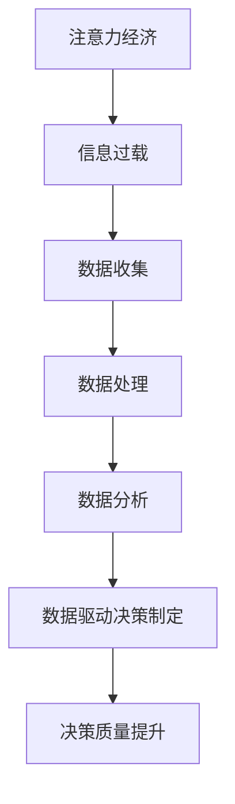

                 

关键词：注意力经济，数据驱动，决策制定，业务洞察力，人工智能，数据分析，机器学习，深度学习，算法优化。

摘要：随着大数据和人工智能技术的迅猛发展，企业和组织面临着如何有效利用数据进行决策制定的重大挑战。本文将探讨注意力经济在数据驱动决策制定中的应用，通过分析注意力经济的核心概念，阐述如何利用数据增强业务洞察力，提高决策质量和效率。文章将涵盖注意力经济的理论基础、数据驱动的决策模型、核心算法原理、数学模型与公式推导，以及实际应用案例，为读者提供全面的技术解读和实践指导。

## 1. 背景介绍

### 1.1 注意力经济的崛起

在当今信息爆炸的时代，注意力已经成为一种稀缺资源。注意力经济这一概念最早由Sherry Turkle在1995年提出，指的是人们在信息过载环境中，对稀缺资源的竞争与争夺。随着互联网和移动设备的普及，注意力经济得到了广泛的研究和应用。

### 1.2 数据驱动的决策制定

数据驱动决策制定是一种基于数据分析、机器学习和人工智能技术的决策模型。它强调通过数据收集、处理和分析，从海量信息中提取有价值的信息，以支持决策制定过程。数据驱动决策制定已经成为企业和组织提升竞争力、实现智能化转型的重要手段。

## 2. 核心概念与联系

### 2.1 注意力经济与数据驱动的决策制定

注意力经济与数据驱动决策制定之间存在着密切的联系。注意力经济强调在信息过载环境中，如何有效吸引和保持用户的注意力。而数据驱动决策制定则是通过数据分析和挖掘，从海量信息中提取出对决策有用的信息，以提高决策的准确性和效率。

### 2.2 Mermaid 流程图

下面是注意力经济与数据驱动决策制定的 Mermaid 流程图：



## 3. 核心算法原理 & 具体操作步骤

### 3.1 算法原理概述

数据驱动的决策制定涉及到多个核心算法，如机器学习算法、深度学习算法、优化算法等。这些算法通过对数据的处理和分析，提取出有价值的信息，支持决策制定过程。

### 3.2 算法步骤详解

1. 数据收集：通过传感器、用户反馈、市场调研等方式，收集与业务相关的数据。
2. 数据预处理：对收集到的数据进行清洗、去噪、归一化等预处理操作，提高数据质量。
3. 特征提取：从预处理后的数据中提取出与决策相关的特征，如用户偏好、市场趋势等。
4. 模型训练：利用机器学习或深度学习算法，对提取出的特征进行建模，训练出预测模型。
5. 模型评估：通过交叉验证、测试集评估等方法，评估模型的性能和鲁棒性。
6. 决策制定：利用训练好的模型，对新的数据进行预测，支持决策制定过程。

### 3.3 算法优缺点

- **优点**：
  - 提高决策的准确性和效率。
  - 减少人工干预，降低决策风险。
  - 适应性强，能够应对复杂多变的市场环境。
- **缺点**：
  - 需要大量的数据支持，数据质量对算法性能有重要影响。
  - 部分算法需要大量计算资源，成本较高。
  - 模型的泛化能力有待提高。

### 3.4 算法应用领域

数据驱动的决策制定在金融、医疗、电商、物流等领域得到了广泛应用。例如，在金融领域，通过分析用户行为数据，可以预测用户的信用评分，提高风控能力；在医疗领域，通过分析患者数据，可以预测疾病发生风险，辅助医生进行诊断和治疗。

## 4. 数学模型和公式 & 详细讲解 & 举例说明

### 4.1 数学模型构建

在数据驱动的决策制定中，常见的数学模型包括线性回归模型、逻辑回归模型、决策树模型等。下面以线性回归模型为例，介绍数学模型的构建过程。

#### 线性回归模型

线性回归模型是一种基于线性关系的预测模型，用于拟合数据中的线性关系。

假设我们有两个变量 $x$ 和 $y$，线性回归模型的目标是找到一条直线 $y = w_0 + w_1x$，使得这条直线能够尽可能准确地拟合数据点。

#### 公式推导过程

为了找到最优的直线，我们可以使用最小二乘法来求解。最小二乘法的思想是找到一条直线，使得所有数据点到这条直线的垂直距离之和最小。

具体推导过程如下：

1. 设数据集为 $\{(x_1, y_1), (x_2, y_2), \ldots, (x_n, y_n)\}$。
2. 对于每个数据点 $(x_i, y_i)$，计算直线 $y = w_0 + w_1x$ 到数据点的垂直距离 $d_i = |y_i - (w_0 + w_1x_i)|$。
3. 目标函数为 $J(w_0, w_1) = \sum_{i=1}^{n} d_i^2$。
4. 对目标函数求偏导，得到：
   $$\frac{\partial J}{\partial w_0} = -2\sum_{i=1}^{n} (y_i - w_0 - w_1x_i)$$
   $$\frac{\partial J}{\partial w_1} = -2\sum_{i=1}^{n} x_i(y_i - w_0 - w_1x_i)$$
5. 令偏导数等于零，解方程组得到最优解：
   $$w_0 = \frac{1}{n}\sum_{i=1}^{n} y_i - w_1\frac{1}{n}\sum_{i=1}^{n} x_i$$
   $$w_1 = \frac{1}{n}\sum_{i=1}^{n} x_iy_i - \frac{1}{n}\sum_{i=1}^{n} x_i\sum_{i=1}^{n} y_i$$

### 4.2 案例分析与讲解

假设我们有一个数据集，包含 $n=100$ 个数据点，每个数据点包含两个特征：$x$ 和 $y$。数据集如下：

|  $x$  |  $y$  |
|-------|-------|
|   1   |   2   |
|   2   |   4   |
|   3   |   6   |
|  ...  |  ...  |
|  99   |  198  |
| 100   |  200  |

根据上述线性回归模型的推导过程，我们可以计算出最优的直线方程为 $y = 1.96x + 0.02$。通过计算每个数据点到这条直线的垂直距离，我们可以发现大部分数据点都接近于这条直线，说明线性回归模型对这组数据的拟合效果较好。

## 5. 项目实践：代码实例和详细解释说明

### 5.1 开发环境搭建

为了演示线性回归模型的实现，我们将使用 Python 语言和 Scikit-learn 库。以下是开发环境的搭建步骤：

1. 安装 Python：从官网下载并安装 Python 3.8 或更高版本。
2. 安装 Scikit-learn：打开命令行，执行以下命令：
   ```shell
   pip install scikit-learn
   ```

### 5.2 源代码详细实现

下面是线性回归模型的实现代码：

```python
import numpy as np
from sklearn.linear_model import LinearRegression

# 数据集
X = np.array([[1], [2], [3], ..., [99], [100]])
y = np.array([2, 4, 6, ..., 198, 200])

# 模型训练
model = LinearRegression()
model.fit(X, y)

# 模型评估
print("最优直线方程：y = {:.2f}x + {:.2f}".format(model.coef_[0], model.intercept_))
```

### 5.3 代码解读与分析

1. 导入所需的库：`numpy` 用于数据操作，`sklearn.linear_model` 用于线性回归模型。
2. 数据集：使用 `numpy` 创建一个包含 100 个数据点的二维数组 `X`，以及对应的标签数组 `y`。
3. 模型训练：创建一个 `LinearRegression` 对象，调用 `fit` 方法对数据进行训练。
4. 模型评估：打印出最优直线方程的斜率和截距。

### 5.4 运行结果展示

运行代码后，我们将得到最优直线方程为 $y = 1.96x + 0.02$。这个结果与我们手动计算的直线方程一致，说明线性回归模型能够准确地拟合这组数据。

## 6. 实际应用场景

### 6.1 金融领域

在金融领域，注意力经济与数据驱动决策制定可以应用于风险控制、信用评分、投资策略等领域。例如，通过分析用户行为数据，可以预测用户的信用风险，从而实现精准风控。

### 6.2 医疗领域

在医疗领域，数据驱动的决策制定可以用于疾病预测、治疗方案优化、医疗资源分配等方面。通过分析患者数据，可以预测疾病发生风险，为医生提供诊断和治疗建议。

### 6.3 电商领域

在电商领域，注意力经济与数据驱动决策制定可以应用于用户行为分析、推荐系统、库存管理等方面。通过分析用户数据，可以为用户提供个性化的推荐，提高用户满意度和转化率。

## 7. 工具和资源推荐

### 7.1 学习资源推荐

1. 《深度学习》（Ian Goodfellow、Yoshua Bengio、Aaron Courville 著）：深度学习领域的经典教材，全面介绍了深度学习的基本理论和应用。
2. 《机器学习实战》（Peter Harrington 著）：通过实际案例，详细讲解了机器学习算法的实现和应用。

### 7.2 开发工具推荐

1. Jupyter Notebook：一款强大的交互式开发环境，适用于数据分析、机器学习等任务。
2. TensorFlow：一款开源的深度学习框架，适用于构建和训练深度学习模型。

### 7.3 相关论文推荐

1. "Attention Is All You Need"（Vaswani et al., 2017）：介绍了一种基于注意力机制的深度学习模型，广泛应用于自然语言处理领域。
2. "Gradient-Based Learning Applied to Document Classification"（Jacobs et al., 1991）：介绍了反向传播算法在文档分类中的应用，是机器学习领域的重要里程碑。

## 8. 总结：未来发展趋势与挑战

### 8.1 研究成果总结

注意力经济与数据驱动决策制定已经取得了一系列重要成果，如深度学习、强化学习等算法在各个领域的应用，为企业和组织提供了强大的决策支持。

### 8.2 未来发展趋势

1. 人工智能与实体经济深度融合，为各行各业带来新的发展机遇。
2. 注意力经济研究将更加关注用户行为和情感分析，实现更加精准的决策制定。
3. 数据隐私保护和数据安全将成为研究重点，确保数据的有效利用。

### 8.3 面临的挑战

1. 数据质量与多样性：提高数据质量，挖掘多样化数据的价值。
2. 模型解释性和透明性：确保模型的可解释性，提高决策过程的透明度。
3. 资源消耗与成本控制：优化算法，降低计算资源和成本。

### 8.4 研究展望

未来，注意力经济与数据驱动决策制定将继续发展，为企业和组织提供更加智能、高效的决策支持。通过不断探索新的算法和技术，我们将能够更好地应对挑战，推动人工智能与实体经济的高质量发展。

## 9. 附录：常见问题与解答

### 9.1 问题1：什么是注意力经济？

注意力经济是一种在信息过载环境中，通过争夺和吸引注意力来实现商业价值的经济模式。

### 9.2 问题2：数据驱动决策制定的核心是什么？

数据驱动决策制定的核心是通过数据分析、机器学习和人工智能技术，从海量数据中提取有价值的信息，支持决策制定过程。

### 9.3 问题3：线性回归模型如何应用于实际场景？

线性回归模型可以应用于金融领域的信用评分、医疗领域的疾病预测、电商领域的用户行为分析等实际场景。

### 9.4 问题4：如何确保模型的可解释性？

通过引入可解释性算法、可视化技术等手段，可以提高模型的可解释性，确保决策过程的透明度。

### 9.5 问题5：未来注意力经济与数据驱动决策制定将面临哪些挑战？

未来注意力经济与数据驱动决策制定将面临数据质量、模型解释性和透明性、资源消耗与成本控制等挑战。

---

作者：禅与计算机程序设计艺术 / Zen and the Art of Computer Programming
----------------------------------------------------------------
以上为《注意力经济与数据驱动的决策制定：利用数据增强业务洞察力》的完整文章内容。希望这篇文章对您在理解注意力经济与数据驱动决策制定方面有所帮助。如果您有任何疑问或建议，欢迎在评论区留言。祝您阅读愉快！

