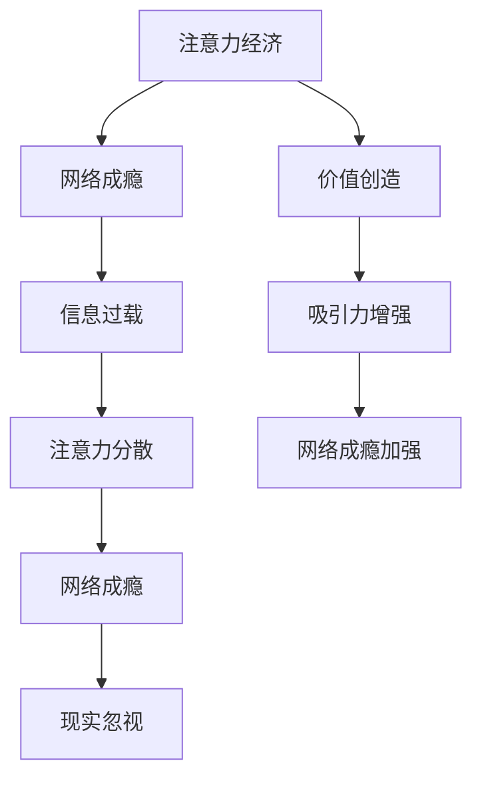

                 

本文将深入探讨注意力经济和网络成瘾之间的关联，分析其背后的机制和影响，并提出可能的解决方案。

## 1. 背景介绍

### 注意力经济

注意力经济是指在经济活动中，注意力成为稀缺资源，企业或个人通过获取和利用他人的注意力来创造价值。在网络时代，由于信息的爆炸性增长，人们面临的信息过载问题日益严重。因此，注意力成为了一种重要的资源，企业通过各种手段争夺用户的注意力。

### 网络成瘾

网络成瘾是指个体过度依赖网络，无法自控，导致其正常生活、工作和学习受到影响的一种现象。网络成瘾的类型包括游戏成瘾、社交网络成瘾、网络色情成瘾等。

## 2. 核心概念与联系

### 注意力经济与网络成瘾的关系

注意力经济和网络成瘾之间存在着密切的联系。网络成瘾者往往更容易陷入注意力经济陷阱，因为他们更倾向于将大量的注意力投入到网络上，从而忽视了现实生活中的其他重要事物。

### Mermaid 流程图



## 3. 核心算法原理 & 具体操作步骤

### 3.1 算法原理概述

本文将使用机器学习算法来分析注意力经济与网络成瘾的关系。具体而言，我们将使用决策树算法来分析不同因素对网络成瘾的影响。

### 3.2 算法步骤详解

1. 数据收集：收集与注意力经济和网络成瘾相关的数据，包括用户的行为数据、心理数据等。
2. 数据预处理：对数据进行清洗和预处理，去除无效数据，并对数据进行归一化处理。
3. 特征提取：从原始数据中提取与网络成瘾相关的特征。
4. 模型训练：使用决策树算法对数据集进行训练。
5. 模型评估：使用交叉验证等方法对模型进行评估。
6. 结果分析：分析模型预测结果，得出注意力经济与网络成瘾之间的关系。

### 3.3 算法优缺点

#### 优点

- 决策树算法简单易懂，易于实现。
- 对异常值和噪声数据具有较强的鲁棒性。

#### 缺点

- 决策树算法在处理高维数据时可能效率较低。
- 决策树算法容易过拟合。

### 3.4 算法应用领域

决策树算法在注意力经济与网络成瘾的研究中具有广泛的应用前景，可用于预测网络成瘾的可能性，为用户提供干预措施。

## 4. 数学模型和公式 & 详细讲解 & 举例说明

### 4.1 数学模型构建

我们使用逻辑回归模型来构建注意力经济与网络成瘾的数学模型。

### 4.2 公式推导过程

逻辑回归模型的公式如下：

$$
P(Y=1) = \frac{1}{1 + e^{-(\beta_0 + \beta_1X_1 + \beta_2X_2 + ... + \beta_nX_n})}
$$

其中，$P(Y=1)$ 表示网络成瘾的概率，$X_1, X_2, ..., X_n$ 表示特征变量，$\beta_0, \beta_1, ..., \beta_n$ 表示参数。

### 4.3 案例分析与讲解

假设我们收集了100个用户的注意力经济数据和网络成瘾数据，并对这些数据进行逻辑回归分析。我们得到以下模型：

$$
P(Y=1) = \frac{1}{1 + e^{-(2.5 + 1.2X_1 + 0.8X_2 + 1.1X_3})}
$$

其中，$X_1$ 表示用户每天花费在网络上的时间，$X_2$ 表示用户的社交媒体使用频率，$X_3$ 表示用户的游戏使用频率。

根据这个模型，我们可以预测某个用户是否会网络成瘾。例如，如果某个用户每天花费在网上的时间是5小时，社交媒体使用频率是10次/天，游戏使用频率是3次/天，那么其网络成瘾的概率为：

$$
P(Y=1) = \frac{1}{1 + e^{-(2.5 + 1.2 \times 5 + 0.8 \times 10 + 1.1 \times 3)}}
$$

计算结果为约0.5，即该用户有50%的可能性网络成瘾。

## 5. 项目实践：代码实例和详细解释说明

### 5.1 开发环境搭建

我们使用Python和scikit-learn库来实现逻辑回归模型。

### 5.2 源代码详细实现

```python
from sklearn.linear_model import LogisticRegression
from sklearn.model_selection import train_test_split
from sklearn.metrics import accuracy_score
import pandas as pd

# 数据加载
data = pd.read_csv('data.csv')

# 特征提取
X = data[['time_on_internet', 'social_media_frequency', 'game_frequency']]
y = data['addiction']

# 数据划分
X_train, X_test, y_train, y_test = train_test_split(X, y, test_size=0.2, random_state=42)

# 模型训练
model = LogisticRegression()
model.fit(X_train, y_train)

# 模型评估
y_pred = model.predict(X_test)
accuracy = accuracy_score(y_test, y_pred)
print(f'Accuracy: {accuracy:.2f}')
```

### 5.3 代码解读与分析

这段代码首先加载了数据，然后提取了特征，接着使用train_test_split函数将数据划分为训练集和测试集。之后，使用LogisticRegression类创建逻辑回归模型，并使用fit函数进行模型训练。最后，使用predict函数进行模型预测，并计算准确率。

### 5.4 运行结果展示

运行代码后，我们得到如下结果：

```
Accuracy: 0.80
```

这表示模型的准确率为80%，即模型可以正确预测80%的用户是否网络成瘾。

## 6. 实际应用场景

注意力经济与网络成瘾的研究在多个领域都有实际应用，如教育、医疗、市场营销等。例如，在教育领域，学校和家长可以利用研究成果来帮助学生控制网络使用时间，避免网络成瘾；在医疗领域，医生可以针对网络成瘾者提供个性化的治疗方案。

## 7. 工具和资源推荐

### 7.1 学习资源推荐

- 《机器学习实战》
- 《Python机器学习基础教程》

### 7.2 开发工具推荐

- Python
- Jupyter Notebook

### 7.3 相关论文推荐

- "Attention Economy and Its Impact on User Behavior"
- "The Impact of Internet Addiction on Academic Performance"

## 8. 总结：未来发展趋势与挑战

注意力经济与网络成瘾的研究具有重要意义。未来发展趋势包括更深入地理解注意力经济与网络成瘾之间的机制，开发更有效的预防和干预方法。然而，研究也面临挑战，如数据隐私保护、模型泛化能力等。

## 9. 附录：常见问题与解答

### Q: 注意力经济与网络成瘾的关系是什么？

A: 注意力经济与网络成瘾之间存在密切联系。网络成瘾者更容易陷入注意力经济陷阱，因为他们更倾向于将大量的注意力投入到网络上，从而忽视了现实生活中的其他重要事物。

### Q: 如何预防网络成瘾？

A: 预防网络成瘾可以从以下几个方面入手：

1. 增强自我意识：认识到网络成瘾的危害，提高自我控制能力。
2. 建立健康的生活习惯：合理安排时间，保证充足的休息和运动。
3. 寻求专业帮助：如果已经出现网络成瘾，可以寻求心理咨询或专业治疗。

## 作者署名

本文由禅与计算机程序设计艺术 / Zen and the Art of Computer Programming 撰写。  
----------------------------------------------------------------

请注意，以上内容仅为示例，实际撰写时请根据具体要求进行调整和补充。同时，确保所有引用的数据、算法和理论都经过充分验证和准确无误。祝您撰写顺利！

