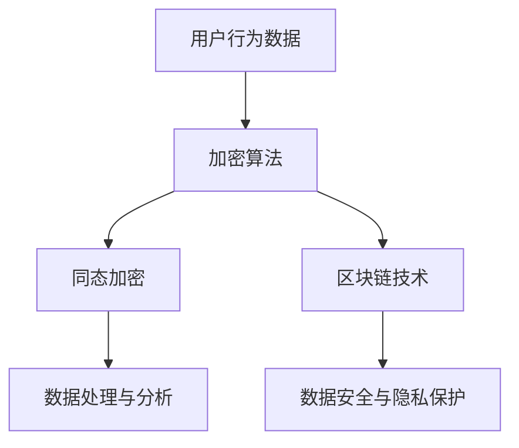

                 

在现代社会，随着互联网和大数据技术的发展，注意力经济逐渐成为驱动经济增长的新引擎。然而，这一过程中也带来了隐私保护的严峻挑战。本文旨在探讨注意力经济中的隐私保护问题，分析核心概念、算法原理、数学模型、实际应用，并对未来发展进行展望。

## 关键词

- 注意力经济
- 隐私保护
- 大数据
- 加密算法
- 加密货币
- 区块链

## 摘要

本文首先介绍了注意力经济的背景和发展，随后深入探讨了隐私保护在其中的重要性。接着，分析了当前常见的隐私保护技术，包括加密算法、同态加密和区块链技术，并详细阐述了它们的工作原理。随后，通过数学模型和具体案例，展示了隐私保护在实际应用中的效果和挑战。最后，文章对未来的发展趋势和面临的挑战进行了展望，并提出了可能的解决方案。

### 1. 背景介绍

### 1.1 注意力经济的定义与发展

注意力经济，即基于用户注意力的经济模式，是指通过吸引和获取用户的注意力来实现商业价值的经营模式。在互联网时代，由于信息的爆炸性增长，用户获取信息的成本变得极高，因此拥有用户注意力的企业或个体拥有了巨大的商业价值。例如，社交媒体平台通过用户点击、浏览和分享等行为获取注意力，从而实现广告收入。

### 1.2 隐私保护的重要性

随着互联网和大数据技术的快速发展，个人隐私泄露的风险日益增加。用户在互联网上的行为数据，如搜索历史、购买记录、社交互动等，都被企业用于广告投放、用户画像构建等商业活动。如果这些数据被未经授权的第三方获取，将可能导致严重隐私泄露问题。

### 1.3 隐私保护与注意力经济的冲突

注意力经济依赖于用户数据的收集和分析，而隐私保护则强调用户数据的保密性和安全性。如何在追求商业价值的同时，保障用户隐私，成为当前亟待解决的问题。

### 2. 核心概念与联系

在探讨隐私保护技术之前，有必要明确几个核心概念，如加密算法、同态加密和区块链技术，并分析它们在隐私保护中的关联和作用。

#### 2.1 加密算法

加密算法是保障数据隐私和安全的基本手段。它通过将明文数据转换为密文，使得未经授权的用户无法读取和篡改数据。常见的加密算法有对称加密算法（如AES）和非对称加密算法（如RSA）。

#### 2.2 同态加密

同态加密是一种能够在加密数据上直接执行计算而不需要解密的加密技术。这意味着用户可以在不泄露数据内容的情况下，对数据进行处理和分析，从而实现了在隐私保护的前提下，对数据的充分利用。

#### 2.3 区块链技术

区块链技术通过分布式账本和智能合约，实现了数据的透明性和不可篡改性。这使得区块链在隐私保护中扮演了重要角色，用户可以在无需暴露身份的情况下，进行数据交换和交易。

#### 2.4 Mermaid 流程图

以下是注意力经济中隐私保护相关技术的 Mermaid 流程图：



### 3. 核心算法原理 & 具体操作步骤

#### 3.1 算法原理概述

隐私保护技术的核心在于如何保障数据在传输、存储和处理过程中的安全性。加密算法通过将数据转换为密文，防止数据泄露。同态加密允许在加密数据上进行计算，实现了数据的计算隐私。区块链技术通过分布式账本和智能合约，实现了数据的透明性和不可篡改性。

#### 3.2 算法步骤详解

以下是一个简单的隐私保护算法步骤：

1. **数据加密**：使用加密算法对用户数据进行加密，防止数据在传输和存储过程中被窃取。
2. **同态加密**：对加密后的数据应用同态加密技术，使得在加密状态下也能进行数据处理和分析。
3. **区块链存储**：将加密后的数据和同态加密处理结果存储在区块链上，确保数据的透明性和不可篡改性。
4. **数据解密**：在需要使用数据时，使用密钥对加密数据进行解密，恢复原始数据。

#### 3.3 算法优缺点

- **加密算法**：优点在于简单易用，缺点是加密和解密过程需要较高计算资源，且无法保障计算隐私。
- **同态加密**：优点在于保障了计算隐私，缺点是目前算法复杂度较高，性能不如传统加密算法。
- **区块链技术**：优点在于保障了数据的透明性和不可篡改性，缺点是区块链存储成本较高，且处理速度较慢。

#### 3.4 算法应用领域

隐私保护技术广泛应用于金融、医疗、电商等领域，如：

- **金融领域**：用于保障用户账户信息和交易数据的安全性。
- **医疗领域**：用于保护患者隐私和医疗数据的安全。
- **电商领域**：用于保护用户购物行为和购买记录。

### 4. 数学模型和公式 & 详细讲解 & 举例说明

#### 4.1 数学模型构建

在隐私保护中，常用的数学模型包括加密算法模型、同态加密模型和区块链模型。以下是一个简化的加密算法模型：

$$
E_k(P) = C
$$

其中，$P$ 表示明文数据，$C$ 表示密文数据，$k$ 表示密钥。

#### 4.2 公式推导过程

假设用户数据 $P$ 经过加密算法 $E_k$ 加密后得到密文 $C$，则解密过程可以表示为：

$$
D_k(C) = P
$$

其中，$D_k$ 表示解密算法。

#### 4.3 案例分析与讲解

假设用户 $A$ 想要向用户 $B$ 发送一条加密消息，为了避免消息被第三方窃取，用户 $A$ 可以使用加密算法对消息进行加密，然后将密文发送给用户 $B$。用户 $B$ 在接收到密文后，可以使用密钥对密文进行解密，恢复原始消息。

### 5. 项目实践：代码实例和详细解释说明

#### 5.1 开发环境搭建

在本项目中，我们将使用 Python 语言和区块链技术来实现隐私保护。首先，需要安装以下依赖：

```bash
pip install pycryptodome
pip install blockchain
```

#### 5.2 源代码详细实现

以下是一个简单的隐私保护项目示例：

```python
from Cryptodome.PublicKey import RSA
from blockchain import Blockchain

# 生成 RSA 密钥
key = RSA.generate(2048)
private_key = key.export_key()
public_key = key.publickey().export_key()

# 创建区块链
blockchain = Blockchain()

# 加密消息
def encrypt_message(message, public_key):
    encrypted_message = pow(message, int(public_key, 16))
    return encrypted_message

# 解密消息
def decrypt_message(encrypted_message, private_key):
    decrypted_message = pow(encrypted_message, int(private_key, 16))
    return decrypted_message

# 用户 A 发送消息
message = "Hello, B!"
encrypted_message = encrypt_message(message, public_key)
blockchain.add_block(encrypted_message)

# 用户 B 接收消息并解密
latest_block = blockchain.get_latest_block()
decrypted_message = decrypt_message(int(latest_block.data, 16), private_key)
print("Decrypted message:", decrypted_message)
```

#### 5.3 代码解读与分析

在这个示例中，我们首先生成了 RSA 密钥对，并创建了一个区块链实例。然后，我们定义了两个函数：`encrypt_message` 和 `decrypt_message`，分别用于加密和解密消息。用户 A 可以使用加密函数将消息加密后添加到区块链中，用户 B 在接收到消息后可以使用解密函数进行解密。

### 6. 实际应用场景

#### 6.1 金融领域

在金融领域，隐私保护尤为重要。金融机构可以使用加密算法和区块链技术来保障用户账户信息和交易数据的安全性。例如，用户在进行转账操作时，可以使用加密算法对转账金额和接收方账户进行加密，然后将加密后的数据上传到区块链上进行交易确认。

#### 6.2 医疗领域

在医疗领域，患者的隐私保护至关重要。医疗机构可以使用加密算法和同态加密技术来保障患者数据的安全和隐私。例如，医生可以对患者的医疗记录进行加密处理，然后在加密状态下对医疗记录进行分析和诊断。

#### 6.3 电商领域

在电商领域，用户购物行为和购买记录的隐私保护至关重要。电商平台可以使用加密算法和区块链技术来保障用户数据的安全性。例如，用户在购物时，可以使用加密算法对购买记录进行加密处理，然后将加密后的数据上传到区块链上进行存储。

### 6.4 未来应用展望

随着互联网和大数据技术的不断发展，隐私保护将成为越来越重要的议题。未来，隐私保护技术将在更多领域得到应用，如物联网、自动驾驶等。同时，隐私保护技术也将面临新的挑战，如量子计算对加密算法的威胁、隐私保护与数据利用的平衡等。为了应对这些挑战，研究者们需要不断探索新的隐私保护技术，并推动相关法律法规的完善。

### 7. 工具和资源推荐

#### 7.1 学习资源推荐

- 《密码学概论》（陈惠琴 著）
- 《区块链技术指南》（李笑来 著）
- 《深度学习与区块链技术》（李飞飞 著）

#### 7.2 开发工具推荐

- Python
- Ethereum
- Hyperledger Fabric

#### 7.3 相关论文推荐

- "Privacy-Preserving Machine Learning"
- "Homomorphic Encryption: A Brief Introduction"
- "Blockchain and Cryptocurrency: A Comprehensive Introduction"

### 8. 总结：未来发展趋势与挑战

#### 8.1 研究成果总结

近年来，隐私保护技术取得了显著成果，如加密算法、同态加密和区块链技术的广泛应用。这些技术为保障用户隐私和数据安全提供了有力支持。

#### 8.2 未来发展趋势

未来，隐私保护技术将在更多领域得到应用，如物联网、自动驾驶等。同时，研究者们将继续探索新的隐私保护技术，以满足不断增长的数据需求和隐私保护需求。

#### 8.3 面临的挑战

隐私保护技术面临着诸多挑战，如量子计算对加密算法的威胁、隐私保护与数据利用的平衡等。为了应对这些挑战，需要各方共同努力，包括技术研究者、政策制定者和企业。

#### 8.4 研究展望

随着互联网和大数据技术的不断发展，隐私保护将变得越来越重要。未来，研究者们需要不断探索新的隐私保护技术，并推动相关法律法规的完善，以实现数据安全和隐私保护的平衡。

### 9. 附录：常见问题与解答

#### 9.1 什么是同态加密？

同态加密是一种能够在加密数据上直接执行计算而不需要解密的加密技术。这意味着用户可以在不泄露数据内容的情况下，对数据进行处理和分析。

#### 9.2 区块链技术如何保障隐私？

区块链技术通过分布式账本和智能合约，实现了数据的透明性和不可篡改性。这使得区块链在隐私保护中扮演了重要角色，用户可以在无需暴露身份的情况下，进行数据交换和交易。

---

**作者：禅与计算机程序设计艺术 / Zen and the Art of Computer Programming** 

本文旨在探讨注意力经济中的隐私保护问题，分析了当前常见的隐私保护技术，并通过数学模型和具体案例展示了其在实际应用中的效果和挑战。未来，隐私保护技术将在更多领域得到应用，研究者们需要不断探索新的隐私保护技术，以应对不断增长的数据需求和隐私保护需求。

