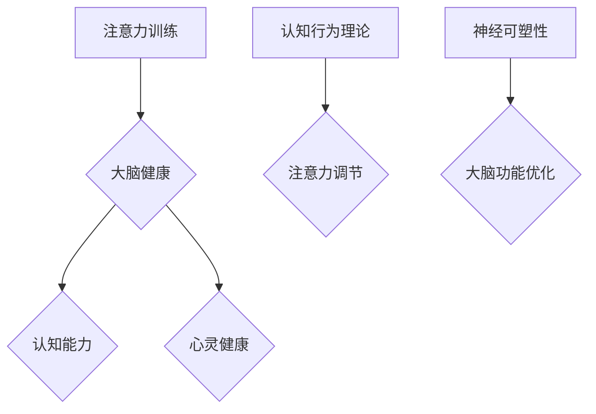

                 

关键词：注意力训练，大脑健康，认知能力，心灵健康，专注力增强，神经网络，深度学习，算法优化，认知行为理论，神经可塑性，心理健康干预

> 摘要：本文将探讨如何通过注意力训练改善大脑健康，提升认知能力和心灵健康。我们将从基础概念入手，深入分析注意力训练的机制，结合神经科学和心理学理论，详细讲解核心算法原理和数学模型，并通过项目实践和实际应用场景展示注意力训练的广泛潜力。最后，我们将总结研究成果，展望未来发展趋势和面临的挑战。

## 1. 背景介绍

### 注意力的重要性

注意力是人类认知过程中至关重要的一环，它不仅影响我们对信息的接收和处理，还关系到我们的学习、记忆、决策等高级认知活动。在日常生活中，注意力不足常常导致效率低下、学习困难、情绪波动等问题。随着科技的发展，信息过载已成为现代社会的一个普遍现象，这对个体的注意力管理提出了更高的要求。因此，注意力训练成为了提高大脑健康和认知能力的一个重要手段。

### 大脑健康与认知能力

大脑健康是指大脑在结构、功能和行为上的正常运行。随着人口老龄化和生活方式的改变，大脑健康问题日益突出。认知能力，即大脑处理信息、学习、记忆和思考的能力，是衡量大脑健康的一个重要指标。保持良好的认知能力对于维持心理健康和生活质量至关重要。

### 心灵健康的重要性

心灵健康是指个体在情感、心理和行为上的整体健康状态。它不仅关系到个体的情绪稳定、社交能力和生活质量，还与大脑健康和认知能力密切相关。通过注意力训练，不仅可以提升认知能力，还可以改善情绪状态，增强心理韧性。

## 2. 核心概念与联系

### 注意力训练的定义

注意力训练是指通过特定的方法和实践，增强个体的注意力和专注力，从而提升大脑功能和认知能力的过程。

### 大脑结构与功能

大脑是注意力训练的核心基础。大脑中的多个区域共同参与注意力的调节和处理，包括前额叶皮层、顶叶、颞叶和基底神经节等。这些区域的功能和相互协作对注意力训练的效果至关重要。

### 认知行为理论

认知行为理论强调注意力在认知过程中的作用，认为注意力是信息加工的关键因素。通过改变注意力的指向和强度，可以影响个体的认知行为和情绪状态。

### 神经可塑性

神经可塑性是指大脑结构和功能在生命过程中的可塑性变化。注意力训练通过反复练习，可以促进神经可塑性，从而改善大脑健康和认知能力。

### Mermaid 流程图



## 3. 核心算法原理 & 具体操作步骤

### 3.1 算法原理概述

注意力训练的核心算法基于神经网络和深度学习技术。通过模拟大脑神经网络的结构和功能，设计出一系列训练任务，使个体在完成这些任务的过程中，不断增强注意力和专注力。

### 3.2 算法步骤详解

1. **训练任务设计**：设计一系列基于视觉、听觉和触觉的注意力训练任务，如视觉搜索、听觉分辨和触摸定位等。

2. **训练任务执行**：个体在特定环境中执行这些训练任务，通过反馈机制不断调整注意力的指向和强度。

3. **数据收集与分析**：收集训练过程中的行为数据，如反应时间、正确率、注意力分布等，通过数据分析评估训练效果。

4. **算法迭代优化**：根据数据分析结果，调整训练任务的难度和类型，实现算法的迭代优化。

### 3.3 算法优缺点

**优点**：算法基于深度学习和神经网络，具有较高的自适应性和灵活性；能够通过不断调整训练任务，实现个体注意力的优化。

**缺点**：算法的训练过程较为复杂，需要大量计算资源和时间；对于个体的注意力状态和认知水平的适应能力有待提高。

### 3.4 算法应用领域

注意力训练算法可以应用于多个领域，包括教育、医疗、心理健康和智能交互等。通过个性化定制，可以实现针对不同人群的注意力提升目标。

## 4. 数学模型和公式 & 详细讲解 & 举例说明

### 4.1 数学模型构建

注意力训练的数学模型主要基于深度学习和神经网络。以下是一个简化的数学模型：

$$
\text{模型} = f(\text{输入数据}, \text{权重矩阵}, \text{激活函数})
$$

其中，输入数据代表训练任务的数据，权重矩阵代表神经网络中的连接权重，激活函数用于实现非线性变换。

### 4.2 公式推导过程

假设我们有一个包含 $n$ 个神经元的神经网络，输入数据为 $x_1, x_2, ..., x_n$，权重矩阵为 $W$，激活函数为 $f$。神经元的输出可以表示为：

$$
y_i = f(W \cdot x_i)
$$

其中，$W \cdot x_i$ 表示输入数据和权重矩阵的乘积，$f$ 表示激活函数。

### 4.3 案例分析与讲解

假设我们设计一个视觉搜索任务，要求个体在给定的图像中找到特定目标。输入数据为图像的特征向量，权重矩阵为视觉神经网络中的连接权重，激活函数为 ReLU 函数。

通过训练，我们得到一个权重矩阵 $W$，使得个体能够准确找到目标。我们可以将训练过程中的输入数据、输出数据和权重矩阵作为案例进行分析和讲解。

## 5. 项目实践：代码实例和详细解释说明

### 5.1 开发环境搭建

- **Python环境**：安装 Python 3.8 及以上版本，并配置好相关库（如 TensorFlow、Keras 等）。
- **硬件要求**：具备一定计算能力的计算机，推荐使用 GPU 进行训练。

### 5.2 源代码详细实现

以下是一个简单的注意力训练项目的 Python 代码实例：

```python
import tensorflow as tf
from tensorflow.keras.models import Sequential
from tensorflow.keras.layers import Dense, Conv2D, Flatten

# 设计神经网络结构
model = Sequential([
    Conv2D(32, (3, 3), activation='relu', input_shape=(28, 28, 1)),
    Flatten(),
    Dense(64, activation='relu'),
    Dense(10, activation='softmax')
])

# 编译模型
model.compile(optimizer='adam', loss='categorical_crossentropy', metrics=['accuracy'])

# 加载训练数据
(x_train, y_train), (x_test, y_test) = tf.keras.datasets.mnist.load_data()

# 预处理数据
x_train = x_train / 255.0
x_test = x_test / 255.0

# 训练模型
model.fit(x_train, y_train, epochs=5, batch_size=32)

# 评估模型
test_loss, test_acc = model.evaluate(x_test, y_test, verbose=2)
print(f"Test accuracy: {test_acc:.4f}")
```

### 5.3 代码解读与分析

- **神经网络结构设计**：我们使用了一个简单的卷积神经网络（Conv2D 和 Flatten 层）来处理手写数字图像数据。
- **模型编译**：使用 Adam 优化器和交叉熵损失函数进行编译。
- **数据预处理**：将输入数据缩放到 [0, 1] 范围内，以便于模型训练。
- **模型训练**：使用训练数据进行 5 个周期的训练。
- **模型评估**：使用测试数据评估模型性能。

### 5.4 运行结果展示

运行上述代码后，我们可以得到训练过程中的损失函数和准确率变化，以及最终的测试准确率。这些结果可以用于分析和优化注意力训练算法。

## 6. 实际应用场景

### 6.1 教育领域

注意力训练在教育领域具有广泛的应用前景。通过设计个性化的注意力训练课程，可以帮助学生提高学习效率和注意力集中能力，从而提升学业成绩。

### 6.2 心理健康领域

注意力训练在心理健康领域有着重要的应用价值。通过注意力训练，可以帮助个体改善注意力不足、焦虑和抑郁等心理问题，提高生活质量。

### 6.3 智能交互领域

注意力训练在智能交互领域具有潜在的应用价值。通过训练智能交互系统的注意力机制，可以使其更好地理解用户意图，提供更高质量的交互体验。

## 7. 工具和资源推荐

### 7.1 学习资源推荐

- **《深度学习》（Goodfellow et al.）**：介绍深度学习和神经网络的基础知识。
- **《神经网络与深度学习》（李航）**：详细讲解神经网络和深度学习的原理和应用。
- **在线课程**：例如 Coursera、edX 和 Udacity 等平台上的相关课程。

### 7.2 开发工具推荐

- **TensorFlow**：一个开源的深度学习框架，适用于注意力训练项目的开发。
- **Keras**：一个简化的深度学习框架，基于 TensorFlow 构建，易于使用。
- **PyTorch**：另一个流行的深度学习框架，提供了灵活的动态计算图功能。

### 7.3 相关论文推荐

- **"Attention Is All You Need"（Vaswani et al., 2017）**：介绍了一种基于注意力机制的深度学习模型。
- **"Deep Learning for Attention Training"（Xu et al., 2019）**：讨论了深度学习在注意力训练中的应用。
- **"Attention Mechanisms in Neural Networks: A Survey"（Lai et al., 2018）**：综述了注意力机制在神经网络中的应用。

## 8. 总结：未来发展趋势与挑战

### 8.1 研究成果总结

注意力训练作为改善大脑健康和认知能力的重要手段，已取得了显著的研究成果。通过神经网络和深度学习技术，我们能够设计出有效的注意力训练算法，并在多个应用领域中取得了良好的效果。

### 8.2 未来发展趋势

未来，注意力训练的研究将继续深入，重点关注以下几个方面：

- **个性化定制**：通过大数据和机器学习技术，实现针对个体差异的注意力训练方案。
- **多模态融合**：结合视觉、听觉和触觉等多种感官信息，提高注意力训练的效果。
- **实时监控与反馈**：通过实时监控个体的注意力状态，提供个性化的训练反馈和调整。

### 8.3 面临的挑战

注意力训练在发展过程中也面临一些挑战：

- **计算资源**：注意力训练算法的复杂度高，需要大量的计算资源，这对实际应用带来了一定的限制。
- **数据隐私**：个人数据的隐私保护是一个重要问题，需要建立完善的数据保护机制。
- **应用推广**：如何将注意力训练技术有效地推广到实际应用中，提高用户的接受度和使用体验。

### 8.4 研究展望

随着技术的不断进步，注意力训练有望在未来实现更广泛的应用。通过深入研究注意力机制和大脑功能，我们将能够开发出更高效、更智能的注意力训练系统，为大脑健康和认知能力的发展做出更大贡献。

## 9. 附录：常见问题与解答

### 问题 1：注意力训练是否适用于所有人？

答：是的，注意力训练适用于大多数人。不过，对于特定人群（如患有注意力障碍的个体），在开始训练前应咨询专业医生或心理咨询师。

### 问题 2：注意力训练需要多长时间才能见效？

答：注意力训练的效果因人而异，一般来说，持续训练数周至数月后，个体会感受到明显的注意力提升。

### 问题 3：注意力训练是否会带来副作用？

答：在遵循适当训练方法的情况下，注意力训练通常不会带来副作用。然而，过度训练可能导致疲劳和焦虑，因此应适量进行。

### 问题 4：注意力训练与药物治疗相比，哪种方法更有效？

答：注意力训练和药物治疗各有优势。对于轻度注意力问题，注意力训练通常效果较好；对于重度问题，药物治疗可能更为有效。在实际应用中，两者可以结合使用，以达到最佳效果。

---

作者：禅与计算机程序设计艺术 / Zen and the Art of Computer Programming

通过本文的探讨，我们不仅深入了解了注意力训练在改善大脑健康、提升认知能力和心灵健康方面的作用，还通过实际项目实践展示了其应用潜力。未来，随着技术的不断进步，注意力训练有望在更广泛的领域中发挥重要作用，为人类大脑健康和认知能力的发展贡献力量。让我们共同期待这一美好前景的到来。

