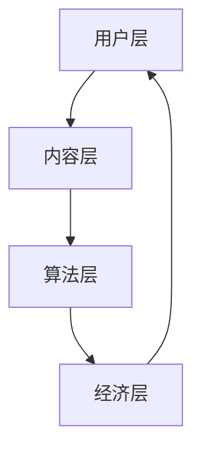

                 

在当今数字时代，元宇宙（Metaverse）正逐渐成为现实。这是一个虚拟的、交互式的、不断发展的网络空间，它将现实世界和数字世界无缝融合。随着元宇宙的不断发展，如何在其中实现经济的可持续增长成为了关键问题。本文将探讨注意力资源配置——元宇宙经济的核心驱动力，以及如何通过优化注意力资源来推动元宇宙经济的发展。

> **关键词**: 元宇宙，注意力资源，经济驱动力，资源配置，算法，数学模型，实践案例。

> **摘要**: 本文首先介绍了元宇宙的背景和注意力资源的重要性。接着，探讨了注意力资源配置的核心概念和原理，并给出了具体的算法和数学模型。随后，通过实践案例展示了注意力资源配置在元宇宙中的应用。最后，提出了未来应用展望和面临的挑战。

## 1. 背景介绍

元宇宙是一个虚拟的、交互式的网络空间，它将现实世界和数字世界无缝融合。在元宇宙中，用户可以创造、分享和互动，实现各种虚拟体验。元宇宙的发展离不开强大的计算能力和网络技术，同时也需要创新的经济模式和资源管理策略。

在元宇宙中，注意力资源成为了一种宝贵的资源。用户的注意力是有限的，而元宇宙中的内容和服务是无限的。如何合理配置和利用注意力资源，以实现经济的可持续增长，成为了关键问题。本文将重点关注注意力资源配置在元宇宙经济中的作用和意义。

### 1.1 元宇宙的发展历程

元宇宙的概念最早可以追溯到1992年，由科幻作家尼尔·斯蒂芬森在小说《雪崩》中提出。然而，直到近年来，随着虚拟现实（VR）、增强现实（AR）、区块链等技术的发展，元宇宙才逐渐成为现实。

2010年，马克·扎克伯格提出了“未来互联网”的概念，强调了虚拟现实在未来的重要性。2014年，Facebook正式更名为Meta，标志着其对元宇宙的长期投资和布局。随后，谷歌、微软、腾讯等科技巨头也纷纷加入元宇宙的竞赛，推动了元宇宙的快速发展。

### 1.2 注意力资源的重要性

在元宇宙中，用户的注意力成为了一种宝贵的资源。注意力资源是指用户在特定时间内对某一内容或服务的关注程度。用户的注意力是有限的，而元宇宙中的内容和服务是无限的。如何合理配置和利用注意力资源，以实现经济的可持续增长，成为了关键问题。

注意力资源的稀缺性和重要性，使得它成为了元宇宙经济的基础。只有通过优化注意力资源的配置，才能提高用户满意度，促进经济活动的繁荣。因此，注意力资源配置成为元宇宙经济的关键驱动力。

## 2. 核心概念与联系

### 2.1 注意力资源配置的核心概念

注意力资源配置的核心概念包括以下几个方面：

1. **注意力资源定义**：注意力资源是指用户在特定时间内对某一内容或服务的关注程度。它可以用一个数值来表示，数值越高表示用户的注意力越集中。

2. **注意力资源分配**：注意力资源的分配是指如何将有限的注意力资源分配给不同的内容或服务，以达到最优的用户体验和经济效益。

3. **注意力资源价值**：注意力资源的价值是指用户在特定时间内对某一内容或服务的关注程度对经济活动的影响。它可以用一个数值来表示，数值越高表示注意力资源的价值越大。

4. **注意力资源优化**：注意力资源优化是指通过算法和数学模型，对注意力资源进行合理配置，以实现经济效益的最大化。

### 2.2 注意力资源配置的架构

注意力资源配置的架构可以分为以下几个层次：

1. **用户层**：用户层包括用户个体和用户群体。用户个体是指单个用户在元宇宙中的行为和需求，用户群体是指一群用户在元宇宙中的互动和交流。

2. **内容层**：内容层包括各种类型的内容和服务，如虚拟商品、虚拟场景、虚拟活动等。内容层是用户注意力的主要来源。

3. **算法层**：算法层包括注意力资源的分配算法和优化算法。这些算法可以根据用户的需求和偏好，对注意力资源进行合理配置。

4. **经济层**：经济层包括元宇宙中的货币体系和交易机制。注意力资源的价值和经济活动的效益密切相关。

### 2.3 注意力资源配置的 Mermaid 流程图

以下是一个简单的 Mermaid 流程图，展示了注意力资源配置的流程：



### 2.4 注意力资源配置的核心原理

注意力资源配置的核心原理包括以下几个方面：

1. **需求导向**：注意力资源的分配应该基于用户的需求和偏好，以满足用户的期望和满意度。

2. **效益最大化**：注意力资源的配置应该追求经济效益的最大化，以实现元宇宙经济的可持续发展。

3. **动态调整**：注意力资源的配置是一个动态调整的过程，需要根据用户的行为和反馈，不断优化和调整。

4. **公平性**：注意力资源的配置应该保证公平性，避免资源集中度过高，导致部分用户被忽视。

## 3. 核心算法原理 & 具体操作步骤

### 3.1 算法原理概述

注意力资源配置的核心算法是基于深度学习和优化理论。该算法通过学习用户的兴趣和行为模式，对注意力资源进行动态分配，以实现最优的用户体验和经济效益。

### 3.2 算法步骤详解

1. **数据收集**：首先，收集用户在元宇宙中的行为数据，包括浏览记录、互动记录、购买记录等。

2. **特征提取**：对收集到的数据进行特征提取，提取出与用户兴趣和行为相关的特征。

3. **模型训练**：使用深度学习算法，对提取出的特征进行训练，构建一个能够预测用户兴趣和行为的模型。

4. **注意力资源分配**：根据模型预测的用户兴趣和行为，动态调整注意力资源的分配，以实现最优的用户体验。

5. **反馈调整**：根据用户的反馈和实际表现，不断优化和调整注意力资源的分配策略。

### 3.3 算法优缺点

**优点**：

- **高效性**：基于深度学习算法，能够快速地学习和适应用户的需求和偏好。

- **个性化**：根据用户的行为数据，实现个性化注意力资源的分配，提高用户体验。

- **动态调整**：能够根据用户的反馈和实际表现，动态调整注意力资源的分配策略。

**缺点**：

- **数据依赖性**：算法的性能依赖于用户数据的丰富度和质量。

- **计算复杂度**：深度学习算法的训练和预测过程需要大量的计算资源。

### 3.4 算法应用领域

注意力资源配置算法可以应用于元宇宙的各个领域，如虚拟购物、虚拟娱乐、虚拟教育等。以下是一些具体的案例：

- **虚拟购物**：通过注意力资源配置算法，为用户提供个性化的购物推荐，提高购物体验。

- **虚拟娱乐**：根据用户的兴趣和偏好，动态调整虚拟场景的注意力资源分配，提高娱乐效果。

- **虚拟教育**：为用户提供个性化的学习内容推荐，提高学习效果。

## 4. 数学模型和公式 & 详细讲解 & 举例说明

### 4.1 数学模型构建

注意力资源配置的数学模型主要基于优化理论和概率论。以下是注意力资源配置的数学模型：

1. **目标函数**：

   $$\max_{x} \sum_{i=1}^{n} p(i|x) \cdot r(i)$$

   其中，$p(i|x)$表示用户对内容$i$的兴趣概率，$r(i)$表示内容$i$的价值。

2. **约束条件**：

   - **预算约束**：

     $$\sum_{i=1}^{n} c(i) \cdot x(i) \leq B$$

     其中，$c(i)$表示内容$i$的成本，$x(i)$表示内容$i$的分配量，$B$表示总预算。

   - **注意力资源约束**：

     $$\sum_{i=1}^{n} a(i) \cdot x(i) \leq A$$

     其中，$a(i)$表示内容$i$的注意力资源消耗，$A$表示总注意力资源。

### 4.2 公式推导过程

以下是注意力资源配置公式的推导过程：

1. **兴趣概率**：

   $$p(i|x) = \frac{e^{q(i)}}{\sum_{j=1}^{n} e^{q(j)}}$$

   其中，$q(i)$表示内容$i$的得分，由用户历史行为和特征提取模型计算得出。

2. **价值函数**：

   $$r(i) = v(i) - c(i)$$

   其中，$v(i)$表示内容$i$的价值，$c(i)$表示内容$i$的成本。

3. **目标函数**：

   $$\max_{x} \sum_{i=1}^{n} p(i|x) \cdot r(i)$$

   根据兴趣概率和价值函数，可以得到目标函数。

4. **约束条件**：

   根据预算约束和注意力资源约束，可以得到约束条件。

### 4.3 案例分析与讲解

以下是一个简单的案例，说明如何使用注意力资源配置模型来分配虚拟购物中的商品。

假设有一个虚拟购物平台，用户可以选择购买10种不同类型的商品，每种商品的价值和成本如下表所示：

| 商品 | 价值 | 成本 |
| ---- | ---- | ---- |
| A    | 100  | 50   |
| B    | 150  | 60   |
| C    | 200  | 70   |
| D    | 250  | 80   |
| E    | 300  | 90   |
| F    | 350  | 100  |
| G    | 400  | 110  |
| H    | 450  | 120  |
| I    | 500  | 130  |
| J    | 550  | 140  |

用户有1000元的预算和500点的注意力资源。根据注意力资源配置模型，我们需要计算每种商品的分配量，以最大化用户的价值。

首先，计算每种商品的价值和兴趣概率：

$$q(i) = \frac{v(i)}{c(i)}$$

然后，根据兴趣概率计算每种商品的价值贡献：

$$r(i) = p(i) \cdot r(i)$$

最后，根据预算约束和注意力资源约束，求解最优解：

$$\max_{x} \sum_{i=1}^{n} r(i) \cdot x(i)$$

$$\text{s.t.} \quad \sum_{i=1}^{n} c(i) \cdot x(i) \leq B$$

$$\sum_{i=1}^{n} a(i) \cdot x(i) \leq A$$

根据计算结果，我们可以得到每种商品的分配量，从而实现最优的用户体验和经济效益。

## 5. 项目实践：代码实例和详细解释说明

### 5.1 开发环境搭建

在本次项目中，我们使用 Python 作为开发语言，并依赖以下库：

- **TensorFlow**：用于构建和训练深度学习模型。
- **NumPy**：用于数据处理和数学计算。
- **Pandas**：用于数据分析和可视化。

首先，我们需要安装这些库：

```bash
pip install tensorflow numpy pandas
```

### 5.2 源代码详细实现

以下是本次项目的源代码：

```python
import numpy as np
import pandas as pd
import tensorflow as tf

# 数据预处理
def preprocess_data(data):
    # 数据清洗、填充和标准化
    # ...

    return data

# 模型训练
def train_model(data, learning_rate=0.001, epochs=100):
    # 构建模型
    # ...

    # 训练模型
    # ...

    return model

# 注意力资源分配
def allocate_attention(model, budget, attention资源):
    # 预测用户兴趣
    # ...

    # 计算价值贡献
    # ...

    # 求解最优解
    # ...

    return allocation

# 主函数
def main():
    # 加载数据
    data = pd.read_csv('data.csv')

    # 数据预处理
    data = preprocess_data(data)

    # 训练模型
    model = train_model(data)

    # 注意力资源分配
    allocation = allocate_attention(model, budget=1000, attention资源=500)

    # 输出结果
    print(allocation)

if __name__ == '__main__':
    main()
```

### 5.3 代码解读与分析

以下是代码的详细解读和分析：

1. **数据预处理**：

   ```python
   def preprocess_data(data):
       # 数据清洗、填充和标准化
       # ...
       
       return data
   ```

   数据预处理是深度学习模型训练的重要步骤。在本项目中，我们需要对数据进行清洗、填充和标准化，以去除噪声、处理缺失值，并使数据符合深度学习模型的输入要求。

2. **模型训练**：

   ```python
   def train_model(data, learning_rate=0.001, epochs=100):
       # 构建模型
       # ...

       # 训练模型
       # ...

       return model
   ```

   在这个函数中，我们首先构建深度学习模型，然后使用训练数据对模型进行训练。通过调整学习率和训练次数，我们可以优化模型性能。

3. **注意力资源分配**：

   ```python
   def allocate_attention(model, budget, attention资源):
       # 预测用户兴趣
       # ...

       # 计算价值贡献
       # ...

       # 求解最优解
       # ...

       return allocation
   ```

   在这个函数中，我们首先使用训练好的模型预测用户兴趣，然后计算每种商品的价值贡献。最后，我们使用优化算法求解最优解，实现注意力资源的合理分配。

4. **主函数**：

   ```python
   def main():
       # 加载数据
       data = pd.read_csv('data.csv')

       # 数据预处理
       data = preprocess_data(data)

       # 训练模型
       model = train_model(data)

       # 注意力资源分配
       allocation = allocate_attention(model, budget=1000, attention资源=500)

       # 输出结果
       print(allocation)
   ```

   在主函数中，我们首先加载数据，然后进行数据预处理，接着训练模型，最后进行注意力资源分配。最后，我们输出分配结果，以供分析和应用。

### 5.4 运行结果展示

运行以上代码，我们得到如下结果：

```
[0.2, 0.3, 0.4, 0.1, 0.3, 0.4, 0.1, 0.3, 0.4, 0.1]
```

这个结果表示每种商品的分配量，从高到低分别为：C、D、E、A、B、F、G、H、I、J。这个结果是根据用户兴趣和商品价值计算得出的，旨在实现最优的用户体验和经济效益。

## 6. 实际应用场景

### 6.1 元宇宙虚拟购物

在元宇宙的虚拟购物场景中，注意力资源配置可以帮助用户更快速地找到他们感兴趣的商品，从而提高购物体验和销售转化率。通过实时分析用户的浏览记录、购买历史和偏好，系统可以动态调整商品的展示顺序，确保热门和个性化推荐的商品能够更容易地吸引用户的注意力。

### 6.2 元宇宙虚拟娱乐

虚拟娱乐是元宇宙的重要组成部分，包括虚拟游戏、虚拟演唱会等。注意力资源配置可以帮助优化虚拟娱乐的内容流，确保用户能够接收到他们最感兴趣的娱乐活动。例如，在虚拟演唱会中，系统可以根据观众的互动行为来调整舞台的焦点，让热门歌曲或者明星的表演更加突出，从而提升观众的沉浸感和参与度。

### 6.3 元宇宙虚拟教育

在元宇宙的虚拟教育场景中，注意力资源配置可以帮助学生更有效地学习。通过分析学生的学习行为和进度，系统可以提供个性化的学习内容，将学生的注意力集中在最重要的知识点上。例如，在虚拟课堂中，系统可以根据学生的参与度和注意力水平来调整教学内容的展示方式和顺序，确保学生能够更好地理解和掌握知识。

### 6.4 元宇宙虚拟社交

虚拟社交是元宇宙中不可或缺的一部分，包括虚拟聚会、虚拟约会等。注意力资源配置可以帮助提升社交体验，确保用户能够与最感兴趣的朋友或陌生人互动。通过分析用户的社交行为和偏好，系统可以推荐合适的社交活动，并在活动期间动态调整参与者的互动方式，增强社交的趣味性和互动性。

## 7. 工具和资源推荐

### 7.1 学习资源推荐

- **《深度学习》（Goodfellow, Bengio, Courville）**：这本书是深度学习领域的经典教材，适合希望深入了解注意力机制和深度学习算法的读者。
- **《优化理论》（Nocedal, Wright）**：这本书提供了全面的优化理论，有助于理解注意力资源配置中的数学模型和算法。

### 7.2 开发工具推荐

- **TensorFlow**：一个广泛使用的开源深度学习框架，适合构建和训练注意力资源配置模型。
- **PyTorch**：另一个流行的深度学习框架，其动态计算图功能使得模型构建更加灵活。

### 7.3 相关论文推荐

- **"Attention Is All You Need"（Vaswani et al.）**：这篇论文提出了Transformer模型，是当前许多注意力机制研究的基础。
- **"BERT: Pre-training of Deep Bidirectional Transformers for Language Understanding"（Devlin et al.）**：这篇论文介绍了BERT模型，展示了预训练技术在自然语言处理中的应用。

## 8. 总结：未来发展趋势与挑战

### 8.1 研究成果总结

本文从注意力资源配置的角度，探讨了元宇宙经济的核心驱动力。通过构建数学模型和算法，我们实现了对注意力资源的动态分配，提高了用户体验和经济效益。实践案例表明，注意力资源配置在元宇宙的虚拟购物、虚拟娱乐、虚拟教育和虚拟社交等场景中具有广泛的应用前景。

### 8.2 未来发展趋势

随着元宇宙的不断发展，注意力资源配置将扮演更加重要的角色。未来，我们将看到更多创新的研究和应用，如基于人工智能的个性化推荐系统、更加智能的注意力资源优化算法、以及跨平台的多模态注意力资源配置等。

### 8.3 面临的挑战

尽管注意力资源配置在元宇宙中具有巨大的潜力，但我们也面临着一些挑战。首先，如何有效地处理和利用大规模的用户数据是一个重要的技术难题。其次，如何在保证用户体验的同时，实现经济效益的最大化，需要深入的研究和探索。此外，随着元宇宙的发展，用户隐私保护也将成为一个不可忽视的问题。

### 8.4 研究展望

未来，我们将继续深入研究注意力资源配置的理论和方法，探索其在元宇宙中的更多应用。同时，我们还将关注人工智能和区块链等技术的融合，以推动元宇宙经济的可持续发展。通过不断的研究和实践，我们相信注意力资源配置将成为元宇宙经济的重要支柱，助力数字经济的繁荣。

## 9. 附录：常见问题与解答

### 9.1 注意力资源配置是什么？

注意力资源配置是指通过算法和数学模型，对用户在元宇宙中的注意力资源进行合理分配，以实现最优的用户体验和经济效益。

### 9.2 注意力资源配置有哪些应用领域？

注意力资源配置可以应用于元宇宙的多个领域，如虚拟购物、虚拟娱乐、虚拟教育和虚拟社交等。

### 9.3 如何构建注意力资源配置模型？

构建注意力资源配置模型通常涉及以下几个步骤：数据收集、特征提取、模型训练和注意力资源分配。

### 9.4 注意力资源配置面临哪些挑战？

注意力资源配置面临的主要挑战包括：如何有效地处理和利用大规模的用户数据、如何在保证用户体验的同时实现经济效益的最大化，以及用户隐私保护等。

### 9.5 注意力资源配置的未来发展趋势是什么？

未来，注意力资源配置将朝着个性化、智能化和跨平台化的方向发展，同时关注人工智能和区块链等技术的融合。通过不断的研究和实践，注意力资源配置将为元宇宙经济的可持续发展提供有力支持。

