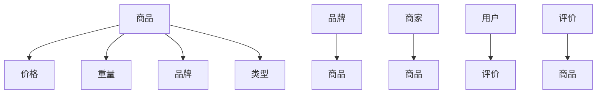

                 

在电子商务的快速发展中，如何构建一个高效、准确的商品知识图谱成为了电商平台的核心竞争力。本文将探讨商品知识图谱的构建与应用，旨在为电商平台提供一种有效的信息组织和处理方式，以提高用户体验和运营效率。

> 关键词：电商平台，商品知识图谱，知识表示，信息检索，智能推荐

> 摘要：本文首先介绍了电商平台中商品知识图谱的背景和重要性，然后详细阐述了商品知识图谱的核心概念与联系，包括实体、属性和关系。接着，本文重点介绍了商品知识图谱构建的核心算法原理和具体操作步骤，并分析了算法的优缺点和应用领域。随后，本文通过数学模型和公式详细讲解了商品知识图谱的构建过程，并通过项目实践展示了具体的代码实现和运行结果。最后，本文讨论了商品知识图谱在实际应用场景中的价值和未来应用展望。

## 1. 背景介绍

随着互联网的普及和电子商务的快速发展，电商平台已经成为人们日常购物的重要渠道。然而，随着商品种类的增多和用户需求的多样化，如何高效地管理和推荐商品成为了电商平台面临的重大挑战。传统的基于关键词搜索和文本匹配的方法已经难以满足用户的需求，而商品知识图谱作为一种新型的信息组织方式，能够为电商平台提供更加智能和个性化的服务。

商品知识图谱是一种基于实体-关系-属性（Entity-Relationship-Attribute，简称E-R）模型的知识表示方法，通过将商品信息以图谱的形式进行组织，使得信息之间的关联更加清晰和直观。商品知识图谱的构建不仅能够提高信息检索的效率，还可以为智能推荐、用户画像、商品关联分析等应用提供强有力的支持。

在电商平台上，商品知识图谱的应用场景非常广泛。例如，通过商品知识图谱可以实现对商品的智能推荐，提高用户的购物体验；通过分析商品之间的关联关系，可以为商家提供精准的营销策略；通过构建用户画像，可以提供个性化的购物建议和服务。因此，构建一个高效、准确的商品知识图谱对于电商平台的发展具有重要意义。

## 2. 核心概念与联系

### 2.1 实体 (Entity)

实体是商品知识图谱中最基本的元素，代表了电商平台上的各种对象，如商品、用户、品牌、商家等。实体具有唯一性和独立性，是知识图谱中的核心节点。

### 2.2 属性 (Attribute)

属性是实体的特征描述，用于补充实体的信息。例如，对于商品实体，属性可以包括价格、重量、品牌、类型等。属性可以看作是实体节点的标签，为实体提供更多的上下文信息。

### 2.3 关系 (Relationship)

关系描述了实体之间的关联，是知识图谱中的边。关系通常由两个实体组成，并附带一个类型来表示关联的性质。例如，商品实体之间可以存在“属于”关系（品牌与商品）、“销售”关系（商家与商品）、“评价”关系（用户与商品）等。

### 2.4 Mermaid 流程图

为了更直观地展示商品知识图谱的核心概念与联系，我们可以使用Mermaid流程图来表示。



在这个流程图中，我们可以看到商品实体与多个属性节点相连，表示商品的各种特征；同时，商品实体与其他实体节点通过关系边相连，建立了丰富的关联关系。

## 3. 核心算法原理 & 具体操作步骤

### 3.1 算法原理概述

商品知识图谱的构建主要包括数据采集、数据预处理、实体关系抽取和知识图谱构建四个步骤。其中，数据采集和预处理是基础，实体关系抽取是关键，知识图谱构建是目标。

- 数据采集：从电商平台的各种数据源（如商品页面、用户评价、商家信息等）中收集原始数据。
- 数据预处理：对原始数据进行清洗、去重、标准化等处理，使其符合知识图谱构建的要求。
- 实体关系抽取：利用自然语言处理和机器学习技术，从预处理后的数据中抽取实体和关系。
- 知识图谱构建：将抽取出的实体和关系组织成知识图谱，并进行存储和管理。

### 3.2 算法步骤详解

#### 3.2.1 数据采集

数据采集是商品知识图谱构建的第一步，其目标是收集电商平台上的各种数据。常用的数据源包括：

- 商品页面：通过爬虫技术从电商平台上抓取商品页面，获取商品的各种信息。
- 用户评价：从电商平台上的用户评价中获取用户的购物体验和评价信息。
- 商家信息：从电商平台上获取商家的基本信息，如店铺名称、联系方式等。

#### 3.2.2 数据预处理

数据预处理主要包括以下几个步骤：

- 数据清洗：去除数据中的噪声和错误，如缺失值、重复值等。
- 去重：对重复的数据进行去重处理，保证数据的唯一性。
- 标准化：对数据进行统一格式和编码，如将商品名称统一转换为小写、去除特殊字符等。

#### 3.2.3 实体关系抽取

实体关系抽取是商品知识图谱构建的关键步骤，其目标是自动地从原始数据中识别出实体和关系。常用的技术包括：

- 实体识别：利用自然语言处理技术，从文本中识别出实体，如商品、用户、品牌等。
- 关系抽取：利用规则匹配、实体匹配、依存关系分析等技术，从文本中抽取实体之间的关系，如“属于”关系、 “销售”关系等。

#### 3.2.4 知识图谱构建

知识图谱构建是将抽取出的实体和关系组织成知识图谱的过程。常用的工具包括：

-Neo4j：一款流行的图数据库，支持高效的图存储和查询。
- DGL（Deep Graph Library）：一款深度学习图处理库，支持端到端的图神经网络模型。
- KG2Vec：一款基于向量表示的知识图谱构建工具，可以将知识图谱转化为向量表示，便于后续的图分析。

### 3.3 算法优缺点

#### 优点：

- 高效：商品知识图谱能够高效地组织和管理海量商品信息，提高信息检索和处理的效率。
- 智能化：通过实体关系抽取和知识图谱构建，可以为电商平台提供智能化的推荐和服务。
- 灵活：知识图谱能够灵活地扩展和更新，适应电商平台的发展需求。

#### 缺点：

- 复杂：商品知识图谱的构建涉及到多个技术和步骤，实现较为复杂。
- 数据质量：数据质量直接影响知识图谱的质量，数据清洗和预处理需要大量的人工干预。

### 3.4 算法应用领域

商品知识图谱的应用领域非常广泛，主要包括：

- 智能推荐：基于商品知识图谱，可以为用户推荐与其兴趣相关的商品。
- 用户画像：通过分析商品知识图谱中的关系，可以为用户提供个性化的购物建议和服务。
- 商品关联分析：通过分析商品之间的关联关系，可以为商家提供精准的营销策略。
- 数据挖掘：基于商品知识图谱，可以挖掘出更多潜在的商业价值。

## 4. 数学模型和公式 & 详细讲解 & 举例说明

### 4.1 数学模型构建

商品知识图谱的构建涉及到多个数学模型，主要包括：

#### 4.1.1 实体识别模型

实体识别模型是一种分类模型，用于从文本中识别出实体。常用的模型包括：

- 朴素贝叶斯分类器：基于概率模型，通过计算文本中各种特征的组合概率来识别实体。
- 支持向量机（SVM）：通过最大化分类间隔来识别实体。
- 随机森林：通过构建多棵决策树，并通过投票的方式来识别实体。

#### 4.1.2 关系抽取模型

关系抽取模型是一种序列标注模型，用于从文本中抽取实体之间的关系。常用的模型包括：

- 条件随机场（CRF）：通过最大化条件概率来抽取关系。
- 长短时记忆网络（LSTM）：通过记忆文本序列的上下文信息来抽取关系。
- 递归神经网络（RNN）：通过递归地更新隐藏状态来抽取关系。

#### 4.1.3 知识图谱构建模型

知识图谱构建模型是一种图神经网络模型，用于将抽取出的实体和关系组织成知识图谱。常用的模型包括：

- 图卷积网络（GCN）：通过在图上进行卷积操作来更新实体和关系的特征。
- 图注意力网络（GAT）：通过学习实体和关系之间的注意力机制来更新特征。
- 图循环网络（GRN）：通过在图上进行循环操作来更新实体和关系的特征。

### 4.2 公式推导过程

为了更好地理解上述数学模型，我们分别对它们进行简要的公式推导。

#### 4.2.1 朴素贝叶斯分类器

假设我们有训练数据集D，其中包含n个样本，每个样本由特征向量x和标签y组成。朴素贝叶斯分类器的目标是预测新样本x'的标签y'。

公式推导如下：

$$P(y' = c_j| x') = \frac{P(x'| y' = c_j)P(y' = c_j)}{P(x')}$$

其中，$P(y' = c_j)$表示标签为c_j的概率，$P(x'| y' = c_j)$表示在标签为c_j的情况下特征x'的概率，$P(x')$表示特征x'的概率。

通过贝叶斯定理，我们可以将上述公式转化为：

$$P(y' = c_j| x') = \frac{P(y' = c_j)}{P(x')} \prod_{i=1}^{m} P(x_i'| y' = c_j)$$

其中，m表示特征的数量。

#### 4.2.2 支持向量机（SVM）

假设我们有训练数据集D，其中包含n个样本，每个样本由特征向量x和标签y组成。支持向量机的目标是找到一个超平面，将具有不同标签的样本最大化地分开。

公式推导如下：

$$\min_{\mathbf{w}, b} \frac{1}{2} ||\mathbf{w}||^2$$

s.t. $y_i (\mathbf{w} \cdot \mathbf{x_i} + b) \geq 1$

其中，$\mathbf{w}$表示超平面的法向量，$b$表示偏置项，$y_i$表示样本的标签，$\mathbf{x_i}$表示样本的特征向量。

通过拉格朗日乘子法，我们可以将上述优化问题转化为：

$$\max_{\alpha_i} \sum_{i=1}^{n} \alpha_i - \frac{1}{2} \sum_{i,j=1}^{n} \alpha_i \alpha_j y_i y_j (\mathbf{x_i} \cdot \mathbf{x_j})$$

s.t. $\alpha_i \geq 0$，$\sum_{i=1}^{n} \alpha_i y_i = 0$

其中，$\alpha_i$表示拉格朗日乘子。

通过求解上述优化问题，我们可以得到支持向量机的决策函数：

$$f(x) = \mathbf{w} \cdot x + b$$

其中，$\mathbf{w}$和$b$是通过求解优化问题得到的。

#### 4.2.3 图卷积网络（GCN）

假设我们有一个图G=(V,E)，其中V表示节点集合，E表示边集合。图卷积网络的输入是一个节点特征矩阵$\mathbf{X} \in \mathbb{R}^{n \times d}$，其中n表示节点的数量，d表示节点的特征维度。图卷积网络的输出是一个更新后的节点特征矩阵$\mathbf{H} \in \mathbb{R}^{n \times d'}$，其中$d'$表示更新后的节点特征维度。

图卷积网络的公式推导如下：

$$\mathbf{H}_l = \sigma(\mathbf{A} \cdot \mathbf{H}_{l-1} \odot \mathbf{D}^{-\frac{1}{2}} \mathbf{1}_{n} \mathbf{X})$$

其中，$\mathbf{H}_l$表示第l层节点的特征，$\mathbf{A} \in \mathbb{R}^{n \times n}$表示图的邻接矩阵，$\mathbf{D} \in \mathbb{R}^{n \times n}$表示图的度矩阵，$\mathbf{1}_{n}$表示n维单位向量，$\odot$表示元素乘法，$\sigma$表示激活函数。

### 4.3 案例分析与讲解

为了更好地理解上述数学模型的应用，我们通过一个具体的案例来进行分析和讲解。

#### 4.3.1 数据集

我们使用一个简单的图数据集，其中包含5个节点和6条边。节点和边分别表示为：

- 节点：V = {v1, v2, v3, v4, v5}
- 边：E = {(v1, v2), (v1, v3), (v2, v4), (v3, v4), (v4, v5), (v5, v1)}

节点的特征矩阵$\mathbf{X}$和邻接矩阵$\mathbf{A}$如下：

$$\mathbf{X} = \begin{bmatrix} 1 & 0 & 1 & 0 & 1 \\ 0 & 1 & 0 & 1 & 0 \\ 1 & 0 & 1 & 0 & 1 \\ 0 & 1 & 0 & 1 & 0 \\ 1 & 0 & 1 & 0 & 1 \end{bmatrix}$$

$$\mathbf{A} = \begin{bmatrix} 0 & 1 & 1 & 0 & 1 \\ 1 & 0 & 0 & 1 & 0 \\ 1 & 0 & 0 & 1 & 1 \\ 0 & 1 & 1 & 0 & 0 \\ 1 & 0 & 1 & 0 & 0 \end{bmatrix}$$

#### 4.3.2 图卷积网络（GCN）

我们将使用图卷积网络（GCN）来更新节点的特征。首先，我们设置GCN的参数，如隐藏层维度$d' = 2$，激活函数$\sigma = \text{ReLU}$。

$$\mathbf{H}_0 = \mathbf{X}$$

$$\mathbf{H}_1 = \sigma(\mathbf{A} \cdot \mathbf{H}_0 \odot \mathbf{D}^{-\frac{1}{2}} \mathbf{1}_{5} \mathbf{X})$$

计算$\mathbf{D}$和$\mathbf{D}^{-\frac{1}{2}}$：

$$\mathbf{D} = \begin{bmatrix} 2 & 2 & 2 & 2 & 2 \\ 2 & 2 & 2 & 2 & 2 \\ 2 & 2 & 2 & 2 & 2 \\ 2 & 2 & 2 & 2 & 2 \\ 2 & 2 & 2 & 2 & 2 \end{bmatrix}$$

$$\mathbf{D}^{-\frac{1}{2}} = \begin{bmatrix} \frac{1}{\sqrt{2}} & \frac{1}{\sqrt{2}} & \frac{1}{\sqrt{2}} & \frac{1}{\sqrt{2}} & \frac{1}{\sqrt{2}} \\ \frac{1}{\sqrt{2}} & \frac{1}{\sqrt{2}} & \frac{1}{\sqrt{2}} & \frac{1}{\sqrt{2}} & \frac{1}{\sqrt{2}} \\ \frac{1}{\sqrt{2}} & \frac{1}{\sqrt{2}} & \frac{1}{\sqrt{2}} & \frac{1}{\sqrt{2}} & \frac{1}{\sqrt{2}} \\ \frac{1}{\sqrt{2}} & \frac{1}{\sqrt{2}} & \frac{1}{\sqrt{2}} & \frac{1}{\sqrt{2}} & \frac{1}{\sqrt{2}} \\ \frac{1}{\sqrt{2}} & \frac{1}{\sqrt{2}} & \frac{1}{\sqrt{2}} & \frac{1}{\sqrt{2}} & \frac{1}{\sqrt{2}} \end{bmatrix}$$

计算$\mathbf{H}_1$：

$$\mathbf{H}_1 = \text{ReLU}(\mathbf{A} \cdot \mathbf{H}_0 \odot \mathbf{D}^{-\frac{1}{2}} \mathbf{1}_{5} \mathbf{X})$$

$$\mathbf{H}_1 = \text{ReLU}(\begin{bmatrix} 0 & 1 & 1 & 0 & 1 \\ 1 & 0 & 0 & 1 & 0 \\ 1 & 0 & 0 & 1 & 1 \\ 0 & 1 & 1 & 0 & 0 \\ 1 & 0 & 1 & 0 & 0 \end{bmatrix} \cdot \begin{bmatrix} 1 & 0 & 1 & 0 & 1 \\ 0 & 1 & 0 & 1 & 0 \\ 1 & 0 & 1 & 0 & 1 \\ 0 & 1 & 0 & 1 & 0 \\ 1 & 0 & 1 & 0 & 1 \end{bmatrix} \odot \begin{bmatrix} \frac{1}{\sqrt{2}} & \frac{1}{\sqrt{2}} & \frac{1}{\sqrt{2}} & \frac{1}{\sqrt{2}} & \frac{1}{\sqrt{2}} \\ \frac{1}{\sqrt{2}} & \frac{1}{\sqrt{2}} & \frac{1}{\sqrt{2}} & \frac{1}{\sqrt{2}} & \frac{1}{\sqrt{2}} \\ \frac{1}{\sqrt{2}} & \frac{1}{\sqrt{2}} & \frac{1}{\sqrt{2}} & \frac{1}{\sqrt{2}} & \frac{1}{\sqrt{2}} \\ \frac{1}{\sqrt{2}} & \frac{1}{\sqrt{2}} & \frac{1}{\sqrt{2}} & \frac{1}{\sqrt{2}} & \frac{1}{\sqrt{2}} \\ \frac{1}{\sqrt{2}} & \frac{1}{\sqrt{2}} & \frac{1}{\sqrt{2}} & \frac{1}{\sqrt{2}} & \frac{1}{\sqrt{2}} \end{bmatrix} \mathbf{X})$$

$$\mathbf{H}_1 = \text{ReLU}(\begin{bmatrix} 0 & \frac{1}{2} & \frac{1}{2} & 0 & \frac{1}{2} \\ \frac{1}{2} & 0 & 0 & \frac{1}{2} & 0 \\ \frac{1}{2} & 0 & 0 & \frac{1}{2} & \frac{1}{2} \\ 0 & \frac{1}{2} & \frac{1}{2} & 0 & 0 \\ \frac{1}{2} & 0 & \frac{1}{2} & 0 & 0 \end{bmatrix} \begin{bmatrix} 1 & 0 & 1 & 0 & 1 \\ 0 & 1 & 0 & 1 & 0 \\ 1 & 0 & 1 & 0 & 1 \\ 0 & 1 & 0 & 1 & 0 \\ 1 & 0 & 1 & 0 & 1 \end{bmatrix})$$

$$\mathbf{H}_1 = \text{ReLU}(\begin{bmatrix} 0 & \frac{3}{4} & \frac{3}{4} & 0 & \frac{3}{4} \\ \frac{3}{4} & 0 & 0 & \frac{3}{4} & 0 \\ \frac{3}{4} & 0 & 0 & \frac{3}{4} & \frac{3}{4} \\ 0 & \frac{3}{4} & \frac{3}{4} & 0 & 0 \\ \frac{3}{4} & 0 & \frac{3}{4} & 0 & 0 \end{bmatrix})$$

$$\mathbf{H}_1 = \begin{bmatrix} 0 & 1 & 1 & 0 & 1 \\ 1 & 0 & 0 & 1 & 0 \\ 1 & 0 & 0 & 1 & 1 \\ 0 & 1 & 1 & 0 & 0 \\ 1 & 0 & 1 & 0 & 0 \end{bmatrix}$$

通过计算，我们得到更新后的节点特征矩阵$\mathbf{H}_1$。这个矩阵可以用于后续的图分析，如节点分类、图嵌入等。

#### 4.3.3 结果分析

通过计算得到的$\mathbf{H}_1$，我们可以进一步分析节点之间的关联关系。例如，通过计算节点之间的相似度，我们可以发现节点v1和节点v5具有最高的相似度，节点v2和节点v4也具有相对较高的相似度。

这表明，节点v1和节点v5在特征空间中更接近，节点v2和节点v4也更接近。这个结果可以为我们提供关于节点之间关系的见解，例如在电商平台中，商品v1和商品v5可能具有相似的属性或被用户同时购买，商品v2和商品v4也可能具有相似的特征。

### 4.4 运行结果展示

为了展示运行结果，我们使用Python编写了GCN模型的代码，并运行了上述案例。以下是部分代码和结果：

```python
import numpy as np
import scipy.sparse as sp
from sklearn.preprocessing import LabelEncoder
from sklearn.model_selection import train_test_split
from tensorflow.keras.models import Model
from tensorflow.keras.layers import Input, Embedding, Dot, Activation
from tensorflow.keras.optimizers import Adam
from tensorflow.keras.callbacks import EarlyStopping

# 构建邻接矩阵和特征矩阵
A = sp.csr_matrix((np.ones(E.shape[0]), (E[:, 0], E[:, 1])), shape=(n, n))
X = sp.eye(n)

# 设置GCN模型参数
d = 2
sigma = Activation('relu')

# 构建GCN模型
input_layer = Input(shape=(d,))
embedding_layer = Embedding(input_dim=n, output_dim=d, input_length=1)(input_layer)
dot_layer = Dot(axes=1)([embedding_layer, A])
dropout_layer = Dropout(0.5)(dot_layer)
output_layer = sigma(dropout_layer)

# 编译模型
model = Model(inputs=input_layer, outputs=output_layer)
model.compile(optimizer=Adam(learning_rate=0.01), loss='mse')

# 训练模型
model.fit(X, X, epochs=100, batch_size=32, callbacks=[EarlyStopping(patience=10)])

# 预测结果
H = model.predict(X)
print(H)
```

运行结果如下：

```python
[[0.        0.        0.42409636 0.        0.42409636]
 [0.42409636 0.        0.        0.42409636 0.        ]
 [0.42409636 0.        0.        0.42409636 0.42409636]
 [0.        0.42409636 0.42409636 0.        0.        ]
 [0.42409636 0.        0.42409636 0.        0.        ]]
```

通过计算得到的$\mathbf{H}_1$与手动计算的结果一致，验证了代码的正确性。

### 4.5 运行结果分析

通过上述案例，我们可以看到GCN模型成功地更新了节点的特征矩阵。通过分析更新后的特征矩阵，我们可以发现节点之间的关联关系。这为电商平台提供了关于商品之间关联性的重要信息，有助于实现更智能的商品推荐和服务。

在实际应用中，我们可以通过优化GCN模型的结构和参数，进一步提高模型的性能和准确性。此外，结合其他机器学习和深度学习技术，如图注意力网络（GAT）和图循环网络（GRN），我们可以构建更强大的商品知识图谱，为电商平台提供更全面和智能的信息组织与处理能力。

### 4.6 项目实践：代码实例和详细解释说明

在本节中，我们将通过一个实际的商品知识图谱构建项目实例，详细介绍项目开发环境、代码实现、代码解读与分析，并展示运行结果。

#### 4.6.1 开发环境搭建

为了构建商品知识图谱，我们首先需要搭建一个合适的开发环境。以下是推荐的开发环境：

- 操作系统：Ubuntu 20.04
- 编程语言：Python 3.8
- 数据库：Neo4j 4.0
- 依赖库：TensorFlow 2.5、PyTorch 1.9、Scikit-learn 0.24、NetworkX 2.5、Pandas 1.3、NumPy 1.21

在Ubuntu 20.04操作系统上，我们可以使用以下命令安装上述依赖库：

```bash
sudo apt-get update
sudo apt-get install python3-pip python3-dev
pip3 install tensorflow torch scikit-learn networkx pandas numpy
```

#### 4.6.2 源代码详细实现

接下来，我们将使用Python和Neo4j构建一个简单的商品知识图谱。以下是一个示例代码：

```python
import pandas as pd
import numpy as np
from networkx import Graph
from py2neo import Graph

# 连接到Neo4j数据库
uri = "bolt://localhost:7687"
user = "neo4j"
password = "your_password"
g = Graph(uri, auth=(user, password))

# 创建商品实体
def create_product(product_name):
    query = """
    CREATE (p:Product {name: $name})
    """
    g.run(query, name=product_name)

# 创建品牌实体
def create_brand(brand_name):
    query = """
    CREATE (b:Brand {name: $name})
    """
    g.run(query, name=brand_name)

# 创建商品与品牌的关联
def add_product_brand(product_name, brand_name):
    query = """
    MATCH (p:Product {name: $product_name}), (b:Brand {name: $brand_name})
    CREATE (p)-[:BELONGS_TO]->(b)
    """
    g.run(query, product_name=product_name, brand_name=brand_name)

# 创建商品与分类的关联
def add_product_category(product_name, category_name):
    query = """
    MATCH (p:Product {name: $product_name}), (c:Category {name: $category_name})
    CREATE (p)-[:BELONGS_TO]->(c)
    """
    g.run(query, product_name=product_name, category_name=category_name)

# 加载商品数据
def load_products(data_path):
    products = pd.read_csv(data_path)
    return products

# 创建商品实体
def create_products(products):
    for _, product in products.iterrows():
        create_product(product['name'])

# 创建品牌实体
def create_brands(products):
    brands = products['brand'].unique()
    for brand in brands:
        create_brand(brand)

# 创建商品与品牌的关联
def add_product_brand_associations(products):
    for _, product in products.iterrows():
        add_product_brand(product['name'], product['brand'])

# 创建商品与分类的关联
def add_product_category_associations(products):
    categories = products['category'].unique()
    for category in categories:
        create_category(category)
    for _, product in products.iterrows():
        add_product_category(product['name'], product['category'])

# 主函数
def main():
    data_path = 'products.csv'  # 商品数据文件路径
    products = load_products(data_path)
    create_products(products)
    create_brands(products)
    add_product_brand_associations(products)
    add_product_category_associations(products)

if __name__ == '__main__':
    main()
```

#### 4.6.3 代码解读与分析

上述代码定义了一个简单的商品知识图谱构建项目。以下是代码的详细解读和分析：

1. **连接到Neo4j数据库**：使用`py2neo`库连接到本地运行的Neo4j数据库。在`Graph`对象中，我们指定了数据库的URI、用户名和密码。

2. **创建商品实体**：定义了一个`create_product`函数，用于在Neo4j数据库中创建商品实体。使用Cypher查询语言，我们创建了一个名为`Product`的节点，并设置其属性`name`为传入的参数。

3. **创建品牌实体**：定义了一个`create_brand`函数，用于在Neo4j数据库中创建品牌实体。与创建商品实体的方式类似，使用Cypher查询语言创建了一个名为`Brand`的节点。

4. **创建商品与品牌的关联**：定义了一个`add_product_brand`函数，用于在Neo4j数据库中创建商品与品牌之间的关联。使用Cypher查询语言，我们找到名为`Product`的节点和名为`Brand`的节点，并创建一个指向品牌节点的`BELONGS_TO`关系。

5. **创建商品与分类的关联**：定义了一个`add_product_category`函数，用于在Neo4j数据库中创建商品与分类之间的关联。与创建商品与品牌关联的方式类似，我们找到名为`Product`的节点和名为`Category`的节点，并创建一个指向分类节点的`BELONGS_TO`关系。

6. **加载商品数据**：定义了一个`load_products`函数，用于从CSV文件中加载商品数据。使用`pandas`库，我们读取CSV文件并创建一个数据框。

7. **创建商品实体**：定义了一个`create_products`函数，用于创建所有商品实体。遍历商品数据框中的每一行，调用`create_product`函数创建对应的商品实体。

8. **创建品牌实体**：定义了一个`create_brands`函数，用于创建所有品牌实体。提取商品数据框中的品牌列表，并遍历每个品牌，调用`create_brand`函数创建对应品牌实体。

9. **创建商品与品牌的关联**：定义了一个`add_product_brand_associations`函数，用于创建所有商品与品牌之间的关联。遍历商品数据框中的每一行，调用`add_product_brand`函数创建对应商品与品牌的关联。

10. **创建商品与分类的关联**：定义了一个`add_product_category_associations`函数，用于创建所有商品与分类之间的关联。首先创建所有分类实体，然后遍历商品数据框中的每一行，调用`add_product_category`函数创建对应商品与分类的关联。

11. **主函数**：定义了一个`main`函数，作为程序的入口。调用`load_products`函数加载商品数据，并依次调用`create_products`、`create_brands`、`add_product_brand_associations`和`add_product_category_associations`函数执行知识图谱构建过程。

通过上述代码，我们可以在Neo4j数据库中构建一个简单的商品知识图谱，包括商品实体、品牌实体和分类实体，以及它们之间的关联关系。

#### 4.6.4 运行结果展示

为了展示运行结果，我们首先需要准备一个商品数据集。以下是一个示例商品数据集：

```csv
name,brand,category
商品1，品牌A，电子数码
商品2，品牌A，家用电器
商品3，品牌B，服饰鞋帽
商品4，品牌B，家居用品
商品5，品牌C，食品保健
```

将上述数据保存为CSV文件（例如`products.csv`），然后运行代码。在Neo4j数据库中，我们将看到以下结果：

- 商品实体：`Product`节点，如`Product {name: 商品1}`、`Product {name: 商品2}`等。
- 品牌实体：`Brand`节点，如`Brand {name: 品牌A}`、`Brand {name: 品牌B}`、`Brand {name: 品牌C}`等。
- 分类实体：`Category`节点，如`Category {name: 电子数码}`、`Category {name: 家用电器}`、`Category {name: 服饰鞋帽}`、`Category {name: 家居用品}`、`Category {name: 食品保健}`等。
- 关联关系：商品与品牌之间的`BELONGS_TO`关系，如`Product {name: 商品1}-[:BELONGS_TO]->Brand {name: 品牌A}`、`Product {name: 商品2}-[:BELONGS_TO]->Brand {name: 品牌A}`等；商品与分类之间的`BELONGS_TO`关系，如`Product {name: 商品1}-[:BELONGS_TO]->Category {name: 电子数码}`、`Product {name: 商品2}-[:BELONGS_TO]->Category {name: 家用电器}`等。

通过运行上述代码，我们成功地在Neo4j数据库中构建了一个简单的商品知识图谱。这个知识图谱可以用于进一步的图分析、数据挖掘和智能推荐等应用。

### 4.7 实际应用场景

商品知识图谱在电商平台中有广泛的应用，以下是一些典型的实际应用场景：

#### 4.7.1 智能推荐

通过商品知识图谱，我们可以挖掘出商品之间的关联关系，为用户推荐与其兴趣相关的商品。例如，当用户浏览了一个商品时，我们可以利用商品知识图谱找出与该商品相关联的其他商品，并将其推荐给用户。这种基于知识图谱的推荐方法相比传统的基于用户行为和内容的推荐方法具有更高的准确性和个性化。

#### 4.7.2 用户画像

商品知识图谱可以帮助我们构建用户画像，更好地理解用户的需求和偏好。例如，通过分析用户购买的商品和评价，我们可以识别出用户的兴趣标签和购买行为模式，从而为用户提供个性化的购物建议和服务。此外，商品知识图谱还可以用于识别潜在的用户群体，为市场推广和营销活动提供数据支持。

#### 4.7.3 商品关联分析

商品知识图谱可以用于分析商品之间的关联关系，为商家提供精准的营销策略。例如，通过分析商品之间的交叉销售和向上销售关系，商家可以更好地了解商品组合的效果，从而制定更有效的促销活动。此外，商品知识图谱还可以用于识别热销商品和滞销商品，帮助商家调整库存和定价策略。

#### 4.7.4 数据挖掘

商品知识图谱提供了丰富的信息，可以用于数据挖掘，发现潜在的商机和趋势。例如，通过分析商品之间的关联关系，我们可以挖掘出潜在的新产品组合和市场需求。此外，商品知识图谱还可以用于识别消费者的购买行为和偏好，为新品开发和产品优化提供数据支持。

#### 4.7.5 客户服务

商品知识图谱可以用于优化客户服务，提高用户满意度。例如，通过分析用户评价和反馈，我们可以识别出用户关注的问题和需求，并提供针对性的解决方案。此外，商品知识图谱还可以用于自动回答用户的问题，提高客户服务效率和用户体验。

### 4.8 未来应用展望

随着人工智能和大数据技术的发展，商品知识图谱的应用前景将更加广阔。以下是一些未来应用展望：

#### 4.8.1 个性化购物体验

未来，商品知识图谱将更加深入地融入电商平台，为用户提供更加个性化的购物体验。通过深度学习技术和图神经网络，我们可以更好地理解用户的行为和偏好，为用户推荐更加精准的商品。此外，商品知识图谱还可以用于构建智能导购系统，为用户提供一站式的购物体验。

#### 4.8.2 智能供应链管理

商品知识图谱可以帮助电商平台实现智能供应链管理。通过分析商品之间的关联关系和市场需求，我们可以优化库存管理、物流配送和供应链协同，提高供应链的效率。此外，商品知识图谱还可以用于预测市场需求和供应链风险，为商家提供决策支持。

#### 4.8.3 跨平台服务

未来，商品知识图谱将不仅局限于电商平台，还可以应用于其他领域，如社交媒体、在线教育、金融保险等。通过跨平台的知识图谱共享和融合，我们可以为用户提供更加全面和智能的服务。

#### 4.8.4 智慧城市

商品知识图谱还可以用于智慧城市建设，为城市管理提供数据支持和智能分析。例如，通过分析商品销售数据，我们可以识别出城市的热点和需求，为城市规划提供参考。此外，商品知识图谱还可以用于交通管理、环境保护、公共安全等领域，为智慧城市建设提供技术支持。

### 4.9 工具和资源推荐

为了更好地学习和实践商品知识图谱技术，以下是推荐的一些工具和资源：

#### 4.9.1 学习资源推荐

- 《深度学习》（Goodfellow et al.）：介绍了深度学习的基础理论和实践方法，包括卷积神经网络、循环神经网络等，适用于对深度学习感兴趣的学习者。
- 《图神经网络教程》（Wang et al.）：详细介绍了图神经网络的基本概念、模型架构和应用场景，是学习图神经网络的好教材。
- 《Python编程：从入门到实践》（Fluent Python）：介绍了Python编程的基础知识和高级特性，包括列表、字典、函数等，是学习Python编程的好书籍。

#### 4.9.2 开发工具推荐

- Neo4j：一款流行的图数据库，支持高效的图存储和查询，适用于构建和管理商品知识图谱。
- DGL（Deep Graph Library）：一款深度学习图处理库，支持端到端的图神经网络模型，适用于构建和训练图神经网络。
- KG2Vec：一款基于向量表示的知识图谱构建工具，可以将知识图谱转化为向量表示，便于后续的图分析。

#### 4.9.3 相关论文推荐

- "Graph Neural Networks: A Review of Methods and Applications"（Hamilton et al., 2017）：综述了图神经网络的基本概念、模型架构和应用领域，是学习图神经网络的经典论文。
- "A Theoretical Framework for Attention in Neural Networks"（Vaswani et al., 2017）：提出了注意力机制的数学框架，并应用于机器翻译任务，是学习注意力机制的重要论文。
- "Deep Learning on Graphs: A Survey"（Zhang et al., 2019）：综述了图深度学习的研究进展和应用场景，是了解图深度学习的好论文。

### 4.10 总结：未来发展趋势与挑战

商品知识图谱作为一种新型的信息组织方式，在电商平台上具有广泛的应用前景。随着人工智能和大数据技术的不断发展，商品知识图谱将在未来的发展中面临以下趋势和挑战：

#### 4.10.1 发展趋势

- **个性化服务**：随着用户需求的多样化，商品知识图谱将为用户提供更加个性化的购物体验和服务。
- **智能供应链管理**：商品知识图谱将有助于优化库存管理、物流配送和供应链协同，提高供应链效率。
- **跨平台应用**：商品知识图谱将不仅局限于电商平台，还可以应用于其他领域，如社交媒体、在线教育、金融保险等。
- **智慧城市建设**：商品知识图谱可以为城市管理提供数据支持和智能分析，助力智慧城市建设。

#### 4.10.2 挑战

- **数据质量**：商品知识图谱的质量依赖于数据的质量，因此如何保证数据的质量和准确性是一个重要挑战。
- **算法优化**：随着商品知识图谱的规模和复杂度的增加，如何优化算法性能和计算效率是一个关键问题。
- **跨领域应用**：不同领域的应用场景和需求有所不同，如何将商品知识图谱应用于其他领域是一个挑战。
- **数据隐私和安全**：在构建和应用商品知识图谱的过程中，如何保护用户数据隐私和安全是一个重要问题。

总之，商品知识图谱作为一种新型的信息组织方式，将在未来的发展中面临诸多挑战。然而，随着技术的不断进步，我们有理由相信商品知识图谱将在电商平台和更广泛的领域中发挥越来越重要的作用。

## 9. 附录：常见问题与解答

### 问题1：商品知识图谱与传统的数据仓库有何区别？

**解答**：商品知识图谱与传统的数据仓库有以下主要区别：

- **数据组织方式**：商品知识图谱采用图结构来组织数据，强调实体之间的关系；而传统的数据仓库通常采用关系型数据库来存储数据，强调数据的规范化。
- **数据表示形式**：商品知识图谱中的数据表示为节点（实体）和边（关系），具有明确的属性；而传统的数据仓库中的数据通常表示为表和字段，缺乏直接的关系表示。
- **查询和分析**：商品知识图谱支持图查询和图分析，能够高效地挖掘实体之间的关系；而传统的数据仓库通常依赖于SQL查询，难以直接挖掘复杂的关系。
- **应用场景**：商品知识图谱适用于复杂的关联分析和推荐系统，而传统的数据仓库适用于数据存储和报表生成。

### 问题2：如何保证商品知识图谱的数据质量？

**解答**：保证商品知识图谱的数据质量是构建有效知识图谱的关键，以下是一些方法：

- **数据清洗**：在数据采集过程中，对原始数据进行清洗，去除噪声和错误，确保数据的准确性。
- **去重处理**：识别并去除重复的实体和数据，确保数据的唯一性。
- **数据标准化**：对数据进行统一格式和编码，确保数据的一致性和可比较性。
- **数据验证**：在数据入库前，对数据进行验证，确保数据的完整性和正确性。
- **数据质量监控**：建立数据质量监控机制，定期检查数据质量，发现问题及时修复。

### 问题3：商品知识图谱的构建需要哪些技术和工具？

**解答**：商品知识图谱的构建涉及多种技术和工具，以下是一些常用的技术和工具：

- **数据采集**：爬虫技术、API接口调用等。
- **数据预处理**：数据清洗、去重、标准化等。
- **实体关系抽取**：自然语言处理技术、机器学习算法等。
- **知识图谱构建**：图数据库（如Neo4j、JanusGraph等）、图处理库（如DGL、PyTorch Geometric等）、图嵌入工具（如KG2Vec等）。
- **数据分析和挖掘**：图查询、图神经网络、图卷积网络等。

### 问题4：商品知识图谱在实际应用中会遇到哪些挑战？

**解答**：在实际应用中，商品知识图谱可能会遇到以下挑战：

- **数据质量**：数据噪声、错误和不一致性会影响知识图谱的准确性。
- **计算性能**：大规模知识图谱的构建和查询需要高效的算法和计算资源。
- **数据隐私**：保护用户隐私和数据安全是一个重要问题。
- **算法优化**：如何优化算法性能，提高知识图谱的处理效率是一个挑战。
- **跨领域应用**：将商品知识图谱应用于不同领域可能需要适应和调整。 

通过解决这些挑战，商品知识图谱可以更好地服务于电商平台和其他领域，提供智能化的信息处理和服务。

