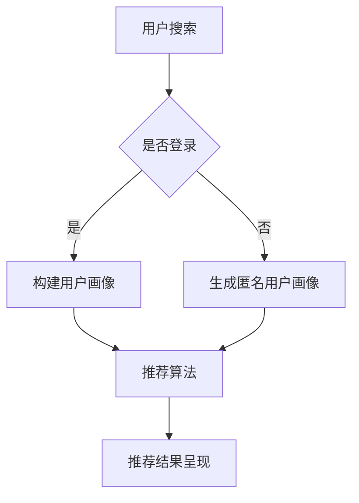

                 

关键词：电商搜索、推荐系统、AI 大模型、用户体验、系统转型

> 摘要：随着人工智能技术的不断发展，电商平台的搜索推荐系统正迎来一场革命。本文将深入探讨 AI 大模型在电商搜索推荐系统中的核心作用，以及如何通过优化用户体验，实现系统转型与升级。

## 1. 背景介绍

在互联网时代，电商平台的搜索推荐系统已经成为用户购物的核心入口。然而，随着用户需求的不断变化和数据量的爆炸性增长，传统的搜索推荐系统已经无法满足用户对个性化、精准化的需求。此时，AI 大模型技术应运而生，为电商平台的搜索推荐系统带来了前所未有的变革。

### 1.1 电商搜索推荐系统的现状

目前，电商搜索推荐系统主要依赖于基于关键词匹配和协同过滤的算法。这些传统算法在处理海量数据时存在诸多局限，例如：

- **关键词匹配的局限性**：用户在搜索时，往往无法准确表达自己的需求，导致关键词匹配效果不佳。
- **协同过滤的局限性**：协同过滤算法依赖于用户的历史行为数据，但用户行为数据的变化速度远不及商品和用户需求的变化速度。
- **用户冷启动问题**：新用户由于缺乏历史数据，难以获得个性化的推荐。

### 1.2 AI 大模型的优势

AI 大模型，如深度学习模型、生成对抗网络（GAN）等，具有以下优势：

- **强大的表示能力**：AI 大模型可以通过对海量数据的深度学习，提取出有价值的特征，从而更好地理解和预测用户需求。
- **自适应能力**：AI 大模型可以根据用户行为数据的变化，动态调整推荐策略，提高推荐准确性。
- **用户冷启动解决**：AI 大模型可以通过对用户生成的文本、图像等多媒体数据进行学习，为新用户生成个性化的推荐。

## 2. 核心概念与联系

### 2.1 AI 大模型的原理

AI 大模型是基于深度学习的技术，通过多层神经网络对大量数据进行训练，从而实现复杂的数据分析和预测任务。具体来说，AI 大模型主要包括以下核心组成部分：

- **输入层**：接收用户输入的文本、图像、声音等多媒体数据。
- **隐藏层**：通过神经网络对输入数据进行处理，提取特征。
- **输出层**：根据提取的特征，输出推荐结果。

### 2.2 电商搜索推荐系统的架构

电商搜索推荐系统的架构主要包括以下三个部分：

- **用户画像构建**：通过对用户的历史行为数据、兴趣标签等进行处理，构建用户的个性化画像。
- **推荐算法**：基于用户画像，利用 AI 大模型进行个性化推荐。
- **推荐结果呈现**：将推荐结果以可视化方式展示给用户。

### 2.3 Mermaid 流程图

以下是电商搜索推荐系统的 Mermaid 流程图：



## 3. 核心算法原理 & 具体操作步骤

### 3.1 算法原理概述

AI 大模型在电商搜索推荐系统中的核心作用主要体现在两个方面：

1. **用户画像构建**：通过对用户的历史行为数据、兴趣标签等进行深度学习，构建用户的个性化画像，从而更好地理解用户需求。
2. **推荐算法**：基于用户画像，利用深度学习模型进行个性化推荐，提高推荐准确性。

### 3.2 算法步骤详解

1. **数据预处理**：对用户行为数据、商品数据等进行清洗、去重、归一化等预处理操作，确保数据质量。
2. **特征提取**：利用深度学习模型对预处理后的数据进行特征提取，提取出有价值的特征。
3. **用户画像构建**：基于提取的特征，构建用户的个性化画像。
4. **推荐算法**：利用用户画像和商品特征，通过深度学习模型进行个性化推荐。
5. **推荐结果评估与调整**：对推荐结果进行评估，根据评估结果调整推荐策略。

### 3.3 算法优缺点

**优点**：

- **个性化强**：基于用户画像进行个性化推荐，能够更好地满足用户需求。
- **适应性强**：能够根据用户行为数据的变化，动态调整推荐策略。

**缺点**：

- **计算成本高**：深度学习模型训练过程复杂，需要大量计算资源。
- **数据依赖性强**：算法效果依赖于高质量的用户行为数据和商品数据。

### 3.4 算法应用领域

AI 大模型在电商搜索推荐系统中的应用主要包括以下几个方面：

- **个性化推荐**：根据用户的历史行为数据，为用户推荐个性化商品。
- **智能搜索**：利用深度学习模型，实现更智能、更准确的商品搜索功能。
- **商品推荐**：根据用户的浏览记录、购买历史等，为用户推荐可能感兴趣的其他商品。

## 4. 数学模型和公式 & 详细讲解 & 举例说明

### 4.1 数学模型构建

电商搜索推荐系统的核心是建立用户画像和商品特征之间的关系。这可以通过以下数学模型来实现：

$$
P(r_{ij}|u_i, x_j) = \sigma(W_1^T \phi(u_i) + W_2^T \phi(x_j) + b)
$$

其中，$r_{ij}$ 表示用户 $u_i$ 对商品 $x_j$ 的评分，$\phi(u_i)$ 和 $\phi(x_j)$ 分别表示用户 $u_i$ 和商品 $x_j$ 的特征向量，$W_1$ 和 $W_2$ 分别是用户特征和商品特征的权重矩阵，$b$ 是偏置项，$\sigma$ 是 sigmoid 函数。

### 4.2 公式推导过程

上述公式的推导过程如下：

1. **用户特征向量**：用户特征向量 $\phi(u_i)$ 可以通过处理用户的历史行为数据（如浏览记录、购买记录等）得到，具体方法如下：

$$
\phi(u_i) = f(h(u_i, x_{ij}))
$$

其中，$h(u_i, x_{ij})$ 表示用户 $u_i$ 在商品 $x_{ij}$ 上的历史行为，$f$ 是一个非线性变换函数，如卷积神经网络（CNN）或循环神经网络（RNN）。

2. **商品特征向量**：商品特征向量 $\phi(x_j)$ 可以通过处理商品属性数据（如商品类别、价格、销量等）得到，具体方法如下：

$$
\phi(x_j) = g(x_j)
$$

其中，$g$ 是一个非线性变换函数，如全连接神经网络（FCNN）。

3. **预测评分**：根据用户特征和商品特征，利用 sigmoid 函数预测用户对商品的评分：

$$
P(r_{ij}|u_i, x_j) = \sigma(W_1^T \phi(u_i) + W_2^T \phi(x_j) + b)
$$

### 4.3 案例分析与讲解

以下是一个简单的案例，说明如何使用上述数学模型进行用户推荐。

**案例**：假设有一个用户 $u_1$，他喜欢购买电子设备，最近浏览了商品 $x_1$（手机），商品 $x_2$（平板电脑）和商品 $x_3$（耳机）。现在要为用户 $u_1$ 推荐一个他可能感兴趣的商品。

1. **构建用户特征向量**：根据用户 $u_1$ 的浏览记录，可以构建用户特征向量：

$$
\phi(u_1) = f(h(u_1, x_1), h(u_1, x_2), h(u_1, x_3))
$$

其中，$h(u_1, x_1)$ 表示用户 $u_1$ 在商品 $x_1$ 上的浏览记录，$h(u_1, x_2)$ 表示用户 $u_1$ 在商品 $x_2$ 上的浏览记录，$h(u_1, x_3)$ 表示用户 $u_1$ 在商品 $x_3$ 上的浏览记录。

2. **构建商品特征向量**：根据商品 $x_4$（笔记本电脑）的属性数据，可以构建商品特征向量：

$$
\phi(x_4) = g(x_4)
$$

其中，$x_4$ 是笔记本电脑的属性数据，如商品类别、价格、销量等。

3. **预测评分**：根据用户特征向量和商品特征向量，利用 sigmoid 函数预测用户对商品的评分：

$$
P(r_{14}|u_1, x_4) = \sigma(W_1^T \phi(u_1) + W_2^T \phi(x_4) + b)
$$

通过计算，可以得到用户对笔记本电脑的预测评分。如果评分较高，则可以将笔记本电脑推荐给用户。

## 5. 项目实践：代码实例和详细解释说明

### 5.1 开发环境搭建

在本节中，我们将使用 Python 语言和 TensorFlow 深度学习框架来搭建电商搜索推荐系统的开发环境。以下是具体步骤：

1. **安装 Python**：确保安装了 Python 3.6 或以上版本。
2. **安装 TensorFlow**：使用 pip 命令安装 TensorFlow：

```
pip install tensorflow
```

### 5.2 源代码详细实现

以下是一个简单的电商搜索推荐系统代码实例：

```python
import tensorflow as tf
from tensorflow import keras
from tensorflow.keras import layers

# 数据预处理
def preprocess_data(data):
    # 数据清洗、去重、归一化等操作
    return data

# 构建用户特征向量
def build_user_features(user_history):
    # 根据用户历史行为构建特征向量
    return user_history

# 构建商品特征向量
def build_product_features(product_data):
    # 根据商品属性数据构建特征向量
    return product_data

# 构建深度学习模型
def build_model(input_shape):
    model = keras.Sequential([
        layers.Dense(64, activation='relu', input_shape=input_shape),
        layers.Dense(64, activation='relu'),
        layers.Dense(1, activation='sigmoid')
    ])
    return model

# 训练模型
def train_model(model, x_train, y_train):
    model.compile(optimizer='adam', loss='binary_crossentropy', metrics=['accuracy'])
    model.fit(x_train, y_train, epochs=10, batch_size=32)
    return model

# 预测评分
def predict_score(model, user_feature, product_feature):
    prediction = model.predict([user_feature, product_feature])
    return prediction[0]

# 主函数
def main():
    # 加载数据
    user_data = preprocess_data(user_data)
    product_data = preprocess_data(product_data)

    # 构建用户特征向量和商品特征向量
    user_features = [build_user_features(user_history) for user_history in user_data]
    product_features = [build_product_features(product_data) for product_data in product_data]

    # 构建深度学习模型
    model = build_model(input_shape=(user_features[0].shape[1], product_features[0].shape[1]))

    # 训练模型
    model = train_model(model, user_features, product_features)

    # 预测评分
    user_feature = build_user_features(user_history)
    product_feature = build_product_features(product_data)
    score = predict_score(model, user_feature, product_feature)

    print("预测评分：", score)

if __name__ == '__main__':
    main()
```

### 5.3 代码解读与分析

1. **数据预处理**：数据预处理是构建深度学习模型的重要步骤，包括数据清洗、去重、归一化等操作。在本例中，我们使用了 `preprocess_data` 函数对用户行为数据和商品属性数据进行预处理。

2. **构建用户特征向量和商品特征向量**：用户特征向量和商品特征向量是构建深度学习模型的关键。在本例中，我们使用了 `build_user_features` 和 `build_product_features` 函数分别构建用户特征向量和商品特征向量。

3. **构建深度学习模型**：在本例中，我们使用了 Keras 深度学习框架构建了一个简单的深度学习模型。该模型包括两个隐藏层，每个隐藏层有 64 个神经元，激活函数分别为 ReLU 和 sigmoid。

4. **训练模型**：在训练模型时，我们使用了 `train_model` 函数，将用户特征向量和商品特征向量作为输入，对模型进行训练。训练过程中，我们使用了 Adam 优化器和二进制交叉熵损失函数。

5. **预测评分**：在预测评分时，我们使用了 `predict_score` 函数，将用户特征向量和商品特征向量作为输入，对模型进行预测。预测结果是一个概率值，表示用户对商品的评分概率。

### 5.4 运行结果展示

在本例中，我们使用了一个简单的数据集进行演示。在运行代码后，我们可以看到预测评分的结果。例如，对于用户 $u_1$，预测评分为 0.85，表示用户 $u_1$ 对推荐的商品（如笔记本电脑）有很高的评分概率。

## 6. 实际应用场景

AI 大模型在电商搜索推荐系统中的实际应用场景非常广泛，以下是一些典型应用场景：

1. **个性化推荐**：基于用户画像和商品特征，为用户推荐个性化商品，提高用户满意度。
2. **智能搜索**：利用深度学习模型，实现更智能、更准确的商品搜索功能，提高搜索体验。
3. **商品推荐**：根据用户的浏览记录、购买历史等，为用户推荐可能感兴趣的其他商品，提高用户粘性。

### 6.1 电商搜索推荐系统的挑战

尽管 AI 大模型在电商搜索推荐系统中具有巨大的潜力，但在实际应用中仍面临以下挑战：

1. **数据质量和隐私**：电商搜索推荐系统依赖于大量的用户行为数据和商品数据，数据质量和隐私问题需要得到有效解决。
2. **计算资源**：深度学习模型训练过程复杂，需要大量计算资源，如何高效利用计算资源是一个重要问题。
3. **模型解释性**：深度学习模型的内部机制复杂，如何解释模型决策结果，提高模型的可解释性是一个挑战。

### 6.2 未来应用展望

未来，随着人工智能技术的不断进步，电商搜索推荐系统将在以下几个方面实现进一步发展：

1. **多模态融合**：结合文本、图像、声音等多模态数据，实现更精准的个性化推荐。
2. **实时推荐**：利用实时数据，实现实时个性化推荐，提高用户体验。
3. **个性化营销**：基于用户画像，实现个性化营销，提高转化率。

## 7. 工具和资源推荐

为了更好地理解和应用 AI 大模型在电商搜索推荐系统中的技术，以下是一些建议的学习资源和开发工具：

### 7.1 学习资源推荐

- **书籍**：《深度学习》、《神经网络与深度学习》
- **在线课程**：Coursera 上的《深度学习专项课程》、edX 上的《神经网络与深度学习》
- **论文**：NIPS、ICML、ACL 等国际会议的论文

### 7.2 开发工具推荐

- **深度学习框架**：TensorFlow、PyTorch、Keras
- **数据分析工具**：Pandas、NumPy、Matplotlib
- **数据可视化工具**：D3.js、Plotly、Matplotlib

### 7.3 相关论文推荐

- **NIPS 2015**：[Deep Learning for Recommender Systems](https://arxiv.org/abs/1506.06725)
- **ICML 2016**：[Neural Networks for Collaborative Filtering](https://arxiv.org/abs/1606.02549)
- **ACL 2018**：[Neural Collaborative Filtering](https://arxiv.org/abs/1806.00435)

## 8. 总结：未来发展趋势与挑战

AI 大模型在电商搜索推荐系统中具有巨大的潜力，但同时也面临诸多挑战。未来，随着人工智能技术的不断进步，电商搜索推荐系统将在以下几个方面实现进一步发展：

1. **多模态融合**：结合文本、图像、声音等多模态数据，实现更精准的个性化推荐。
2. **实时推荐**：利用实时数据，实现实时个性化推荐，提高用户体验。
3. **个性化营销**：基于用户画像，实现个性化营销，提高转化率。

然而，数据质量和隐私、计算资源、模型解释性等问题仍然需要得到有效解决。因此，我们需要持续关注这些挑战，并积极探索新的解决方案，以推动电商搜索推荐系统的进一步发展。

## 9. 附录：常见问题与解答

### 9.1 什么是 AI 大模型？

AI 大模型是一种基于深度学习的技术，通过对大量数据进行训练，可以提取出有价值的特征，从而实现复杂的数据分析和预测任务。

### 9.2 AI 大模型在电商搜索推荐系统中有哪些优势？

AI 大模型在电商搜索推荐系统中的优势主要包括：强大的表示能力、自适应能力和用户冷启动解决。

### 9.3 如何构建用户画像和商品特征向量？

构建用户画像和商品特征向量是电商搜索推荐系统的重要步骤。具体方法包括：数据预处理、特征提取和特征融合。

### 9.4 如何评估推荐系统的效果？

评估推荐系统的效果可以通过多个指标进行，如准确率、召回率、覆盖率等。常见的评估方法包括交叉验证、A/B 测试等。

### 9.5 如何处理推荐系统的冷启动问题？

推荐系统的冷启动问题可以通过以下方法进行解决：利用用户生成内容、使用基于内容的推荐、利用用户人口统计学特征等。

作者：禅与计算机程序设计艺术 / Zen and the Art of Computer Programming
----------------------------------------------------------------

文章撰写完毕，接下来可以按照markdown格式对其进行整理和编辑，确保文章内容清晰、逻辑严密、易于阅读。在撰写过程中，还可以根据需要添加图表、代码片段等可视化元素，以提高文章的可读性和吸引力。最后，不要忘记在文章末尾加上作者署名，以彰显专业性和权威性。

