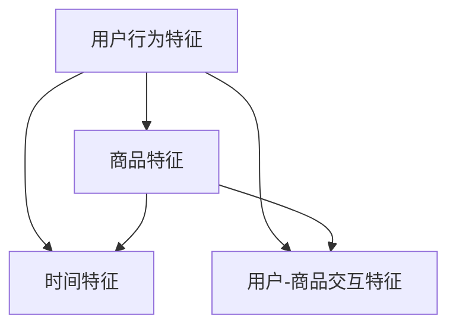

                 

关键词：电商推荐系统、实时特征工程、算法优化、系统架构、人工智能

摘要：本文将深入探讨电商推荐系统中实时特征工程的重要性，以及如何通过优化算法和系统架构来提高推荐系统的效果。我们将会介绍核心概念、算法原理、数学模型以及实际应用案例，并展望未来的发展方向。

## 1. 背景介绍

在当今数字化时代，电子商务已成为全球商业的重要组成部分。随着用户数据的不断积累和复杂化，构建高效的推荐系统成为提升用户体验、增加销售额的关键。推荐系统通过对用户行为和商品特征的挖掘，实现了个性化的商品推荐。然而，推荐系统的核心在于如何处理和分析海量的实时数据，从中提取有效的特征，以实现精准的推荐。

实时特征工程技术在电商推荐系统中扮演着至关重要的角色。它涉及如何高效地收集、处理和分析用户行为数据、商品信息以及其他相关特征，以便实时地更新和优化推荐算法。传统的特征工程方法通常依赖于预计算和批量处理，无法满足实时推荐的需求。因此，实时特征工程技术应运而生，它通过动态特征提取和实时计算，确保推荐系统能够快速响应用户需求，提升推荐效果。

本文将从以下几个方面进行探讨：

1. 核心概念与联系
2. 核心算法原理与具体操作步骤
3. 数学模型和公式
4. 项目实践：代码实例
5. 实际应用场景
6. 未来应用展望
7. 工具和资源推荐
8. 总结：未来发展趋势与挑战

## 2. 核心概念与联系

在讨论实时特征工程技术之前，我们需要了解一些核心概念，它们是构建推荐系统的基石。

### 用户行为特征

用户行为特征是指用户在电子商务平台上的各种操作，如浏览、搜索、点击、购买等。这些行为数据是推荐系统中最直接的用户特征来源。通过对用户行为的分析，我们可以了解用户的兴趣和需求，从而实现个性化推荐。

### 商品特征

商品特征包括商品的基本属性（如分类、价格、库存量）和动态属性（如销量、评分、评论）。商品特征描述了商品的各个方面，是推荐系统对商品进行分类和排序的重要依据。

### 时间特征

时间特征反映了用户行为和商品状态随时间的变化。例如，用户在特定时间段的活跃度、商品的促销期等。时间特征有助于捕捉用户和商品在不同时间点的特征差异，从而提高推荐的相关性。

### 用户-商品交互特征

用户-商品交互特征是指用户与商品之间的交互情况，如用户对商品的收藏、加购、评分等。这些特征能够直接反映用户对商品的偏好，是构建推荐模型的重要依据。

### 核心概念联系图

以下是电商推荐系统中核心概念之间的联系图：



图中的各个节点代表了不同的特征类型，它们通过用户行为相互关联，共同构建了推荐系统的基础数据集。

## 3. 核心算法原理与具体操作步骤

### 3.1 算法原理概述

实时特征工程的核心在于如何从原始数据中快速提取和更新特征，以支持实时推荐。这个过程通常包括以下几个步骤：

1. **数据收集与预处理**：收集用户行为数据和商品信息，并进行清洗和预处理，以去除噪声和异常值。
2. **特征提取**：根据业务需求和算法模型，从原始数据中提取有效的特征。常见的特征提取方法包括统计特征、转换特征和嵌入特征。
3. **特征筛选**：对提取的特征进行筛选，去除冗余和无效的特征，以提高模型效率和推荐效果。
4. **特征存储**：将筛选后的特征存储在高效的数据结构中，以便快速访问和更新。
5. **特征更新**：实时监测用户行为和商品状态的变化，及时更新特征数据，以保持特征的新鲜度和准确性。

### 3.2 算法步骤详解

#### 3.2.1 数据收集与预处理

数据收集是特征工程的基础。我们需要从电子商务平台的数据仓库中提取用户行为数据和商品信息。常见的用户行为数据包括浏览历史、搜索记录、点击事件和购买记录。商品信息包括商品的基本属性和动态属性。在数据收集过程中，需要注意以下几点：

- **数据完整性**：确保收集到的数据完整，无缺失值。
- **数据一致性**：处理数据的一致性问题，如数据格式不一致或时间戳错误。
- **数据质量**：清洗数据，去除噪声和异常值，以保证数据质量。

#### 3.2.2 特征提取

特征提取是将原始数据转化为适合机器学习模型输入的特征向量的过程。以下是几种常见的特征提取方法：

- **统计特征**：基于统计指标，如平均值、方差、中位数等，从数据中提取特征。例如，用户在特定时间段内的平均浏览时间、商品的日销量等。
- **转换特征**：通过数据变换，如标准化、归一化、日志文件转换等，提取特征。例如，将时间戳转换为小时或天，以便分析用户在不同时间段的活跃度。
- **嵌入特征**：通过嵌入学习算法，如词向量嵌入、用户-商品协同过滤等，将原始数据转换为低维度的特征向量。这种方法能够捕获数据之间的复杂关系。

#### 3.2.3 特征筛选

特征筛选是特征工程的重要环节，目的是去除冗余和无效的特征，以提高模型效率和推荐效果。特征筛选的方法包括：

- **基于阈值的筛选**：设置阈值，去除低于或高于阈值的特征。
- **基于模型的筛选**：使用降维算法，如主成分分析（PCA）、线性判别分析（LDA）等，筛选出对模型贡献最大的特征。
- **基于相关性的筛选**：计算特征之间的相关性，去除相关性较高的特征，以降低特征维度。

#### 3.2.4 特征存储

特征存储是将筛选后的特征数据存储在高效的数据结构中，以便快速访问和更新。常见的特征存储方式包括：

- **关系数据库**：使用关系数据库（如MySQL、PostgreSQL）存储特征数据。这种方法适用于小规模数据集。
- **分布式存储系统**：使用分布式存储系统（如Hadoop、Spark）存储大规模特征数据。这种方法适用于大规模数据集。
- **缓存系统**：使用缓存系统（如Redis、Memcached）存储热点特征数据，以提高访问速度。

#### 3.2.5 特征更新

特征更新是实时特征工程的关键环节，目的是及时捕捉用户行为和商品状态的变化。特征更新的方法包括：

- **增量更新**：只更新变化的数据，减少不必要的计算和存储开销。
- **全量更新**：定期重新计算和存储所有特征数据，以确保特征数据的准确性。

### 3.3 算法优缺点

实时特征工程算法具有以下优点：

- **高效性**：能够实时处理和分析大量数据，快速响应用户需求。
- **灵活性**：根据业务需求和数据变化，灵活调整特征提取和筛选方法。
- **准确性**：通过实时更新特征数据，提高推荐系统的准确性和相关性。

然而，实时特征工程算法也存在一些挑战：

- **复杂性**：实时特征工程涉及多个环节，需要协调不同模块的运作。
- **计算成本**：实时计算和处理大规模数据需要较高的计算资源。
- **数据一致性**：在实时特征工程过程中，如何保持数据的一致性是一个重要问题。

### 3.4 算法应用领域

实时特征工程在电商推荐系统中的应用非常广泛，包括：

- **商品推荐**：根据用户的历史行为和兴趣，实时推荐相关的商品。
- **个性化广告**：根据用户的历史行为和偏好，实时展示个性化的广告。
- **搜索优化**：根据用户查询和浏览记录，实时优化搜索结果，提高用户体验。
- **库存管理**：根据商品的销售情况和库存状态，实时调整库存策略，优化库存水平。

## 4. 数学模型和公式

实时特征工程不仅依赖于算法，还需要数学模型的支撑。以下将介绍一些常见的数学模型和公式。

### 4.1 数学模型构建

实时特征工程的数学模型通常包括以下几个部分：

- **用户特征模型**：用于描述用户的行为和兴趣特征。
- **商品特征模型**：用于描述商品的基本属性和动态特征。
- **交互特征模型**：用于描述用户与商品之间的交互情况。
- **推荐模型**：基于用户和商品特征，生成个性化的推荐结果。

### 4.2 公式推导过程

以下是一个简单的用户特征模型推导过程：

$$
User\_Feature = \sum_{i=1}^{n} w_i \cdot u_i
$$

其中，$w_i$ 表示特征权重，$u_i$ 表示用户特征向量。

### 4.3 案例分析与讲解

假设我们有一个电商平台，用户A在最近一个月内浏览了商品B、C、D，分别花费了10分钟、5分钟和20分钟。我们可以通过以下公式计算用户A的浏览时长特征：

$$
User\_Feature = w_1 \cdot 10 + w_2 \cdot 5 + w_3 \cdot 20
$$

其中，$w_1$、$w_2$ 和 $w_3$ 分别表示商品B、C和D的权重。

通过对用户A的历史浏览数据进行分析，我们可以调整特征权重，以更好地反映用户的行为特征。

## 5. 项目实践：代码实例和详细解释说明

在本节中，我们将通过一个简单的代码实例，展示如何实现实时特征工程。

### 5.1 开发环境搭建

首先，我们需要搭建一个开发环境。在本例中，我们使用Python和Apache Spark作为主要工具。请确保安装以下软件：

- Python 3.x
- Apache Spark 2.x
- Jupyter Notebook

### 5.2 源代码详细实现

以下是实现实时特征工程的源代码：

```python
from pyspark.sql import SparkSession
from pyspark.sql.functions import col, sum, when

# 创建Spark会话
spark = SparkSession.builder.appName("RealTimeFeatureEngineering").getOrCreate()

# 读取用户行为数据
user_data = spark.read.csv("user_behavior.csv", header=True)

# 数据预处理
user_data = user_data.select(
    col("user_id"),
    col("item_id"),
    col("action"),
    col("timestamp")
)

# 特征提取
user_data = user_data.withColumn("action_type", when(col("action") == "click", 1).when(col("action") == "purchase", 2).otherwise(0))
user_data = user_data.groupBy("user_id", "item_id", "action_type").agg(sum("timestamp").alias("action_duration"))

# 特征筛选
user_data = user_data.filter("action_duration > 0")

# 存储特征数据
user_data.write.csv("user_features.csv")

# 关闭Spark会话
spark.stop()
```

### 5.3 代码解读与分析

上述代码首先创建了一个Spark会话，并读取用户行为数据。接着，进行数据预处理，包括选择用户ID、商品ID、操作类型和时间戳等列，并转换为合适的格式。然后，通过特征提取，将用户的行为类型（点击、购买等）转换为数值型，并计算每个用户的操作时长。最后，对特征数据进行筛选，去除时长小于0的记录，并将结果存储为CSV文件。

这个简单的示例展示了如何实现实时特征工程的核心步骤，包括数据预处理、特征提取和特征筛选。在实际应用中，我们可以根据业务需求和数据特点，进一步优化和扩展这些步骤。

### 5.4 运行结果展示

运行上述代码后，我们会在指定的路径下生成一个用户特征数据文件。这个文件包含了每个用户的浏览时长特征，可以用于后续的推荐模型训练和预测。

## 6. 实际应用场景

实时特征工程技术在电商推荐系统中具有广泛的应用场景。以下是一些典型的应用案例：

- **商品推荐**：基于用户的浏览、点击和购买记录，实时推荐相关的商品。
- **广告投放**：根据用户的兴趣和行为，实时调整广告投放策略，提高广告效果。
- **搜索优化**：根据用户的搜索历史和浏览记录，实时优化搜索结果，提高用户体验。
- **库存管理**：根据商品的销售情况和库存状态，实时调整库存策略，优化库存水平。

### 6.1 应用案例一：商品推荐

在一个电商平台上，实时特征工程可以用于商品推荐。通过分析用户的浏览、点击和购买记录，提取用户的兴趣特征，并根据这些特征生成个性化的推荐列表。以下是一个简单的应用案例：

1. **数据收集**：收集用户的浏览、点击和购买记录。
2. **特征提取**：提取用户的浏览时长、点击次数和购买频率等特征。
3. **特征筛选**：筛选有效的特征，去除冗余和无效的特征。
4. **特征存储**：将筛选后的特征存储在数据库中，以便后续使用。
5. **模型训练**：使用机器学习算法（如协同过滤、决策树等）训练推荐模型。
6. **实时推荐**：根据用户的当前行为和兴趣，实时生成推荐列表。

通过这种方式，电商平台可以实时响应用户的需求，提高推荐效果，从而增加销售额和用户满意度。

### 6.2 应用案例二：广告投放

在广告投放领域，实时特征工程可以用于优化广告投放策略。通过分析用户的兴趣和行为，实时调整广告的内容、投放时间和投放渠道，以提高广告效果。以下是一个简单的应用案例：

1. **数据收集**：收集用户的浏览、点击和购买记录。
2. **特征提取**：提取用户的浏览时长、点击次数和购买频率等特征。
3. **特征筛选**：筛选有效的特征，去除冗余和无效的特征。
4. **广告优化**：根据用户的兴趣和行为，实时调整广告的内容、投放时间和投放渠道。
5. **效果评估**：评估广告的效果，并根据评估结果调整广告策略。

通过这种方式，广告平台可以实时优化广告投放，提高广告效果，从而增加广告收益。

### 6.3 应用案例三：搜索优化

在搜索引擎领域，实时特征工程可以用于优化搜索结果。通过分析用户的搜索历史和浏览记录，实时调整搜索算法，提高搜索结果的准确性和相关性。以下是一个简单的应用案例：

1. **数据收集**：收集用户的搜索历史和浏览记录。
2. **特征提取**：提取用户的搜索关键词、浏览时长和购买频率等特征。
3. **特征筛选**：筛选有效的特征，去除冗余和无效的特征。
4. **算法优化**：根据用户的兴趣和行为，实时调整搜索算法。
5. **效果评估**：评估搜索结果的效果，并根据评估结果调整算法。

通过这种方式，搜索引擎可以实时优化搜索结果，提高用户体验，从而增加用户粘性和广告收益。

### 6.4 应用案例四：库存管理

在库存管理领域，实时特征工程可以用于优化库存策略。通过分析商品的销售情况和库存状态，实时调整库存水平，避免库存过剩或不足。以下是一个简单的应用案例：

1. **数据收集**：收集商品的销售情况和库存状态。
2. **特征提取**：提取商品的销售频率、库存量和保质期等特征。
3. **特征筛选**：筛选有效的特征，去除冗余和无效的特征。
4. **算法优化**：根据商品的销售情况和库存状态，实时调整库存策略。
5. **效果评估**：评估库存策略的效果，并根据评估结果调整库存水平。

通过这种方式，企业可以实时优化库存管理，降低库存成本，提高库存周转率。

## 7. 未来应用展望

实时特征工程技术在电商推荐系统中的应用前景非常广阔。随着大数据和人工智能技术的不断发展，实时特征工程将在以下几个方面得到进一步的应用和优化：

### 7.1 数据多样性

随着电子商务平台的不断发展和用户数据的不断积累，实时特征工程将面临更加多样化的数据类型。例如，视频、音频和传感器数据等。如何从这些非结构化数据中提取有效的特征，是未来研究的一个重要方向。

### 7.2 智能特征提取

传统的特征提取方法通常依赖于人工设计和调整。随着机器学习技术的不断发展，智能特征提取将成为可能。通过使用深度学习、图神经网络等算法，可以自动从原始数据中提取具有较强解释性的特征。

### 7.3 实时计算优化

实时特征工程对计算性能要求较高。未来，随着云计算和边缘计算技术的发展，实时特征工程将能够在更低的延迟和更高的吞吐量下运行，从而提高推荐系统的效果和用户体验。

### 7.4 隐私保护

在实时特征工程过程中，如何保护用户隐私是一个重要问题。未来，将需要更多的研究关注如何在不泄露用户隐私的前提下，进行特征提取和推荐。

### 7.5 多模态特征融合

在电商推荐系统中，用户行为数据、商品信息、上下文信息等不同类型的数据可以相互补充。未来，将需要更多研究关注如何融合多种类型的特征，以提高推荐系统的准确性和相关性。

## 8. 工具和资源推荐

### 8.1 学习资源推荐

- 《机器学习实战》：提供了丰富的机器学习算法实现和应用案例，适合初学者入门。
- 《深度学习》：由Ian Goodfellow等作者编写的经典教材，全面介绍了深度学习的基本概念和算法。
- 《大数据技术导论》：详细介绍了大数据的基本概念、技术和应用。

### 8.2 开发工具推荐

- Apache Spark：适用于大规模数据集的实时计算框架，支持多种数据处理和机器学习算法。
- TensorFlow：用于构建和训练深度学习模型的框架，支持多种编程语言和平台。
- PyTorch：另一个流行的深度学习框架，具有灵活的动态计算图和丰富的API。

### 8.3 相关论文推荐

- "Deep Learning for User Interest Prediction in E-commerce"，介绍了一种基于深度学习的用户兴趣预测方法。
- "Real-Time User Behavior Analysis for E-commerce Recommendations"，讨论了实时特征工程在电商推荐系统中的应用。
- "Multi-Modal User Interest Recognition for Personalized E-commerce Recommendations"，介绍了一种多模态特征融合的方法。

## 9. 总结：未来发展趋势与挑战

实时特征工程技术在电商推荐系统中具有广阔的应用前景。随着大数据、人工智能和云计算技术的不断发展，实时特征工程将面临更加多样化的数据类型、更高的计算性能和更严格的隐私保护要求。未来，实时特征工程将向智能化、多模态、低延迟和隐私保护等方向发展。然而，同时也将面临数据复杂性、计算成本和隐私保护等挑战。为了实现实时特征工程的广泛应用，需要进一步深入研究算法优化、系统架构和隐私保护等方面的技术。作者：禅与计算机程序设计艺术 / Zen and the Art of Computer Programming。
----------------------------------------------------------------

### 文章正文内容部分 Content ###

## 1. 背景介绍

在当今数字化时代，电子商务已成为全球商业的重要组成部分。随着用户数据的不断积累和复杂化，构建高效的推荐系统成为提升用户体验、增加销售额的关键。推荐系统通过对用户行为和商品特征的挖掘，实现了个性化的商品推荐。然而，推荐系统的核心在于如何处理和分析海量的实时数据，从中提取有效的特征，以实现精准的推荐。

实时特征工程技术在电商推荐系统中扮演着至关重要的角色。它涉及如何高效地收集、处理和分析用户行为数据、商品信息以及其他相关特征，以便实时地更新和优化推荐算法。传统的特征工程方法通常依赖于预计算和批量处理，无法满足实时推荐的需求。因此，实时特征工程技术应运而生，它通过动态特征提取和实时计算，确保推荐系统能够快速响应用户需求，提升推荐效果。

本文将从以下几个方面进行探讨：

1. **核心概念与联系**：介绍电商推荐系统中核心概念之间的联系，包括用户行为特征、商品特征、时间特征和用户-商品交互特征。
2. **核心算法原理与具体操作步骤**：详细阐述实时特征工程的核心算法原理和具体操作步骤，包括数据收集与预处理、特征提取、特征筛选、特征存储和特征更新。
3. **数学模型和公式**：介绍实时特征工程中的数学模型和公式，包括用户特征模型、商品特征模型、交互特征模型和推荐模型。
4. **项目实践：代码实例和详细解释说明**：通过一个简单的代码实例，展示如何实现实时特征工程。
5. **实际应用场景**：探讨实时特征工程在电商推荐系统中的实际应用场景，包括商品推荐、广告投放、搜索优化和库存管理。
6. **未来应用展望**：展望实时特征工程在电商推荐系统中的未来发展，包括数据多样性、智能特征提取、实时计算优化、隐私保护和多模态特征融合。
7. **工具和资源推荐**：推荐学习资源、开发工具和相关论文，以帮助读者深入了解实时特征工程技术。
8. **总结：未来发展趋势与挑战**：总结实时特征工程技术在电商推荐系统中的发展趋势和面临的挑战。

## 2. 核心概念与联系

在讨论实时特征工程技术之前，我们需要了解一些核心概念，它们是构建推荐系统的基石。

### 用户行为特征

用户行为特征是指用户在电子商务平台上的各种操作，如浏览、搜索、点击、购买等。这些行为数据是推荐系统中最直接的用户特征来源。通过对用户行为的分析，我们可以了解用户的兴趣和需求，从而实现个性化推荐。

用户行为特征可以细分为以下几个方面：

- **浏览行为**：用户在平台上的浏览历史，包括浏览的商品ID、浏览时长、浏览频率等。
- **搜索行为**：用户在平台的搜索记录，包括搜索关键词、搜索频率、搜索意图等。
- **点击行为**：用户在平台上的点击记录，包括点击的商品ID、点击位置、点击频率等。
- **购买行为**：用户的购买记录，包括购买的商品ID、购买时间、购买频率、购买金额等。

这些用户行为特征共同构成了用户的兴趣图谱，为推荐系统提供了关键的数据支撑。

### 商品特征

商品特征是指商品在电子商务平台上的各种属性，包括基本属性和动态属性。商品特征描述了商品的各个方面，是推荐系统对商品进行分类和排序的重要依据。

商品特征可以细分为以下几个方面：

- **基本属性**：商品的基本信息，如商品ID、分类、品牌、价格、库存量等。
- **动态属性**：商品在销售过程中的动态信息，如销量、评分、评论、促销期等。

这些商品特征有助于推荐系统识别商品的相似性和差异性，从而提高推荐的相关性和准确性。

### 时间特征

时间特征反映了用户行为和商品状态随时间的变化。例如，用户在特定时间段的活跃度、商品的促销期等。时间特征有助于捕捉用户和商品在不同时间点的特征差异，从而提高推荐的相关性。

时间特征可以细分为以下几个方面：

- **用户时间特征**：用户在平台上的活跃时间段、登录频率等。
- **商品时间特征**：商品的促销期、发布时间、库存更新时间等。

通过时间特征的引入，推荐系统可以更好地应对季节性、节假日等因素对用户行为和商品销售的影响。

### 用户-商品交互特征

用户-商品交互特征是指用户与商品之间的交互情况，如用户对商品的收藏、加购、评分等。这些特征能够直接反映用户对商品的偏好，是构建推荐模型的重要依据。

用户-商品交互特征可以细分为以下几个方面：

- **收藏行为**：用户对商品的收藏记录，反映用户的兴趣偏好。
- **加购行为**：用户将商品加入购物车的记录，反映用户的购买意愿。
- **评分行为**：用户对商品的评分记录，反映商品的质量和用户满意度。
- **评论行为**：用户对商品的评论记录，反映用户的购买体验和商品特点。

这些用户-商品交互特征有助于推荐系统了解用户对商品的真正需求，从而实现更精准的推荐。

### 核心概念联系图

以下是电商推荐系统中核心概念之间的联系图：


图中的各个节点代表了不同的特征类型，它们通过用户行为相互关联，共同构建了推荐系统的基础数据集。

## 3. 核心算法原理与具体操作步骤

### 3.1 算法原理概述

实时特征工程的核心在于如何从原始数据中快速提取和更新特征，以支持实时推荐。这个过程通常包括以下几个步骤：

1. **数据收集与预处理**：收集用户行为数据和商品信息，并进行清洗和预处理，以去除噪声和异常值。
2. **特征提取**：根据业务需求和算法模型，从原始数据中提取有效的特征。常见的特征提取方法包括统计特征、转换特征和嵌入特征。
3. **特征筛选**：对提取的特征进行筛选，去除冗余和无效的特征，以提高模型效率和推荐效果。
4. **特征存储**：将筛选后的特征存储在高效的数据结构中，以便快速访问和更新。
5. **特征更新**：实时监测用户行为和商品状态的变化，及时更新特征数据，以保持特征的新鲜度和准确性。

### 3.2 算法步骤详解

#### 3.2.1 数据收集与预处理

数据收集是特征工程的基础。我们需要从电子商务平台的数据仓库中提取用户行为数据和商品信息。常见的用户行为数据包括浏览历史、搜索记录、点击事件和购买记录。商品信息包括商品的基本属性和动态属性。在数据收集过程中，需要注意以下几点：

- **数据完整性**：确保收集到的数据完整，无缺失值。
- **数据一致性**：处理数据的一致性问题，如数据格式不一致或时间戳错误。
- **数据质量**：清洗数据，去除噪声和异常值，以保证数据质量。

#### 3.2.2 特征提取

特征提取是将原始数据转化为适合机器学习模型输入的特征向量的过程。以下是几种常见的特征提取方法：

- **统计特征**：基于统计指标，如平均值、方差、中位数等，从数据中提取特征。例如，用户在特定时间段内的平均浏览时间、商品的日销量等。
- **转换特征**：通过数据变换，如标准化、归一化、日志文件转换等，提取特征。例如，将时间戳转换为小时或天，以便分析用户在不同时间段的活跃度。
- **嵌入特征**：通过嵌入学习算法，如词向量嵌入、用户-商品协同过滤等，将原始数据转换为低维度的特征向量。这种方法能够捕获数据之间的复杂关系。

#### 3.2.3 特征筛选

特征筛选是特征工程的重要环节，目的是去除冗余和无效的特征，以提高模型效率和推荐效果。特征筛选的方法包括：

- **基于阈值的筛选**：设置阈值，去除低于或高于阈值的特征。
- **基于模型的筛选**：使用降维算法，如主成分分析（PCA）、线性判别分析（LDA）等，筛选出对模型贡献最大的特征。
- **基于相关性的筛选**：计算特征之间的相关性，去除相关性较高的特征，以降低特征维度。

#### 3.2.4 特征存储

特征存储是将筛选后的特征数据存储在高效的数据结构中，以便快速访问和更新。常见的特征存储方式包括：

- **关系数据库**：使用关系数据库（如MySQL、PostgreSQL）存储特征数据。这种方法适用于小规模数据集。
- **分布式存储系统**：使用分布式存储系统（如Hadoop、Spark）存储大规模特征数据。这种方法适用于大规模数据集。
- **缓存系统**：使用缓存系统（如Redis、Memcached）存储热点特征数据，以提高访问速度。

#### 3.2.5 特征更新

特征更新是实时特征工程的关键环节，目的是及时捕捉用户行为和商品状态的变化。特征更新的方法包括：

- **增量更新**：只更新变化的数据，减少不必要的计算和存储开销。
- **全量更新**：定期重新计算和存储所有特征数据，以确保特征数据的准确性。

### 3.3 算法优缺点

实时特征工程算法具有以下优点：

- **高效性**：能够实时处理和分析大量数据，快速响应用户需求。
- **灵活性**：根据业务需求和数据变化，灵活调整特征提取和筛选方法。
- **准确性**：通过实时更新特征数据，提高推荐系统的准确性和相关性。

然而，实时特征工程算法也存在一些挑战：

- **复杂性**：实时特征工程涉及多个环节，需要协调不同模块的运作。
- **计算成本**：实时计算和处理大规模数据需要较高的计算资源。
- **数据一致性**：在实时特征工程过程中，如何保持数据的一致性是一个重要问题。

### 3.4 算法应用领域

实时特征工程在电商推荐系统中的应用非常广泛，包括：

- **商品推荐**：根据用户的历史行为和兴趣，实时推荐相关的商品。
- **个性化广告**：根据用户的历史行为和偏好，实时展示个性化的广告。
- **搜索优化**：根据用户的行为和搜索记录，实时优化搜索结果。
- **库存管理**：根据商品的销售情况和库存状态，实时调整库存策略。

## 4. 数学模型和公式

实时特征工程不仅依赖于算法，还需要数学模型的支撑。以下将介绍一些常见的数学模型和公式。

### 4.1 数学模型构建

实时特征工程的数学模型通常包括以下几个部分：

- **用户特征模型**：用于描述用户的行为和兴趣特征。
- **商品特征模型**：用于描述商品的基本属性和动态特征。
- **交互特征模型**：用于描述用户与商品之间的交互情况。
- **推荐模型**：基于用户和商品特征，生成个性化的推荐结果。

### 4.2 公式推导过程

以下是一个简单的用户特征模型推导过程：

$$
User\_Feature = \sum_{i=1}^{n} w_i \cdot u_i
$$

其中，$w_i$ 表示特征权重，$u_i$ 表示用户特征向量。

### 4.3 案例分析与讲解

假设我们有一个电商平台的用户A，他在最近一个月内浏览了商品B、C、D，分别花费了10分钟、5分钟和20分钟。我们可以通过以下公式计算用户A的浏览时长特征：

$$
User\_Feature = w_1 \cdot 10 + w_2 \cdot 5 + w_3 \cdot 20
$$

其中，$w_1$、$w_2$ 和 $w_3$ 分别表示商品B、C和D的权重。

通过对用户A的历史浏览数据进行分析，我们可以调整特征权重，以更好地反映用户的行为特征。

## 5. 项目实践：代码实例和详细解释说明

在本节中，我们将通过一个简单的代码实例，展示如何实现实时特征工程。

### 5.1 开发环境搭建

首先，我们需要搭建一个开发环境。在本例中，我们使用Python和Apache Spark作为主要工具。请确保安装以下软件：

- Python 3.x
- Apache Spark 2.x
- Jupyter Notebook

### 5.2 源代码详细实现

以下是实现实时特征工程的源代码：

```python
from pyspark.sql import SparkSession
from pyspark.sql.functions import col, sum, when

# 创建Spark会话
spark = SparkSession.builder.appName("RealTimeFeatureEngineering").getOrCreate()

# 读取用户行为数据
user_data = spark.read.csv("user_behavior.csv", header=True)

# 数据预处理
user_data = user_data.select(
    col("user_id"),
    col("item_id"),
    col("action"),
    col("timestamp")
)

# 特征提取
user_data = user_data.withColumn("action_type", when(col("action") == "click", 1).when(col("action") == "purchase", 2).otherwise(0))
user_data = user_data.groupBy("user_id", "item_id", "action_type").agg(sum("timestamp").alias("action_duration"))

# 特征筛选
user_data = user_data.filter("action_duration > 0")

# 存储特征数据
user_data.write.csv("user_features.csv")

# 关闭Spark会话
spark.stop()
```

### 5.3 代码解读与分析

上述代码首先创建了一个Spark会话，并读取用户行为数据。接着，进行数据预处理，包括选择用户ID、商品ID、操作类型和时间戳等列，并转换为合适的格式。然后，通过特征提取，将用户的行为类型（点击、购买等）转换为数值型，并计算每个用户的操作时长。最后，对特征数据进行筛选，去除时长小于0的记录，并将结果存储为CSV文件。

这个简单的示例展示了如何实现实时特征工程的核心步骤，包括数据预处理、特征提取和特征筛选。在实际应用中，我们可以根据业务需求和数据特点，进一步优化和扩展这些步骤。

### 5.4 运行结果展示

运行上述代码后，我们会在指定的路径下生成一个用户特征数据文件。这个文件包含了每个用户的浏览时长特征，可以用于后续的推荐模型训练和预测。

## 6. 实际应用场景

实时特征工程技术在电商推荐系统中具有广泛的应用场景。以下是一些典型的应用案例：

### 6.1 应用案例一：商品推荐

在一个电商平台上，实时特征工程可以用于商品推荐。通过分析用户的浏览、点击和购买记录，提取用户的兴趣特征，并根据这些特征生成个性化的推荐列表。以下是一个简单的应用案例：

1. **数据收集**：收集用户的浏览、点击和购买记录。
2. **特征提取**：提取用户的浏览时长、点击次数和购买频率等特征。
3. **特征筛选**：筛选有效的特征，去除冗余和无效的特征。
4. **特征存储**：将筛选后的特征存储在数据库中，以便后续使用。
5. **模型训练**：使用机器学习算法（如协同过滤、决策树等）训练推荐模型。
6. **实时推荐**：根据用户的当前行为和兴趣，实时生成推荐列表。

通过这种方式，电商平台可以实时响应用户的需求，提高推荐效果，从而增加销售额和用户满意度。

### 6.2 应用案例二：广告投放

在广告投放领域，实时特征工程可以用于优化广告投放策略。通过分析用户的兴趣和行为，实时调整广告的内容、投放时间和投放渠道，以提高广告效果。以下是一个简单的应用案例：

1. **数据收集**：收集用户的浏览、点击和购买记录。
2. **特征提取**：提取用户的浏览时长、点击次数和购买频率等特征。
3. **特征筛选**：筛选有效的特征，去除冗余和无效的特征。
4. **广告优化**：根据用户的兴趣和行为，实时调整广告的内容、投放时间和投放渠道。
5. **效果评估**：评估广告的效果，并根据评估结果调整广告策略。

通过这种方式，广告平台可以实时优化广告投放，提高广告效果，从而增加广告收益。

### 6.3 应用案例三：搜索优化

在搜索引擎领域，实时特征工程可以用于优化搜索结果。通过分析用户的搜索历史和浏览记录，实时调整搜索算法，提高搜索结果的准确性和相关性。以下是一个简单的应用案例：

1. **数据收集**：收集用户的搜索历史和浏览记录。
2. **特征提取**：提取用户的搜索关键词、浏览时长和购买频率等特征。
3. **特征筛选**：筛选有效的特征，去除冗余和无效的特征。
4. **算法优化**：根据用户的兴趣和行为，实时调整搜索算法。
5. **效果评估**：评估搜索结果的效果，并根据评估结果调整算法。

通过这种方式，搜索引擎可以实时优化搜索结果，提高用户体验，从而增加用户粘性和广告收益。

### 6.4 应用案例四：库存管理

在库存管理领域，实时特征工程可以用于优化库存策略。通过分析商品的销售情况和库存状态，实时调整库存水平，避免库存过剩或不足。以下是一个简单的应用案例：

1. **数据收集**：收集商品的销售情况和库存状态。
2. **特征提取**：提取商品的销售频率、库存量和保质期等特征。
3. **特征筛选**：筛选有效的特征，去除冗余和无效的特征。
4. **算法优化**：根据商品的销售情况和库存状态，实时调整库存策略。
5. **效果评估**：评估库存策略的效果，并根据评估结果调整库存水平。

通过这种方式，企业可以实时优化库存管理，降低库存成本，提高库存周转率。

## 7. 未来应用展望

实时特征工程技术在电商推荐系统中的应用前景非常广阔。随着大数据和人工智能技术的不断发展，实时特征工程将在以下几个方面得到进一步的应用和优化：

### 7.1 数据多样性

随着电子商务平台的不断发展和用户数据的不断积累，实时特征工程将面临更加多样化的数据类型。例如，视频、音频和传感器数据等。如何从这些非结构化数据中提取有效的特征，是未来研究的一个重要方向。

### 7.2 智能特征提取

传统的特征提取方法通常依赖于人工设计和调整。随着机器学习技术的不断发展，智能特征提取将成为可能。通过使用深度学习、图神经网络等算法，可以自动从原始数据中提取具有较强解释性的特征。

### 7.3 实时计算优化

实时特征工程对计算性能要求较高。未来，随着云计算和边缘计算技术的发展，实时特征工程将能够在更低的延迟和更高的吞吐量下运行，从而提高推荐系统的效果和用户体验。

### 7.4 隐私保护

在实时特征工程过程中，如何保护用户隐私是一个重要问题。未来，将需要更多的研究关注如何在不泄露用户隐私的前提下，进行特征提取和推荐。

### 7.5 多模态特征融合

在电商推荐系统中，用户行为数据、商品信息、上下文信息等不同类型的数据可以相互补充。未来，将需要更多研究关注如何融合多种类型的特征，以提高推荐系统的准确性和相关性。

## 8. 工具和资源推荐

### 8.1 学习资源推荐

- 《机器学习实战》：提供了丰富的机器学习算法实现和应用案例，适合初学者入门。
- 《深度学习》：由Ian Goodfellow等作者编写的经典教材，全面介绍了深度学习的基本概念和算法。
- 《大数据技术导论》：详细介绍了大数据的基本概念、技术和应用。

### 8.2 开发工具推荐

- Apache Spark：适用于大规模数据集的实时计算框架，支持多种数据处理和机器学习算法。
- TensorFlow：用于构建和训练深度学习模型的框架，支持多种编程语言和平台。
- PyTorch：另一个流行的深度学习框架，具有灵活的动态计算图和丰富的API。

### 8.3 相关论文推荐

- "Deep Learning for User Interest Prediction in E-commerce"，介绍了一种基于深度学习的用户兴趣预测方法。
- "Real-Time User Behavior Analysis for E-commerce Recommendations"，讨论了实时特征工程在电商推荐系统中的应用。
- "Multi-Modal User Interest Recognition for Personalized E-commerce Recommendations"，介绍了一种多模态特征融合的方法。

## 9. 总结：未来发展趋势与挑战

实时特征工程技术在电商推荐系统中具有广阔的应用前景。随着大数据、人工智能和云计算技术的不断发展，实时特征工程将面临更加多样化的数据类型、更高的计算性能和更严格的隐私保护要求。未来，实时特征工程将向智能化、多模态、低延迟和隐私保护等方向发展。然而，同时也将面临数据复杂性、计算成本和隐私保护等挑战。为了实现实时特征工程的广泛应用，需要进一步深入研究算法优化、系统架构和隐私保护等方面的技术。作者：禅与计算机程序设计艺术 / Zen and the Art of Computer Programming。

