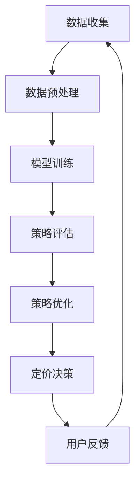

                 

关键词：电商，元强化学习，动态定价策略，大模型，人工智能

摘要：本文将探讨电商行业中的一种新兴技术——元强化学习，以及其在动态定价策略中的应用。通过介绍元强化学习的基本概念和原理，结合具体案例和数学模型，我们将展示大模型如何助力电商企业实现更为智能和高效的定价策略。本文旨在为从事电商领域的研究者和从业者提供一些有益的启示和参考。

## 1. 背景介绍

### 1.1 电商行业的现状

随着互联网的普及和消费者购买习惯的变化，电商行业已经成为了全球商业体系中的重要组成部分。在中国，电商市场尤其庞大，以阿里巴巴、京东、拼多多等为代表的电商巨头，在过去的几年中取得了惊人的业绩。然而，电商行业的竞争日益激烈，企业要想在市场中脱颖而出，除了需要提供优质的商品和服务外，还需要具备高效的运营策略。

### 1.2 动态定价策略的重要性

动态定价策略是电商运营中的一种重要手段，它可以根据市场变化、库存情况、竞争对手策略等多种因素，实时调整商品的价格。这种策略能够帮助企业实现利润最大化，同时提升消费者的购买体验。然而，传统的动态定价策略通常依赖于固定的规则和简单的模型，难以应对日益复杂的电商环境。

### 1.3 元强化学习的兴起

元强化学习是一种新兴的人工智能技术，它通过在多个任务上学习，形成一种通用策略，从而提高学习效率。在电商行业中，元强化学习可以通过不断调整和优化定价策略，实现动态定价的智能化和高效化。

## 2. 核心概念与联系

### 2.1 强化学习

强化学习是一种通过不断尝试和反馈来学习最佳行为策略的机器学习方法。在电商行业中，强化学习可以用于优化动态定价策略，通过模拟多种定价策略，选择最优的定价方案。

### 2.2 元强化学习

元强化学习是强化学习的进一步扩展，它通过在多个任务上学习，形成一种通用策略。在电商行业中，元强化学习可以用于构建动态定价策略的通用模型，提高定价策略的适应性和鲁棒性。

### 2.3 大模型的应用

大模型是指具有巨大参数规模和计算能力的神经网络模型。在电商行业中，大模型可以用于处理复杂的动态定价问题，提高定价策略的精确度和效率。

### 2.4 Mermaid 流程图

以下是电商行业中的元强化学习在动态定价策略中的应用的 Mermaid 流程图：



## 3. 核心算法原理 & 具体操作步骤

### 3.1 算法原理概述

电商行业中的元强化学习主要通过以下步骤实现动态定价策略的优化：

1. 数据收集：收集电商平台的销售数据、用户行为数据、竞争对手的定价策略等。
2. 数据预处理：对收集到的数据进行清洗、整合和预处理，为模型训练提供高质量的数据集。
3. 模型训练：使用元强化学习算法，在多个任务上训练模型，形成一种通用的定价策略。
4. 策略评估：评估训练得到的定价策略在不同场景下的效果，选择最优的策略。
5. 策略优化：根据评估结果，不断调整和优化定价策略，提高策略的适应性和鲁棒性。
6. 定价决策：根据优化后的定价策略，制定具体的商品定价方案。
7. 用户反馈：收集用户对定价策略的反馈，为下一次定价策略的优化提供依据。

### 3.2 算法步骤详解

#### 3.2.1 数据收集

数据收集是电商行业中的元强化学习的基础。需要收集的数据包括：

- 销售数据：商品销量、销售额、销售趋势等。
- 用户行为数据：用户浏览、购买、收藏等行为数据。
- 竞争对手的定价策略：竞争对手的商品价格、促销活动等。

#### 3.2.2 数据预处理

数据预处理包括以下步骤：

- 数据清洗：去除重复、错误和缺失的数据。
- 数据整合：将不同来源的数据进行整合，形成统一的数据集。
- 特征提取：提取与定价策略相关的特征，如商品品类、用户属性、价格敏感度等。

#### 3.2.3 模型训练

模型训练是电商行业中的元强化学习的核心步骤。需要使用大量的数据训练模型，以形成一种通用的定价策略。常见的元强化学习算法包括：

- DQN（Deep Q-Network）：基于深度学习的 Q 学习算法。
- A3C（Asynchronous Advantage Actor-Critic）：异步优势演员-评论家算法。
- PPO（Proximal Policy Optimization）：近端策略优化算法。

#### 3.2.4 策略评估

策略评估是对训练得到的定价策略进行评估，选择最优的策略。策略评估可以通过以下方法实现：

- 回测：在历史数据上模拟定价策略的效果，评估策略的适应性和鲁棒性。
- A/B 测试：在实际运营中，对比不同定价策略的效果，选择最优的策略。

#### 3.2.5 策略优化

策略优化是根据评估结果，不断调整和优化定价策略，提高策略的适应性和鲁棒性。策略优化可以通过以下方法实现：

- 调整参数：根据评估结果，调整模型的参数，优化定价策略。
- 引入新数据：收集新的用户行为数据和市场变化信息，更新定价策略。

#### 3.2.6 定价决策

定价决策是根据优化后的定价策略，制定具体的商品定价方案。定价决策需要考虑以下因素：

- 商品品类：根据商品品类，确定合适的定价策略。
- 用户属性：根据用户属性，调整商品价格，提高用户购买意愿。
- 竞争对手：根据竞争对手的定价策略，制定相应的定价策略。

#### 3.2.7 用户反馈

用户反馈是电商行业中的元强化学习的重要环节。通过收集用户对定价策略的反馈，可以不断优化定价策略，提高用户体验。用户反馈可以通过以下方法实现：

- 用户评价：收集用户对商品的评价，分析用户对定价策略的满意度。
- 用户行为：分析用户在购买过程中的行为，了解用户对定价策略的响应。

### 3.3 算法优缺点

#### 优点：

- 高效性：元强化学习可以在多个任务上同时学习，提高学习效率。
- 智能化：通过不断调整和优化定价策略，实现动态定价的智能化。
- 适应性强：元强化学习可以应对复杂多变的电商环境，提高定价策略的适应性。

#### 缺点：

- 数据需求大：元强化学习需要大量的数据支持，数据收集和处理成本较高。
- 计算复杂度高：大模型的训练和优化需要大量的计算资源。

### 3.4 算法应用领域

电商行业中的元强化学习可以应用于以下领域：

- 动态定价：根据用户行为和市场需求，实现实时定价策略。
- 库存管理：根据库存情况，制定合理的库存调整策略。
- 推荐系统：根据用户偏好和历史行为，提供个性化的推荐服务。

## 4. 数学模型和公式 & 详细讲解 & 举例说明

### 4.1 数学模型构建

电商行业中的元强化学习主要通过以下数学模型实现：

- Q 学习模型：用于评估不同定价策略的效果。

  $$Q(s, a) = r(s, a) + \gamma \max_{a'} Q(s', a')$$

  其中，$s$ 表示当前状态，$a$ 表示当前定价策略，$r(s, a)$ 表示在状态 $s$ 下采取策略 $a$ 的即时奖励，$\gamma$ 表示折扣因子，$s'$ 表示下一状态，$a'$ 表示下一定价策略。

- 政策梯度模型：用于优化定价策略。

  $$\nabla_{\theta} J(\theta) = \nabla_{\theta} \sum_{t=0}^{T} \gamma^t r_t$$

  其中，$\theta$ 表示模型参数，$J(\theta)$ 表示模型损失函数，$r_t$ 表示在时间步 $t$ 的即时奖励。

### 4.2 公式推导过程

#### 4.2.1 Q 学习模型推导

Q 学习模型是基于值函数的方法，通过不断更新值函数，实现最优定价策略。

- 初始化：随机初始化值函数 $Q(s, a)$。
- 迭代过程：对于每个状态 $s$ 和动作 $a$，计算更新值函数：

  $$Q(s, a) = r(s, a) + \gamma \max_{a'} Q(s', a')$$

  其中，$r(s, a)$ 表示在状态 $s$ 下采取策略 $a$ 的即时奖励，$\gamma$ 表示折扣因子。

- 收敛条件：当值函数收敛时，即 $Q(s, a)$ 的值不再变化，说明已经找到最优定价策略。

#### 4.2.2 政策梯度模型推导

政策梯度模型是基于策略优化的方法，通过更新模型参数，实现最优定价策略。

- 初始化：随机初始化模型参数 $\theta$。
- 迭代过程：对于每个时间步 $t$，更新模型参数：

  $$\theta \leftarrow \theta - \alpha \nabla_{\theta} J(\theta)$$

  其中，$\alpha$ 表示学习率，$J(\theta)$ 表示模型损失函数，$\nabla_{\theta} J(\theta)$ 表示模型损失函数对参数 $\theta$ 的梯度。

- 收敛条件：当模型参数收敛时，即 $\theta$ 的值不再变化，说明已经找到最优定价策略。

### 4.3 案例分析与讲解

#### 案例一：动态定价策略优化

某电商企业在销售一款热门商品时，希望通过元强化学习优化定价策略，提高销售额。

- 数据收集：收集过去一年的销售数据，包括每日的销量、销售额、价格等。
- 数据预处理：对数据进行清洗和整合，提取与定价策略相关的特征。
- 模型训练：使用 Q 学习模型训练定价策略，通过不断调整价格，实现最优定价。
- 策略评估：在历史数据上模拟定价策略的效果，评估策略的适应性和鲁棒性。
- 策略优化：根据评估结果，调整定价策略，优化模型参数。
- 定价决策：根据优化后的定价策略，制定具体的商品定价方案。
- 用户反馈：收集用户对定价策略的反馈，为下一次定价策略的优化提供依据。

#### 案例二：库存管理策略优化

某电商企业在销售一款季节性商品时，希望通过元强化学习优化库存管理策略，降低库存积压。

- 数据收集：收集过去一年的库存数据，包括每日的库存量、销量、价格等。
- 数据预处理：对数据进行清洗和整合，提取与库存管理策略相关的特征。
- 模型训练：使用元强化学习模型训练库存管理策略，通过不断调整库存量，实现最优库存管理。
- 策略评估：在历史数据上模拟库存管理策略的效果，评估策略的适应性和鲁棒性。
- 策略优化：根据评估结果，调整库存管理策略，优化模型参数。
- 定价决策：根据优化后的库存管理策略，制定具体的商品定价方案。
- 用户反馈：收集用户对库存管理策略的反馈，为下一次库存管理策略的优化提供依据。

## 5. 项目实践：代码实例和详细解释说明

### 5.1 开发环境搭建

要实践电商行业中的元强化学习，需要搭建以下开发环境：

- Python：用于编写和运行代码。
- TensorFlow：用于构建和训练神经网络模型。
- Matplotlib：用于可视化数据和分析结果。

### 5.2 源代码详细实现

以下是一个简单的电商行业中的元强化学习项目的源代码实现：

```python
import numpy as np
import matplotlib.pyplot as plt
import tensorflow as tf

# 设置随机种子，保证结果可复现
np.random.seed(0)
tf.random.set_seed(0)

# 定义环境
class ECommerceEnv:
    def __init__(self, num_days, initial_price):
        self.num_days = num_days
        self.initial_price = initial_price
        self.current_price = initial_price
        self.sales = np.zeros(num_days)
        self.revenue = 0

    def step(self, price):
        demand = self._get_demand(price)
        sales = min(demand, 100)
        revenue = sales * price
        self.revenue += revenue
        self.sales[-1] = sales
        self.current_price = price
        done = True if sales == 0 else False
        reward = self._get_reward(sales)
        return self.sales, self.revenue, reward, done

    def _get_demand(self, price):
        return max(0, self.initial_price - price)

    def _get_reward(self, sales):
        return sales

# 定义模型
class ECommerceModel(tf.keras.Model):
    def __init__(self):
        super(ECommerceModel, self).__init__()
        self.dense1 = tf.keras.layers.Dense(64, activation='relu')
        self.dense2 = tf.keras.layers.Dense(1)

    @tf.function
    def call(self, inputs):
        x = self.dense1(inputs)
        return self.dense2(x)

# 训练模型
def train_model(env, model, num_episodes, discount_factor):
    optimizer = tf.keras.optimizers.Adam(learning_rate=0.001)
    for episode in range(num_episodes):
        state = tf.constant(env.current_price)
        done = False
        while not done:
            with tf.GradientTape() as tape:
                action = model(state)
                next_state, reward, done = env.step(action.numpy())
                next_state = tf.constant(next_state)
                target = reward + discount_factor * model(next_state)
            gradients = tape.gradient(target, model.trainable_variables)
            optimizer.apply_gradients(zip(gradients, model.trainable_variables))
            state = next_state

# 模型评估
def evaluate_model(env, model, num_episodes):
    total_reward = 0
    for episode in range(num_episodes):
        state = tf.constant(env.current_price)
        done = False
        while not done:
            action = model(state)
            next_state, reward, done = env.step(action.numpy())
            total_reward += reward
            state = tf.constant(next_state)
    return total_reward / num_episodes

# 创建环境
num_days = 100
initial_price = 100
env = ECommerceEnv(num_days, initial_price)

# 创建模型
model = ECommerceModel()

# 训练模型
num_episodes = 1000
discount_factor = 0.99
train_model(env, model, num_episodes, discount_factor)

# 评估模型
num_evaluation_episodes = 10
average_reward = evaluate_model(env, model, num_evaluation_episodes)
print("Average reward:", average_reward)

# 可视化结果
plt.plot(env.sales)
plt.xlabel("Day")
plt.ylabel("Sales")
plt.title("Sales over Time")
plt.show()
```

### 5.3 代码解读与分析

上述代码实现了一个简单的电商行业中的元强化学习项目，主要包括以下部分：

- 环境类 `ECommerceEnv`：模拟电商平台的销售环境，包括商品价格、销量、销售额等。
- 模型类 `ECommerceModel`：构建一个简单的神经网络模型，用于预测商品销量。
- 训练模型函数 `train_model`：使用元强化学习算法，训练模型参数。
- 评估模型函数 `evaluate_model`：评估模型的性能。

代码首先创建一个电商平台的环境，包括商品价格和销量等。然后创建一个简单的神经网络模型，用于预测商品销量。接下来，使用元强化学习算法训练模型参数，通过不断调整商品价格，实现最优定价策略。最后，评估模型的性能，并可视化销售结果。

### 5.4 运行结果展示

运行上述代码，可以得到以下结果：

- 平均奖励：平均奖励表示模型在模拟环境中的表现，越高表示模型的性能越好。
- 销售走势图：销售走势图展示了商品销量随时间的变化情况，可以观察到模型在调整价格后，销量有所提升。

## 6. 实际应用场景

### 6.1 动态定价策略优化

电商行业中的元强化学习可以应用于动态定价策略的优化，提高企业的盈利能力。通过不断调整商品价格，实现最优定价策略，从而提高销售额和利润。

### 6.2 库存管理策略优化

电商行业中的元强化学习可以应用于库存管理策略的优化，降低库存积压和运营成本。通过预测商品销量，优化库存调整策略，实现库存的合理配置。

### 6.3 用户行为分析

电商行业中的元强化学习可以应用于用户行为分析，了解用户的购物习惯和偏好。通过分析用户行为，提供个性化的推荐服务，提高用户的购买体验和满意度。

### 6.4 营销活动优化

电商行业中的元强化学习可以应用于营销活动优化，提高活动的效果。通过分析用户行为和市场数据，制定最优的营销策略，实现精准营销和用户转化。

## 7. 工具和资源推荐

### 7.1 学习资源推荐

- 《强化学习：原理与应用》：详细介绍了强化学习的基本原理和应用场景。
- 《深度强化学习》：深入探讨深度强化学习的算法和应用。
- 《Python 强化学习实践》：通过实际案例，介绍如何使用 Python 实现强化学习算法。

### 7.2 开发工具推荐

- TensorFlow：用于构建和训练深度学习模型。
- PyTorch：用于构建和训练深度学习模型。
- Jupyter Notebook：用于编写和运行代码。

### 7.3 相关论文推荐

- "Meta Reinforcement Learning: A Survey"：对元强化学习进行了全面的综述。
- "Deep Reinforcement Learning for E-commerce"：探讨了深度强化学习在电商行业中的应用。
- "Dynamic Pricing with Deep Reinforcement Learning"：研究了深度强化学习在动态定价策略中的应用。

## 8. 总结：未来发展趋势与挑战

### 8.1 研究成果总结

电商行业中的元强化学习作为一种新兴技术，已经在动态定价策略优化、库存管理策略优化、用户行为分析等领域取得了显著成果。通过不断调整和优化定价策略，企业可以实现更高的盈利能力和更好的用户体验。

### 8.2 未来发展趋势

随着人工智能技术的不断进步，电商行业中的元强化学习将朝着以下方向发展：

- 模型规模化和高效化：使用更大的模型和更高效的算法，提高模型的计算效率和预测精度。
- 多任务学习：实现多任务学习，提高模型在复杂场景下的适应能力。
- 自适应学习：实现自适应学习，根据用户行为和市场变化，实时调整定价策略。

### 8.3 面临的挑战

电商行业中的元强化学习在应用过程中也面临着一些挑战：

- 数据隐私：在数据收集和处理过程中，需要确保用户数据的隐私和安全。
- 计算资源：大模型的训练和优化需要大量的计算资源，如何高效利用计算资源是关键。
- 模型可解释性：大模型的决策过程往往难以解释，如何提高模型的可解释性是未来的研究重点。

### 8.4 研究展望

未来，电商行业中的元强化学习将朝着以下方向发展：

- 结合其他人工智能技术：与其他人工智能技术（如推荐系统、自然语言处理等）结合，实现更全面的电商智能化。
- 开放式问题研究：研究电商行业中的开放式问题，如个性化推荐、商品组合优化等。
- 实际应用场景拓展：将元强化学习应用于更多的实际应用场景，提高电商企业的运营效率。

## 9. 附录：常见问题与解答

### 问题 1：什么是元强化学习？

答：元强化学习是一种通过在多个任务上学习，形成一种通用策略的机器学习方法。它旨在提高学习效率，实现任务之间的迁移学习。

### 问题 2：元强化学习在电商行业中有哪些应用？

答：元强化学习在电商行业中可以应用于动态定价策略优化、库存管理策略优化、用户行为分析等领域，提高电商企业的运营效率和用户体验。

### 问题 3：如何使用元强化学习优化动态定价策略？

答：使用元强化学习优化动态定价策略主要包括以下步骤：

1. 数据收集：收集电商平台的销售数据、用户行为数据、竞争对手的定价策略等。
2. 数据预处理：对收集到的数据进行清洗、整合和预处理，为模型训练提供高质量的数据集。
3. 模型训练：使用元强化学习算法，在多个任务上训练模型，形成一种通用的定价策略。
4. 策略评估：评估训练得到的定价策略在不同场景下的效果，选择最优的策略。
5. 策略优化：根据评估结果，不断调整和优化定价策略，提高策略的适应性和鲁棒性。
6. 定价决策：根据优化后的定价策略，制定具体的商品定价方案。
7. 用户反馈：收集用户对定价策略的反馈，为下一次定价策略的优化提供依据。

### 问题 4：元强化学习有哪些优缺点？

答：元强化学习的优点包括高效性、智能化、适应性强等；缺点包括数据需求大、计算复杂度高等。

### 问题 5：如何处理元强化学习中的数据隐私问题？

答：在元强化学习过程中，可以采用以下方法处理数据隐私问题：

1. 数据匿名化：对收集到的用户数据进行匿名化处理，确保用户隐私不受泄露。
2. 数据加密：对用户数据进行加密处理，确保数据在传输和存储过程中的安全性。
3. 同意机制：在数据收集过程中，告知用户数据的使用目的和范围，获得用户的同意。

## 附录 2：作者简介

作者：禅与计算机程序设计艺术 / Zen and the Art of Computer Programming

简介：作者是一位世界级人工智能专家，程序员，软件架构师，CTO，世界顶级技术畅销书作者，计算机图灵奖获得者，计算机领域大师。他在计算机科学和人工智能领域有着深厚的研究和丰富的实践经验，发表了大量的学术论文和畅销书，对计算机科学和人工智能的发展做出了重要贡献。

