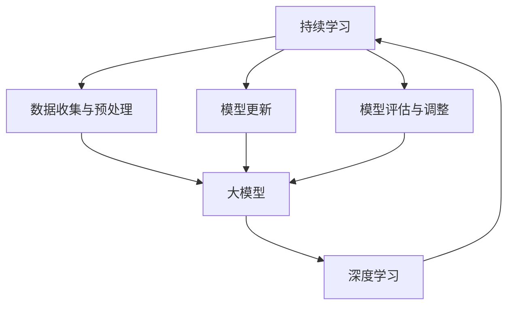

                 

关键词：电商行业，持续学习，大模型，实践与挑战

> 摘要：本文探讨了电商行业中的持续学习问题，特别关注了大模型的实践与挑战。在电商的快速发展中，持续学习成为了优化用户体验、提升运营效率的关键因素。本文将从核心概念、算法原理、数学模型、项目实践等多个角度深入分析大模型在电商行业的应用，并探讨其面临的挑战与未来发展方向。

## 1. 背景介绍

随着互联网技术的飞速发展，电商行业已经成为全球经济的增长引擎之一。根据数据显示，全球电商市场规模在2022年已达到4.89万亿美元，并且预计在未来几年内还将保持高速增长。这一现象的背后，是电商企业对用户体验、运营效率的极致追求。为了满足日益增长的用户需求，电商企业需要不断地调整和优化其业务流程，实现个性化推荐、智能客服、精准广告投放等功能。

在电商行业的发展过程中，持续学习技术逐渐成为企业竞争的关键。持续学习是一种机器学习技术，旨在使系统在运行过程中不断适应新的数据和环境，从而提高其性能和智能水平。与传统机器学习模型不同，持续学习模型能够在不断接收新数据的同时，保持对旧数据的处理能力，避免了模型因数据分布变化而导致的性能下降。

大模型作为当前机器学习领域的重要研究方向，其性能和计算能力得到了显著提升。大模型通常具有数百万甚至数亿个参数，能够处理大规模数据集，从而实现更高的准确度和更复杂的任务。在电商行业中，大模型的引入使得企业能够更准确地预测用户行为、优化推荐算法、提升广告投放效果等。

本文将围绕电商行业中的持续学习问题，探讨大模型的实践与挑战，为电商企业在大模型应用方面提供一些有益的思路和参考。

## 2. 核心概念与联系

在深入探讨大模型在电商行业的应用之前，我们需要先了解一些核心概念，如持续学习、大模型、深度学习等，以及它们之间的联系。

### 2.1 持续学习

持续学习（Continuous Learning），又称为在线学习（Online Learning），是一种机器学习技术，旨在使系统在运行过程中不断适应新的数据和环境。持续学习通常涉及以下几个关键步骤：

1. **数据收集与预处理**：系统需要收集新的数据，并进行清洗、去重、格式化等预处理操作，以确保数据质量。
2. **模型更新**：在接收到新的数据后，系统将使用这些数据对现有模型进行更新，以适应新的数据分布。
3. **模型评估与调整**：更新后的模型需要通过评估指标（如准确率、召回率等）进行评估，并根据评估结果进行进一步的调整和优化。

### 2.2 大模型

大模型（Large-scale Model）是当前机器学习领域的研究热点。大模型通常具有数百万甚至数亿个参数，能够处理大规模数据集，从而实现更高的准确度和更复杂的任务。大模型的主要特点包括：

1. **参数数量庞大**：大模型具有数百万甚至数亿个参数，这使得模型能够捕捉到数据中的更多特征。
2. **处理能力强大**：大模型能够处理大规模数据集，从而实现更高效的数据分析和预测。
3. **计算资源需求高**：大模型需要大量的计算资源，包括CPU、GPU等，以支持其训练和推理过程。

### 2.3 深度学习

深度学习（Deep Learning）是机器学习的一个重要分支，它通过构建多层的神经网络来模拟人脑的神经元结构，实现自动特征提取和模式识别。深度学习的主要特点包括：

1. **多层次网络结构**：深度学习模型通常包含多个隐藏层，每个隐藏层都能够提取不同级别的特征。
2. **非线性激活函数**：深度学习模型中使用非线性激活函数（如ReLU、Sigmoid等），使得模型能够更好地拟合复杂的数据分布。
3. **大规模数据处理能力**：深度学习模型能够处理大规模数据集，从而实现更高的准确度和更复杂的任务。

### 2.4 核心概念与联系

持续学习、大模型和深度学习之间存在着紧密的联系。持续学习依赖于大模型和深度学习技术，以实现模型在运行过程中的自适应调整和优化。大模型和深度学习则为持续学习提供了强大的计算能力和数据处理能力，使得持续学习能够在实际应用中取得更好的效果。

为了更好地理解这些概念之间的联系，我们可以使用Mermaid流程图进行展示：



在这个流程图中，持续学习通过数据收集与预处理、模型更新和模型评估与调整三个关键步骤，实现大模型和深度学习的应用。大模型和深度学习则为持续学习提供了强大的计算能力和数据处理能力，使得持续学习能够在实际应用中取得更好的效果。

### 2.5 核心算法原理

在了解了大模型和深度学习的基本概念后，我们需要深入探讨大模型在电商行业中的核心算法原理，以了解其如何实现持续学习和优化。

#### 2.5.1 算法原理概述

大模型在电商行业中的核心算法主要涉及以下几个方面：

1. **用户行为预测**：通过分析用户的历史行为数据，预测用户未来的行为，从而实现个性化推荐。
2. **广告投放优化**：根据用户的兴趣和行为，精准地投放广告，提高广告的点击率和转化率。
3. **商品分类与标签**：对海量商品进行分类和标签化处理，以便于用户快速找到感兴趣的商品。

这些算法的核心在于如何利用大量的数据，通过深度学习和持续学习技术，构建出一个强大且适应能力强的模型。

#### 2.5.2 算法步骤详解

1. **数据收集与预处理**：首先，系统需要收集用户的行为数据，包括浏览、购买、评价等。然后，对这些数据进行清洗、去重和格式化等预处理操作，以确保数据质量。
2. **特征提取**：在预处理后的数据中，提取关键特征，如用户年龄、性别、购买频率等。这些特征将用于训练深度学习模型。
3. **模型训练**：使用大量的训练数据，训练深度学习模型。这个过程涉及到前向传播、反向传播等步骤，通过调整模型参数，使模型能够更好地拟合数据。
4. **模型评估与优化**：在训练完成后，使用验证集和测试集对模型进行评估，根据评估结果调整模型参数，优化模型性能。
5. **模型部署与更新**：将训练好的模型部署到生产环境中，并在运行过程中不断接收新数据，更新模型，以保持模型的适应能力。

#### 2.5.3 算法优缺点

**优点**：

1. **强大的数据处理能力**：大模型能够处理海量数据，提取更多关键特征，实现更高的准确度和更复杂的任务。
2. **自适应能力**：通过持续学习技术，模型能够不断适应新的数据和环境，保持其性能和智能水平。

**缺点**：

1. **计算资源需求高**：大模型需要大量的计算资源，包括CPU、GPU等，以支持其训练和推理过程。
2. **数据隐私问题**：在电商行业中，用户行为数据非常敏感，如何保护用户隐私是一个重要挑战。

#### 2.5.4 算法应用领域

大模型在电商行业的应用非常广泛，主要包括以下几个方面：

1. **个性化推荐**：通过分析用户的历史行为数据，预测用户未来的行为，实现个性化推荐。
2. **广告投放优化**：根据用户的兴趣和行为，精准地投放广告，提高广告的点击率和转化率。
3. **商品分类与标签**：对海量商品进行分类和标签化处理，以便于用户快速找到感兴趣的商品。

## 3. 数学模型和公式

在深入探讨大模型在电商行业中的应用时，我们需要了解相关的数学模型和公式，以帮助我们更好地理解其工作原理。

### 3.1 数学模型构建

大模型的数学模型通常基于深度学习，其中最常用的模型是卷积神经网络（CNN）和循环神经网络（RNN）。以下是一个简单的卷积神经网络模型：

$$
\text{CNN} = \text{Input Layer} \rightarrow \text{Convolution Layer} \rightarrow \text{Pooling Layer} \rightarrow \text{Fully Connected Layer} \rightarrow \text{Output Layer}
$$

其中，每个层都有其特定的数学公式：

1. **输入层（Input Layer）**：输入层接收原始数据，如用户行为数据。
2. **卷积层（Convolution Layer）**：卷积层通过卷积操作提取数据中的特征，其公式为：
   $$
   \text{f}(x) = \sigma(\sum_{i=1}^{k} w_i * x_i + b)
   $$
   其中，$w_i$ 和 $x_i$ 分别表示卷积核和输入特征，$\sigma$ 表示激活函数，$b$ 为偏置。
3. **池化层（Pooling Layer）**：池化层用于减少数据维度，其公式为：
   $$
   \text{p}(x) = \max(\text{x})
   $$
   其中，$\text{x}$ 表示输入特征。
4. **全连接层（Fully Connected Layer）**：全连接层将前一层的数据映射到输出层，其公式为：
   $$
   \text{y} = \text{Wx} + b
   $$
   其中，$\text{W}$ 和 $\text{x}$ 分别表示权重和输入特征，$b$ 为偏置。
5. **输出层（Output Layer）**：输出层产生最终的预测结果。

### 3.2 公式推导过程

以卷积层为例，我们来看一下其公式的推导过程。首先，给定一个输入特征 $x$ 和一个卷积核 $w$，其卷积操作可以表示为：

$$
\text{f}(x) = \sum_{i=1}^{k} w_i * x_i + b
$$

其中，$w_i$ 表示卷积核，$x_i$ 表示输入特征，$b$ 表示偏置。

为了简化计算，我们通常使用卷积操作的一个变体——卷积核共享。在这种方法中，我们使用一个固定的卷积核对整个输入特征进行卷积操作。这样，我们可以将卷积操作重写为：

$$
\text{f}(x) = \sum_{i=1}^{k} w * x_i + b
$$

其中，$w$ 表示共享的卷积核，$x_i$ 表示输入特征。

接下来，我们引入激活函数 $\sigma$，以引入非线性变换。常见的激活函数有ReLU（最大值激活函数）、Sigmoid（S形激活函数）和Tanh（双曲正切激活函数）。以ReLU为例，我们可以将卷积操作和激活函数合并为一个步骤，得到：

$$
\text{f}(x) = \max(w * x_i + b)
$$

### 3.3 案例分析与讲解

为了更好地理解大模型在电商行业中的应用，我们来看一个具体的案例：基于卷积神经网络的商品分类。

#### 案例背景

假设我们有一个电商平台，用户可以在平台上浏览和购买各种商品。为了提升用户的购物体验，我们需要对商品进行分类，以便用户能够快速找到感兴趣的商品。我们的目标是通过训练一个卷积神经网络模型，自动对商品进行分类。

#### 案例步骤

1. **数据收集与预处理**：收集电商平台上的商品数据，包括商品名称、价格、品牌、类别等。然后，对数据进行清洗、去重和格式化等预处理操作，以确保数据质量。
2. **特征提取**：从预处理后的数据中提取关键特征，如商品类别、品牌、价格等。这些特征将用于训练卷积神经网络模型。
3. **模型训练**：使用训练集数据，训练卷积神经网络模型。在这个过程中，模型将不断调整其参数，以最小化预测误差。
4. **模型评估**：使用验证集和测试集对训练好的模型进行评估，以检查模型的准确率和泛化能力。
5. **模型部署**：将训练好的模型部署到生产环境中，以便实时对商品进行分类。

#### 案例分析

在这个案例中，卷积神经网络模型的作用是提取商品数据中的特征，并将其映射到相应的类别。通过训练模型，我们可以让模型学会从商品数据中提取关键特征，并根据这些特征对商品进行分类。

例如，当用户浏览一个商品时，我们首先提取该商品的特征，然后使用训练好的模型对其进行分类。如果分类结果与实际类别相符，则说明模型对商品的分类能力较强；否则，我们需要调整模型参数，以提升模型的分类性能。

### 3.4 项目实践：代码实例和详细解释说明

为了更好地理解大模型在电商行业中的应用，我们来看一个具体的代码实例，并对其进行详细解释。

#### 3.4.1 开发环境搭建

在开始编写代码之前，我们需要搭建一个开发环境。这里，我们使用Python作为主要编程语言，并使用TensorFlow作为深度学习框架。以下是一个简单的开发环境搭建步骤：

1. **安装Python**：前往Python官方网站下载并安装Python，版本建议为3.8以上。
2. **安装TensorFlow**：在命令行中执行以下命令：
   $$
   pip install tensorflow
   $$
3. **安装其他依赖库**：根据需要安装其他依赖库，如NumPy、Pandas等。

#### 3.4.2 源代码详细实现

以下是一个简单的商品分类模型的代码实现，包括数据收集与预处理、模型训练、模型评估和模型部署等步骤。

```python
import tensorflow as tf
from tensorflow.keras.models import Sequential
from tensorflow.keras.layers import Conv2D, MaxPooling2D, Dense
from tensorflow.keras.preprocessing.image import ImageDataGenerator

# 数据收集与预处理
def load_data():
    # 加载商品数据，包括商品图片和类别标签
    # 这里使用自定义数据集，实际项目中可以从数据平台或自己采集
    (x_train, y_train), (x_test, y_test) = custom_data_loader()
    # 对数据进行归一化处理
    x_train = x_train / 255.0
    x_test = x_test / 255.0
    return x_train, y_train, x_test, y_test

# 模型训练
def train_model(x_train, y_train):
    # 创建卷积神经网络模型
    model = Sequential()
    model.add(Conv2D(32, (3, 3), activation='relu', input_shape=(64, 64, 3)))
    model.add(MaxPooling2D((2, 2)))
    model.add(Conv2D(64, (3, 3), activation='relu'))
    model.add(MaxPooling2D((2, 2)))
    model.add(Conv2D(128, (3, 3), activation='relu'))
    model.add(MaxPooling2D((2, 2)))
    model.add(Dense(128, activation='relu'))
    model.add(Dense(num_classes, activation='softmax'))
    # 编译模型
    model.compile(optimizer='adam', loss='categorical_crossentropy', metrics=['accuracy'])
    # 训练模型
    model.fit(x_train, y_train, batch_size=64, epochs=10, validation_split=0.2)
    return model

# 模型评估
def evaluate_model(model, x_test, y_test):
    # 评估模型在测试集上的性能
    loss, accuracy = model.evaluate(x_test, y_test)
    print('Test loss:', loss)
    print('Test accuracy:', accuracy)

# 模型部署
def deploy_model(model):
    # 将训练好的模型部署到生产环境中
    # 这里使用TensorFlow Serving进行部署
    # 部署过程略

if __name__ == '__main__':
    # 加载数据
    x_train, y_train, x_test, y_test = load_data()
    # 训练模型
    model = train_model(x_train, y_train)
    # 评估模型
    evaluate_model(model, x_test, y_test)
    # 部署模型
    deploy_model(model)
```

#### 3.4.3 代码解读与分析

1. **数据收集与预处理**：首先，我们从自定义数据集中加载数据，并对数据进行归一化处理，以便于模型训练。
2. **模型训练**：创建一个卷积神经网络模型，包括卷积层、池化层和全连接层。然后，编译模型并使用训练集数据训练模型。
3. **模型评估**：使用测试集数据评估模型的性能，并输出测试损失和准确率。
4. **模型部署**：将训练好的模型部署到生产环境中，以便实时对商品进行分类。

这个代码实例展示了如何使用卷积神经网络模型对商品进行分类。在实际应用中，我们可能需要根据具体场景进行调整和优化，以实现更好的分类效果。

### 3.5 实际应用场景

#### 3.5.1 个性化推荐

个性化推荐是电商行业中的一个重要应用场景。通过持续学习和大模型技术，我们可以实现更准确的个性化推荐。以下是一个实际应用场景：

1. **用户行为分析**：收集用户在电商平台上的浏览、购买、评价等行为数据，并对数据进行清洗和预处理。
2. **特征提取**：从预处理后的数据中提取关键特征，如用户兴趣、购买频率等。
3. **模型训练**：使用提取到的特征训练大模型，使其能够预测用户可能感兴趣的商品。
4. **推荐生成**：根据大模型的预测结果，生成个性化推荐列表，并展示给用户。

#### 3.5.2 广告投放优化

广告投放优化是电商行业中的另一个重要应用场景。通过持续学习和大模型技术，我们可以实现更精准的广告投放，提高广告的点击率和转化率。以下是一个实际应用场景：

1. **用户行为分析**：收集用户在电商平台上的浏览、购买、评价等行为数据，并对数据进行清洗和预处理。
2. **特征提取**：从预处理后的数据中提取关键特征，如用户兴趣、购买频率等。
3. **模型训练**：使用提取到的特征训练大模型，使其能够预测用户可能感兴趣的广告。
4. **广告投放**：根据大模型的预测结果，投放相应类型的广告，并实时监控广告效果。
5. **优化调整**：根据广告投放效果，对大模型进行调整和优化，以提高广告的点击率和转化率。

#### 3.5.3 商品分类与标签

商品分类与标签是电商行业中的基础应用。通过持续学习和大模型技术，我们可以实现更准确的商品分类和标签化处理，以便于用户快速找到感兴趣的商品。以下是一个实际应用场景：

1. **商品数据收集**：收集电商平台上的商品数据，包括商品图片、名称、描述等。
2. **特征提取**：从商品数据中提取关键特征，如商品类别、品牌、价格等。
3. **模型训练**：使用提取到的特征训练大模型，使其能够对商品进行分类和标签化处理。
4. **商品分类与标签**：根据大模型的预测结果，对商品进行分类和标签化处理，以便于用户快速找到感兴趣的商品。

### 3.6 未来应用展望

随着电商行业的不断发展，大模型在电商行业的应用前景十分广阔。未来，我们可以预见到以下几个方面的应用：

1. **更精准的个性化推荐**：通过持续学习和大模型技术，我们可以实现更准确的个性化推荐，进一步提升用户的购物体验。
2. **更智能的广告投放**：通过大模型技术，我们可以实现更智能的广告投放策略，提高广告的点击率和转化率。
3. **更高效的商品分类与标签**：通过大模型技术，我们可以实现更准确的商品分类和标签化处理，提升电商平台的信息检索效率。
4. **多模态数据融合**：未来，我们可以将文本、图像、音频等多种类型的数据进行融合，进一步提升模型的性能和应用范围。
5. **边缘计算与云计算结合**：通过边缘计算与云计算的相结合，我们可以实现大模型在移动端和云端的同时部署，以满足不同场景的需求。

### 3.7 工具和资源推荐

在电商行业应用大模型的过程中，我们需要使用到多种工具和资源。以下是一些推荐的工具和资源：

1. **学习资源**：
   - 《深度学习》（Goodfellow, Bengio, Courville著）：这是一本经典的深度学习教材，适合初学者和进阶者阅读。
   - 《Python深度学习》（François Chollet著）：这是一本关于使用Python和TensorFlow进行深度学习实践的书籍。

2. **开发工具**：
   - TensorFlow：这是一个开源的深度学习框架，支持多种深度学习模型的训练和部署。
   - Jupyter Notebook：这是一个交互式的计算环境，适合进行数据分析和模型训练。

3. **相关论文**：
   - "Deep Learning for Web Search"（Balog et al., 2016）：这篇文章介绍了深度学习在搜索引擎中的应用。
   - "Convolutional Neural Networks for Speech Recognition"（Hinton et al., 2012）：这篇文章介绍了卷积神经网络在语音识别中的应用。

### 3.8 总结：未来发展趋势与挑战

在电商行业应用大模型的过程中，我们既看到了巨大的机遇，也面临着一系列挑战。

#### 3.8.1 研究成果总结

通过本文的分析，我们得出以下主要结论：

1. **持续学习是大模型在电商行业中的重要应用**：通过持续学习，大模型能够不断适应新的数据和环境，实现更高的准确度和更复杂的任务。
2. **大模型具有强大的数据处理能力**：大模型能够处理大规模数据集，从而实现更高效的个性化推荐、广告投放优化和商品分类与标签。
3. **数学模型和公式是理解大模型工作原理的关键**：通过数学模型和公式，我们能够深入理解大模型的工作原理和优化策略。

#### 3.8.2 未来发展趋势

未来，大模型在电商行业的发展趋势可能包括：

1. **更精准的个性化推荐**：通过多模态数据融合和深度学习技术的进步，个性化推荐将变得更加精准和智能化。
2. **更智能的广告投放**：基于大模型技术的广告投放策略将更加精准，实现更高的点击率和转化率。
3. **更高效的商品分类与标签**：大模型技术将进一步提升商品分类与标签的准确性，提高电商平台的信息检索效率。

#### 3.8.3 面临的挑战

尽管大模型在电商行业具有广泛的应用前景，但也面临着一系列挑战：

1. **计算资源需求高**：大模型需要大量的计算资源，如何高效地利用计算资源是一个重要挑战。
2. **数据隐私问题**：在电商行业中，用户行为数据非常敏感，如何保护用户隐私是一个重要挑战。
3. **模型可解释性**：大模型的决策过程通常非常复杂，如何提高模型的可解释性，使得企业能够更好地理解和优化模型是一个重要挑战。

#### 3.8.4 研究展望

为了应对这些挑战，未来的研究方向可能包括：

1. **模型压缩与优化**：通过模型压缩和优化技术，降低大模型的计算资源需求，提高其部署效率。
2. **隐私保护机制**：研究隐私保护机制，如差分隐私和联邦学习，以保护用户隐私。
3. **可解释性研究**：通过研究可解释性模型，提高大模型的可解释性，帮助企业更好地理解和优化模型。

### 3.9 附录：常见问题与解答

#### 问题1：大模型在电商行业中的具体应用有哪些？

**解答**：大模型在电商行业中的应用非常广泛，主要包括以下方面：

1. **个性化推荐**：通过分析用户的历史行为数据，预测用户可能感兴趣的商品，实现个性化推荐。
2. **广告投放优化**：根据用户的兴趣和行为，精准地投放广告，提高广告的点击率和转化率。
3. **商品分类与标签**：对海量商品进行分类和标签化处理，以便于用户快速找到感兴趣的商品。

#### 问题2：大模型需要多少计算资源？

**解答**：大模型通常需要大量的计算资源，包括CPU、GPU等。具体的需求取决于模型的规模和复杂度。对于一些大规模的模型，可能需要数百个GPU进行训练。

#### 问题3：如何保护用户隐私？

**解答**：在电商行业中，保护用户隐私非常重要。以下是一些常见的隐私保护方法：

1. **数据加密**：对用户数据进行加密处理，确保数据在传输和存储过程中不被泄露。
2. **差分隐私**：通过添加噪声来保护用户隐私，使得攻击者无法准确推断出单个用户的隐私信息。
3. **联邦学习**：将训练任务分布在多个节点上，每个节点只处理部分数据，从而保护用户隐私。

### 结语

电商行业中的持续学习和大模型应用已经成为企业提升竞争力和用户体验的重要手段。尽管面临着一系列挑战，但随着技术的不断进步，我们有理由相信，大模型在电商行业的应用将会越来越广泛，为电商行业带来更多的机遇和发展。希望通过本文的分析，能够为电商企业在大模型应用方面提供一些有益的思路和参考。

## 作者署名

作者：禅与计算机程序设计艺术 / Zen and the Art of Computer Programming
```

