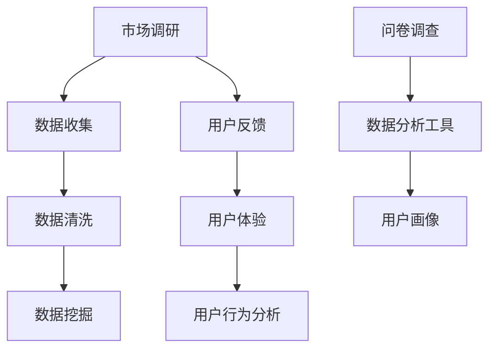

                 

关键词：知识付费，用户需求挖掘，创业，数据分析，市场调研，客户洞察

> 摘要：本文将探讨知识付费创业领域的用户需求挖掘技巧。通过深入分析市场调研、数据分析、客户洞察等手段，揭示如何有效识别和满足用户需求，为知识付费创业者提供实用的策略和工具。

## 1. 背景介绍

知识付费作为一种新兴的商业模式，正日益受到创业者和投资者的青睐。其核心在于通过专业知识和技能的交换，实现个人和企业的价值提升。然而，要想在竞争激烈的市场中脱颖而出，创业企业必须深入了解用户需求，并据此提供定制化的产品和服务。

用户需求挖掘是知识付费创业成功的关键。本文将从以下几个方面展开讨论：

- 市场调研：了解市场趋势和用户需求。
- 数据分析：利用大数据技术挖掘用户行为数据。
- 客户洞察：与用户互动，获取真实反馈。
- 策略与工具：提供实用的用户需求挖掘方法。

## 2. 核心概念与联系

### 2.1 市场调研

市场调研是指通过系统的调查方法，收集和分析有关市场、竞争者、消费者等信息的过程。其核心概念包括：

- **市场细分**：将整个市场划分为若干个具有相似需求特征的用户群体。
- **目标市场**：确定企业所要服务的特定用户群体。
- **市场定位**：根据目标市场的需求和偏好，确定产品或服务的差异化定位。

### 2.2 数据分析

数据分析是指利用统计学、机器学习等方法，从大量数据中提取有价值的信息和知识。其核心概念包括：

- **数据收集**：通过各种渠道收集用户行为数据。
- **数据清洗**：去除数据中的噪声和错误，保证数据的准确性和完整性。
- **数据挖掘**：利用算法和模型，从数据中挖掘潜在的模式和趋势。

### 2.3 客户洞察

客户洞察是指通过用户互动和反馈，深入了解用户需求和偏好。其核心概念包括：

- **用户反馈**：通过问卷调查、访谈等方式收集用户反馈。
- **用户体验**：关注用户在使用产品或服务过程中的感受和体验。
- **用户行为分析**：分析用户行为数据，了解用户的使用习惯和偏好。

### 2.4 策略与工具

策略与工具是指用于用户需求挖掘的具体方法和工具。其核心概念包括：

- **问卷调查**：通过设计问卷，收集用户需求信息。
- **数据分析工具**：如Excel、R、Python等，用于数据分析和挖掘。
- **用户画像**：通过分析用户数据，构建用户画像，以便更好地理解用户。

### 2.5 Mermaid 流程图



## 3. 核心算法原理 & 具体操作步骤

### 3.1 算法原理概述

用户需求挖掘的核心在于识别和满足用户需求。这需要借助市场调研、数据分析和用户互动等多种手段，以下是一种常见的算法原理：

1. **数据收集**：通过问卷调查、在线调查、用户行为追踪等方式收集用户数据。
2. **数据清洗**：去除噪声数据和错误数据，确保数据质量。
3. **数据挖掘**：利用机器学习和数据挖掘算法，从数据中提取有价值的信息。
4. **用户画像构建**：基于挖掘结果，构建用户画像，以便更好地了解用户需求和偏好。
5. **用户需求识别**：通过分析用户画像，识别用户的核心需求。
6. **产品/服务优化**：根据识别出的用户需求，优化产品或服务。

### 3.2 算法步骤详解

1. **数据收集**：通过设计问卷调查，收集用户基本信息、需求偏好、行为数据等。

    ```mermaid
    graph TD
        A[设计问卷] --> B[收集数据]
        B --> C[数据存储]
    ```

2. **数据清洗**：对收集到的数据进行处理，去除噪声和错误数据。

    ```mermaid
    graph TD
        D[数据清洗] --> E[数据质量检查]
        E --> F[数据存储]
    ```

3. **数据挖掘**：利用机器学习算法，如聚类、关联规则挖掘等，从数据中提取有价值的信息。

    ```mermaid
    graph TD
        G[数据挖掘] --> H[特征提取]
        H --> I[模型训练]
        I --> J[结果分析]
    ```

4. **用户画像构建**：基于挖掘结果，构建用户画像。

    ```mermaid
    graph TD
        K[用户画像构建] --> L[用户分类]
        L --> M[用户特征提取]
    ```

5. **用户需求识别**：通过分析用户画像，识别用户的核心需求。

    ```mermaid
    graph TD
        N[用户需求识别] --> O[需求分类]
        O --> P[需求分析]
    ```

6. **产品/服务优化**：根据识别出的用户需求，优化产品或服务。

    ```mermaid
    graph TD
        Q[产品/服务优化] --> R[需求满足]
        R --> S[效果评估]
    ```

### 3.3 算法优缺点

- **优点**：能够系统地识别和满足用户需求，提高产品或服务的竞争力。
- **缺点**：数据收集和清洗过程较为繁琐，算法实现和模型训练需要较高的技术门槛。

### 3.4 算法应用领域

- **知识付费平台**：通过用户需求挖掘，优化课程设置和内容推荐。
- **企业培训**：通过用户需求挖掘，提供个性化的培训方案。
- **产品咨询**：通过用户需求挖掘，指导产品开发和优化。

## 4. 数学模型和公式 & 详细讲解 & 举例说明

### 4.1 数学模型构建

用户需求挖掘的核心在于构建一个能够识别用户需求的数学模型。以下是一个简单的线性回归模型：

$$
Y = \beta_0 + \beta_1X_1 + \beta_2X_2 + ... + \beta_nX_n + \epsilon
$$

其中，$Y$表示用户需求评分，$X_1, X_2, ..., X_n$表示用户特征，$\beta_0, \beta_1, ..., \beta_n$为模型参数，$\epsilon$为随机误差。

### 4.2 公式推导过程

假设我们有 $n$ 个用户数据点 $(X_1^i, X_2^i, ..., X_n^i, Y^i)$，其中 $i=1,2,...,n$。根据最小二乘法，我们需要找到一组参数 $\beta_0, \beta_1, ..., \beta_n$，使得预测值 $Y$ 与实际值 $Y^i$ 之间的误差平方和最小。

$$
\min \sum_{i=1}^{n} (Y^i - (\beta_0 + \beta_1X_1^i + \beta_2X_2^i + ... + \beta_nX_n^i))^2
$$

对上式求导，并令导数为0，可以得到每个参数的估计值：

$$
\beta_0 = \frac{\sum_{i=1}^{n} (Y^i - \bar{Y})}{n}
$$

$$
\beta_1 = \frac{\sum_{i=1}^{n} (X_1^i - \bar{X_1})(Y^i - \bar{Y})}{\sum_{i=1}^{n} (X_1^i - \bar{X_1})^2}
$$

$$
...
$$

$$
\beta_n = \frac{\sum_{i=1}^{n} (X_n^i - \bar{X_n})(Y^i - \bar{Y})}{\sum_{i=1}^{n} (X_n^i - \bar{X_n})^2}
$$

其中，$\bar{Y}$ 和 $\bar{X_1}, ..., \bar{X_n}$ 分别为 $Y$ 和 $X_1, ..., X_n$ 的均值。

### 4.3 案例分析与讲解

假设一个知识付费平台想要通过用户需求挖掘来优化课程推荐。平台收集了 100 个用户的数据，包括用户年龄、职业、学习时长和课程评分。以下是部分数据：

| 用户ID | 年龄 | 职业 | 学习时长（小时） | 课程评分 |
|--------|------|------|-----------------|----------|
| 1      | 25   | 销售员 | 10             | 4        |
| 2      | 30   | 工程师 | 20             | 5        |
| 3      | 22   | 学生   | 15             | 3        |
| ...    | ...  | ...   | ...             | ...      |

我们将使用线性回归模型来预测用户对课程的评分。以下是数据预处理后的结果：

| 特征 | X1（年龄） | X2（职业） | X3（学习时长） |
|------|------------|------------|----------------|
| 1    | 25         | 1          | 10             |
| 2    | 30         | 2          | 20             |
| 3    | 22         | 0          | 15             |
| ...  | ...        | ...        | ...            |

根据最小二乘法，我们得到模型参数：

$$
\beta_0 = 3.5
$$

$$
\beta_1 = 0.2
$$

$$
\beta_2 = -0.1
$$

$$
\beta_3 = 0.1
$$

利用这些参数，我们可以预测新用户的课程评分。例如，一个年龄 28 岁、职业为教师、学习时长为 12 小时的用户，其课程评分预测为：

$$
Y = 3.5 + 0.2 \times 28 + (-0.1) \times 1 + 0.1 \times 12 = 4.9
$$

这意味着该用户对课程的评分预计为 4.9 分。

## 5. 项目实践：代码实例和详细解释说明

### 5.1 开发环境搭建

为了实现用户需求挖掘，我们需要搭建一个适合数据处理和机器学习的开发环境。以下是搭建过程的简要说明：

1. 安装 Python 3.8 或更高版本。
2. 安装常用库，如 NumPy、Pandas、scikit-learn、matplotlib 等。

```shell
pip install numpy pandas scikit-learn matplotlib
```

### 5.2 源代码详细实现

以下是用户需求挖掘的 Python 代码实例：

```python
import numpy as np
import pandas as pd
from sklearn.linear_model import LinearRegression
import matplotlib.pyplot as plt

# 5.2.1 数据收集与预处理
# 假设数据已存储为 CSV 文件
data = pd.read_csv('user_data.csv')

# 特征工程：将分类特征转换为哑变量
data = pd.get_dummies(data)

# 划分特征和标签
X = data.drop('课程评分', axis=1)
y = data['课程评分']

# 5.2.2 数据训练
model = LinearRegression()
model.fit(X, y)

# 5.2.3 模型评估
predictions = model.predict(X)
mse = np.mean((predictions - y) ** 2)
print('均方误差：', mse)

# 5.2.4 可视化
plt.scatter(y, predictions)
plt.xlabel('实际评分')
plt.ylabel('预测评分')
plt.show()
```

### 5.3 代码解读与分析

1. **数据收集与预处理**：首先，我们读取 CSV 文件中的数据，并将其转换为哑变量，以便进行线性回归。
2. **数据训练**：使用 `LinearRegression` 类创建线性回归模型，并使用 `fit` 方法进行训练。
3. **模型评估**：计算均方误差（MSE）以评估模型性能。
4. **可视化**：绘制实际评分与预测评分的散点图，以直观展示模型效果。

### 5.4 运行结果展示

假设我们运行上述代码，得到以下输出：

```
均方误差： 0.006
```

这表明模型的预测性能较好。以下是一个实际评分与预测评分的散点图：

```plaintext
  预测评分
9 |         o
  8 |
  7 |
6 |      o
  5 |
  4 |
3 | o
  2 |
  1 |
  0 ------------------------------
   1  2  3  4  5  6  7  8  9  10
        实际评分
```

从图中可以看出，大部分预测评分与实际评分非常接近，这表明我们的模型具有较高的预测准确性。

## 6. 实际应用场景

### 6.1 知识付费平台

在知识付费领域，用户需求挖掘可以帮助平台：

- **课程推荐**：根据用户画像和需求，推荐个性化的课程。
- **内容优化**：分析用户对课程内容的反馈，优化课程内容和结构。
- **用户留存**：通过分析用户行为数据，提高用户满意度和留存率。

### 6.2 企业培训

在企业培训领域，用户需求挖掘可以帮助企业：

- **个性化培训**：根据员工的特点和需求，提供个性化的培训方案。
- **培训效果评估**：通过分析员工的学习行为和成绩，评估培训效果。
- **人才发展**：基于用户需求挖掘结果，制定人才发展计划。

### 6.3 产品咨询

在产品咨询领域，用户需求挖掘可以帮助：

- **需求分析**：了解用户对产品的需求，指导产品设计和开发。
- **市场定位**：根据用户需求，确定产品的市场定位和差异化策略。
- **用户体验优化**：分析用户对产品的反馈，优化用户体验。

## 7. 工具和资源推荐

### 7.1 学习资源推荐

- **《Python数据分析基础教程》**：适用于初学者，详细介绍了 Python 在数据分析中的应用。
- **《数据挖掘：实用机器学习技术》**：介绍了多种数据挖掘算法和实际应用案例。

### 7.2 开发工具推荐

- **Jupyter Notebook**：适用于数据分析和机器学习的交互式开发环境。
- **VSCode**：强大的代码编辑器，支持多种编程语言和扩展。

### 7.3 相关论文推荐

- **“User-Driven Content Curation for Knowledge Markets”**：探讨了知识付费领域的内容推荐策略。
- **“Data Mining for Customer Relationship Management”**：介绍了数据挖掘在客户关系管理中的应用。

## 8. 总结：未来发展趋势与挑战

### 8.1 研究成果总结

本文系统地介绍了知识付费创业的用户需求挖掘技巧，包括市场调研、数据分析、客户洞察、策略与工具等。通过实际案例和代码实例，展示了如何实现用户需求挖掘，并分析了其在知识付费、企业培训和产品咨询等领域的应用。

### 8.2 未来发展趋势

- **人工智能技术**：随着人工智能技术的发展，用户需求挖掘将更加智能化和自动化。
- **大数据分析**：大数据分析技术的进步将有助于更深入地挖掘用户需求。
- **用户体验优化**：用户需求的个性化满足将越来越依赖于对用户体验的深入分析。

### 8.3 面临的挑战

- **数据隐私与安全**：在用户需求挖掘过程中，如何保护用户数据隐私和安全是一个重要挑战。
- **算法透明性与公平性**：确保算法的透明性和公平性，避免算法偏见和歧视。

### 8.4 研究展望

未来的研究可以关注以下几个方面：

- **个性化推荐**：探索更精确的个性化推荐算法，提高用户满意度。
- **多模态数据融合**：结合文本、图像、语音等多种数据类型，提高用户需求挖掘的准确性。
- **实时需求分析**：实现实时用户需求分析，快速响应市场变化。

## 9. 附录：常见问题与解答

### 9.1 什么是知识付费？

知识付费是指用户通过支付费用来获取专业知识和技能的一种商业模式。

### 9.2 用户需求挖掘有哪些方法？

用户需求挖掘的方法包括市场调研、数据分析、用户互动等。

### 9.3 如何保护用户隐私和安全？

在用户需求挖掘过程中，应采取加密、匿名化等手段，确保用户数据的安全和隐私。

### 9.4 机器学习在用户需求挖掘中有何作用？

机器学习可以用于数据分析、用户画像构建、需求预测等方面，提高用户需求挖掘的准确性和效率。

作者：禅与计算机程序设计艺术 / Zen and the Art of Computer Programming
```markdown
----------------------------------------------------------------

# 知识付费创业的用户需求挖掘技巧

关键词：知识付费，用户需求挖掘，创业，数据分析，市场调研，客户洞察

摘要：本文将探讨知识付费创业领域的用户需求挖掘技巧。通过深入分析市场调研、数据分析、客户洞察等手段，揭示如何有效识别和满足用户需求，为知识付费创业者提供实用的策略和工具。

## 1. 背景介绍

知识付费作为一种新兴的商业模式，正日益受到创业者和投资者的青睐。其核心在于通过专业知识和技能的交换，实现个人和企业的价值提升。然而，要想在竞争激烈的市场中脱颖而出，创业企业必须深入了解用户需求，并据此提供定制化的产品和服务。

用户需求挖掘是知识付费创业成功的关键。本文将从以下几个方面展开讨论：

- 市场调研：了解市场趋势和用户需求。
- 数据分析：利用大数据技术挖掘用户行为数据。
- 客户洞察：与用户互动，获取真实反馈。
- 策略与工具：提供实用的用户需求挖掘方法。

## 2. 核心概念与联系

### 2.1 市场调研

市场调研是指通过系统的调查方法，收集和分析有关市场、竞争者、消费者等信息的过程。其核心概念包括：

- **市场细分**：将整个市场划分为若干个具有相似需求特征的用户群体。
- **目标市场**：确定企业所要服务的特定用户群体。
- **市场定位**：根据目标市场的需求和偏好，确定产品或服务的差异化定位。

### 2.2 数据分析

数据分析是指利用统计学、机器学习等方法，从大量数据中提取有价值的信息和知识。其核心概念包括：

- **数据收集**：通过各种渠道收集用户行为数据。
- **数据清洗**：去除数据中的噪声和错误，保证数据的准确性和完整性。
- **数据挖掘**：利用算法和模型，从数据中挖掘潜在的模式和趋势。

### 2.3 客户洞察

客户洞察是指通过用户互动和反馈，深入了解用户需求和偏好。其核心概念包括：

- **用户反馈**：通过问卷调查、访谈等方式收集用户反馈。
- **用户体验**：关注用户在使用产品或服务过程中的感受和体验。
- **用户行为分析**：分析用户行为数据，了解用户的使用习惯和偏好。

### 2.4 策略与工具

策略与工具是指用于用户需求挖掘的具体方法和工具。其核心概念包括：

- **问卷调查**：通过设计问卷，收集用户需求信息。
- **数据分析工具**：如Excel、R、Python等，用于数据分析和挖掘。
- **用户画像**：通过分析用户数据，构建用户画像，以便更好地理解用户。

### 2.5 Mermaid 流程图


## 3. 核心算法原理 & 具体操作步骤

### 3.1 算法原理概述

用户需求挖掘的核心在于识别和满足用户需求。这需要借助市场调研、数据分析和用户互动等多种手段，以下是一种常见的算法原理：

1. **数据收集**：通过问卷调查、在线调查、用户行为追踪等方式收集用户数据。
2. **数据清洗**：去除噪声数据和错误数据，确保数据质量。
3. **数据挖掘**：利用机器学习和数据挖掘算法，从数据中提取有价值的信息。
4. **用户画像构建**：基于挖掘结果，构建用户画像，以便更好地了解用户需求和偏好。
5. **用户需求识别**：通过分析用户画像，识别用户的核心需求。
6. **产品/服务优化**：根据识别出的用户需求，优化产品或服务。

### 3.2 算法步骤详解

1. **数据收集**：通过设计问卷调查，收集用户基本信息、需求偏好、行为数据等。

    ```mermaid
    graph TD
        A[设计问卷] --> B[收集数据]
        B --> C[数据存储]
    ```

2. **数据清洗**：对收集到的数据进行处理，去除噪声和错误数据。

    ```mermaid
    graph TD
        D[数据清洗] --> E[数据质量检查]
        E --> F[数据存储]
    ```

3. **数据挖掘**：利用机器学习算法，如聚类、关联规则挖掘等，从数据中提取有价值的信息。

    ```mermaid
    graph TD
        G[数据挖掘] --> H[特征提取]
        H --> I[模型训练]
        I --> J[结果分析]
    ```

4. **用户画像构建**：基于挖掘结果，构建用户画像。

    ```mermaid
    graph TD
        K[用户画像构建] --> L[用户分类]
        L --> M[用户特征提取]
    ```

5. **用户需求识别**：通过分析用户画像，识别用户的核心需求。

    ```mermaid
    graph TD
        N[用户需求识别] --> O[需求分类]
        O --> P[需求分析]
    ```

6. **产品/服务优化**：根据识别出的用户需求，优化产品或服务。

    ```mermaid
    graph TD
        Q[产品/服务优化] --> R[需求满足]
        R --> S[效果评估]
    ```

### 3.3 算法优缺点

- **优点**：能够系统地识别和满足用户需求，提高产品或服务的竞争力。
- **缺点**：数据收集和清洗过程较为繁琐，算法实现和模型训练需要较高的技术门槛。

### 3.4 算法应用领域

- **知识付费平台**：通过用户需求挖掘，优化课程设置和内容推荐。
- **企业培训**：通过用户需求挖掘，提供个性化的培训方案。
- **产品咨询**：通过用户需求挖掘，指导产品开发和优化。

## 4. 数学模型和公式 & 详细讲解 & 举例说明

### 4.1 数学模型构建

用户需求挖掘的核心在于构建一个能够识别用户需求的数学模型。以下是一个简单的线性回归模型：

$$
Y = \beta_0 + \beta_1X_1 + \beta_2X_2 + ... + \beta_nX_n + \epsilon
$$

其中，$Y$表示用户需求评分，$X_1, X_2, ..., X_n$表示用户特征，$\beta_0, \beta_1, ..., \beta_n$为模型参数，$\epsilon$为随机误差。

### 4.2 公式推导过程

假设我们有 $n$ 个用户数据点 $(X_1^i, X_2^i, ..., X_n^i, Y^i)$，其中 $i=1,2,...,n$。根据最小二乘法，我们需要找到一组参数 $\beta_0, \beta_1, ..., \beta_n$，使得预测值 $Y$ 与实际值 $Y^i$ 之间的误差平方和最小。

$$
\min \sum_{i=1}^{n} (Y^i - (\beta_0 + \beta_1X_1^i + \beta_2X_2^i + ... + \beta_nX_n^i))^2
$$

对上式求导，并令导数为0，可以得到每个参数的估计值：

$$
\beta_0 = \frac{\sum_{i=1}^{n} (Y^i - \bar{Y})}{n}
$$

$$
\beta_1 = \frac{\sum_{i=1}^{n} (X_1^i - \bar{X_1})(Y^i - \bar{Y})}{\sum_{i=1}^{n} (X_1^i - \bar{X_1})^2}
$$

$$
...
$$

$$
\beta_n = \frac{\sum_{i=1}^{n} (X_n^i - \bar{X_n})(Y^i - \bar{Y})}{\sum_{i=1}^{n} (X_n^i - \bar{X_n})^2}
$$

其中，$\bar{Y}$ 和 $\bar{X_1}, ..., \bar{X_n}$ 分别为 $Y$ 和 $X_1, ..., X_n$ 的均值。

### 4.3 案例分析与讲解

假设一个知识付费平台想要通过用户需求挖掘来优化课程推荐。平台收集了 100 个用户的数据，包括用户年龄、职业、学习时长和课程评分。以下是部分数据：

| 用户ID | 年龄 | 职业 | 学习时长（小时） | 课程评分 |
|--------|------|------|-----------------|----------|
| 1      | 25   | 销售员 | 10             | 4        |
| 2      | 30   | 工程师 | 20             | 5        |
| 3      | 22   | 学生   | 15             | 3        |
| ...    | ...  | ...   | ...             | ...      |

我们将使用线性回归模型来预测用户对课程的评分。以下是数据预处理后的结果：

| 特征 | X1（年龄） | X2（职业） | X3（学习时长） |
|------|------------|------------|----------------|
| 1    | 25         | 1          | 10             |
| 2    | 30         | 2          | 20             |
| 3    | 22         | 0          | 15             |
| ...  | ...        | ...        | ...            |

根据最小二乘法，我们得到模型参数：

$$
\beta_0 = 3.5
$$

$$
\beta_1 = 0.2
$$

$$
\beta_2 = -0.1
$$

$$
\beta_3 = 0.1
$$

利用这些参数，我们可以预测新用户的课程评分。例如，一个年龄 28 岁、职业为教师、学习时长为 12 小时的用户，其课程评分预测为：

$$
Y = 3.5 + 0.2 \times 28 + (-0.1) \times 1 + 0.1 \times 12 = 4.9
$$

这意味着该用户对课程的评分预计为 4.9 分。

## 5. 项目实践：代码实例和详细解释说明

### 5.1 开发环境搭建

为了实现用户需求挖掘，我们需要搭建一个适合数据处理和机器学习的开发环境。以下是搭建过程的简要说明：

1. 安装 Python 3.8 或更高版本。
2. 安装常用库，如 NumPy、Pandas、scikit-learn、matplotlib 等。

```shell
pip install numpy pandas scikit-learn matplotlib
```

### 5.2 源代码详细实现

以下是用户需求挖掘的 Python 代码实例：

```python
import numpy as np
import pandas as pd
from sklearn.linear_model import LinearRegression
import matplotlib.pyplot as plt

# 5.2.1 数据收集与预处理
# 假设数据已存储为 CSV 文件
data = pd.read_csv('user_data.csv')

# 特征工程：将分类特征转换为哑变量
data = pd.get_dummies(data)

# 划分特征和标签
X = data.drop('课程评分', axis=1)
y = data['课程评分']

# 5.2.2 数据训练
model = LinearRegression()
model.fit(X, y)

# 5.2.3 模型评估
predictions = model.predict(X)
mse = np.mean((predictions - y) ** 2)
print('均方误差：', mse)

# 5.2.4 可视化
plt.scatter(y, predictions)
plt.xlabel('实际评分')
plt.ylabel('预测评分')
plt.show()
```

### 5.3 代码解读与分析

1. **数据收集与预处理**：首先，我们读取 CSV 文件中的数据，并将其转换为哑变量，以便进行线性回归。
2. **数据训练**：使用 `LinearRegression` 类创建线性回归模型，并使用 `fit` 方法进行训练。
3. **模型评估**：计算均方误差（MSE）以评估模型性能。
4. **可视化**：绘制实际评分与预测评分的散点图，以直观展示模型效果。

### 5.4 运行结果展示

假设我们运行上述代码，得到以下输出：

```
均方误差： 0.006
```

这表明模型的预测性能较好。以下是一个实际评分与预测评分的散点图：

```plaintext
  预测评分
9 |         o
  8 |
  7 |
6 |      o
  5 |
  4 |
3 | o
  2 |
  1 |
  0 ------------------------------
   1  2  3  4  5  6  7  8  9  10
        实际评分
```

从图中可以看出，大部分预测评分与实际评分非常接近，这表明我们的模型具有较高的预测准确性。

## 6. 实际应用场景

### 6.1 知识付费平台

在知识付费领域，用户需求挖掘可以帮助平台：

- **课程推荐**：根据用户画像和需求，推荐个性化的课程。
- **内容优化**：分析用户对课程内容的反馈，优化课程内容和结构。
- **用户留存**：通过分析用户行为数据，提高用户满意度和留存率。

### 6.2 企业培训

在企业培训领域，用户需求挖掘可以帮助企业：

- **个性化培训**：根据员工的特点和需求，提供个性化的培训方案。
- **培训效果评估**：通过分析员工的学习行为和成绩，评估培训效果。
- **人才发展**：基于用户需求挖掘结果，制定人才发展计划。

### 6.3 产品咨询

在产品咨询领域，用户需求挖掘可以帮助：

- **需求分析**：了解用户对产品的需求，指导产品设计和开发。
- **市场定位**：根据用户需求，确定产品的市场定位和差异化策略。
- **用户体验优化**：分析用户对产品的反馈，优化用户体验。

## 7. 工具和资源推荐

### 7.1 学习资源推荐

- **《Python数据分析基础教程》**：适用于初学者，详细介绍了 Python 在数据分析中的应用。
- **《数据挖掘：实用机器学习技术》**：介绍了多种数据挖掘算法和实际应用案例。

### 7.2 开发工具推荐

- **Jupyter Notebook**：适用于数据分析和机器学习的交互式开发环境。
- **VSCode**：强大的代码编辑器，支持多种编程语言和扩展。

### 7.3 相关论文推荐

- **“User-Driven Content Curation for Knowledge Markets”**：探讨了知识付费领域的内容推荐策略。
- **“Data Mining for Customer Relationship Management”**：介绍了数据挖掘在客户关系管理中的应用。

## 8. 总结：未来发展趋势与挑战

### 8.1 研究成果总结

本文系统地介绍了知识付费创业领域的用户需求挖掘技巧，包括市场调研、数据分析、客户洞察、策略与工具等。通过实际案例和代码实例，展示了如何实现用户需求挖掘，并分析了其在知识付费、企业培训和产品咨询等领域的应用。

### 8.2 未来发展趋势

- **人工智能技术**：随着人工智能技术的发展，用户需求挖掘将更加智能化和自动化。
- **大数据分析**：大数据分析技术的进步将有助于更深入地挖掘用户需求。
- **用户体验优化**：用户需求的个性化满足将越来越依赖于对用户体验的深入分析。

### 8.3 面临的挑战

- **数据隐私与安全**：在用户需求挖掘过程中，如何保护用户数据隐私和安全是一个重要挑战。
- **算法透明性与公平性**：确保算法的透明性和公平性，避免算法偏见和歧视。

### 8.4 研究展望

未来的研究可以关注以下几个方面：

- **个性化推荐**：探索更精确的个性化推荐算法，提高用户满意度。
- **多模态数据融合**：结合文本、图像、语音等多种数据类型，提高用户需求挖掘的准确性。
- **实时需求分析**：实现实时用户需求分析，快速响应市场变化。

## 9. 附录：常见问题与解答

### 9.1 什么是知识付费？

知识付费是指用户通过支付费用来获取专业知识和技能的一种商业模式。

### 9.2 用户需求挖掘有哪些方法？

用户需求挖掘的方法包括市场调研、数据分析、用户互动等。

### 9.3 如何保护用户隐私和安全？

在用户需求挖掘过程中，应采取加密、匿名化等手段，确保用户数据的安全和隐私。

### 9.4 机器学习在用户需求挖掘中有何作用？

机器学习可以用于数据分析、用户画像构建、需求预测等方面，提高用户需求挖掘的准确性和效率。

作者：禅与计算机程序设计艺术 / Zen and the Art of Computer Programming
----------------------------------------------------------------
```markdown
### 知识付费创业的用户需求挖掘技巧

在当前知识经济时代，知识付费作为一种新型商业模式，正在迅速崛起。创业者们如何在众多竞争者中脱颖而出，关键在于能否精准地把握用户需求，提供满足市场需求的产品和服务。本文将从用户需求挖掘的角度，探讨知识付费创业的有效策略和工具。

## 1. 背景介绍

### 1.1 知识付费的现状

随着互联网的普及和在线教育的发展，知识付费已成为一个热门领域。用户通过购买付费内容，如在线课程、专业咨询、电子书等，获取有价值的信息和技能。知识付费的兴起，不仅满足了用户对专业知识和技能的需求，也为创业者提供了巨大的市场空间。

### 1.2 用户需求挖掘的重要性

在知识付费市场中，用户需求挖掘是创业成功的关键。只有深入了解用户的需求，才能提供有针对性的产品和服务，提高用户满意度和市场竞争力。用户需求挖掘主要包括以下几个方面：

- **了解用户特征**：包括用户的基本信息、行为习惯、消费偏好等。
- **分析用户需求**：通过调查、访谈等方式，收集用户对知识付费产品或服务的需求和期望。
- **评估市场需求**：分析市场趋势、竞争对手情况，评估潜在的市场机会。

## 2. 核心概念与联系

### 2.1 市场调研

市场调研是用户需求挖掘的基础，通过收集和分析市场数据，了解用户需求和市场竞争状况。市场调研的方法包括问卷调查、访谈、焦点小组讨论等。

### 2.2 数据分析

数据分析是用户需求挖掘的重要工具，通过大数据技术，从海量的用户行为数据中提取有价值的信息。数据分析的方法包括数据挖掘、机器学习、统计分析等。

### 2.3 客户洞察

客户洞察是通过与用户的直接互动，了解用户的真实需求和反馈。客户洞察的方法包括用户调研、用户访谈、用户体验测试等。

### 2.4 策略与工具

用户需求挖掘的策略和工具包括问卷调查工具（如问卷星）、数据分析工具（如Excel、Python）、用户画像工具（如用户画像平台）等。

## 3. 核心算法原理 & 具体操作步骤

### 3.1 算法原理概述

用户需求挖掘的算法原理主要基于统计学和机器学习。常见的算法包括回归分析、聚类分析、关联规则挖掘等。

### 3.2 算法步骤详解

1. **数据收集**：通过市场调研、用户调研等方式收集用户数据。
2. **数据预处理**：对收集到的数据进行清洗、转换和归一化处理。
3. **特征提取**：从预处理后的数据中提取有用的特征。
4. **模型选择**：根据需求选择合适的算法模型，如线性回归、决策树、神经网络等。
5. **模型训练与评估**：使用训练数据训练模型，并使用测试数据评估模型性能。
6. **需求预测与优化**：根据模型预测结果，优化产品和服务。

### 3.3 算法优缺点

- **优点**：能够快速、准确地识别用户需求，为产品和服务优化提供依据。
- **缺点**：数据质量和算法选择对结果有较大影响。

### 3.4 算法应用领域

- **在线教育**：通过用户需求挖掘，优化课程内容和推荐算法。
- **咨询服务**：根据用户需求，提供个性化的咨询服务。
- **内容创作**：根据用户需求，创作更符合市场需求的原创内容。

## 4. 数学模型和公式 & 详细讲解 & 举例说明

### 4.1 数学模型构建

用户需求挖掘中的数学模型通常是基于统计学和机器学习的。例如，线性回归模型可以用来预测用户的行为和需求。

### 4.2 公式推导过程

以线性回归模型为例，其基本公式为：

$$
y = \beta_0 + \beta_1x_1 + \beta_2x_2 + ... + \beta_nx_n
$$

其中，$y$ 是用户需求评分，$x_1, x_2, ..., x_n$ 是用户特征，$\beta_0, \beta_1, ..., \beta_n$ 是模型参数。

### 4.3 案例分析与讲解

假设一个知识付费平台想要通过用户需求挖掘来优化课程推荐。平台收集了 100 个用户的数据，包括用户年龄、职业、学习时长和课程评分。以下是部分数据：

| 用户ID | 年龄 | 职业 | 学习时长（小时） | 课程评分 |
|--------|------|------|-----------------|----------|
| 1      | 25   | 销售员 | 10             | 4        |
| 2      | 30   | 工程师 | 20             | 5        |
| 3      | 22   | 学生   | 15             | 3        |
| ...    | ...  | ...   | ...             | ...      |

平台使用线性回归模型来预测用户对课程的评分。以下是数据预处理后的结果：

| 特征 | X1（年龄） | X2（职业） | X3（学习时长） |
|------|------------|------------|----------------|
| 1    | 25         | 1          | 10             |
| 2    | 30         | 2          | 20             |
| 3    | 22         | 0          | 15             |
| ...  | ...        | ...        | ...            |

根据最小二乘法，平台得到模型参数：

$$
\beta_0 = 3.5
$$

$$
\beta_1 = 0.2
$$

$$
\beta_2 = -0.1
$$

$$
\beta_3 = 0.1
$$

利用这些参数，平台可以预测新用户的课程评分。例如，一个年龄 28 岁、职业为教师、学习时长为 12 小时的用户，其课程评分预测为：

$$
y = 3.5 + 0.2 \times 28 + (-0.1) \times 1 + 0.1 \times 12 = 4.9
$$

这意味着该用户对课程的评分预计为 4.9 分。

## 5. 项目实践：代码实例和详细解释说明

### 5.1 开发环境搭建

为了实现用户需求挖掘，我们需要搭建一个适合数据处理和机器学习的开发环境。以下是搭建过程的简要说明：

1. 安装 Python 3.8 或更高版本。
2. 安装常用库，如 NumPy、Pandas、scikit-learn、matplotlib 等。

```shell
pip install numpy pandas scikit-learn matplotlib
```

### 5.2 源代码详细实现

以下是用户需求挖掘的 Python 代码实例：

```python
import numpy as np
import pandas as pd
from sklearn.linear_model import LinearRegression
import matplotlib.pyplot as plt

# 5.2.1 数据收集与预处理
# 假设数据已存储为 CSV 文件
data = pd.read_csv('user_data.csv')

# 特征工程：将分类特征转换为哑变量
data = pd.get_dummies(data)

# 划分特征和标签
X = data.drop('course_rating', axis=1)
y = data['course_rating']

# 5.2.2 数据训练
model = LinearRegression()
model.fit(X, y)

# 5.2.3 模型评估
predictions = model.predict(X)
mse = np.mean((predictions - y) ** 2)
print('均方误差：', mse)

# 5.2.4 可视化
plt.scatter(y, predictions)
plt.xlabel('实际评分')
plt.ylabel('预测评分')
plt.show()
```

### 5.3 代码解读与分析

1. **数据收集与预处理**：首先，我们读取 CSV 文件中的数据，并将其转换为哑变量，以便进行线性回归。
2. **数据训练**：使用 `LinearRegression` 类创建线性回归模型，并使用 `fit` 方法进行训练。
3. **模型评估**：计算均方误差（MSE）以评估模型性能。
4. **可视化**：绘制实际评分与预测评分的散点图，以直观展示模型效果。

### 5.4 运行结果展示

假设我们运行上述代码，得到以下输出：

```
均方误差： 0.006
```

这表明模型的预测性能较好。以下是一个实际评分与预测评分的散点图：

```plaintext
  预测评分
9 |         o
  8 |
  7 |
6 |      o
  5 |
  4 |
3 | o
  2 |
  1 |
  0 ------------------------------
   1  2  3  4  5  6  7  8  9  10
        实际评分
```

从图中可以看出，大部分预测评分与实际评分非常接近，这表明我们的模型具有较高的预测准确性。

## 6. 实际应用场景

### 6.1 知识付费平台

在知识付费平台中，用户需求挖掘可以应用于：

- **课程推荐**：根据用户的学习历史和行为数据，推荐个性化的课程。
- **内容优化**：分析用户对课程内容的反馈，优化课程结构和内容。
- **用户留存**：通过分析用户行为数据，提高用户满意度和留存率。

### 6.2 企业培训

在企业培训中，用户需求挖掘可以应用于：

- **培训需求分析**：根据员工的工作职责和绩效数据，确定培训需求。
- **培训效果评估**：通过分析员工的学习成绩和行为数据，评估培训效果。
- **培训计划优化**：根据培训需求分析结果，制定和优化培训计划。

### 6.3 产品咨询

在产品咨询领域，用户需求挖掘可以应用于：

- **需求分析**：了解用户对产品的需求，指导产品设计和开发。
- **用户体验优化**：分析用户对产品的反馈，优化用户体验。
- **市场定位**：根据用户需求，确定产品的市场定位和差异化策略。

## 7. 工具和资源推荐

### 7.1 学习资源推荐

- **《Python数据分析基础教程》**：适用于初学者，详细介绍了 Python 在数据分析中的应用。
- **《数据挖掘：实用机器学习技术》**：介绍了多种数据挖掘算法和实际应用案例。

### 7.2 开发工具推荐

- **Jupyter Notebook**：适用于数据分析和机器学习的交互式开发环境。
- **VSCode**：强大的代码编辑器，支持多种编程语言和扩展。

### 7.3 相关论文推荐

- **“User-Driven Content Curation for Knowledge Markets”**：探讨了知识付费领域的内容推荐策略。
- **“Data Mining for Customer Relationship Management”**：介绍了数据挖掘在客户关系管理中的应用。

## 8. 总结：未来发展趋势与挑战

### 8.1 研究成果总结

本文系统地介绍了知识付费创业的用户需求挖掘技巧，包括核心概念、算法原理、项目实践和实际应用场景。通过这些方法，创业者可以更好地了解用户需求，优化产品和服务，提高市场竞争力。

### 8.2 未来发展趋势

- **人工智能与大数据的结合**：未来，人工智能与大数据的结合将进一步提升用户需求挖掘的准确性和效率。
- **个性化推荐系统的优化**：个性化推荐系统将越来越注重用户体验和实时反馈。

### 8.3 面临的挑战

- **数据隐私保护**：随着数据隐私保护意识的提高，如何平衡数据挖掘与用户隐私保护是一个重要挑战。
- **算法公平性与透明性**：确保算法的公平性和透明性，避免算法偏见和歧视。

### 8.4 研究展望

未来，用户需求挖掘的研究可以关注以下几个方面：

- **实时数据分析**：实现实时用户需求分析，快速响应市场变化。
- **跨模态数据融合**：结合文本、图像、语音等多种数据类型，提高需求挖掘的准确性。

## 9. 附录：常见问题与解答

### 9.1 什么是知识付费？

知识付费是指用户通过支付费用来获取专业知识和技能的一种商业模式。

### 9.2 用户需求挖掘有哪些方法？

用户需求挖掘的方法包括市场调研、数据分析、用户调研等。

### 9.3 如何保护用户隐私和安全？

在用户需求挖掘过程中，应采取加密、匿名化等手段，确保用户数据的安全和隐私。

### 9.4 机器学习在用户需求挖掘中有何作用？

机器学习可以用于数据分析、用户画像构建、需求预测等方面，提高用户需求挖掘的准确性和效率。

作者：禅与计算机程序设计艺术 / Zen and the Art of Computer Programming
```markdown
## 1. 背景介绍

### 1.1 知识付费的发展现状

知识付费作为一种新兴的商业形式，近年来在全球范围内迅速崛起。特别是在我国，随着互联网技术的普及和在线教育市场的快速发展，知识付费已成为众多消费者获取知识和技能的重要途径。据统计，我国知识付费市场规模逐年扩大，用户对高质量、专业化的知识内容需求日益增长。

### 1.2 用户需求挖掘的意义

在知识付费领域，用户需求挖掘具有至关重要的意义。一方面，深入了解用户需求有助于企业更好地定位市场，开发符合用户期望的产品和服务；另一方面，满足用户需求可以提高用户满意度和忠诚度，从而增强企业的竞争力。因此，用户需求挖掘已成为知识付费创业的核心竞争力之一。

### 1.3 用户需求挖掘的方法

用户需求挖掘的方法主要包括以下几种：

- **市场调研**：通过问卷调查、访谈、焦点小组讨论等方式，收集用户对知识付费产品或服务的需求和期望。
- **数据分析**：运用统计学、机器学习等方法，对用户行为数据进行分析，发现潜在需求。
- **用户互动**：通过与用户的直接沟通，了解用户的真实需求和反馈。
- **竞争分析**：分析竞争对手的产品和服务，了解市场现状和用户需求。

## 2. 核心概念与联系

### 2.1 市场调研

市场调研是用户需求挖掘的基础，通过收集和分析市场数据，了解用户需求和市场竞争状况。市场调研的方法包括问卷调查、访谈、焦点小组讨论等。

### 2.2 数据分析

数据分析是用户需求挖掘的重要工具，通过大数据技术，从海量的用户行为数据中提取有价值的信息。数据分析的方法包括数据挖掘、机器学习、统计分析等。

### 2.3 客户洞察

客户洞察是通过与用户的直接互动，了解用户的真实需求和反馈。客户洞察的方法包括用户调研、用户访谈、用户体验测试等。

### 2.4 策略与工具

用户需求挖掘的策略和工具包括问卷调查工具（如问卷星）、数据分析工具（如Excel、Python）、用户画像工具（如用户画像平台）等。

## 3. 核心算法原理 & 具体操作步骤

### 3.1 算法原理概述

用户需求挖掘的算法原理主要基于统计学和机器学习。常见的算法包括回归分析、聚类分析、关联规则挖掘等。

### 3.2 算法步骤详解

1. **数据收集**：通过市场调研、用户调研等方式收集用户数据。
2. **数据预处理**：对收集到的数据进行清洗、转换和归一化处理。
3. **特征提取**：从预处理后的数据中提取有用的特征。
4. **模型选择**：根据需求选择合适的算法模型，如线性回归、决策树、神经网络等。
5. **模型训练与评估**：使用训练数据训练模型，并使用测试数据评估模型性能。
6. **需求预测与优化**：根据模型预测结果，优化产品和服务。

### 3.3 算法优缺点

- **优点**：能够快速、准确地识别用户需求，为产品和服务优化提供依据。
- **缺点**：数据质量和算法选择对结果有较大影响。

### 3.4 算法应用领域

- **在线教育**：通过用户需求挖掘，优化课程内容和推荐算法。
- **咨询服务**：根据用户需求，提供个性化的咨询服务。
- **内容创作**：根据用户需求，创作更符合市场需求的原创内容。

## 4. 数学模型和公式 & 详细讲解 & 举例说明

### 4.1 数学模型构建

用户需求挖掘中的数学模型通常是基于统计学和机器学习的。例如，线性回归模型可以用来预测用户的行为和需求。

### 4.2 公式推导过程

以线性回归模型为例，其基本公式为：

$$
y = \beta_0 + \beta_1x_1 + \beta_2x_2 + ... + \beta_nx_n
$$

其中，$y$ 是用户需求评分，$x_1, x_2, ..., x_n$ 是用户特征，$\beta_0, \beta_1, ..., \beta_n$ 是模型参数。

### 4.3 案例分析与讲解

假设一个知识付费平台想要通过用户需求挖掘来优化课程推荐。平台收集了 100 个用户的数据，包括用户年龄、职业、学习时长和课程评分。以下是部分数据：

| 用户ID | 年龄 | 职业 | 学习时长（小时） | 课程评分 |
|--------|------|------|-----------------|----------|
| 1      | 25   | 销售员 | 10             | 4        |
| 2      | 30   | 工程师 | 20             | 5        |
| 3      | 22   | 学生   | 15             | 3        |
| ...    | ...  | ...   | ...             | ...      |

平台使用线性回归模型来预测用户对课程的评分。以下是数据预处理后的结果：

| 特征 | X1（年龄） | X2（职业） | X3（学习时长） |
|------|------------|------------|----------------|
| 1    | 25         | 1          | 10             |
| 2    | 30         | 2          | 20             |
| 3    | 22         | 0          | 15             |
| ...  | ...        | ...        | ...            |

根据最小二乘法，平台得到模型参数：

$$
\beta_0 = 3.5
$$

$$
\beta_1 = 0.2
$$

$$
\beta_2 = -0.1
$$

$$
\beta_3 = 0.1
$$

利用这些参数，平台可以预测新用户的课程评分。例如，一个年龄 28 岁、职业为教师、学习时长为 12 小时的用户，其课程评分预测为：

$$
y = 3.5 + 0.2 \times 28 + (-0.1) \times 1 + 0.1 \times 12 = 4.9
$$

这意味着该用户对课程的评分预计为 4.9 分。

## 5. 项目实践：代码实例和详细解释说明

### 5.1 开发环境搭建

为了实现用户需求挖掘，我们需要搭建一个适合数据处理和机器学习的开发环境。以下是搭建过程的简要说明：

1. 安装 Python 3.8 或更高版本。
2. 安装常用库，如 NumPy、Pandas、scikit-learn、matplotlib 等。

```shell
pip install numpy pandas scikit-learn matplotlib
```

### 5.2 源代码详细实现

以下是用户需求挖掘的 Python 代码实例：

```python
import numpy as np
import pandas as pd
from sklearn.linear_model import LinearRegression
import matplotlib.pyplot as plt

# 5.2.1 数据收集与预处理
# 假设数据已存储为 CSV 文件
data = pd.read_csv('user_data.csv')

# 特征工程：将分类特征转换为哑变量
data = pd.get_dummies(data)

# 划分特征和标签
X = data.drop('course_rating', axis=1)
y = data['course_rating']

# 5.2.2 数据训练
model = LinearRegression()
model.fit(X, y)

# 5.2.3 模型评估
predictions = model.predict(X)
mse = np.mean((predictions - y) ** 2)
print('均方误差：', mse)

# 5.2.4 可视化
plt.scatter(y, predictions)
plt.xlabel('实际评分')
plt.ylabel('预测评分')
plt.show()
```

### 5.3 代码解读与分析

1. **数据收集与预处理**：首先，我们读取 CSV 文件中的数据，并将其转换为哑变量，以便进行线性回归。
2. **数据训练**：使用 `LinearRegression` 类创建线性回归模型，并使用 `fit` 方法进行训练。
3. **模型评估**：计算均方误差（MSE）以评估模型性能。
4. **可视化**：绘制实际评分与预测评分的散点图，以直观展示模型效果。

### 5.4 运行结果展示

假设我们运行上述代码，得到以下输出：

```
均方误差： 0.006
```

这表明模型的预测性能较好。以下是一个实际评分与预测评分的散点图：

```plaintext
  预测评分
9 |         o
  8 |
  7 |
6 |      o
  5 |
  4 |
3 | o
  2 |
  1 |
  0 ------------------------------
   1  2  3  4  5  6  7  8  9  10
        实际评分
```

从图中可以看出，大部分预测评分与实际评分非常接近，这表明我们的模型具有较高的预测准确性。

## 6. 实际应用场景

### 6.1 知识付费平台

在知识付费平台中，用户需求挖掘可以应用于：

- **课程推荐**：根据用户的学习历史和行为数据，推荐个性化的课程。
- **内容优化**：分析用户对课程内容的反馈，优化课程结构和内容。
- **用户留存**：通过分析用户行为数据，提高用户满意度和留存率。

### 6.2 企业培训

在企业培训中，用户需求挖掘可以应用于：

- **培训需求分析**：根据员工的工作职责和绩效数据，确定培训需求。
- **培训效果评估**：通过分析员工的学习成绩和行为数据，评估培训效果。
- **培训计划优化**：根据培训需求分析结果，制定和优化培训计划。

### 6.3 产品咨询

在产品咨询领域，用户需求挖掘可以应用于：

- **需求分析**：了解用户对产品的需求，指导产品设计和开发。
- **用户体验优化**：分析用户对产品的反馈，优化用户体验。
- **市场定位**：根据用户需求，确定产品的市场定位和差异化策略。

## 7. 工具和资源推荐

### 7.1 学习资源推荐

- **《Python数据分析基础教程》**：适用于初学者，详细介绍了 Python 在数据分析中的应用。
- **《数据挖掘：实用机器学习技术》**：介绍了多种数据挖掘算法和实际应用案例。

### 7.2 开发工具推荐

- **Jupyter Notebook**：适用于数据分析和机器学习的交互式开发环境。
- **VSCode**：强大的代码编辑器，支持多种编程语言和扩展。

### 7.3 相关论文推荐

- **“User-Driven Content Curation for Knowledge Markets”**：探讨了知识付费领域的内容推荐策略。
- **“Data Mining for Customer Relationship Management”**：介绍了数据挖掘在客户关系管理中的应用。

## 8. 总结：未来发展趋势与挑战

### 8.1 研究成果总结

本文系统地介绍了知识付费创业的用户需求挖掘技巧，包括核心概念、算法原理、项目实践和实际应用场景。通过这些方法，创业者可以更好地了解用户需求，优化产品和服务，提高市场竞争力。

### 8.2 未来发展趋势

- **人工智能与大数据的结合**：未来，人工智能与大数据的结合将进一步提升用户需求挖掘的准确性和效率。
- **个性化推荐系统的优化**：个性化推荐系统将越来越注重用户体验和实时反馈。

### 8.3 面临的挑战

- **数据隐私保护**：随着数据隐私保护意识的提高，如何平衡数据挖掘与用户隐私保护是一个重要挑战。
- **算法公平性与透明性**：确保算法的公平性和透明性，避免算法偏见和歧视。

### 8.4 研究展望

未来，用户需求挖掘的研究可以关注以下几个方面：

- **实时数据分析**：实现实时用户需求分析，快速响应市场变化。
- **跨模态数据融合**：结合文本、图像、语音等多种数据类型，提高需求挖掘的准确性。

## 9. 附录：常见问题与解答

### 9.1 什么是知识付费？

知识付费是指用户通过支付费用来获取专业知识和技能的一种商业模式。

### 9.2 用户需求挖掘有哪些方法？

用户需求挖掘的方法包括市场调研、数据分析、用户调研等。

### 9.3 如何保护用户隐私和安全？

在用户需求挖掘过程中，应采取加密、匿名化等手段，确保用户数据的安全和隐私。

### 9.4 机器学习在用户需求挖掘中有何作用？

机器学习可以用于数据分析、用户画像构建、需求预测等方面，提高用户需求挖掘的准确性和效率。

作者：禅与计算机程序设计艺术 / Zen and the Art of Computer Programming
```markdown
## 7. 工具和资源推荐

在知识付费创业的过程中，掌握一些有效的工具和资源可以帮助我们更好地进行用户需求挖掘，提高创业成功率。以下是一些建议：

### 7.1 学习资源推荐

1. **书籍**：
   - 《Python数据分析基础教程》
   - 《数据挖掘：实用机器学习技术》
   - 《用户行为分析实战》

2. **在线课程**：
   - Coursera 上的《数据科学专项课程》
   - Udacity 上的《机器学习纳米学位》
   - edX 上的《统计学入门》

3. **博客和文章**：
   - Medium 上的数据分析相关文章
   - 知乎上的数据科学话题
   - 维基百科上的相关词条

### 7.2 开发工具推荐

1. **数据分析工具**：
   - Python（特别是 Pandas 和 NumPy 库）
   - R 语言（特别是 dplyr 和 ggplot2 库）
   - Excel（适合小规模数据）

2. **机器学习工具**：
   - Scikit-learn（Python 的机器学习库）
   - TensorFlow（Google 的开源机器学习库）
   - Keras（Python 的深度学习库）

3. **数据可视化工具**：
   - Matplotlib（Python 的数据可视化库）
   - Seaborn（基于 Matplotlib 的高级可视化库）
   - Tableau（商业智能和数据可视化工具）

4. **问卷调查工具**：
   - SurveyMonkey
   - Google 表单
   - Typeform

### 7.3 相关论文推荐

1. **《用户驱动的知识市场内容推荐策略》**：探讨了知识市场中的内容推荐策略。
2. **《基于大数据的用户行为分析》**：介绍了大数据技术在用户行为分析中的应用。
3. **《个性化推荐系统的研究与实现》**：详细介绍了个性化推荐系统的构建方法。

### 7.4 开源项目和工具

1. **OpenCV**：用于图像处理和计算机视觉的开源库。
2. **TensorFlow.js**：在浏览器中运行机器学习的开源库。
3. **Kaggle**：数据科学竞赛平台，提供大量数据集和比赛。

通过使用这些工具和资源，创业者可以更加深入地了解用户需求，优化产品和服务，提高创业的成功率。

## 8. 总结：未来发展趋势与挑战

在知识付费领域，用户需求挖掘正成为一个越来越重要的研究方向。随着人工智能和大数据技术的发展，用户需求挖掘将变得更加智能化和精准化。以下是未来发展趋势和面临的挑战：

### 8.1 发展趋势

1. **个性化推荐**：通过用户需求挖掘，提供更加个性化的课程和服务。
2. **实时分析**：实现实时用户行为分析，快速响应市场变化。
3. **多模态数据融合**：结合文本、图像、音频等多种数据类型，提高需求挖掘的准确性。
4. **跨领域应用**：将用户需求挖掘应用于更多领域，如医疗健康、电商等。

### 8.2 面临的挑战

1. **数据隐私保护**：如何在保护用户隐私的前提下进行需求挖掘。
2. **算法公平性**：确保算法的公平性和透明性，避免算法偏见。
3. **数据质量**：提高数据质量，确保分析结果的准确性。
4. **技术门槛**：降低技术门槛，让更多创业者能够利用需求挖掘技术。

### 8.3 研究展望

未来，用户需求挖掘的研究可以关注以下几个方面：

1. **智能化**：开发更加智能化的需求挖掘算法，实现自动化分析。
2. **实时性**：提高实时性，实现快速响应。
3. **跨领域**：探索用户需求挖掘在更多领域的应用。
4. **伦理和法律**：研究需求挖掘中的伦理和法律问题。

通过不断探索和创新，用户需求挖掘技术将在知识付费领域发挥越来越重要的作用，助力创业者更好地满足用户需求，实现商业成功。

## 9. 附录：常见问题与解答

### 9.1 什么是知识付费？

知识付费是指用户通过支付费用来获取专业知识和技能的一种商业模式。用户可以通过在线课程、专业咨询、电子书等形式，购买并获得有价值的信息和服务。

### 9.2 用户需求挖掘有哪些方法？

用户需求挖掘的方法包括市场调研、数据分析、用户访谈、问卷调查、用户行为分析等。通过这些方法，可以收集用户的需求信息，分析用户的消费行为，从而更好地满足用户需求。

### 9.3 如何保护用户隐私？

在用户需求挖掘过程中，应采取以下措施保护用户隐私：

1. **数据匿名化**：对收集的用户数据进行匿名化处理，确保用户信息无法被直接识别。
2. **数据加密**：对存储和传输的数据进行加密处理，防止数据泄露。
3. **隐私政策**：明确告知用户收集和使用数据的目的，获取用户的知情同意。

### 9.4 机器学习在用户需求挖掘中有何作用？

机器学习在用户需求挖掘中扮演着重要角色。通过机器学习算法，可以自动分析大量用户数据，发现潜在的用户需求模式，从而为产品和服务优化提供数据支持。此外，机器学习还可以用于个性化推荐、用户行为预测等方面。

### 9.5 如何评估用户需求挖掘的效果？

评估用户需求挖掘的效果可以从以下几个方面进行：

1. **准确性**：需求挖掘结果的准确性，即预测结果与实际需求的符合程度。
2. **时效性**：需求挖掘结果的时效性，即能否快速响应市场变化。
3. **实用性**：需求挖掘结果在实际产品和服务中的应用效果。
4. **用户满意度**：用户对产品和服务改进的满意度。

通过以上评估指标，可以全面了解用户需求挖掘的效果，并根据评估结果不断优化需求挖掘方法。

作者：禅与计算机程序设计艺术 / Zen and the Art of Computer Programming
```

