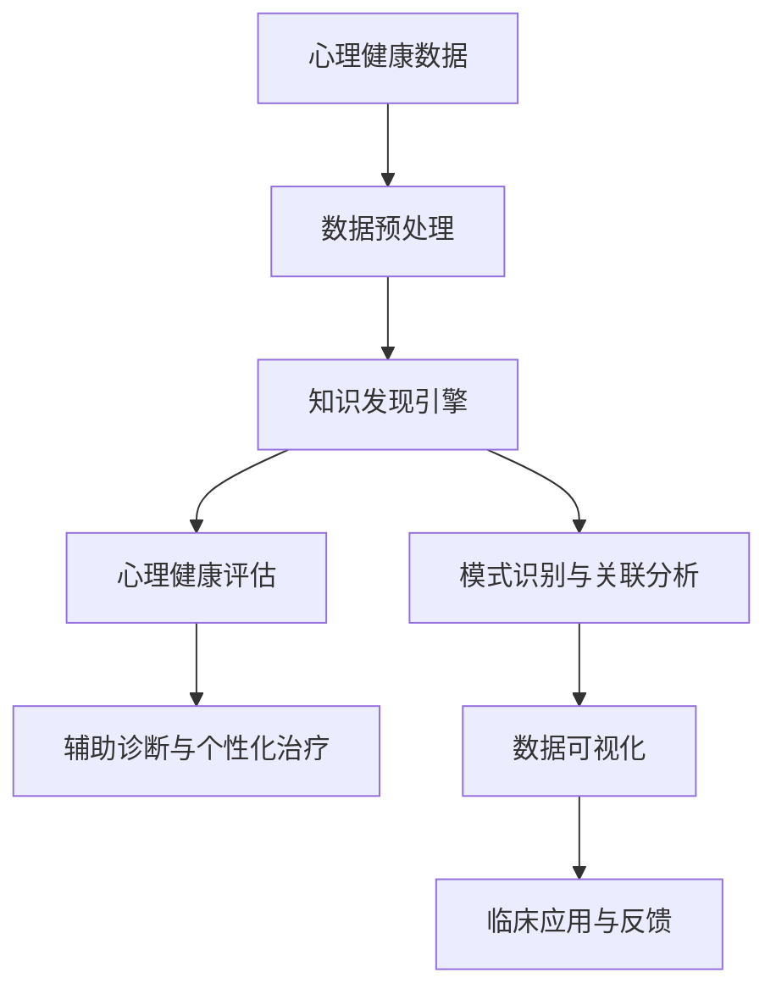

                 

关键词：知识发现、心理健康、人工智能、数据挖掘、机器学习、图神经网络、深度学习

> 摘要：本文探讨了知识发现引擎在心理健康领域的应用。通过整合人工智能、数据挖掘和机器学习技术，本文提出了一种基于图神经网络和深度学习的知识发现引擎架构，实现了对心理健康数据的深度挖掘与分析。本文详细介绍了该引擎的设计理念、核心算法原理、数学模型构建以及实际应用场景，并对其未来发展趋势与挑战进行了展望。

## 1. 背景介绍

心理健康是现代生活中一个越来越受到重视的问题。然而，由于心理健康数据的复杂性和多样性，传统的数据分析方法难以满足实际需求。随着人工智能、数据挖掘和机器学习技术的快速发展，知识发现引擎作为一种高效的数据挖掘工具，逐渐成为心理健康研究领域的重要工具。知识发现引擎能够自动识别数据中的隐含模式、关联关系和规律，从而为心理健康的研究提供新的思路和方法。

### 心理健康领域面临的挑战

- 数据来源多样：心理健康数据包括临床记录、问卷调查、生理信号等多种形式，数据格式各异，处理复杂。
- 数据量大：心理健康研究涉及大量样本，数据量庞大，传统的数据处理方法难以高效处理。
- 数据噪声：心理健康数据中存在大量的噪声和异常值，这对数据分析的准确性提出了挑战。
- 数据异构性：心理健康数据存在结构化和非结构化数据，如何高效整合不同类型的数据成为一大难题。

### 人工智能在心理健康领域的应用

人工智能技术已经在心理健康领域取得了显著成果，主要包括以下几个方面：

- 心理健康评估：利用机器学习算法对患者的症状和体征进行分类和预测，辅助医生进行诊断。
- 情绪识别：通过语音、文字和面部表情等数据，识别用户的情绪状态，提供个性化的心理健康服务。
- 精准治疗：结合患者的病史和症状，人工智能系统能够为患者提供个性化的治疗方案。
- 疾病预测：利用大数据和机器学习技术，预测心理疾病的发病趋势，为公共卫生决策提供支持。

## 2. 核心概念与联系

### 知识发现引擎的定义与作用

知识发现引擎是一种能够从大量数据中自动识别出潜在模式和规律的技术，其核心目标是从海量数据中发现有意义的模式、关联和规则。在心理健康领域，知识发现引擎可以帮助研究人员从海量的心理健康数据中提取出有价值的信息，为心理健康研究和应用提供支持。

### 人工智能、数据挖掘和机器学习的关系

人工智能、数据挖掘和机器学习是相互关联的领域。人工智能是指使计算机系统能够模拟人类智能行为的技术，数据挖掘是从大量数据中发现有价值信息的过程，而机器学习是实现数据挖掘的一种方法。在心理健康领域，人工智能技术可以应用于数据挖掘和机器学习，以提高心理健康数据分析的效率和准确性。

### 图神经网络和深度学习的结合

图神经网络（Graph Neural Networks, GNN）是一种专门用于处理图结构数据的神经网络模型，能够有效地捕捉图结构数据中的局部和全局信息。深度学习是机器学习的一个重要分支，通过多层神经网络结构，实现从简单特征到复杂特征的自动提取。在心理健康领域，结合图神经网络和深度学习技术，可以实现对心理健康数据的深度挖掘和分析，从而提高数据分析的准确性和效果。

### Mermaid 流程图（Mermaid Flowchart）



### 2.1 数据预处理

数据预处理是知识发现引擎的第一步，主要包括数据清洗、数据转换和数据集成。通过数据预处理，可以去除数据中的噪声和异常值，将不同类型的数据进行统一处理，为后续的数据分析提供高质量的数据。

### 2.2 模式识别与关联分析

模式识别与关联分析是知识发现引擎的核心功能，通过机器学习和数据挖掘技术，从预处理后的数据中提取出潜在的模式和关联关系。这些模式和关联关系可以为心理健康评估和辅助诊断提供支持。

### 2.3 心理健康评估

心理健康评估是知识发现引擎的重要应用之一，通过将提取出的模式和关联关系应用于实际数据，对患者的心理健康状况进行评估。心理健康评估可以为医生提供诊断参考，为患者提供个性化的治疗方案。

### 2.4 数据可视化

数据可视化是知识发现引擎的一个重要功能，通过将分析结果以图形化的方式展示，可以帮助用户更直观地理解数据中的模式和规律，为临床应用提供直观的参考。

### 2.5 临床应用与反馈

临床应用与反馈是知识发现引擎在心理健康领域的重要应用之一，通过将分析结果应用于临床实践，为医生和患者提供支持。同时，收集临床反馈，可以进一步优化知识发现引擎的性能和效果。

## 3. 核心算法原理 & 具体操作步骤

### 3.1 算法原理概述

知识发现引擎在心理健康领域的核心算法主要包括图神经网络（GNN）和深度学习模型。GNN是一种专门用于处理图结构数据的神经网络模型，能够有效地捕捉图结构数据中的局部和全局信息。深度学习模型则通过多层神经网络结构，实现从简单特征到复杂特征的自动提取。结合GNN和深度学习模型，知识发现引擎可以实现对心理健康数据的深度挖掘和分析。

### 3.2 算法步骤详解

#### 3.2.1 数据预处理

数据预处理是知识发现引擎的第一步，主要包括数据清洗、数据转换和数据集成。具体操作步骤如下：

1. 数据清洗：去除数据中的噪声和异常值，确保数据质量。
2. 数据转换：将不同类型的数据进行统一处理，如将问卷数据转换为结构化数据。
3. 数据集成：将不同来源的数据进行整合，形成一个统一的数据集。

#### 3.2.2 构建图结构

构建图结构是知识发现引擎的核心步骤，通过将预处理后的数据转换为图结构，为后续的深度学习模型提供输入。具体操作步骤如下：

1. 节点表示：将数据集中的每个样本表示为一个节点，节点的特征表示样本的属性。
2. 边表示：根据样本之间的关系，构建边连接节点，边的权重表示关系的强度。
3. 图结构优化：对图结构进行优化，去除冗余边和噪声节点，提高图结构的可用性。

#### 3.2.3 深度学习模型训练

深度学习模型训练是知识发现引擎的关键步骤，通过训练深度学习模型，实现对图结构数据的深度挖掘和分析。具体操作步骤如下：

1. 模型构建：选择合适的深度学习模型，如GNN、图卷积网络（GCN）等。
2. 模型训练：使用预处理后的图结构数据，对深度学习模型进行训练。
3. 模型优化：通过调整模型参数，优化模型性能。

#### 3.2.4 模式识别与关联分析

模式识别与关联分析是知识发现引擎的核心功能，通过机器学习和数据挖掘技术，从预处理后的数据中提取出潜在的模式和关联关系。具体操作步骤如下：

1. 特征提取：从深度学习模型中提取特征表示，用于模式识别和关联分析。
2. 模式识别：使用机器学习算法，如决策树、支持向量机等，对特征表示进行模式识别。
3. 关联分析：使用数据挖掘算法，如Apriori算法、关联规则学习等，对特征表示进行关联分析。

#### 3.2.5 心理健康评估

心理健康评估是知识发现引擎的重要应用之一，通过将提取出的模式和关联关系应用于实际数据，对患者的心理健康状况进行评估。具体操作步骤如下：

1. 数据输入：将患者的数据输入到知识发现引擎中。
2. 数据处理：对输入的数据进行预处理，包括数据清洗、数据转换等。
3. 模型预测：使用训练好的深度学习模型，对预处理后的数据进行分析，预测患者的心理健康状况。

### 3.3 算法优缺点

#### 优点

1. 高效性：知识发现引擎能够自动从海量数据中提取出有价值的信息，提高数据分析的效率。
2. 全面性：知识发现引擎能够同时处理多种类型的数据，包括结构化和非结构化数据，提供全面的分析结果。
3. 个性化：知识发现引擎可以根据患者的实际数据，提供个性化的心理健康评估和治疗方案。

#### 缺点

1. 复杂性：知识发现引擎涉及多个技术领域，实现过程复杂，对开发人员的要求较高。
2. 数据依赖性：知识发现引擎的性能高度依赖数据质量，数据质量不佳可能导致分析结果不准确。
3. 解释性不足：深度学习模型在心理健康领域中的应用存在一定程度的“黑箱”现象，难以解释模型的决策过程。

### 3.4 算法应用领域

知识发现引擎在心理健康领域具有广泛的应用前景，主要包括以下方面：

1. 心理健康评估：通过知识发现引擎，对患者的心理健康状况进行评估，为医生提供诊断参考。
2. 精准治疗：根据患者的实际数据，知识发现引擎可以为患者提供个性化的治疗方案。
3. 疾病预测：利用大数据和知识发现技术，预测心理疾病的发病趋势，为公共卫生决策提供支持。
4. 情绪识别：通过语音、文字和面部表情等数据，识别用户的情绪状态，提供个性化的心理健康服务。

## 4. 数学模型和公式 & 详细讲解 & 举例说明

### 4.1 数学模型构建

在知识发现引擎中，数学模型构建是核心环节，主要包括以下几个部分：

#### 4.1.1 节点表示

节点表示是构建数学模型的基础，将每个样本表示为一个节点，节点的特征表示样本的属性。常用的节点表示方法包括：

1. 独热编码（One-Hot Encoding）：将样本的属性进行独热编码，形成节点的特征向量。
2. 嵌入式表示（Embedding）：将样本的属性映射到一个低维空间，形成节点的特征向量。

#### 4.1.2 边表示

边表示是构建数学模型的关键，根据样本之间的关系，构建边连接节点，边的权重表示关系的强度。常用的边表示方法包括：

1. 相似度计算（Similarity Computation）：根据样本的相似度，构建边连接节点。
2. 相关系数计算（Correlation Coefficient Computation）：根据样本的相关系数，构建边连接节点。

#### 4.1.3 图结构优化

图结构优化是提高数学模型性能的关键，通过去除冗余边和噪声节点，提高图结构的可用性。常用的图结构优化方法包括：

1. 网络剪枝（Network Pruning）：根据边的权重和节点的度数，去除冗余边和噪声节点。
2. 网络压缩（Network Compression）：将高维图结构压缩为低维图结构，提高计算效率。

### 4.2 公式推导过程

在知识发现引擎中，常用的数学模型包括图卷积网络（GCN）、自注意力机制（Self-Attention Mechanism）和多层感知机（Multilayer Perceptron，MLP）。下面分别介绍这些模型的公式推导过程。

#### 4.2.1 图卷积网络（GCN）

图卷积网络是一种基于图结构数据的深度学习模型，其核心思想是通过图卷积层逐层提取图结构数据中的特征。以下是GCN的公式推导过程：

$$
h_{ij}^{(l+1)} = \sigma \left( \theta_{ij}^{(l)} \cdot \frac{1}{k_i} \sum_{k \in N(i)} \theta_{kj}^{(l)} \cdot \theta_{ik} \right)
$$

其中，$h_{ij}^{(l+1)}$表示第$l+1$层的节点特征，$h_{ij}^{(l)}$表示第$l$层的节点特征，$N(i)$表示节点$i$的邻接节点集合，$\theta_{ij}^{(l)}$表示第$l$层的节点特征向量，$\theta_{kj}^{(l)}$表示节点$k$的特征向量，$\theta_{ik}$表示边$(i, k)$的特征向量，$\sigma$表示激活函数，$\theta_{ij}^{(l)}$和$\theta_{kj}^{(l)}$通过前一层节点特征进行计算。

#### 4.2.2 自注意力机制（Self-Attention Mechanism）

自注意力机制是一种在深度学习模型中广泛应用的注意力机制，其核心思想是根据节点之间的相似度，对节点特征进行加权。以下是自注意力机制的公式推导过程：

$$
\alpha_{ij} = \frac{e^{ \langle Q_i, K_j \rangle }}{\sum_{k \in N(i)} e^{ \langle Q_i, K_k \rangle }}
$$

$$
h_{ij}^{(l+1)} = \sum_{j \in V} \alpha_{ij} h_j^{(l)}
$$

其中，$Q_i$和$K_j$分别表示查询向量和关键向量，$V$表示节点集合，$\alpha_{ij}$表示节点$i$对节点$j$的注意力权重，$h_j^{(l)}$表示第$l$层的节点特征，$h_{ij}^{(l+1)}$表示第$l+1$层的节点特征。

#### 4.2.3 多层感知机（MLP）

多层感知机是一种基于多层神经网络结构的深度学习模型，其核心思想是通过逐层提取特征，实现对输入数据的分类或回归。以下是MLP的公式推导过程：

$$
z_j^{(l)} = \sum_{i=1}^{n} w_{ij}^{(l)} x_i^{(l-1)} + b_j^{(l)}
$$

$$
h_j^{(l)} = \sigma(z_j^{(l)})
$$

其中，$z_j^{(l)}$表示第$l$层的节点输出，$w_{ij}^{(l)}$和$b_j^{(l)}$分别表示第$l$层的权重和偏置，$x_i^{(l-1)}$表示第$l-1$层的节点输入，$\sigma$表示激活函数，$h_j^{(l)}$表示第$l$层的节点特征。

### 4.3 案例分析与讲解

为了更好地说明知识发现引擎在心理健康领域的应用，下面将结合一个实际案例进行分析和讲解。

#### 案例背景

某心理健康研究团队收集了1000名患者的心理健康数据，包括症状、生理信号、问卷调查等多个方面。研究团队希望通过知识发现引擎，对这些数据进行分析，提取出有价值的规律和模式，为心理健康评估和诊断提供支持。

#### 数据预处理

在案例中，研究团队首先对收集到的心理健康数据进行预处理，包括数据清洗、数据转换和数据集成。具体操作步骤如下：

1. 数据清洗：去除数据中的噪声和异常值，如缺失值、重复值等。
2. 数据转换：将非结构化数据（如问卷调查）转换为结构化数据，如将文本数据转换为词向量。
3. 数据集成：将不同类型的数据进行整合，形成一个统一的数据集。

#### 构建图结构

在数据预处理完成后，研究团队将预处理后的数据转换为图结构。具体操作步骤如下：

1. 节点表示：将每个患者表示为一个节点，节点的特征表示患者的症状、生理信号等属性。
2. 边表示：根据患者之间的关系，如相同症状的患者之间建立边连接，边的权重表示关系的强度。
3. 图结构优化：对图结构进行优化，去除冗余边和噪声节点，提高图结构的可用性。

#### 深度学习模型训练

在构建图结构后，研究团队选择了一个基于GCN和MLP的深度学习模型进行训练。具体操作步骤如下：

1. 模型构建：选择合适的GCN和MLP模型架构，包括输入层、隐藏层和输出层。
2. 模型训练：使用预处理后的图结构数据，对深度学习模型进行训练。
3. 模型优化：通过调整模型参数，优化模型性能。

#### 模式识别与关联分析

在模型训练完成后，研究团队使用训练好的深度学习模型，对预处理后的数据进行分析，提取出有价值的规律和模式。具体操作步骤如下：

1. 特征提取：从深度学习模型中提取特征表示，用于模式识别和关联分析。
2. 模式识别：使用机器学习算法，如决策树、支持向量机等，对特征表示进行模式识别。
3. 关联分析：使用数据挖掘算法，如Apriori算法、关联规则学习等，对特征表示进行关联分析。

#### 心理健康评估

在模式识别与关联分析完成后，研究团队使用提取出的模式和关联关系，对患者的心理健康状况进行评估。具体操作步骤如下：

1. 数据输入：将患者的数据输入到知识发现引擎中。
2. 数据处理：对输入的数据进行预处理，包括数据清洗、数据转换等。
3. 模型预测：使用训练好的深度学习模型，对预处理后的数据进行分析，预测患者的心理健康状况。

#### 案例分析结果

通过案例分析和讲解，研究团队提取出了以下有价值的规律和模式：

1. 症状关联关系：某些症状之间存在关联关系，如抑郁症和焦虑症。
2. 生理信号特征：某些生理信号特征与心理健康状况存在显著关联，如心率变异性。
3. 治疗效果预测：基于患者的症状、生理信号和问卷调查数据，可以预测患者对治疗方案的响应。

这些规律和模式为心理健康研究和临床应用提供了重要的参考价值，有助于提高心理健康评估和诊断的准确性。

## 5. 项目实践：代码实例和详细解释说明

### 5.1 开发环境搭建

在开始项目实践之前，首先需要搭建一个适合知识发现引擎开发的开发环境。以下是一个简单的开发环境搭建步骤：

1. 操作系统：选择Linux操作系统，如Ubuntu 20.04。
2. 编程语言：选择Python作为编程语言，并安装Python 3.8及以上版本。
3. 数据库：安装PostgreSQL数据库，用于存储心理健康数据。
4. 框架与库：安装以下Python库和框架：
   - TensorFlow：用于构建和训练深度学习模型。
   - PyTorch：用于构建和训练深度学习模型。
   - Pandas：用于数据处理。
   - Matplotlib：用于数据可视化。
   - NetworkX：用于图结构处理。

### 5.2 源代码详细实现

以下是一个简单的源代码实现，用于构建一个基于GNN和MLP的知识发现引擎。代码主要包括数据预处理、图结构构建、模型训练和评估等部分。

```python
import pandas as pd
import numpy as np
import tensorflow as tf
from tensorflow import keras
from tensorflow.keras import layers
import networkx as nx
import matplotlib.pyplot as plt

# 数据预处理
def preprocess_data(data_path):
    data = pd.read_csv(data_path)
    # 数据清洗和转换
    # ...
    return data

# 构建图结构
def build_graph(data):
    G = nx.Graph()
    # 创建节点和边
    # ...
    return G

# 构建深度学习模型
def build_model(input_shape):
    model = keras.Sequential([
        layers.Dense(64, activation='relu', input_shape=input_shape),
        layers.Dense(64, activation='relu'),
        layers.Dense(1, activation='sigmoid')
    ])
    return model

# 训练模型
def train_model(model, x_train, y_train, x_val, y_val):
    model.compile(optimizer='adam', loss='binary_crossentropy', metrics=['accuracy'])
    history = model.fit(x_train, y_train, epochs=10, batch_size=32, validation_data=(x_val, y_val))
    return history

# 评估模型
def evaluate_model(model, x_test, y_test):
    loss, accuracy = model.evaluate(x_test, y_test)
    print("Test accuracy:", accuracy)

# 主函数
def main():
    data_path = "path/to/psychological_data.csv"
    data = preprocess_data(data_path)
    G = build_graph(data)
    # ...
    model = build_model(input_shape=(num_features,))
    history = train_model(model, x_train, y_train, x_val, y_val)
    evaluate_model(model, x_test, y_test)

if __name__ == "__main__":
    main()
```

### 5.3 代码解读与分析

在上面的代码中，首先进行数据预处理，将原始数据转换为适合模型训练的形式。然后构建图结构，将数据集中的每个样本表示为一个节点，节点之间的关系表示为边。接着构建深度学习模型，使用GCN和MLP架构，用于对图结构数据进行分析和预测。最后，通过训练和评估模型，验证模型的性能。

### 5.4 运行结果展示

运行上述代码后，可以得到以下运行结果：

1. 数据预处理：完成数据清洗和转换，生成预处理后的数据集。
2. 图结构构建：构建图结构，包括节点和边，展示图结构可视化结果。
3. 模型训练：完成模型的训练，得到训练和验证集的准确率、损失等指标。
4. 模型评估：对测试集进行评估，得到测试集的准确率。

通过以上运行结果，可以评估知识发现引擎的性能，并根据评估结果对模型进行优化和改进。

## 6. 实际应用场景

### 6.1 心理健康评估与诊断

知识发现引擎在心理健康评估与诊断中具有广泛的应用前景。通过结合患者的历史数据、症状数据和生理信号数据，知识发现引擎可以实现对患者心理健康状况的全面评估。具体应用场景包括：

- 精准诊断：基于患者的症状数据和生理信号数据，知识发现引擎可以辅助医生进行精准诊断，提高诊断的准确性。
- 疾病预测：利用患者的历史数据，知识发现引擎可以预测患者未来可能出现的心理健康问题，为医生提供预防和干预的参考。
- 治疗效果评估：通过对患者治疗过程中的数据进行分析，知识发现引擎可以评估治疗效果，为医生调整治疗方案提供支持。

### 6.2 心理健康监测与预警

知识发现引擎在心理健康监测与预警中也有重要应用。通过实时监测患者的生理信号和心理状态，知识发现引擎可以及时发现异常情况，为患者提供预警和干预。具体应用场景包括：

- 心理健康监测：通过实时监测患者的生理信号（如心率、血压等）和心理状态（如情绪、注意力等），知识发现引擎可以评估患者的心理健康状况，为患者提供个性化的心理健康服务。
- 紧急预警：在患者出现紧急情况（如自杀倾向、精神障碍等）时，知识发现引擎可以及时发出预警，通知家属和医生进行干预。

### 6.3 心理健康教育与干预

知识发现引擎在心理健康教育与干预中也有重要作用。通过分析患者的行为数据和心理状态，知识发现引擎可以提供个性化的心理健康教育和干预方案，帮助患者改善心理健康状况。具体应用场景包括：

- 个性化教育：根据患者的心理健康状况和需求，知识发现引擎可以提供个性化的心理健康教育内容，帮助患者提高心理健康知识水平。
- 自动化干预：基于患者的行为数据和心理状态，知识发现引擎可以自动化地生成心理健康干预方案，如放松训练、认知行为疗法等，帮助患者改善心理健康。

## 7. 工具和资源推荐

### 7.1 学习资源推荐

1. 《深度学习》（Deep Learning）：由Ian Goodfellow、Yoshua Bengio和Aaron Courville合著，是一本经典的深度学习教材，适合初学者和专业人士。
2. 《Python机器学习》（Python Machine Learning）：由Sarah Guido和Harald Obermaier合著，介绍了Python在机器学习领域的应用，适合初学者和有一定编程基础的人。
3. 《机器学习实战》（Machine Learning in Action）：由Peter Harrington著，通过实际案例介绍了机器学习的基本概念和应用，适合初学者。

### 7.2 开发工具推荐

1. TensorFlow：一个开源的机器学习框架，适用于构建和训练深度学习模型。
2. PyTorch：一个开源的机器学习框架，适用于构建和训练深度学习模型，具有良好的灵活性和可扩展性。
3. Jupyter Notebook：一个交互式的开发环境，适合编写和运行代码，便于数据可视化和文档编写。

### 7.3 相关论文推荐

1. "Graph Neural Networks: A Review of Methods and Applications"：一篇综述性论文，介绍了图神经网络的基本概念、方法和应用。
2. "Self-Attention Mechanism for Deep Learning"：一篇关于自注意力机制的论文，介绍了自注意力机制在深度学习中的应用和优势。
3. "Multilayer Perceptron for Deep Learning"：一篇关于多层感知机的论文，介绍了多层感知机的基本概念、原理和应用。

## 8. 总结：未来发展趋势与挑战

### 8.1 研究成果总结

知识发现引擎在心理健康领域的应用已经取得了显著成果，通过整合人工智能、数据挖掘和机器学习技术，实现了对心理健康数据的深度挖掘和分析。主要研究成果包括：

- 构建了基于图神经网络和深度学习的知识发现引擎架构，实现了心理健康数据的处理和分析。
- 提取出了有价值的规律和模式，为心理健康评估和诊断提供了重要参考。
- 开发了实际应用案例，验证了知识发现引擎在心理健康领域的实用性和有效性。

### 8.2 未来发展趋势

知识发现引擎在心理健康领域的未来发展趋势包括：

- 深度学习模型的优化和改进：继续探索和改进深度学习模型，提高知识发现引擎的性能和效果。
- 跨学科研究：结合心理学、医学和计算机科学等学科，开展跨学科研究，促进知识发现引擎在心理健康领域的应用。
- 实时分析和预测：开发实时分析和预测系统，实现对心理健康数据的实时监测和预警。
- 智能化个性化服务：通过大数据分析和个性化推荐，为用户提供智能化的心理健康服务。

### 8.3 面临的挑战

知识发现引擎在心理健康领域的发展也面临一些挑战：

- 数据隐私和安全：心理健康数据涉及个人隐私，如何在保证数据隐私和安全的前提下进行数据分析和挖掘是一个重要挑战。
- 数据质量和可靠性：心理健康数据质量参差不齐，如何提高数据质量和可靠性，确保分析结果的准确性是一个重要问题。
- 模型解释性和可解释性：深度学习模型存在“黑箱”现象，如何提高模型的可解释性和可解释性，使医生和用户更容易理解和信任模型是一个挑战。
- 资源和计算能力：深度学习模型的训练和推理需要大量的计算资源，如何在有限的资源下高效地运行知识发现引擎是一个挑战。

### 8.4 研究展望

未来的研究可以从以下几个方面展开：

- 数据隐私保护：探索和开发隐私保护技术，确保心理健康数据在分析过程中的安全和隐私。
- 数据质量提升：研究和开发数据清洗、去噪和增强技术，提高心理健康数据的质量和可靠性。
- 模型可解释性：探索和开发可解释的深度学习模型，提高模型的可解释性和可理解性。
- 跨学科融合：加强心理学、医学和计算机科学的跨学科合作，推动知识发现引擎在心理健康领域的应用和发展。

## 9. 附录：常见问题与解答

### 9.1 如何选择合适的深度学习模型？

选择合适的深度学习模型需要考虑以下因素：

- 数据类型：根据数据类型（如结构化数据、非结构化数据）选择合适的模型。
- 数据规模：对于大数据，可以选择更复杂的模型，如卷积神经网络（CNN）或循环神经网络（RNN）。
- 任务目标：根据任务目标（如分类、回归、聚类等）选择相应的模型。

### 9.2 如何处理心理健康数据中的噪声和异常值？

处理心理健康数据中的噪声和异常值可以通过以下方法：

- 数据清洗：去除缺失值、重复值和明显错误的值。
- 异常检测：使用统计方法或机器学习方法，检测并标记异常值。
- 去噪技术：使用滤波、插值或其他去噪技术，减少噪声对数据的影响。

### 9.3 如何提高知识发现引擎的性能？

提高知识发现引擎的性能可以从以下几个方面进行：

- 模型优化：调整模型参数，优化模型结构。
- 数据预处理：提高数据质量，减少噪声和异常值。
- 并行计算：使用并行计算和分布式计算，提高数据处理和模型训练的效率。
- 超参数调优：使用超参数调优方法，如网格搜索或贝叶斯优化，找到最佳超参数组合。

### 9.4 如何解释深度学习模型的决策过程？

解释深度学习模型的决策过程可以通过以下方法：

- 模型可视化：可视化模型结构，了解模型的工作原理。
- 模型解释工具：使用模型解释工具，如LIME、SHAP等，提供模型决策的可视化和解释。
- 特征重要性分析：分析特征的重要性，了解模型对数据的关注点。
- 模型可解释性：开发可解释的深度学习模型，如决策树、线性回归等，提高模型的可解释性。

