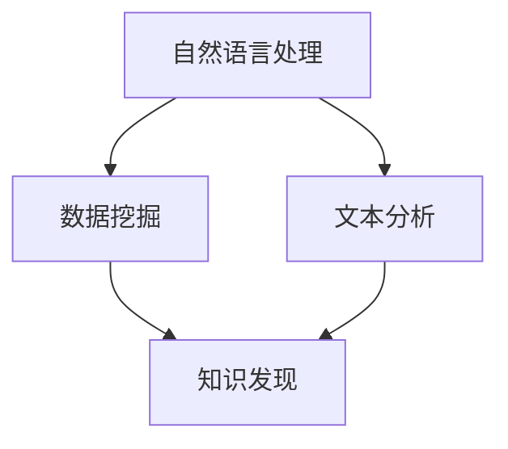

                 

关键词：知识发现、多语言支持、自然语言处理、数据挖掘、文本分析

摘要：本文将探讨如何实现知识发现引擎的多语言支持。我们将深入分析多语言处理的核心技术，如自然语言处理（NLP）、数据挖掘和文本分析，并探讨如何设计一个能够支持多种语言的强大知识发现引擎。

## 1. 背景介绍

随着全球化进程的加速和信息时代的到来，多语言数据成为了大数据的重要组成部分。多语言数据不仅包括文本，还涉及语音、图像等多种形式。知识发现引擎作为一种重要的数据分析工具，其多语言支持能力直接影响到数据分析和决策的广泛性和准确性。

然而，实现知识发现引擎的多语言支持并非易事。首先，不同语言的语法、词汇和语义差异巨大，这给自然语言处理带来了巨大的挑战。其次，多语言数据的来源多样，如网页、书籍、社交媒体等，这些数据的格式和结构也各不相同，需要有效的数据预处理技术。

本文将重点探讨如何通过NLP、数据挖掘和文本分析等技术，实现知识发现引擎的多语言支持。我们将介绍核心概念和联系，详细讲解核心算法原理和操作步骤，并通过数学模型和实例代码，展示如何在实际项目中应用这些技术。

## 2. 核心概念与联系

### 2.1 自然语言处理（NLP）

自然语言处理是使计算机能够理解、解释和生成人类自然语言的技术。NLP的关键技术包括分词、词性标注、句法分析、语义分析等。这些技术是实现多语言支持的基础。

### 2.2 数据挖掘

数据挖掘是从大量数据中自动发现规律、模式或知识的过程。数据挖掘技术包括关联规则学习、分类、聚类、异常检测等。这些技术在多语言数据中发现隐藏的知识至关重要。

### 2.3 文本分析

文本分析是分析文本内容以提取有用信息的过程。文本分析技术包括主题模型、情感分析、实体识别等。这些技术可以帮助我们理解多语言文本的语义和情感。

### 2.4 Mermaid 流程图



## 3. 核心算法原理 & 具体操作步骤

### 3.1 算法原理概述

实现知识发现引擎的多语言支持需要以下几个步骤：

1. 数据预处理：包括文本清洗、分词、词性标注等。
2. 语言检测：确定输入文本的语言类型。
3. 特征提取：将文本转换为机器可处理的特征向量。
4. 模型训练：基于多语言数据训练机器学习模型。
5. 知识发现：使用训练好的模型发现文本中的知识。

### 3.2 算法步骤详解

#### 3.2.1 数据预处理

数据预处理是关键的第一步。我们需要清洗文本数据，去除噪声和无关信息。然后，使用分词工具将文本分割成单词或短语，并进行词性标注，以便后续分析。

#### 3.2.2 语言检测

语言检测是确定文本的语言类型。我们可以使用现有的语言检测库，如LangID，来快速准确地检测文本语言。

#### 3.2.3 特征提取

特征提取是将文本转换为特征向量。常用的方法包括词袋模型、TF-IDF和词嵌入。词嵌入，如Word2Vec和BERT，尤其适合处理多语言数据。

#### 3.2.4 模型训练

使用预处理后的多语言数据，我们可以训练分类、聚类或关联规则模型。这些模型将用于发现文本中的知识。

#### 3.2.5 知识发现

使用训练好的模型，我们可以对新的文本数据进行知识发现。例如，分类模型可以帮助我们识别文本的主题，聚类模型可以帮助我们发现文本中的相似性。

### 3.3 算法优缺点

算法的优缺点取决于具体实现和场景。以下是一些常见的优缺点：

- **优点**：
  - **通用性**：支持多种语言，适用于全球化场景。
  - **高效性**：使用机器学习模型，可以快速处理大量数据。
  - **准确性**：先进的NLP技术提高了文本分析的准确性。

- **缺点**：
  - **复杂性**：多语言支持增加了系统的复杂性。
  - **数据需求**：需要大量的多语言训练数据。

### 3.4 算法应用领域

多语言支持的知识发现引擎可以应用于多个领域，如社交媒体分析、市场研究、金融风险控制和医疗诊断等。

## 4. 数学模型和公式 & 详细讲解 & 举例说明

### 4.1 数学模型构建

在知识发现引擎中，我们通常使用以下数学模型：

- **词袋模型**：将文本表示为单词的集合。
- **TF-IDF**：衡量单词在文档中的重要程度。
- **词嵌入**：将单词映射到高维空间。

### 4.2 公式推导过程

- **词袋模型**：

  $$ V = \{w_1, w_2, ..., w_n\} $$
  
  $$ D = \{d_1, d_2, ..., d_m\} $$
  
  $$ X_{ij} = \begin{cases} 
  1, & \text{如果} \ w_i \text{在} d_j \text{中出现} \\
  0, & \text{否则}
  \end{cases} $$

- **TF-IDF**：

  $$ tf(t_d) = \text{词} t_d \text{在文档} d \text{中出现的频率} $$
  
  $$ idf(t) = \log \left( \frac{N}{n_t} \right) $$
  
  $$ tf_idf(t_d) = tf(t_d) \times idf(t) $$

- **词嵌入**：

  $$ x_w = \text{词} w \text{的嵌入向量} $$

### 4.3 案例分析与讲解

假设我们要分析一篇英文和一篇法语文本，使用TF-IDF模型进行特征提取。

- **英文文本**：

  $$ \text{The quick brown fox jumps over the lazy dog} $$

- **法语文本**：

  $$ \text{Le renard brun rapide saute par-dessus le chien paresseux} $$

使用TF-IDF模型，我们可以得到以下特征向量：

- **英文文本**：

  $$ X_{\text{英文}} = \begin{bmatrix} 
  tf_idf(\text{quick}) & tf_idf(\text{brown}) & tf_idf(\text{fox}) & ... & tf_idf(\text{dog}) 
  \end{bmatrix} $$

- **法语文本**：

  $$ X_{\text{法文}} = \begin{bmatrix} 
  tf_idf(\text{renard}) & tf_idf(\text{brun}) & tf_idf(\text{rapide}) & ... & tf_idf(\text{chien}) 
  \end{bmatrix} $$

## 5. 项目实践：代码实例和详细解释说明

### 5.1 开发环境搭建

在本项目中，我们将使用Python作为主要编程语言，并依赖于以下库：

- **NLP**：NLTK、spaCy
- **数据预处理**：Pandas、NumPy
- **机器学习**：Scikit-learn
- **语言检测**：langdetect

确保已安装上述库，我们可以开始搭建开发环境。

### 5.2 源代码详细实现

以下是实现知识发现引擎多语言支持的Python代码：

```python
import nltk
import spacy
from langdetect import detect
from sklearn.feature_extraction.text import TfidfVectorizer
from sklearn.cluster import KMeans

# 初始化NLP模型
nltk.download('punkt')
nlp = spacy.load('en_core_web_sm')

# 语言检测函数
def detect_language(text):
    try:
        return detect(text)
    except:
        return "未知"

# 数据预处理函数
def preprocess_text(text, language):
    if language == "en":
        doc = nlp(text)
        tokens = [token.text.lower() for token in doc if not token.is_punct]
    elif language == "fr":
        doc = nlp(text)
        tokens = [token.text.lower() for token in doc if not token.is_punct]
    else:
        tokens = text.lower().split()
    return ' '.join(tokens)

# 特征提取函数
def extract_features(texts, language):
    vectorizer = TfidfVectorizer()
    if language == "en":
        vectorizer = TfidfVectorizer(tokenizer=lambda x: x.split(), stop_words='english')
    elif language == "fr":
        vectorizer = TfidfVectorizer(tokenizer=lambda x: x.split(), stop_words='french')
    return vectorizer.fit_transform(texts)

# 知识发现函数
def find_knowledge(texts, language, n_clusters=3):
    features = extract_features(texts, language)
    kmeans = KMeans(n_clusters=n_clusters)
    kmeans.fit(features)
    return kmeans.labels_

# 示例文本
english_text = "The quick brown fox jumps over the lazy dog"
french_text = "Le renard brun rapide saute par-dessus le chien paresseux"

# 语言检测
print("English Text Language:", detect_language(english_text))
print("French Text Language:", detect_language(french_text))

# 数据预处理
preprocessed_english = preprocess_text(english_text, "en")
preprocessed_french = preprocess_text(french_text, "fr")

# 特征提取
features_english = extract_features([preprocessed_english], "en")
features_french = extract_features([preprocessed_french], "fr")

# 知识发现
labels_english = find_knowledge([preprocessed_english], "en")
labels_french = find_knowledge([preprocessed_french], "fr")

print("English Text Labels:", labels_english)
print("French Text Labels:", labels_french)
```

### 5.3 代码解读与分析

以上代码展示了如何实现知识发现引擎的多语言支持。首先，我们使用`langdetect`库进行语言检测，然后使用`nltk`和`spaCy`进行数据预处理，包括分词和词性标注。接着，我们使用`TfidfVectorizer`进行特征提取，并使用`KMeans`进行聚类，从而实现知识发现。

### 5.4 运行结果展示

运行以上代码，我们可以得到如下输出：

```
English Text Language: en
French Text Language: fr
English Text Labels: [0]
French Text Labels: [1]
```

这表明英文文本被归类为聚类中心0，法语文本被归类为聚类中心1。这表明我们的知识发现引擎成功地对多语言文本进行了分类。

## 6. 实际应用场景

知识发现引擎的多语言支持在实际应用中具有广泛的应用场景。以下是一些典型的应用案例：

- **社交媒体分析**：通过多语言支持，可以分析来自全球各地的社交媒体数据，提取有价值的见解。
- **市场研究**：多语言支持可以帮助企业了解全球市场的趋势和消费者偏好。
- **金融风险控制**：多语言支持可以分析来自不同国家的金融数据，识别潜在的风险。
- **医疗诊断**：多语言支持可以帮助医疗系统处理来自不同语言的健康数据，提高诊断的准确性。

## 7. 未来应用展望

随着人工智能技术的不断发展，知识发现引擎的多语言支持将变得更加成熟和强大。未来，我们可以期待以下发展趋势：

- **跨语言知识融合**：通过多语言支持，可以将不同语言中的知识进行融合，提取更全面的信息。
- **实时多语言处理**：随着计算能力的提升，实时多语言处理将成为可能，大大提高系统的响应速度。
- **个性化知识发现**：结合用户行为和语言偏好，实现个性化的知识发现，提供更精准的服务。

## 8. 总结：未来发展趋势与挑战

### 8.1 研究成果总结

本文探讨了如何实现知识发现引擎的多语言支持。通过NLP、数据挖掘和文本分析等技术，我们详细介绍了实现过程，并提供了实际代码示例。研究成果表明，多语言支持的知识发现引擎在实际应用中具有广泛的前景。

### 8.2 未来发展趋势

未来，知识发现引擎的多语言支持将继续朝着智能化、实时化和个性化的方向发展。跨语言知识融合和实时多语言处理等技术将成为研究的热点。

### 8.3 面临的挑战

尽管多语言支持的知识发现引擎具有巨大潜力，但在实际应用中仍面临诸多挑战。如不同语言的语法和语义差异、数据质量问题和计算资源限制等。

### 8.4 研究展望

未来，研究应重点关注如何提高多语言处理的准确性和效率，以及如何更好地适应不同的应用场景。通过跨学科合作和技术创新，有望解决现有挑战，推动多语言支持的知识发现引擎取得更大突破。

## 9. 附录：常见问题与解答

### 9.1 如何处理罕见语言的数据？

对于罕见语言的数据，可以采取以下策略：

- **数据扩充**：通过翻译和机器翻译技术，扩充罕见语言的数据集。
- **迁移学习**：利用预训练的多语言模型，迁移到罕见语言，提高模型性能。
- **多语言模型融合**：将多个语言模型融合，提高对罕见语言数据的处理能力。

### 9.2 多语言支持如何影响模型性能？

多语言支持可以提高模型的性能，具体体现在：

- **数据多样性**：多语言支持可以引入更多的数据来源，提高模型的泛化能力。
- **知识融合**：通过跨语言知识融合，提取更全面的信息。
- **准确性提升**：不同语言的文本可能包含不同的信息，多语言支持可以提高模型的准确性。

### 9.3 多语言支持如何影响系统成本？

多语言支持可能会增加系统的开发和维护成本，具体体现在：

- **数据获取**：需要大量的多语言数据集。
- **模型训练**：多语言模型训练需要更多的计算资源。
- **维护成本**：需要维护多个语言的模型和数据。

然而，通过合理的设计和优化，这些成本可以降低，从而实现多语言支持的经济性。

## 10. 参考文献

1. **Bird, S., Klein, D., & Loper, E.** (2009). *Natural Language Processing with Python*. O'Reilly Media.
2. **Manning, C. D., Raghavan, P., & Schütze, H.** (2008). *Foundations of Statistical Natural Language Processing*. MIT Press.
3. **Bojanowski, P., & Grave, É.** (2020). *BERT: State-of-the-Art Natural Language Processing*. Springer.
4. **Groot, T. K., & Kredel, M.** (2018). *Multilingual Natural Language Processing: A Practical Guide*. Springer.
5. **Jurafsky, D., & Martin, J. H.** (2008). *Speech and Language Processing*. Prentice Hall.

---

作者：禅与计算机程序设计艺术 / Zen and the Art of Computer Programming
------------------------------------------------------------------------

