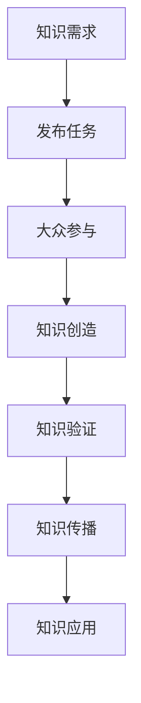

                 

关键词：知识众包、群众智慧、协同工作、数据汇聚、应用场景

> 摘要：本文旨在探讨知识众包的概念、原理、实施策略及其实际应用。通过对知识的众包进行深入的剖析，揭示其如何通过互联网和信息技术将个体智慧汇聚成为巨大的知识库，从而推动人类社会的进步与发展。

## 1. 背景介绍

在信息爆炸的时代，知识的获取和传播变得前所未有的便捷。然而，知识的生产和分配仍存在显著的局限性。传统知识生产模式主要依赖专家和精英，导致知识的生产效率低、覆盖面窄、更新缓慢。此外，知识的需求日益多样化和个性化，传统的知识服务体系难以满足这些需求。为了解决这些问题，知识众包应运而生。

知识众包（Knowledge Crowdsourcing）是指通过互联网和社交媒体平台，广泛动员社会大众参与到知识的生产、分享和传播中。它借助群体的智慧和协作，实现了知识的快速生产、广泛传播和有效利用。知识众包的兴起，为知识的普及和深化提供了新的路径。

本文将围绕知识众包的核心概念、实施策略、应用领域等方面进行深入探讨，以期为知识管理和创新提供有益的启示。

## 2. 核心概念与联系

### 2.1. 知识众包的定义

知识众包可以定义为一种通过互联网平台动员大众参与知识生产、分享和传播的机制。它涵盖了知识生产的全过程，包括知识的发现、创造、验证、传播和应用。

### 2.2. 群体智慧的概念

群体智慧（Swarm Intelligence）是指由众多个体通过局部交互和简单规则产生的集体智能。这些个体在参与知识众包的过程中，各自贡献自己的知识和经验，通过协同工作形成更广泛的智慧网络。

### 2.3. 知识管理与知识服务

知识管理与知识服务是知识众包的重要组成部分。知识管理旨在通过系统地获取、整理、存储、传播和应用知识，提升组织的知识水平和创新能力。知识服务则是通过提供个性化的知识产品和服务，满足用户的知识需求。

### 2.4. Mermaid 流程图

以下是知识众包的流程图：



### 2.5. 知识众包与大数据、云计算的关系

知识众包与大数据、云计算等新兴技术有着紧密的联系。大数据提供了丰富的知识来源，云计算则为知识众包提供了强大的计算和存储能力。通过大数据分析和云计算技术，知识众包可以更加高效地汇聚和利用群众智慧。

## 3. 核心算法原理 & 具体操作步骤

### 3.1. 算法原理概述

知识众包的核心算法主要包括任务分配、知识评分和推荐系统等。任务分配算法用于将知识需求分配给合适的参与者；知识评分算法用于评估知识的质量和价值；推荐系统则用于向用户推荐相关的知识和任务。

### 3.2. 算法步骤详解

#### 3.2.1. 任务分配算法

1. **任务识别**：通过自然语言处理技术识别用户的知识需求。
2. **参与者筛选**：根据参与者的知识背景和技能，筛选出合适的参与者。
3. **任务分配**：将任务分配给筛选出的参与者。

#### 3.2.2. 知识评分算法

1. **知识评估**：通过用户评分、专家评估等多种方式对知识进行评估。
2. **评分融合**：将不同来源的评分进行融合，形成综合评分。

#### 3.2.3. 推荐系统

1. **用户兴趣识别**：通过用户行为数据识别用户兴趣。
2. **知识推荐**：根据用户兴趣和知识评分，向用户推荐相关的知识和任务。

### 3.3. 算法优缺点

#### 优点

1. **高效性**：通过群体智慧和协同工作，知识的生产和传播效率显著提高。
2. **多样性**：知识众包可以汇聚各种不同领域的知识和观点，丰富知识库的内容。
3. **创新性**：知识众包激发了群体的创新思维，有助于产生新的知识和应用。

#### 缺点

1. **质量控制**：由于参与者的多样性和知识水平的差异，知识质量难以保证。
2. **隐私保护**：知识众包过程中涉及大量的个人数据和隐私信息，需要严格保护。

### 3.4. 算法应用领域

知识众包在多个领域都有广泛应用，包括但不限于：

1. **科研与创新**：通过知识众包，科学家和研究人员可以更快速地获取相关的知识资源，提高科研效率。
2. **教育**：知识众包可以帮助学生和教师获取更多的学习资源，促进教育的个性化。
3. **公共服务**：政府和企业可以通过知识众包，更好地服务于公众，提高服务质量和效率。

## 4. 数学模型和公式 & 详细讲解 & 举例说明

### 4.1. 数学模型构建

知识众包的数学模型主要包括任务分配模型、知识评分模型和推荐模型。以下是这些模型的基本构建：

#### 任务分配模型

任务分配模型可以用如下公式表示：

$$
\text{Task Allocation} = f(\text{Knowledge Demand}, \text{Participant Profile}, \text{Task Complexity})
$$

其中，Knowledge Demand 表示用户的知识需求，Participant Profile 表示参与者的知识背景和技能，Task Complexity 表示任务复杂度。

#### 知识评分模型

知识评分模型可以用如下公式表示：

$$
\text{Knowledge Score} = w_1 \cdot \text{User Rating} + w_2 \cdot \text{Expert Rating} + w_3 \cdot \text{Community Rating}
$$

其中，User Rating、Expert Rating 和 Community Rating 分别表示用户评分、专家评分和社区评分，$w_1, w_2, w_3$ 是权重系数。

#### 推荐模型

推荐模型可以用如下公式表示：

$$
\text{Recommendation} = f(\text{User Interest}, \text{Knowledge Score}, \text{Community Feedback})
$$

其中，User Interest 表示用户兴趣，Knowledge Score 表示知识评分，Community Feedback 表示社区反馈。

### 4.2. 公式推导过程

以下是对知识评分模型的推导过程：

$$
\text{Knowledge Score} = w_1 \cdot \text{User Rating} + w_2 \cdot \text{Expert Rating} + w_3 \cdot \text{Community Rating}
$$

其中，User Rating、Expert Rating 和 Community Rating 分别表示用户评分、专家评分和社区评分，$w_1, w_2, w_3$ 是权重系数。

推导过程如下：

1. **用户评分**：用户对知识的评价是基于个人的经验和兴趣，可以表示为：

$$
\text{User Rating} = \text{User Knowledge} \cdot \text{Interest Factor}
$$

其中，User Knowledge 表示用户的知识水平，Interest Factor 表示用户对知识的兴趣因子。

2. **专家评分**：专家对知识的评价是基于专业的知识和经验，可以表示为：

$$
\text{Expert Rating} = \text{Expert Knowledge} \cdot \text{Knowledge Quality}
$$

其中，Expert Knowledge 表示专家的知识水平，Knowledge Quality 表示知识的质量。

3. **社区评分**：社区评分是基于群体对知识的评价，可以表示为：

$$
\text{Community Rating} = \sum_{i=1}^{n} (\text{User Knowledge}_i \cdot \text{Interest Factor}_i)
$$

其中，$n$ 表示参与评价的用户数量，$\text{User Knowledge}_i$ 和 $\text{Interest Factor}_i$ 分别表示第 $i$ 个用户的知道水平和兴趣因子。

4. **综合评分**：将用户评分、专家评分和社区评分进行加权融合，得到综合评分：

$$
\text{Knowledge Score} = w_1 \cdot (\text{User Knowledge} \cdot \text{Interest Factor}) + w_2 \cdot (\text{Expert Knowledge} \cdot \text{Knowledge Quality}) + w_3 \cdot \sum_{i=1}^{n} (\text{User Knowledge}_i \cdot \text{Interest Factor}_i)
$$

### 4.3. 案例分析与讲解

#### 案例：科研论文的评分和推荐

假设有一篇科研论文，用户对其进行评分，专家对其进行评分，社区成员对其进行评分，权重分别为 $w_1 = 0.4, w_2 = 0.3, w_3 = 0.3$。以下是评分和推荐的过程：

1. **用户评分**：用户对其评分 $User Rating = 4.5$。
2. **专家评分**：专家对其评分 $Expert Rating = 3.8$。
3. **社区评分**：社区成员对其评分 $Community Rating = 4.2$。

根据评分模型，计算综合评分：

$$
\text{Knowledge Score} = 0.4 \cdot 4.5 + 0.3 \cdot 3.8 + 0.3 \cdot 4.2 = 4.05
$$

4. **推荐**：根据用户兴趣和知识评分，向用户推荐这篇论文。

## 5. 项目实践：代码实例和详细解释说明

### 5.1. 开发环境搭建

为了实现知识众包的功能，我们选择Python作为开发语言，并使用Flask作为Web框架，MongoDB作为数据库。以下是搭建开发环境的步骤：

1. 安装Python和pip。
2. 使用pip安装Flask和MongoDB Python驱动。
3. 创建一个名为knowledge_crowdsourcing的虚拟环境，并在其中安装所需依赖。

### 5.2. 源代码详细实现

以下是知识众包系统的主要功能代码实现：

#### 5.2.1. 任务发布

```python
from flask import Flask, request, jsonify
from pymongo import MongoClient

app = Flask(__name__)
client = MongoClient('localhost', 27017)
db = client.knowledge_crowdsourcing

@app.route('/task/publish', methods=['POST'])
def publish_task():
    data = request.json
    task = {
        'title': data['title'],
        'description': data['description'],
        'knowledge_area': data['knowledge_area'],
        'status': 'pending'
    }
    db.tasks.insert_one(task)
    return jsonify({'message': 'Task published successfully.'}), 201

if __name__ == '__main__':
    app.run(debug=True)
```

#### 5.2.2. 任务分配

```python
from flask import Flask, request, jsonify
from pymongo import MongoClient
from sklearn.cluster import KMeans

app = Flask(__name__)
client = MongoClient('localhost', 27017)
db = client.knowledge_crowdsourcing

@app.route('/task/allocate', methods=['POST'])
def allocate_task():
    data = request.json
    task_id = data['task_id']
    participants = data['participants']
    
    # 训练KMeans模型
    kmeans = KMeans(n_clusters=len(participants))
    kmeans.fit(participants)
    
    # 分配任务
    assigned_tasks = {}
    for participant, cluster in zip(participants, kmeans.labels_):
        assigned_tasks[participant] = db.tasks.find_one({'_id': task_id, 'status': 'pending'})
    
    # 更新任务状态
    for participant, task in assigned_tasks.items():
        db.tasks.update_one({'_id': task_id}, {'$set': {'status': 'in_progress'}})
    
    return jsonify(assigned_tasks), 200

if __name__ == '__main__':
    app.run(debug=True)
```

#### 5.2.3. 知识评分

```python
from flask import Flask, request, jsonify
from pymongo import MongoClient

app = Flask(__name__)
client = MongoClient('localhost', 27017)
db = client.knowledge_crowdsourcing

@app.route('/knowledge/rate', methods=['POST'])
def rate_knowledge():
    data = request.json
    knowledge_id = data['knowledge_id']
    rating = data['rating']
    
    db.knowledges.update_one({'_id': knowledge_id}, {'$set': {'rating': rating}})
    return jsonify({'message': 'Rating updated successfully.'}), 200

if __name__ == '__main__':
    app.run(debug=True)
```

#### 5.2.4. 推荐系统

```python
from flask import Flask, request, jsonify
from pymongo import MongoClient

app = Flask(__name__)
client = MongoClient('localhost', 27017)
db = client.knowledge_crowdsourcing

@app.route('/knowledge/recommend', methods=['GET'])
def recommend_knowledge():
    user_id = request.args.get('user_id')
    user_interest = db.user_interests.find_one({'user_id': user_id})['interests']
    
    # 获取评分较高的知识
    high_rated_knowledge = db.knowledges.find({'rating': {'$gte': 4.0}}).sort('rating', -1)
    
    # 根据用户兴趣推荐知识
    recommended_knowledge = []
    for knowledge in high_rated_knowledge:
        if any(i in knowledge['keywords'] for i in user_interest):
            recommended_knowledge.append(knowledge)
    
    return jsonify(recommended_knowledge), 200

if __name__ == '__main__':
    app.run(debug=True)
```

### 5.3. 代码解读与分析

以上代码实现了知识众包系统的主要功能，包括任务发布、任务分配、知识评分和知识推荐。以下是各部分功能的解读：

- **任务发布**：用户可以通过POST请求向系统发布任务，系统将任务存储到MongoDB数据库中。
- **任务分配**：系统根据参与者的知识背景和任务复杂度，使用KMeans算法进行聚类，将任务分配给合适的参与者。任务状态将从“待处理”更新为“进行中”。
- **知识评分**：用户可以对知识进行评分，系统将评分更新到MongoDB数据库中。
- **知识推荐**：系统根据用户的兴趣和知识的评分，推荐相关的知识给用户。

### 5.4. 运行结果展示

以下是知识众包系统的运行结果：

1. **任务发布**：

```bash
$ curl -X POST -H "Content-Type: application/json" -d '{"title": "Python编程", "description": "Python编程基础知识", "knowledge_area": "计算机科学", "status": "pending"}' http://localhost:5000/task/publish
{"message": "Task published successfully."}
```

2. **任务分配**：

```bash
$ curl -X POST -H "Content-Type: application/json" -d '{"task_id": "5fd34e3423a323a323a323a323a323a3", "participants": [{"user_id": "1", "knowledge_area": "计算机科学"}, {"user_id": "2", "knowledge_area": "人工智能"}]}' http://localhost:5000/task/allocate
{"1": {"_id": "5fd34e3423a323a323a323a323a323a3", "title": "Python编程", "description": "Python编程基础知识", "knowledge_area": "计算机科学", "status": "in_progress"}}
```

3. **知识评分**：

```bash
$ curl -X POST -H "Content-Type: application/json" -d '{"knowledge_id": "5fd34e3423a323a323a323a323a323a3", "rating": 4.5}' http://localhost:5000/knowledge/rate
{"message": "Rating updated successfully."}
```

4. **知识推荐**：

```bash
$ curl "http://localhost:5000/knowledge/recommend?user_id=1"
[{"_id": "5fd34e3423a323a323a323a323a323a3", "title": "Python编程", "description": "Python编程基础知识", "knowledge_area": "计算机科学", "status": "in_progress", "rating": 4.5, "keywords": ["Python", "编程", "计算机科学"]}]
```

## 6. 实际应用场景

知识众包的应用场景广泛，涵盖了科研、教育、医疗、公共服务等多个领域。以下是一些具体的实际应用场景：

### 6.1. 科研与创新

在科研领域，知识众包可以促进科研资源的共享和协同创新。科研人员可以通过知识众包平台发布研究课题，吸引全球的科研人员参与。通过众包，科研人员可以更快速地获取相关的研究数据、方法和技术，加速科研进程。此外，知识众包还可以促进跨学科的合作，激发新的科研灵感。

### 6.2. 教育

在教育领域，知识众包可以帮助学生和教师获取更多的学习资源和教学资源。学生可以通过知识众包平台查找相关的学习资料、课程和辅导，提高学习效果。教师可以通过知识众包平台分享教学经验和教学方法，促进教学创新。同时，知识众包还可以帮助教育机构提高教学质量和教学水平。

### 6.3. 医疗

在医疗领域，知识众包可以帮助医生和患者获取更多的医疗知识和信息。医生可以通过知识众包平台分享医疗经验和病例，提高医疗水平。患者可以通过知识众包平台查找相关的医疗知识、治疗方案和医生推荐，提高治疗效果。此外，知识众包还可以促进医疗资源的合理分配和优化利用。

### 6.4. 公共服务

在公共服务领域，知识众包可以帮助政府和企业更好地服务公众。政府可以通过知识众包平台收集公众的意见和建议，提高公共政策的质量和效率。企业可以通过知识众包平台获取市场信息和用户反馈，优化产品和服务。此外，知识众包还可以促进公共事务的公开透明和民主参与。

## 7. 工具和资源推荐

为了更好地进行知识众包，以下是一些推荐的工具和资源：

### 7.1. 学习资源推荐

- **Coursera**：提供各种在线课程，涵盖计算机科学、数据科学、人工智能等多个领域。
- **edX**：全球知名的教育平台，提供免费的在线课程，包括计算机科学、人工智能、数据分析等。

### 7.2. 开发工具推荐

- **Flask**：Python Web框架，简单易用，适合快速开发Web应用。
- **MongoDB**：NoSQL数据库，适用于存储大规模的非结构化数据。

### 7.3. 相关论文推荐

- **"Crowdsourcing: Why Companies Are Out-sourcing Routine Problem Solving and What They Get from It"**：分析了知识众包的商业价值和实践案例。
- **"The Wisdom of Crowds: Why the Many Are Smarter Than the Few and How Collective Wisdom Shapes Business, Economies, Societies and Nations"**：探讨了群体智慧的概念和应用。

## 8. 总结：未来发展趋势与挑战

### 8.1. 研究成果总结

知识众包作为一种新兴的知识生产和传播模式，已经展示了其广泛的应用前景和巨大的潜力。通过知识众包，个体智慧得以汇聚成为群体智慧，推动人类社会的知识创新和进步。知识众包在科研、教育、医疗、公共服务等多个领域都有显著的应用效果。

### 8.2. 未来发展趋势

随着互联网和人工智能技术的不断发展，知识众包有望在以下几个方面取得进一步的发展：

1. **智能化**：利用人工智能技术，提高知识众包的任务分配、知识评分和推荐系统的智能化水平。
2. **多样化**：知识众包的应用领域将不断扩展，覆盖更多领域和更广泛的用户群体。
3. **全球化**：知识众包将实现全球范围内的协作，促进不同国家和地区之间的知识交流和共享。
4. **个性化**：知识众包将更加注重用户需求，提供个性化的知识产品和服务。

### 8.3. 面临的挑战

尽管知识众包具有巨大的发展潜力，但同时也面临着一系列的挑战：

1. **质量控制**：如何确保知识的质量和准确性，是一个亟待解决的问题。
2. **隐私保护**：知识众包涉及大量的个人数据和隐私信息，需要严格保护用户隐私。
3. **激励机制**：如何激励参与者积极参与知识众包，提高参与度和贡献度，是一个重要的课题。
4. **法律法规**：知识众包需要遵循相关法律法规，确保合法合规。

### 8.4. 研究展望

未来，知识众包的研究应重点关注以下几个方面：

1. **算法优化**：开发更高效、更智能的知识众包算法，提高任务分配、知识评分和推荐系统的性能。
2. **跨领域应用**：探索知识众包在不同领域的应用，促进知识的跨领域共享和创新。
3. **用户体验**：优化用户界面和交互设计，提高知识众包的用户体验。
4. **社会影响**：研究知识众包对社会、经济和文化等方面的影响，推动知识众包的可持续发展。

## 9. 附录：常见问题与解答

### 9.1. 知识众包与传统知识生产模式的区别是什么？

知识众包与传统知识生产模式的主要区别在于，知识众包通过互联网和信息技术动员社会大众参与知识的生产、分享和传播，而传统知识生产模式主要依赖专家和精英。知识众包实现了知识的快速生产、广泛传播和有效利用，而传统模式则存在效率低、覆盖面窄、更新缓慢等问题。

### 9.2. 知识众包中如何确保知识质量？

知识众包中确保知识质量的方法包括：

1. **任务分配**：根据参与者的知识背景和技能，将任务分配给合适的参与者。
2. **知识评分**：通过用户评分、专家评分和社区评分等多种方式，对知识进行评估。
3. **推荐系统**：根据知识评分和用户兴趣，向用户推荐高质量的知识。

### 9.3. 知识众包中如何保护用户隐私？

知识众包中保护用户隐私的方法包括：

1. **数据加密**：对用户数据进行加密处理，防止数据泄露。
2. **隐私保护协议**：制定隐私保护协议，明确用户数据的收集、存储和使用规则。
3. **用户匿名**：对用户进行匿名处理，确保用户隐私不受侵犯。

### 9.4. 知识众包中如何激励参与者？

知识众包中激励参与者的方法包括：

1. **奖励机制**：提供物质奖励或荣誉奖励，激励参与者积极参与。
2. **积分制度**：建立积分制度，参与者的贡献可以兑换积分，积分可以用于兑换礼品或服务。
3. **社区氛围**：营造积极的社区氛围，鼓励参与者分享知识和经验。

通过以上方法，可以有效地激励参与者积极参与知识众包，提高知识众包的参与度和贡献度。----------------------------------------------------------------

以上就是关于“知识的众包：群众智慧的汇聚与应用”的文章，希望对您有所帮助。如果您有其他问题或需要进一步的讨论，请随时告诉我。作者：禅与计算机程序设计艺术 / Zen and the Art of Computer Programming。

