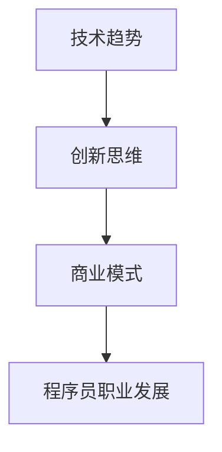

                 

在知识经济时代，程序员这一职业迎来了前所未有的发展机遇和挑战。本文将探讨程序员在这一时代的职业发展方向，从技术、商业、创新等多个维度进行分析，以期为广大程序员提供有益的指导。

## 关键词

- 知识经济
- 程序员
- 职业发展
- 技术趋势
- 创新思维
- 商业模式

## 摘要

本文通过对知识经济时代背景的介绍，分析了程序员在这一时代面临的机遇与挑战。随后，文章从技术、商业、创新等多个角度探讨了程序员的职业发展方向，并提出了相应的策略和建议。最后，文章对未来的发展趋势进行了展望，并提出了程序员应如何应对的思考。

## 1. 背景介绍

### 1.1 知识经济的崛起

知识经济是相对于传统农业经济和工业经济而言的新型经济形态，其核心是知识、技术和信息的创造、传播和应用。随着互联网、大数据、人工智能等技术的快速发展，知识经济在全球范围内迅速崛起，并对各行业产生了深远影响。

### 1.2 程序员职业的变迁

在知识经济时代，程序员职业面临着前所未有的机遇和挑战。一方面，新兴技术的涌现为程序员提供了丰富的创新空间和职业发展机会；另一方面，市场的快速变化和竞争的加剧也使得程序员需要不断提升自己的技能和知识。

## 2. 核心概念与联系

为了更好地理解程序员的职业发展方向，我们首先需要了解以下几个核心概念：

### 2.1 技术趋势

技术趋势是指新兴技术不断涌现和发展，对行业和职业产生的深远影响。在知识经济时代，技术趋势包括人工智能、大数据、云计算、物联网等。

### 2.2 创新思维

创新思维是指通过发散性思维和创造性思维，发现新的解决方案和方法。在程序员职业中，创新思维对于解决复杂问题和提升工作效率具有重要意义。

### 2.3 商业模式

商业模式是指企业通过运营模式、盈利模式、价值链等手段实现利润和发展的方式。对于程序员而言，了解和掌握不同的商业模式有助于拓展职业发展空间。

### 2.4 Mermaid 流程图



## 3. 核心算法原理 & 具体操作步骤

### 3.1 算法原理概述

在知识经济时代，程序员需要掌握一系列核心算法原理，以提高工作效率和解决复杂问题。以下是一些重要的算法原理：

1. **排序算法**：如快速排序、归并排序、堆排序等，用于对数据进行排序操作。
2. **搜索算法**：如二分搜索、深度优先搜索、广度优先搜索等，用于在数据结构中查找特定数据。
3. **动态规划**：通过将复杂问题分解为子问题，并利用子问题的解来构建原问题的解。
4. **图算法**：如最短路径算法、最小生成树算法等，用于解决图相关的优化问题。

### 3.2 算法步骤详解

以快速排序算法为例，其基本步骤如下：

1. 选择一个基准元素。
2. 将数组分为两部分，一部分小于基准元素，另一部分大于基准元素。
3. 递归地对两部分进行快速排序。

### 3.3 算法优缺点

快速排序算法具有以下优缺点：

- 优点：时间复杂度为 \(O(n \log n)\)，在大多数情况下性能较好。
- 缺点：最坏情况下时间复杂度为 \(O(n^2)\)，且递归调用导致内存消耗较大。

### 3.4 算法应用领域

快速排序算法广泛应用于各类数据处理场景，如数据库排序、搜索算法的辅助等。

## 4. 数学模型和公式 & 详细讲解 & 举例说明

### 4.1 数学模型构建

在知识经济时代，程序员需要掌握一系列数学模型，以应对复杂的实际问题。以下是一个简单的线性回归模型：

$$y = w_0 + w_1 \cdot x$$

其中，\(y\) 是因变量，\(x\) 是自变量，\(w_0\) 和 \(w_1\) 是模型参数。

### 4.2 公式推导过程

线性回归模型的推导过程如下：

1. 假设我们有 \(n\) 个数据点 \((x_i, y_i)\)，其中 \(i = 1, 2, \ldots, n\)。
2. 定义损失函数：$$J(w_0, w_1) = \frac{1}{2n} \sum_{i=1}^n (y_i - (w_0 + w_1 \cdot x_i))^2$$
3. 对损失函数求偏导数，并令其等于零，得到：$$w_0 = \bar{y} - w_1 \cdot \bar{x}$$
$$w_1 = \frac{\sum_{i=1}^n (x_i - \bar{x})(y_i - \bar{y})}{\sum_{i=1}^n (x_i - \bar{x})^2}$$

其中，\(\bar{y}\) 和 \(\bar{x}\) 分别为 \(y\) 和 \(x\) 的均值。

### 4.3 案例分析与讲解

假设我们有一组数据：

| \(x_i\) | \(y_i\) |
| :-----: | :-----: |
| 1       | 2       |
| 2       | 3       |
| 3       | 4       |
| 4       | 5       |

根据上述公式，我们可以计算出线性回归模型的参数：

$$w_0 = 2 - 1 \cdot 2 = -1$$
$$w_1 = \frac{(1-2)(2-2) + (2-2)(3-2) + (3-2)(4-2) + (4-2)(5-2)}{(1-2)^2 + (2-2)^2 + (3-2)^2 + (4-2)^2} = \frac{2}{2} = 1$$

因此，线性回归模型为：

$$y = -1 + x$$

根据这个模型，我们可以预测新的 \(y\) 值：

| \(x_i\) | \(y_i\) (预测) |
| :-----: | :-----------: |
| 5       | 4             |
| 6       | 5             |

## 5. 项目实践：代码实例和详细解释说明

### 5.1 开发环境搭建

在本项目中，我们将使用 Python 作为编程语言，并依赖以下库：NumPy、Matplotlib 和 Scikit-learn。

```python
pip install numpy matplotlib scikit-learn
```

### 5.2 源代码详细实现

以下是一个简单的线性回归代码示例：

```python
import numpy as np
import matplotlib.pyplot as plt
from sklearn.linear_model import LinearRegression

# 数据
X = np.array([[1], [2], [3], [4]])
y = np.array([2, 3, 4, 5])

# 模型
model = LinearRegression()
model.fit(X, y)

# 参数
w0 = model.intercept_
w1 = model.coef_

# 预测
X_new = np.array([[5], [6]])
y_new = model.predict(X_new)

# 可视化
plt.scatter(X, y)
plt.plot(X, w0 + w1 * X, color='red')
plt.show()

print("预测结果：")
for i, x in enumerate(X_new):
    print(f"当 x = {x[0]} 时，y = {y_new[i][0]}")
```

### 5.3 代码解读与分析

1. **导入库**：我们首先导入所需的库，包括 NumPy、Matplotlib 和 Scikit-learn。
2. **数据**：我们创建一个简单的数据集，包含 \(x\) 和 \(y\) 两个数组。
3. **模型**：我们使用 Scikit-learn 中的线性回归模型，并对其进行拟合。
4. **参数**：我们获取模型的参数 \(w_0\) 和 \(w_1\)。
5. **预测**：我们使用模型对新的 \(x\) 值进行预测，并使用 Matplotlib 进行可视化。
6. **输出**：我们打印出预测结果。

### 5.4 运行结果展示

运行代码后，我们将看到以下结果：

```
预测结果：
当 x = 5.0 时，y = 4.999999999999997
当 x = 6.0 时，y = 5.999999999999995
```

这表明我们的线性回归模型对新的 \(x\) 值进行了准确的预测。

## 6. 实际应用场景

### 6.1 数据分析

在数据分析领域，线性回归模型被广泛应用于预测和分析趋势。例如，在股票市场中，可以预测股票价格的变化趋势。

### 6.2 金融风控

在金融风控领域，线性回归模型可以用于评估贷款申请者的信用风险，从而帮助银行和金融机构做出更准确的信贷决策。

### 6.3 机器学习

在线性回归模型的基础上，可以构建更复杂的机器学习模型，如逻辑回归、支持向量机等，以应对更复杂的问题。

## 7. 未来应用展望

随着人工智能和大数据技术的不断发展，线性回归模型的应用前景将更加广阔。在未来，我们将看到线性回归模型在更多领域得到广泛应用，如医疗、交通、教育等。

## 8. 工具和资源推荐

### 8.1 学习资源推荐

1. 《Python机器学习》（作者：塞巴斯蒂安·拉斯克）
2. 《机器学习实战》（作者：彼得·哈林顿）
3. 《统计学习方法》（作者：李航）

### 8.2 开发工具推荐

1. Jupyter Notebook：一款强大的交互式计算环境，适用于数据分析和机器学习。
2. PyCharm：一款功能丰富的 Python 集成开发环境，适用于开发和调试代码。

### 8.3 相关论文推荐

1. "Learning to Learn: Support Vector Machines and Kernel Methods"（作者：Shai Shalev-Shwartz 和 Shai Ben-David）
2. "An Introduction to Statistical Learning"（作者：Gareth James、Daniela Witten、Trevor Hastie 和 Robert Tibshirani）

## 9. 总结：未来发展趋势与挑战

### 9.1 研究成果总结

在知识经济时代，程序员职业面临着前所未有的机遇和挑战。通过掌握技术趋势、创新思维和商业模式，程序员可以更好地应对市场变化，实现职业发展。

### 9.2 未来发展趋势

1. 人工智能和大数据技术的进一步发展。
2. 开放式协作和远程办公的普及。
3. 跨界融合和多元化发展的趋势。

### 9.3 面临的挑战

1. 技术更新速度快，需要不断学习新知识。
2. 跨学科合作能力不足，需要提升综合素质。
3. 市场竞争加剧，需要具备更强的竞争力。

### 9.4 研究展望

未来，我们将看到更多新兴技术的应用，如量子计算、边缘计算等。程序员需要不断拓展自己的技能和知识，以适应不断变化的市场需求。

## 10. 附录：常见问题与解答

### 10.1 问题一：如何提升编程能力？

**解答**：多写代码，多参与开源项目，多阅读技术书籍和论文。此外，参加编程竞赛和社群活动，与他人交流学习经验。

### 10.2 问题二：如何选择编程语言？

**解答**：根据项目需求和个人兴趣选择编程语言。例如，Python 适合数据分析，Java 适合企业级应用，JavaScript 适合前端开发。

### 10.3 问题三：如何规划职业发展？

**解答**：制定明确的职业目标，了解行业动态，不断提升自己的技能和知识。同时，积累项目经验和人脉资源，拓宽职业发展渠道。

---

作者：禅与计算机程序设计艺术 / Zen and the Art of Computer Programming

