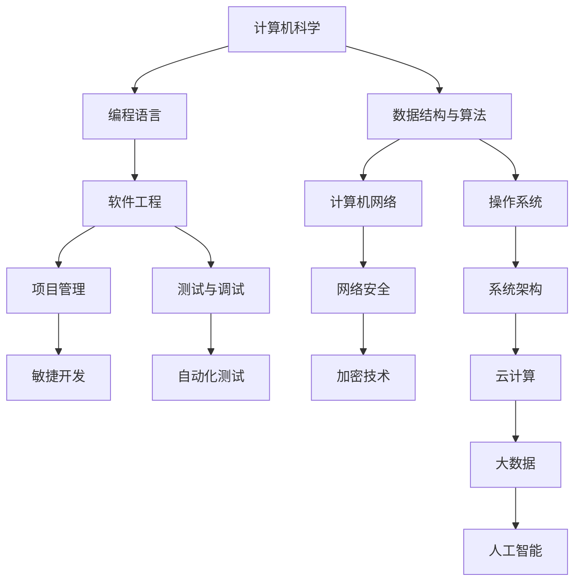

                 

关键词：知识体系，程序员，个人发展，专业成长，技术学习

摘要：本文旨在探讨程序员如何通过系统地构建个人知识体系，实现持续的专业成长和个人发展。我们将从核心概念、算法原理、数学模型、项目实践、应用场景、工具推荐等方面，深入解析构建个人知识体系的方法和路径。

## 1. 背景介绍

在信息技术快速发展的今天，程序员的角色和技能需求也在不断演变。从传统的编码任务，到如今的全栈开发、人工智能、大数据处理等领域，程序员面临着更高的技术要求和更广泛的知识面。因此，构建一个系统化的个人知识体系，对于程序员的职业发展和个人成长至关重要。

### 1.1 程序员面临的挑战

1. 技术更新迅速：新语言、框架和工具层出不穷，程序员需要不断学习。
2. 多学科交叉：编程不仅涉及计算机科学，还需要了解数学、物理学、心理学等。
3. 职业发展多样：从开发到管理、从技术专家到创业者，程序员有多个职业路径。

### 1.2 个人知识体系的重要性

1. **提高工作效率**：系统化的知识体系有助于快速解决技术问题。
2. **促进创新**：跨领域的知识积累能够激发创新思维。
3. **职业发展**：完善的个人知识体系是职业晋升的基石。

## 2. 核心概念与联系

为了构建个人知识体系，首先需要理解一些核心概念及其相互联系。以下是一个简化的 Mermaid 流程图，展示了一些重要的技术和领域。



### 2.1 计算机科学

计算机科学是程序员知识体系的基础，涵盖计算机系统、编程语言、算法和数据结构等核心内容。

### 2.2 编程语言

编程语言是实现编程任务的工具，不同的编程语言有不同的应用场景和特点。例如，Python 适用于数据分析和人工智能，而 Java 则广泛应用于企业级应用开发。

### 2.3 数据结构与算法

数据结构与算法是计算机科学的核心内容，对于解决复杂问题至关重要。常见的算法有排序、查找、图算法等。

### 2.4 软件工程

软件工程涉及软件设计、开发、测试和维护等全过程，包括项目管理、敏捷开发、测试与调试等。

### 2.5 网络与操作系统

网络和操作系统是计算机系统的基础设施，了解网络协议、操作系统原理等对于程序员至关重要。

## 3. 核心算法原理 & 具体操作步骤

### 3.1 算法原理概述

算法是解决问题的一系列有序指令，其效率和质量直接影响程序的性能。常见的算法包括：

- 排序算法：如快速排序、归并排序等。
- 搜索算法：如二分搜索、广度优先搜索等。
- 图算法：如最短路径算法、拓扑排序等。

### 3.2 算法步骤详解

以快速排序算法为例，其基本步骤如下：

1. 选择一个基准元素。
2. 将比基准元素小的元素移到左侧，比其大的移到右侧。
3. 对左侧和右侧子序列重复上述步骤。

### 3.3 算法优缺点

快速排序是一种高效的排序算法，其平均时间复杂度为 \(O(n\log n)\)，但最坏情况下的时间复杂度为 \(O(n^2)\)。此外，快速排序的不稳定性可能导致数据不稳定。

### 3.4 算法应用领域

快速排序广泛应用于各种排序任务，如数据库排序、文本编辑器等。

## 4. 数学模型和公式 & 详细讲解 & 举例说明

### 4.1 数学模型构建

数学模型是抽象现实世界问题的一种方法，例如，线性回归模型用于预测数值。

### 4.2 公式推导过程

以线性回归模型为例，其公式推导如下：

$$y = ax + b$$

其中，\(y\) 是因变量，\(x\) 是自变量，\(a\) 和 \(b\) 是参数。

### 4.3 案例分析与讲解

假设我们要预测一家商店的销售额，我们可以使用线性回归模型。通过收集历史数据，我们得到以下公式：

$$销售额 = 1000x + 500$$

其中，\(x\) 是促销活动的天数。

## 5. 项目实践：代码实例和详细解释说明

### 5.1 开发环境搭建

我们需要安装 Python 编译器和相关的库，如 NumPy 和 Matplotlib。

### 5.2 源代码详细实现

以下是一个简单的 Python 代码示例，用于实现线性回归模型：

```python
import numpy as np
import matplotlib.pyplot as plt

# 输入数据
x = np.array([1, 2, 3, 4, 5])
y = np.array([2, 4, 6, 8, 10])

# 求解参数 a 和 b
a = np.mean(x * y) - np.mean(x) * np.mean(y)
b = np.mean(y) - a * np.mean(x)

# 预测
y_pred = a * x + b

# 绘图
plt.scatter(x, y)
plt.plot(x, y_pred, color='red')
plt.show()
```

### 5.3 代码解读与分析

这段代码首先导入所需的库，然后定义输入数据。接着，我们使用最小二乘法求解参数 \(a\) 和 \(b\)。最后，我们绘制预测结果。

### 5.4 运行结果展示

运行上述代码，我们得到一个散点图和一个红色拟合直线，展示了线性回归模型的效果。

## 6. 实际应用场景

线性回归模型在商业预测、金融分析等领域有广泛应用。例如，在市场营销中，可以使用线性回归预测销售额。

### 6.4 未来应用展望

随着人工智能和大数据技术的发展，线性回归模型将继续在预测和分析领域发挥作用。同时，新的数学模型和算法将不断涌现，为程序员提供更强大的工具。

## 7. 工具和资源推荐

### 7.1 学习资源推荐

- 《算法导论》（Introduction to Algorithms）
- 《机器学习》（Machine Learning）
- 《Python编程：从入门到实践》（Python Crash Course）

### 7.2 开发工具推荐

- PyCharm（Python IDE）
- Visual Studio Code（跨平台 IDE）
- Jupyter Notebook（交互式数据分析环境）

### 7.3 相关论文推荐

- "Support Vector Machines for Classification and Regression"
- "Deep Learning"
- "Reinforcement Learning: An Introduction"

## 8. 总结：未来发展趋势与挑战

### 8.1 研究成果总结

随着信息技术的快速发展，程序员的知识体系也在不断扩展。从传统的编程技能，到人工智能、大数据等新兴领域，程序员需要不断学习和更新知识。

### 8.2 未来发展趋势

未来的程序员将更加重视跨学科的知识积累，如数学、统计学、心理学等。此外，自动化和智能化的趋势将使编程工作更加高效和便捷。

### 8.3 面临的挑战

程序员面临着快速的技术更新和日益复杂的项目需求。因此，持续学习和适应变化将成为程序员的重要能力。

### 8.4 研究展望

未来，人工智能和大数据技术将继续推动程序员知识体系的变革。新的算法和工具将不断涌现，为程序员提供更多的创新机会。

## 9. 附录：常见问题与解答

### 9.1 如何选择学习资源？

建议根据个人兴趣和职业目标选择合适的资源。初学者可以参考入门书籍，有经验者可以阅读专业论文。

### 9.2 如何保持学习动力？

制定明确的学习计划和目标，保持持续的学习动力。同时，与他人交流、分享学习心得，可以增强学习的兴趣和动力。

### 9.3 如何评估学习效果？

通过实际项目和实践来检验学习成果。参加在线编程竞赛、开源项目贡献等，都是评估学习效果的有效方法。

---

作者：禅与计算机程序设计艺术 / Zen and the Art of Computer Programming


