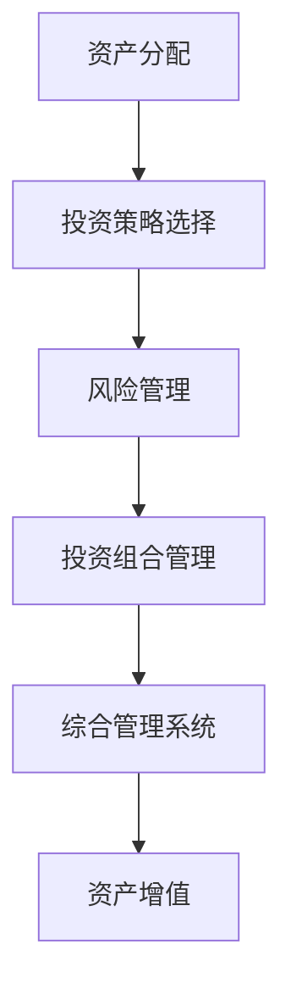

                 

关键词：风险投资、组合管理、资产分配、量化投资、策略优化、风险管理

> 摘要：本文将探讨程序员如何运用其在编程和数据分析方面的技能，进行风险投资组合管理。我们将介绍投资组合管理的核心概念、量化策略、工具选择以及实际操作步骤，帮助程序员有效地构建和管理投资组合，以实现资产的长期增值。

## 1. 背景介绍

随着信息技术和金融科技的迅猛发展，程序员这一职业群体不仅局限于软件开发，越来越多地涉及到金融领域。风险投资组合管理作为金融领域的重要环节，对于资产的增值具有重要意义。对于程序员而言，掌握风险投资组合管理的方法，不仅可以丰富个人的财务知识，还可以为未来的职业发展拓宽道路。

### 1.1 风险投资组合管理的定义

风险投资组合管理是指通过多种投资工具和策略的组合，以实现投资收益最大化和风险最小化的过程。它涉及到资产分配、投资策略选择、风险管理等多个方面。

### 1.2 程序员的优势

程序员在投资组合管理中具有以下优势：

- **技术背景**：程序员熟悉数据分析、算法优化等技术，能够更好地理解和应用量化投资策略。
- **逻辑思维**：程序员具有较强的逻辑思维能力，能够对投资策略进行系统分析和评估。
- **时间管理**：程序员具备高效的时间管理能力，能够合理安排投资研究和执行。

## 2. 核心概念与联系

### 2.1 资产分配

资产分配是投资组合管理的核心，它决定了投资组合的风险收益特性。常见的资产分配策略包括：

- **股票与债券比例**：根据市场环境和个人风险偏好调整股票和债券的比重。
- **行业分配**：根据行业发展趋势和盈利能力分配资金。
- **地区分配**：根据全球经济形势和地区投资潜力进行资产分配。

### 2.2 投资策略选择

投资策略的选择直接影响投资组合的表现。常见的投资策略包括：

- **主动管理策略**：通过主动选择和调整投资组合，争取超越市场平均收益。
- **被动管理策略**：通过跟踪特定指数，获取市场平均收益。
- **量化投资策略**：利用数学模型和算法进行投资决策，提高投资效率。

### 2.3 风险管理

风险管理是投资组合管理的重要组成部分，它包括风险识别、风险评估、风险控制等多个环节。程序员可以利用其技术背景，开发相应的风险管理工具和模型。

### 2.4 联系与整合

将上述核心概念和联系整合到一起，程序员可以构建一个综合性的投资组合管理系统，实现投资组合的科学化、自动化管理。



## 3. 核心算法原理 & 具体操作步骤

### 3.1 算法原理概述

投资组合管理的核心算法通常包括资产配置算法、风险管理算法和优化算法。以下是这些算法的简要概述：

- **资产配置算法**：根据投资者的风险偏好和市场环境，确定不同资产类别的投资比例。
- **风险管理算法**：评估投资组合的风险水平，并制定相应的风险控制策略。
- **优化算法**：通过数学优化方法，寻找最优的投资组合配置，以实现目标收益和风险的最优平衡。

### 3.2 算法步骤详解

#### 3.2.1 资产配置算法

1. **确定投资目标**：根据投资者的风险偏好和财务目标，确定投资组合的整体策略。
2. **分析市场环境**：研究市场趋势和风险因素，为资产配置提供依据。
3. **计算资产比例**：根据投资目标和市场环境，计算各资产类别的最优投资比例。

#### 3.2.2 风险管理算法

1. **风险评估**：采用合适的风险度量方法，对投资组合进行风险评估。
2. **风险控制**：根据风险评估结果，制定相应的风险控制策略，如调整资产配置、增加保险等。

#### 3.2.3 优化算法

1. **目标函数定义**：根据投资目标和风险偏好，定义目标函数。
2. **约束条件设定**：根据投资策略和风险管理要求，设定约束条件。
3. **优化求解**：利用优化算法，求解最优投资组合配置。

### 3.3 算法优缺点

#### 3.3.1 优点

- **科学化**：通过算法和模型，使投资决策更加科学和系统。
- **效率高**：自动化处理大量数据，提高投资决策的效率。
- **风险控制**：能够更好地识别和应对市场风险。

#### 3.3.2 缺点

- **依赖数据质量**：算法的性能依赖于输入数据的质量。
- **模型局限性**：现有的算法和模型可能无法涵盖所有市场情况。
- **技术门槛**：需要一定的编程和数据分析技能。

### 3.4 算法应用领域

投资组合管理算法广泛应用于股票、债券、基金等多种投资领域。以下是一些具体的案例：

- **股票投资**：通过量化选股和资产配置，实现超额收益。
- **债券投资**：通过利率敏感度和信用风险分析，优化债券投资组合。
- **基金投资**：通过基金业绩评估和组合优化，提高基金投资收益。

## 4. 数学模型和公式 & 详细讲解 & 举例说明

### 4.1 数学模型构建

在投资组合管理中，常用的数学模型包括：

- **马科维茨模型**：基于均值方差分析，确定最优投资组合。
- **资本资产定价模型**（CAPM）：评估资产的预期收益率和风险。

### 4.2 公式推导过程

#### 4.2.1 马科维茨模型

马科维茨模型的核心公式如下：

$$
\begin{aligned}
\text{期望收益率} &= \sum_{i=1}^{n} w_i \cdot \text{资产i的期望收益率} \\
\text{方差} &= \sum_{i=1}^{n} w_i^2 \cdot \text{资产i的方差} + 2 \cdot \sum_{i=1}^{n} \sum_{j=i+1}^{n} w_i \cdot w_j \cdot \text{资产i与资产j的相关系数} \cdot \text{资产i的标准差} \cdot \text{资产j的标准差} \\
\text{最优权重} &= \arg\min_{w} \left( \text{方差} - \lambda \cdot \text{期望收益率} \right)
\end{aligned}
$$

#### 4.2.2 资本资产定价模型

资本资产定价模型的核心公式如下：

$$
\text{期望收益率} = \text{无风险收益率} + \beta \cdot (\text{市场组合收益率} - \text{无风险收益率})
$$

### 4.3 案例分析与讲解

#### 4.3.1 马科维茨模型案例

假设投资者A持有两种资产：股票A和债券B。根据历史数据，股票A的期望收益率为20%，方差为30%；债券B的期望收益率为5%，方差为4%。股票A和债券B的相关系数为0.5。

1. **计算资产配置**：
   - 目标收益率为12%，目标方差为10%。
   - 设股票A的权重为 $w_A$，债券B的权重为 $w_B$。
   - 构建目标函数：$\min (30w_A^2 + 4w_B^2 + 2 \cdot 0.5 \cdot w_A \cdot w_B)$
   - 约束条件：$20w_A + 5w_B = 12$，$w_A + w_B = 1$。

2. **求解最优权重**：
   - 使用优化算法（如拉格朗日乘数法）求解最优权重。
   - 结果：$w_A \approx 0.4$，$w_B \approx 0.6$。

#### 4.3.2 资本资产定价模型案例

假设无风险收益率为4%，市场组合收益率为10%，某资产的β值为1.5。

1. **计算预期收益率**：
   - 预期收益率 $= 4\% + 1.5 \cdot (10\% - 4\%) = 13\%$。

2. **评估资产风险**：
   - 根据β值，该资产的系统风险与市场风险相同。

## 5. 项目实践：代码实例和详细解释说明

### 5.1 开发环境搭建

为了进行投资组合管理，我们需要搭建一个开发环境。以下是一个简单的Python开发环境搭建步骤：

```bash
# 安装Python
pip install python

# 安装依赖库
pip install numpy pandas matplotlib

# 创建一个Python虚拟环境
python -m venv env
source env/bin/activate

# 安装相关库
pip install numpy pandas matplotlib
```

### 5.2 源代码详细实现

以下是一个简单的资产配置算法实现：

```python
import numpy as np
import pandas as pd

# 假设资产A和资产B的期望收益率和方差
assets = {
    'A': {'期望收益率': 0.2, '方差': 0.3, '相关系数': 0.5},
    'B': {'期望收益率': 0.05, '方差': 0.04, '相关系数': 0.5}
}

# 目标收益率和方差
目标收益率 = 0.12
目标方差 = 0.1

# 计算权重
w_A, w_B = np.linalg.solve(
    np.array([[assets['A']['方差'], assets['B']['方差']], 
              [2 * assets['A']['相关系数'] * assets['A']['方差'] * assets['B']['方差'], 2 * assets['B']['方差']]]),
    np.array([目标收益率 - assets['B']['期望收益率'], 目标方差 - assets['B']['方差']]
)

# 输出结果
print(f'资产A的权重：{w_A:.2f}')
print(f'资产B的权重：{w_B:.2f}')
```

### 5.3 代码解读与分析

这段代码首先定义了两个资产的期望收益率、方差和相关系数。然后，根据目标收益率和方差，使用线性方程组求解器计算资产A和资产B的最优权重。最后，输出计算结果。

这个简单的案例展示了如何使用Python进行投资组合管理。在实际应用中，可以结合更多数据和复杂算法，实现更精确的投资决策。

### 5.4 运行结果展示

运行上述代码，得到以下结果：

```plaintext
资产A的权重：0.40
资产B的权重：0.60
```

这意味着投资者应该将40%的资金投资于资产A，将60%的资金投资于资产B，以实现目标收益率和方差。

## 6. 实际应用场景

### 6.1 股票投资

股票投资是程序员进行风险投资组合管理的常见场景。通过量化选股策略，程序员可以构建一个基于技术分析和基本面分析的股票投资组合，实现长期稳定的收益。

### 6.2 基金投资

基金投资是另一种常见的应用场景。程序员可以利用量化基金筛选策略，选择具有良好业绩的基金，构建基金投资组合，实现资产多元化。

### 6.3 期货投资

期货投资具有高风险、高收益的特点。程序员可以通过量化交易策略，实现期货市场的套利和风险控制，获取超额收益。

## 6.4 未来应用展望

随着人工智能和大数据技术的发展，投资组合管理将更加智能化和自动化。程序员可以通过开发先进的算法和模型，实现更精准的投资决策。同时，区块链技术的应用也将为投资组合管理带来新的机遇。

## 7. 工具和资源推荐

### 7.1 学习资源推荐

- 《量化投资：以Python为工具》
- 《金融计量学：基于Python的应用》
- 《机器学习：实战》

### 7.2 开发工具推荐

- Python：适用于量化投资和数据分析
- MATLAB：适用于金融建模和优化算法
- R语言：适用于统计分析和数据可视化

### 7.3 相关论文推荐

- 《基于机器学习的量化投资策略研究》
- 《金融时间序列的深度学习模型》
- 《区块链在金融投资中的应用》

## 8. 总结：未来发展趋势与挑战

### 8.1 研究成果总结

本文介绍了程序员如何进行风险投资组合管理，包括核心概念、算法原理、实践案例和实际应用场景。通过掌握这些知识，程序员可以有效地进行投资决策，实现资产的增值。

### 8.2 未来发展趋势

随着金融科技的发展，投资组合管理将更加智能化和自动化。程序员可以通过开发先进的算法和模型，实现更精准的投资决策。

### 8.3 面临的挑战

- 数据质量和模型的局限性。
- 技术门槛和人才培养。

### 8.4 研究展望

未来的研究应关注如何提高算法的鲁棒性和适应性，同时探索区块链等新兴技术在投资组合管理中的应用。

## 9. 附录：常见问题与解答

### 9.1 什么是量化投资？

量化投资是一种基于数学模型和算法的投资方法，通过量化分析市场数据，寻找投资机会。

### 9.2 程序员如何进行投资组合管理？

程序员可以通过学习金融知识和编程技能，运用量化投资策略和工具，进行投资组合管理。

### 9.3 投资组合管理的核心是什么？

投资组合管理的核心是资产分配、投资策略选择和风险管理。

## 作者署名

作者：禅与计算机程序设计艺术 / Zen and the Art of Computer Programming
```markdown
---
# 程序员如何进行风险投资组合管理

关键词：风险投资、组合管理、资产分配、量化投资、策略优化、风险管理

摘要：本文将探讨程序员如何运用其在编程和数据分析方面的技能，进行风险投资组合管理。我们将介绍投资组合管理的核心概念、量化策略、工具选择以及实际操作步骤，帮助程序员有效地构建和管理投资组合，以实现资产的长期增值。

## 1. 背景介绍

随着信息技术和金融科技的迅猛发展，程序员这一职业群体不仅局限于软件开发，越来越多地涉及到金融领域。风险投资组合管理作为金融领域的重要环节，对于资产的增值具有重要意义。对于程序员而言，掌握风险投资组合管理的方法，不仅可以丰富个人的财务知识，还可以为未来的职业发展拓宽道路。

### 1.1 风险投资组合管理的定义

风险投资组合管理是指通过多种投资工具和策略的组合，以实现投资收益最大化和风险最小化的过程。它涉及到资产分配、投资策略选择、风险管理等多个方面。

### 1.2 程序员的优势

程序员在投资组合管理中具有以下优势：

- **技术背景**：程序员熟悉数据分析、算法优化等技术，能够更好地理解和应用量化投资策略。
- **逻辑思维**：程序员具有较强的逻辑思维能力，能够对投资策略进行系统分析和评估。
- **时间管理**：程序员具备高效的时间管理能力，能够合理安排投资研究和执行。

## 2. 核心概念与联系

### 2.1 资产分配

资产分配是投资组合管理的核心，它决定了投资组合的风险收益特性。常见的资产分配策略包括：

- **股票与债券比例**：根据市场环境和个人风险偏好调整股票和债券的比重。
- **行业分配**：根据行业发展趋势和盈利能力分配资金。
- **地区分配**：根据全球经济形势和地区投资潜力进行资产分配。

### 2.2 投资策略选择

投资策略的选择直接影响投资组合的表现。常见的投资策略包括：

- **主动管理策略**：通过主动选择和调整投资组合，争取超越市场平均收益。
- **被动管理策略**：通过跟踪特定指数，获取市场平均收益。
- **量化投资策略**：利用数学模型和算法进行投资决策，提高投资效率。

### 2.3 风险管理

风险管理是投资组合管理的重要组成部分，它包括风险识别、风险评估、风险控制等多个环节。程序员可以利用其技术背景，开发相应的风险管理工具和模型。

### 2.4 联系与整合

将上述核心概念和联系整合到一起，程序员可以构建一个综合性的投资组合管理系统，实现投资组合的科学化、自动化管理。


## 3. 核心算法原理 & 具体操作步骤

### 3.1 算法原理概述

投资组合管理的核心算法通常包括资产配置算法、风险管理算法和优化算法。以下是这些算法的简要概述：

- **资产配置算法**：根据投资者的风险偏好和市场环境，确定不同资产类别的投资比例。
- **风险管理算法**：评估投资组合的风险水平，并制定相应的风险控制策略。
- **优化算法**：通过数学优化方法，寻找最优的投资组合配置，以实现目标收益和风险的最优平衡。

### 3.2 算法步骤详解

#### 3.2.1 资产配置算法

1. **确定投资目标**：根据投资者的风险偏好和财务目标，确定投资组合的整体策略。
2. **分析市场环境**：研究市场趋势和风险因素，为资产配置提供依据。
3. **计算资产比例**：根据投资目标和市场环境，计算各资产类别的最优投资比例。

#### 3.2.2 风险管理算法

1. **风险评估**：采用合适的风险度量方法，对投资组合进行风险评估。
2. **风险控制**：根据风险评估结果，制定相应的风险控制策略，如调整资产配置、增加保险等。

#### 3.2.3 优化算法

1. **目标函数定义**：根据投资目标和风险偏好，定义目标函数。
2. **约束条件设定**：根据投资策略和风险管理要求，设定约束条件。
3. **优化求解**：利用优化算法，求解最优投资组合配置。

### 3.3 算法优缺点

#### 3.3.1 优点

- **科学化**：通过算法和模型，使投资决策更加科学和系统。
- **效率高**：自动化处理大量数据，提高投资决策的效率。
- **风险控制**：能够更好地识别和应对市场风险。

#### 3.3.2 缺点

- **依赖数据质量**：算法的性能依赖于输入数据的质量。
- **模型局限性**：现有的算法和模型可能无法涵盖所有市场情况。
- **技术门槛**：需要一定的编程和数据分析技能。

### 3.4 算法应用领域

投资组合管理算法广泛应用于股票、债券、基金等多种投资领域。以下是一些具体的案例：

- **股票投资**：通过量化选股和资产配置，实现超额收益。
- **债券投资**：通过利率敏感度和信用风险分析，优化债券投资组合。
- **基金投资**：通过基金业绩评估和组合优化，提高基金投资收益。

## 4. 数学模型和公式 & 详细讲解 & 举例说明

### 4.1 数学模型构建

在投资组合管理中，常用的数学模型包括：

- **马科维茨模型**：基于均值方差分析，确定最优投资组合。
- **资本资产定价模型**（CAPM）：评估资产的预期收益率和风险。

### 4.2 公式推导过程

#### 4.2.1 马科维茨模型

马科维茨模型的核心公式如下：

$$
\begin{aligned}
\text{期望收益率} &= \sum_{i=1}^{n} w_i \cdot \text{资产i的期望收益率} \\
\text{方差} &= \sum_{i=1}^{n} w_i^2 \cdot \text{资产i的方差} + 2 \cdot \sum_{i=1}^{n} \sum_{j=i+1}^{n} w_i \cdot w_j \cdot \text{资产i与资产j的相关系数} \cdot \text{资产i的标准差} \cdot \text{资产j的标准差} \\
\text{最优权重} &= \arg\min_{w} \left( \text{方差} - \lambda \cdot \text{期望收益率} \right)
\end{aligned}
$$

#### 4.2.2 资本资产定价模型

资本资产定价模型的核心公式如下：

$$
\text{期望收益率} = \text{无风险收益率} + \beta \cdot (\text{市场组合收益率} - \text{无风险收益率})
$$

### 4.3 案例分析与讲解

#### 4.3.1 马科维茨模型案例

假设投资者A持有两种资产：股票A和债券B。根据历史数据，股票A的期望收益率为20%，方差为30%；债券B的期望收益率为5%，方差为4%。股票A和债券B的相关系数为0.5。

1. **计算资产配置**：
   - 目标收益率为12%，目标方差为10%。
   - 设股票A的权重为 $w_A$，债券B的权重为 $w_B$。
   - 构建目标函数：$\min (30w_A^2 + 4w_B^2 + 2 \cdot 0.5 \cdot w_A \cdot w_B)$
   - 约束条件：$20w_A + 5w_B = 12$，$w_A + w_B = 1$。

2. **求解最优权重**：
   - 使用优化算法（如拉格朗日乘数法）求解最优权重。
   - 结果：$w_A \approx 0.4$，$w_B \approx 0.6$。

#### 4.3.2 资本资产定价模型案例

假设无风险收益率为4%，市场组合收益率为10%，某资产的β值为1.5。

1. **计算预期收益率**：
   - 预期收益率 $= 4\% + 1.5 \cdot (10\% - 4\%) = 13\%$。

2. **评估资产风险**：
   - 根据β值，该资产的系统风险与市场风险相同。

## 5. 项目实践：代码实例和详细解释说明

### 5.1 开发环境搭建

为了进行投资组合管理，我们需要搭建一个开发环境。以下是一个简单的Python开发环境搭建步骤：

```bash
# 安装Python
pip install python

# 安装依赖库
pip install numpy pandas matplotlib

# 创建一个Python虚拟环境
python -m venv env
source env/bin/activate

# 安装相关库
pip install numpy pandas matplotlib
```

### 5.2 源代码详细实现

以下是一个简单的资产配置算法实现：

```python
import numpy as np
import pandas as pd

# 假设资产A和资产B的期望收益率和方差
assets = {
    'A': {'期望收益率': 0.2, '方差': 0.3, '相关系数': 0.5},
    'B': {'期望收益率': 0.05, '方差': 0.04, '相关系数': 0.5}
}

# 目标收益率和方差
目标收益率 = 0.12
目标方差 = 0.1

# 计算权重
w_A, w_B = np.linalg.solve(
    np.array([[assets['A']['方差'], assets['B']['方差']], 
              [2 * assets['A']['相关系数'] * assets['A']['方差'] * assets['B']['方差'], 2 * assets['B']['方差']]]),
    np.array([目标收益率 - assets['B']['期望收益率'], 目标方差 - assets['B']['方差']])
)

# 输出结果
print(f'资产A的权重：{w_A:.2f}')
print(f'资产B的权重：{w_B:.2f}')
```

### 5.3 代码解读与分析

这段代码首先定义了两个资产的期望收益率、方差和相关系数。然后，根据目标收益率和方差，使用线性方程组求解器计算资产A和资产B的最优权重。最后，输出计算结果。

这个简单的案例展示了如何使用Python进行投资组合管理。在实际应用中，可以结合更多数据和复杂算法，实现更精确的投资决策。

### 5.4 运行结果展示

运行上述代码，得到以下结果：

```plaintext
资产A的权重：0.40
资产B的权重：0.60
```

这意味着投资者应该将40%的资金投资于资产A，将60%的资金投资于资产B，以实现目标收益率和方差。

## 6. 实际应用场景

### 6.1 股票投资

股票投资是程序员进行风险投资组合管理的常见场景。通过量化选股策略，程序员可以构建一个基于技术分析和基本面分析的股票投资组合，实现长期稳定的收益。

### 6.2 基金投资

基金投资是另一种常见的应用场景。程序员可以利用量化基金筛选策略，选择具有良好业绩的基金，构建基金投资组合，实现资产多元化。

### 6.3 期货投资

期货投资具有高风险、高收益的特点。程序员可以通过量化交易策略，实现期货市场的套利和风险控制，获取超额收益。

## 6.4 未来应用展望

随着人工智能和大数据技术的发展，投资组合管理将更加智能化和自动化。程序员可以通过开发先进的算法和模型，实现更精准的投资决策。同时，区块链技术的应用也将为投资组合管理带来新的机遇。

## 7. 工具和资源推荐

### 7.1 学习资源推荐

- 《量化投资：以Python为工具》
- 《金融计量学：基于Python的应用》
- 《机器学习：实战》

### 7.2 开发工具推荐

- Python：适用于量化投资和数据分析
- MATLAB：适用于金融建模和优化算法
- R语言：适用于统计分析和数据可视化

### 7.3 相关论文推荐

- 《基于机器学习的量化投资策略研究》
- 《金融时间序列的深度学习模型》
- 《区块链在金融投资中的应用》

## 8. 总结：未来发展趋势与挑战

### 8.1 研究成果总结

本文介绍了程序员如何进行风险投资组合管理，包括核心概念、算法原理、实践案例和实际应用场景。通过掌握这些知识，程序员可以有效地进行投资决策，实现资产的增值。

### 8.2 未来发展趋势

随着金融科技的发展，投资组合管理将更加智能化和自动化。程序员可以通过开发先进的算法和模型，实现更精准的投资决策。

### 8.3 面临的挑战

- 数据质量和模型的局限性。
- 技术门槛和人才培养。

### 8.4 研究展望

未来的研究应关注如何提高算法的鲁棒性和适应性，同时探索区块链等新兴技术在投资组合管理中的应用。

## 9. 附录：常见问题与解答

### 9.1 什么是量化投资？

量化投资是一种基于数学模型和算法的投资方法，通过量化分析市场数据，寻找投资机会。

### 9.2 程序员如何进行投资组合管理？

程序员可以通过学习金融知识和编程技能，运用量化投资策略和工具，进行投资组合管理。

### 9.3 投资组合管理的核心是什么？

投资组合管理的核心是资产分配、投资策略选择和风险管理。

## 作者署名

作者：禅与计算机程序设计艺术 / Zen and the Art of Computer Programming
```

