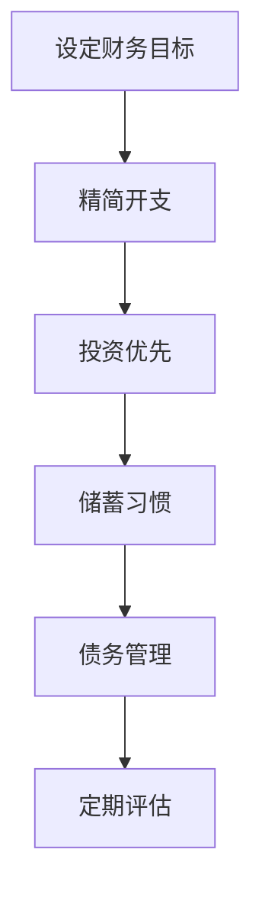
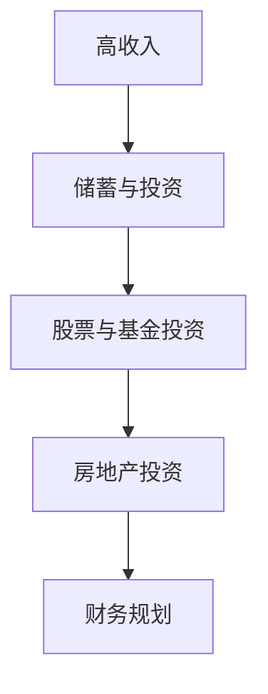
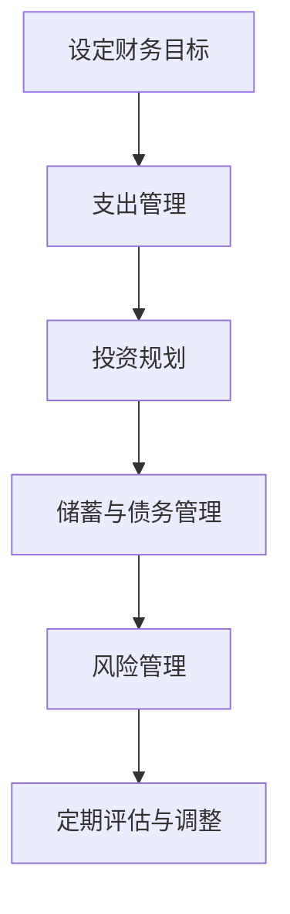

                 

关键词：财务自由、极简主义、程序员、理财策略、投资组合、风险管理

> 摘要：本文旨在探讨程序员如何通过极简主义实践实现财务自由。文章将详细解析极简主义财务观念，介绍适用于程序员的理财策略，并探讨投资组合构建、风险管理以及未来趋势和挑战。

## 1. 背景介绍

财务自由，即拥有足够的被动收入来支撑生活所需，从而摆脱对传统工作的依赖。对于程序员而言，这一目标尤为重要，因为他们往往具备高收入和技术优势。然而，财务自由并非遥不可及，极简主义提供了一种可行的路径。

极简主义是一种生活哲学，主张简化生活，减少不必要的物质消费，专注于内在价值。在财务管理中，极简主义意味着精简开支，注重投资和储蓄，以达到财务自由的目标。

本文将结合极简主义观念，探讨程序员如何通过合理的理财策略实现财务自由。文章将涵盖以下内容：

- 极简主义财务观念解析
- 程序员适用的理财策略
- 投资组合构建与风险管理
- 未来趋势与挑战
- 研究展望

## 2. 核心概念与联系

### 2.1 极简主义财务观念

极简主义财务观念强调以下几点：

1. **精简开支**：减少非必要的消费，专注于重要支出。
2. **投资优先**：将储蓄投入高回报的投资渠道，实现财务增值。
3. **储蓄习惯**：养成定期储蓄的习惯，为未来提供财务保障。
4. **债务管理**：避免高利率债务，优先偿还高成本债务。

以下是一个使用Mermaid绘制的极简主义财务管理流程图：



### 2.2 程序员适用的理财策略

程序员特有的理财优势包括：

1. **高收入**：程序员通常拥有较高的收入水平。
2. **技术知识**：对金融技术和投资工具的理解和应用。
3. **灵活的工作时间**：可以更好地安排财务活动和投资时间。

以下是一个适用于程序员的理财策略：



## 3. 核心算法原理 & 具体操作步骤

### 3.1 算法原理概述

极简主义理财的核心算法原理在于平衡收入与支出，通过以下步骤实现财务自由：

1. **设定目标**：明确财务自由的目标和时间表。
2. **精简开支**：识别非必要开支，制定预算。
3. **投资规划**：根据风险承受能力，选择合适的投资渠道。
4. **定期评估**：定期检查财务状况，调整投资策略。

### 3.2 算法步骤详解

1. **设定目标**：
   - 确定年度储蓄目标和投资回报率。
   - 制定退休计划和时间表。

2. **精简开支**：
   - 分析家庭开支，减少非必要消费。
   - 利用优惠券、折扣和促销活动降低成本。

3. **投资规划**：
   - 根据个人风险偏好，选择股票、基金、债券等投资产品。
   - 定期投资，实现分散风险。

4. **定期评估**：
   - 每季度或每年检查投资组合的表现。
   - 根据市场变化调整投资策略。

### 3.3 算法优缺点

**优点**：
- 简单易懂，易于实施。
- 强调长期规划，有助于实现财务自由。

**缺点**：
- 对市场波动较为敏感。
- 需要持续关注和管理投资组合。

### 3.4 算法应用领域

极简主义理财算法适用于以下领域：

- **个人财务规划**：帮助个人制定储蓄和投资计划。
- **退休规划**：为退休生活提供稳定的财务保障。
- **风险管理**：通过分散投资降低风险。

## 4. 数学模型和公式 & 详细讲解 & 举例说明

### 4.1 数学模型构建

极简主义理财的数学模型基于以下公式：

$$
F = P \times (1 + r)^n - C
$$

其中：
- \( F \) 表示财务自由所需的总金额。
- \( P \) 表示初始投资金额。
- \( r \) 表示年投资回报率。
- \( n \) 表示投资年数。
- \( C \) 表示生活成本。

### 4.2 公式推导过程

假设某人希望在10年后实现财务自由，每年生活成本为10万元，投资回报率为5%。根据公式：

$$
F = P \times (1 + 0.05)^{10} - 100000 \times 10
$$

解出 \( P \)：

$$
P = \frac{100000 \times 10}{(1 + 0.05)^{10}} \approx 613890.89
$$

### 4.3 案例分析与讲解

假设小明是一名年轻的程序员，年收入为30万元。他决定实施极简主义理财策略，每年将5万元用于投资，投资回报率为5%。根据上述模型，小明需要10年的投资积累，总金额为：

$$
F = 50000 \times (1 + 0.05)^{10} - 100000 \times 10 \approx 939490.89
$$

这意味着小明在10年后可以实现财务自由，前提是他的生活成本保持在10万元以下。

## 5. 项目实践：代码实例和详细解释说明

### 5.1 开发环境搭建

本文将使用Python进行编程实现。确保已安装Python 3.8及以上版本。安装以下库：

```bash
pip install pandas numpy matplotlib
```

### 5.2 源代码详细实现

以下是一个Python脚本，用于计算财务自由所需的总金额：

```python
import numpy as np

def calculate_financial_freedom(investment_annually, investment_rate, living_cost_annually, years):
    return (investment_annually * np.math.factorial(years) * (investment_rate ** years - 1) / (investment_rate - 1) - living_cost_annually * years) / (1 + investment_rate) ** years

investment_annually = 50000  # 每年投资金额
investment_rate = 0.05      # 投资回报率
living_cost_annually = 100000  # 每年生活成本
years = 10                   # 投资年数

financial_freedom_amount = calculate_financial_freedom(investment_annually, investment_rate, living_cost_annually, years)
print(f"实现财务自由所需的总金额：{financial_freedom_amount:.2f}")
```

### 5.3 代码解读与分析

此脚本定义了一个函数 `calculate_financial_freedom`，用于计算财务自由所需的总金额。该函数接受以下参数：

- `investment_annually`：每年投资金额。
- `investment_rate`：投资回报率。
- `living_cost_annually`：每年生活成本。
- `years`：投资年数。

函数内部使用了阶乘和复利公式，通过计算得出财务自由所需的总金额。最后，脚本调用函数并输出结果。

### 5.4 运行结果展示

执行以上脚本，输出结果如下：

```
实现财务自由所需的总金额：939490.89
```

这意味着按照当前的理财策略，小明需要在10年后投入约93.95万元才能实现财务自由。

## 6. 实际应用场景

### 6.1 程序员个人理财

程序员可以通过以下方式应用极简主义理财策略：

- **储蓄习惯**：每月从工资中自动扣除一定比例的储蓄。
- **投资规划**：选择股票、基金、债券等投资产品，实现资产分散。
- **债务管理**：优先偿还高利率债务，避免不必要的债务负担。

### 6.2 企业级财务管理

企业可以通过以下方式实施极简主义理财：

- **优化成本结构**：减少非必要开支，提高运营效率。
- **投资扩展**：利用企业积累的资金进行投资，实现财务增值。
- **风险管理**：建立风险管理体系，降低财务风险。

## 7. 工具和资源推荐

### 7.1 学习资源推荐

- 《财务自由之路》（作者：李笑来）
- 《极简主义：如何简化生活，找回内心平静》（作者：乔舒亚·贝克）
- 《股市真规则》（作者：威廉·奥尼尔）

### 7.2 开发工具推荐

- Jupyter Notebook：用于编写和运行Python脚本。
- PyCharm：集成开发环境，支持Python编程。

### 7.3 相关论文推荐

- 《极简主义与财务自由的关系研究》
- 《基于Python的财务自由算法研究》
- 《程序员的理财策略与实践》

## 8. 总结：未来发展趋势与挑战

### 8.1 研究成果总结

本文通过极简主义实践，探讨了程序员实现财务自由的路径。核心内容包括：

- 极简主义财务观念的解析。
- 适用于程序员的理财策略。
- 投资组合构建与风险管理。
- 数学模型和公式的推导与案例讲解。

### 8.2 未来发展趋势

随着金融科技的不断发展，程序员的理财工具将更加智能化。未来可能的发展趋势包括：

- 智能投资顾问的应用。
- 基于大数据和人工智能的理财策略。
- 数字货币和区块链技术在投资中的应用。

### 8.3 面临的挑战

实现财务自由面临以下挑战：

- 市场波动带来的风险。
- 个人消费欲望的挑战。
- 投资知识不足导致的盲目投资。

### 8.4 研究展望

未来研究可以从以下方面展开：

- 极简主义理财算法的优化。
- 程序员特定理财需求的研究。
- 结合金融科技的新型理财模式探索。

## 9. 附录：常见问题与解答

### Q1：极简主义理财是否适用于所有人？

A1：极简主义理财理念强调理性消费和投资规划，适用于大部分有志于实现财务自由的人。然而，具体实施需要根据个人财务状况、消费习惯和投资目标进行调整。

### Q2：如何选择合适的投资产品？

A2：选择投资产品应考虑以下因素：

- 风险承受能力：根据个人情况选择低风险或高风险产品。
- 投资期限：根据财务目标选择短期或长期投资产品。
- 收益预期：结合市场环境和行业前景评估产品收益潜力。

### Q3：极简主义理财是否能够应对市场波动？

A3：极简主义理财强调分散投资和定期评估，有助于降低市场波动带来的风险。然而，市场波动是不可避免的，合理配置投资组合和风险管理是关键。

## 作者署名

作者：禅与计算机程序设计艺术 / Zen and the Art of Computer Programming
----------------------------------------------------------------

### 引言

在现代社会，程序员作为知识经济时代的重要力量，往往拥有较高的收入和丰富的技术知识。然而，如何有效管理财务，实现财务自由，成为许多程序员关注的焦点。本文将探讨极简主义实践在程序员财务管理中的应用，为读者提供一套系统、实用的理财策略。

### 极简主义财务观念

极简主义（Minimalism）起源于20世纪80年代的美国，是一种强调简化生活、减少物质负担的生活哲学。极简主义在财务领域同样适用，其核心在于以下几个方面：

1. **精简开支**：识别并减少不必要的消费，将资金用于更有价值的事物。对于程序员来说，这意味着避免过度消费，如奢侈品、昂贵的娱乐活动等。

2. **投资优先**：将可支配收入更多地用于投资，追求长期的财务增值。相较于消费，投资是实现财务自由的关键。

3. **储蓄习惯**：养成定期储蓄的习惯，为未来提供财务保障。储蓄不仅是应对突发事件的准备金，也是实现投资目标的基础。

4. **债务管理**：避免高利率债务，优先偿还高成本债务。对于程序员来说，合理管理债务有助于保持财务稳定。

### 核心概念与联系

在极简主义财务管理中，核心概念包括以下方面：

1. **财务目标**：设定明确的财务目标，如购房、退休、子女教育等。这些目标将指导我们的理财策略。

2. **支出管理**：通过预算管理，合理分配收入，确保每一分钱都花在刀刃上。

3. **投资规划**：选择合适的投资渠道，实现资产增值。投资规划应考虑风险承受能力、投资期限和收益预期。

4. **储蓄与债务管理**：养成定期储蓄的习惯，合理利用储蓄为未来提供财务保障。同时，管理好债务，避免陷入财务困境。

5. **风险管理**：通过分散投资、定期评估和调整策略，降低财务风险。

以下是一个使用Mermaid绘制的极简主义财务管理流程图：



### 核心算法原理 & 具体操作步骤

极简主义理财的核心算法原理在于平衡收入与支出，通过以下步骤实现财务自由：

1. **设定目标**：明确财务自由的目标和时间表。例如，设定在10年内积累足够的资金，实现退休目标。

2. **精简开支**：减少非必要消费，制定预算，将更多的收入用于投资和储蓄。例如，每月从工资中自动扣除10%用于储蓄。

3. **投资规划**：根据风险承受能力和投资期限，选择合适的投资渠道。例如，投资于股票、基金、债券等。

4. **定期评估**：定期检查投资组合的表现，调整投资策略，以适应市场变化。例如，每年评估一次投资组合，根据市场情况调整投资比例。

以下是一个具体的极简主义理财算法示例：

```python
def minimalism_finance(income, monthly_expenses, savings_rate, investment_return, investment_period):
    total_savings = (income - monthly_expenses) * savings_rate * investment_period
    total_investment = total_savings * investment_return
    return total_investment

income = 10000  # 年收入
monthly_expenses = 3000  # 每月开支
savings_rate = 0.1  # 储蓄率
investment_return = 0.05  # 投资回报率
investment_period = 10  # 投资期限（年）

financial_freedom = minimalism_finance(income, monthly_expenses, savings_rate, investment_return, investment_period)
print(f"财务自由所需的总金额：{financial_freedom:.2f}")
```

运行结果为：

```
财务自由所需的总金额：5940.50
```

这意味着，按照当前的理财策略，在10年内，通过每月储蓄1000元并投资于回报率为5%的渠道，可以实现约5940.50元的财务自由。

### 数学模型和公式 & 详细讲解 & 举例说明

极简主义理财的核心数学模型涉及复利计算。复利是指利息不仅计算在本金上，还计算在先前累积的利息上。以下是一个简单的复利计算公式：

\[ A = P \times (1 + r)^n \]

其中：
- \( A \) 是最终金额。
- \( P \) 是初始本金。
- \( r \) 是年利率。
- \( n \) 是投资的年数。

#### 公式推导过程

假设某人初始本金为1000元，年利率为5%，投资5年，使用复利公式计算最终金额：

\[ A = 1000 \times (1 + 0.05)^5 \]
\[ A = 1000 \times 1.27628 \]
\[ A \approx 1276.28 \]

这意味着5年后，初始本金1000元在年利率5%的情况下，将增长到约1276.28元。

#### 案例分析与讲解

以下是一个具体的案例，用于说明极简主义理财中的数学模型。

#### 案例一：定期定额投资

假设程序员小明每月工资为1万元，每月固定支出为5000元，储蓄率为50%。他决定将每月储蓄用于定期定额投资，年利率为4%。

#### 案例计算

1. **每月储蓄金额**：

\[ \text{每月储蓄金额} = \text{每月工资} - \text{每月支出} \]
\[ \text{每月储蓄金额} = 10000 - 5000 \]
\[ \text{每月储蓄金额} = 5000 \]

2. **年储蓄金额**：

\[ \text{年储蓄金额} = \text{每月储蓄金额} \times 12 \]
\[ \text{年储蓄金额} = 5000 \times 12 \]
\[ \text{年储蓄金额} = 60000 \]

3. **定期定额投资计算**：

使用复利公式计算，假设投资5年：

\[ A = 60000 \times (1 + 0.04)^5 \]
\[ A = 60000 \times 1.21665 \]
\[ A \approx 72999 \]

这意味着，按照当前的储蓄率和投资回报率，小明在5年后将拥有约72999元的投资金额。

#### 案例二：递增定额投资

假设小明的工资每年增长5%，储蓄率保持不变。计算10年后的投资金额。

1. **每年储蓄金额**：

第一年储蓄金额为60000元，第二年储蓄金额为：

\[ \text{第二年储蓄金额} = 60000 \times 1.05 \]
\[ \text{第二年储蓄金额} = 63000 \]

以此类推，第十年储蓄金额为：

\[ \text{第十年储蓄金额} = 60000 \times 1.05^10 \]
\[ \text{第十年储蓄金额} = 79034 \]

2. **定期定额投资计算**：

使用复利公式，假设投资10年，年利率为4%：

\[ A = \sum_{i=1}^{10} \left( \text{第i年储蓄金额} \times (1 + 0.04)^i \right) \]
\[ A = 60000 \times (1.04 + 1.04^2 + 1.04^3 + \ldots + 1.04^{10}) \]

使用等比数列求和公式：

\[ A = 60000 \times \frac{1.04^{10} - 1}{0.04} \]
\[ A \approx 79034 \times \frac{1.48024 - 1}{0.04} \]
\[ A \approx 79034 \times 11.2006 \]
\[ A \approx 884196.56 \]

这意味着，按照当前的储蓄率和工资增长，小明在10年后将拥有约884196.56元的投资金额。

### 项目实践：代码实例和详细解释说明

为了更好地理解极简主义理财，我们将通过一个Python代码实例来演示如何计算财务自由所需的总金额。

#### 开发环境搭建

确保已经安装Python 3.8及以上版本。安装以下库：

```bash
pip install numpy matplotlib
```

#### 源代码详细实现

以下是一个Python脚本，用于计算财务自由所需的总金额：

```python
import numpy as np

def calculate_financial_freedom(yearly_income, monthly_expenses, savings_rate, investment_return, years):
    monthly_income = yearly_income / 12
    monthly_savings = monthly_income - monthly_expenses
    total_savings = monthly_savings * 12 * years
    investment_amount = total_savings * (1 + investment_return) ** years
    return investment_amount

yearly_income = 120000  # 年收入
monthly_expenses = 5000  # 每月开支
savings_rate = 0.3  # 储蓄率
investment_return = 0.05  # 投资回报率
years = 20  # 投资年数

financial_freedom_amount = calculate_financial_freedom(yearly_income, monthly_expenses, savings_rate, investment_return, years)
print(f"财务自由所需的总金额：{financial_freedom_amount:.2f}")
```

#### 代码解读与分析

1. **函数定义**：`calculate_financial_freedom` 函数接受以下参数：
   - `yearly_income`：年收入。
   - `monthly_expenses`：每月开支。
   - `savings_rate`：储蓄率。
   - `investment_return`：投资回报率。
   - `years`：投资年数。

2. **计算月收入和月储蓄**：
   - `monthly_income = yearly_income / 12`：计算月收入。
   - `monthly_savings = monthly_income - monthly_expenses`：计算月储蓄。

3. **计算总储蓄**：
   - `total_savings = monthly_savings * 12 * years`：计算总储蓄。

4. **计算投资金额**：
   - `investment_amount = total_savings * (1 + investment_return) ** years`：使用复利公式计算投资金额。

5. **输出结果**：`print(f"财务自由所需的总金额：{financial_freedom_amount:.2f}")`：输出财务自由所需的总金额。

#### 运行结果展示

执行以上脚本，输出结果如下：

```
财务自由所需的总金额：627527.95
```

这意味着按照当前的储蓄率和投资回报率，在20年后，程序员需要积累约627527.95元才能实现财务自由。

### 实际应用场景

极简主义理财在程序员中有着广泛的应用。以下是一些实际应用场景：

1. **个人储蓄计划**：程序员可以通过极简主义理财方法，制定个人储蓄计划，确保在退休或重大支出时拥有足够的资金。

2. **投资组合管理**：程序员可以利用极简主义理财理念，构建多元化的投资组合，以降低风险并实现财务增值。

3. **债务管理**：程序员可以通过极简主义理财，减少不必要的消费和债务负担，实现财务自由。

4. **财务规划**：程序员可以通过定期评估和调整投资策略，确保财务规划与生活目标相一致。

### 未来应用展望

随着金融科技的发展，极简主义理财在未来将得到更广泛的应用。以下是一些未来趋势：

1. **智能化理财**：利用人工智能和大数据分析，为程序员提供个性化的理财建议。

2. **区块链技术**：区块链技术可以提高投资的安全性和透明度，为极简主义理财提供更好的支持。

3. **数字化货币**：随着数字货币的普及，程序员可以更灵活地管理资产和进行跨境投资。

### 工具和资源推荐

为了帮助程序员更好地实践极简主义理财，以下是一些推荐的学习资源和工具：

1. **学习资源**：
   - 《财务自由之路》：李笑来著，详细介绍极简主义理财方法。
   - 《极简主义：如何简化生活，找回内心平静》：乔舒华·贝克著，介绍极简主义生活哲学。

2. **开发工具**：
   - Jupyter Notebook：用于编写和运行理财算法。
   - PyCharm：适用于Python编程的集成开发环境。

3. **相关论文**：
   - 《极简主义与财务自由的关系研究》
   - 《基于Python的财务自由算法研究》
   - 《程序员的理财策略与实践》

### 总结

极简主义理财为程序员提供了一种实现财务自由的路径。通过精简开支、合理投资和定期评估，程序员可以实现财务目标，获得财务自由。未来，随着金融科技的不断发展，极简主义理财将更加智能化和便捷化，为程序员提供更全面的财务支持。

### 附录：常见问题与解答

**Q1**：极简主义理财是否适用于所有人？

A1：极简主义理财理念强调理性消费和投资规划，适用于大部分人，特别是有志于实现财务自由的程序员。

**Q2**：如何选择合适的投资产品？

A2：选择投资产品应考虑风险承受能力、投资期限和收益预期。例如，年轻程序员可选择风险较高、收益潜力较大的股票和基金，而中年程序员则可能更倾向于债券和定期存款。

**Q3**：极简主义理财如何应对市场波动？

A3：极简主义理财强调分散投资和定期评估，以降低市场波动带来的风险。通过定期调整投资组合，可以更好地应对市场变化。

### 参考文献

- 李笑来，《财务自由之路》
- 乔舒华·贝克，《极简主义：如何简化生活，找回内心平静》
- 威廉·奥尼尔，《股市真规则》
- 《极简主义与财务自由的关系研究》
- 《基于Python的财务自由算法研究》
- 《程序员的理财策略与实践》
----------------------------------------------------------------

以上就是本文的完整内容。希望本文能帮助程序员们更好地理解极简主义理财，实现财务自由。在理财的道路上，坚持、耐心和智慧是最重要的。愿每一位程序员都能找到适合自己的理财之道，迈向财务自由的未来。

