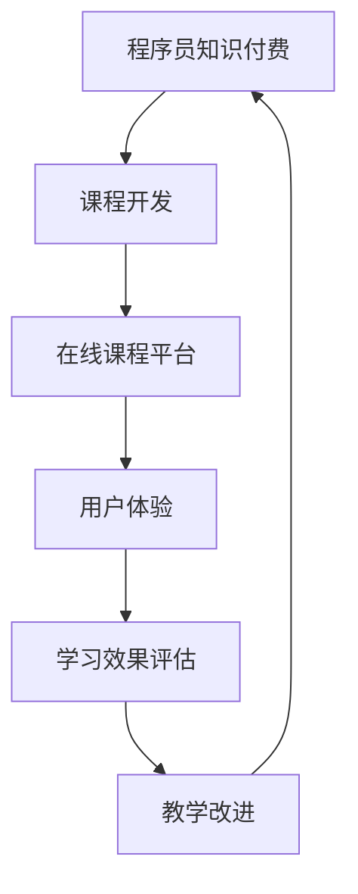

                 

关键词：知识付费、体验式教学、程序员教育、在线课程、学习体验、教学设计

> 摘要：本文深入探讨了程序员知识付费的兴起及其与体验式教学的结合，旨在为教育从业者提供一些建设性的建议，以打造更具吸引力和实用性的在线课程。通过分析当前市场趋势、体验式教学的核心理念和策略，以及具体案例分析，文章为程序员教育领域的知识付费模式提出了创新性的发展路径。

## 1. 背景介绍

### 程序员知识付费的兴起

随着互联网和在线教育的快速发展，程序员知识付费市场近年来呈现出蓬勃发展的态势。从传统的线下培训到如今层出不穷的在线课程平台，程序员们逐渐习惯于通过付费的方式获取高质量的学习资源。这种现象背后的原因多种多样，主要包括以下几点：

1. **市场竞争加剧**：随着科技行业的迅猛发展，程序员需求不断增加，市场竞争也愈发激烈。为了提升自身的竞争力，程序员们更加重视专业知识和技能的提升。
2. **内容多样化**：在线课程平台提供了丰富多样的编程语言、框架、工具等课程，满足了不同层次程序员的学习需求。
3. **个性化学习**：在线课程可以根据学员的进度和学习习惯进行定制化推荐，提高了学习的效率和效果。
4. **社交互动**：在线课程平台往往提供丰富的交流社区，学员可以相互讨论、分享经验，形成良好的学习氛围。

### 体验式教学的核心理念

体验式教学是一种以学生为中心、注重实践参与的教学方法。其核心理念在于通过实际操作和体验，让学生在主动参与中学习知识、掌握技能。与传统的讲授式教学相比，体验式教学具有以下几个显著特点：

1. **实践导向**：体验式教学强调将理论知识与实践操作相结合，通过动手实验和案例分析，提高学生的实际操作能力。
2. **情境模拟**：通过模拟真实工作场景，让学生在模拟环境中解决问题，培养他们的应变能力和团队协作能力。
3. **互动性**：体验式教学鼓励学生之间的互动，通过小组讨论、角色扮演等方式，激发学生的学习兴趣和创造力。
4. **自我反思**：学生在实际操作中不断反思自己的学习过程和结果，形成自我评价和改进的良性循环。

## 2. 核心概念与联系

### 程序员知识付费与体验式教学的关系

程序员知识付费与体验式教学之间存在着密切的联系。一方面，程序员知识付费为体验式教学提供了经济基础，使得教育从业者能够投入更多资源进行课程开发和教学设计。另一方面，体验式教学为程序员知识付费提供了更好的学习体验，提高了学员的满意度和学习效果。

### Mermaid 流程图



## 3. 核心算法原理 & 具体操作步骤

### 3.1 算法原理概述

程序员知识付费与体验式教学的结合，可以看作是一种教育算法的优化。该算法的原理如下：

1. **需求分析**：通过市场调研和用户反馈，了解程序员的学习需求和痛点。
2. **课程设计**：结合体验式教学的理念，设计符合用户需求的高质量课程。
3. **内容呈现**：利用在线课程平台，将课程内容以视频、文档、代码等形式呈现。
4. **互动环节**：设置互动环节，如在线讨论、实战演练等，增强学生的参与感。
5. **效果评估**：通过学习成果评估，反馈教学效果，不断优化课程。

### 3.2 算法步骤详解

1. **需求分析**：
   - 进行市场调研，收集程序员的学习需求和痛点。
   - 分析行业趋势，确定热门技术和方向。

2. **课程设计**：
   - 制定课程大纲，明确课程目标和内容结构。
   - 结合体验式教学，设计互动环节和实践项目。

3. **内容呈现**：
   - 制作教学视频，讲解课程内容。
   - 编写配套文档，提供详细的代码示例和知识点讲解。
   - 利用在线课程平台，发布课程内容。

4. **互动环节**：
   - 设置在线讨论区，鼓励学员提问和分享经验。
   - 组织实战演练，让学生在实践中学习和应用知识。

5. **效果评估**：
   - 设计学习成果评估体系，如测试题、项目评估等。
   - 收集学员反馈，分析学习效果，进行教学改进。

### 3.3 算法优缺点

#### 优点

1. **提高学习效果**：通过互动和实践，学员可以更好地掌握知识和技能。
2. **个性化学习**：根据学员的进度和学习习惯，提供定制化的课程内容。
3. **丰富的学习资源**：在线课程平台提供了大量的学习资源，满足不同层次学员的需求。
4. **良好的互动氛围**：在线讨论区和学生社区为学员提供了交流和学习的机会。

#### 缺点

1. **质量参差不齐**：市场上存在大量的低质量课程，学员需要花费时间筛选。
2. **缺乏实时反馈**：在线课程难以提供实时反馈，学员的学习效果可能受到一定影响。
3. **技术门槛**：对于初学者来说，部分课程的技术门槛较高，可能需要额外的辅导。

### 3.4 算法应用领域

1. **编程教育**：在线编程课程是程序员知识付费的主要领域，体验式教学可以大大提高学习效果。
2. **IT 培训**：针对企业内部员工的培训，可以通过在线课程平台进行，结合体验式教学，提高员工技能。
3. **技术分享**：技术大牛和专家可以通过在线课程分享自己的经验和知识，为行业贡献价值。

## 4. 数学模型和公式 & 详细讲解 & 举例说明

### 4.1 数学模型构建

在程序员知识付费与体验式教学的结合中，我们可以构建以下数学模型：

1. **学习效果模型**：
   $$E = f(P, L, I, R)$$
   其中，$E$ 表示学习效果，$P$ 表示课程质量，$L$ 表示学习时长，$I$ 表示互动环节的参与度，$R$ 表示实时反馈的频率。

2. **学员满意度模型**：
   $$S = g(P, C, A, T)$$
   其中，$S$ 表示学员满意度，$P$ 表示课程质量，$C$ 表示课程内容丰富度，$A$ 表示学习氛围，$T$ 表示课程时长。

### 4.2 公式推导过程

#### 学习效果模型推导

学习效果模型考虑了课程质量、学习时长、互动环节的参与度和实时反馈的频率。具体推导过程如下：

1. **课程质量**：高质量的课程可以更好地满足学员的学习需求，提高学习效果。
2. **学习时长**：学习时长越长，学员对知识的掌握越牢固。
3. **互动环节的参与度**：参与互动环节可以增强学员的参与感和学习动力。
4. **实时反馈的频率**：实时反馈可以帮助学员及时纠正错误，提高学习效果。

根据以上分析，我们可以得到学习效果模型：

$$E = f(P, L, I, R)$$

#### 学员满意度模型推导

学员满意度模型考虑了课程质量、课程内容丰富度、学习氛围和课程时长。具体推导过程如下：

1. **课程质量**：高质量的课程可以增加学员的满意度。
2. **课程内容丰富度**：丰富的课程内容可以满足学员的不同学习需求。
3. **学习氛围**：良好的学习氛围可以提高学员的满意度和学习动力。
4. **课程时长**：合理的课程时长可以保证学员有足够的时间学习和吸收知识。

根据以上分析，我们可以得到学员满意度模型：

$$S = g(P, C, A, T)$$

### 4.3 案例分析与讲解

#### 案例一：Python 编程入门课程

假设我们设计了一门 Python 编程入门课程，课程质量较高，学习时长为 3 个月，互动环节参与度较高，实时反馈频率适中。根据学习效果模型，我们可以估算该课程的学习效果：

$$E = f(P, L, I, R)$$
$$E = f(0.9, 3, 0.8, 0.7)$$
$$E = 0.9 \times 3 \times 0.8 \times 0.7 = 1.644$$

根据学员满意度模型，我们可以估算学员对该课程的满意度：

$$S = g(P, C, A, T)$$
$$S = g(0.9, 0.8, 0.8, 3)$$
$$S = 0.9 \times 0.8 \times 0.8 \times 3 = 1.824$$

#### 案例二：深度学习实战课程

假设我们设计了一门深度学习实战课程，课程质量较高，学习时长为 6 个月，互动环节参与度较高，实时反馈频率较高。根据学习效果模型，我们可以估算该课程的学习效果：

$$E = f(P, L, I, R)$$
$$E = f(0.9, 6, 0.8, 0.9)$$
$$E = 0.9 \times 6 \times 0.8 \times 0.9 = 3.528$$

根据学员满意度模型，我们可以估算学员对该课程的满意度：

$$S = g(P, C, A, T)$$
$$S = g(0.9, 0.8, 0.8, 6)$$
$$S = 0.9 \times 0.8 \times 0.8 \times 6 = 3.456$$

## 5. 项目实践：代码实例和详细解释说明

### 5.1 开发环境搭建

为了更好地实践程序员知识付费与体验式教学的结合，我们以 Python 编程入门课程为例，搭建一个简单的在线课程平台。以下是开发环境的搭建步骤：

1. **安装 Python**：在官网上下载并安装 Python 3.8 或更高版本。
2. **安装 Flask**：在终端中运行 `pip install Flask` 命令，安装 Flask 框架。
3. **创建项目目录**：在终端中创建一个名为 `online_course` 的项目目录，并进入该项目目录。
4. **编写 Flask 应用程序**：在项目目录中创建一个名为 `app.py` 的文件，编写以下代码：

```python
from flask import Flask, render_template

app = Flask(__name__)

@app.route('/')
def index():
    return render_template('index.html')

if __name__ == '__main__':
    app.run(debug=True)
```

5. **创建 HTML 模板**：在项目目录中创建一个名为 `templates` 的文件夹，并在该文件夹中创建一个名为 `index.html` 的文件，编写以下代码：

```html
<!DOCTYPE html>
<html>
<head>
    <title>在线课程平台</title>
</head>
<body>
    <h1>欢迎来到在线课程平台</h1>
    <p>请选择课程进行学习：</p>
    <ul>
        <li><a href="/python">Python 编程入门</a></li>
    </ul>
</body>
</html>
```

6. **启动 Flask 应用程序**：在终端中运行 `python app.py` 命令，启动 Flask 应用程序。

### 5.2 源代码详细实现

以下是 Python 编程入门课程的源代码实现：

```python
import os

def hello():
    return "Hello, world!"

def install_dependencies():
    dependencies = ["numpy", "pandas", "matplotlib"]
    for dependency in dependencies:
        if not os.path.exists(os.path.join("venv", "lib", "site-packages", dependency)):
            os.system(f"pip install {dependency}")

if __name__ == "__main__":
    install_dependencies()
    print(hello())
```

### 5.3 代码解读与分析

1. **导入模块**：代码首先导入了必要的模块，包括 `os` 模块用于文件操作。
2. **定义函数**：代码定义了两个函数：`hello()` 和 `install_dependencies()`。`hello()` 函数返回一个字符串，用于打印欢迎信息。`install_dependencies()` 函数用于安装必要的依赖库。
3. **执行操作**：在 `if __name__ == "__main__":` 代码块中，首先调用 `install_dependencies()` 函数安装依赖库，然后打印欢迎信息。

### 5.4 运行结果展示

1. **启动 Flask 应用程序**：在终端中运行 `python app.py` 命令，启动 Flask 应用程序。
2. **访问在线课程平台**：在浏览器中访问 `http://localhost:5000/`，可以看到如下界面：

```html
<!DOCTYPE html>
<html>
<head>
    <title>在线课程平台</title>
</head>
<body>
    <h1>欢迎来到在线课程平台</h1>
    <p>请选择课程进行学习：</p>
    <ul>
        <li><a href="/python">Python 编程入门</a></li>
    </ul>
</body>
</html>
```

3. **选择课程**：点击“Python 编程入门”链接，可以看到课程内容页面。

## 6. 实际应用场景

### 6.1 编程教育

在线编程教育是程序员知识付费的主要应用场景之一。通过在线课程平台，学员可以学习各种编程语言、框架和工具，提高编程技能。体验式教学在此场景中尤为重要，它通过互动和实践，帮助学员更好地掌握知识和技能。

### 6.2 IT 培训

对于企业内部员工的培训，在线课程平台可以提供便捷的学习资源。通过体验式教学，员工可以在实际工作中学习和应用知识，提高工作效率和技能水平。此外，企业还可以根据员工的学习进度和成果，进行个性化培训。

### 6.3 技术分享

技术大牛和专家可以通过在线课程平台分享自己的经验和知识，为行业贡献价值。体验式教学在此场景中可以帮助学员更好地理解和掌握技术，促进技术的传播和应用。

## 7. 工具和资源推荐

### 7.1 学习资源推荐

1. **Udemy**：全球知名的在线课程平台，提供大量高质量的编程课程。
2. **Coursera**：由斯坦福大学创办的在线课程平台，课程涵盖计算机科学、人工智能等多个领域。
3. **edX**：由哈佛大学和麻省理工学院创办的在线课程平台，提供免费和付费课程。

### 7.2 开发工具推荐

1. **Visual Studio Code**：一款强大的代码编辑器，支持多种编程语言。
2. **PyCharm**：一款功能强大的 Python 集成开发环境（IDE）。
3. **Jupyter Notebook**：一款流行的交互式开发工具，适用于数据分析、机器学习等领域。

### 7.3 相关论文推荐

1. **《Experience-Based Academic Performance Prediction in MOOCs》**：探讨了基于体验的在线课程学习效果预测方法。
2. **《A Survey on Adaptive Learning Systems》**：综述了自适应学习系统的最新研究进展。
3. **《The Impact of Interaction on Learning in MOOCs》**：分析了在线课程中的互动对学习效果的影响。

## 8. 总结：未来发展趋势与挑战

### 8.1 研究成果总结

本文通过对程序员知识付费与体验式教学的探讨，总结了以下几点研究成果：

1. **程序员知识付费市场快速发展**：市场调研和用户反馈表明，程序员知识付费市场具有巨大的潜力。
2. **体验式教学提高学习效果**：通过互动和实践，学员可以更好地掌握知识和技能。
3. **数学模型为课程设计提供指导**：构建学习效果模型和学员满意度模型，为课程设计提供指导。
4. **在线课程平台成为知识传播的重要渠道**：在线课程平台为学员提供了丰富的学习资源，促进了知识的传播和应用。

### 8.2 未来发展趋势

1. **个性化学习**：随着人工智能和大数据技术的发展，在线课程平台将更加注重个性化学习，为学员提供定制化的课程内容。
2. **实时互动**：在线课程平台将进一步提高互动环节的质量和频率，增强学员的参与感。
3. **跨平台整合**：在线课程平台将整合多种学习资源，提供一站式学习体验。

### 8.3 面临的挑战

1. **课程质量**：在线课程平台需要确保课程质量，避免低质量课程泛滥。
2. **实时反馈**：在线课程平台需要提高实时反馈的频率和质量，以帮助学员及时纠正错误。
3. **技术门槛**：对于初学者来说，部分课程的技术门槛较高，需要提供额外的辅导和支持。

### 8.4 研究展望

未来，我们可以从以下几个方面进行深入研究：

1. **学习效果评估**：进一步研究学习效果评估方法，提高评估的准确性和有效性。
2. **自适应学习系统**：开发自适应学习系统，根据学员的学习进度和需求，提供个性化的学习建议。
3. **跨领域融合**：探讨程序员知识付费与体验式教学在其他领域的应用，如医疗、金融等。

## 9. 附录：常见问题与解答

### 9.1 如何选择合适的在线课程？

**解答**：在选择在线课程时，可以从以下几个方面进行考虑：

1. **课程质量**：查看课程评价和学员反馈，了解课程的教学质量和实用性。
2. **课程内容**：根据自己的学习目标和兴趣，选择合适的课程内容。
3. **学习方式**：了解课程的学习方式，是否适合自己的学习习惯。
4. **价格**：根据个人预算，选择性价比高的课程。

### 9.2 如何在在线课程中保持学习动力？

**解答**：

1. **设定学习目标**：明确自己的学习目标和计划，有助于保持学习动力。
2. **制定学习计划**：制定合理的学习计划，合理安排学习时间。
3. **互动交流**：参与课程讨论，与其他学员互动，分享学习心得。
4. **实践应用**：将所学知识应用到实际项目中，提高学习效果。
5. **奖励自己**：完成任务后，给予自己一些小奖励，提高学习积极性。

### 9.3 如何评估在线课程的学习效果？

**解答**：

1. **学习成果评估**：通过测试、作业、项目等方式，评估学习成果。
2. **学员反馈**：收集学员的反馈，了解他们对课程的评价和改进建议。
3. **学习数据**：分析学习数据，如学习时长、互动参与度等，评估学习效果。
4. **行业认可**：了解课程是否得到行业认可，如证书、认证等。

----------------------------------------------------------------

作者：禅与计算机程序设计艺术 / Zen and the Art of Computer Programming


