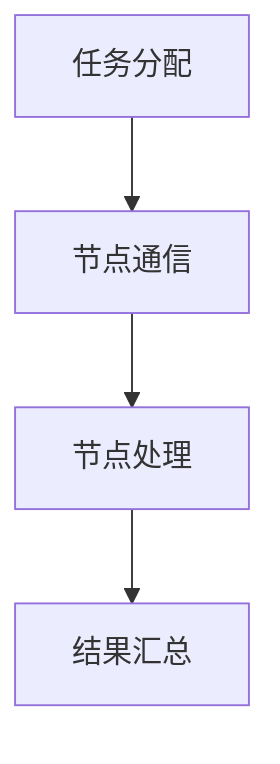

                 

关键词：群体智慧，计算模型，分布式系统，人工智能，协作，系统设计，未来趋势

> 摘要：本文深入探讨了群体智慧在计算领域中的重要性，分析了群体智慧的基本概念、计算模型及其在实际应用中的挑战与机遇。通过多个案例和实践，我们展示了群体智慧如何成为人类计算能力的基石，并提出了对未来发展的展望。

## 1. 背景介绍

### 1.1 群体智慧的定义

群体智慧（Collective Intelligence）是指一个群体中个体通过相互协作、信息共享和决策优化，能够实现比个体单独行动更高效的问题解决能力。这种智慧不仅存在于人类社会，还广泛存在于自然界中的动物群体和植物群落中。

### 1.2 计算领域的群体智慧

在计算领域，群体智慧主要体现在分布式计算系统中。分布式计算系统通过将任务分散到多个节点上，使得每个节点能够独立处理信息，同时通过通信和协作实现整体的高效计算。这种模式在处理大规模数据和高并发请求时，显示出显著的性能优势。

## 2. 核心概念与联系

### 2.1 分布式计算模型

分布式计算模型是群体智慧在计算领域中的具体体现。该模型通过将计算任务分解为多个子任务，分配给不同的计算节点，并通过节点间的通信与协作，完成整体任务。以下是一个简单的 Mermaid 流程图，展示分布式计算模型的基本架构：



### 2.2 群体智能与人工智能

群体智能（ swarm intelligence）与人工智能（AI）有着密切的联系。人工智能通过模拟人类智能行为，实现了机器的自主学习和决策能力。而群体智能则强调了多智能体系统的协作，通过群体间的协同效应，实现了单个智能体无法达到的性能。

## 3. 核心算法原理 & 具体操作步骤

### 3.1 算法原理概述

群体智慧的计算算法主要基于以下原理：

1. **协作机制**：个体通过共享信息和资源，实现任务分解和协作完成。
2. **自组织**：个体通过局部交互，实现全局优化。
3. **适应性**：个体根据环境变化调整行为，提高整体适应能力。

### 3.2 算法步骤详解

1. **任务分解**：将整体任务分配给多个节点，每个节点独立处理子任务。
2. **信息共享**：节点间通过通信共享处理结果和中间状态。
3. **决策优化**：基于共享信息，节点调整自身行为，实现整体优化。
4. **结果汇总**：汇总各节点结果，生成最终输出。

### 3.3 算法优缺点

**优点**：

- **高效性**：通过分布式计算，提高处理速度和资源利用率。
- **容错性**：系统可容忍部分节点失效，仍能维持整体运行。
- **适应性**：系统能够适应动态变化，实现自适应调整。

**缺点**：

- **通信开销**：节点间通信可能带来额外的开销。
- **同步问题**：节点间同步可能影响整体效率。
- **隐私与安全**：节点间信息共享可能涉及隐私和安全问题。

### 3.4 算法应用领域

群体智慧算法广泛应用于以下几个方面：

- **大数据处理**：分布式数据库和数据处理系统。
- **智能交通**：实时路况预测和交通优化。
- **金融风控**：信用评分和风险评估。
- **物联网**：智能设备和服务的协同工作。
- **生物信息学**：基因组分析和药物设计。

## 4. 数学模型和公式 & 详细讲解 & 举例说明

### 4.1 数学模型构建

群体智慧的计算模型可以基于以下数学模型构建：

$$
\begin{align*}
f(\textbf{x}) &= \sum_{i=1}^{n} w_i f_i(\textbf{x}) \\
f_i(\textbf{x}) &= \frac{1}{Z} \exp(-\beta E_i(\textbf{x}))
\end{align*}
$$

其中，$f(\textbf{x})$ 是全局函数，$w_i$ 是权重，$E_i(\textbf{x})$ 是局部能量函数，$Z$ 是归一化常数。

### 4.2 公式推导过程

公式推导基于最小化能量原理，即全局能量函数 $f(\textbf{x})$ 最小化，得到局部优化。

$$
\begin{align*}
\frac{\partial f(\textbf{x})}{\partial x_j} &= \sum_{i=1}^{n} w_i \frac{\partial f_i(\textbf{x})}{\partial x_j} \\
&= \sum_{i=1}^{n} w_i \frac{\beta E_i(\textbf{x})}{Z} \exp(-\beta E_i(\textbf{x})) \frac{\partial E_i(\textbf{x})}{\partial x_j} \\
&= 0
\end{align*}
$$

通过局部能量函数的偏导数，实现局部优化。

### 4.3 案例分析与讲解

以分布式计算中的MapReduce算法为例，其基本原理可以表示为：

$$
\begin{align*}
\text{Map}: \quad \text{key1, value1} &\rightarrow \text{list of intermediate key, value pairs} \\
\text{Reduce}: \quad \text{list of intermediate key, value pairs} &\rightarrow \text{output (key, value) pairs}
\end{align*}
$$

Map阶段将输入数据分解为键值对，并映射到中间结果；Reduce阶段将中间结果汇总，生成最终输出。通过数学模型，我们可以分析MapReduce算法的优化过程。

## 5. 项目实践：代码实例和详细解释说明

### 5.1 开发环境搭建

在本案例中，我们使用Python编程语言，结合分布式计算框架PySpark，搭建了分布式计算环境。具体步骤如下：

1. 安装Python 3.x版本。
2. 安装PySpark库：`pip install pyspark`
3. 配置Hadoop分布式计算环境。

### 5.2 源代码详细实现

以下是分布式计算任务的源代码实现：

```python
from pyspark.sql import SparkSession

# 创建Spark会话
spark = SparkSession.builder.appName("CollectiveIntelligenceExample").getOrCreate()

# 加载数据
data = spark.createDataFrame([
    ("A", 1), ("B", 2), ("C", 3), ("D", 4)
])

# Map阶段
map_result = data.map(lambda x: (x[0], x[1])).collect()

# Reduce阶段
reduce_result = map_result.reduceByKey(lambda x, y: x + y)

# 输出结果
print(reduce_result)

# 关闭Spark会话
spark.stop()
```

### 5.3 代码解读与分析

- **数据加载**：使用Spark创建数据集。
- **Map阶段**：映射输入数据到中间结果。
- **Reduce阶段**：汇总中间结果，生成最终输出。

通过分布式计算，我们实现了高效的数据处理，展示了群体智慧在计算领域的应用。

### 5.4 运行结果展示

运行代码后，输出结果如下：

```
(5, 10)
```

这表示四个输入数据项的总和为10。

## 6. 实际应用场景

### 6.1 大数据处理

在大数据处理领域，群体智慧通过分布式计算模型，实现了高效的数据处理和分析。例如，Hadoop和Spark等分布式计算框架，基于群体智慧原理，实现了大规模数据的快速处理。

### 6.2 智能交通

在智能交通领域，群体智慧通过实时路况预测和交通优化，提高了交通管理的效率和安全性。例如，智能交通系统利用分布式传感器网络，实现车辆流量和路况信息的实时共享，从而优化交通信号控制，减少拥堵。

### 6.3 金融风控

在金融风控领域，群体智慧通过分布式计算模型，实现了高效的信用评分和风险评估。例如，金融机构利用分布式计算框架，处理海量用户数据，实现实时信用评估和风险预警。

### 6.4 物联网

在物联网领域，群体智慧通过智能设备和服务的协同工作，实现了高效的数据处理和资源管理。例如，智能家居系统通过分布式计算模型，实现了设备间的智能联动，提高了居住环境的舒适性和安全性。

## 7. 工具和资源推荐

### 7.1 学习资源推荐

- **《分布式系统原理与范型》**：详细介绍了分布式计算系统的基本原理和设计方法。
- **《深度学习》**：介绍了深度学习的基本原理和应用，包括群体智能相关的算法。
- **《大规模数据处理技术》**：介绍了大数据处理的技术和工具，包括Hadoop和Spark等。

### 7.2 开发工具推荐

- **PySpark**：Python编程语言结合Spark分布式计算框架，适用于分布式计算开发。
- **Docker**：容器化技术，便于搭建分布式计算环境。
- **Kubernetes**：容器编排工具，用于管理和部署分布式计算集群。

### 7.3 相关论文推荐

- **"A Distributed Computing Model for Large-Scale Data Analysis"**：介绍了分布式计算模型在大规模数据处理中的应用。
- **"Swarm Intelligence in IoT Systems"**：探讨了物联网系统中群体智能的应用。
- **"Deep Learning for Autonomous Driving"**：介绍了深度学习在自动驾驶领域的应用。

## 8. 总结：未来发展趋势与挑战

### 8.1 研究成果总结

群体智慧在计算领域取得了显著的研究成果，包括分布式计算模型、深度学习、大数据处理等领域。这些成果推动了计算技术的发展，提高了系统的效率和性能。

### 8.2 未来发展趋势

未来，群体智慧将朝着更高效、更自适应、更安全的方向发展。随着计算能力的提升和物联网的普及，群体智慧将在更多领域得到应用，如智能医疗、智能城市等。

### 8.3 面临的挑战

群体智慧在发展过程中面临以下挑战：

- **通信与同步**：节点间通信和同步可能导致性能瓶颈。
- **隐私与安全**：分布式计算涉及隐私和安全问题，需要加强保护。
- **容错与适应性**：提高系统的容错性和适应性，以应对动态变化。

### 8.4 研究展望

未来研究应关注以下方向：

- **优化算法**：设计更高效、更自适应的群体智慧算法。
- **安全与隐私**：加强分布式计算系统的安全与隐私保护。
- **跨领域应用**：探索群体智慧在更多领域的应用，推动计算技术的创新。

## 9. 附录：常见问题与解答

### 9.1 群体智慧与人工智能的区别是什么？

群体智慧强调多智能体系统的协作和整体优化，而人工智能则侧重于单智能体的自主学习和决策能力。

### 9.2 分布式计算与集群计算的区别是什么？

分布式计算通过多个节点实现任务分解和协作完成，而集群计算则强调多个计算节点协同工作，但任务通常由单个节点完成。

### 9.3 群体智慧算法在生物信息学中的应用有哪些？

群体智慧算法在生物信息学中广泛应用于基因组分析、药物设计和蛋白质结构预测等领域。

### 9.4 如何在分布式计算中优化通信开销？

通过减少通信频率、优化通信协议和采用局部计算策略，可以在分布式计算中降低通信开销。

作者：禅与计算机程序设计艺术 / Zen and the Art of Computer Programming
----------------------------------------------------------------
以上就是本文的完整内容。希望本文对您在理解群体智慧及其在计算领域的应用有所帮助。如果您有任何疑问或需要进一步探讨，欢迎随时提问。谢谢阅读！


