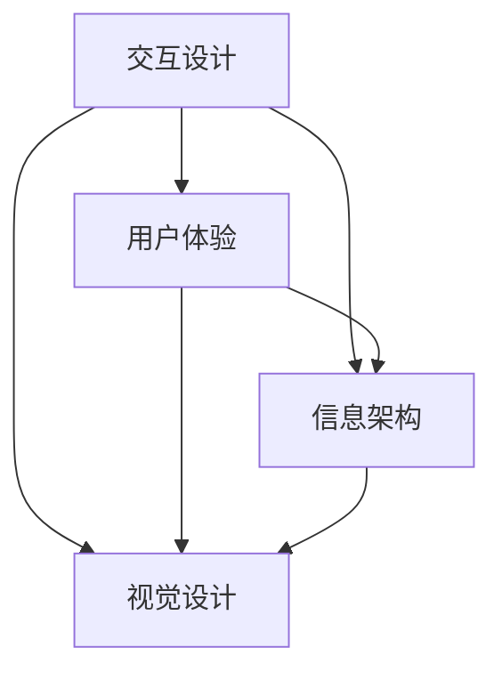

                 

关键词：用户界面设计、用户体验、界面优化、交互设计、UI/UX

> 摘要：本文深入探讨了如何设计更好的用户界面，从而提升用户体验。文章从核心概念入手，详细解析了用户界面设计的原理与方法，并通过数学模型、代码实例和实际应用场景等多个角度，为读者提供了系统化的指导和实用建议。

## 1. 背景介绍

用户界面（User Interface，简称UI）是用户与计算机系统交互的界面。从最早的命令行界面（CLI）到图形用户界面（GUI），再到如今的触摸界面和语音交互，用户界面经历了巨大的变革。用户体验（User Experience，简称UX）则更侧重于用户在使用产品或服务过程中的整体感受。UI和UX是相辅相成的，优秀的UI设计可以大大提升用户的操作便捷性和愉悦感，从而增强整体用户体验。

在当今信息时代，随着互联网和移动设备的普及，用户界面设计成为产品和服务的核心竞争力之一。无论是软件、网页还是移动应用，界面设计都直接影响到用户的第一印象和长期使用体验。因此，设计更好的用户界面，对于提升用户满意度、增加用户粘性和推动业务增长至关重要。

本文将围绕如何设计更好的用户界面进行深入探讨，从核心概念、算法原理、数学模型、项目实践和实际应用等多个方面，为读者提供全面而实用的指导。

## 2. 核心概念与联系

在设计用户界面时，以下几个核心概念是必须掌握的：

### 2.1 交互设计（Interaction Design）

交互设计关注的是用户与系统之间的交互过程。它不仅涉及用户界面的视觉元素，还包括用户的操作行为、反馈机制等。一个好的交互设计应该让用户能够轻松、高效地完成任务。

### 2.2 用户体验（User Experience）

用户体验涵盖了用户在使用产品或服务过程中的所有感知和体验。它包括用户界面的可用性、易用性、吸引力和情感共鸣等。用户体验的设计目标是为用户提供愉悦、高效和有价值的体验。

### 2.3 信息架构（Information Architecture）

信息架构关注的是如何组织、结构和展示信息，以便用户能够快速、准确地找到所需内容。信息架构的设计原则包括一致性、逻辑性和可预测性等。

### 2.4 视觉设计（Visual Design）

视觉设计涉及用户界面的视觉元素，如颜色、字体、图标、布局等。视觉设计不仅影响界面美观度，还直接影响到用户的心理感受和操作行为。

下面是一个简单的Mermaid流程图，展示了上述核心概念之间的联系：



## 3. 核心算法原理 & 具体操作步骤

### 3.1 算法原理概述

在设计用户界面时，常用的算法原理包括：

1. **响应式设计（Responsive Design）**：通过调整布局和样式，使界面在不同设备和分辨率下都能良好显示。
2. **信息可视化（Information Visualization）**：利用视觉元素展示复杂信息，帮助用户更好地理解和分析数据。
3. **用户测试（User Testing）**：通过实际用户的使用反馈，不断优化界面设计和功能。

### 3.2 算法步骤详解

1. **需求分析**：明确用户需求，包括目标用户、使用场景、功能需求等。
2. **原型设计**：使用工具（如Sketch、Figma等）创建界面原型，进行初步设计。
3. **用户测试**：邀请用户进行实际操作，收集反馈，优化设计。
4. **迭代开发**：根据用户反馈进行迭代优化，不断完善界面设计。

### 3.3 算法优缺点

- **响应式设计**：优点是兼容性高，用户体验一致性好；缺点是设计复杂度较高，开发成本较大。
- **信息可视化**：优点是信息展示直观，易于用户理解；缺点是设计需要专业知识和技能，且对数据量有较高要求。
- **用户测试**：优点是能够获取真实用户反馈，提高设计质量；缺点是测试过程耗时，需要大量样本。

### 3.4 算法应用领域

这些算法原理广泛应用于各类用户界面设计，如网站、移动应用、操作系统等。尤其在移动设备普及的今天，响应式设计和信息可视化已成为提升用户体验的重要手段。

## 4. 数学模型和公式 & 详细讲解 & 举例说明

### 4.1 数学模型构建

在设计用户界面时，常用的数学模型包括：

1. **贝塞尔曲线（Bezier Curve）**：用于创建平滑的曲线，常见于界面设计中的路径和动画。
2. **线性代数（Linear Algebra）**：用于处理界面的布局和坐标转换。

### 4.2 公式推导过程

贝塞尔曲线的数学模型可以表示为：

$$
P(t) = (1-t)^3P_0 + 3(1-t)^2tP_1 + 3(1-t)t^2P_2 + t^3P_3
$$

其中，$P(t)$ 是曲线上的点，$P_0, P_1, P_2, P_3$ 是控制点。

### 4.3 案例分析与讲解

假设我们要创建一个三次贝塞尔曲线，连接点 $(0,0)$、$(2,0)$、$(4,1)$ 和 $(6,0)$。根据上述公式，我们可以计算出不同 $t$ 值下的曲线点。

| $t$ | $P(t)$         |
| --- | ------------- |
| 0   | $(0,0)$       |
| 0.5 | $(1,0)$       |
| 1   | $(2,0)$       |
| 1.5 | $(3.5,0.5)$   |
| 2   | $(4,1)$       |
| 2.5 | $(5.5,0.5)$   |
| 3   | $(6,0)$       |

通过这些点，我们可以绘制出贝塞尔曲线，如图所示：


这个例子展示了如何使用贝塞尔曲线创建平滑的动画效果，如图标渐现效果等。

## 5. 项目实践：代码实例和详细解释说明

### 5.1 开发环境搭建

为了更好地展示用户界面设计的实践过程，我们使用一个简单的HTML和CSS项目作为例子。以下是一个基本的开发环境搭建步骤：

1. 安装Visual Studio Code编辑器。
2. 安装Node.js和npm。
3. 创建一个新的文件夹，命名为`ui_project`。
4. 使用`npm init`命令初始化项目。
5. 在项目中创建一个`index.html`文件和一个`styles.css`文件。

### 5.2 源代码详细实现

以下是项目的源代码实现：

**index.html**：

```html
<!DOCTYPE html>
<html lang="en">
<head>
  <meta charset="UTF-8">
  <meta name="viewport" content="width=device-width, initial-scale=1.0">
  <title>用户界面设计实践</title>
  <link rel="stylesheet" href="styles.css">
</head>
<body>
  <header>
    <h1>欢迎来到用户界面设计实践</h1>
  </header>
  <nav>
    <ul>
      <li><a href="#home">首页</a></li>
      <li><a href="#about">关于我们</a></li>
      <li><a href="#contact">联系我们</a></li>
    </ul>
  </nav>
  <section>
    <h2>内容区域</h2>
    <p>这里是内容展示区域。</p>
  </section>
  <footer>
    <p>版权所有 &copy; 2023</p>
  </footer>
</body>
</html>
```

**styles.css**：

```css
body {
  font-family: Arial, sans-serif;
  margin: 0;
  padding: 0;
}

header, footer {
  background-color: #333;
  color: #fff;
  padding: 1em;
  text-align: center;
}

nav ul {
  list-style: none;
  padding: 0;
}

nav ul li {
  display: inline;
  margin-right: 20px;
}

nav ul li a {
  color: #fff;
  text-decoration: none;
}

section {
  padding: 1em;
}
```

### 5.3 代码解读与分析

这个简单的项目展示了用户界面设计的基本原理。以下是代码的解读与分析：

- **index.html**：这是HTML结构文件，定义了页面的基本结构，包括头部（header）、导航（nav）、内容区域（section）和底部（footer）。
- **styles.css**：这是CSS样式文件，用于定义页面的样式，如颜色、字体、布局等。这个例子中使用了基本的CSS样式规则，实现了页面的基本布局。

### 5.4 运行结果展示

通过浏览器打开`index.html`文件，可以看到如下运行结果：


这是一个简单但完整的用户界面设计实践，展示了如何使用HTML和CSS创建一个具有基本结构和样式的页面。通过这个例子，读者可以了解到用户界面设计的基本方法和技巧。

## 6. 实际应用场景

用户界面设计在各个行业和领域都有广泛应用，以下是一些实际应用场景：

### 6.1 电商平台

电商平台需要设计简洁、直观的用户界面，以便用户能够快速找到商品、完成购买流程。优秀的用户界面设计可以提高用户购物体验，增加用户粘性和销售额。

### 6.2 移动应用

随着移动设备的普及，移动应用的用户界面设计变得尤为重要。设计良好的移动应用界面可以提高用户的使用体验，增加应用的用户留存率。

### 6.3 操作系统

操作系统是用户与计算机硬件之间的桥梁。设计良好的操作系统界面可以提高用户的工作效率和满意度，如Windows、macOS和Linux等。

### 6.4 智能家居

智能家居设备（如智能音箱、智能灯泡等）的用户界面设计直接影响用户体验。设计简洁、直观的界面可以帮助用户更好地操作设备，提高生活便利性。

## 7. 工具和资源推荐

### 7.1 学习资源推荐

- **《用户体验要素》（The Elements of User Experience）》- 介绍用户体验设计的基本原则和要素。
- **《UI 设计指南》（UI Design: Principles and Practices for Mobile and Web）》- 提供实用的UI设计技巧和案例。
- **《信息架构：设计、内容和互操作》（Information Architecture: Blueprints for the Web and Beyond）》- 探讨信息架构设计的重要性和方法。

### 7.2 开发工具推荐

- **Sketch**：一款流行的UI设计工具，支持矢量绘图和原型设计。
- **Figma**：一款基于浏览器的UI设计工具，支持多人协作和实时预览。
- **Adobe XD**：一款综合性的UI/UX设计工具，提供丰富的设计和原型功能。

### 7.3 相关论文推荐

- **"Designing Usable Interfaces for Mobile Devices"** - 探讨移动设备用户界面的设计原则和方法。
- **"The Design of Everyday Things"** - 系统性地分析日常物品的用户界面设计，提出设计原则。
- **"Information Visualization: Perception for Design"** - 探讨信息可视化在用户界面设计中的应用。

## 8. 总结：未来发展趋势与挑战

### 8.1 研究成果总结

本文从核心概念、算法原理、数学模型、项目实践和实际应用等多个角度，探讨了如何设计更好的用户界面，以提升用户体验。通过响应式设计、信息可视化和用户测试等手段，我们可以创建出更加人性化、高效和愉悦的界面。

### 8.2 未来发展趋势

随着人工智能和虚拟现实技术的发展，用户界面设计将迎来新的变革。个性化界面、沉浸式体验和语音交互将成为未来用户界面设计的重要趋势。同时，跨平台和全渠道的用户体验统一也将成为企业和设计师的重要课题。

### 8.3 面临的挑战

尽管用户界面设计在不断提升，但仍然面临一些挑战，如设计复杂性、用户需求多变和技术更新速度快等。如何平衡设计美观与性能优化，如何快速响应用户需求变化，都是需要深入研究和解决的问题。

### 8.4 研究展望

未来，用户界面设计的研究将更加注重用户体验的多样性和个性化。通过大数据分析、机器学习和智能算法，我们可以更好地了解用户需求和行为，从而设计出更加符合用户期望的界面。同时，跨学科的研究也将进一步推动用户界面设计的创新和发展。

## 9. 附录：常见问题与解答

### 9.1 如何选择合适的用户界面设计工具？

答：选择用户界面设计工具时，主要考虑以下因素：

- **需求**：根据项目需求和设计复杂度选择合适的工具。
- **团队协作**：考虑工具是否支持多人协作和版本控制。
- **学习成本**：考虑工具的学习曲线和团队熟悉程度。

### 9.2 如何进行有效的用户测试？

答：进行有效的用户测试，可以遵循以下步骤：

- **明确目标**：明确测试的目标和预期结果。
- **准备测试环境**：搭建适合测试的模拟环境。
- **招募测试用户**：根据用户群体特征招募合适的测试用户。
- **设计测试任务**：设计符合实际使用场景的测试任务。
- **收集反馈**：通过访谈、问卷等形式收集用户反馈。
- **分析结果**：分析测试数据，总结用户行为和需求。

## 作者署名

本文作者：禅与计算机程序设计艺术 / Zen and the Art of Computer Programming

---

以上是对如何设计更好的用户界面，从而提升用户体验的深入探讨。通过本文，希望读者能够对用户界面设计有更全面、深入的理解，并在实际项目中能够运用所学知识，打造出优秀的产品和服务。

