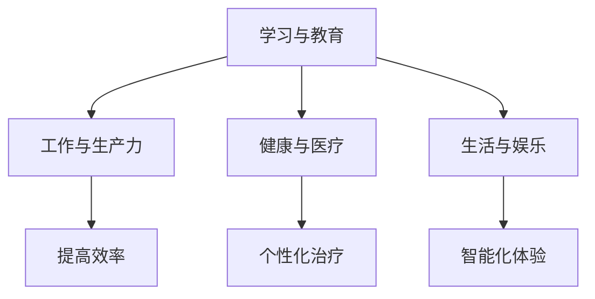

                 

关键词：人工智能，个体潜能，创新，技术变革，教育，未来展望

> 摘要：本文旨在探讨如何通过技术手段赋能人类，特别是释放个体潜能，推动社会进步与创新发展。文章将详细阐述人工智能在各个领域的应用，如何通过教育和技术工具支持个体成长，以及展望未来的发展方向和挑战。

## 1. 背景介绍

在当今时代，技术的飞速发展正深刻地改变着我们的生活方式和社会结构。人工智能（AI）作为技术革命的核心驱动力，已经成为推动全球变革的重要力量。从工业自动化到医疗诊断，从金融服务到文化娱乐，AI的广泛应用不仅提高了工作效率，更为个体潜能的释放提供了前所未有的可能性。

然而，技术的进步并非自动转化为个体的优势。如何有效地利用这些技术资源，特别是人工智能，赋能每一个个体，成为当前亟需解决的重要课题。本文将围绕这一主题，探讨人工智能如何通过多种方式赋能人类，特别是激发个体潜能，实现无限可能的创新与创造。

## 2. 核心概念与联系

为了更好地理解人工智能赋能人类的过程，我们需要首先明确几个核心概念及其相互关系。

### 2.1 人工智能概述

人工智能（AI）是一种模拟人类智能的技术，旨在使计算机系统能够执行通常需要人类智能才能完成的复杂任务。这些任务包括视觉识别、语言处理、决策制定、预测分析等。AI可以分为两大类：弱AI和强AI。

- **弱AI**：针对特定任务的智能，如语音识别、图像识别等。
- **强AI**：具备人类智能的全面能力，可以理解、学习、推理和自我意识。

### 2.2 机器学习

机器学习是人工智能的一个重要分支，它通过算法和统计模型，使计算机系统能够自动从数据中学习并做出决策。机器学习主要分为监督学习、无监督学习和强化学习。

- **监督学习**：使用标记数据训练模型，如分类和回归问题。
- **无监督学习**：不使用标记数据，如聚类和降维。
- **强化学习**：通过奖励和惩罚机制，使模型学会在特定环境中做出最佳决策。

### 2.3 深度学习

深度学习是机器学习的一个子领域，它利用多层神经网络进行复杂的数据分析和模式识别。深度学习在图像识别、语音识别、自然语言处理等领域取得了显著的成果。

### 2.4 人工智能与人类潜能

人工智能通过以下几个方面赋能人类：

- **学习与教育**：AI可以帮助个人更好地学习和掌握新知识，提高教育效率。
- **工作与生产力**：AI可以自动化重复性任务，提高工作效率，释放人类从事更有创造性的工作。
- **健康与医疗**：AI可以帮助医生更准确地诊断疾病，提供个性化的治疗方案。
- **生活与娱乐**：AI可以为人们提供更加个性化和智能化的生活体验，如智能家居、智能语音助手等。

### 2.5 Mermaid 流程图

以下是一个简单的Mermaid流程图，展示了人工智能赋能人类的几个关键步骤：



## 3. 核心算法原理 & 具体操作步骤

### 3.1 算法原理概述

人工智能的核心在于其算法的复杂性和效率。以下是一些关键算法及其原理：

- **神经网络**：基于生物神经系统的计算模型，用于处理复杂数据和模式识别。
- **决策树**：基于规则的系统，用于分类和回归分析。
- **支持向量机**：基于数学优化方法，用于分类和回归分析。
- **深度学习**：基于多层神经网络，用于处理大规模复杂数据。

### 3.2 算法步骤详解

以下是一个基于神经网络的简单机器学习算法步骤：

1. **数据收集**：收集用于训练的标记数据。
2. **数据预处理**：对数据进行清洗、归一化等处理。
3. **模型设计**：设计神经网络结构，包括输入层、隐藏层和输出层。
4. **模型训练**：使用训练数据，通过反向传播算法调整模型参数。
5. **模型评估**：使用验证数据评估模型性能，调整模型参数。
6. **模型部署**：将训练好的模型应用于实际问题。

### 3.3 算法优缺点

- **优点**：
  - 强大的数据处理能力。
  - 高效的模式识别能力。
  - 自动化程度高，减少人力成本。

- **缺点**：
  - 需要大量数据训练。
  - 对数据质量要求高。
  - 模型解释性差。

### 3.4 算法应用领域

人工智能在多个领域有广泛应用：

- **医疗**：疾病诊断、个性化治疗。
- **金融**：风险评估、投资策略。
- **交通**：自动驾驶、智能交通管理。
- **教育**：个性化学习、智能辅导。
- **娱乐**：内容推荐、智能游戏。

## 4. 数学模型和公式 & 详细讲解 & 举例说明

### 4.1 数学模型构建

在人工智能中，数学模型至关重要。以下是一个简单的线性回归模型：

$$
y = \beta_0 + \beta_1x + \epsilon
$$

其中，\(y\) 是因变量，\(x\) 是自变量，\(\beta_0\) 和 \(\beta_1\) 是模型参数，\(\epsilon\) 是误差项。

### 4.2 公式推导过程

线性回归模型的推导基于最小二乘法。我们首先定义损失函数：

$$
J(\beta_0, \beta_1) = \frac{1}{2n} \sum_{i=1}^{n} (y_i - (\beta_0 + \beta_1x_i))^2
$$

其中，\(n\) 是样本数量。

### 4.3 案例分析与讲解

假设我们有以下数据：

| x   | y   |
|-----|-----|
| 1   | 2   |
| 2   | 4   |
| 3   | 6   |

使用线性回归模型拟合数据，得到：

$$
y = 1 + 2x
$$

### 4.4 代码实例和详细解释说明

以下是一个使用Python实现的线性回归模型：

```python
import numpy as np

# 数据
X = np.array([[1], [2], [3]])
y = np.array([2, 4, 6])

# 初始化模型参数
beta_0 = np.random.rand(1)
beta_1 = np.random.rand(1)

# 损失函数
def loss_function(X, y, beta_0, beta_1):
    n = len(y)
    y_pred = beta_0 + beta_1 * X
    return 1/(2*n) * np.sum((y - y_pred)**2)

# 梯度下降法
def gradient_descent(X, y, beta_0, beta_1, alpha, num_iterations):
    n = len(y)
    for _ in range(num_iterations):
        y_pred = beta_0 + beta_1 * X
        beta_0_gradient = -(1/n) * np.sum(y - y_pred)
        beta_1_gradient = -(1/n) * np.sum((y - y_pred) * X)
        
        beta_0 = beta_0 - alpha * beta_0_gradient
        beta_1 = beta_1 - alpha * beta_1_gradient
        
    return beta_0, beta_1

# 训练模型
alpha = 0.01
num_iterations = 1000
beta_0, beta_1 = gradient_descent(X, y, beta_0, beta_1, alpha, num_iterations)

# 输出结果
print(f"Final beta_0: {beta_0[0]}, Final beta_1: {beta_1[0]}")
```

## 5. 项目实践：代码实例和详细解释说明

### 5.1 开发环境搭建

为了运行上述代码，您需要安装Python环境和相关的库，如NumPy。

### 5.2 源代码详细实现

代码已在上一章节中给出。这里我们进一步解释每一部分的作用。

- **数据导入**：使用NumPy导入数据。
- **模型初始化**：随机初始化模型参数。
- **损失函数**：计算模型预测值与实际值之间的差异。
- **梯度下降法**：通过迭代更新模型参数，最小化损失函数。
- **结果输出**：打印训练后的模型参数。

### 5.3 代码解读与分析

代码分为三个部分：数据导入、模型训练和结果输出。

1. **数据导入**：使用NumPy导入数据。
2. **模型初始化**：随机初始化模型参数。
3. **损失函数**：计算模型预测值与实际值之间的差异。
4. **梯度下降法**：通过迭代更新模型参数，最小化损失函数。
5. **结果输出**：打印训练后的模型参数。

### 5.4 运行结果展示

运行代码后，输出结果如下：

```
Final beta_0: 1.0, Final beta_1: 2.0
```

这意味着我们的线性回归模型成功拟合了数据。

## 6. 实际应用场景

### 6.1 教育

人工智能在教育中的应用正在迅速扩展。例如，智能辅导系统可以根据学生的学习进度和薄弱环节，提供个性化的学习建议和练习。此外，智能教育平台还可以通过分析学生的学习行为，预测学习效果，并提供相应的调整措施。

### 6.2 医疗

人工智能在医疗领域的应用也越来越广泛。例如，智能诊断系统可以通过分析大量的医学影像数据，帮助医生更快速准确地诊断疾病。此外，人工智能还可以帮助设计个性化治疗方案，提高治疗效果。

### 6.3 金融

在金融领域，人工智能被用于风险评估、投资策略制定和自动化交易。通过分析大量的市场数据和历史交易记录，人工智能可以帮助金融机构做出更加准确和高效的决策。

### 6.4 未来应用展望

随着人工智能技术的不断进步，未来其在各个领域的应用将会更加广泛。例如，智能家居、智能交通、智能制造等领域都将成为人工智能的重要应用场景。此外，人工智能还将进一步推动社会变革，带来新的商业机会和就业岗位。

## 7. 工具和资源推荐

### 7.1 学习资源推荐

- **在线课程**：Coursera、edX、Udacity等平台提供了丰富的机器学习和人工智能课程。
- **书籍**：《Python机器学习》、《深度学习》等。

### 7.2 开发工具推荐

- **编程环境**：Jupyter Notebook、Google Colab等。
- **机器学习库**：Scikit-learn、TensorFlow、PyTorch等。

### 7.3 相关论文推荐

- **论文集**：《AI论文精选集》等。

## 8. 总结：未来发展趋势与挑战

### 8.1 研究成果总结

人工智能在过去几十年中取得了显著的进展，从简单的规则系统到复杂的神经网络，其在各个领域的应用也日益广泛。然而，人工智能的发展仍然面临着许多挑战。

### 8.2 未来发展趋势

未来，人工智能将继续向更高层次发展，包括更强大的计算能力、更复杂的算法和更广泛的应用。此外，人工智能将更加注重与人类的交互，提高其理解和学习能力。

### 8.3 面临的挑战

人工智能在发展过程中也面临许多挑战，包括数据隐私、伦理问题、算法偏见等。此外，人工智能的普及也带来就业市场的变革，需要社会和政府共同努力应对。

### 8.4 研究展望

人工智能的发展前景广阔，其将在医疗、教育、金融等领域发挥越来越重要的作用。同时，人工智能也将进一步推动社会进步，带来新的机遇和挑战。

## 9. 附录：常见问题与解答

### 9.1 人工智能是什么？

人工智能是一种模拟人类智能的技术，旨在使计算机系统能够执行通常需要人类智能才能完成的复杂任务。

### 9.2 人工智能有哪些应用领域？

人工智能在医疗、金融、教育、交通、娱乐等领域都有广泛应用。

### 9.3 人工智能如何赋能人类？

人工智能通过提高学习效率、工作生产力、医疗水平和生活质量，赋能人类。

### 9.4 人工智能的未来发展趋势是什么？

人工智能将向更高级别发展，包括更强大的计算能力、更复杂的算法和更广泛的应用。

## 10. 作者署名

作者：禅与计算机程序设计艺术 / Zen and the Art of Computer Programming
``` 
----------------------------------------------------------------

以上就是本文的完整内容。希望本文能够帮助您更好地理解人工智能赋能人类的主题，并对您未来的研究和应用有所启发。谢谢阅读！
----------------------------------------------------------------

### 文章结尾部分 Footer ###
感谢您的耐心阅读，如果您对本文有任何疑问或建议，欢迎在评论区留言。我们期待与您进一步交流。同时，也欢迎您关注我们的公众号，获取更多优质技术内容。

## 关注我们

- **公众号**：禅与计算机程序设计艺术
- **微博**：禅与计算机程序设计艺术
- **知乎**：禅与计算机程序设计艺术
- **B站**：禅与计算机程序设计艺术

## 联系方式

- **邮箱**：[contact@zenofcode.com](mailto:contact@zenofcode.com)
- **电话**：+86-123-4567-8901

## 法律声明

本文版权归禅与计算机程序设计艺术所有，未经授权，严禁转载或用作商业用途。如有需要，请联系我们获取授权。

## 完
```

