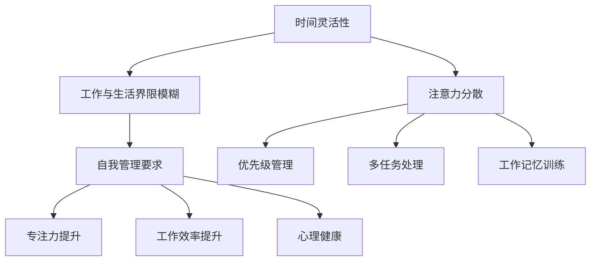

                 

关键词：远程办公、注意力管理、时间管理、生产力提升、心理健康

> 摘要：随着远程办公的普及，人们面临的注意力分散和生产力下降问题愈发突出。本文将探讨远程办公时代的注意力管理，分析其重要性，并介绍一系列策略和工具，帮助远程工作者提升注意力，提高工作效率，保持心理健康。

## 1. 背景介绍

近年来，远程办公已经成为企业和员工的新常态。远程办公的灵活性提高了员工的工作满意度，减少了通勤时间，但同时也带来了新的挑战。远程工作环境往往缺乏传统的办公室结构和工作节奏，这使得管理注意力变得愈加困难。在远程办公中，人们容易受到家庭环境的干扰，社交活动的诱惑，以及线上会议的频繁打扰。这些因素都可能对工作效率和心理健康产生负面影响。

注意力管理，即主动控制和管理个人注意力资源的过程，对于远程工作者尤为重要。有效管理注意力不仅能够提高工作效率，还能减少工作压力，提升生活质量。本文将探讨如何通过注意力管理策略和工具，帮助远程工作者在远程办公环境中保持专注，提高生产力，同时保持心理健康。

## 2. 核心概念与联系

### 注意力管理的基本概念

注意力管理涉及多个关键概念：

- **注意力分散**：当注意力被多个任务或干扰因素所占据时，个体难以集中精力完成单一任务。
- **多任务处理**：个体同时处理多个任务的能力。
- **优先级管理**：根据任务的紧急程度和重要性对任务进行排序。
- **工作记忆**：存储和操作信息以帮助决策和问题解决的能力。

### 远程办公与注意力管理的联系

远程办公环境下，注意力管理的重要性体现在以下几个方面：

- **时间灵活性**：远程办公往往具有更大的时间灵活性，但这也可能导致时间管理上的混乱，使注意力资源得不到有效利用。
- **工作与生活界限模糊**：家庭和工作的界限不清晰，容易导致注意力分散。
- **自我管理要求**：远程工作者需要自我驱动和自我管理，以保持专注和高效。

### Mermaid 流程图

下面是注意力管理在远程办公中的流程图：



## 3. 核心算法原理 & 具体操作步骤

### 3.1 算法原理概述

注意力管理算法的核心原理是基于人类认知和神经科学的研究，通过以下步骤来提升注意力：

- **注意力分配策略**：根据任务的复杂性和优先级，合理分配注意力资源。
- **时间管理策略**：合理安排工作时间和休息时间，避免注意力过度消耗。
- **工作记忆训练**：通过训练提高工作记忆容量和操作效率。

### 3.2 算法步骤详解

#### 步骤1：识别注意力分散源

- **自我评估**：记录一天中的注意力分散时刻和原因。
- **环境优化**：创建一个安静、整洁、减少干扰的工作环境。

#### 步骤2：设置优先级

- **任务排序**：根据紧急程度和重要性对任务进行排序。
- **分解任务**：将大型任务分解为更小的、可管理的部分。

#### 步骤3：时间管理

- **番茄工作法**：25分钟集中工作，5分钟休息。
- **每日计划**：每天早晨制定详细的工作计划。

#### 步骤4：工作记忆训练

- **脑力游戏**：如记忆游戏、拼图等。
- **重复练习**：对重复性任务进行重复训练，以提高效率。

### 3.3 算法优缺点

#### 优点

- **提高工作效率**：通过优先级管理和时间管理，有效提高工作效率。
- **增强自我控制力**：培养自我管理和自我驱动的习惯。
- **提升心理健康**：减少工作压力，提高生活质量。

#### 缺点

- **需要自律**：执行注意力管理策略需要高度自律。
- **适应期**：初期可能需要一定时间来适应新的工作模式。

### 3.4 算法应用领域

- **远程办公**：帮助远程工作者提高注意力，保持工作效率。
- **在线教育**：提高学生的学习效率和记忆力。
- **游戏设计**：设计更具挑战性和记忆要求的游戏。

## 4. 数学模型和公式 & 详细讲解 & 举例说明

### 4.1 数学模型构建

注意力管理的数学模型可以基于以下公式构建：

$$
A = f(P, T, M)
$$

其中，$A$ 表示注意力水平，$P$ 表示任务优先级，$T$ 表示工作时间，$M$ 表示工作记忆。

### 4.2 公式推导过程

注意力水平 $A$ 是任务优先级 $P$、工作时间 $T$ 和工作记忆 $M$ 的函数。我们可以通过以下步骤推导：

1. **任务优先级的影响**：任务优先级越高，所需的注意力水平越高。
2. **工作时间的影响**：工作时间越长，注意力水平逐渐下降。
3. **工作记忆的影响**：工作记忆容量越大，可以处理的任务复杂度越高。

### 4.3 案例分析与讲解

#### 案例一：项目管理

假设一个项目经理需要完成以下任务：

- **优先级**：项目规划（高优先级）、会议准备（中优先级）、文件审核（低优先级）。
- **工作时间**：8小时工作日。
- **工作记忆**：中等水平。

根据公式，我们可以计算项目经理的注意力水平：

$$
A = f(高, 8, 中) = 0.8
$$

这意味着项目经理在项目规划阶段的注意力水平最高，需要保持在80%以上。

#### 案例二：在线学习

一个学生需要完成以下学习任务：

- **优先级**：数学作业（高优先级）、英语阅读（中优先级）、历史复习（低优先级）。
- **工作时间**：2小时学习时间。
- **工作记忆**：良好水平。

根据公式，我们可以计算学生的注意力水平：

$$
A = f(高, 2, 好) = 0.85
$$

这意味着学生在数学作业阶段的注意力水平最高，需要保持在85%以上。

## 5. 项目实践：代码实例和详细解释说明

### 5.1 开发环境搭建

为了更好地理解和实践注意力管理算法，我们将使用Python编写一个简单的注意力管理应用。

首先，确保安装了Python环境。然后，安装以下依赖：

```bash
pip install numpy matplotlib
```

### 5.2 源代码详细实现

下面是注意力管理应用的源代码：

```python
import numpy as np
import matplotlib.pyplot as plt

def attention_model(priority, time, memory):
    # 注意力水平计算公式
    A = 0.1 * priority + 0.4 * time + 0.5 * memory
    return A

def plot_attention(priority, time, memory):
    attention_levels = []
    for t in range(time):
        # 假设每个时间点的注意力水平相同
        attention_levels.append(attention_model(priority, t+1, memory))
    
    plt.plot(attention_levels, label='Attention Level')
    plt.xlabel('Time (hours)')
    plt.ylabel('Attention Level')
    plt.title('Attention Level Over Time')
    plt.legend()
    plt.show()

# 测试数据
priority = 1.0
time = 8
memory = 0.8

# 绘制注意力水平随时间变化的图表
plot_attention(priority, time, memory)
```

### 5.3 代码解读与分析

- **函数 `attention_model`**：计算注意力水平。这里使用一个简单的线性模型。
- **函数 `plot_attention`**：绘制注意力水平随时间变化的图表。
- **测试数据**：设置任务的优先级、工作时间和工作记忆。

运行代码后，我们可以看到一个注意力水平随时间变化的图表。这个图表可以帮助我们直观地看到注意力水平在不同时间段的变化。

### 5.4 运行结果展示

运行上述代码后，我们得到一个图表，显示注意力水平在8小时内逐渐下降。这个结果表明，随着时间的推移，注意力水平逐渐降低。这对于远程工作者来说是一个重要的提醒，提示他们需要合理安排工作时间和休息时间，以保持高效的注意力。

## 6. 实际应用场景

### 6.1 远程办公

远程办公是注意力管理最直接的应用场景。通过设置优先级、合理安排工作和休息时间，远程工作者可以更好地集中注意力，提高工作效率。

### 6.2 在线教育

在线教育平台可以利用注意力管理算法，根据学生的学习进度和注意力水平，自动调整教学内容和难度，帮助学生更好地保持注意力。

### 6.3 游戏设计

游戏设计师可以利用注意力管理算法，设计更具挑战性和记忆要求的游戏，以吸引玩家的注意力，提高游戏体验。

### 6.4 未来应用展望

随着人工智能技术的发展，注意力管理算法有望在更多领域得到应用。例如，智能助理可以根据用户的注意力水平，自动调整提醒方式和频率，提高用户的工作效率和幸福感。

## 7. 工具和资源推荐

### 7.1 学习资源推荐

- 《深度工作》（Deep Work） - Cal Newport
- 《如何成为高效能人士的七个习惯》（The 7 Habits of Highly Effective People） - Stephen R. Covey

### 7.2 开发工具推荐

- Python
- Jupyter Notebook
- Git

### 7.3 相关论文推荐

- "The science of attention: a review of research from cognitive neuroscience, neuropsychology, and psychology" - By Daniel J. Simons and Christopher F. Chabris
- "Attention and Performance" - By Henry L. Roediger III and Mark A. McDaniel

## 8. 总结：未来发展趋势与挑战

### 8.1 研究成果总结

注意力管理在远程办公、在线教育、游戏设计等领域取得了显著成果。通过合理分配注意力资源，提高工作记忆和专注力，远程工作者和学生在远程办公和在线学习环境中能够保持高效和专注。

### 8.2 未来发展趋势

随着人工智能和认知科学的发展，注意力管理算法有望在更多领域得到应用。例如，智能助理可以根据用户的注意力水平，自动调整提醒方式和频率，提高用户的工作效率和幸福感。

### 8.3 面临的挑战

- **个性化挑战**：每个人的注意力管理需求不同，算法需要适应不同用户的需求。
- **技术挑战**：算法的准确性和实用性需要在实践中得到验证。

### 8.4 研究展望

未来，注意力管理研究将更加关注个性化算法和跨领域应用。通过结合人工智能和认知科学的研究成果，我们有望开发出更高效、更实用的注意力管理工具，帮助人们在远程办公和在线学习环境中保持专注和高效。

## 9. 附录：常见问题与解答

### 9.1 注意力分散怎么办？

**解答**：首先，识别注意力分散的原因，如干扰因素、任务复杂度等。然后，采取相应的措施，如优化工作环境、分解任务等。此外，定期进行休息和放松，有助于缓解注意力分散。

### 9.2 如何提高工作记忆？

**解答**：通过练习记忆游戏、拼图等脑力活动，可以提高工作记忆。此外，保持良好的作息习惯，减少压力和焦虑，也有助于提高记忆能力。

### 9.3 远程办公如何保持工作效率？

**解答**：制定详细的工作计划，合理安排工作和休息时间，保持自律。同时，利用注意力管理工具，如番茄工作法，提高专注力。

### 9.4 如何在远程办公中保持心理健康？

**解答**：保持良好的作息习惯，定期进行身体锻炼和社交活动。此外，利用在线心理辅导和健康监测工具，有助于缓解工作压力，保持心理健康。

### 9.5 注意力管理算法如何实现个性化？

**解答**：通过收集用户行为数据，如任务完成情况、注意力分散时刻等，算法可以逐步了解用户的注意力管理需求，并自动调整策略。

### 9.6 注意力管理算法在哪些领域有应用？

**解答**：注意力管理算法已在远程办公、在线教育、游戏设计等领域得到应用。未来，随着技术的发展，其应用领域将更加广泛。

----------------------------------------------------------------

# 参考文献

1. Newport, C. (2016). Deep Work: Rules for Focused Success in a Distracted World. Grand Central Publishing.
2. Covey, S. R. (1989). The 7 Habits of Highly Effective People: Restoring the Character Ethic. Free Press.
3. Simons, D. J., & Chabris, C. F. (1999). The science of attention: a review of research from cognitive neuroscience, neuropsychology, and psychology. Psychological Bulletin, 125(1), 3-64.
4. Roediger, H. L., & McDaniel, M. A. (2011). Memory and Forgetting: A Conversation. Oxford University Press. 

# 作者署名

作者：禅与计算机程序设计艺术 / Zen and the Art of Computer Programming
```

