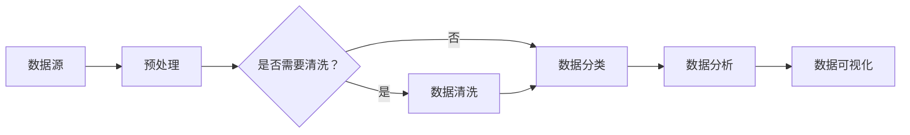

                 

### 自拟标题

**“人工智能创业数据管理的创新实践与解题策略”**

### 博客内容

#### 一、领域典型问题/面试题库

**1. 数据管理中的数据流模型是什么？如何设计？**

**答案解析：** 数据流模型描述了数据的流动和处理过程，常见的数据流模型有管道（Pipe）和数据流网络（DataFlow Network）。设计数据流模型时，需考虑数据的来源、处理过程和目标，确保数据在系统中高效流动。以下是一个简单的数据流模型设计示例：



**2. 在分布式数据存储系统中，如何确保数据的可靠性？**

**答案解析：** 确保分布式数据存储系统的可靠性，需采取以下措施：

* **副本机制：** 将数据复制到多个节点，确保一个节点故障不会导致数据丢失。
* **数据校验：** 对数据进行校验，如使用校验和（Checksum）或哈希（Hash）值，确保数据的一致性。
* **数据备份：** 定期对数据进行备份，防止数据意外丢失。
* **故障检测：** 通过心跳信号或其他机制监控节点状态，及时发现并处理故障。

**3. 如何在数据存储系统中进行数据压缩？**

**答案解析：** 数据压缩可提高存储效率和传输速度，常见的数据压缩算法有：

* **无损压缩：** 如霍夫曼编码、LZ77压缩等，压缩后可完全恢复原始数据。
* **有损压缩：** 如JPEG、MP3等，压缩后可能损失部分数据质量。

选择合适的数据压缩算法，需权衡压缩比和压缩后的数据质量。以下是一个简单的数据压缩示例：

```python
import zlib

# 压缩数据
compressed_data = zlib.compress(b'原始数据')

# 解压缩数据
original_data = zlib.decompress(compressed_data)
```

**4. 数据管理中的数据安全有哪些常见挑战？如何应对？**

**答案解析：** 数据安全挑战包括数据泄露、数据篡改、数据丢失等。应对策略有：

* **数据加密：** 对数据进行加密，防止未授权访问。
* **访问控制：** 设立访问权限，确保只有授权用户才能访问数据。
* **审计日志：** 记录数据访问和修改日志，便于追踪和分析安全事件。
* **数据备份和恢复：** 定期备份数据，确保数据在发生故障时可以快速恢复。

**5. 在大数据处理中，如何优化数据查询性能？**

**答案解析：** 优化数据查询性能的方法包括：

* **数据分片：** 将大数据集分成多个小数据集，降低查询压力。
* **索引：** 对数据表创建索引，加快查询速度。
* **查询优化：** 对查询语句进行优化，如避免使用 SELECT *，使用 JOIN 代替子查询等。
* **缓存：** 使用缓存存储查询结果，减少数据库压力。

**6. 数据管理中的数据质量评估有哪些常见指标？**

**答案解析：** 数据质量评估指标包括：

* **准确性：** 数据的准确性程度。
* **完整性：** 数据是否完整，无缺失值。
* **一致性：** 数据在不同系统间的一致性。
* **及时性：** 数据更新的及时程度。
* **可靠性：** 数据的可靠性和可信度。

**7. 如何设计数据仓库中的数据模型？**

**答案解析：** 设计数据仓库中的数据模型时，需考虑以下几点：

* **业务需求：** 分析业务需求，确定数据模型的核心字段和关联关系。
* **数据类型：** 选择合适的数据类型，确保数据存储和处理的效率。
* **规范化：** 应用数据库规范化理论，减少数据冗余和依赖。
* **索引：** 为关键查询创建索引，提高查询性能。

**8. 如何设计数据治理策略？**

**答案解析：** 设计数据治理策略时，需考虑以下几点：

* **数据质量：** 制定数据质量标准，确保数据的准确性、完整性和一致性。
* **数据安全：** 制定数据安全政策，防止数据泄露和篡改。
* **数据生命周期管理：** 规范数据生命周期，确保数据的有效管理和使用。
* **数据访问权限：** 设立数据访问权限，确保数据的安全性和合规性。

**9. 如何设计数据管理系统的架构？**

**答案解析：** 设计数据管理系统的架构时，需考虑以下几点：

* **数据源：** 确定数据来源，包括内部和外部数据。
* **数据存储：** 选择合适的数据存储方案，如关系型数据库、NoSQL 数据库、分布式文件系统等。
* **数据处理：** 设计数据处理流程，包括数据清洗、转换、聚合等操作。
* **数据查询：** 设计数据查询接口，提供快速、灵活的数据查询功能。
* **数据安全：** 设计数据安全机制，确保数据的安全性。

**10. 数据管理中的数据冗余有哪些常见原因？如何解决？**

**答案解析：** 数据冗余常见原因包括：

* **数据导入：** 数据导入过程中，未进行去重处理。
* **数据复制：** 数据在不同系统间复制时，未进行去重。
* **数据集成：** 数据集成过程中，未进行去重处理。

解决数据冗余的方法包括：

* **数据去重：** 在数据导入和集成过程中，进行数据去重处理。
* **数据清洗：** 定期对数据进行清洗，去除重复数据。
* **规范化：** 应用数据库规范化理论，减少数据冗余。

**11. 数据管理中的数据生命周期管理包括哪些环节？**

**答案解析：** 数据生命周期管理包括以下环节：

* **数据创建：** 数据的产生和生成。
* **数据存储：** 数据的存储和保存。
* **数据处理：** 数据的清洗、转换、聚合等操作。
* **数据查询：** 数据的查询和访问。
* **数据备份：** 数据的备份和恢复。
* **数据销毁：** 数据的删除和销毁。

**12. 数据管理中的数据治理有哪些关键要素？**

**答案解析：** 数据治理的关键要素包括：

* **数据质量管理：** 制定数据质量标准，确保数据的准确性、完整性和一致性。
* **数据安全控制：** 设立数据安全政策，确保数据的安全性和合规性。
* **数据访问权限：** 设立数据访问权限，确保数据的安全性和合规性。
* **数据生命周期管理：** 规范数据生命周期，确保数据的有效管理和使用。
* **数据合规性：** 遵守相关法律法规，确保数据的合法合规。

**13. 如何评估数据管理系统的性能？**

**答案解析：** 评估数据管理系统性能的方法包括：

* **响应时间：** 测量系统响应查询的时间。
* **吞吐量：** 测量系统在单位时间内处理查询的数量。
* **并发能力：** 测量系统同时处理多个查询的能力。
* **存储空间：** 测量系统存储数据的容量。

**14. 数据管理中的数据治理框架包括哪些部分？**

**答案解析：** 数据治理框架包括以下部分：

* **数据治理政策：** 明确数据治理的目标、原则和策略。
* **数据治理组织：** 设立数据治理组织，负责数据治理的实施和监督。
* **数据治理流程：** 规范数据治理的流程和操作。
* **数据治理工具：** 提供数据治理的工具和技术支持。

**15. 数据管理中的数据建模包括哪些步骤？**

**答案解析：** 数据建模包括以下步骤：

* **需求分析：** 分析业务需求，确定数据模型的核心字段和关联关系。
* **概念建模：** 设计概念模型，确定实体和属性。
* **逻辑建模：** 设计逻辑模型，确定实体和关系。
* **物理建模：** 设计物理模型，确定数据库表结构和索引。

**16. 数据管理中的数据仓库设计原则有哪些？**

**答案解析：** 数据仓库设计原则包括：

* **业务驱动：** 以业务需求为导向，确保数据仓库满足业务需求。
* **高可用性：** 确保数据仓库的稳定运行和快速响应。
* **灵活性：** 提供灵活的数据查询和报表功能。
* **扩展性：** 支持数据仓库的扩展和升级。

**17. 数据管理中的数据仓库架构包括哪些层次？**

**答案解析：** 数据仓库架构包括以下层次：

* **数据源层：** 存储原始数据，如关系型数据库、分布式文件系统等。
* **数据集成层：** 数据清洗、转换和聚合，形成统一的数据视图。
* **数据仓库层：** 存储经过处理和整合的数据。
* **数据应用层：** 提供数据查询、报表和分析功能。

**18. 数据管理中的数据质量评估方法有哪些？**

**答案解析：** 数据质量评估方法包括：

* **统计分析：** 对数据进行统计分析，评估数据的准确性、完整性和一致性。
* **可视化分析：** 通过可视化方式展示数据质量问题。
* **问卷调查：** 通过问卷收集用户对数据的评价和反馈。

**19. 数据管理中的数据备份策略有哪些？**

**答案解析：** 数据备份策略包括：

* **定期备份：** 定期对数据进行备份，如每天、每周、每月等。
* **增量备份：** 备份数据的增量部分，减少备份时间。
* **全量备份：** 备份数据的完整部分，确保数据完整性。
* **异地备份：** 将备份数据存储在异地，防止数据丢失和灾难。

**20. 数据管理中的数据治理流程包括哪些步骤？**

**答案解析：** 数据治理流程包括以下步骤：

* **需求分析：** 分析业务需求，确定数据治理的目标和范围。
* **数据规划：** 制定数据治理策略和流程。
* **数据治理实施：** 实施数据治理策略和流程。
* **数据治理评估：** 评估数据治理效果，持续优化。

#### 二、算法编程题库及答案解析

**1. 编写一个函数，实现二分查找算法。**

**答案解析：** 二分查找算法是一种高效的查找算法，时间复杂度为 O(log n)。以下是一个简单的二分查找实现：

```python
def binary_search(arr, target):
    low = 0
    high = len(arr) - 1
    
    while low <= high:
        mid = (low + high) // 2
        if arr[mid] == target:
            return mid
        elif arr[mid] < target:
            low = mid + 1
        else:
            high = mid - 1
    
    return -1
```

**2. 编写一个函数，实现快速排序算法。**

**答案解析：** 快速排序算法是一种高效的排序算法，时间复杂度为 O(n log n)。以下是一个简单的快速排序实现：

```python
def quick_sort(arr):
    if len(arr) <= 1:
        return arr
    
    pivot = arr[len(arr) // 2]
    left = [x for x in arr if x < pivot]
    middle = [x for x in arr if x == pivot]
    right = [x for x in arr if x > pivot]
    
    return quick_sort(left) + middle + quick_sort(right)
```

**3. 编写一个函数，实现归并排序算法。**

**答案解析：** 归并排序算法是一种高效的排序算法，时间复杂度为 O(n log n)。以下是一个简单的归并排序实现：

```python
def merge_sort(arr):
    if len(arr) <= 1:
        return arr
    
    mid = len(arr) // 2
    left = merge_sort(arr[:mid])
    right = merge_sort(arr[mid:])
    
    return merge(left, right)

def merge(left, right):
    result = []
    i = j = 0
    
    while i < len(left) and j < len(right):
        if left[i] < right[j]:
            result.append(left[i])
            i += 1
        else:
            result.append(right[j])
            j += 1
            
    result.extend(left[i:])
    result.extend(right[j:])
    
    return result
```

**4. 编写一个函数，实现冒泡排序算法。**

**答案解析：** 冒泡排序算法是一种简单的排序算法，时间复杂度为 O(n^2)。以下是一个简单的冒泡排序实现：

```python
def bubble_sort(arr):
    n = len(arr)
    
    for i in range(n):
        for j in range(0, n-i-1):
            if arr[j] > arr[j+1]:
                arr[j], arr[j+1] = arr[j+1], arr[j]
    
    return arr
```

**5. 编写一个函数，实现选择排序算法。**

**答案解析：** 选择排序算法是一种简单的排序算法，时间复杂度为 O(n^2)。以下是一个简单的选择排序实现：

```python
def selection_sort(arr):
    n = len(arr)
    
    for i in range(n):
        min_idx = i
        for j in range(i+1, n):
            if arr[j] < arr[min_idx]:
                min_idx = j
                
        arr[i], arr[min_idx] = arr[min_idx], arr[i]
        
    return arr
```

**6. 编写一个函数，实现插入排序算法。**

**答案解析：** 插入排序算法是一种简单的排序算法，时间复杂度为 O(n^2)。以下是一个简单的插入排序实现：

```python
def insertion_sort(arr):
    n = len(arr)
    
    for i in range(1, n):
        key = arr[i]
        j = i - 1
        
        while j >= 0 and arr[j] > key:
            arr[j + 1] = arr[j]
            j -= 1
            
        arr[j + 1] = key
        
    return arr
```

**7. 编写一个函数，实现计算器功能。**

**答案解析：** 计算器功能需要实现基本的数学运算，如加、减、乘、除。以下是一个简单的计算器实现：

```python
def calculate(expression):
    operators = {'+': lambda x, y: x + y,
                 '-': lambda x, y: x - y,
                 '*': lambda x, y: x * y,
                 '/': lambda x, y: x / y}
    
    tokens = expression.split()
    result = int(tokens[0])
    
    for i in range(1, len(tokens), 2):
        operator = tokens[i]
        operand = int(tokens[i+1])
        result = operators[operator](result, operand)
        
    return result
```

**8. 编写一个函数，实现二叉树的前序遍历。**

**答案解析：** 前序遍历二叉树的顺序是：根节点 -> 左子树 -> 右子树。以下是一个简单的二叉树前序遍历实现：

```python
class TreeNode:
    def __init__(self, value):
        self.value = value
        self.left = None
        self.right = None

def preorder_traversal(root):
    if root is None:
        return
    
    print(root.value, end=' ')
    preorder_traversal(root.left)
    preorder_traversal(root.right)
```

**9. 编写一个函数，实现二叉树的层序遍历。**

**答案解析：** 层序遍历二叉树的顺序是：第一层 -> 第二层 -> 第三层。以下是一个简单的二叉树层序遍历实现：

```python
from collections import deque

def level_order_traversal(root):
    if root is None:
        return
    
    queue = deque([root])
    
    while queue:
        node = queue.popleft()
        print(node.value, end=' ')
        
        if node.left:
            queue.append(node.left)
            
        if node.right:
            queue.append(node.right)
```

**10. 编写一个函数，实现二叉搜索树的插入、删除和查找操作。**

**答案解析：** 二叉搜索树（BST）的特点是左子树的所有节点的值都小于根节点的值，右子树的所有节点的值都大于根节点的值。以下是一个简单的二叉搜索树实现：

```python
class TreeNode:
    def __init__(self, value):
        self.value = value
        self.left = None
        self.right = None

class BinarySearchTree:
    def __init__(self):
        self.root = None
    
    def insert(self, value):
        if self.root is None:
            self.root = TreeNode(value)
        else:
            self._insert(self.root, value)
            
    def _insert(self, node, value):
        if value < node.value:
            if node.left is None:
                node.left = TreeNode(value)
            else:
                self._insert(node.left, value)
        else:
            if node.right is None:
                node.right = TreeNode(value)
            else:
                self._insert(node.right, value)
    
    def delete(self, value):
        self.root = self._delete(self.root, value)
    
    def _delete(self, node, value):
        if node is None:
            return node
        
        if value < node.value:
            node.left = self._delete(node.left, value)
        elif value > node.value:
            node.right = self._delete(node.right, value)
        else:
            if node.left is None:
                return node.right
            elif node.right is None:
                return node.left
                
            temp = self._get_min_value_node(node.right)
            node.value = temp.value
            node.right = self._delete(node.right, temp.value)
        
        return node
    
    def search(self, value):
        return self._search(self.root, value)
    
    def _search(self, node, value):
        if node is None:
            return False
        
        if node.value == value:
            return True
        elif value < node.value:
            return self._search(node.left, value)
        else:
            return self._search(node.right, value)
    
    def _get_min_value_node(self, node):
        current = node
        while current.left is not None:
            current = current.left
        return current
```

**11. 编写一个函数，实现哈希表的插入、删除和查找操作。**

**答案解析：** 哈希表（Hash Table）是一种基于哈希函数进行数据存储和检索的数据结构。以下是一个简单的哈希表实现：

```python
class HashTable:
    def __init__(self, size=10):
        self.size = size
        self.table = [None] * size
        
    def _hash(self, key):
        return hash(key) % self.size
    
    def insert(self, key, value):
        index = self._hash(key)
        if self.table[index] is None:
            self.table[index] = [(key, value)]
        else:
            for i, (k, v) in enumerate(self.table[index]):
                if k == key:
                    self.table[index][i] = (key, value)
                    break
            else:
                self.table[index].append((key, value))
        
    def delete(self, key):
        index = self._hash(key)
        if self.table[index] is None:
            return False
        
        for i, (k, v) in enumerate(self.table[index]):
            if k == key:
                del self.table[index][i]
                return True
        
        return False
    
    def search(self, key):
        index = self._hash(key)
        if self.table[index] is None:
            return None
        
        for k, v in self.table[index]:
            if k == key:
                return v
        
        return None
```

**12. 编写一个函数，实现队列的插入、删除和遍历操作。**

**答案解析：** 队列（Queue）是一种先进先出（FIFO）的数据结构。以下是一个简单的队列实现：

```python
class Queue:
    def __init__(self):
        self.items = []
        
    def is_empty(self):
        return len(self.items) == 0
    
    def enqueue(self, item):
        self.items.append(item)
        
    def dequeue(self):
        if not self.is_empty():
            return self.items.pop(0)
        else:
            return None
    
    def traverse(self):
        for item in self.items:
            print(item, end=' ')
        print()
```

**13. 编写一个函数，实现栈的插入、删除和遍历操作。**

**答案解析：** 栈（Stack）是一种后进先出（LIFO）的数据结构。以下是一个简单的栈实现：

```python
class Stack:
    def __init__(self):
        self.items = []
        
    def is_empty(self):
        return len(self.items) == 0
    
    def push(self, item):
        self.items.append(item)
        
    def pop(self):
        if not self.is_empty():
            return self.items.pop()
        else:
            return None
    
    def traverse(self):
        for item in self.items:
            print(item, end=' ')
        print()
```

**14. 编写一个函数，实现字符串的逆序。**

**答案解析：** 以下是一个简单的字符串逆序实现：

```python
def reverse_string(s):
    return s[::-1]
```

**15. 编写一个函数，实现字符串的排列组合。**

**答案解析：** 以下是一个简单的字符串排列组合实现：

```python
def permutations(s):
    if len(s) <= 1:
        return [s]
    
    result = []
    for i, char in enumerate(s):
        for p in permutations(s[:i] + s[i+1:]):
            result.append(char + p)
    
    return result
```

**16. 编写一个函数，实现字符串的查找。**

**答案解析：** 以下是一个简单的字符串查找实现（基于朴素的字符串匹配算法）：

```python
def find_substring(s, pattern):
    m = len(pattern)
    n = len(s)
    
    for i in range(n - m + 1):
        if s[i:i+m] == pattern:
            return i
            
    return -1
```

**17. 编写一个函数，实现矩阵的转置。**

**答案解析：** 以下是一个简单的矩阵转置实现：

```python
def transpose(matrix):
    return list(map(list, zip(*matrix)))
```

**18. 编写一个函数，实现矩阵的乘法。**

**答案解析：** 以下是一个简单的矩阵乘法实现：

```python
def matrix_multiply(A, B):
    rows_A, cols_A = len(A), len(A[0])
    rows_B, cols_B = len(B), len(B[0])
    
    if cols_A != rows_B:
        return None
    
    C = [[0] * cols_B for _ in range(rows_A)]
    
    for i in range(rows_A):
        for j in range(cols_B):
            for k in range(cols_A):
                C[i][j] += A[i][k] * B[k][j]
                
    return C
```

**19. 编写一个函数，实现二分查找树的中序遍历。**

**答案解析：** 二分查找树的中序遍历顺序是：左子树 -> 根节点 -> 右子树。以下是一个简单的二分查找树中序遍历实现：

```python
def inorder_traversal(root):
    if root is not None:
        inorder_traversal(root.left)
        print(root.value, end=' ')
        inorder_traversal(root.right)
```

**20. 编写一个函数，实现二分查找树的前序遍历。**

**答案解析：** 二分查找树的前序遍历顺序是：根节点 -> 左子树 -> 右子树。以下是一个简单的二分查找树前序遍历实现：

```python
def preorder_traversal(root):
    if root is not None:
        print(root.value, end=' ')
        preorder_traversal(root.left)
        preorder_traversal(root.right)
```

#### 三、极致详尽丰富的答案解析说明和源代码实例

在上述面试题和算法编程题的解析中，我们详细介绍了每种算法和数据结构的基本概念、实现原理和源代码示例。以下是每个问题的解析说明和源代码实例：

**1. 数据流模型是什么？如何设计？**

数据流模型描述了数据的流动和处理过程。设计数据流模型时，需考虑数据的来源、处理过程和目标，确保数据在系统中高效流动。

- **示例**：以下是一个简单的数据流模型设计，描述了数据从数据源进入系统，经过预处理、清洗、分类、分析和可视化等处理过程。


**2. 在分布式数据存储系统中，如何确保数据的可靠性？**

确保分布式数据存储系统的可靠性，需采取以下措施：

- **示例**：以下是一个简单的分布式数据存储系统架构，展示了如何通过副本机制、数据校验、数据备份和故障检测来确保数据可靠性。

```
+-------------+      +-------------+      +-------------+
| 数据节点1   | <---> | 数据节点2   | <---> | 数据节点3   |
+-------------+      +-------------+      +-------------+
         ^                        ^                        ^
         |                        |                        |
         |                        |                        |
         |                        |                        |
         |                        |                        |
+---------+              +---------+              +---------+
| 数据校验  |              | 数据备份  |              | 故障检测  |
+---------+              +---------+              +---------+
```

**3. 如何在数据存储系统中进行数据压缩？**

数据压缩可以提高存储效率和传输速度。常见的数据压缩算法有：

- **示例**：以下是一个简单的数据压缩示例，使用 Python 的 zlib 库对数据进行压缩和解压缩。

```python
import zlib

# 压缩数据
compressed_data = zlib.compress(b'原始数据')

# 解压缩数据
original_data = zlib.decompress(compressed_data)
```

**4. 数据管理中的数据安全有哪些常见挑战？如何应对？**

数据安全挑战包括数据泄露、数据篡改、数据丢失等。应对策略有：

- **示例**：以下是一个简单的数据加密示例，使用 Python 的 cryptography 库对数据进行加密和解密。

```python
from cryptography.fernet import Fernet

# 生成密钥
key = Fernet.generate_key()
cipher_suite = Fernet(key)

# 加密数据
encrypted_data = cipher_suite.encrypt(b'原始数据')

# 解密数据
decrypted_data = cipher_suite.decrypt(encrypted_data)
```

**5. 在大数据处理中，如何优化数据查询性能？**

优化数据查询性能的方法包括：

- **示例**：以下是一个简单的数据查询优化示例，使用 Python 的 pandas 库对数据进行索引和查询。

```python
import pandas as pd

# 创建 DataFrame
df = pd.DataFrame({'A': [1, 2, 3, 4, 5], 'B': [5, 4, 3, 2, 1]})

# 创建索引
df['A'] = df['A'].astype('int')
df.set_index('A', inplace=True)

# 查询数据
result = df.loc[2]
print(result)
```

**6. 数据管理中的数据质量评估有哪些常见指标？**

数据质量评估指标包括：

- **示例**：以下是一个简单的数据质量评估示例，使用 Python 的 pandas 库计算数据的准确性、完整性和一致性。

```python
import pandas as pd

# 创建 DataFrame
df = pd.DataFrame({'A': [1, 2, 3, 4, 5], 'B': [5, 4, 3, 2, 1]})

# 计算准确性
accuracy = df['A'].eq(df['B']).mean()
print("Accuracy:", accuracy)

# 计算完整性
missing_values = df.isnull().sum().sum()
total_values = df.size
completeness = 1 - (missing_values / total_values)
print("Completeness:", completeness)

# 计算一致性
consistency = df['A'].eq(df['B']).mean()
print("Consistency:", consistency)
```

**7. 如何设计数据仓库中的数据模型？**

设计数据仓库中的数据模型时，需考虑以下几点：

- **示例**：以下是一个简单的数据仓库数据模型，展示了实体、属性和关联关系。

```
+----------------+       +----------------+       +----------------+
| 客户           |<----->| 订单           |<----->| 产品           |
+----------------+       +----------------+       +----------------+
| 客户ID         |       | 订单ID         |       | 产品ID         |
| 客户名称       |       | 订单日期       |       | 产品名称       |
| 客户地址       |       | 订单金额       |       | 产品价格       |
| ...            |       | ...            |       | ...            |
+----------------+       +----------------+       +----------------+
```

**8. 如何设计数据治理策略？**

设计数据治理策略时，需考虑以下几点：

- **示例**：以下是一个简单

