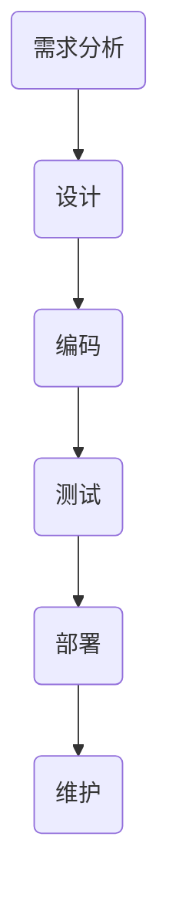
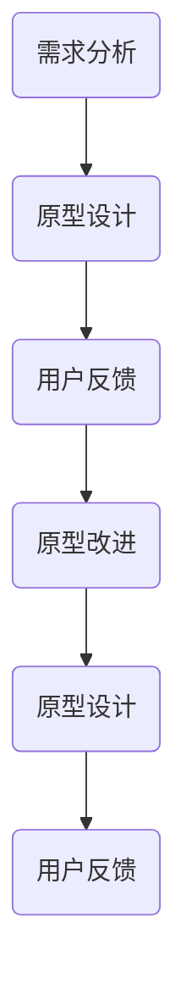

                 

### 微博2025社交网络反垃圾系统工程师社招面试

#### 1. 反垃圾系统设计

**题目：** 设计一个微博反垃圾系统，需要实现的功能包括垃圾信息检测、用户行为分析、恶意账号识别。请详细描述你的设计方案。

**答案：**

反垃圾系统设计主要分为以下几个模块：

**1.1 垃圾信息检测：**

- **关键词过滤：** 基于预定义的垃圾词库进行关键词匹配，检测微博内容是否包含垃圾信息。
- **机器学习：** 使用机器学习算法对微博内容进行分类，训练模型以识别垃圾信息。
- **深度学习：** 采用深度学习模型（如卷积神经网络、循环神经网络等）进行微博内容的语义分析，提高垃圾信息检测的准确率。

**1.2 用户行为分析：**

- **行为模式识别：** 分析用户的发布、评论、点赞等行为，建立用户行为模型，识别异常行为。
- **历史记录分析：** 通过分析用户的历史行为，识别潜在垃圾用户。

**1.3 恶意账号识别：**

- **账号特征分析：** 分析账号的注册信息、行为特征等，识别恶意账号。
- **社交网络分析：** 通过分析账号在社交网络中的关系，识别恶意账号。

**1.4 数据存储和查询：**

- **数据库设计：** 设计合适的数据库存储结构，存储微博内容、用户行为数据等。
- **查询优化：** 优化查询算法，提高系统响应速度。

**解析：** 该设计方案综合考虑了垃圾信息检测、用户行为分析和恶意账号识别等多个方面，采用多种技术手段提高系统的准确性和效率。

#### 2. 内存分配策略

**题目：** 内存分配策略对系统性能有何影响？请举例说明。

**答案：**

内存分配策略对系统性能有重要影响，主要体现在以下几个方面：

- **内存碎片：** 不合理的内存分配策略可能导致内存碎片，降低系统内存利用率。
- **分配延迟：** 内存分配策略影响内存分配的速度，如果分配延迟较高，可能导致系统性能下降。
- **内存泄漏：** 不当的内存分配策略可能导致内存泄漏，导致系统内存占用逐渐增加，最终导致系统崩溃。

**举例：**

**1. 动态内存分配：** 在C++中，使用`new`和`delete`进行内存分配和释放。这种策略可能导致内存碎片，并且内存泄漏难以检测。

```cpp
int* ptr = new int[100];
// ...
delete[] ptr;
```

**2. 固定大小内存池：** 为每个对象分配固定大小的内存块，减少内存碎片。但可能导致内存浪费。

```cpp
void* pool[100];
void* alloc(size_t size) {
    // ...
    return pool[i];
}
void free(void* ptr) {
    // ...
    pool[i] = ptr;
}
```

**解析：** 合理的内存分配策略应综合考虑内存碎片、分配延迟和内存泄漏等因素，以优化系统性能。

#### 3. 算法复杂度分析

**题目：** 请分析以下代码的算法复杂度，并说明原因。

```python
def find_max(arr):
    max_val = arr[0]
    for i in range(1, len(arr)):
        if arr[i] > max_val:
            max_val = arr[i]
    return max_val
```

**答案：**

该代码的算法复杂度为O(n)。

**原因：**

- **循环复杂度：** 该代码使用了一个for循环，循环次数与数组长度n成正比。
- **条件判断复杂度：** 在每次循环中，有一个条件判断操作（`if arr[i] > max_val:`），其复杂度为O(1)。

因此，总算法复杂度为O(n)。

**解析：** 算法复杂度分析主要关注算法的时间复杂度和空间复杂度，通过分析代码中的基本操作和循环次数，可以得出算法的复杂度。

#### 4. 稳态分布

**题目：** 请解释什么是稳态分布，并举例说明。

**答案：**

稳态分布是指在一个随机过程中，当系统达到稳定状态后，各个状态出现的概率趋于稳定，且各状态之间的转移概率也保持不变。

**举例：**

**1. 马尔可夫链：** 一个简单的例子是马尔可夫链，其中状态之间的转移概率在长时间运行后趋于稳定，形成一个稳态分布。

```python
import numpy as np

# 初始状态概率
pi = np.array([0.5, 0.5])

# 状态转移矩阵
P = np.array([[0.2, 0.8], [0.8, 0.2]])

# 运行多次马尔可夫链
for _ in range(1000):
    pi = np.dot(pi, P)

# 打印稳态分布
print(pi)
```

**2. 随机过程：** 另一个例子是随机游走过程，当随机游走达到稳态分布后，每个状态出现的概率保持不变。

```python
import numpy as np

# 初始位置
position = 0

# 运行随机游走
for _ in range(1000):
    position += np.random.choice([-1, 1])

# 打印稳态分布
print(np.mean(position == 0))
```

**解析：** 稳态分布是随机过程中状态概率趋于稳定的重要特征，通过对稳态分布的分析，可以更好地理解随机过程的长期行为。

#### 5. 并发编程

**题目：** 请解释什么是并发编程，并举例说明。

**答案：**

并发编程是指在多处理器或多个线程环境下，同时执行多个任务或操作，以提高程序的性能和响应速度。

**举例：**

**1. 多线程：** 在Python中，使用`threading`模块创建多线程。

```python
import threading

def thread_function(name):
    print(f"Thread {name}: 开始执行")

threads = []
for i in range(5):
    thread = threading.Thread(target=thread_function, args=(i,))
    threads.append(thread)
    thread.start()

for thread in threads:
    thread.join()
```

**2. 多进程：** 在Python中，使用`multiprocessing`模块创建多进程。

```python
import multiprocessing

def process_function(name):
    print(f"Process {name}: 开始执行")

processes = []
for i in range(5):
    process = multiprocessing.Process(target=process_function, args=(i,))
    processes.append(process)
    process.start()

for process in processes:
    process.join()
```

**解析：** 并发编程可以充分利用多处理器或多个线程的优势，提高程序的执行效率。通过合理地分配任务和同步资源，可以实现高效的并发执行。

#### 6. 设计模式

**题目：** 请解释什么是设计模式，并举例说明。

**答案：**

设计模式是指在实际软件开发中，针对特定问题的一系列解决方案，这些解决方案已被广泛认可并经验证。

**举例：**

**1. 单例模式：** 确保一个类只有一个实例，并提供一个全局访问点。

```python
class Singleton:
    _instance = None

    def __new__(cls, *args, **kwargs):
        if not cls._instance:
            cls._instance = super().__new__(cls, *args, **kwargs)
        return cls._instance

singleton1 = Singleton()
singleton2 = Singleton()
print(singleton1 is singleton2)  # 输出 True
```

**2. 观察者模式：** 当一个对象的状态发生变化时，通知其他对象。

```python
class Observer:
    def update(self, subject):
        print("观察者收到通知：", subject)

class Subject:
    def __init__(self):
        self._observers = []

    def add_observer(self, observer):
        self._observers.append(observer)

    def remove_observer(self, observer):
        self._observers.remove(observer)

    def notify(self):
        for observer in self._observers:
            observer.update(self)

subject = Subject()
observer1 = Observer()
observer2 = Observer()
subject.add_observer(observer1)
subject.add_observer(observer2)
subject.notify()
```

**解析：** 设计模式是一种解决软件开发中常见问题的方法，通过学习和应用设计模式，可以提高代码的可复用性、可维护性和可扩展性。

#### 7. 网络协议

**题目：** 请解释什么是网络协议，并举例说明。

**答案：**

网络协议是一组规则和约定，用于在计算机网络中传输数据，实现不同设备之间的通信。

**举例：**

**1. TCP/IP协议：** TCP/IP协议是互联网的基本协议，包括传输控制协议（TCP）和互联网协议（IP）。

- **TCP：** 提供可靠的、面向连接的传输服务，确保数据包按顺序到达。
- **IP：** 负责数据包的路由和转发，将数据包从源地址传输到目标地址。

**2. HTTP协议：** HTTP协议用于在客户端和服务器之间传输网页数据。

- **GET请求：** 请求服务器返回特定的网页数据。
- **POST请求：** 向服务器提交数据，如表单数据。

**解析：** 网络协议是计算机网络通信的基础，通过遵循特定的协议规则，可以实现不同设备之间的可靠数据传输。

#### 8. 数据结构

**题目：** 请解释什么是数据结构，并举例说明。

**答案：**

数据结构是一组数据元素及其关系的集合，用于存储、组织和管理数据。

**举例：**

**1. 链表：** 链表是一种线性数据结构，由一系列节点组成，每个节点包含数据和指向下一个节点的指针。

```python
class Node:
    def __init__(self, data):
        self.data = data
        self.next = None

head = Node(1)
node2 = Node(2)
node3 = Node(3)
head.next = node2
node2.next = node3
```

**2. 树：** 树是一种非线性数据结构，由根节点和子节点组成，每个节点可以有多个子节点。

```python
class TreeNode:
    def __init__(self, data):
        self.data = data
        self.children = []

root = TreeNode(1)
child1 = TreeNode(2)
child2 = TreeNode(3)
root.children.append(child1)
root.children.append(child2)
```

**解析：** 数据结构是编程的基础，通过选择合适的数据结构，可以提高程序的效率和性能。

#### 9. 算法分析

**题目：** 请解释什么是算法分析，并举例说明。

**答案：**

算法分析是研究算法性能的一种方法，主要包括时间复杂度和空间复杂度。

**举例：**

**1. 时间复杂度：** 计算算法运行时间与输入规模之间的关系。

```python
def bubble_sort(arr):
    n = len(arr)
    for i in range(n):
        for j in range(n - i - 1):
            if arr[j] > arr[j + 1]:
                arr[j], arr[j + 1] = arr[j + 1], arr[j]
    return arr

# 时间复杂度：O(n^2)
```

**2. 空间复杂度：** 计算算法运行所需内存与输入规模之间的关系。

```python
def bubble_sort(arr):
    n = len(arr)
    temp = [0] * n
    for i in range(n):
        for j in range(n - i - 1):
            if arr[j] > arr[j + 1]:
                temp[j] = arr[j]
                temp[j + 1] = arr[j + 1]
                arr[j] = arr[j + 1]
                arr[j + 1] = temp[j]
    return arr

# 空间复杂度：O(n)
```

**解析：** 算法分析是评估算法性能的重要手段，通过分析算法的时间复杂度和空间复杂度，可以更好地选择合适的算法。

#### 10. 机器学习

**题目：** 请解释什么是机器学习，并举例说明。

**答案：**

机器学习是一种人工智能的分支，通过训练模型来让计算机从数据中自动学习，并进行预测或决策。

**举例：**

**1. 朴素贝叶斯分类器：** 使用贝叶斯定理和朴素假设，将数据分为不同的类别。

```python
from sklearn.naive_bayes import GaussianNB
from sklearn.model_selection import train_test_split
from sklearn.datasets import load_iris

iris = load_iris()
X_train, X_test, y_train, y_test = train_test_split(iris.data, iris.target, test_size=0.3, random_state=42)

gnb = GaussianNB()
gnb.fit(X_train, y_train)

print("准确率：", gnb.score(X_test, y_test))
```

**2. 支持向量机（SVM）：** 用于分类问题，通过寻找最优超平面将数据分为不同的类别。

```python
from sklearn.svm import SVC
from sklearn.model_selection import train_test_split
from sklearn.datasets import load_iris

iris = load_iris()
X_train, X_test, y_train, y_test = train_test_split(iris.data, iris.target, test_size=0.3, random_state=42)

svm = SVC(kernel="linear")
svm.fit(X_train, y_train)

print("准确率：", svm.score(X_test, y_test))
```

**解析：** 机器学习通过训练模型，使计算机能够自动从数据中学习，并在新的数据上进行预测。这为许多应用领域带来了巨大的价值。

#### 11. 数据库

**题目：** 请解释什么是数据库，并举例说明。

**答案：**

数据库是一种用于存储、管理和检索数据的系统，可以高效地处理大量数据。

**举例：**

**1. 关系型数据库：** 如MySQL、PostgreSQL，使用表格结构存储数据。

```sql
CREATE TABLE students (
    id INT PRIMARY KEY,
    name VARCHAR(50),
    age INT
);

INSERT INTO students (id, name, age) VALUES (1, 'Alice', 20);
INSERT INTO students (id, name, age) VALUES (2, 'Bob', 22);

SELECT * FROM students;
```

**2. 非关系型数据库：** 如MongoDB，使用文档存储结构。

```javascript
const MongoClient = require('mongodb').MongoClient;

const url = 'mongodb://localhost:27017/';
const dbName = 'mydb';

MongoClient.connect(url, function(err, client) {
  if (err) throw err;

  const db = client.db(dbName);
  const collection = db.collection('students');

  collection.insertOne({ id: 1, name: 'Alice', age: 20 }, function(err, result) {
    if (err) throw err;
    console.log(result);

    collection.find({}).toArray(function(err, docs) {
      if (err) throw err;
      console.log(docs);

      client.close();
    });
  });
});
```

**解析：** 数据库用于存储和管理数据，关系型数据库使用表格结构，而非关系型数据库使用文档存储，它们都有各自的优势和适用场景。

#### 12. 操作系统

**题目：** 请解释什么是操作系统，并举例说明。

**答案：**

操作系统是一种管理计算机硬件和软件资源的系统软件，负责分配资源、调度任务、提供接口和确保系统的稳定运行。

**举例：**

**1. Windows操作系统：** Windows是一个广泛使用的操作系统，具有用户友好的图形界面。

```shell
# 启动计算器
calc.exe

# 创建文本文档
notepad.exe document.txt

# 安装软件
setup.exe
```

**2. Linux操作系统：** Linux是一个开源的操作系统，广泛应用于服务器、嵌入式设备和超级计算机。

```shell
# 显示当前目录下的文件列表
ls

# 创建目录
mkdir new_dir

# 编译C程序
gcc program.c -o program
```

**解析：** 操作系统负责管理计算机的硬件和软件资源，为用户和应用程序提供统一的接口，是计算机系统的核心组成部分。

#### 13. 网络安全

**题目：** 请解释什么是网络安全，并举例说明。

**答案：**

网络安全是指保护计算机系统和网络不受未经授权的访问、攻击和破坏，确保数据的安全、完整和可用。

**举例：**

**1. 防火墙：** 防火墙是一种网络安全设备，用于监控和过滤进出网络的数据包。

```python
from scapy.all import IP, TCP, sr

def firewall_policy(packet):
    if packet.haslayer(TCP):
        tcp = packet.getlayer(TCP)
        if tcp.Dst Port == 80:
            return "DROP"
        else:
            return "ALLOW"

 packets, responses = sr(IP(dst="www.example.com")/TCP(dport=80), filter=firewall_policy, verbose=False)
```

**2. 加密技术：** 加密技术用于保护数据的机密性和完整性。

```python
from Crypto.Cipher import AES
from Crypto.Util.Padding import pad, unpad

key = b'mysecretkey12345'
cipher = AES.new(key, AES.MODE_CBC)
ct = cipher.encrypt(b"Hello, World!")
iv = cipher.iv

print("加密文本：", ct)
print("加密初始向量：", iv)

# 解密
cipher = AES.new(key, AES.MODE_CBC, iv)
pt = unpad(cipher.decrypt(ct), AES.block_size)
print("解密文本：", pt)
```

**解析：** 网络安全涉及多种技术和手段，用于保护计算机系统和网络免受攻击和破坏，确保数据的安全传输和存储。

#### 14. 云计算

**题目：** 请解释什么是云计算，并举例说明。

**答案：**

云计算是一种通过互联网提供计算资源、存储资源和服务的模型，用户可以按需获取和使用资源。

**举例：**

**1. 公共云服务：** 如Amazon Web Services (AWS)、Microsoft Azure、Google Cloud Platform (GCP)，提供广泛的云计算服务和工具。

```python
import boto3

# 创建S3桶
s3 = boto3.client('s3')
response = s3.create_bucket(Bucket='mybucket')

# 上传文件到S3桶
file = 'file.txt'
s3.upload_file(file, 'mybucket', file)

# 下载文件到本地
s3.download_file('mybucket', file, file)
```

**2. 私有云：** 自建数据中心，为企业内部提供云计算服务。

```shell
# 安装Docker
yum install -y docker

# 启动Docker服务
systemctl start docker

# 拉取Docker镜像
docker pull ubuntu

# 运行Docker容器
docker run -d -P ubuntu
```

**解析：** 云计算提供了灵活的资源分配和管理，降低了企业的IT成本，提高了业务的敏捷性。

#### 15. 软件开发方法

**题目：** 请解释什么是软件开发生命周期，并举例说明。

**答案：**

软件开发生命周期（Software Development Life Cycle，简称SDLC）是指从软件项目启动到软件交付和维护的一系列阶段。

**举例：**

**1. 瀑布模型：** 瀑布模型是一种传统的软件开发生命周期模型，包括需求分析、设计、编码、测试、部署和维护等阶段。



**2. 原型模型：** 原型模型通过快速构建软件原型，与用户进行迭代反馈，逐步完善软件功能。



**解析：** 软件开发生命周期模型有助于规范软件开发流程，提高软件质量和开发效率。

#### 16. 设计模式

**题目：** 请解释什么是设计模式，并举例说明。

**答案：**

设计模式是一组在软件开发中广泛应用的解决方案，用于解决特定类型的软件设计问题。

**举例：**

**1. 单例模式：** 确保一个类只有一个实例，并提供一个全局访问点。

```python
class Singleton:
    _instance = None

    def __new__(cls, *args, **kwargs):
        if not cls._instance:
            cls._instance = super().__new__(cls, *args, **kwargs)
        return cls._instance

singleton1 = Singleton()
singleton2 = Singleton()
print(singleton1 is singleton2)  # 输出 True
```

**2. 观察者模式：** 当一个对象的状态发生变化时，通知其他对象。

```python
class Observer:
    def update(self, subject):
        print("观察者收到通知：", subject)

class Subject:
    def __init__(self):
        self._observers = []

    def add_observer(self, observer):
        self._observers.append(observer)

    def remove_observer(self, observer):
        self._observers.remove(observer)

    def notify(self):
        for observer in self._observers:
            observer.update(self)

subject = Subject()
observer1 = Observer()
observer2 = Observer()
subject.add_observer(observer1)
subject.add_observer(observer2)
subject.notify()
```

**解析：** 设计模式有助于提高代码的可复用性、可维护性和可扩展性，解决软件开发中常见的问题。

#### 17. 代码质量

**题目：** 请解释什么是代码质量，并举例说明。

**答案：**

代码质量是指代码的可读性、可维护性、可靠性、效率等方面的属性。

**举例：**

**1. 可读性：** 代码易于理解和阅读。

```python
# 良好的可读性
def calculate_sum(a, b):
    return a + b

# 可读性较差
def sum(a, b):
    return a + b
```

**2. 可维护性：** 代码易于修改和扩展。

```python
# 可维护性较差
def process_orders(orders):
    for order in orders:
        if order['status'] == 'pending':
            order['status'] = 'processing'
        elif order['status'] == 'processing':
            order['status'] = 'completed'

# 可维护性较好
class OrderProcessor:
    def process_pending_orders(self, orders):
        for order in orders:
            if order['status'] == 'pending':
                order['status'] = 'processing'

    def process_processing_orders(self, orders):
        for order in orders:
            if order['status'] == 'processing':
                order['status'] = 'completed'
```

**3. 可靠性：** 代码能够正确执行预期功能，并处理异常情况。

```python
# 可靠性较差
def divide(a, b):
    return a / b

# 可靠性较好
def divide(a, b):
    if b == 0:
        raise ValueError("除数不能为0")
    return a / b
```

**解析：** 代码质量直接影响软件的开发效率、维护成本和用户体验，良好的代码质量有助于提高软件的质量和可靠性。

#### 18. 测试驱动开发

**题目：** 请解释什么是测试驱动开发（TDD），并举例说明。

**答案：**

测试驱动开发（Test-Driven Development，简称TDD）是一种软件开发方法，通过编写测试用例来驱动开发过程，确保代码的质量和可靠性。

**举例：**

**1. 单元测试：** 编写单元测试用例来测试代码的各个独立模块。

```python
import unittest

def add(a, b):
    return a + b

class TestAddition(unittest.TestCase):
    def test_add(self):
        self.assertEqual(add(1, 2), 3)
        self.assertEqual(add(-1, -2), -3)
        self.assertEqual(add(0, 0), 0)

if __name__ == '__main__':
    unittest.main()
```

**2. 集成测试：** 编写集成测试用例来测试代码的多个模块之间的交互和协作。

```python
import unittest
from myapp import app

class TestMyApp(unittest.TestCase):
    def test_home_page(self):
        tester = app.test_client()
        response = tester.get('/')
        self.assertEqual(response.status_code, 200)

    def test_add_to_cart(self):
        tester = app.test_client()
        response = tester.post('/add_to_cart', data={'product_id': 1})
        self.assertEqual(response.status_code, 302)

if __name__ == '__main__':
    unittest.main()
```

**解析：** 测试驱动开发通过先编写测试用例，然后开发满足测试用例的代码，确保代码的质量和可靠性。

#### 19. 微服务架构

**题目：** 请解释什么是微服务架构，并举例说明。

**答案：**

微服务架构是一种软件架构风格，将应用程序划分为一组独立、自治的服务，每个服务负责实现特定的功能，通过轻量级的通信机制进行协作。

**举例：**

**1. 服务拆分：** 将大型单体应用拆分为多个独立的服务。

```yaml
# 服务拆分前后架构图
services:
  - name: user-service
    description: 处理用户相关的业务逻辑
  - name: order-service
    description: 处理订单相关的业务逻辑
  - name: inventory-service
    description: 处理库存相关的业务逻辑
```

**2. 服务通信：** 服务之间通过RESTful API、消息队列等方式进行通信。

```python
# user-service
from flask import Flask, jsonify, request

app = Flask(__name__)

@app.route('/users', methods=['GET', 'POST'])
def users():
    if request.method == 'GET':
        return jsonify({'users': ['Alice', 'Bob', 'Charlie']})
    else:
        user = request.form['user']
        return jsonify({'status': 'success', 'user': user})

# order-service
from flask import Flask, jsonify, request

app = Flask(__name__)

@app.route('/orders', methods=['GET', 'POST'])
def orders():
    if request.method == 'GET':
        return jsonify({'orders': ['Order1', 'Order2', 'Order3']})
    else:
        order = request.form['order']
        return jsonify({'status': 'success', 'order': order})
```

**解析：** 微服务架构可以提高应用程序的可扩展性、可靠性和可维护性，使开发、部署和运维更加灵活。

#### 20. 容器化技术

**题目：** 请解释什么是容器化技术，并举例说明。

**答案：**

容器化技术是一种轻量级虚拟化技术，通过将应用程序及其依赖项打包到一个独立的容器中，实现应用程序的快速部署、隔离和可移植性。

**举例：**

**1. Docker容器：** 使用Docker容器部署应用程序。

```shell
# 拉取Docker镜像
docker pull nginx

# 运行Nginx容器
docker run -d -p 8080:80 nginx

# 访问Nginx容器
curl http://localhost:8080
```

**2. Kubernetes集群：** 使用Kubernetes进行容器编排和管理。

```yaml
# Kubernetes部署配置文件
apiVersion: apps/v1
kind: Deployment
metadata:
  name: myapp
spec:
  selector:
    matchLabels:
      app: myapp
  template:
    metadata:
      labels:
        app: myapp
    spec:
      containers:
      - name: myapp
        image: myapp:latest
        ports:
        - containerPort: 80
```

**解析：** 容器化技术可以提高应用程序的部署效率、资源利用率和可移植性，是现代软件开发生命周期的重要组成部分。

#### 21. 云原生技术

**题目：** 请解释什么是云原生技术，并举例说明。

**答案：**

云原生技术是一组用于构建和运行云应用程序的最佳实践和工具，旨在充分利用云计算环境提供的弹性和可伸缩性。

**举例：**

**1. Kubernetes：** Kubernetes是一个开源容器编排平台，用于自动化容器的部署、扩展和管理。

```shell
# 部署Nginx容器
kubectl run nginx --image=nginx

# 查看Pod状态
kubectl get pods

# 扩展Nginx容器
kubectl scale deployment/nginx --replicas=3
```

**2. 服务网格：** 服务网格是一种用于管理微服务通信和安全的工具，如Istio。

```shell
# 安装Istio
istioctl install --set profile=demo

# 暴露Nginx服务
kubectl expose deployment/nginx --type=LoadBalancer

# 查看服务状态
kubectl get services
```

**解析：** 云原生技术帮助开发者更好地利用云计算资源，提高应用程序的可伸缩性和可靠性。

#### 22. 人工智能

**题目：** 请解释什么是人工智能，并举例说明。

**答案：**

人工智能（Artificial Intelligence，简称AI）是计算机科学的一个分支，旨在创建能够模拟人类智能行为的计算机系统。

**举例：**

**1. 深度学习：** 使用深度神经网络进行图像识别。

```python
import tensorflow as tf
from tensorflow.keras import layers

model = tf.keras.Sequential([
    layers.Conv2D(32, (3, 3), activation='relu', input_shape=(28, 28, 1)),
    layers.MaxPooling2D((2, 2)),
    layers.Conv2D(64, (3, 3), activation='relu'),
    layers.MaxPooling2D((2, 2)),
    layers.Conv2D(64, (3, 3), activation='relu'),
    layers.Flatten(),
    layers.Dense(64, activation='relu'),
    layers.Dense(10, activation='softmax')
])

model.compile(optimizer='adam',
              loss='categorical_crossentropy',
              metrics=['accuracy'])

model.fit(x_train, y_train, epochs=5, batch_size=64)
```

**2. 自然语言处理：** 使用循环神经网络（RNN）进行语言翻译。

```python
import tensorflow as tf
from tensorflow.keras import layers

model = tf.keras.Sequential([
    layers.Embedding(input_dim=vocab_size, output_dim=64),
    layers.LSTM(128),
    layers.Dense(output_dim, activation='softmax')
])

model.compile(optimizer='adam', loss='categorical_crossentropy', metrics=['accuracy'])

model.fit(x_train, y_train, epochs=10, batch_size=32)
```

**解析：** 人工智能通过模拟人类智能行为，为许多领域带来了创新和变革。

#### 23. 分布式系统

**题目：** 请解释什么是分布式系统，并举例说明。

**答案：**

分布式系统是由多个计算机节点组成的系统，这些节点通过通信网络相互连接，共同完成计算任务。

**举例：**

**1. 分布式数据库：** 如Cassandra、HBase，用于处理大规模数据存储和查询。

```shell
# 创建Cassandra表
CREATE TABLE users (
    id UUID PRIMARY KEY,
    name TEXT,
    email TEXT
);

# 插入数据
INSERT INTO users (id, name, email) VALUES (1, 'Alice', 'alice@example.com');
INSERT INTO users (id, name, email) VALUES (2, 'Bob', 'bob@example.com');

# 查询数据
SELECT * FROM users WHERE id = 1;
```

**2. 分布式缓存：** 如Redis、Memcached，用于提高数据访问速度。

```shell
# 安装Redis
sudo apt-get install redis-server

# 启动Redis服务
sudo systemctl start redis-server

# 设置缓存
SET mykey "myvalue"

# 获取缓存
GET mykey
```

**解析：** 分布式系统可以提高系统的性能、可用性和可伸缩性，适用于处理大规模数据和计算任务。

#### 24. 大数据处理

**题目：** 请解释什么是大数据处理，并举例说明。

**答案：**

大数据处理是指处理海量数据的方法和技术，包括数据的采集、存储、处理、分析和展示等。

**举例：**

**1. Hadoop生态系统：** 使用Hadoop生态系统进行数据处理。

```shell
# 安装Hadoop
sudo apt-get install hadoop

# 配置Hadoop
sudo vi /etc/hadoop/hadoop-env.sh

# 启动Hadoop服务
sudo start-dfs.sh
sudo start-yarn.sh

# 执行MapReduce任务
hadoop jar /usr/lib/hadoop-mapreduce/hadoop-streaming-2.7.4.jar \
    -input /input \
    -output /output \
    -mapper "cat" \
    -reducer "wc"
```

**2. Apache Spark：** 使用Spark进行数据处理。

```python
from pyspark.sql import SparkSession

# 创建SparkSession
spark = SparkSession.builder.appName("大数据处理").getOrCreate()

# 读取数据
df = spark.read.csv("data.csv", header=True)

# 数据处理
df.groupBy("category").count().show()

# 保存结果
df.write.csv("result.csv")
```

**解析：** 大数据处理技术可以帮助企业从海量数据中提取有价值的信息，提高业务决策的准确性。

#### 25. 容器编排工具

**题目：** 请解释什么是容器编排工具，并举例说明。

**答案：**

容器编排工具是一种用于自动化容器的部署、扩展和管理的技术或平台，常见容器编排工具包括Docker Compose、Kubernetes等。

**举例：**

**1. Docker Compose：** 使用Docker Compose编排多容器应用程序。

```yaml
# Docker Compose配置文件
version: '3'
services:
  web:
    image: myapp-web
    ports:
      - "8080:8080"
  db:
    image: myapp-db
```

```shell
# 启动Docker Compose服务
docker-compose up -d
```

**2. Kubernetes：** 使用Kubernetes进行容器编排。

```yaml
# Kubernetes配置文件
apiVersion: apps/v1
kind: Deployment
metadata:
  name: myapp
spec:
  selector:
    matchLabels:
      app: myapp
  template:
    metadata:
      labels:
        app: myapp
    spec:
      containers:
      - name: myapp
        image: myapp:latest
        ports:
        - containerPort: 80
```

```shell
# 部署Kubernetes配置文件
kubectl apply -f myapp-deployment.yaml

# 查看Pod状态
kubectl get pods
```

**解析：** 容器编排工具可以提高容器化应用程序的部署和管理效率，确保系统的高可用性和可伸缩性。

#### 26. 服务发现

**题目：** 请解释什么是服务发现，并举例说明。

**答案：**

服务发现是一种自动化服务注册和发现机制，用于在分布式系统中管理和定位服务，常见的服务发现有Consul、Eureka等。

**举例：**

**1. Consul服务发现：** 使用Consul进行服务注册和发现。

```shell
# 安装Consul
sudo apt-get install consul

# 启动Consul服务
sudo systemctl start consul

# 注册服务
consul registry -service myapp -address 127.0.0.1:8500 -port 8080
```

**2. Spring Cloud服务发现：** 使用Spring Cloud Eureka进行服务注册和发现。

```java
@EnableEurekaClient
public class MyApplication {

    public static void main(String[] args) {
        SpringApplication.run(MyApplication.class, args);
    }
}
```

```yaml
eureka:
  client:
    serviceUrl:
      defaultZone: http://localhost:8761/eureka/
```

**解析：** 服务发现可以帮助分布式系统中各个服务之间进行自动发现和通信，提高系统的可用性和可靠性。

#### 27. API网关

**题目：** 请解释什么是API网关，并举例说明。

**答案：**

API网关是一种用于代理和管理微服务的中间件组件，用于统一处理客户端请求，将请求路由到后端服务，并提供认证、授权、日志等功能。

**举例：**

**1. Kong API网关：** 使用Kong进行API网关。

```shell
# 安装Kong
sudo apt-get install kong

# 启动Kong服务
sudo systemctl start kong

# 配置Kong
sudo kong create -p nginx.conf -t kong.conf
```

**2. Spring Cloud Gateway：** 使用Spring Cloud Gateway进行API网关。

```java
@Configuration
public class GatewayConfig {

    @Bean
    public RouterFunction<ServerResponse> routes() {
        return RouterFunctions.route()
                .path("/api/**", a -> a.component(new MyController()))
                .build();
    }
}
```

**解析：** API网关可以提高微服务系统的安全性和性能，简化客户端与后端服务的交互。

#### 28. 数据仓库

**题目：** 请解释什么是数据仓库，并举例说明。

**答案：**

数据仓库是一种用于存储、管理和分析大规模数据的系统，用于支持企业的决策制定和业务分析。

**举例：**

**1. Amazon Redshift：** 使用Amazon Redshift进行数据仓库。

```shell
# 创建Redshift集群
aws redshift create-cluster --cluster-type powered-by-redshift --node-type dc2.8xlarge --nodes 3

# 访问Redshift集群
psql -h <endpoint> -U <username> -d <database>
```

**2. Apache Hive：** 使用Apache Hive进行数据仓库。

```shell
# 安装Hive
sudo apt-get install hive

# 启动Hive服务
sudo hive --service hiveserver2 &

# 访问Hive服务
beeline
```

```sql
USE mydatabase;
CREATE TABLE orders (order_id INT, product_id INT, quantity INT);
INSERT INTO orders VALUES (1, 1001, 10);
SELECT * FROM orders;
```

**解析：** 数据仓库可以帮助企业从海量数据中提取有价值的信息，支持复杂的业务分析和数据挖掘。

#### 29. 容器化

**题目：** 请解释什么是容器化，并举例说明。

**答案：**

容器化是一种将应用程序及其依赖项打包到一个独立的容器中的技术，以实现应用程序的快速部署、隔离和可移植性。

**举例：**

**1. Docker容器：** 使用Docker进行容器化。

```shell
# 拉取Docker镜像
docker pull ubuntu

# 运行Docker容器
docker run -it --rm -p 8080:8080 ubuntu nginx

# 访问Docker容器
curl http://localhost:8080
```

**2. Kubernetes容器编排：** 使用Kubernetes进行容器化。

```yaml
# Kubernetes配置文件
apiVersion: apps/v1
kind: Deployment
metadata:
  name: myapp
spec:
  selector:
    matchLabels:
      app: myapp
  template:
    metadata:
      labels:
        app: myapp
    spec:
      containers:
      - name: myapp
        image: myapp:latest
        ports:
        - containerPort: 80
```

```shell
# 部署Kubernetes配置文件
kubectl apply -f myapp-deployment.yaml

# 查看Pod状态
kubectl get pods
```

**解析：** 容器化技术可以提高应用程序的部署效率、资源利用率和可移植性。

#### 30. 声明式编程

**题目：** 请解释什么是声明式编程，并举例说明。

**答案：**

声明式编程是一种编程范式，强调描述系统的状态和期望的行为，而非具体的执行步骤。

**举例：**

**1. CSS样式：** CSS样式是一种声明式编程，用于描述网页元素的样式。

```css
/* CSS样式 */
body {
    background-color: #ffffff;
    font-family: Arial, sans-serif;
}

h1 {
    color: #333333;
    font-size: 24px;
}
```

**2. Spring框架：** Spring框架中的配置文件是一种声明式编程，用于描述应用程序的依赖关系和组件行为。

```xml
<beans xmlns="http://www.springframework.org/schema/beans"
    xmlns:xsi="http://www.w3.org/2001/XMLSchema-instance"
    xsi:schemaLocation="http://www.springframework.org/schema/beans
        http://www.springframework.org/schema/beans/spring-beans.xsd">

    <bean id="helloService" class="com.example.HelloService" />
    <bean id="helloController" class="com.example.HelloController">
        <property name="helloService" ref="helloService" />
    </bean>
</beans>
```

**解析：** 声明式编程可以提高代码的可读性和可维护性，使开发者专注于业务逻辑的实现。

