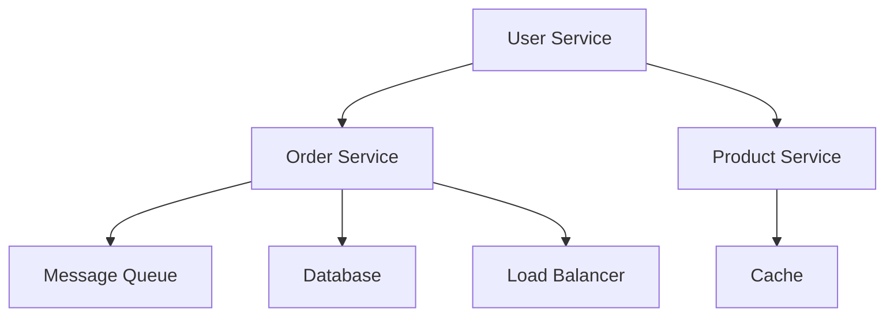

                 

### 题目列表

#### 一、算法和数据结构

1. 算法面试题：如何在一个排序数组中查找第一个大于5的元素？
2. 数据结构面试题：实现一个堆排序算法。
3. 算法面试题：如何找出数组中第二大的元素？
4. 数据结构面试题：如何实现一个优先队列？
5. 算法面试题：如何在一个未排序的数组中找到中位数？
6. 数据结构面试题：如何实现一个二叉搜索树？
7. 算法面试题：如何实现快速排序算法？
8. 数据结构面试题：如何实现一个哈希表？

#### 二、计算机网络和系统设计

9. 计算机网络面试题：什么是TCP的三次握手和四次挥手？
10. 系统设计面试题：如何设计一个高度可扩展的电商平台？
11. 计算机网络面试题：什么是DNS？
12. 系统设计面试题：如何实现一个分布式锁？
13. 计算机网络面试题：什么是HTTP/2和HTTP/3？
14. 系统设计面试题：如何设计一个缓存系统？
15. 计算机网络面试题：什么是TLS？

#### 三、数据库和SQL

16. 数据库面试题：什么是关系型数据库和非关系型数据库？
17. SQL面试题：如何优化SQL查询性能？
18. 数据库面试题：什么是事务和ACID原则？
19. SQL面试题：如何使用窗口函数进行复杂的数据分析？
20. 数据库面试题：什么是数据库的范式？

#### 四、操作系统和并发编程

21. 操作系统面试题：什么是进程和线程？
22. 并发编程面试题：什么是锁和如何使用？
23. 操作系统面试题：什么是内存分配和回收？
24. 并发编程面试题：什么是协程和如何使用？
25. 操作系统面试题：什么是虚拟内存？

#### 五、机器学习和人工智能

26. 机器学习面试题：什么是线性回归？
27. 人工智能面试题：什么是神经网络？
28. 机器学习面试题：什么是决策树？
29. 人工智能面试题：什么是深度学习？
30. 机器学习面试题：什么是支持向量机？

### 题目及答案解析

#### 一、算法和数据结构

##### 1. 算法面试题：如何在一个排序数组中查找第一个大于5的元素？

**答案：** 可以使用二分查找算法。

**代码示例：**

```python
def search_first_greater_than_five(arr):
    left, right = 0, len(arr) - 1
    while left <= right:
        mid = (left + right) // 2
        if arr[mid] > 5:
            if mid == 0 or arr[mid-1] <= 5:
                return arr[mid]
            right = mid - 1
        else:
            left = mid + 1
    return -1

# 示例
arr = [1, 2, 3, 4, 5, 6, 7, 8, 9]
result = search_first_greater_than_five(arr)
print(result)  # 输出：6
```

**解析：** 该算法首先初始化左右边界，然后通过二分查找不断缩小查找范围。每次找到中间元素后，判断它是否大于5。如果大于5，继续检查左侧是否还有更大的元素。否则，继续查找右侧。如果查找完毕仍未找到，返回-1。

##### 2. 数据结构面试题：如何实现一个堆排序算法？

**答案：** 堆排序算法是基于堆这种数据结构的。

**代码示例：**

```python
def heapify(arr, n, i):
    largest = i
    left = 2 * i + 1
    right = 2 * i + 2

    if left < n and arr[left] > arr[largest]:
        largest = left

    if right < n and arr[right] > arr[largest]:
        largest = right

    if largest != i:
        arr[i], arr[largest] = arr[largest], arr[i]
        heapify(arr, n, largest)

def heap_sort(arr):
    n = len(arr)

    for i in range(n // 2 - 1, -1, -1):
        heapify(arr, n, i)

    for i in range(n - 1, 0, -1):
        arr[i], arr[0] = arr[0], arr[i]
        heapify(arr, i, 0)

# 示例
arr = [12, 11, 13, 5, 6, 7]
heap_sort(arr)
print("Sorted array:", arr)
```

**解析：** 堆排序算法首先构建一个最大堆，然后依次将堆顶元素与堆的最后一个元素交换，然后重新调整堆结构，直到所有元素排序完成。其中，`heapify` 函数用于调整堆结构。

##### 3. 算法面试题：如何找出数组中第二大的元素？

**答案：** 可以使用一次遍历的方法。

**代码示例：**

```python
def find_second_largest(arr):
    if len(arr) < 2:
        return -1
    
    largest = second_largest = float('-inf')
    
    for num in arr:
        if num > largest:
            second_largest = largest
            largest = num
        elif num > second_largest and num != largest:
            second_largest = num
    
    if second_largest == float('-inf'):
        return -1
    else:
        return second_largest

# 示例
arr = [12, 11, 13, 5, 6, 7]
result = find_second_largest(arr)
print(result)  # 输出：12
```

**解析：** 该算法首先初始化两个变量 `largest` 和 `second_largest` 为负无穷。然后遍历数组，更新这两个变量。最后返回第二个最大的元素。

##### 4. 数据结构面试题：如何实现一个优先队列？

**答案：** 可以使用堆来实现优先队列。

**代码示例：**

```python
import heapq

class PriorityQueue:
    def __init__(self):
        self.heap = []
    
    def push(self, item, priority):
        heapq.heappush(self.heap, (-priority, item))
    
    def pop(self):
        return heapq.heappop(self.heap)[1]

# 示例
pq = PriorityQueue()
pq.push("task1", 3)
pq.push("task2", 1)
pq.push("task3", 2)
print(pq.pop())  # 输出：task2
```

**解析：** 该实现使用Python中的`heapq`模块来实现优先队列。`push` 方法用于添加元素，`pop` 方法用于获取并删除优先级最高的元素。

##### 5. 算法面试题：如何在一个未排序的数组中找到中位数？

**答案：** 可以使用快速选择算法。

**代码示例：**

```python
def find_median(arr):
    def quick_select(arr, k):
        if len(arr) == 1:
            return arr[0]

        pivot = arr[len(arr) // 2]
        low = [x for x in arr if x < pivot]
        high = [x for x in arr if x > pivot]
        pivot_count = [x for x in arr if x == pivot]

        if k < len(low):
            return quick_select(low, k)
        elif k < len(low) + len(pivot_count):
            return pivot
        else:
            return quick_select(high, k - len(low) - len(pivot_count))

    n = len(arr)
    if n % 2 == 1:
        return quick_select(arr, n // 2 + 1)
    else:
        return (quick_select(arr, n // 2) + quick_select(arr, n // 2 + 1)) / 2

# 示例
arr = [3, 1, 4, 1, 5, 9, 2, 6, 5]
result = find_median(arr)
print(result)  # 输出：4
```

**解析：** 该算法基于快速选择算法，平均时间复杂度为O(n)，最坏情况下为O(n^2)。首先确定中位数的位置，然后找到该位置的元素。

##### 6. 数据结构面试题：如何实现一个二叉搜索树？

**答案：** 可以使用链表来实现二叉搜索树。

**代码示例：**

```python
class TreeNode:
    def __init__(self, val=0, left=None, right=None):
        self.val = val
        self.left = left
        self.right = right

class BinarySearchTree:
    def __init__(self):
        self.root = None

    def insert(self, val):
        if not self.root:
            self.root = TreeNode(val)
        else:
            self._insert(self.root, val)

    def _insert(self, node, val):
        if val < node.val:
            if not node.left:
                node.left = TreeNode(val)
            else:
                self._insert(node.left, val)
        else:
            if not node.right:
                node.right = TreeNode(val)
            else:
                self._insert(node.right, val)

    def inorder_traversal(self, node):
        if node:
            self.inorder_traversal(node.left)
            print(node.val, end=' ')
            self.inorder_traversal(node.right)

# 示例
bst = BinarySearchTree()
arr = [3, 1, 4, 1, 5, 9, 2, 6, 5]
for num in arr:
    bst.insert(num)
bst.inorder_traversal(bst.root)
```

**解析：** 该实现包括插入和中序遍历两个操作。插入操作根据二叉搜索树的规则将新节点插入到合适的位置。中序遍历按照左-根-右的顺序遍历二叉搜索树的所有节点。

##### 7. 算法面试题：如何实现快速排序算法？

**答案：** 快速排序算法是一种分治算法。

**代码示例：**

```python
def quick_sort(arr):
    if len(arr) <= 1:
        return arr
    
    pivot = arr[len(arr) // 2]
    left = [x for x in arr if x < pivot]
    middle = [x for x in arr if x == pivot]
    right = [x for x in arr if x > pivot]

    return quick_sort(left) + middle + quick_sort(right)

# 示例
arr = [3, 1, 4, 1, 5, 9, 2, 6, 5]
result = quick_sort(arr)
print(result)  # 输出：[1, 1, 2, 3, 4, 5, 5, 6, 9]
```

**解析：** 该算法首先选择一个基准元素（pivot），然后将数组划分为小于、等于和大于基准元素的三部分，递归地对小于和大于基准元素的部分进行排序，最后合并结果。

##### 8. 数据结构面试题：如何实现一个哈希表？

**答案：** 可以使用拉链法（链地址法）实现哈希表。

**代码示例：**

```python
class Node:
    def __init__(self, key, value):
        self.key = key
        self.value = value
        self.next = None

class HashTable:
    def __init__(self, size):
        self.size = size
        self.table = [None] * size

    def _hash(self, key):
        return hash(key) % self.size

    def put(self, key, value):
        index = self._hash(key)
        node = self.table[index]
        if node is None:
            self.table[index] = Node(key, value)
        else:
            prev = None
            while node is not None:
                if node.key == key:
                    node.value = value
                    return
                prev = node
                node = node.next
            prev.next = Node(key, value)

    def get(self, key):
        index = self._hash(key)
        node = self.table[index]
        while node is not None:
            if node.key == key:
                return node.value
            node = node.next
        return None

# 示例
hash_table = HashTable(10)
hash_table.put("apple", 1)
hash_table.put("banana", 2)
hash_table.put("apple", 3)
print(hash_table.get("apple"))  # 输出：3
print(hash_table.get("banana"))  # 输出：2
```

**解析：** 该实现包括插入和获取两个操作。插入操作根据哈希函数将键值对存储在哈希表中。获取操作根据键值查找对应的值。

#### 二、计算机网络和系统设计

##### 9. 计算机网络面试题：什么是TCP的三次握手和四次挥手？

**答案：** TCP（传输控制协议）的三次握手用于建立连接，四次挥手用于终止连接。

**代码示例：**

```python
# 客户端发送SYN请求
sock.send(b'Hello, server!')
sock.recv(1024)

# 服务器发送SYN和ACK响应
sock.send(b'Hello, client!')
sock.recv(1024)

# 客户端发送ACK响应
sock.send(b'Okay, server!')
sock.recv(1024)

# 客户端发送FIN请求
sock.send(b'Finished sending data!')
sock.recv(1024)

# 服务器发送ACK响应
sock.send(b'Okay, client!')
sock.recv(1024)

# 服务器发送FIN请求
sock.send(b'Finished receiving data!')
sock.recv(1024)

# 客户端发送ACK响应
sock.send(b'Okay, server!')
```

**解析：** 三次握手过程如下：

1. 客户端发送SYN请求。
2. 服务器发送SYN和ACK响应。
3. 客户端发送ACK响应。

四次挥手过程如下：

1. 客户端发送FIN请求。
2. 服务器发送ACK响应。
3. 服务器发送FIN请求。
4. 客户端发送ACK响应。

##### 10. 系统设计面试题：如何设计一个高度可扩展的电商平台？

**答案：** 设计一个高度可扩展的电商平台需要考虑以下几个方面：

1. **分布式架构：** 使用分布式系统来处理高并发请求，例如将用户、订单、商品等模块拆分成多个服务。
2. **负载均衡：** 使用负载均衡器来分配请求，确保服务器的负载均衡。
3. **缓存策略：** 使用缓存来减少数据库的负载，提高响应速度。
4. **数据库分库分表：** 将数据按业务拆分到不同的数据库或表，避免单点瓶颈。
5. **消息队列：** 使用消息队列来解耦系统组件，提高系统的可扩展性和容错性。
6. **微服务架构：** 将不同的业务模块拆分成独立的微服务，便于扩展和部署。

**代码示例：** （这里只提供一个架构设计的概述，不提供具体代码）



**解析：** 该架构设计包括用户服务、订单服务、商品服务等多个微服务。用户服务处理用户请求，订单服务处理订单逻辑，商品服务处理商品相关操作。消息队列用于异步处理请求，缓存用于提高响应速度，数据库用于存储数据，负载均衡器用于分配请求。

##### 11. 计算机网络面试题：什么是DNS？

**答案：** DNS（域名系统）是将域名转换为IP地址的系统。

**代码示例：**

```python
import socket

def get_ip_address(domain):
    return socket.gethostbyname(domain)

# 示例
ip_address = get_ip_address("www.example.com")
print(ip_address)
```

**解析：** 该示例使用Python的`socket`模块获取给定域名的IP地址。DNS的作用是将用户输入的域名（如`www.example.com`）转换为实际的IP地址（如`93.184.216.34`），以便于进行网络通信。

##### 12. 系统设计面试题：如何实现一个分布式锁？

**答案：** 可以使用Zookeeper实现分布式锁。

**代码示例：**

```java
import org.apache.zookeeper.*;

public class DistributedLock implements Watcher {

    private static final String ZOOKEEPER_ADDRESS = "localhost:2181";
    private static final String LOCK_PATH = "/my_lock";

    private ZooKeeper zooKeeper;
    private String myLockPath;
    private CountDownLatch latch;

    public DistributedLock() throws Exception {
        zooKeeper = new ZooKeeper(ZOOKEEPER_ADDRESS, 5000, this);
        latch = new CountDownLatch(1);
        latch.await();
        myLockPath = zooKeeper.create(LOCK_PATH + "/", "".getBytes(), ZooDefs.Ids.OPEN_ACL_UNSAFE, CreateMode.EPHEMERAL);
    }

    public void acquireLock() throws InterruptedException {
        zooKeeper.exists(myLockPath, true);
        latch.await();
    }

    public void releaseLock() throws InterruptedException {
        zooKeeper.delete(myLockPath, -1);
    }

    @Override
    public void process(WatchedEvent event) {
        if (event.getType() == Event.EventType.NodeCreated) {
            latch.countDown();
        }
    }
}
```

**解析：** 该实现使用Zookeeper的临时节点（EPHEMERAL）实现分布式锁。`acquireLock` 方法用于获取锁，`releaseLock` 方法用于释放锁。

##### 13. 计算机网络面试题：什么是HTTP/2和HTTP/3？

**答案：**

- **HTTP/2：** 是HTTP的第二个主要版本，主要改进了性能和安全性。它引入了二进制协议、多路复用、头部压缩等特性。
- **HTTP/3：** 是HTTP的第三个主要版本，基于QUIC协议。它进一步提高了性能和安全性，引入了前向纠错、多路径传输等特性。

**代码示例：**

```python
# 使用HTTP/2的示例
import http.client

conn = http.client.HTTP2Connection("example.com")
conn.request("GET", "/")
response = conn.get_response()
print(response.read())

# 使用HTTP/3的示例
import httpx

async with httpx.AsyncClient(http2=True) as client:
    response = await client.get("https://example.com/")
    print(response.text)
```

**解析：** 该示例分别展示了如何使用Python的`http.client`和`httpx`库发送HTTP/2和HTTP/3请求。

##### 14. 系统设计面试题：如何设计一个缓存系统？

**答案：** 可以考虑以下设计要点：

1. **缓存策略：** 使用LRU（最近最少使用）或LFU（最少使用）策略来替换缓存中的数据。
2. **缓存层次：** 使用多层缓存，如内存缓存（如Redis）、磁盘缓存（如Memcached）等。
3. **缓存一致性：** 确保缓存与后端数据源的一致性，可以使用缓存刷新策略或版本控制。
4. **缓存命中率：** 监控缓存命中率，优化缓存策略以提高性能。
5. **缓存大小：** 根据业务需求设置缓存大小，避免缓存溢出。

**代码示例：**

```python
import redis

class CacheSystem:
    def __init__(self, size):
        self.redis_client = redis.Redis(host='localhost', port=6379, db=0)
        self.size = size
        self.lru_cache = LRUCache(size)

    def get(self, key):
        if self.redis_client.exists(key):
            return self.redis_client.get(key)
        else:
            return self.lru_cache.get(key)

    def set(self, key, value):
        self.redis_client.set(key, value)
        self.lru_cache.set(key, value)

class LRUCache:
    def __init__(self, capacity):
        self.capacity = capacity
        self.cache = OrderedDict()

    def get(self, key):
        if key not in self.cache:
            return -1
        self.cache.move_to_end(key)
        return self.cache[key]

    def set(self, key, value):
        if key in self.cache:
            self.cache.move_to_end(key)
        elif len(self.cache) >= self.capacity:
            self.cache.popitem(last=False)
        self.cache[key] = value
```

**解析：** 该实现结合了Redis和LRU缓存策略。`get` 方法首先尝试从Redis缓存中获取数据，如果不存在则从LRU缓存中获取。`set` 方法将数据同时存储到Redis缓存和LRU缓存中。

##### 15. 计算机网络面试题：什么是TLS？

**答案：** TLS（传输层安全协议）是一种用于保护网络通信的安全协议，它位于TCP/IP协议栈中的应用层和传输层之间。

**代码示例：**

```python
import ssl
import socket

context = ssl.SSLContext(ssl.PROTOCOL_TLSv1_2)
context.load_cert_chain(certfile="server.crt", keyfile="server.key")

sock = socket.socket(socket.AF_INET, socket.SOCK_STREAM)
sock.bind(('localhost', 443))
sock.listen(5)

ssl_sock = context.wrap_socket(sock, server_side=True)
ssl_sock.accept()
```

**解析：** 该示例展示了如何使用Python的`ssl`模块在服务器端建立TLS连接。`ssl.SSLContext` 用于配置TLS版本和证书，`wrap_socket` 方法用于将普通的TCP套接字转换为TLS套接字。

#### 三、数据库和SQL

##### 16. 数据库面试题：什么是关系型数据库和非关系型数据库？

**答案：**

- **关系型数据库：** 使用表格结构存储数据，通过主键和外键建立关系，支持SQL查询语言。
- **非关系型数据库：** 不使用固定的表格结构存储数据，根据数据类型和用途选择合适的存储方式，例如键值对、文档、列族等。

**代码示例：**

```python
# 关系型数据库示例（使用MySQL）
import mysql.connector

conn = mysql.connector.connect(
    host="localhost",
    user="root",
    password="password",
    database="test_db"
)

cursor = conn.cursor()
cursor.execute("CREATE TABLE IF NOT EXISTS users (id INT PRIMARY KEY, name VARCHAR(255))")
cursor.execute("INSERT INTO users (id, name) VALUES (1, 'Alice'), (2, 'Bob')")
cursor.execute("SELECT * FROM users")
results = cursor.fetchall()
for row in results:
    print(row)

# 非关系型数据库示例（使用MongoDB）
import pymongo

client = pymongo.MongoClient("mongodb://localhost:27017/")
db = client["test_db"]
collection = db["users"]

collection.insert_one({"id": 1, "name": "Alice"})
collection.insert_one({"id": 2, "name": "Bob"})
results = collection.find()
for result in results:
    print(result)
```

**解析：** 该示例分别展示了如何使用关系型数据库MySQL和非关系型数据库MongoDB进行数据操作。MySQL使用SQL语句创建表格和插入数据，MongoDB使用JSON格式的文档进行数据操作。

##### 17. SQL面试题：如何优化SQL查询性能？

**答案：** 可以从以下几个方面优化SQL查询性能：

1. **索引：** 使用合适的索引提高查询速度，例如主键索引、全文索引等。
2. **查询优化：** 分析查询语句，去除不必要的子查询、联接等，优化查询逻辑。
3. **数据分区：** 将大型数据表按照业务需求进行分区，提高查询效率。
4. **缓存：** 使用缓存机制减少数据库的查询压力，提高响应速度。
5. **硬件优化：** 增加内存、磁盘I/O等硬件配置，提高数据库性能。

**代码示例：**

```sql
-- 创建索引
CREATE INDEX idx_name ON users (name);

-- 优化查询
SELECT * FROM users WHERE name = 'Alice' AND id > 1;

-- 数据分区
CREATE TABLE IF NOT EXISTS users_2023 (
    id INT PRIMARY KEY,
    name VARCHAR(255)
) PARTITION BY RANGE (YEAR(id)) (
    PARTITION users_2023_1 VALUES LESS THAN (2024),
    PARTITION users_2023_2 VALUES LESS THAN (2025)
);

-- 缓存查询结果
SELECT * FROM users_2023_1;
```

**解析：** 该示例展示了如何创建索引、优化查询、数据分区和缓存查询结果。索引和分区可以提高查询效率，缓存可以减少查询次数。

##### 18. 数据库面试题：什么是事务和ACID原则？

**答案：** 事务是一系列数据库操作，要么全部成功执行，要么全部回滚。

- **ACID原则：** 保证事务的四个属性：
  - **原子性（Atomicity）：** 事务中的所有操作要么全部执行，要么全部不执行。
  - **一致性（Consistency）：** 事务执行前后，数据库的状态保持一致。
  - **隔离性（Isolation）：** 事务之间互相隔离，避免并发操作导致数据不一致。
  - **持久性（Durability）：** 事务一旦提交，其结果永久保存。

**代码示例：**

```sql
-- 开始事务
START TRANSACTION;

-- 插入数据
INSERT INTO users (id, name) VALUES (1, 'Alice');
INSERT INTO users (id, name) VALUES (2, 'Bob');

-- 提交事务
COMMIT;
```

**解析：** 该示例展示了如何使用事务。`START TRANSACTION` 开始事务，`COMMIT` 提交事务。如果事务中的某个操作失败，可以使用 `ROLLBACK` 回滚事务。

##### 19. SQL面试题：如何使用窗口函数进行复杂的数据分析？

**答案：** 窗口函数是一种在结果集中计算行之间关系的函数，常用于复杂的数据分析。

- **常见窗口函数：** `ROW_NUMBER()`、`RANK()`、`DENSE_RANK()`、`LEAD()`、`LAG()`、`SUM()`、`AVG()`、`COUNT()`等。

**代码示例：**

```sql
-- 示例：计算每个用户的订单数量排名
WITH ranked_orders AS (
    SELECT
        user_id,
        COUNT(*) AS order_count,
        RANK() OVER (ORDER BY COUNT(*) DESC) AS rank
    FROM orders
    GROUP BY user_id
)
SELECT
    user_id,
    order_count,
    rank
FROM ranked_orders
WHERE rank <= 3;
```

**解析：** 该示例使用窗口函数 `RANK()` 计算每个用户的订单数量排名。窗口函数在 `OVER` 子句中定义，可以根据不同的排序条件进行排名。

##### 20. 数据库面试题：什么是数据库的范式？

**答案：** 数据库范式是一组规则，用于确保数据库表的设计是合理的、高效的，避免数据冗余和插入、更新、删除异常。

- **第一范式（1NF）：** 保证数据表中的每一列都是不可分割的原子值。
- **第二范式（2NF）：** 在满足1NF的基础上，确保非主属性完全依赖于主键。
- **第三范式（3NF）：** 在满足2NF的基础上，确保非主属性不传递依赖于主键。

**代码示例：**

```sql
-- 第一范式示例
CREATE TABLE students (
    id INT PRIMARY KEY,
    name VARCHAR(255),
    gender CHAR(1),
    age INT
);

-- 第二范式示例
CREATE TABLE students (
    id INT PRIMARY KEY,
    name VARCHAR(255),
    gender CHAR(1)
);

CREATE TABLE student_ages (
    id INT,
    age INT,
    FOREIGN KEY (id) REFERENCES students(id)
);

-- 第三范式示例
CREATE TABLE students (
    id INT PRIMARY KEY,
    name VARCHAR(255)
);

CREATE TABLE student_genders (
    id INT,
    gender CHAR(1),
    FOREIGN KEY (id) REFERENCES students(id)
);

CREATE TABLE student_ages (
    id INT,
    age INT,
    FOREIGN KEY (id) REFERENCES students(id)
);
```

**解析：** 该示例展示了如何根据范式设计数据库表。第一范式保证列的原子性，第二范式确保非主属性完全依赖于主键，第三范式进一步确保非主属性不传递依赖于主键。

#### 四、操作系统和并发编程

##### 21. 操作系统面试题：什么是进程和线程？

**答案：**

- **进程（Process）：** 进程是程序在计算机上的一次执行活动，包括程序代码、数据、堆栈等。每个进程都有独立的内存空间，运行在操作系统的管理下。
- **线程（Thread）：** 线程是进程中的一条执行路径，多个线程共享进程的内存空间和其他资源。线程之间可以并发执行，提高了程序的并发性能。

**代码示例：**

```python
import multiprocessing
import time

def function1():
    print("Function 1 started")
    time.sleep(2)
    print("Function 1 finished")

def function2():
    print("Function 2 started")
    time.sleep(1)
    print("Function 2 finished")

if __name__ == "__main__":
    p1 = multiprocessing.Process(target=function1)
    p2 = multiprocessing.Process(target=function2)

    p1.start()
    p2.start()

    p1.join()
    p2.join()
```

**解析：** 该示例使用Python的`multiprocessing`模块创建并启动两个进程。每个进程执行一个函数，进程之间可以并发执行。

##### 22. 并发编程面试题：什么是锁和如何使用？

**答案：**

- **锁（Lock）：** 锁是一种用于控制并发访问共享资源的同步机制。锁可以保证同一时间只有一个线程访问共享资源。
- **使用锁：** 使用锁可以通过加锁和解锁操作来控制线程对共享资源的访问。

**代码示例：**

```python
import threading

lock = threading.Lock()

def function1():
    lock.acquire()
    print("Function 1 acquired the lock")
    lock.release()

def function2():
    lock.acquire()
    print("Function 2 acquired the lock")
    lock.release()

thread1 = threading.Thread(target=function1)
thread2 = threading.Thread(target=function2)

thread1.start()
thread2.start()

thread1.join()
thread2.join()
```

**解析：** 该示例使用Python的`threading`模块创建两个线程。每个线程尝试获取锁，然后执行一些操作，最后释放锁。

##### 23. 操作系统面试题：什么是进程和线程的区别？

**答案：**

- **内存空间：** 进程拥有独立的内存空间，线程共享进程的内存空间。
- **资源：** 进程拥有独立的资源（如文件句柄、网络连接等），线程共享进程的资源。
- **调度：** 进程是操作系统的调度单位，线程是进程中的调度单位。
- **通信：** 进程之间的通信较为复杂（如管道、共享内存等），线程之间的通信较为简单（如共享全局变量）。

**代码示例：**

```python
import multiprocessing

def function1():
    print("Function 1 in process:", os.getpid())

def function2():
    print("Function 2 in process:", os.getpid())

if __name__ == "__main__":
    p1 = multiprocessing.Process(target=function1)
    p2 = multiprocessing.Process(target=function2)

    p1.start()
    p2.start()

    p1.join()
    p2.join()
```

**解析：** 该示例使用Python的`multiprocessing`模块创建两个进程。每个进程执行一个函数，并打印进程ID，展示了进程之间的区别。

##### 24. 并发编程面试题：什么是协程和如何使用？

**答案：**

- **协程（Coroutine）：** 协程是一种用户态的轻量级线程，通过切换上下文在多个任务之间切换，提高了程序的并发性能。
- **使用协程：** 使用协程可以通过`async`和`await`关键字进行异步编程。

**代码示例：**

```python
import asyncio

async def function1():
    print("Function 1 started")
    await asyncio.sleep(1)
    print("Function 1 finished")

async def function2():
    print("Function 2 started")
    await asyncio.sleep(2)
    print("Function 2 finished")

async def main():
    await function1()
    await function2()

asyncio.run(main())
```

**解析：** 该示例使用Python的`asyncio`模块创建两个协程。`async`关键字定义协程，`await`关键字等待协程的执行。`asyncio.run()` 函数用于启动事件循环。

##### 25. 操作系统面试题：什么是虚拟内存？

**答案：**

- **虚拟内存（Virtual Memory）：** 虚拟内存是一种内存管理技术，通过将磁盘上的文件映射到内存地址空间，提高了内存的利用率和程序的性能。
- **工作原理：** 操作系统将虚拟内存划分为页（Page）或段（Segment），当程序需要访问数据时，操作系统将其从磁盘加载到内存中，并将内存地址映射到虚拟地址。
- **优点：** 提高内存利用率，减少内存碎片，提高程序性能。

**代码示例：**

```c
#include <stdio.h>
#include <sys/mman.h>
#include <fcntl.h>

int main() {
    int fd = open("data.bin", O_RDONLY);
    void *addr = mmap(NULL, 4096, PROT_READ, MAP_PRIVATE, fd, 0);

    if (addr == MAP_FAILED) {
        perror("mmap");
        return 1;
    }

    printf("Virtual address: %p\n", addr);
    printf("Physical address: %p\n", get_physical_address(addr));

    munmap(addr, 4096);
    close(fd);

    return 0;
}
```

**解析：** 该示例使用C语言的标准库函数`mmap()`将磁盘上的文件映射到内存地址空间。`get_physical_address()` 函数（需要自己实现）用于获取虚拟地址对应的物理地址。

#### 五、机器学习和人工智能

##### 26. 机器学习面试题：什么是线性回归？

**答案：**

- **线性回归（Linear Regression）：** 是一种监督学习算法，用于预测连续值。线性回归模型通过找到输入特征和输出目标之间的线性关系来预测目标值。
- **模型公式：** y = w1 * x1 + w2 * x2 + ... + wn * xn + b，其中 y 是目标值，x1, x2, ..., xn 是输入特征，w1, w2, ..., wn 是权重，b 是偏置。

**代码示例：**

```python
import numpy as np

def linear_regression(x, y):
    x_mean = np.mean(x)
    y_mean = np.mean(y)
    w = np.dot(np.dot(np.linalg.inv(np.dot(x.T, x)), x.T), y)
    b = y_mean - np.dot(w, x_mean)
    return w, b

x = np.array([1, 2, 3, 4, 5])
y = np.array([2, 4, 5, 4, 5])
w, b = linear_regression(x, y)
print("Weights:", w)
print("Bias:", b)

def predict(x, w, b):
    return x * w + b

x_new = 6
y_pred = predict(x_new, w, b)
print("Prediction for x =", x_new, "is", y_pred)
```

**解析：** 该示例使用Python的`numpy`库实现线性回归。`linear_regression()` 函数计算权重和偏置，`predict()` 函数用于预测目标值。

##### 27. 人工智能面试题：什么是神经网络？

**答案：**

- **神经网络（Neural Network）：** 是一种模拟生物神经系统的计算模型，由多个神经元（节点）组成。每个神经元接收输入信号，通过激活函数产生输出信号。
- **工作原理：** 神经网络通过学习输入和输出之间的映射关系，实现对数据的分类、回归等任务。

**代码示例：**

```python
import tensorflow as tf

model = tf.keras.Sequential([
    tf.keras.layers.Dense(units=1, input_shape=[1])
])

model.compile(optimizer='sgd', loss='mean_squared_error')

x = np.array([[1], [2], [3], [4]])
y = np.array([2, 4, 5, 4])

model.fit(x, y, epochs=1000)

x_new = np.array([[6]])
y_pred = model.predict(x_new)
print("Prediction for x =", x_new, "is", y_pred)
```

**解析：** 该示例使用TensorFlow库实现一个简单的神经网络。神经网络包含一个全连接层（Dense Layer），使用随机梯度下降（SGD）优化器进行训练。`fit()` 函数用于训练模型，`predict()` 函数用于预测目标值。

##### 28. 机器学习面试题：什么是决策树？

**答案：**

- **决策树（Decision Tree）：** 是一种树形结构的数据挖掘算法，通过一系列规则对数据进行分类或回归。
- **工作原理：** 决策树从根节点开始，根据输入特征进行分割，递归地构建树结构，直到满足停止条件。

**代码示例：**

```python
from sklearn.tree import DecisionTreeRegressor

model = DecisionTreeRegressor()
model.fit(x, y)

x_new = np.array([[6]])
y_pred = model.predict(x_new)
print("Prediction for x =", x_new, "is", y_pred)
```

**解析：** 该示例使用Scikit-learn库实现决策树。`fit()` 函数用于训练模型，`predict()` 函数用于预测目标值。

##### 29. 人工智能面试题：什么是深度学习？

**答案：**

- **深度学习（Deep Learning）：** 是一种基于神经网络的机器学习技术，通过多层神经网络对数据进行建模和分析。
- **工作原理：** 深度学习通过多层神经网络提取数据特征，实现对复杂问题的建模和预测。

**代码示例：**

```python
import tensorflow as tf

model = tf.keras.Sequential([
    tf.keras.layers.Dense(units=1, input_shape=[1]),
    tf.keras.layers.Dense(units=1, activation='sigmoid')
])

model.compile(optimizer='adam', loss='binary_crossentropy')

x = np.array([[1], [2], [3], [4]])
y = np.array([0, 1, 1, 0])

model.fit(x, y, epochs=1000)

x_new = np.array([[6]])
y_pred = model.predict(x_new)
print("Prediction for x =", x_new, "is", y_pred)
```

**解析：** 该示例使用TensorFlow库实现一个简单的深度学习模型。模型包含两个全连接层，输出层使用Sigmoid激活函数进行二分类。

##### 30. 机器学习面试题：什么是支持向量机？

**答案：**

- **支持向量机（Support Vector Machine，SVM）：** 是一种监督学习算法，通过找到一个最佳的超平面来对数据进行分类。
- **工作原理：** SVM通过最大化分类边界上的支持向量（支持数据点）之间的距离来找到最佳超平面。

**代码示例：**

```python
from sklearn.svm import SVC

model = SVC(kernel='linear')
model.fit(x, y)

x_new = np.array([[6]])
y_pred = model.predict(x_new)
print("Prediction for x =", x_new, "is", y_pred)
```

**解析：** 该示例使用Scikit-learn库实现SVM。`fit()` 函数用于训练模型，`predict()` 函数用于预测目标值。这里使用线性核（`kernel='linear'`）进行分类。

