                 

### 1. 如何设计一个课程购买流程？

**题目：** 在一个知识付费的移动端APP中，如何设计一个从课程展示到购买完成的流程？

**答案：** 课程购买流程通常包括以下几个步骤：

1. **课程搜索与筛选：** 用户可以通过搜索框或筛选条件（如分类、难度、讲师等）来查找感兴趣的课程。
2. **课程详情页面：** 用户点击课程列表中的课程，进入课程详情页面，查看课程的简介、章节目录、讲师介绍、用户评价等信息。
3. **购买决策：** 用户在课程详情页面点击“购买”按钮，进入购买决策流程。
4. **登录与注册：** 如果用户未登录，系统会提示用户登录或注册。
5. **选择支付方式：** 用户可以选择支付宝、微信支付、银联支付等方式进行支付。
6. **支付确认：** 用户确认支付后，系统进行支付处理，显示支付结果。
7. **课程交付：** 支付成功后，系统会将课程内容交付给用户，用户可以在线学习或下载课程资料。

**举例：**

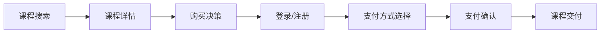

**解析：** 以上流程确保用户能够清晰地了解课程的购买过程，同时保证用户数据的完整性和安全性。

### 2. 如何处理课程库存管理？

**题目：** 在一个知识付费的移动端APP中，如何处理课程库存管理？

**答案：** 课程库存管理主要包括以下几个方面：

1. **库存初始化：** 在课程上架时，管理员需要设置课程的初始库存数量。
2. **库存更新：** 当用户购买课程时，系统需要减少课程库存数量；当课程下架时，系统需要将库存数量置为0。
3. **库存预警：** 当课程库存低于设定阈值时，系统会发送预警通知给管理员。
4. **库存报表：** 系统需要定期生成库存报表，以便管理员了解课程的库存情况。

**举例：**

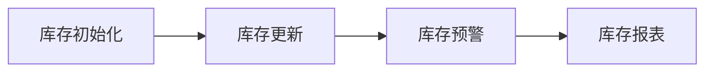

**解析：** 以上措施确保课程的库存信息能够实时更新，避免用户购买到无库存的课程，同时帮助管理员更好地管理课程库存。

### 3. 如何设计课程评价系统？

**题目：** 在一个知识付费的移动端APP中，如何设计课程评价系统？

**答案：** 课程评价系统设计主要包括以下几个方面：

1. **评价体系：** 设定评价维度（如课程内容、讲师水平、实用性等），每个维度可以设定不同的权重。
2. **评价入口：** 在课程详情页面设置评价入口，用户购买课程后可以对该课程进行评价。
3. **评价审核：** 对用户评价进行审核，确保评价内容的真实性和有效性。
4. **评价展示：** 在课程详情页面展示用户的平均评价分数和具体评价内容，帮助其他用户了解课程质量。
5. **评价反馈：** 将用户评价反馈给课程讲师，鼓励讲师不断改进课程内容。

**举例：**

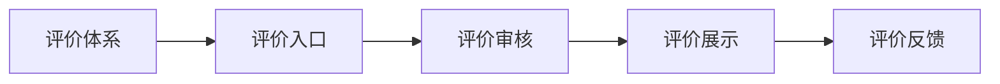

**解析：** 以上设计确保用户能够真实地反馈课程质量，同时帮助其他用户做出更明智的购买决策。

### 4. 如何保证课程内容的安全性？

**题目：** 在一个知识付费的移动端APP中，如何保证课程内容的安全性？

**答案：** 为了保证课程内容的安全性，可以从以下几个方面进行设计：

1. **加密存储：** 将课程内容加密存储在服务器上，确保课程内容在传输和存储过程中不会被窃取。
2. **访问控制：** 对课程内容进行访问控制，只有购买用户才能访问对应课程。
3. **版权保护：** 在课程内容中嵌入版权声明，防止用户未经授权传播课程内容。
4. **监控与预警：** 对课程内容进行实时监控，一旦发现异常行为，立即采取措施。

**举例：**

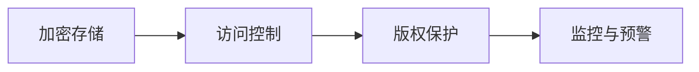

**解析：** 以上措施确保课程内容的安全性，防止用户非法传播课程内容，同时保护课程讲师的权益。

### 5. 如何设计课程推荐系统？

**题目：** 在一个知识付费的移动端APP中，如何设计课程推荐系统？

**答案：** 课程推荐系统设计主要包括以下几个方面：

1. **用户画像：** 收集用户的浏览记录、购买历史、评价等信息，构建用户画像。
2. **课程标签：** 给每个课程设置标签，包括课程主题、难度、适用人群等。
3. **推荐算法：** 采用协同过滤、基于内容的推荐算法等，根据用户画像和课程标签进行推荐。
4. **推荐展示：** 在APP首页、课程详情页等位置展示推荐课程，引导用户进行学习。

**举例：**

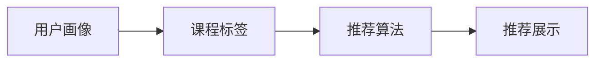

**解析：** 以上设计确保课程推荐系统能够为用户提供个性化的学习内容，提高用户的学习体验。

### 6. 如何处理用户反馈与投诉？

**题目：** 在一个知识付费的移动端APP中，如何处理用户反馈与投诉？

**答案：** 处理用户反馈与投诉可以从以下几个方面进行：

1. **反馈渠道：** 在APP中设置反馈入口，包括在线客服、邮件、电话等。
2. **投诉处理：** 建立投诉处理流程，包括投诉接收、投诉分类、投诉处理、投诉反馈等环节。
3. **问题跟踪：** 对每个反馈或投诉进行跟踪，确保问题得到及时解决。
4. **用户满意度调查：** 定期开展用户满意度调查，了解用户对APP的满意度，持续优化服务。

**举例：**

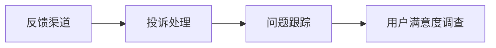

**解析：** 以上设计确保用户能够方便地反馈问题和投诉，同时保证问题得到及时解决，提高用户满意度。

### 7. 如何确保用户隐私保护？

**题目：** 在一个知识付费的移动端APP中，如何确保用户隐私保护？

**答案：** 确保用户隐私保护可以从以下几个方面进行：

1. **隐私政策：** 明确告知用户APP收集和使用用户信息的目的、范围和方式，并取得用户同意。
2. **数据加密：** 对用户数据进行加密存储，确保数据在传输和存储过程中的安全性。
3. **访问控制：** 限制对用户数据的访问权限，确保只有授权人员才能访问用户数据。
4. **数据脱敏：** 对用户敏感数据进行脱敏处理，防止用户信息泄露。
5. **用户权限管理：** 为用户提供权限管理功能，允许用户自主控制个人信息的使用权限。

**举例：**

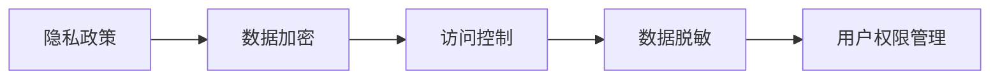

**解析：** 以上措施确保用户隐私得到有效保护，降低用户信息泄露的风险。

### 8. 如何优化课程内容加载速度？

**题目：** 在一个知识付费的移动端APP中，如何优化课程内容加载速度？

**答案：** 优化课程内容加载速度可以从以下几个方面进行：

1. **内容缓存：** 将课程内容缓存到本地，减少网络请求次数，提高加载速度。
2. **内容压缩：** 对课程内容进行压缩处理，减小文件大小，加快传输速度。
3. **CDN加速：** 利用CDN技术，将课程内容部署到离用户较近的服务器，降低网络延迟。
4. **懒加载：** 在用户需要时才加载课程内容，避免在页面初始化时加载过多内容。
5. **内容预加载：** 根据用户的浏览记录和喜好，预测用户可能需要访问的课程内容，提前加载。

**举例：**

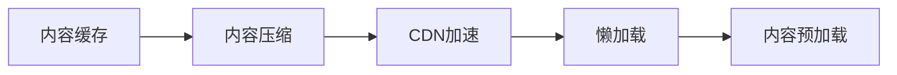

**解析：** 以上措施可以显著提高课程内容的加载速度，提升用户的体验。

### 9. 如何进行课程内容版权保护？

**题目：** 在一个知识付费的移动端APP中，如何进行课程内容版权保护？

**答案：** 进行课程内容版权保护可以从以下几个方面进行：

1. **版权声明：** 在课程内容中添加版权声明，明确课程内容的版权归属。
2. **水印处理：** 对课程内容添加水印，防止用户非法传播课程内容。
3. **版权监测：** 定期监测网络上的课程内容，一旦发现侵权行为，立即采取措施。
4. **法律手段：** 对于严重侵权行为，可以采取法律手段进行维权。

**举例：**

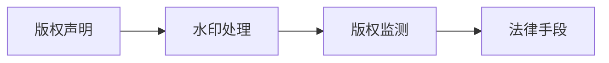

**解析：** 以上措施可以有效地保护课程内容的版权，防止用户非法传播课程内容。

### 10. 如何设计课程分类与标签体系？

**题目：** 在一个知识付费的移动端APP中，如何设计课程分类与标签体系？

**答案：** 设计课程分类与标签体系可以从以下几个方面进行：

1. **分类体系：** 根据课程内容的不同特点，设定不同的分类维度，如技术、人文、职场等。
2. **标签体系：** 为每个分类设定相应的标签，如前端开发、Python编程、时间管理等。
3. **分类标签关联：** 将课程与分类标签进行关联，方便用户进行课程检索和推荐。
4. **用户反馈调整：** 根据用户的浏览记录和购买行为，不断调整分类标签体系，提高用户的体验。

**举例：**

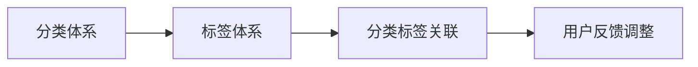

**解析：** 以上措施可以有效地组织课程内容，方便用户进行课程检索和推荐，提高用户的使用体验。

### 11. 如何处理讲师资质审核？

**题目：** 在一个知识付费的移动端APP中，如何处理讲师资质审核？

**答案：** 处理讲师资质审核可以从以下几个方面进行：

1. **资质要求：** 设定讲师的资质要求，如教育背景、工作经验、教学能力等。
2. **申请提交：** 讲师提交资质证明和相关材料，进行资质审核。
3. **资质审核：** 审核人员对讲师的资质进行审核，包括身份验证、证书核实等。
4. **审核反馈：** 将审核结果通知讲师，通过审核的讲师可以开始授课，未通过审核的讲师需要重新提交资质。

**举例：**

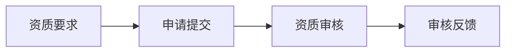

**解析：** 以上措施确保讲师的资质符合要求，提高课程质量，为用户提供更好的学习体验。

### 12. 如何设计课程章节与进度管理？

**题目：** 在一个知识付费的移动端APP中，如何设计课程章节与进度管理？

**答案：** 设计课程章节与进度管理可以从以下几个方面进行：

1. **章节划分：** 根据课程内容，将课程划分为多个章节，方便用户学习。
2. **进度记录：** 记录用户的学习进度，包括已学习章节、学习时长等。
3. **进度提示：** 在APP中显示用户的学习进度，提醒用户继续学习。
4. **进度追踪：** 对用户的学习进度进行追踪，分析用户的学习行为，优化课程内容。

**举例：**

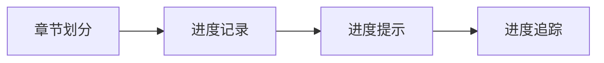

**解析：** 以上措施可以有效地帮助用户管理学习进度，提高学习效率。

### 13. 如何设计课程订阅与会员服务？

**题目：** 在一个知识付费的移动端APP中，如何设计课程订阅与会员服务？

**答案：** 设计课程订阅与会员服务可以从以下几个方面进行：

1. **课程订阅：** 提供课程订阅服务，用户可以按月或按年订阅课程，享受折扣优惠。
2. **会员权益：** 设定会员权益，如免费试听课程、专属优惠、积分兑换等。
3. **会员等级：** 根据用户的订阅时长和消费金额，设置会员等级，享受不同等级的特权。
4. **会员管理：** 对会员信息进行管理，包括会员等级调整、会员优惠活动推送等。

**举例：**

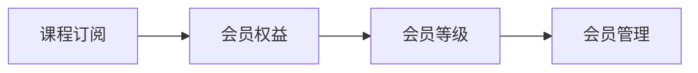

**解析：** 以上措施可以激发用户订阅课程的积极性，提高用户粘性。

### 14. 如何优化课程推荐算法？

**题目：** 在一个知识付费的移动端APP中，如何优化课程推荐算法？

**答案：** 优化课程推荐算法可以从以下几个方面进行：

1. **用户行为分析：** 收集用户浏览、购买、评价等行为数据，分析用户兴趣和需求。
2. **内容标签匹配：** 为课程和用户打标签，根据标签进行内容推荐。
3. **协同过滤：** 采用协同过滤算法，根据用户的历史行为和相似用户的行为进行推荐。
4. **机器学习：** 利用机器学习算法，不断优化推荐模型，提高推荐准确率。
5. **实时反馈：** 收集用户对推荐的反馈，根据反馈调整推荐策略。

**举例：**

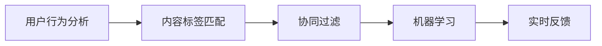

**解析：** 以上措施可以有效地提高课程推荐系统的准确率和用户满意度。

### 15. 如何保证课程内容的更新与维护？

**题目：** 在一个知识付费的移动端APP中，如何保证课程内容的更新与维护？

**答案：** 保证课程内容的更新与维护可以从以下几个方面进行：

1. **课程审核：** 定期对课程内容进行审核，确保课程内容的合规性和时效性。
2. **内容更新：** 定期更新课程内容，添加新的知识点和案例，保持课程内容的活力。
3. **用户反馈：** 收集用户的反馈和建议，根据用户需求调整课程内容。
4. **讲师培训：** 对讲师进行培训，提高讲师的教学能力和课程制作水平。
5. **技术支持：** 提供技术支持，帮助讲师制作高质量的课程内容。

**举例：**

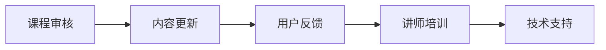

**解析：** 以上措施可以确保课程内容的质量和时效性，满足用户的学习需求。

### 16. 如何处理用户学习数据？

**题目：** 在一个知识付费的移动端APP中，如何处理用户学习数据？

**答案：** 处理用户学习数据可以从以下几个方面进行：

1. **数据收集：** 收集用户的学习数据，包括学习时长、学习进度、学习效果等。
2. **数据存储：** 将用户学习数据存储在数据库中，确保数据的安全性和可靠性。
3. **数据分析：** 利用数据分析工具，对用户学习数据进行挖掘和分析，发现用户的学习规律和需求。
4. **数据展示：** 将用户学习数据以图表、报告等形式展示，帮助用户了解自己的学习情况。
5. **数据隐私保护：** 对用户学习数据进行加密存储，确保用户隐私不受侵犯。

**举例：**

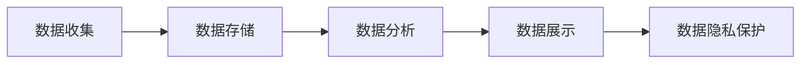

**解析：** 以上措施可以有效地帮助用户了解自己的学习情况，为用户提供更好的学习体验。

### 17. 如何保证课程评分的公正性？

**题目：** 在一个知识付费的移动端APP中，如何保证课程评分的公正性？

**答案：** 保证课程评分的公正性可以从以下几个方面进行：

1. **评分机制：** 设定评分机制，确保评分结果客观、公正。
2. **评分审核：** 对用户评分进行审核，防止恶意评分或刷单行为。
3. **评分公示：** 将评分结果进行公示，接受用户监督。
4. **用户反馈：** 收集用户对评分系统的反馈，不断优化评分机制。
5. **算法优化：** 利用算法优化评分模型，提高评分结果的准确性。

**举例：**

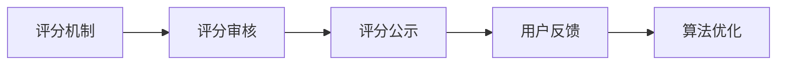

**解析：** 以上措施可以确保课程评分的公正性，为用户提供真实、客观的课程评价。

### 18. 如何设计用户学习计划？

**题目：** 在一个知识付费的移动端APP中，如何设计用户学习计划？

**答案：** 设计用户学习计划可以从以下几个方面进行：

1. **学习目标设定：** 帮助用户设定学习目标，明确学习方向。
2. **学习内容推荐：** 根据用户的学习目标和兴趣，推荐适合的学习内容。
3. **学习进度管理：** 监控用户的学习进度，提醒用户按时完成学习任务。
4. **学习计划调整：** 根据用户的学习反馈和进度，调整学习计划。
5. **学习效果评估：** 定期对用户的学习效果进行评估，为后续学习提供指导。

**举例：**

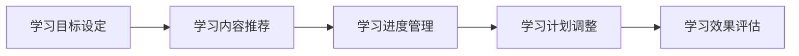

**解析：** 以上措施可以帮助用户更好地规划学习时间，提高学习效率。

### 19. 如何优化课程搜索体验？

**题目：** 在一个知识付费的移动端APP中，如何优化课程搜索体验？

**答案：** 优化课程搜索体验可以从以下几个方面进行：

1. **搜索算法优化：** 采用高效的搜索算法，提高搜索结果的准确性和速度。
2. **搜索建议：** 提供搜索建议，帮助用户快速找到所需课程。
3. **搜索历史记录：** 记录用户的搜索历史记录，方便用户快速查找课程。
4. **搜索结果排序：** 根据用户的浏览记录和评价，对搜索结果进行排序，提高搜索结果的实用性。
5. **搜索结果展示：** 采用图文并茂的方式展示搜索结果，提高用户的体验。

**举例：**

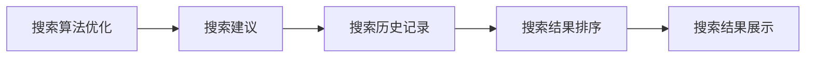

**解析：** 以上措施可以有效地提高课程搜索的准确性和用户体验。

### 20. 如何处理用户退款与售后？

**题目：** 在一个知识付费的移动端APP中，如何处理用户退款与售后？

**答案：** 处理用户退款与售后可以从以下几个方面进行：

1. **退款政策：** 设定明确的退款政策，告知用户退款的条件和流程。
2. **退款申请：** 用户在购买课程后，如遇问题，可以申请退款。
3. **退款审核：** 对用户的退款申请进行审核，确保退款流程的合规性。
4. **退款处理：** 对审核通过的退款申请，及时处理退款事宜。
5. **售后服务：** 提供优质的售后服务，解答用户的问题和疑虑。

**举例：**

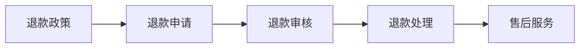

**解析：** 以上措施可以确保用户在遇到问题时能够得到及时解决，提高用户满意度。

### 21. 如何进行课程数据分析？

**题目：** 在一个知识付费的移动端APP中，如何进行课程数据分析？

**答案：** 进行课程数据分析可以从以下几个方面进行：

1. **数据收集：** 收集课程相关的数据，包括课程访问量、学习时长、用户评价等。
2. **数据分析：** 对收集到的数据进行分析，挖掘课程受欢迎程度、用户需求等。
3. **数据可视化：** 将分析结果以图表、报告等形式展示，帮助决策者了解课程表现。
4. **数据驱动决策：** 根据分析结果，调整课程内容、推荐策略等，提高课程质量。

**举例：**

```mermaid
flowchart LR
    A[数据收集] --> B[数据分析]
    B --> C[数据可视化]
    C --> D[数据驱动决策]
```

**解析：** 以上措施可以帮助决策者了解课程的表现，为课程优化提供依据。

### 22. 如何进行用户行为分析？

**题目：** 在一个知识付费的移动端APP中，如何进行用户行为分析？

**答案：** 进行用户行为分析可以从以下几个方面进行：

1. **数据收集：** 收集用户在APP中的行为数据，包括浏览、购买、评价等。
2. **数据分析：** 对收集到的数据进行分析，挖掘用户的行为模式、偏好等。
3. **用户画像：** 根据分析结果，构建用户画像，了解用户的特征和需求。
4. **个性化推荐：** 利用用户画像，为用户推荐个性化的课程内容。
5. **用户体验优化：** 根据用户行为分析结果，优化APP的用户体验。

**举例：**

```mermaid
flowchart LR
    A[数据收集] --> B[数据分析]
    B --> C[用户画像]
    C --> D[个性化推荐]
    D --> E[用户体验优化]
```

**解析：** 以上措施可以帮助了解用户的需求和行为，为APP的优化提供指导。

### 23. 如何保证课程教学质量的稳定性？

**题目：** 在一个知识付费的移动端APP中，如何保证课程教学质量的稳定性？

**答案：** 保证课程教学质量的稳定性可以从以下几个方面进行：

1. **讲师资质认证：** 对讲师进行严格的资质认证，确保讲师具备教学能力。
2. **课程内容审核：** 对课程内容进行审核，确保课程内容的科学性、实用性和时效性。
3. **教学培训：** 定期为讲师提供教学培训，提高讲师的教学水平。
4. **教学评估：** 对讲师的教学进行评估，根据评估结果对讲师进行奖励或惩罚。
5. **用户反馈：** 收集用户的反馈，根据用户反馈对课程进行改进。

**举例：**

```mermaid
flowchart LR
    A[讲师资质认证] --> B[课程内容审核]
    B --> C[教学培训]
    C --> D[教学评估]
    D --> E[用户反馈]
```

**解析：** 以上措施可以确保课程教学质量的稳定性，为用户提供高质量的学习体验。

### 24. 如何设计课程营销活动？

**题目：** 在一个知识付费的移动端APP中，如何设计课程营销活动？

**答案：** 设计课程营销活动可以从以下几个方面进行：

1. **活动策划：** 根据课程特点和用户需求，策划有针对性的营销活动。
2. **活动宣传：** 通过多种渠道宣传营销活动，提高活动知名度。
3. **优惠力度：** 设定合理的优惠力度，吸引用户参与活动。
4. **活动参与：** 设计简单易懂的参与方式，提高用户参与度。
5. **活动反馈：** 收集活动反馈，根据反馈对活动进行优化。

**举例：**

```mermaid
flowchart LR
    A[活动策划] --> B[活动宣传]
    B --> C[优惠力度]
    C --> D[活动参与]
    D --> E[活动反馈]
```

**解析：** 以上措施可以有效地提高课程的市场知名度，吸引更多用户参与课程学习。

### 25. 如何设计课程分销体系？

**题目：** 在一个知识付费的移动端APP中，如何设计课程分销体系？

**答案：** 设计课程分销体系可以从以下几个方面进行：

1. **分销策略：** 设定分销策略，明确分销规则和收益分配。
2. **分销渠道：** 选择合适的分销渠道，如社交媒体、自媒体平台等。
3. **分销奖励：** 设定分销奖励机制，激励分销员推广课程。
4. **分销管理：** 对分销员进行管理，监控分销员的行为和业绩。
5. **分销数据分析：** 对分销数据进行分析，优化分销策略。

**举例：**

```mermaid
flowchart LR
    A[分销策略] --> B[分销渠道]
    B --> C[分销奖励]
    C --> D[分销管理]
    D --> E[分销数据分析]
```

**解析：** 以上措施可以有效地拓展课程销售渠道，提高课程销售额。

### 26. 如何设计课程内容付费模式？

**题目：** 在一个知识付费的移动端APP中，如何设计课程内容付费模式？

**答案：** 设计课程内容付费模式可以从以下几个方面进行：

1. **课程定价：** 根据课程内容和市场行情，设定合理的课程定价。
2. **付费方式：** 提供多种付费方式，如单次购买、订阅、会员等。
3. **优惠活动：** 定期举办优惠活动，吸引更多用户购买课程。
4. **支付通道：** 与多个支付渠道合作，提供便捷的支付服务。
5. **用户权益：** 明确用户购买课程后的权益，如课程观看时长、下载权限等。

**举例：**

```mermaid
flowchart LR
    A[课程定价] --> B[付费方式]
    B --> C[优惠活动]
    C --> D[支付通道]
    D --> E[用户权益]
```

**解析：** 以上措施可以确保课程付费模式合理、用户接受度高，提高课程销售额。

### 27. 如何设计用户成长体系？

**题目：** 在一个知识付费的移动端APP中，如何设计用户成长体系？

**答案：** 设计用户成长体系可以从以下几个方面进行：

1. **成长目标：** 设定明确的成长目标，如学习时长、完成课程数量等。
2. **成长值积累：** 设定成长值积累规则，如学习时长、课程评价、购买课程等。
3. **成长值兑换：** 提供成长值兑换功能，如兑换课程、优惠券等。
4. **成长等级：** 根据成长值设定不同等级，用户达到不同等级可以享受不同的特权。
5. **成长激励：** 设定成长激励措施，如积分、奖励等，激励用户持续成长。

**举例：**

```mermaid
flowchart LR
    A[成长目标] --> B[成长值积累]
    B --> C[成长值兑换]
    C --> D[成长等级]
    D --> E[成长激励]
```

**解析：** 以上措施可以激励用户持续参与课程学习，提高用户粘性。

### 28. 如何设计用户社群运营？

**题目：** 在一个知识付费的移动端APP中，如何设计用户社群运营？

**答案：** 设计用户社群运营可以从以下几个方面进行：

1. **社群定位：** 确定社群的目标和定位，如学习交流、行业讨论等。
2. **社群内容：** 设计丰富的社群内容，如课程讨论、行业资讯、活动通知等。
3. **社群互动：** 创造互动机会，鼓励用户参与社群讨论和活动。
4. **社群管理：** 对社群进行管理，维护社群秩序，确保社群活跃度。
5. **社群活动：** 定期举办社群活动，如线上讲座、知识竞赛等，提高用户参与度。

**举例：**

```mermaid
flowchart LR
    A[社群定位] --> B[社群内容]
    B --> C[社群互动]
    C --> D[社群管理]
    D --> E[社群活动]
```

**解析：** 以上措施可以有效地提高用户粘性，增强用户对APP的归属感和忠诚度。

### 29. 如何进行课程效果评估？

**题目：** 在一个知识付费的移动端APP中，如何进行课程效果评估？

**答案：** 进行课程效果评估可以从以下几个方面进行：

1. **学习成果测试：** 对用户学习成果进行测试，如考试、作业等。
2. **用户反馈：** 收集用户对课程的评价和反馈，了解课程的质量和满意度。
3. **学习行为分析：** 对用户的学习行为进行分析，如学习时长、学习进度等。
4. **学习效果对比：** 将用户学习前后的成果进行对比，评估课程的实际效果。
5. **课程优化：** 根据评估结果，对课程进行优化和调整，提高课程质量。

**举例：**

```mermaid
flowchart LR
    A[学习成果测试] --> B[用户反馈]
    B --> C[学习行为分析]
    C --> D[学习效果对比]
    D --> E[课程优化]
```

**解析：** 以上措施可以全面了解课程效果，为课程优化提供依据。

### 30. 如何设计课程推广策略？

**题目：** 在一个知识付费的移动端APP中，如何设计课程推广策略？

**答案：** 设计课程推广策略可以从以下几个方面进行：

1. **内容推广：** 利用自媒体、短视频等渠道，发布课程相关内容，提高课程知名度。
2. **社交互动：** 通过社交媒体、社群等渠道，进行互动推广，吸引潜在用户。
3. **合作伙伴：** 与其他平台、机构等合作，共同推广课程，扩大影响力。
4. **活动营销：** 举办线上活动，如知识竞赛、讲座等，吸引用户参与。
5. **数据分析：** 对推广效果进行数据监测和分析，不断优化推广策略。

**举例：**

```mermaid
flowchart LR
    A[内容推广] --> B[社交互动]
    B --> C[合作伙伴]
    C --> D[活动营销]
    D --> E[数据分析]
```

**解析：** 以上措施可以有效地提高课程的市场知名度和用户参与度，促进课程销售。

