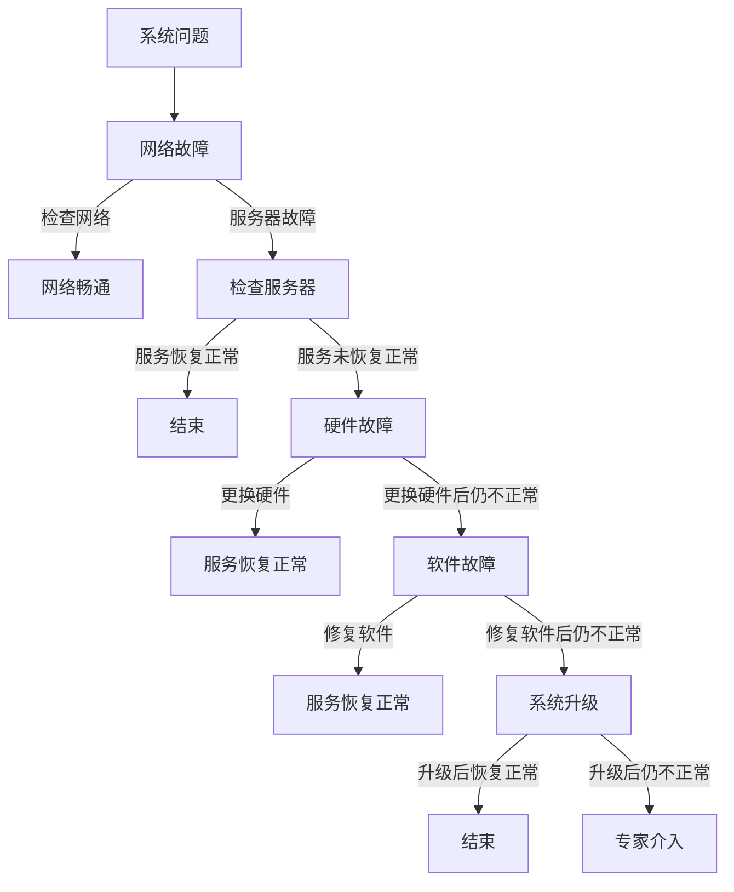

                 

### 自拟标题：系统思考与问题解决能力：深度剖析与实战技巧

### 1. 常见系统问题与解决方案

#### 题目1：如何识别和处理系统中的瓶颈？

**答案：** 瓶颈（Bottleneck）是系统中的限制因素，它决定了系统的最大处理能力。识别瓶颈的方法包括：

1. **统计分析**：分析系统的运行数据，查找处理时间最长、等待时间最长的环节。
2. **现场观察**：通过实地观察，直观判断哪个环节可能存在瓶颈。
3. **流程分析**：通过流程图分析，识别流程中的瓶颈环节。

解决方案：

1. **优化流程**：简化流程，减少不必要的步骤，提高效率。
2. **增加资源**：增加瓶颈环节的资源，如人力、设备等。
3. **分配负载**：合理分配任务，避免某个环节过度负担。

**举例代码：** 分析系统瓶颈的简单脚本：

```python
import csv

# 假设有一个处理任务的日志文件
log_file = 'system_log.csv'

# 读取日志文件
with open(log_file, 'r') as f:
    reader = csv.reader(f)
    logs = list(reader)

# 统计每个环节的处理时间和等待时间
处理时间总和 = 0
等待时间总和 = 0
环节计数器 = {}

for log in logs:
    task, time_spent, wait_time = log
    处理时间总和 += int(time_spent)
    等待时间总和 += int(wait_time)
    if task in 环节计数器：
        环节计数器[task] += 1
    else:
        环节计数器[task] = 1

# 输出统计结果
print("总处理时间：", 处理时间总和)
print("总等待时间：", 等待时间总和)
print("每个环节的任务数：", 环节计数器)
```

### 2. 问题解决方法与策略

#### 题目2：如何在复杂系统中进行问题定位和解决？

**答案：** 在复杂系统中，问题定位和解决通常需要以下步骤：

1. **定义问题**：明确问题的性质、影响范围和紧急程度。
2. **数据收集**：收集与问题相关的数据和指标。
3. **故障树分析**：建立故障树，识别所有可能的故障原因。
4. **根因分析**：通过故障树分析，找出最可能的原因。
5. **解决方案设计**：设计并实施解决方案。
6. **效果验证**：验证解决方案的有效性。

**举例：** 使用故障树分析定位系统问题：



**解析：** 通过故障树分析，可以系统地识别问题的可能原因，并逐步排除，从而找到解决方案。

### 3. 面试题与问题解决能力

#### 题目3：如何在面试中展示自己的系统思考与问题解决能力？

**答案：** 在面试中展示系统思考与问题解决能力，可以通过以下方法：

1. **用案例说话**：提供实际工作经验中的案例，展示自己解决问题的能力。
2. **逻辑清晰**：在回答问题时，确保逻辑清晰、条理分明。
3. **深入分析**：对问题进行深入分析，展示自己的思考深度。
4. **灵活应对**：面对不同类型的问题，展示自己的灵活性和适应性。

**举例：** 面试中解决问题的示例回答：

**面试官**：请描述一次你在工作中遇到的问题以及你是如何解决的。

**回答**：

```
在之前的工作中，我们团队遇到了系统响应时间过长的瓶颈问题。经过分析，我采取了以下步骤：

1. **定义问题**：明确了系统响应时间过长的具体表现和影响范围。
2. **数据收集**：收集了系统日志、用户反馈等数据，分析了系统瓶颈的具体位置。
3. **故障树分析**：建立了故障树，确定了可能的原因，包括网络延迟、数据库性能、代码优化等。
4. **根因分析**：通过数据分析和现场观察，确定了数据库性能是主要瓶颈。
5. **解决方案设计**：设计了数据库性能优化的方案，包括索引优化、查询优化、缓存使用等。
6. **效果验证**：实施优化后，系统响应时间显著缩短，用户满意度提高。

通过这次经历，我不仅解决了具体问题，还锻炼了系统思考与问题解决的能力。
```

**解析：** 通过具体的案例，清晰地展示了系统思考与问题解决的全过程，使面试官能够直观地了解应聘者的能力。

### 总结

系统思考与问题解决能力是现代社会中不可或缺的能力，无论是在工作中还是面试中，都是衡量个人综合素质的重要指标。通过深入分析典型问题、熟练运用问题解决策略，并结合实际工作经验，可以有效提升这一能力。希望本文能为您提供有价值的参考和启示。

