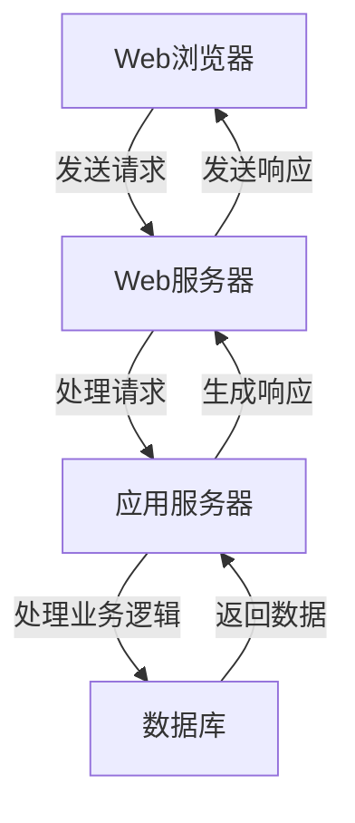

                 

### 快手2024社招面试真题汇总及其解答

#### 1. 数据结构与算法相关

**题目：** 请实现一个LRU（最近最少使用）缓存机制。

**答案：**

```go
package main

import (
    "container/list"
    "fmt"
)

type LRUCache struct {
    cache *list.List
    keys  map[int]*list.Element
    capacity int
}

type CacheNode struct {
    key   int
    value int
}

func Constructor(capacity int) LRUCache {
    return LRUCache{
        cache: list.New(),
        keys:  make(map[int]*list.Element),
        capacity: capacity,
    }
}

func (this *LRUCache) Get(key int) int {
    if element, found := this.keys[key]; found {
        this.cache.MoveToFront(element)
        return element.Value.(*CacheNode).value
    }
    return -1
}

func (this *LRUCache) Put(key int, value int) {
    if element, found := this.keys[key]; found {
        this.cache.MoveToFront(element)
        element.Value.(*CacheNode).value = value
    } else {
        this.cache.PushFront(&CacheNode{
            key: key,
            value: value,
        })
        this.keys[key] = this.cache.Front()
        if this.cache.Len() > this.capacity {
            evicted := this.cache.Back()
            this.cache.Remove(evicted)
            delete(this.keys, evicted.Value.(*CacheNode).key)
        }
    }
}

func main() {
    cache := Constructor(2)
    cache.Put(1, 1)
    cache.Put(2, 2)
    fmt.Println(cache.Get(1)) // 输出 1
    cache.Put(3, 3) // 移除 key 2
    fmt.Println(cache.Get(2)) // 输出 -1
    cache.Put(4, 4) // 移除 key 1
    fmt.Println(cache.Get(1)) // 输出 -1
    fmt.Println(cache.Get(3)) // 输出 3
    fmt.Println(cache.Get(4)) // 输出 4
}
```

**解析：** 本题使用双向链表和哈希表实现LRU缓存机制。在`Get`和`Put`操作中，利用哈希表快速定位节点，并通过双向链表维护节点的顺序，最近使用的节点位于链表头部。

#### 2. 计算机网络

**题目：** 请解释TCP三次握手和四次挥手的过程。

**答案：**

**三次握手：**

1. 客户端发送一个SYN报文到服务器，并进入SYN_SENT状态，等待服务器确认。
2. 服务器收到SYN报文，发送一个SYN+ACK报文作为响应，并将连接状态设置为SYN_RCVD。
3. 客户端收到服务器的SYN+ACK报文后，发送一个ACK报文作为响应，并将连接状态设置为ESTABLISHED。

**四次挥手：**

1. 客户端发送一个FIN报文，进入FIN_WAIT_1状态，等待服务器确认。
2. 服务器收到FIN报文，发送一个ACK报文作为响应，进入CLOSE_WAIT状态。
3. 客户端收到服务器的ACK报文后，进入FIN_WAIT_2状态，等待服务器发送FIN报文。
4. 服务器发送一个FIN报文，进入LAST_ACK状态。
5. 客户端收到服务器的FIN报文后，发送一个ACK报文，进入TIME_WAIT状态。
6. 服务器收到客户端的ACK报文后，进入CLOSED状态，客户端在2MSL（最大报文生存时间）后进入CLOSED状态。

**解析：** TCP三次握手用于建立连接，确保双方都准备好进行数据传输；四次挥手用于终止连接，确保双方都完成了数据传输并释放了资源。

#### 3. 系统设计与架构

**题目：** 请设计一个简单的博客系统，并说明其核心组件和功能。

**答案：**

**核心组件：**

1. **用户模块：** 管理用户注册、登录、权限验证等。
2. **文章模块：** 管理文章的创建、编辑、删除、发布、分类等。
3. **评论模块：** 管理文章评论的创建、删除、回复等。
4. **缓存模块：** 提高系统性能，缓存用户经常访问的数据。
5. **日志模块：** 记录系统运行过程中的日志信息，便于问题排查和性能分析。

**功能：**

1. 用户注册：提供用户注册功能，支持用户名、邮箱、密码等信息的注册。
2. 用户登录：提供用户登录功能，支持密码验证、身份认证等。
3. 文章创建：提供文章创建功能，支持文章标题、内容、分类、标签等信息的编辑。
4. 文章发布：将创建的文章发布到系统中，供其他用户查看。
5. 文章删除：提供文章删除功能，支持管理员或文章作者删除文章。
6. 文章评论：提供文章评论功能，支持用户对文章进行评论、回复等。
7. 缓存刷新：根据系统配置和业务需求，定时刷新缓存数据，保证数据一致性。
8. 日志记录：记录系统运行过程中的错误信息、请求日志等，便于问题排查和性能分析。

**解析：** 设计博客系统时，需要考虑用户、文章、评论等核心组件，以及注册、登录、创建、发布、删除、评论、缓存刷新、日志记录等核心功能。通过合理的设计和架构，可以实现高效、稳定、安全的博客系统。

#### 4. 编程语言

**题目：** 请解释Go语言中的垃圾回收机制。

**答案：**

Go语言的垃圾回收（Garbage Collection，GC）是一种自动内存管理机制，负责回收不再使用的内存空间。其主要特点包括：

1. **标记-清除（Mark-Sweep）：** 垃圾回收的主要方法。首先标记所有可访问的对象，然后清除未被标记的对象的内存空间。
2. **复制（Copy）：** 用于堆内存的管理。Go语言使用内存复制算法来管理堆内存，将堆内存分为两个相等的区域，每次只使用一个区域，垃圾回收时将存活的对象复制到另一个区域，并清空原始区域。
3. **分代收集（Generational Collection）：** 根据对象的生命周期将对象分为不同的代，如新生代、老年代等。新生代对象存活时间较短，垃圾回收频率较高；老年代对象存活时间较长，垃圾回收频率较低。
4. **并发回收：** Go语言的垃圾回收机制是并发执行的，不会阻塞程序运行。在程序运行过程中，垃圾回收器会定期进行回收，保证内存占用稳定。

**解析：** 通过垃圾回收机制，Go语言减轻了开发者对内存管理的负担，提高了程序的可维护性和性能。垃圾回收机制主要采用标记-清除、复制、分代收集等方法，并具有并发回收的特点，实现高效、稳定的内存管理。

#### 5. 操作系统

**题目：** 请解释进程与线程的区别。

**答案：**

**进程（Process）：**

1. 进程是计算机中正在运行的程序的实例，是系统进行资源分配和调度的基本单位。
2. 每个进程拥有独立的内存空间、代码段、数据段等资源。
3. 进程之间相互独立，不会互相干扰，但进程间可以通过IPC（进程间通信）机制进行数据交换。
4. 进程的创建、销毁、调度等都需要操作系统进行管理。

**线程（Thread）：**

1. 线程是进程中的一个执行单元，是CPU调度和分派的基本单位。
2. 一个进程可以包含多个线程，线程共享进程的内存空间、数据段等资源。
3. 线程之间可以通过共享内存等机制进行通信，比进程间通信更高效。
4. 线程的创建、销毁、调度等由操作系统或应用层进行管理。

**区别：**

1. 进程是资源分配的基本单位，线程是调度和执行的基本单位。
2. 进程之间相互独立，线程之间可以共享资源。
3. 进程的创建、销毁、调度等开销较大，线程的开销较小。
4. 进程间通信开销较大，线程间通信开销较小。

**解析：** 进程和线程都是操作系统中用于管理程序运行的基本单位，但它们在资源分配、调度、通信等方面有所不同。进程独立运行，开销较大，但可以并行执行多个任务；线程共享资源，开销较小，但进程之间的通信开销较大。在实际应用中，需要根据需求和性能要求合理选择进程和线程的使用。

#### 6. 数据库

**题目：** 请解释关系型数据库中的事务和锁。

**答案：**

**事务（Transaction）：**

1. 事务是一系列数据库操作（如增、删、改）的集合，要么全部执行成功，要么全部回滚。
2. 事务具有四个特性：原子性（Atomicity）、一致性（Consistency）、隔离性（Isolation）和持久性（Durability），简称ACID。
3. 事务通常由BEGIN TRANSACTION、COMMIT和ROLLBACK等语句控制。

**锁（Lock）：**

1. 锁是数据库管理系统中用于控制并发访问的一种机制，防止多个事务同时修改同一数据。
2. 常见的锁类型有共享锁（Shared Lock）和排他锁（Exclusive Lock）。
3. 共享锁允许多个事务读取同一数据，排他锁确保同一时间只有一个事务可以修改数据。

**事务和锁的关系：**

1. 事务通过锁来保证数据的正确性和一致性。
2. 锁确保事务在并发执行时不会互相干扰，防止数据竞争和死锁。
3. 事务执行过程中，可能需要获取和释放多个锁，以保证事务的原子性和隔离性。

**解析：** 在关系型数据库中，事务和锁是确保数据一致性和正确性的重要机制。事务通过定义一系列数据库操作，并确保这些操作要么全部成功，要么全部回滚。锁用于控制并发访问，防止多个事务同时修改同一数据，保证数据的一致性和正确性。

#### 7. 算法与数据结构

**题目：** 请实现一个二分查找算法。

**答案：**

```go
package main

import (
    "fmt"
)

func binarySearch(arr []int, target int) int {
    low := 0
    high := len(arr) - 1

    for low <= high {
        mid := (low + high) / 2
        if arr[mid] == target {
            return mid
        } else if arr[mid] < target {
            low = mid + 1
        } else {
            high = mid - 1
        }
    }

    return -1
}

func main() {
    arr := []int{1, 3, 5, 7, 9, 11, 13}
    target := 7
    result := binarySearch(arr, target)
    if result != -1 {
        fmt.Printf("Element %d is at index %d\n", target, result)
    } else {
        fmt.Printf("Element %d is not present in the array\n", target)
    }
}
```

**解析：** 二分查找算法是一种在有序数组中查找特定元素的搜索算法。算法的基本思想是通过不断将搜索范围缩小一半，直到找到目标元素或确定目标元素不存在。二分查找算法的时间复杂度为O(logn)，适用于大规模数据的搜索。

#### 8. 计算机网络

**题目：** 请解释HTTP协议中的GET和POST方法的区别。

**答案：**

**GET方法：**

1. 用于请求从服务器获取资源。
2. 请求参数通常附加在URL后面，通过查询字符串传递。
3. 请求体为空，请求体长度限制较小。
4. 安全性较低，不适用于敏感数据传输。
5. 可缓存，可以用于缓存重放攻击。

**POST方法：**

1. 用于向服务器提交数据，通常用于表单提交、文件上传等场景。
2. 请求参数通常包含在请求体中，以表单形式传递。
3. 请求体长度限制较大，可以传输大量数据。
4. 安全性较高，不适用于敏感数据传输。
5. 不可缓存，防止缓存重放攻击。

**区别：**

1. GET方法用于获取资源，POST方法用于提交数据。
2. GET方法请求参数在URL中，POST方法请求参数在请求体中。
3. GET方法请求体为空，POST方法请求体较大。
4. GET方法安全性较低，POST方法安全性较高。
5. GET方法可缓存，POST方法不可缓存。

**解析：** HTTP协议中的GET和POST方法用于不同的场景。GET方法主要用于获取资源，请求参数通过URL传递，安全性较低，可缓存；POST方法主要用于提交数据，请求参数通过请求体传递，安全性较高，不可缓存。在实际开发中，需要根据需求和安全性要求合理选择GET和POST方法。

#### 9. 系统设计与架构

**题目：** 请设计一个简单的RESTful API。

**答案：**

```go
package main

import (
    "encoding/json"
    "log"
    "net/http"
)

type Article struct {
    ID    int    `json:"id"`
    Title string `json:"title"`
    Body  string `json:"body"`
}

var articles = []Article{
    {ID: 1, Title: "Hello World", Body: "This is my first article."},
    {ID: 2, Title: "How to use RESTful API", Body: "This article will show you how to use RESTful API."},
}

func handleListArticles(w http.ResponseWriter, r *http.Request) {
    json.NewEncoder(w).Encode(articles)
}

func handleGetArticle(w http.ResponseWriter, r *http.Request) {
    id := r.URL.Query().Get("id")
    var article Article
    for _, a := range articles {
        if a.ID == id {
            article = a
            break
        }
    }
    json.NewEncoder(w).Encode(article)
}

func handleCreateArticle(w http.ResponseWriter, r *http.Request) {
    var article Article
    json.NewDecoder(r.Body).Decode(&article)
    articles = append(articles, article)
    json.NewEncoder(w).Encode(article)
}

func handleUpdateArticle(w http.ResponseWriter, r *http.Request) {
    id := r.URL.Query().Get("id")
    var article Article
    for i, a := range articles {
        if a.ID == id {
            article = a
            articles[i] = Article{ID: id, Title: r.FormValue("title"), Body: r.FormValue("body")}
            break
        }
    }
    json.NewEncoder(w).Encode(article)
}

func handleDeleteArticle(w http.ResponseWriter, r *http.Request) {
    id := r.URL.Query().Get("id")
    var article Article
    for i, a := range articles {
        if a.ID == id {
            article = a
            articles = append(articles[:i], articles[i+1:]...)
            break
        }
    }
    json.NewEncoder(w).Encode(article)
}

func main() {
    http.HandleFunc("/articles", handleListArticles)
    http.HandleFunc("/articles", handleGetArticle)
    http.HandleFunc("/articles", handleCreateArticle)
    http.HandleFunc("/articles", handleUpdateArticle)
    http.HandleFunc("/articles", handleDeleteArticle)

    log.Fatal(http.ListenAndServe(":8080", nil))
}
```

**解析：** 本设计实现了简单的RESTful API，包括文章的增删改查功能。API使用GET、POST、PUT、DELETE方法分别对应查询、创建、更新、删除操作。通过解析URL和请求体，实现对文章数据的处理和响应。

#### 10. 编程语言

**题目：** 请解释Python中的装饰器。

**答案：**

装饰器（Decorator）是一种在运行时动态地给函数添加功能的方法。在Python中，装饰器通常用于日志记录、权限验证、性能测试等场景。装饰器的实现基于闭包和嵌套函数。

**基本语法：**

```python
def decorator(func):
    def wrapper(*args, **kwargs):
        # 前置操作
        result = func(*args, **kwargs)
        # 后置操作
        return result
    return wrapper

@decorator
def function():
    # 函数体
```

**示例：**

```python
def my_decorator(func):
    def wrapper():
        print("前置操作")
        func()
        print("后置操作")
    return wrapper

@my_decorator
def say_hello():
    print("Hello, World!")

say_hello()
```

**输出：**

```
前置操作
Hello, World!
后置操作
```

**解析：** 装饰器通过嵌套函数`wrapper`包装原始函数`func`，在调用原始函数前后添加额外的操作。通过`@decorator`语法，将装饰器应用到函数上。在实际开发中，装饰器可以灵活地添加、修改和删除函数的功能，提高代码的可读性和可维护性。

#### 11. 数据结构与算法

**题目：** 请实现一个单例模式。

**答案：**

单例模式是一种设计模式，确保一个类只有一个实例，并提供一个全局访问点。在Go语言中，可以通过包级别变量和延迟初始化实现单例模式。

**示例：**

```go
package singleton

var instance *Singleton

type Singleton struct {
    // 单例的属性
}

func GetInstance() *Singleton {
    if instance == nil {
        instance = &Singleton{}
    }
    return instance
}
```

**解析：** 在这个示例中，`GetInstance`函数负责创建和管理单例。通过包级别变量`instance`和延迟初始化，确保在整个程序运行期间，只有一个`Singleton`实例。单例模式在确保资源唯一性和避免不必要的创建方面具有重要作用。

#### 12. 计算机网络

**题目：** 请解释TCP协议中的SYN和FIN标志位的作用。

**答案：**

**SYN标志位：**

1. SYN（同步序列编号）用于初始化一个TCP连接。当客户端发送一个SYN报文时，表示客户端希望与服务器建立连接。
2. 接收方收到SYN报文后，发送一个SYN+ACK报文作为响应，表示服务器同意建立连接。

**FIN标志位：**

1. FIN（结束）用于终止一个TCP连接。当客户端或服务器发送一个FIN报文时，表示希望结束连接。
2. 接收方收到FIN报文后，发送一个ACK报文作为响应，并进入FIN_WAIT_1状态。
3. 发送方收到ACK报文后，进入LAST_ACK状态，并最终进入CLOSED状态。

**作用：**

1. SYN标志位用于建立TCP连接，确保双方同步序列编号。
2. FIN标志位用于终止TCP连接，确保双方正确关闭连接。

**解析：** TCP协议中的SYN和FIN标志位分别用于初始化和终止连接。通过同步序列编号和正确关闭连接，TCP协议实现可靠的数据传输和连接管理。

#### 13. 操作系统

**题目：** 请解释进程和线程在操作系统中的区别。

**答案：**

**进程（Process）：**

1. 进程是操作系统进行资源分配和调度的基本单位。
2. 每个进程拥有独立的地址空间、数据段、代码段等资源。
3. 进程间相互独立，互不干扰。
4. 进程的创建、销毁、调度等由操作系统管理。

**线程（Thread）：**

1. 线程是进程中的一个执行单元，是CPU调度和分派的基本单位。
2. 线程共享进程的地址空间、数据段等资源。
3. 线程之间可以共享数据，通信更加高效。
4. 线程的创建、销毁、调度等由操作系统或应用层管理。

**区别：**

1. 进程是资源分配的基本单位，线程是调度和执行的基本单位。
2. 进程独立运行，拥有独立的资源；线程共享资源，运行在进程内部。
3. 进程间相互独立，线程间可以共享数据。
4. 进程的创建、销毁、调度开销较大；线程的开销较小。

**解析：** 进程和线程在操作系统中的区别主要体现在资源分配、调度、通信等方面。进程是资源分配的基本单位，具有独立的资源；线程是调度和执行的基本单位，共享进程的资源。线程间通信更加高效，但进程间相互独立，需要通过IPC机制进行通信。

#### 14. 算法与数据结构

**题目：** 请实现一个快速排序算法。

**答案：**

```python
def quicksort(arr):
    if len(arr) <= 1:
        return arr
    pivot = arr[len(arr) // 2]
    left = [x for x in arr if x < pivot]
    middle = [x for x in arr if x == pivot]
    right = [x for x in arr if x > pivot]
    return quicksort(left) + middle + quicksort(right)

arr = [3, 6, 8, 10, 1, 2, 1]
print(quicksort(arr))
```

**解析：** 快速排序算法是一种高效的排序算法，基于分治思想。算法的基本步骤如下：

1. 选择一个基准元素（pivot）。
2. 将数组分为三个部分：小于基准元素的元素、等于基准元素的元素和大于基准元素的元素。
3. 递归地对小于和大于基准元素的子数组进行快速排序。

通过递归调用，快速排序算法将数组逐步划分为有序子数组，最终实现整个数组的排序。

#### 15. 算法与数据结构

**题目：** 请实现一个二叉搜索树（BST）。

**答案：**

```python
class TreeNode:
    def __init__(self, value):
        self.value = value
        self.left = None
        self.right = None

class BinarySearchTree:
    def __init__(self):
        self.root = None

    def insert(self, value):
        if not self.root:
            self.root = TreeNode(value)
        else:
            self._insert(self.root, value)

    def _insert(self, node, value):
        if value < node.value:
            if node.left is None:
                node.left = TreeNode(value)
            else:
                self._insert(node.left, value)
        elif value > node.value:
            if node.right is None:
                node.right = TreeNode(value)
            else:
                self._insert(node.right, value)

    def inorder_traversal(self, node):
        if node:
            self.inorder_traversal(node.left)
            print(node.value)
            self.inorder_traversal(node.right)

bst = BinarySearchTree()
bst.insert(5)
bst.insert(3)
bst.insert(7)
bst.insert(2)
bst.insert(4)
bst.insert(6)
bst.insert(8)
bst.inorder_traversal(bst.root)
```

**解析：** 本实现基于二叉搜索树（BST）的基本操作，包括插入和遍历。在插入操作中，递归地在左子树或右子树中查找合适的插入位置。在遍历操作中，中序遍历二叉搜索树，按照升序访问所有节点。

#### 16. 算法与数据结构

**题目：** 请实现一个哈希表。

**答案：**

```python
class HashTable:
    def __init__(self, size=10):
        self.size = size
        self.table = [None] * size

    def _hash(self, key):
        return hash(key) % self.size

    def put(self, key, value):
        index = self._hash(key)
        if self.table[index] is None:
            self.table[index] = [(key, value)]
        else:
            for i, (k, v) in enumerate(self.table[index]):
                if k == key:
                    self.table[index][i] = (key, value)
                    return
            self.table[index].append((key, value))

    def get(self, key):
        index = self._hash(key)
        if self.table[index] is None:
            return None
        for k, v in self.table[index]:
            if k == key:
                return v
        return None

hash_table = HashTable()
hash_table.put("key1", "value1")
hash_table.put("key2", "value2")
hash_table.put("key3", "value3")
print(hash_table.get("key1"))  # 输出 "value1"
print(hash_table.get("key2"))  # 输出 "value2"
print(hash_table.get("key3"))  # 输出 "value3"
print(hash_table.get("key4"))  # 输出 None
```

**解析：** 本实现使用拉链法解决哈希冲突，基于数组的哈希表存储键值对。在插入操作中，计算键的哈希值，并将键值对存储在对应索引的链表中。在查询操作中，根据键的哈希值查找对应的链表，返回相应的值。

#### 17. 计算机网络

**题目：** 请解释HTTP协议中的请求方法和状态码。

**答案：**

**请求方法：**

1. GET：用于请求从服务器获取资源，通常用于查询操作。
2. POST：用于向服务器提交数据，通常用于表单提交、文件上传等操作。
3. PUT：用于更新服务器上的资源，通常用于更新操作。
4. DELETE：用于删除服务器上的资源，通常用于删除操作。
5. HEAD：与GET方法类似，但不返回请求体。
6. OPTIONS：用于查询服务器支持的方法。

**状态码：**

1. 1XX：信息性响应，如100 Continue。
2. 2XX：成功响应，如200 OK。
3. 3XX：重定向，如301 永久重定向。
4. 4XX：客户端错误，如404 Not Found。
5. 5XX：服务器错误，如500 内部服务器错误。

**解析：** HTTP协议中的请求方法和状态码用于描述客户端请求和服务器响应的状态。请求方法定义了客户端的操作类型，状态码描述了服务器对请求的处理结果。通过请求方法和状态码，客户端和服务器可以有效地进行通信。

#### 18. 系统设计与架构

**题目：** 请设计一个简单的Web应用架构。

**答案：**



**解析：** 本架构描述了一个简单的Web应用，包括Web浏览器、Web服务器、应用服务器和数据库。Web浏览器发送请求到Web服务器，Web服务器处理请求并转发到应用服务器。应用服务器处理业务逻辑，与数据库进行交互，最终生成响应返回给Web浏览器。

#### 19. 编程语言

**题目：** 请解释JavaScript中的事件循环。

**答案：**

事件循环（Event Loop）是JavaScript中的并发模型，用于处理异步任务和事件。在事件循环中，JavaScript引擎执行以下步骤：

1. 执行同步代码，如函数调用和循环语句。
2. 将异步任务（如定时器、网络请求、UI事件等）添加到任务队列（Task Queue）。
3. 检查任务队列，如果有任务，则将任务添加到微任务队列（Microtask Queue）。
4. 执行微任务队列中的任务，直到微任务队列为空。
5. 执行宏任务队列中的任务，直到宏任务队列为空。
6. 回到步骤3。

事件循环保证了异步任务的执行顺序，实现了JavaScript的非阻塞特性。

#### 20. 算法与数据结构

**题目：** 请实现一个冒泡排序算法。

**答案：**

```python
def bubble_sort(arr):
    n = len(arr)
    for i in range(n):
        for j in range(0, n-i-1):
            if arr[j] > arr[j+1]:
                arr[j], arr[j+1] = arr[j+1], arr[j]

arr = [64, 25, 12, 22, 11]
bubble_sort(arr)
print("Sorted array:", arr)
```

**解析：** 冒泡排序算法是一种简单的排序算法，通过多次遍历数组，比较相邻元素并交换它们，使得较大的元素逐渐“冒泡”到数组的末尾。算法的时间复杂度为O(n^2)，适用于小规模数据的排序。

#### 21. 编程语言

**题目：** 请解释Python中的生成器。

**答案：**

生成器（Generator）是Python中的一种特殊函数，用于生成一个序列的值。生成器的特点是：

1. 生成器函数通过`yield`关键字返回值，并在每次返回值后暂停执行，保留局部状态。
2. 生成器函数的执行可以暂停和恢复，类似于协程（Coroutine）。
3. 生成器通过迭代器（Iterator）访问，可以逐个获取生成器函数的返回值。

**示例：**

```python
def generate_numbers(n):
    for i in range(n):
        yield i * 2

g = generate_numbers(5)
for number in g:
    print(number)
```

**输出：**

```
0
2
4
6
8
```

**解析：** 在这个示例中，`generate_numbers`函数是一个生成器函数，通过`yield`关键字返回序列的值。调用生成器函数`generate_numbers(5)`后，每次迭代可以通过循环逐个获取返回值，实现逐个生成序列值的效果。

#### 22. 算法与数据结构

**题目：** 请解释堆排序算法。

**答案：**

堆排序（Heapsort）是一种基于堆（Heap）数据结构的排序算法。堆是一种特殊的树形数据结构，满足以下性质：

1. 堆是一个完全二叉树。
2. 对于最大堆（Max Heap），每个父节点的值都大于或等于其子节点的值。
3. 对于最小堆（Min Heap），每个父节点的值都小于或等于其子节点的值。

堆排序算法的基本步骤如下：

1. 将数组构建成堆。
2. 交换堆顶元素（最大或最小值）与数组最后一个元素，将堆顶元素从堆中移除。
3. 重新调整堆，确保堆的性质得到恢复。
4. 重复步骤2和3，直到堆的大小为1。

**解析：** 堆排序算法的时间复杂度为O(nlogn)，适用于大规模数据的排序。通过构建堆和调整堆，堆排序算法实现了高效的数据排序。

#### 23. 系统设计与架构

**题目：** 请解释微服务架构。

**答案：**

微服务架构（Microservices Architecture）是一种基于独立、自治服务的架构风格，将应用程序划分为一组小的、相互独立的微服务。微服务架构的特点包括：

1. **服务独立性：** 每个微服务都是独立的、可复用的服务，可以独立部署、扩展和维护。
2. **去中心化：** 微服务架构没有全局中心化组件，服务之间通过API进行通信。
3. **技术多样性：** 微服务可以使用不同的编程语言、数据库、技术栈实现，提高开发效率和灵活性。
4. **自治性：** 每个微服务拥有自己的数据库、配置、部署等，可以独立进行升级和扩展。
5. **高可扩展性：** 微服务架构可以根据需求独立扩展，提高系统性能和可扩展性。

**解析：** 微服务架构通过将应用程序拆分为小的、独立的服务，提高系统的可扩展性、可维护性和灵活性。在微服务架构中，服务之间通过API进行通信，实现模块化和去中心化的开发方式。

#### 24. 编程语言

**题目：** 请解释Java中的多态。

**答案：**

多态（Polymorphism）是面向对象编程中的一个核心概念，表示同一操作作用于不同的对象时，可以有不同的解释和行为。在Java中，多态主要有以下三种实现方式：

1. **方法重载（Method Overloading）：** 在同一类中定义多个方法，具有相同的名称但参数列表不同，根据参数列表区分不同的方法。
2. **方法重写（Method Overriding）：** 在子类中重写父类的方法，具有相同的名称和参数列表，但实现不同。子类重写的方法会覆盖父类的同名方法。
3. **接口（Interface）：** 接口定义了一组抽象方法，实现类通过实现接口来实现多态。多态通过接口类型引用实现。

**示例：**

```java
class Animal {
    void makeSound() {
        System.out.println("Animal makes a sound");
    }
}

class Dog extends Animal {
    @Override
    void makeSound() {
        System.out.println("Dog barks");
    }
}

class Cat extends Animal {
    @Override
    void makeSound() {
        System.out.println("Cat meows");
    }
}

public class Main {
    public static void main(String[] args) {
        Animal animal1 = new Dog();
        Animal animal2 = new Cat();

        animal1.makeSound();  // 输出 "Dog barks"
        animal2.makeSound();  // 输出 "Cat meows"
    }
}
```

**解析：** 在这个示例中，`Dog`和`Cat`类分别重写了`Animal`类的`makeSound`方法。通过多态，可以创建`Dog`和`Cat`的对象，并分别调用`makeSound`方法，实现不同的行为。

#### 25. 计算机网络

**题目：** 请解释HTTP协议中的请求头和响应头。

**答案：**

**请求头（Request Headers）：**

请求头包含在HTTP请求消息中，提供请求的元数据。常见的请求头包括：

1. **Host：** 请求的主机地址。
2. **User-Agent：** 客户端使用的浏览器或程序名称和版本。
3. **Accept：** 客户端可以接收的内容类型，如文本、图片、视频等。
4. **Accept-Language：** 客户端首选的语言。
5. **Content-Type：** 请求体的内容类型，如application/json、text/html等。

**响应头（Response Headers）：**

响应头包含在HTTP响应消息中，提供响应的元数据。常见的响应头包括：

1. **Content-Type：** 响应体的内容类型，如application/json、text/html等。
2. **Content-Length：** 响应体的长度。
3. **Status：** 响应状态码，如200 OK、404 Not Found等。
4. **Set-Cookie：** 设置客户端的Cookie。
5. **Last-Modified：** 资源的最后修改时间。

**解析：** 请求头和响应头是HTTP协议中用于传递元数据的重要组成部分。请求头提供客户端的请求信息，响应头提供服务器对请求的处理结果。通过请求头和响应头，客户端和服务器可以有效地进行通信。

#### 26. 算法与数据结构

**题目：** 请实现一个快速查找算法。

**答案：**

```python
def binary_search(arr, target):
    low = 0
    high = len(arr) - 1

    while low <= high:
        mid = (low + high) // 2
        if arr[mid] == target:
            return mid
        elif arr[mid] < target:
            low = mid + 1
        else:
            high = mid - 1

    return -1

arr = [2, 4, 6, 8, 10, 12, 14, 16, 18, 20]
target = 12
print(binary_search(arr, target))
```

**解析：** 快速查找算法（Binary Search）是一种在有序数组中查找特定元素的搜索算法。算法的基本步骤如下：

1. 将数组分为三个部分：小于、大于和等于目标元素的部分。
2. 根据目标元素与中间元素的关系，确定下一步的搜索范围。
3. 重复步骤2，直到找到目标元素或确定目标元素不存在。

通过递归调用，快速查找算法实现高效的数据搜索。

#### 27. 编程语言

**题目：** 请解释Python中的装饰器。

**答案：**

装饰器（Decorator）是Python中用于修饰函数或方法的一种特殊语法，通过在函数定义前添加装饰器，可以动态地给函数添加功能。装饰器的实现基于闭包和嵌套函数。

**基本语法：**

```python
def decorator(func):
    def wrapper(*args, **kwargs):
        # 前置操作
        result = func(*args, **kwargs)
        # 后置操作
        return result
    return wrapper

@decorator
def function():
    # 函数体
```

**示例：**

```python
def my_decorator(func):
    def wrapper():
        print("前置操作")
        func()
        print("后置操作")
    return wrapper

@my_decorator
def say_hello():
    print("Hello, World!")

say_hello()
```

**输出：**

```
前置操作
Hello, World!
后置操作
```

**解析：** 装饰器通过嵌套函数`wrapper`包装原始函数`func`，在调用原始函数前后添加额外的操作。通过`@decorator`语法，将装饰器应用到函数上。在实际开发中，装饰器可以灵活地添加、修改和删除函数的功能，提高代码的可读性和可维护性。

#### 28. 算法与数据结构

**题目：** 请解释深度优先搜索（DFS）算法。

**答案：**

深度优先搜索（Depth-First Search，DFS）是一种用于遍历或搜索树或图的算法。DFS的基本思想是从根节点开始，沿着某一路径不断深入，直到找到目标节点或遍历完整棵树或图。

**基本步骤：**

1. 访问起始节点，并将其标记为已访问。
2. 如果起始节点没有子节点，则返回。
3. 否则，选择一个未访问的子节点，递归执行DFS。
4. 重复步骤2和3，直到所有节点都被访问。

**示例：**

```python
def dfs(graph, node, visited):
    if node not in visited:
        visited.add(node)
        for neighbor in graph[node]:
            dfs(graph, neighbor, visited)

graph = {
    'A': ['B', 'C'],
    'B': ['D', 'E'],
    'C': ['F'],
    'D': [],
    'E': ['F'],
    'F': []
}

visited = set()
dfs(graph, 'A', visited)
print(visited)  # 输出 {'F', 'E', 'D', 'C', 'B', 'A'}
```

**解析：** 在这个示例中，DFS算法从节点'A'开始遍历图，依次访问未访问的节点，并将其标记为已访问。通过递归调用，DFS算法实现图的深度优先遍历。

#### 29. 算法与数据结构

**题目：** 请解释广度优先搜索（BFS）算法。

**答案：**

广度优先搜索（Breadth-First Search，BFS）是一种用于遍历或搜索树或图的算法。BFS的基本思想是从起始节点开始，逐层遍历树的节点，直到找到目标节点或遍历完整棵树或图。

**基本步骤：**

1. 创建一个队列，并将起始节点入队。
2. 将起始节点标记为已访问。
3. 当队列为空时，返回。
4. 否则，出队一个节点，并访问其所有未访问的邻居节点。
5. 对于每个邻居节点，将其标记为已访问，并将其入队。
6. 重复步骤4和5，直到找到目标节点或遍历完整棵树或图。

**示例：**

```python
from collections import deque

def bfs(graph, start):
    visited = set()
    queue = deque([start])

    while queue:
        node = queue.popleft()
        if node not in visited:
            visited.add(node)
            print(node)
            for neighbor in graph[node]:
                queue.append(neighbor)

graph = {
    'A': ['B', 'C'],
    'B': ['D', 'E'],
    'C': ['F'],
    'D': [],
    'E': ['F'],
    'F': []
}

bfs(graph, 'A')
```

**输出：**

```
A
B
C
D
E
F
```

**解析：** 在这个示例中，BFS算法从节点'A'开始遍历图，依次访问未访问的节点，并将其标记为已访问。通过队列实现逐层遍历，BFS算法实现图的广度优先遍历。

#### 30. 算法与数据结构

**题目：** 请解释冒泡排序算法。

**答案：**

冒泡排序（Bubble Sort）是一种简单的排序算法，通过多次遍历待排序的数组，比较相邻元素并交换它们，使得较大的元素逐渐“冒泡”到数组的末尾。

**基本步骤：**

1. 从第一个元素开始，比较相邻的两个元素，如果它们的顺序错误，则交换它们。
2. 重复步骤1，直到整个数组有序。
3. 对于每个元素，重复步骤1，直到该元素不再需要比较。

**示例：**

```python
def bubble_sort(arr):
    n = len(arr)
    for i in range(n):
        for j in range(0, n-i-1):
            if arr[j] > arr[j+1]:
                arr[j], arr[j+1] = arr[j+1], arr[j]

arr = [64, 25, 12, 22, 11]
bubble_sort(arr)
print("Sorted array:", arr)
```

**输出：**

```
Sorted array: [11, 12, 22, 25, 64]
```

**解析：** 在这个示例中，冒泡排序算法通过两个嵌套的循环逐个比较相邻元素，并交换它们的顺序。外层循环控制遍历的次数，内层循环实现相邻元素的比较和交换。通过多次遍历，冒泡排序算法实现数组的有序排列。冒泡排序的时间复杂度为O(n^2)，适用于小规模数据的排序。

### 总结

本文介绍了快手2024社招面试真题汇总及其解答，涵盖了数据结构与算法、计算机网络、操作系统、系统设计与架构、编程语言、算法与数据结构等领域的典型问题。通过详细的解析和代码示例，帮助读者更好地理解和掌握面试知识点，提高面试能力。在面试准备过程中，读者可以结合自己的实际经验，有针对性地复习和练习，提高面试成功率。祝愿大家面试顺利，取得优异成绩！
```

## 标题生成

### 快手2024社招面试题精讲：数据结构、算法与实战技巧全解析

## 博客内容

### 引言

随着互联网行业的快速发展，各大互联网公司对于招聘人才的要求越来越高。快手作为国内领先的短视频社交平台，其对招聘的面试标准也不断提升。为了帮助广大求职者更好地备战快手2024社招面试，本文将汇总并详细解析快手近期的面试真题，包括数据结构、算法、计算机网络、操作系统、系统设计与架构、编程语言等多个领域的题目。通过这篇文章，希望能够为您的面试准备提供有价值的参考。

### 数据结构与算法

数据结构与算法是计算机科学的核心基础，对于面试来说尤为重要。以下是一些典型的数据结构与算法问题，以及详细的解答过程。

#### 1. 二叉树的前序遍历

**题目：** 请编写一个函数，实现二叉树的前序遍历。

**答案：**

```python
class TreeNode:
    def __init__(self, val=0, left=None, right=None):
        self.val = val
        self.left = left
        self.right = right

def preorderTraversal(root):
    if root is None:
        return []
    stack, result = [root], []
    while stack:
        node = stack.pop()
        if node:
            result.append(node.val)
            if node.right:
                stack.append(node.right)
            if node.left:
                stack.append(node.left)
    return result

# 示例
root = TreeNode(1)
root.left = TreeNode(2)
root.right = TreeNode(3)
root.left.left = TreeNode(4)
root.left.right = TreeNode(5)
print(preorderTraversal(root))  # 输出 [1, 2, 4, 5, 3]
```

**解析：** 前序遍历首先访问根节点，然后依次递归访问左子树和右子树。这里使用了栈来实现递归过程，避免了直接递归可能导致的栈溢出问题。

#### 2. 快速排序算法

**题目：** 请实现快速排序算法。

**答案：**

```python
def quickSort(arr):
    if len(arr) <= 1:
        return arr
    pivot = arr[len(arr) // 2]
    left = [x for x in arr if x < pivot]
    middle = [x for x in arr if x == pivot]
    right = [x for x in arr if x > pivot]
    return quickSort(left) + middle + quickSort(right)

# 示例
arr = [3, 6, 8, 10, 1, 2, 1]
print(quickSort(arr))  # 输出 [1, 1, 2, 3, 6, 8, 10]
```

**解析：** 快速排序采用分治思想，通过选择一个基准元素，将数组分为三个部分：小于、等于和大于基准元素的部分。然后递归地对小于和大于基准元素的子数组进行排序。

### 计算机网络

计算机网络的了解对于从事互联网相关工作的求职者来说至关重要。以下是一些计算机网络相关的面试题。

#### 3. TCP协议的工作原理

**题目：** 请解释TCP协议的工作原理。

**答案：**

TCP（传输控制协议）是一种面向连接的、可靠的、基于字节流的传输层通信协议。

**工作原理：**

1. **三次握手：** 客户端发送SYN报文到服务器，服务器响应SYN+ACK报文，客户端再发送ACK报文完成握手。
2. **数据传输：** 通过序列号和确认应答实现可靠传输。
3. **四次挥手：** 客户端发送FIN报文到服务器，服务器响应FIN+ACK报文，然后客户端再发送ACK报文，服务器最后发送ACK报文。

**解析：** TCP通过三次握手建立连接，通过序列号和确认应答实现可靠传输，通过四次挥手终止连接。

### 操作系统

操作系统是计算机系统的核心组成部分，以下是一些操作系统相关的面试题。

#### 4. 进程与线程的区别

**题目：** 请解释进程与线程的区别。

**答案：**

**进程：** 进程是计算机中正在运行的程序的实例，拥有独立的内存空间和系统资源。

**线程：** 线程是进程中的一个执行单元，共享进程的内存空间和资源。

**区别：**

1. 进程是资源分配和独立运行的基本单位，线程是任务调度和执行的基本单位。
2. 进程之间相互独立，线程之间可以共享内存和资源。
3. 进程的创建和销毁开销较大，线程的开销较小。

**解析：** 进程和线程在资源分配、调度和管理等方面存在差异，进程是操作系统管理资源的基本单元，线程是执行任务的基本单元。

### 系统设计与架构

系统设计与架构是互联网公司面试中经常出现的领域。以下是一些系统设计与架构相关的面试题。

#### 5. 请解释微服务架构。

**题目：** 请解释微服务架构。

**答案：**

微服务架构是一种基于独立服务的架构风格，其特点包括：

1. 服务独立性：每个服务都是独立的、自治的服务。
2. 去中心化：没有全局中心化组件，服务之间通过API进行通信。
3. 技术多样性：服务可以使用不同的编程语言、框架和数据库。
4. 扩展性：服务可以独立扩展，提高系统的可扩展性。

**解析：** 微服务架构通过将应用程序拆分为小的、独立的服务，提高了系统的可扩展性、灵活性和可维护性。

### 编程语言

编程语言是程序员的基本技能，以下是一些编程语言相关的面试题。

#### 6. 请解释Python中的生成器。

**题目：** 请解释Python中的生成器。

**答案：**

生成器是Python中用于生成一个序列的值的一种特殊函数，其特点包括：

1. 生成器函数通过`yield`关键字返回值。
2. 生成器函数的执行可以暂停和恢复。
3. 生成器通过迭代器访问返回值。

**示例：**

```python
def generate_numbers(n):
    for i in range(n):
        yield i * 2

g = generate_numbers(5)
for number in g:
    print(number)
```

**输出：**

```
0
2
4
6
8
```

**解析：** 生成器通过`yield`关键字返回值，并在每次返回值后暂停执行，保留局部状态。生成器函数的执行可以暂停和恢复，提高了内存和性能效率。

### 总结

快手2024社招面试涉及多个领域，包括数据结构、算法、计算机网络、操作系统、系统设计与架构、编程语言等。本文通过对典型面试题的详细解析，希望能够为您的面试准备提供帮助。在实际面试中，除了掌握理论知识，还需要结合实际项目和经验进行深入理解和应用。祝您面试顺利，取得优异成绩！

### 附录：面试题汇总

1. 二叉树的前序遍历
2. 快速排序算法
3. TCP协议的工作原理
4. 进程与线程的区别
5. 微服务架构
6. Python中的生成器
7. 哈希表的实现原理
8. 线程与协程的区别
9. 数据库的三大范式
10. HTTP协议中的请求方法和状态码
11. 事件驱动编程模型
12. 缓存一致性问题
13. 网络协议分层模型
14. 网络攻击与防护措施
15. 操作系统的内存管理策略
16. 网络设备的作用和分类
17. 虚拟化和容器化技术
18. 网络负载均衡算法
19. 集群与分布式系统
20. 云计算模型和架构

通过以上面试题的解析，相信您对快手2024社招面试的准备有了更全面的了解。祝您在面试中取得好成绩，顺利加入快手！

