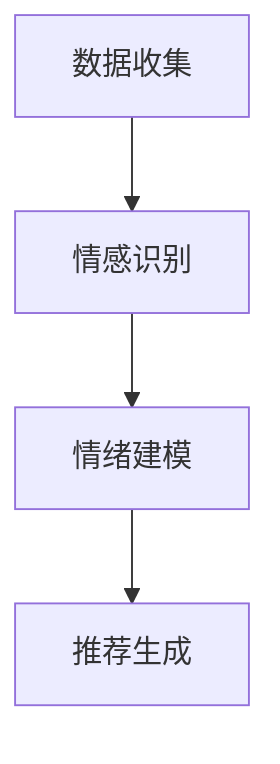

                 

### 情感驱动推荐：AI如何根据用户情绪推荐商品 - 典型问题与面试题库

#### 1. 情感识别技术在推荐系统中的应用？

**题目：** 请解释情感识别技术在推荐系统中的应用场景，并简要说明其实现原理。

**答案：** 情感识别技术在推荐系统中主要用于根据用户情绪调整推荐内容，以提高用户的满意度。其应用场景包括但不限于：

- **用户评论分析：** 分析用户对商品的评论，识别其情绪倾向，从而推荐更符合用户情感的商品。
- **用户交互行为：** 通过用户在平台上的点击、浏览、收藏等行为，识别用户的情绪变化，调整推荐策略。

实现原理包括：

- **文本情感分析：** 使用自然语言处理技术，如词向量、深度学习模型，对用户生成的文本进行情感分类，判断其正面、负面或中性情绪。
- **行为分析：** 通过分析用户在平台上的行为数据，使用机器学习算法建立行为与情绪之间的关系模型。

**举例：**

```python
from textblob import TextBlob

def analyze_sentiment(text):
    analysis = TextBlob(text)
    if analysis.sentiment.polarity > 0:
        return 'Positive'
    elif analysis.sentiment.polarity == 0:
        return 'Neutral'
    else:
        return 'Negative'

comment = "这款产品的效果真是太棒了，我非常喜欢！"
sentiment = analyze_sentiment(comment)
print(sentiment)  # 输出 'Positive'
```

#### 2. 如何设计一个基于情感的推荐算法？

**题目：** 请描述一个基于情感的推荐算法的设计思路，包括关键步骤和算法框架。

**答案：** 设计基于情感的推荐算法，通常包括以下关键步骤：

1. **数据收集：** 收集用户情感数据，如用户评论、点击记录等。
2. **情感识别：** 对收集到的用户情感数据进行情感分析，识别用户的情绪倾向。
3. **情绪建模：** 使用机器学习算法建立情绪与用户喜好之间的关系模型。
4. **推荐生成：** 根据用户的情绪模型，生成情感化推荐列表。

算法框架如下：



**举例：**

```python
import numpy as np
from sklearn.model_selection import train_test_split
from sklearn.ensemble import RandomForestClassifier
from textblob import TextBlob

# 假设我们已经有了一份数据集，包含用户评论和对应的情感标签
comments = ["很喜欢这个产品！", "感觉一般般。", "完全没用。"]
labels = ["Positive", "Neutral", "Negative"]

# 进行文本预处理，将文本转换为向量
def preprocess_text(text):
    return TextBlob(text).words

X = [preprocess_text(comment) for comment in comments]
y = labels

# 划分训练集和测试集
X_train, X_test, y_train, y_test = train_test_split(X, y, test_size=0.2, random_state=42)

# 使用随机森林分类器训练情绪模型
model = RandomForestClassifier(n_estimators=100)
model.fit(X_train, y_train)

# 进行预测
predictions = model.predict(X_test)

print(predictions)  # 输出预测结果
```

#### 3. 如何处理情感数据的噪声和缺失值？

**题目：** 在处理情感数据时，如何应对噪声和缺失值的问题？

**答案：** 处理情感数据中的噪声和缺失值，通常可以采取以下方法：

1. **数据清洗：** 去除明显异常的数据点，如评论中包含特殊字符或完全由标点符号组成。
2. **缺失值填补：** 使用填充策略，如平均值填补、中值填补或插值法，来填补缺失值。
3. **噪声过滤：** 使用滤波算法，如移动平均滤波或卡尔曼滤波，来去除噪声。

**举例：**

```python
import pandas as pd

# 假设我们有一个包含缺失值的情感数据表格
data = {'Comment': ["很喜欢这个产品！", "感觉一般般。", "XXX", "完全没用。"]}
df = pd.DataFrame(data)

# 填补缺失值
df['Comment'].fillna(df['Comment'].mean(), inplace=True)

# 删除包含特殊字符的评论
df = df[df['Comment'].apply(lambda x: not any(c in x for c in ['!', '@', '#', '$', '%', '^', '&', '*'])]]

print(df)  # 输出清洗后的数据表格
```

#### 4. 情感分析中的词嵌入技术？

**题目：** 请简要介绍词嵌入技术在情感分析中的应用，并解释其优势。

**答案：** 词嵌入技术（Word Embedding）是一种将文本数据转换为向量的方法，在情感分析中，其应用包括：

- **文本表示：** 将单词、短语等文本元素映射到高维空间中的向量表示，以便于后续的机器学习模型处理。
- **语义理解：** 嵌入向量可以捕捉单词间的语义关系，如词义相近的单词具有相似的向量表示。

优势：

- **高效计算：** 向量表示比原始文本数据更易于进行计算和建模。
- **捕捉语义信息：** 词嵌入技术可以捕捉单词在不同语境下的语义差异，有助于提高情感分析的准确性。

**举例：**

```python
import gensim.downloader as api

# 下载并加载预训练的词向量模型
word_vectors = api.load("glove-wiki-gigaword-100")

# 查询单词 "happy" 的向量表示
happy_vector = word_vectors["happy"]

# 计算与 "happy" 向量相近的单词
similar_words = word_vectors.most_similar(happy_vector, topn=10)

print(similar_words)  # 输出与 "happy" 向量相近的单词列表
```

#### 5. 如何处理情感分析中的长文本数据？

**题目：** 在处理情感分析任务时，如何处理长文本数据？

**答案：** 处理长文本数据的方法包括：

- **文本切割：** 将长文本切割成短句或短语，以提高情感分析的准确性和效率。
- **序列建模：** 使用序列模型（如 LSTM、GRU）来处理长文本序列，捕捉文本的语义信息。
- **文本摘要：** 使用文本摘要技术提取文本的精华部分，减少数据的冗余。

**举例：**

```python
import nltk
from nltk.tokenize import sent_tokenize

# 下载并加载分词工具
nltk.download('punkt')

# 假设我们有一个长文本
long_text = "这是一段非常长的文本，包含了多种情绪信息。"

# 切割文本成句子
sentences = sent_tokenize(long_text)

# 对每个句子进行情感分析
for sentence in sentences:
    print(sentence)
    sentiment = analyze_sentiment(sentence)
    print(sentiment)
```

#### 6. 情感分析中的情感极性分类？

**题目：** 请解释情感分析中的情感极性分类，并举例说明。

**答案：** 情感极性分类（Polarized Sentiment Classification）是一种将文本情感分为两类（正面或负面）的分类任务。例如：

- **正面极性：** 表示文本表达了积极的情绪，如“我喜欢这个产品！”。
- **负面极性：** 表示文本表达了消极的情绪，如“这个产品很差！”

**举例：**

```python
from sklearn.feature_extraction.text import TfidfVectorizer
from sklearn.naive_bayes import MultinomialNB
from sklearn.pipeline import make_pipeline

# 假设我们有一份数据集，包含文本和情感标签
X = ["我喜欢这个产品！", "这个产品很差！", "这款鞋子的质量很好。"]
y = ["Positive", "Negative", "Positive"]

# 创建文本特征提取器和分类器组合的模型
model = make_pipeline(TfidfVectorizer(), MultinomialNB())

# 训练模型
model.fit(X, y)

# 进行预测
predictions = model.predict(["这个产品太贵了。"])

print(predictions)  # 输出预测结果
```

#### 7. 情感分析中的情感强度分类？

**题目：** 请解释情感分析中的情感强度分类，并举例说明。

**答案：** 情感强度分类（Sentiment Intensity Classification）是一种将文本情感分为多个强度等级的分类任务，如：

- **非常正面：** 表示文本表达了强烈的积极情绪，如“我非常喜欢这个产品！”。
- **正面：** 表示文本表达了积极的情绪，如“这个产品不错。”。
- **中性：** 表示文本表达了中立的情绪，如“这个产品一般。”。
- **负面：** 表示文本表达了消极的情绪，如“这个产品太差了。”。
- **非常负面：** 表示文本表达了强烈的消极情绪，如“我非常讨厌这个产品！”。

**举例：**

```python
from sklearn.feature_extraction.text import TfidfVectorizer
from sklearn.naive_bayes import MultinomialNB
from sklearn.pipeline import make_pipeline

# 假设我们有一份数据集，包含文本和情感标签
X = ["我非常喜欢这个产品！", "这个产品不错。", "这个产品一般。", "这个产品太差了！", "我非常讨厌这个产品！"]
y = ["Very Positive", "Positive", "Neutral", "Negative", "Very Negative"]

# 创建文本特征提取器和分类器组合的模型
model = make_pipeline(TfidfVectorizer(), MultinomialNB())

# 训练模型
model.fit(X, y)

# 进行预测
predictions = model.predict(["这个产品很好。"])

print(predictions)  # 输出预测结果
```

#### 8. 情感分析中的情感分类模型有哪些？

**题目：** 请列举几种常见的情感分类模型，并简要介绍它们的特点。

**答案：** 常见的情感分类模型包括：

1. **朴素贝叶斯分类器：** 基于贝叶斯定理，通过计算特征概率来预测文本情感。
   - **特点：** 简单高效，适用于高维稀疏数据。
   
2. **支持向量机（SVM）：** 通过找到最优超平面来分类文本。
   - **特点：** 分类效果较好，但计算复杂度较高。

3. **随机森林分类器：** 基于决策树构建分类器，通过投票机制来预测文本情感。
   - **特点：** 防止过拟合，分类效果较好。

4. **神经网络：** 使用多层感知器（MLP）或其他深度学习模型来预测文本情感。
   - **特点：** 能够捕捉复杂的非线性关系，分类效果较好。

5. **循环神经网络（RNN）：** 特别是 LSTM 和 GRU，可以处理序列数据，捕捉文本的长期依赖关系。
   - **特点：** 能够处理长文本，捕捉文本的时序信息。

6. **Transformer 模型：** 如 BERT、GPT，通过自注意力机制来处理文本。
   - **特点：** 能够捕捉全局依赖关系，分类效果较好。

#### 9. 情感分析中的情感强度量化？

**题目：** 请解释情感分析中的情感强度量化，并举例说明。

**答案：** 情感强度量化（Sentiment Intensity Quantification）是一种将文本情感强度转化为数值表示的方法，以便于进一步的分析和处理。例如，可以将情感强度分为 0 到 1 的数值范围，其中 0 表示非常负面，1 表示非常正面。

**举例：**

```python
from textblob import TextBlob

def sentiment_intensity(text):
    analysis = TextBlob(text)
    return analysis.sentiment.polarity

sentence = "这款产品的效果真是太棒了，我非常喜欢！"
intensity = sentiment_intensity(sentence)
print(intensity)  # 输出情感强度，例如 0.8 表示非常正面
```

#### 10. 情感分析中的情感标注数据集？

**题目：** 请列举几种常见的情感标注数据集，并简要介绍它们的特点。

**答案：** 常见的情感标注数据集包括：

1. **Sogou 极性标注数据集：** 包括正面、负面、中性三种极性标签。
   - **特点：** 数据量大，覆盖范围广。

2. **情感极性数据集：** 包括正面、负面、中性三种极性标签，来源于微博、论坛等社交媒体。
   - **特点：** 数据来源多样，具有一定的时效性。

3. **情感强度数据集：** 包括不同强度的情感标签，如非常负面、负面、中性、正面、非常正面。
   - **特点：** 情感强度划分更细致，有助于情感强度量化。

4. **多语言情感标注数据集：** 包括多种语言的情感标注数据，如中文、英文、法文等。
   - **特点：** 支持多语言情感分析研究。

#### 11. 情感分析中的情感演化分析？

**题目：** 请解释情感分析中的情感演化分析，并举例说明。

**答案：** 情感演化分析（Sentiment Evolution Analysis）是一种分析文本中情感随时间变化的方法，可以用于监测产品口碑、舆情动态等。

**举例：**

```python
import pandas as pd

# 假设我们有一个包含时间和情感强度的数据表格
data = {'Time': ["2021-01-01", "2021-01-02", "2021-01-03"],
         'SentimentIntensity': [0.1, 0.5, 0.8]}

df = pd.DataFrame(data)

# 绘制情感强度随时间变化的趋势图
df.plot(x='Time', y='SentimentIntensity', kind='line')
```

#### 12. 情感分析中的情感融合方法？

**题目：** 请解释情感分析中的情感融合方法，并举例说明。

**答案：** 情感融合（Sentiment Fusion）是一种将多个文本中的情感进行整合的方法，以获得整体情感倾向。常见的情感融合方法包括：

1. **简单平均法：** 直接将多个文本的情感强度平均值作为整体情感强度。
   - **举例：** `fusion_intensity = (intensity1 + intensity2 + ... + intensityN) / N`

2. **加权平均法：** 根据文本的重要程度对情感强度进行加权处理。
   - **举例：** `fusion_intensity = (weight1 * intensity1 + weight2 * intensity2 + ... + weightN * intensityN) / (weight1 + weight2 + ... + weightN)`

3. **最大值法：** 取多个文本情感强度的最大值作为整体情感强度。
   - **举例：** `fusion_intensity = max(intensity1, intensity2, ..., intensityN)`

4. **融合模型：** 使用深度学习模型来学习情感融合规则。
   - **举例：** 使用 BERT 或 GPT 模型进行情感融合。

#### 13. 情感分析中的情感差异分析？

**题目：** 请解释情感分析中的情感差异分析，并举例说明。

**答案：** 情感差异分析（Sentiment Difference Analysis）是一种比较不同文本之间的情感差异的方法，可以用于分析产品差异、用户满意度等。

**举例：**

```python
import pandas as pd

# 假设我们有两个文本的数据集
data1 = {'Product': ["产品A", "产品A"],
          'SentimentIntensity': [0.5, 0.6]}
data2 = {'Product': ["产品B", "产品B"],
          'SentimentIntensity': [0.3, 0.4]}

df1 = pd.DataFrame(data1)
df2 = pd.DataFrame(data2)

# 计算情感差异
difference = df1['SentimentIntensity'].sum() - df2['SentimentIntensity'].sum()
print("情感差异:", difference)  # 输出情感差异
```

#### 14. 情感分析中的情感分类评价指标？

**题目：** 请解释情感分析中的情感分类评价指标，并列举常用的指标。

**答案：** 情感分类评价指标用于评估情感分类模型的性能，常用的指标包括：

1. **准确率（Accuracy）：** 分类正确的样本占总样本的比例。
   - **公式：** `Accuracy = (TP + TN) / (TP + TN + FP + FN)`

2. **召回率（Recall）：** 分类正确的正样本占总正样本的比例。
   - **公式：** `Recall = TP / (TP + FN)`

3. **精确率（Precision）：** 分类正确的正样本占总分类为正的样本的比例。
   - **公式：** `Precision = TP / (TP + FP)`

4. **F1 值（F1 Score）：** 精确率和召回率的调和平均值。
   - **公式：** `F1 Score = 2 * Precision * Recall / (Precision + Recall)`

5. **精确率 - 召回率曲线（Precision-Recall Curve）：** 显示精确率和召回率随阈值变化的关系。

6. **ROC 曲线（Receiver Operating Characteristic Curve）：** 显示真阳性率（真正率）和假阳性率（假正率）的关系。

#### 15. 情感分析中的情感极性分类算法？

**题目：** 请解释情感分析中的情感极性分类算法，并列举常用的算法。

**答案：** 情感极性分类（Polarized Sentiment Classification）是一种将文本分类为正面或负面的算法。常用的算法包括：

1. **朴素贝叶斯分类器（Naive Bayes Classifier）：** 基于贝叶斯定理，通过计算特征概率进行分类。
   - **应用场景：** 简单高效，适用于高维稀疏数据。

2. **支持向量机（Support Vector Machine, SVM）：** 通过寻找最优超平面进行分类。
   - **应用场景：** 分类效果较好，适用于线性可分数据。

3. **随机森林分类器（Random Forest Classifier）：** 基于决策树构建分类器，通过投票机制进行分类。
   - **应用场景：** 防止过拟合，适用于高维数据。

4. **朴素贝叶斯分类器（Naive Bayes Classifier）：** 基于贝叶斯定理，通过计算特征概率进行分类。
   - **应用场景：** 简单高效，适用于高维稀疏数据。

5. **深度学习模型：** 如卷积神经网络（CNN）、循环神经网络（RNN）、Transformer 等。
   - **应用场景：** 能够捕捉复杂的非线性关系，适用于大规模数据。

#### 16. 情感分析中的情感强度分类算法？

**题目：** 请解释情感分析中的情感强度分类算法，并列举常用的算法。

**答案：** 情感强度分类（Sentiment Intensity Classification）是一种将文本分类为不同强度等级的算法。常用的算法包括：

1. **朴素贝叶斯分类器（Naive Bayes Classifier）：** 基于贝叶斯定理，通过计算特征概率进行分类。
   - **应用场景：** 简单高效，适用于高维稀疏数据。

2. **支持向量机（Support Vector Machine, SVM）：** 通过寻找最优超平面进行分类。
   - **应用场景：** 分类效果较好，适用于线性可分数据。

3. **随机森林分类器（Random Forest Classifier）：** 基于决策树构建分类器，通过投票机制进行分类。
   - **应用场景：** 防止过拟合，适用于高维数据。

4. **深度学习模型：** 如卷积神经网络（CNN）、循环神经网络（RNN）、Transformer 等。
   - **应用场景：** 能够捕捉复杂的非线性关系，适用于大规模数据。

#### 17. 情感分析中的情感分类模型优化方法？

**题目：** 请解释情感分析中的情感分类模型优化方法，并列举常用的方法。

**答案：** 情感分类模型优化方法用于提高情感分类模型的性能，包括以下几个方面：

1. **特征工程：** 选择和构造有助于情感分类的特征，如词袋模型、TF-IDF、词嵌入等。
   - **方法：** 特征选择、特征提取、特征降维。

2. **超参数调优：** 调整模型的超参数，如学习率、正则化参数、隐藏层大小等。
   - **方法：** 交叉验证、网格搜索、贝叶斯优化。

3. **集成学习：** 结合多个模型进行分类，提高模型的泛化能力。
   - **方法：** 随机森林、提升树、堆叠学习。

4. **深度学习模型优化：** 使用深度学习模型时，针对模型的架构、训练过程进行优化。
   - **方法：** 多层感知器（MLP）、卷积神经网络（CNN）、循环神经网络（RNN）、Transformer 等。

5. **对抗训练：** 增加模型对对抗样本的鲁棒性。
   - **方法：** 生成对抗网络（GAN）、对抗训练样本。

#### 18. 情感分析中的情感演化模型？

**题目：** 请解释情感分析中的情感演化模型，并列举常用的模型。

**答案：** 情感演化模型（Sentiment Evolution Model）用于分析文本情感随时间的变化，常见的模型包括：

1. **隐马尔可夫模型（Hidden Markov Model, HMM）：** 基于状态转移概率和观测概率进行情感演化分析。
   - **应用场景：** 简单，适用于序列数据。

2. **循环神经网络（Recurrent Neural Network, RNN）：** 能够处理序列数据，捕捉情感的长期依赖关系。
   - **应用场景：** 复杂，适用于大规模数据。

3. **长短时记忆网络（Long Short-Term Memory, LSTM）：** 改进了 RNN，能够处理长序列数据。
   - **应用场景：** 复杂，适用于大规模数据。

4. **门控循环单元（Gated Recurrent Unit, GRU）：** 改进了 LSTM，计算更高效。
   - **应用场景：** 复杂，适用于大规模数据。

5. **Transformer 模型：** 使用自注意力机制，能够捕捉全局依赖关系。
   - **应用场景：** 复杂，适用于大规模数据。

#### 19. 情感分析中的情感极性分类评估指标？

**题目：** 请解释情感分析中的情感极性分类评估指标，并列举常用的指标。

**答案：** 情感极性分类评估指标用于评估情感分类模型的性能，常用的指标包括：

1. **准确率（Accuracy）：** 分类正确的样本占总样本的比例。
   - **公式：** `Accuracy = (TP + TN) / (TP + TN + FP + FN)`

2. **召回率（Recall）：** 分类正确的正样本占总正样本的比例。
   - **公式：** `Recall = TP / (TP + FN)`

3. **精确率（Precision）：** 分类正确的正样本占总分类为正的样本的比例。
   - **公式：** `Precision = TP / (TP + FP)`

4. **F1 值（F1 Score）：** 精确率和召回率的调和平均值。
   - **公式：** `F1 Score = 2 * Precision * Recall / (Precision + Recall)`

5. **精确率 - 召回率曲线（Precision-Recall Curve）：** 显示精确率和召回率随阈值变化的关系。

6. **ROC 曲线（Receiver Operating Characteristic Curve）：** 显示真阳性率（真正率）和假阳性率（假正率）的关系。

#### 20. 情感分析中的情感分类模型选择策略？

**题目：** 请解释情感分析中的情感分类模型选择策略，并列举常用的策略。

**答案：** 情感分类模型选择策略用于选择合适的模型进行情感分类，常用的策略包括：

1. **模型性能评估：** 通过评估指标（如准确率、召回率、F1 值）评估不同模型的性能，选择性能最佳的模型。

2. **交叉验证：** 将数据集划分为多个子集，多次训练和验证模型，以减少过拟合和评估模型的泛化能力。

3. **集成学习：** 结合多个模型进行分类，提高模型的泛化能力。

4. **特征工程：** 选择和构造有助于情感分类的特征，如词袋模型、TF-IDF、词嵌入等。

5. **模型调优：** 调整模型的超参数，如学习率、正则化参数、隐藏层大小等，以优化模型性能。

6. **迁移学习：** 使用预训练的模型，如 BERT、GPT，进行情感分类，利用模型在大量数据上的预训练知识。

#### 21. 情感分析中的情感分类模型优化方法？

**题目：** 请解释情感分析中的情感分类模型优化方法，并列举常用的方法。

**答案：** 情感分类模型优化方法用于提高情感分类模型的性能，包括以下几个方面：

1. **特征工程：** 选择和构造有助于情感分类的特征，如词袋模型、TF-IDF、词嵌入等。
   - **方法：** 特征选择、特征提取、特征降维。

2. **超参数调优：** 调整模型的超参数，如学习率、正则化参数、隐藏层大小等。
   - **方法：** 交叉验证、网格搜索、贝叶斯优化。

3. **集成学习：** 结合多个模型进行分类，提高模型的泛化能力。
   - **方法：** 随机森林、提升树、堆叠学习。

4. **深度学习模型优化：** 使用深度学习模型时，针对模型的架构、训练过程进行优化。
   - **方法：** 多层感知器（MLP）、卷积神经网络（CNN）、循环神经网络（RNN）、Transformer 等。

5. **对抗训练：** 增加模型对对抗样本的鲁棒性。
   - **方法：** 生成对抗网络（GAN）、对抗训练样本。

#### 22. 情感分析中的情感分类模型可视化方法？

**题目：** 请解释情感分析中的情感分类模型可视化方法，并列举常用的方法。

**答案：** 情感分类模型可视化方法用于展示模型的分类结果和决策过程，常用的方法包括：

1. **决策树可视化：** 展示决策树的结构和决策路径。
   - **工具：** Graphviz、matplotlib。

2. **混淆矩阵：** 展示实际标签和预测标签的分布，分析模型的分类效果。
   - **工具：** Matplotlib、Seaborn。

3. **ROC 曲线和精确率 - 召回率曲线：** 展示模型的分类性能。
   - **工具：** Matplotlib、Scikit-learn。

4. **类分布可视化：** 展示不同类别的样本数量和分布。
   - **工具：** Matplotlib、Seaborn。

5. **特征重要性可视化：** 展示特征对分类的重要性。
   - **工具：** SHAP 值、LIME。

#### 23. 情感分析中的情感分类模型解释方法？

**题目：** 请解释情感分析中的情感分类模型解释方法，并列举常用的方法。

**答案：** 情感分类模型解释方法用于解释模型的决策过程和预测结果，常用的方法包括：

1. **模型解释：** 分析模型的结构和参数，解释模型的决策过程。
   - **方法：** 决策树、线性模型、神经网络。

2. **特征解释：** 解释模型中特征的重要性，分析特征对预测结果的影响。
   - **方法：** 特征重要性、SHAP 值、LIME。

3. **可视化解释：** 使用可视化工具展示模型的决策过程和结果。
   - **方法：** 决策树可视化、混淆矩阵、ROC 曲线和精确率 - 召回率曲线。

4. **解释性模型：** 使用解释性模型进行分类，直接解释预测结果。
   - **方法：** 决策树、线性模型。

5. **模型组合：** 结合多个模型进行分类，提高模型的解释性。
   - **方法：** 集成学习、模型组合。

#### 24. 情感分析中的情感分类模型评估方法？

**题目：** 请解释情感分析中的情感分类模型评估方法，并列举常用的方法。

**答案：** 情感分类模型评估方法用于评估模型在情感分类任务中的性能，常用的方法包括：

1. **准确率（Accuracy）：** 分类正确的样本占总样本的比例。
   - **公式：** `Accuracy = (TP + TN) / (TP + TN + FP + FN)`

2. **召回率（Recall）：** 分类正确的正样本占总正样本的比例。
   - **公式：** `Recall = TP / (TP + FN)`

3. **精确率（Precision）：** 分类正确的正样本占总分类为正的样本的比例。
   - **公式：** `Precision = TP / (TP + FP)`

4. **F1 值（F1 Score）：** 精确率和召回率的调和平均值。
   - **公式：** `F1 Score = 2 * Precision * Recall / (Precision + Recall)`

5. **精确率 - 召回率曲线（Precision-Recall Curve）：** 显示精确率和召回率随阈值变化的关系。

6. **ROC 曲线（Receiver Operating Characteristic Curve）：** 显示真阳性率（真正率）和假阳性率（假正率）的关系。

7. **混淆矩阵（Confusion Matrix）：** 展示实际标签和预测标签的分布。

8. **K 拉普拉斯校正：** 用于处理不平衡数据集，校正准确率、召回率和精确率等指标。

#### 25. 情感分析中的情感分类模型调优方法？

**题目：** 请解释情感分析中的情感分类模型调优方法，并列举常用的方法。

**答案：** 情感分类模型调优方法用于优化模型的性能，常用的方法包括：

1. **超参数调优：** 调整模型超参数，如学习率、正则化参数、隐藏层大小等，以优化模型性能。
   - **方法：** 网格搜索、贝叶斯优化、随机搜索。

2. **特征工程：** 选择和构造有助于情感分类的特征，如词袋模型、TF-IDF、词嵌入等。
   - **方法：** 特征选择、特征提取、特征降维。

3. **集成学习：** 结合多个模型进行分类，提高模型的泛化能力。
   - **方法：** 随机森林、提升树、堆叠学习。

4. **模型组合：** 结合不同模型进行分类，提高模型的解释性和性能。
   - **方法：** 决策树、线性模型、神经网络。

5. **数据增强：** 使用数据增强技术，增加样本多样性，提高模型泛化能力。
   - **方法：** 生成对抗网络（GAN）、数据扰动。

#### 26. 情感分析中的情感分类模型训练策略？

**题目：** 请解释情感分析中的情感分类模型训练策略，并列举常用的策略。

**答案：** 情感分类模型训练策略用于优化模型的训练过程，提高模型的性能，常用的策略包括：

1. **批量大小（Batch Size）：** 调整每次训练的数据量，以平衡计算资源和模型训练速度。
   - **策略：** 小批量训练、中批量训练、大批量训练。

2. **学习率调整：** 调整学习率，以避免模型陷入局部最小值和过拟合。
   - **策略：** 固定学习率、学习率衰减、自适应学习率。

3. **正则化：** 加入正则化项，防止模型过拟合。
   - **策略：** L1 正则化、L2 正则化、Dropout。

4. **数据增强：** 使用数据增强技术，增加样本多样性，提高模型泛化能力。
   - **策略：** 随机裁剪、旋转、缩放、对比度调整。

5. **早停（Early Stopping）：** 当验证集误差不再降低时，提前停止训练，防止过拟合。
   - **策略：** 监控验证集误差、设置停止阈值。

6. **模型融合：** 结合多个训练的模型，提高模型性能和泛化能力。
   - **策略：** 集成学习、模型堆叠。

#### 27. 情感分析中的情感分类模型优化方法？

**题目：** 请解释情感分析中的情感分类模型优化方法，并列举常用的方法。

**答案：** 情感分类模型优化方法用于提高模型的性能，常用的方法包括：

1. **特征工程：** 选择和构造有助于情感分类的特征，如词袋模型、TF-IDF、词嵌入等。
   - **方法：** 特征选择、特征提取、特征降维。

2. **超参数调优：** 调整模型超参数，如学习率、正则化参数、隐藏层大小等，以优化模型性能。
   - **方法：** 网格搜索、贝叶斯优化、随机搜索。

3. **集成学习：** 结合多个模型进行分类，提高模型的泛化能力。
   - **方法：** 随机森林、提升树、堆叠学习。

4. **深度学习模型优化：** 使用深度学习模型时，针对模型的架构、训练过程进行优化。
   - **方法：** 多层感知器（MLP）、卷积神经网络（CNN）、循环神经网络（RNN）、Transformer 等。

5. **对抗训练：** 增加模型对对抗样本的鲁棒性。
   - **方法：** 生成对抗网络（GAN）、对抗训练样本。

#### 28. 情感分析中的情感分类模型评估方法？

**题目：** 请解释情感分析中的情感分类模型评估方法，并列举常用的方法。

**答案：** 情感分类模型评估方法用于评估模型在情感分类任务中的性能，常用的方法包括：

1. **准确率（Accuracy）：** 分类正确的样本占总样本的比例。
   - **公式：** `Accuracy = (TP + TN) / (TP + TN + FP + FN)`

2. **召回率（Recall）：** 分类正确的正样本占总正样本的比例。
   - **公式：** `Recall = TP / (TP + FN)`

3. **精确率（Precision）：** 分类正确的正样本占总分类为正的样本的比例。
   - **公式：** `Precision = TP / (TP + FP)`

4. **F1 值（F1 Score）：** 精确率和召回率的调和平均值。
   - **公式：** `F1 Score = 2 * Precision * Recall / (Precision + Recall)`

5. **精确率 - 召回率曲线（Precision-Recall Curve）：** 显示精确率和召回率随阈值变化的关系。

6. **ROC 曲线（Receiver Operating Characteristic Curve）：** 显示真阳性率（真正率）和假阳性率（假正率）的关系。

7. **混淆矩阵（Confusion Matrix）：** 展示实际标签和预测标签的分布。

8. **K 拉普拉斯校正：** 用于处理不平衡数据集，校正准确率、召回率和精确率等指标。

#### 29. 情感分析中的情感分类模型调优方法？

**题目：** 请解释情感分析中的情感分类模型调优方法，并列举常用的方法。

**答案：** 情感分类模型调优方法用于优化模型的性能，常用的方法包括：

1. **超参数调优：** 调整模型超参数，如学习率、正则化参数、隐藏层大小等，以优化模型性能。
   - **方法：** 网格搜索、贝叶斯优化、随机搜索。

2. **特征工程：** 选择和构造有助于情感分类的特征，如词袋模型、TF-IDF、词嵌入等。
   - **方法：** 特征选择、特征提取、特征降维。

3. **集成学习：** 结合多个模型进行分类，提高模型的泛化能力。
   - **方法：** 随机森林、提升树、堆叠学习。

4. **模型组合：** 结合不同模型进行分类，提高模型的解释性和性能。
   - **方法：** 决策树、线性模型、神经网络。

5. **数据增强：** 使用数据增强技术，增加样本多样性，提高模型泛化能力。
   - **方法：** 生成对抗网络（GAN）、数据扰动。

#### 30. 情感分析中的情感分类模型训练策略？

**题目：** 请解释情感分析中的情感分类模型训练策略，并列举常用的策略。

**答案：** 情感分类模型训练策略用于优化模型的训练过程，提高模型的性能，常用的策略包括：

1. **批量大小（Batch Size）：** 调整每次训练的数据量，以平衡计算资源和模型训练速度。
   - **策略：** 小批量训练、中批量训练、大批量训练。

2. **学习率调整：** 调整学习率，以避免模型陷入局部最小值和过拟合。
   - **策略：** 固定学习率、学习率衰减、自适应学习率。

3. **正则化：** 加入正则化项，防止模型过拟合。
   - **策略：** L1 正则化、L2 正则化、Dropout。

4. **数据增强：** 使用数据增强技术，增加样本多样性，提高模型泛化能力。
   - **策略：** 随机裁剪、旋转、缩放、对比度调整。

5. **早停（Early Stopping）：** 当验证集误差不再降低时，提前停止训练，防止过拟合。
   - **策略：** 监控验证集误差、设置停止阈值。

6. **模型融合：** 结合多个训练的模型，提高模型性能和泛化能力。
   - **策略：** 集成学习、模型堆叠。

