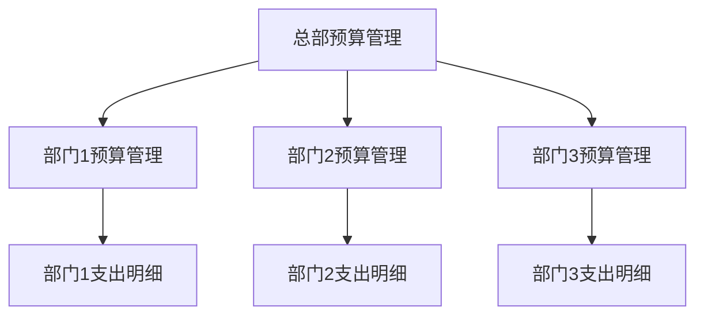
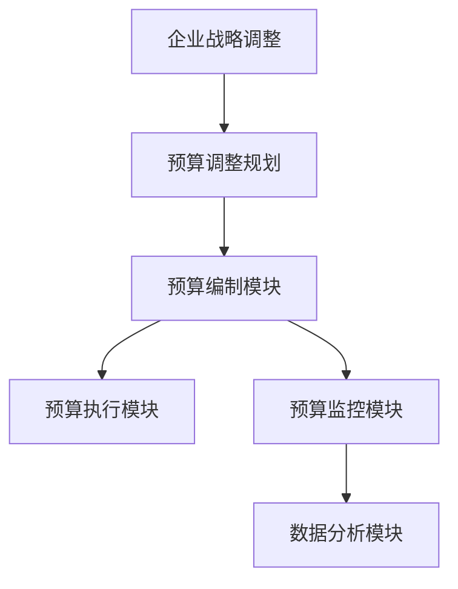

                 


### 1. 如何通过智能预算管理实现财务规划的目标？

**题目：** 在财务规划中，如何使用智能预算管理来确保达成预期目标？

**答案：** 要实现财务规划的目标，智能预算管理可以通过以下几个步骤来实现：

1. **目标设定：** 明确财务规划的目标，如增加储蓄、减少债务、投资增值等。
2. **数据收集：** 收集与财务规划相关的数据，包括收入、支出、投资收益等。
3. **预测模型：** 建立预测模型，预测未来一段时间内的财务状况。
4. **预算编制：** 根据预测模型，编制详细的预算，包括收入预算、支出预算、储蓄预算等。
5. **监控与调整：** 定期监控预算执行情况，根据实际财务状况进行调整。

**举例：** 假设目标是增加储蓄，预测模型显示未来三个月内每月收入为 10,000 元，每月固定支出为 6,000 元，储蓄目标为每月 2,000 元。

```python
# 预测模型
monthly_income = 10000
monthly_expense = 6000
savings_target = 2000

# 编制预算
def create_budget(income, expense, target):
    budget = {}
    budget['income'] = income
    budget['expense'] = expense
    budget['savings'] = target
    return budget

# 监控与调整
def monitor_budget(budget, actual_income, actual_expense):
    budget['actual_income'] = actual_income
    budget['actual_expense'] = actual_expense
    savings_actual = actual_income - actual_expense
    if savings_actual < budget['savings']:
        print("储蓄目标未达成，需调整预算。")
    else:
        print("储蓄目标达成。")

# 应用示例
budget = create_budget(monthly_income, monthly_expense, savings_target)
monitor_budget(budget, 9000, 5500)
```

**解析：** 通过以上步骤，可以确保财务规划目标的实现。智能预算管理能够动态调整预算，以适应实际财务状况，从而提高财务规划的准确性和实现效率。

### 2. 智能预算管理如何处理预算超支的情况？

**题目：** 在财务规划过程中，如果出现预算超支，智能预算管理应该如何处理？

**答案：** 遇到预算超支的情况，智能预算管理可以从以下几个方面进行处理：

1. **自动调整：** 根据预算超支的金额，自动减少当月支出或增加储蓄目标，以确保财务规划的总体目标不变。
2. **分阶段调整：** 将超支部分分摊到后续月份，通过逐月调整预算，使支出逐步回归正常水平。
3. **额外收入利用：** 如果有额外收入，如奖金、投资收益等，可以考虑用这些收入来弥补超支。
4. **紧急调整：** 如果预算超支的金额较大，可能需要临时调整支出计划，如减少非必要消费、增加兼职收入等。

**举例：** 假设某月预算为收入 10,000 元，支出 8,000 元，但实际支出为 9,500 元，导致预算超支 500 元。

```python
# 自动调整预算
def adjust_budget(budget, overage):
    budget['savings'] -= overage
    budget['expense'] += overage
    print("预算调整：支出增加{}元，储蓄减少{}元"。format(overage, overage))

# 应用示例
budget = {'income': 10000, 'expense': 8000, 'savings': 2000}
overage = 500
adjust_budget(budget, overage)
```

**解析：** 通过以上调整方式，智能预算管理可以帮助用户在预算超支时，及时采取有效措施，确保财务规划的稳定性和可持续性。

### 3. 如何利用大数据分析优化预算管理？

**题目：** 在预算管理中，如何利用大数据分析来提高预算编制的准确性和效率？

**答案：** 利用大数据分析优化预算管理可以从以下几个方面进行：

1. **历史数据分析：** 分析过去的数据，识别支出和收入的规律，为预算编制提供参考。
2. **趋势预测：** 使用机器学习算法，对历史数据进行建模，预测未来的财务状况。
3. **风险预警：** 根据数据分析结果，识别潜在的风险，提前采取预防措施。
4. **优化决策：** 通过分析不同支出策略的效果，选择最优的预算分配方案。

**举例：** 利用历史数据预测下个月的支出。

```python
import pandas as pd
from sklearn.linear_model import LinearRegression

# 加载历史数据
data = pd.DataFrame({
    'month': [1, 2, 3, 4, 5],
    'expense': [7000, 7500, 8000, 8500, 9000]
})

# 建立线性回归模型
model = LinearRegression()
model.fit(data[['month']], data['expense'])

# 预测下个月支出
next_month = 6
predicted_expense = model.predict([[next_month]])
print("预测下个月的支出为：", predicted_expense)
```

**解析：** 通过大数据分析，可以更准确地预测未来的财务状况，从而提高预算编制的准确性和效率。同时，大数据分析还能帮助识别风险，优化预算管理策略。

### 4. 预算管理中如何平衡短期与长期目标？

**题目：** 在预算管理中，如何平衡短期目标和长期目标的关系？

**答案：** 平衡短期与长期目标，可以从以下几个方面进行：

1. **短期目标：** 确保当前的财务状况稳定，如支付日常开销、偿还债务等。
2. **长期目标：** 制定长期的财务规划，如增加储蓄、投资增值、子女教育等。
3. **优先级设定：** 根据当前财务状况和未来目标，设定短期和长期目标的优先级。
4. **动态调整：** 根据实际情况，灵活调整短期和长期目标的执行计划。

**举例：** 假设短期目标是减少债务，长期目标是储蓄并投资增值。

```python
# 设定目标
short_term_goal = 'reduce_debt'
long_term_goal = 'save_and_invest'

# 根据当前财务状况设定优先级
if current_debt > savings_target:
    priority = short_term_goal
else:
    priority = long_term_goal

# 根据优先级调整预算
if priority == short_term_goal:
    # 减少非必要支出，增加偿还债务的资金
    budget['savings'] = 0
    budget['debt_repayment'] = current_debt
else:
    # 保持储蓄和投资目标
    budget['savings'] = savings_target
    budget['investment'] = investment_target

print("根据优先级调整后的预算：", budget)
```

**解析：** 通过以上方法，可以确保预算管理既考虑当前财务状况，又兼顾长期目标，从而实现财务规划的平衡发展。

### 5. 如何利用人工智能技术提高预算管理的效率？

**题目：** 在预算管理中，人工智能技术如何提高其效率？

**答案：** 利用人工智能技术提高预算管理效率可以从以下几个方面实现：

1. **自动化处理：** 使用人工智能算法来自动处理预算编制、监控和调整等流程，减少人工工作量。
2. **预测分析：** 利用机器学习模型进行财务预测，提高预算编制的准确性和效率。
3. **智能推荐：** 根据用户的历史数据和行为，提供个性化的预算管理建议。
4. **风险识别：** 通过数据挖掘技术，提前识别潜在的风险，并提供预防措施。

**举例：** 使用机器学习模型预测下个月的收入。

```python
import pandas as pd
from sklearn.ensemble import RandomForestRegressor

# 加载历史数据
data = pd.DataFrame({
    'month': [1, 2, 3, 4, 5],
    'income': [8000, 8500, 9000, 9500, 10000]
})

# 建立随机森林回归模型
model = RandomForestRegressor()
model.fit(data[['month']], data['income'])

# 预测下个月收入
next_month = 6
predicted_income = model.predict([[next_month]])
print("预测下个月收入为：", predicted_income)
```

**解析：** 通过人工智能技术，可以大大提高预算管理的效率，降低人力成本，同时提高预算编制的准确性和风险识别能力。

### 6. 如何利用区块链技术确保预算管理数据的安全与透明？

**题目：** 在预算管理中，如何利用区块链技术确保数据的安全和透明？

**答案：** 利用区块链技术确保预算管理数据的安全和透明，可以从以下几个方面实现：

1. **去中心化存储：** 将预算管理数据存储在区块链上，实现去中心化存储，提高数据安全性。
2. **加密技术：** 对数据进行加密处理，确保数据在传输和存储过程中的安全性。
3. **智能合约：** 使用智能合约自动执行预算管理流程，确保流程的透明性和不可篡改性。
4. **链上审计：** 通过区块链技术实现链上审计，确保预算管理过程和数据的透明性。

**举例：** 使用智能合约自动执行预算审批流程。

```solidity
// SPDX-License-Identifier: MIT

pragma solidity ^0.8.0;

contract BudgetManagement {
    address public manager;
    mapping(address => uint256) public approvals;
    uint256 public numApprovals = 0;
    uint256 public budget = 0;
    address[] public approvers;

    constructor(uint256 initialBudget) {
        manager = msg.sender;
        budget = initialBudget;
    }

    function approveBudget() public {
        if (approvals[msg.sender] == 0) {
            approvals[msg.sender] = 1;
            approvers.push(msg.sender);
            numApprovals++;
        }
    }

    function executeBudget() public {
        require(msg.sender == manager, "Only the manager can execute the budget");
        require(numApprovals > 0, "No approvals yet");
        uint256 totalApprovals = numApprovals * budget;
        manager.transfer(totalApprovals);
    }
}
```

**解析：** 通过区块链技术，可以确保预算管理数据的安全和透明，提高数据可信度，同时降低数据篡改和欺诈的风险。

### 7. 智能预算管理如何应对宏观经济波动的影响？

**题目：** 在宏观经济波动较大的时期，智能预算管理如何应对？

**答案：** 智能预算管理可以通过以下方式应对宏观经济波动的影响：

1. **预警系统：** 建立宏观经济预警系统，及时监测宏观经济指标的变化，提前预测可能的波动。
2. **动态调整：** 根据宏观经济波动的情况，动态调整预算编制和执行策略，确保财务规划的稳定性。
3. **多元化投资：** 通过多元化投资分散风险，降低宏观经济波动对财务规划的影响。
4. **应急预案：** 制定应急预案，当宏观经济波动达到一定程度时，采取紧急措施保障财务规划的执行。

**举例：** 根据宏观经济指标调整预算。

```python
import pandas as pd

# 加载宏观经济指标数据
macro_data = pd.DataFrame({
    'GDP_growth': [3.0, 2.5, 2.0, 1.5, 1.0],
    'unemployment_rate': [4.5, 5.0, 5.5, 6.0, 6.5],
    'inflation_rate': [2.0, 2.2, 2.4, 2.6, 2.8]
})

# 根据宏观经济指标调整预算
def adjust_budget(macro_data):
    if macro_data['GDP_growth'].mean() < 2.0:
        budget['savings'] *= 0.9
        budget['investment'] *= 0.9
    if macro_data['unemployment_rate'].mean() > 5.0:
        budget['debt_repayment'] *= 1.1
    if macro_data['inflation_rate'].mean() > 2.5:
        budget['expense'] *= 1.05

# 应用示例
adjust_budget(macro_data)
```

**解析：** 通过以上方法，智能预算管理可以更好地应对宏观经济波动，确保财务规划的稳定性和可持续性。

### 8. 如何利用云计算技术提升预算管理的效率？

**题目：** 在预算管理中，如何利用云计算技术提高其效率？

**答案：** 利用云计算技术提升预算管理效率，可以从以下几个方面实现：

1. **数据存储与处理：** 使用云存储服务存储预算管理数据，并利用云计算资源进行数据处理和分析，提高数据处理能力。
2. **自动化处理：** 利用云计算平台提供的自动化工具和脚本，实现预算编制、监控和调整等流程的自动化。
3. **分布式计算：** 通过分布式计算框架，如 Hadoop 或 Spark，进行大规模数据的处理和分析，提高计算效率。
4. **云计算服务：** 利用云计算平台提供的各种服务，如数据库、大数据分析、人工智能等，提升预算管理的整体效率。

**举例：** 使用云计算平台进行预算数据分析。

```python
from google.cloud import bigquery

# 创建 BigQuery 客户端
client = bigquery.Client()

# 加载预算数据
query = """
    SELECT
        SUM(income) as total_income,
        SUM(expense) as total_expense
    FROM
        `your_project.your_dataset.your_table`
"""
query_job = client.query(query)
results = query_job.result()

# 获取预算总额
budget = results.to_dataframe()
print("总预算：", budget)
```

**解析：** 通过云计算技术，可以大幅提高预算管理的效率，降低成本，同时实现数据的实时分析和处理。

### 9. 智能预算管理如何应对市场变化带来的风险？

**题目：** 在预算管理中，如何应对市场变化带来的风险？

**答案：** 智能预算管理可以通过以下方式应对市场变化带来的风险：

1. **市场监控：** 建立市场监控体系，实时关注市场动态，预测市场变化。
2. **风险评估：** 使用风险评估模型，对市场变化可能带来的风险进行评估。
3. **风险预警：** 当市场变化达到一定程度时，及时发出预警，采取相应的应对措施。
4. **应急预案：** 制定应急预案，确保在市场变化时，能够迅速采取行动，降低风险影响。

**举例：** 根据市场变化调整预算。

```python
# 市场监控数据
market_data = {
    'stock_market_index': [3000, 3100, 3200, 3000, 2900],
    'interest_rate': [3.0, 3.2, 3.4, 3.6, 3.8]
}

# 风险评估模型
def assess_risk(market_data):
    if market_data['stock_market_index'].mean() < 3000:
        risk_level = 'low'
    elif market_data['stock_market_index'].mean() < 3100:
        risk_level = 'medium'
    else:
        risk_level = 'high'
    if market_data['interest_rate'].mean() > 3.5:
        risk_level = 'high'
    return risk_level

# 根据风险评估调整预算
def adjust_budget(risk_level):
    if risk_level == 'low':
        budget['savings'] *= 1.1
        budget['investment'] *= 0.9
    elif risk_level == 'medium':
        budget['savings'] *= 1.05
        budget['investment'] *= 0.95
    else:
        budget['savings'] *= 0.9
        budget['investment'] *= 0.8

# 应用示例
risk_level = assess_risk(market_data)
adjust_budget(risk_level)
```

**解析：** 通过以上方法，智能预算管理可以更好地应对市场变化，降低风险对财务规划的影响。

### 10. 如何利用区块链技术提升预算管理的透明度？

**题目：** 在预算管理中，如何利用区块链技术提升其透明度？

**答案：** 利用区块链技术提升预算管理透明度，可以从以下几个方面实现：

1. **去中心化存储：** 将预算管理数据存储在区块链上，确保数据透明且不可篡改。
2. **智能合约：** 使用智能合约自动执行预算管理流程，确保流程透明且自动化。
3. **链上审计：** 通过区块链技术实现链上审计，确保预算管理过程和数据的透明性。
4. **数据共享：** 利用区块链技术实现数据的共享，提高预算管理信息的透明度。

**举例：** 使用智能合约自动执行预算审批流程。

```solidity
// SPDX-License-Identifier: MIT

pragma solidity ^0.8.0;

contract BudgetManagement {
    address public manager;
    mapping(address => uint256) public approvals;
    uint256 public numApprovals = 0;
    uint256 public budget = 0;
    address[] public approvers;

    constructor(uint256 initialBudget) {
        manager = msg.sender;
        budget = initialBudget;
    }

    function approveBudget() public {
        if (approvals[msg.sender] == 0) {
            approvals[msg.sender] = 1;
            approvers.push(msg.sender);
            numApprovals++;
        }
    }

    function executeBudget() public {
        require(msg.sender == manager, "Only the manager can execute the budget");
        require(numApprovals > 0, "No approvals yet");
        uint256 totalApprovals = numApprovals * budget;
        manager.transfer(totalApprovals);
    }
}
```

**解析：** 通过区块链技术，可以大幅提高预算管理的透明度，降低数据篡改和欺诈的风险，增强数据可信度。

### 11. 如何利用物联网（IoT）技术优化预算管理？

**题目：** 在预算管理中，如何利用物联网（IoT）技术优化其过程？

**答案：** 利用物联网（IoT）技术优化预算管理，可以从以下几个方面实现：

1. **自动化数据收集：** 通过 IoT 设备自动收集与预算相关的数据，如支出、收入、库存等，提高数据准确性。
2. **实时监控：** 利用 IoT 技术，实时监控财务状况，及时发现异常情况，确保预算执行的准确性。
3. **智能预警：** 根据 IoT 数据分析结果，提前识别潜在风险，发出预警，便于及时采取应对措施。
4. **决策支持：** 利用 IoT 数据分析结果，为预算编制和调整提供决策支持，优化预算管理。

**举例：** 利用 IoT 设备监控支出。

```python
import json
import requests

# 发送 HTTP 请求获取 IoT 设备数据
response = requests.get("http://your_iot_device_endpoint")
device_data = json.loads(response.text)

# 获取支出数据
expense = device_data['expense']

# 存储支出数据到数据库
def store_expense(expense):
    # 使用数据库连接库（如 SQLAlchemy）存储数据
    db_connection.execute("INSERT INTO expenses (amount) VALUES (%s)", (expense,))

# 应用示例
store_expense(expense)
```

**解析：** 通过 IoT 技术，可以实时收集和监控支出数据，提高预算管理的准确性和效率。

### 12. 如何利用云计算平台上的机器学习服务优化预算管理？

**题目：** 在预算管理中，如何利用云计算平台上的机器学习服务来优化过程？

**答案：** 利用云计算平台上的机器学习服务优化预算管理，可以从以下几个方面实现：

1. **数据预处理：** 利用云计算平台提供的机器学习服务进行数据预处理，如数据清洗、特征提取等。
2. **预测模型：** 利用云计算平台上的机器学习算法，建立预测模型，预测未来的收入和支出。
3. **自动化调整：** 利用云计算平台提供的自动化工具，根据预测模型的结果自动调整预算。
4. **决策支持：** 利用云计算平台上的机器学习服务，为预算编制和调整提供决策支持。

**举例：** 使用云计算平台上的机器学习服务预测未来收入。

```python
from google.cloud import machine_learning
import os

# 创建机器学习客户端
client = machine_learning.MachineLearningServiceClient()

# 设置机器学习模型名称
model_name = "your_model_name"

# 加载训练数据
train_data = [
    {"input": {"month": 1, "income": 10000}, "label": 10000},
    {"input": {"month": 2, "income": 10500}, "label": 10500},
    {"input": {"month": 3, "income": 11000}, "label": 11000},
    # 更多数据
]

# 创建预测请求
prediction_request = {
    "name": model_name,
    "instances": [{"input": {"month": 4}}]
}

# 发送预测请求
response = client.predict(request=prediction_request)

# 获取预测结果
predicted_income = response.predictions[0].predicted_label

print("预测下个月的收入为：", predicted_income)
```

**解析：** 通过云计算平台上的机器学习服务，可以快速构建和部署预测模型，提高预算管理的准确性和效率。

### 13. 智能预算管理如何处理预算执行过程中的异常情况？

**题目：** 在预算执行过程中，智能预算管理如何处理异常情况？

**答案：** 智能预算管理可以通过以下方式处理预算执行过程中的异常情况：

1. **自动检测：** 使用实时监控系统自动检测预算执行中的异常情况，如支出超出预算、收入低于预期等。
2. **自动预警：** 当检测到异常情况时，自动向相关人员发出预警通知，提醒他们采取行动。
3. **自动调整：** 根据预警信息，自动调整预算执行计划，如减少非必要支出、增加收入来源等。
4. **人工干预：** 对于无法自动处理的异常情况，提供人工干预机制，由财务人员或管理层进行决策和调整。

**举例：** 自动检测支出异常情况。

```python
# 检测支出异常情况
def check_expense_anomaly(expense, budget):
    if expense > budget * 1.2:  # 如果支出超过预算的 20%
        print("支出异常：实际支出{}元，超出预算{}元"。format(expense, expense - budget))
    else:
        print("支出正常。")

# 应用示例
budget = 10000
actual_expense = 12000
check_expense_anomaly(actual_expense, budget)
```

**解析：** 通过自动检测和预警机制，智能预算管理可以及时发现并处理预算执行中的异常情况，确保预算的稳定执行。

### 14. 如何利用区块链技术实现预算管理中的去中心化？

**题目：** 在预算管理中，如何利用区块链技术实现去中心化？

**答案：** 利用区块链技术实现预算管理的去中心化，可以从以下几个方面进行：

1. **去中心化存储：** 将预算管理数据存储在区块链上，消除中心化存储的单点故障风险。
2. **去中心化审计：** 利用区块链技术实现去中心化审计，确保预算管理流程的透明性和公正性。
3. **去中心化决策：** 通过智能合约，实现去中心化的预算决策和执行，减少中心化决策带来的效率低下问题。
4. **去中心化治理：** 建立去中心化的治理结构，让所有参与者共同参与预算管理决策，提高决策的民主性和透明度。

**举例：** 使用智能合约进行去中心化的预算审批。

```solidity
// SPDX-License-Identifier: MIT

pragma solidity ^0.8.0;

contract BudgetManagement {
    address public manager;
    mapping(address => bool) public approved;
    uint256 public budget = 0;

    constructor(uint256 initialBudget) {
        manager = msg.sender;
        budget = initialBudget;
    }

    function approveBudget() public {
        if (!approved[msg.sender]) {
            approved[msg.sender] = true;
            budget += msg.sender.balance;
        }
    }

    function executeBudget() public {
        require(msg.sender == manager, "Only the manager can execute the budget");
        uint256 totalFunding = 0;
        for (uint256 i = 0; i < approved.length; i++) {
            if (approved[i]) {
                totalFunding += approved[i].balance;
            }
        }
        manager.transfer(totalFunding);
    }
}
```

**解析：** 通过区块链技术，可以实现预算管理的去中心化，提高透明度和效率，同时降低中心化带来的风险。

### 15. 如何利用大数据分析优化预算分配策略？

**题目：** 在预算管理中，如何利用大数据分析来优化预算分配策略？

**答案：** 利用大数据分析优化预算分配策略，可以从以下几个方面进行：

1. **历史数据分析：** 分析过去预算分配的历史数据，识别支出和收入的规律，为预算分配提供参考。
2. **趋势预测：** 使用机器学习算法，预测未来一段时间内各项支出的变化趋势，为预算分配提供依据。
3. **优化模型：** 建立优化模型，根据收入和支出趋势，自动调整预算分配，实现资源的最佳配置。
4. **风险评估：** 利用大数据分析，评估不同预算分配策略的风险和收益，选择最优方案。

**举例：** 利用大数据分析优化预算分配。

```python
import pandas as pd
from sklearn.ensemble import RandomForestRegressor

# 加载历史数据
budget_data = pd.DataFrame({
    'month': [1, 2, 3, 4, 5],
    'income': [10000, 11000, 12000, 13000, 14000],
    'expense': [8000, 8500, 9000, 9500, 10000]
})

# 建立随机森林回归模型
model = RandomForestRegressor()
model.fit(budget_data[['income']], budget_data['expense'])

# 预测未来的支出
next_month_income = 15000
predicted_expense = model.predict([[next_month_income]])
print("预测下个月的支出为：", predicted_expense)

# 根据预测结果调整预算
adjusted_budget = next_month_income - predicted_expense
print("调整后的预算为：", adjusted_budget)
```

**解析：** 通过大数据分析，可以更准确地预测未来的支出，从而优化预算分配策略，实现资源的最佳配置。

### 16. 如何利用区块链技术提高预算管理中的可信度？

**题目：** 在预算管理中，如何利用区块链技术提高其可信度？

**答案：** 利用区块链技术提高预算管理中的可信度，可以从以下几个方面进行：

1. **数据不可篡改：** 将预算管理数据存储在区块链上，确保数据在传输和存储过程中的不可篡改性。
2. **透明审计：** 通过区块链技术实现预算管理流程的透明审计，确保每个环节的数据可追溯。
3. **智能合约：** 使用智能合约自动执行预算管理流程，确保流程的准确性和不可篡改性。
4. **去中心化治理：** 建立去中心化的治理结构，让所有参与者共同监督预算管理，提高透明度和可信度。

**举例：** 使用智能合约记录预算分配。

```solidity
// SPDX-License-Identifier: MIT

pragma solidity ^0.8.0;

contract BudgetManagement {
    address public manager;
    mapping(address => uint256) public allocations;

    constructor() {
        manager = msg.sender;
    }

    function allocateBudget(address recipient, uint256 amount) public {
        require(msg.sender == manager, "Only the manager can allocate budget");
        allocations[recipient] += amount;
    }

    function getAllocation(address recipient) public view returns (uint256) {
        return allocations[recipient];
    }
}
```

**解析：** 通过区块链技术，可以确保预算分配过程的透明性和不可篡改性，提高预算管理的可信度。

### 17. 智能预算管理如何适应组织规模的扩大？

**题目：** 在组织规模扩大的背景下，智能预算管理如何适应？

**答案：** 智能预算管理可以通过以下方式适应组织规模的扩大：

1. **模块化设计：** 设计模块化的预算管理系统，支持不同部门和项目的独立预算管理。
2. **扩展性：** 确保预算管理系统具有足够的扩展性，能够支持组织规模扩大后的数据量和计算需求。
3. **分布式管理：** 建立分布式预算管理架构，实现各分支机构的独立预算管理，同时保持整体预算的协调性。
4. **自动化：** 提高预算管理的自动化程度，降低人工干预，提高管理效率。

**举例：** 设计一个支持多部门预算管理的系统架构。



**解析：** 通过模块化设计和分布式管理，智能预算管理可以适应组织规模扩大后的复杂性和多样性，确保预算管理的灵活性和高效性。

### 18. 如何利用人工智能技术提升预算预测的准确性？

**题目：** 在预算管理中，如何利用人工智能技术提升预算预测的准确性？

**答案：** 利用人工智能技术提升预算预测的准确性，可以从以下几个方面进行：

1. **机器学习模型：** 使用先进的机器学习算法，如深度学习、随机森林等，建立准确的预测模型。
2. **大数据分析：** 利用大数据技术，收集和处理海量的历史数据，提取有效的预测特征。
3. **实时预测：** 结合实时数据，不断更新预测模型，提高预算预测的实时性和准确性。
4. **交叉验证：** 通过交叉验证方法，确保预测模型的稳定性和可靠性。

**举例：** 使用机器学习模型预测未来的支出。

```python
from sklearn.ensemble import RandomForestRegressor
import pandas as pd

# 加载历史数据
data = pd.DataFrame({
    'month': [1, 2, 3, 4, 5],
    'income': [10000, 11000, 12000, 13000, 14000],
    'expense': [8000, 8500, 9000, 9500, 10000]
})

# 建立随机森林回归模型
model = RandomForestRegressor()
model.fit(data[['income']], data['expense'])

# 预测未来的支出
next_month_income = 15000
predicted_expense = model.predict([[next_month_income]])
print("预测下个月的支出为：", predicted_expense)
```

**解析：** 通过机器学习技术和大数据分析，可以大幅提高预算预测的准确性，为预算管理提供更可靠的决策支持。

### 19. 如何利用区块链技术增强预算管理的合规性？

**题目：** 在预算管理中，如何利用区块链技术增强其合规性？

**答案：** 利用区块链技术增强预算管理的合规性，可以从以下几个方面进行：

1. **数据存储：** 将预算管理数据存储在区块链上，确保数据的完整性和不可篡改性，满足合规性要求。
2. **智能合约：** 使用智能合约自动执行预算管理流程，确保流程的合法性和规范性。
3. **透明审计：** 通过区块链技术实现预算管理流程的透明审计，确保合规性。
4. **分布式治理：** 建立去中心化的治理结构，提高预算管理过程的透明度和公正性，符合合规性要求。

**举例：** 使用智能合约记录预算分配。

```solidity
// SPDX-License-Identifier: MIT

pragma solidity ^0.8.0;

contract BudgetManagement {
    address public manager;
    mapping(address => uint256) public allocations;

    constructor() {
        manager = msg.sender;
    }

    function allocateBudget(address recipient, uint256 amount) public {
        require(msg.sender == manager, "Only the manager can allocate budget");
        allocations[recipient] += amount;
    }

    function getAllocation(address recipient) public view returns (uint256) {
        return allocations[recipient];
    }
}
```

**解析：** 通过区块链技术，可以确保预算管理流程的透明性和规范性，提高合规性，降低合规风险。

### 20. 如何利用云计算技术提高预算管理系统的可扩展性？

**题目：** 在预算管理中，如何利用云计算技术提高系统的可扩展性？

**答案：** 利用云计算技术提高预算管理系统的可扩展性，可以从以下几个方面进行：

1. **云服务弹性扩展：** 利用云计算平台提供的弹性扩展功能，根据需求动态调整计算资源。
2. **分布式存储：** 使用云存储服务，实现数据的高效存储和快速访问。
3. **分布式计算：** 利用云计算平台提供的分布式计算服务，如 Hadoop、Spark，处理大规模数据。
4. **微服务架构：** 采用微服务架构，将预算管理系统拆分为多个独立的服务模块，提高系统的灵活性和可扩展性。

**举例：** 使用云计算平台进行预算数据分析。

```python
from google.cloud import bigquery

# 创建 BigQuery 客户端
client = bigquery.Client()

# 加载预算数据
query = """
    SELECT
        SUM(income) as total_income,
        SUM(expense) as total_expense
    FROM
        `your_project.your_dataset.your_table`
"""
query_job = client.query(query)
results = query_job.result()

# 获取预算总额
budget = results.to_dataframe()
print("总预算：", budget)
```

**解析：** 通过云计算技术，可以大幅提高预算管理系统的可扩展性，确保系统在组织规模扩大或数据处理需求增加时，能够灵活应对。

### 21. 智能预算管理如何应对全球金融市场波动的影响？

**题目：** 在全球金融市场波动较大的时期，智能预算管理如何应对？

**答案：** 智能预算管理可以通过以下方式应对全球金融市场波动的影响：

1. **实时监控：** 建立全球金融市场监控体系，实时跟踪市场动态，预测可能的风险。
2. **多元化投资：** 通过多元化投资，分散风险，降低单一市场波动对财务规划的影响。
3. **应急预案：** 制定应急预案，当金融市场波动达到一定程度时，采取紧急措施，保障财务规划的稳定。
4. **动态调整：** 根据金融市场波动的情况，动态调整预算执行计划，确保财务规划的可持续性。

**举例：** 根据全球金融市场波动调整预算。

```python
import pandas as pd

# 加载全球金融市场数据
market_data = pd.DataFrame({
    'stock_market_index': [3000, 3100, 3200, 3000, 2900],
    'exchange_rate': [1.2, 1.25, 1.3, 1.25, 1.2]
})

# 根据金融市场波动调整预算
def adjust_budget(market_data):
    if market_data['stock_market_index'].mean() < 3000:
        budget['savings'] *= 0.9
        budget['investment'] *= 0.9
    if market_data['exchange_rate'].mean() > 1.25:
        budget['foreign_exchange'] *= 1.1

# 应用示例
adjust_budget(market_data)
```

**解析：** 通过实时监控和动态调整，智能预算管理可以更好地应对全球金融市场波动，确保财务规划的稳定性和可持续性。

### 22. 如何利用人工智能技术优化预算编制流程？

**题目：** 在预算管理中，如何利用人工智能技术优化预算编制流程？

**答案：** 利用人工智能技术优化预算编制流程，可以从以下几个方面进行：

1. **自动化数据收集：** 使用人工智能技术自动收集与预算相关的数据，减少人工工作量。
2. **预测分析：** 利用机器学习算法，预测未来的收入和支出，提高预算编制的准确性。
3. **优化模型：** 建立优化模型，根据收入和支出预测结果，自动调整预算编制。
4. **决策支持：** 利用人工智能技术，为预算编制提供决策支持，帮助决策者制定更合理的预算计划。

**举例：** 使用人工智能预测未来支出。

```python
from sklearn.ensemble import RandomForestRegressor
import pandas as pd

# 加载历史数据
budget_data = pd.DataFrame({
    'month': [1, 2, 3, 4, 5],
    'income': [10000, 11000, 12000, 13000, 14000],
    'expense': [8000, 8500, 9000, 9500, 10000]
})

# 建立随机森林回归模型
model = RandomForestRegressor()
model.fit(budget_data[['income']], budget_data['expense'])

# 预测未来的支出
next_month_income = 15000
predicted_expense = model.predict([[next_month_income]])
print("预测下个月的支出为：", predicted_expense)
```

**解析：** 通过人工智能技术，可以大幅提高预算编制的准确性和效率，减轻人工负担。

### 23. 智能预算管理如何适应企业战略调整？

**题目：** 在企业战略调整的背景下，智能预算管理如何适应？

**答案：** 智能预算管理可以通过以下方式适应企业战略调整：

1. **灵活性：** 设计灵活的预算管理系统，能够快速响应企业战略调整。
2. **动态调整：** 根据企业战略调整的需要，动态调整预算编制和执行计划。
3. **模块化设计：** 采用模块化设计，确保系统能够适应不同业务模块的需求。
4. **数据驱动：** 利用大数据和人工智能技术，为企业战略调整提供数据支持。

**举例：** 设计一个能够适应企业战略调整的预算管理系统架构。



**解析：** 通过灵活的预算管理系统和模块化设计，智能预算管理可以更好地适应企业战略调整，确保财务规划的稳定性和有效性。

### 24. 如何利用物联网（IoT）技术提高预算管理中的数据准确性？

**题目：** 在预算管理中，如何利用物联网（IoT）技术提高数据准确性？

**答案：** 利用物联网（IoT）技术提高预算管理中的数据准确性，可以从以下几个方面进行：

1. **实时数据收集：** 通过 IoT 设备实时收集与预算相关的数据，如支出、收入、库存等。
2. **自动化校验：** 利用 IoT 技术，自动校验数据的准确性和完整性。
3. **智能分析：** 利用物联网数据，进行智能分析，识别数据中的异常情况，提高数据准确性。
4. **数据联动：** 将 IoT 数据与其他数据源进行联动，确保数据的准确性和一致性。

**举例：** 利用 IoT 数据实时监控支出。

```python
import requests

# 发送 HTTP 请求获取 IoT 设备数据
response = requests.get("http://your_iot_device_endpoint")
device_data = json.loads(response.text)

# 获取支出数据
expense = device_data['expense']

# 存储支出数据到数据库
def store_expense(expense):
    # 使用数据库连接库（如 SQLAlchemy）存储数据
    db_connection.execute("INSERT INTO expenses (amount) VALUES (%s)", (expense,))

# 应用示例
store_expense(expense)
```

**解析：** 通过物联网技术，可以实时收集和校验数据，提高预算管理的准确性和效率。

### 25. 如何利用大数据分析优化预算执行过程？

**题目：** 在预算管理中，如何利用大数据分析来优化预算执行过程？

**答案：** 利用大数据分析优化预算执行过程，可以从以下几个方面进行：

1. **历史数据挖掘：** 分析历史预算执行数据，识别支出和收入的规律，为预算执行提供参考。
2. **实时监控：** 利用大数据分析技术，实时监控预算执行情况，及时发现异常情况。
3. **预测分析：** 使用机器学习算法，预测未来一段时间内预算执行的趋势，提前调整预算执行计划。
4. **决策支持：** 根据大数据分析结果，为预算执行提供决策支持，优化预算执行策略。

**举例：** 利用大数据分析优化预算执行。

```python
import pandas as pd
from sklearn.ensemble import RandomForestRegressor

# 加载历史数据
budget_data = pd.DataFrame({
    'month': [1, 2, 3, 4, 5],
    'actual_income': [10000, 11000, 12000, 13000, 14000],
    'actual_expense': [8000, 8500, 9000, 9500, 10000]
})

# 建立随机森林回归模型
model = RandomForestRegressor()
model.fit(budget_data[['actual_income']], budget_data['actual_expense'])

# 预测下个月的支出
next_month_income = 15000
predicted_expense = model.predict([[next_month_income]])
print("预测下个月的支出为：", predicted_expense)

# 根据预测结果调整预算执行计划
adjusted_budget = next_month_income - predicted_expense
print("调整后的预算执行计划为：", adjusted_budget)
```

**解析：** 通过大数据分析，可以更准确地预测预算执行情况，从而优化预算执行策略，提高预算管理的效率和准确性。

### 26. 如何利用区块链技术确保预算管理流程的透明性？

**题目：** 在预算管理中，如何利用区块链技术确保流程的透明性？

**答案：** 利用区块链技术确保预算管理流程的透明性，可以从以下几个方面进行：

1. **数据透明：** 将预算管理数据存储在区块链上，确保数据的透明性和不可篡改性。
2. **审计跟踪：** 利用区块链的链上审计功能，实现预算管理流程的透明审计，确保每个环节的可追溯性。
3. **智能合约：** 使用智能合约自动执行预算管理流程，确保流程的透明和自动化。
4. **参与方透明：** 通过去中心化的治理结构，让所有参与方共同监督预算管理流程，提高透明度。

**举例：** 使用智能合约记录预算审批流程。

```solidity
// SPDX-License-Identifier: MIT

pragma solidity ^0.8.0;

contract BudgetManagement {
    address public manager;
    mapping(address => bool) public approved;

    constructor() {
        manager = msg.sender;
    }

    function allocateBudget(address recipient, uint256 amount) public {
        require(msg.sender == manager, "Only the manager can allocate budget");
        approved[recipient] = true;
    }

    function getAllocation(address recipient) public view returns (bool) {
        return approved[recipient];
    }
}
```

**解析：** 通过区块链技术，可以确保预算管理流程的透明性和不可篡改性，提高流程的可信度和透明度。

### 27. 如何利用云计算技术实现预算管理的全球化？

**题目：** 在预算管理中，如何利用云计算技术实现全球化？

**答案：** 利用云计算技术实现预算管理的全球化，可以从以下几个方面进行：

1. **云服务部署：** 利用云计算平台，部署全球化预算管理系统，确保系统的高可用性和可扩展性。
2. **分布式存储：** 使用分布式存储技术，存储全球范围内的预算数据，实现数据的统一管理和访问。
3. **多区域部署：** 在全球多个区域部署预算管理系统，提高系统的可靠性和响应速度。
4. **数据同步：** 利用云计算平台提供的数据同步服务，确保不同区域的数据一致性。

**举例：** 使用云计算平台部署全球化预算管理系统。

```python
import google.auth
from google.cloud import bigquery

# 获取 Google Cloud 认证
credentials = google.auth.default()

# 创建 BigQuery 客户端
client = bigquery.Client(credentials=credentials)

# 加载预算数据
query = """
    SELECT
        SUM(income) as total_income,
        SUM(expense) as total_expense
    FROM
        `your_project.your_dataset.your_table`
"""
query_job = client.query(query)
results = query_job.result()

# 获取预算总额
budget = results.to_dataframe()
print("全球预算总额：", budget)
```

**解析：** 通过云计算技术，可以实现预算管理的全球化，确保系统的高效性和灵活性。

### 28. 如何利用区块链技术提高预算管理的安全性？

**题目：** 在预算管理中，如何利用区块链技术提高安全性？

**答案：** 利用区块链技术提高预算管理的安全性，可以从以下几个方面进行：

1. **数据加密：** 使用区块链的加密技术，确保数据在传输和存储过程中的安全性。
2. **分布式存储：** 利用区块链的分布式存储技术，提高数据的安全性，防止数据丢失和篡改。
3. **智能合约：** 使用智能合约自动化执行预算管理流程，确保流程的不可篡改性和安全性。
4. **多节点验证：** 通过多节点验证机制，确保数据的真实性和完整性。

**举例：** 使用智能合约记录预算审批。

```solidity
// SPDX-License-Identifier: MIT

pragma solidity ^0.8.0;

contract BudgetManagement {
    address public manager;
    mapping(address => bool) public approved;

    constructor() {
        manager = msg.sender;
    }

    function allocateBudget(address recipient, uint256 amount) public {
        require(msg.sender == manager, "Only the manager can allocate budget");
        approved[recipient] = true;
    }

    function getAllocation(address recipient) public view returns (bool) {
        return approved[recipient];
    }
}
```

**解析：** 通过区块链技术，可以大幅提高预算管理的安全性，防止数据泄露和篡改，确保系统的可信度。

### 29. 智能预算管理如何应对政策变化的影响？

**题目：** 在政策变化频繁的背景下，智能预算管理如何应对？

**答案：** 智能预算管理可以通过以下方式应对政策变化的影响：

1. **实时监控：** 建立政策监控体系，实时关注政策变化，预测可能的影响。
2. **应急预案：** 制定应急预案，当政策发生变化时，迅速采取行动，确保财务规划的稳定。
3. **动态调整：** 根据政策变化，动态调整预算执行计划，降低政策变化对财务规划的影响。
4. **数据驱动：** 利用大数据分析，评估政策变化对财务规划的影响，提供决策支持。

**举例：** 根据政策变化调整预算。

```python
import pandas as pd

# 加载政策变化数据
policy_data = pd.DataFrame({
    'policy_change': ['tax_rate_increase', 'import_duty_increase', 'interest_rate_decrease'],
    'impact': [-0.05, 0.02, 0.03]
})

# 根据政策变化调整预算
def adjust_budget(policy_data):
    if 'tax_rate_increase' in policy_data['policy_change'].values:
        budget['income'] *= (1 - policy_data['impact'].loc['tax_rate_increase'])
    if 'import_duty_increase' in policy_data['policy_change'].values:
        budget['expense'] *= (1 + policy_data['impact'].loc['import_duty_increase'])
    if 'interest_rate_decrease' in policy_data['policy_change'].values:
        budget['investment'] *= (1 - policy_data['impact'].loc['interest_rate_decrease'])

# 应用示例
adjust_budget(policy_data)
```

**解析：** 通过实时监控和动态调整，智能预算管理可以更好地应对政策变化，确保财务规划的稳定性和可持续性。

### 30. 如何利用人工智能技术提升预算管理的效率？

**题目：** 在预算管理中，如何利用人工智能技术提升效率？

**答案：** 利用人工智能技术提升预算管理的效率，可以从以下几个方面进行：

1. **自动化处理：** 使用人工智能算法自动处理预算编制、监控和调整等流程，减少人工干预。
2. **预测分析：** 利用机器学习算法，预测未来的收入和支出，提高预算编制的准确性。
3. **智能推荐：** 根据用户的历史数据和行为，提供个性化的预算管理建议。
4. **风险识别：** 通过数据挖掘技术，提前识别潜在的风险，提供预防措施。

**举例：** 使用人工智能预测未来支出。

```python
from sklearn.ensemble import RandomForestRegressor
import pandas as pd

# 加载历史数据
budget_data = pd.DataFrame({
    'month': [1, 2, 3, 4, 5],
    'income': [10000, 11000, 12000, 13000, 14000],
    'expense': [8000, 8500, 9000, 9500, 10000]
})

# 建立随机森林回归模型
model = RandomForestRegressor()
model.fit(budget_data[['income']], budget_data['expense'])

# 预测未来的支出
next_month_income = 15000
predicted_expense = model.predict([[next_month_income]])
print("预测下个月的支出为：", predicted_expense)
```

**解析：** 通过人工智能技术，可以大幅提升预算管理的效率和准确性，降低人力成本，提高财务规划的稳定性。

