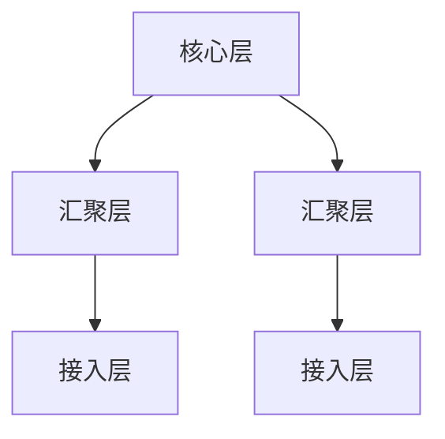
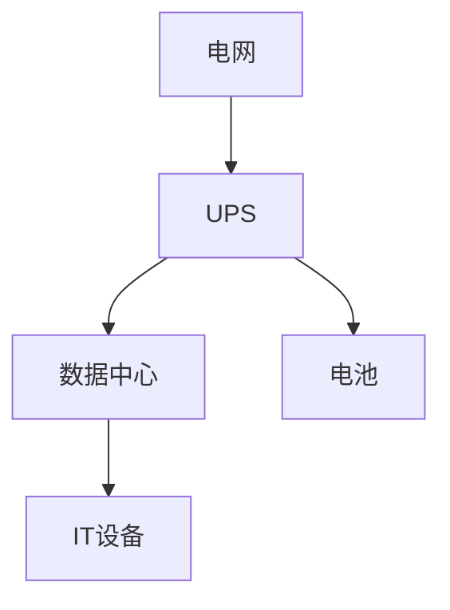
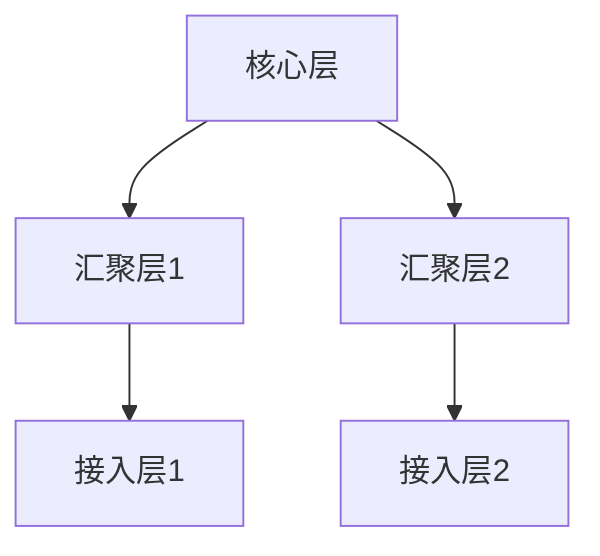
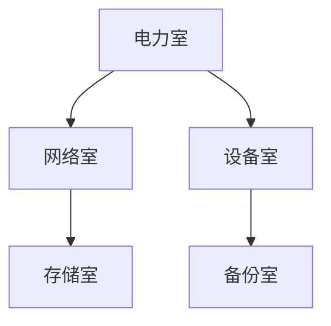

                 

### 主题：AI 大模型应用数据中心建设：数据中心技术与应用

### 1. 数据中心网络架构设计

**题目：** 请描述数据中心网络架构设计的关键要素。

**答案：** 数据中心网络架构设计的关键要素包括：

* **网络拓扑：** 通常采用分层架构，如核心层、汇聚层和接入层。
* **冗余设计：** 确保网络的高可用性，如双链路、多路径和冗余交换机。
* **负载均衡：** 平衡网络流量，提高网络性能和可靠性。
* **安全性：** 实施访问控制、防火墙、加密等措施，确保数据安全。
* **监控与维护：** 实时监控网络状态，及时处理故障。

**举例：**



**解析：** 该网络架构设计示例展示了数据中心网络分层结构，核心层负责连接外部网络，汇聚层负责连接接入层，接入层负责连接终端设备。

### 2. 数据中心冷却技术

**题目：** 请简述数据中心冷却技术的几种主要方法。

**答案：** 数据中心冷却技术的几种主要方法包括：

* **空气冷却：** 通过风扇和空调设备将冷空气引入数据中心，带走热量。
* **液冷技术：** 通过液态制冷剂直接接触服务器设备，带走热量。
* **外部冷却：** 利用室外冷空气或者水冷设备进行冷却。
* **热回收：** 将数据中心产生的热量回收用于其他用途，如供暖或热水。

**解析：** 数据中心冷却技术的选择取决于数据中心的规模、地理位置和能源消耗等因素。空气冷却和液冷技术是目前应用较为广泛的冷却方法。

### 3. 数据中心供电系统设计

**题目：** 请解释数据中心供电系统设计的两个重要概念：UPS 和 PUE。

**答案：** 数据中心供电系统设计的两个重要概念是 UPS（不间断电源）和 PUE（电源使用效率）。

* **UPS（不间断电源）：** 提供电力转换和电池备份功能，确保数据中心在电网故障时仍能正常运行。
* **PUE（电源使用效率）：** 是数据中心总能耗与IT设备能耗的比值，用于衡量数据中心的能源效率。PUE 越低，能源效率越高。

**举例：**



**解析：** UPS 在电网和 IT 设备之间提供保护，确保数据中心在电网故障时仍能正常运行。PUE 则用于评估数据中心的能源效率。

### 4. 数据中心安全

**题目：** 请列举数据中心安全设计的几个关键方面。

**答案：** 数据中心安全设计的几个关键方面包括：

* **物理安全：** 确保数据中心的设备、网络和场地受到保护，防止未经授权的物理访问。
* **网络安全：** 防火墙、入侵检测系统、数据加密等措施，确保网络不受攻击。
* **数据安全：** 实施数据备份、容灾和灾难恢复策略，确保数据安全。
* **访问控制：** 限制对数据中心的访问，仅允许授权用户访问。
* **安全审计：** 定期进行安全审计，检测和纠正安全漏洞。

**解析：** 数据中心安全设计的几个关键方面涵盖了物理安全、网络安全、数据安全和访问控制等方面，确保数据中心的各个方面都得到充分的保护。

### 5. AI 大模型训练中的数据预处理

**题目：** 请描述 AI 大模型训练中的数据预处理步骤。

**答案：** AI 大模型训练中的数据预处理步骤包括：

* **数据清洗：** 去除噪声、缺失值和异常值，保证数据质量。
* **数据归一化：** 将数据缩放到同一范围内，便于模型训练。
* **数据增强：** 通过旋转、翻转、裁剪等方式增加数据多样性。
* **数据划分：** 将数据集划分为训练集、验证集和测试集，用于模型训练和评估。

**举例：**

```python
from sklearn.model_selection import train_test_split
from sklearn.preprocessing import StandardScaler

# 加载数据
X, y = load_data()

# 数据清洗
X = clean_data(X)

# 数据归一化
scaler = StandardScaler()
X = scaler.fit_transform(X)

# 数据增强
X = augment_data(X)

# 数据划分
X_train, X_test, y_train, y_test = train_test_split(X, y, test_size=0.2, random_state=42)
```

**解析：** 数据预处理是 AI 大模型训练的重要步骤，通过数据清洗、归一化、增强和划分，提高模型训练效果。

### 6. 数据中心能效优化

**题目：** 请列举数据中心能效优化的几种方法。

**答案：** 数据中心能效优化的几种方法包括：

* **硬件升级：** 采用更高效的硬件设备，如服务器、存储设备和网络设备。
* **虚拟化技术：** 利用虚拟化技术提高硬件资源的利用率。
* **智能调度：** 通过智能调度算法，优化资源分配和负载均衡。
* **PUE降低：** 通过改进冷却技术和能源管理系统，降低 PUE。
* **可再生能源：** 采用太阳能、风能等可再生能源，减少对化石燃料的依赖。

**解析：** 数据中心能效优化是提高数据中心运行效率、降低运营成本的重要措施，通过硬件升级、虚拟化技术、智能调度、PUE 降低和可再生能源等方式，实现能效优化。

### 7. AI 大模型训练过程中的数据传输优化

**题目：** 请简述 AI 大模型训练过程中的数据传输优化策略。

**答案：** AI 大模型训练过程中的数据传输优化策略包括：

* **并行传输：** 利用多线程或多网卡提高数据传输速度。
* **数据压缩：** 采用数据压缩算法减少数据传输量。
* **缓存预取：** 预取后续训练数据，减少传输延迟。
* **分布式训练：** 利用分布式训练技术，降低单台服务器负载。

**解析：** AI 大模型训练过程中，数据传输速度对训练效率有重要影响。通过并行传输、数据压缩、缓存预取和分布式训练等策略，优化数据传输速度，提高训练效率。

### 8. 数据中心自动化运维

**题目：** 请列举数据中心自动化运维的几个主要方面。

**答案：** 数据中心自动化运维的几个主要方面包括：

* **监控与告警：** 实时监控服务器、网络、存储等设备状态，及时发出告警。
* **自动化部署：** 使用自动化工具部署和配置服务器、应用程序等。
* **自动化备份：** 定期自动备份数据，确保数据安全。
* **自动化扩容：** 根据负载情况自动增加或减少服务器资源。
* **自动化故障处理：** 自动识别和解决故障，减少人工干预。

**解析：** 数据中心自动化运维能够提高运维效率，减少人工干预，确保数据中心稳定运行。

### 9. 数据中心能耗预测

**题目：** 请简述数据中心能耗预测的方法。

**答案：** 数据中心能耗预测的方法包括：

* **历史数据分析：** 分析数据中心历史能耗数据，找出能耗规律。
* **机器学习模型：** 使用机器学习算法，如回归分析、时间序列分析等，建立能耗预测模型。
* **深度学习模型：** 使用深度学习算法，如神经网络，对能耗数据进行建模。
* **集成方法：** 结合多种预测方法，提高预测准确性。

**举例：**

```python
from sklearn.ensemble import RandomForestRegressor
from sklearn.model_selection import train_test_split
from sklearn.metrics import mean_squared_error

# 加载数据
X, y = load_energy_data()

# 数据划分
X_train, X_test, y_train, y_test = train_test_split(X, y, test_size=0.2, random_state=42)

# 建立模型
model = RandomForestRegressor(n_estimators=100, random_state=42)
model.fit(X_train, y_train)

# 预测
y_pred = model.predict(X_test)

# 评估
mse = mean_squared_error(y_test, y_pred)
print("MSE:", mse)
```

**解析：** 通过历史数据分析、机器学习模型、深度学习模型和集成方法，可以建立数据中心能耗预测模型，提高能耗预测准确性。

### 10. 数据中心能耗管理

**题目：** 请简述数据中心能耗管理的关键策略。

**答案：** 数据中心能耗管理的关键策略包括：

* **能效评估：** 定期评估数据中心能耗，找出能耗瓶颈。
* **节能措施：** 实施节能措施，如优化冷却系统、使用高效设备等。
* **能耗监控：** 实时监控数据中心能耗，及时发现异常。
* **节能调度：** 根据负载情况，合理调度服务器和设备，降低能耗。
* **能源管理：** 采用智能能源管理系统，优化能源利用。

**解析：** 数据中心能耗管理通过能效评估、节能措施、能耗监控、节能调度和能源管理等方式，降低数据中心能耗，提高能源利用效率。

### 11. 数据中心硬件设备选型

**题目：** 请列举数据中心硬件设备选型的几个关键因素。

**答案：** 数据中心硬件设备选型的几个关键因素包括：

* **性能：** 确保设备满足业务需求，如计算性能、存储性能、网络带宽等。
* **可靠性：** 选择高可靠性的硬件设备，降低故障风险。
* **可扩展性：** 考虑设备未来的扩展性，适应业务增长。
* **能效：** 考虑设备的能耗和 PUE，降低运营成本。
* **维护成本：** 考虑设备的维护成本和运维难度。

**解析：** 数据中心硬件设备选型应综合考虑性能、可靠性、可扩展性、能效和维护成本等因素，确保设备满足业务需求，降低运营成本。

### 12. 数据中心散热设计

**题目：** 请简述数据中心散热设计的几个关键方面。

**答案：** 数据中心散热设计的几个关键方面包括：

* **空气流通：** 确保数据中心内部空气流通，降低设备温度。
* **冷却设备：** 采用空调、水冷等冷却设备，带走热量。
* **散热结构：** 设计合理的设备散热结构，提高散热效率。
* **温度监控：** 实时监控数据中心温度，确保设备运行在安全温度范围内。
* **节能考虑：** 在满足散热需求的同时，考虑节能措施。

**解析：** 数据中心散热设计应确保设备在安全温度范围内运行，同时降低能耗，提高能源利用效率。

### 13. 数据中心网络优化

**题目：** 请列举数据中心网络优化的几种方法。

**答案：** 数据中心网络优化的几种方法包括：

* **网络拓扑优化：** 根据业务需求调整网络拓扑结构，提高网络性能。
* **流量管理：** 通过负载均衡和流量监管，优化网络流量分布。
* **服务质量（QoS）：** 为不同业务类型提供不同级别的服务质量保障。
* **网络安全：** 加强网络安全防护，防止网络攻击和数据泄露。
* **网络监控与诊断：** 实时监控网络状态，快速诊断和解决网络问题。

**解析：** 数据中心网络优化通过网络拓扑优化、流量管理、服务质量、网络安全和网络监控与诊断等方式，提高网络性能和可靠性。

### 14. 数据中心机房选址

**题目：** 请简述数据中心机房选址的几个关键因素。

**答案：** 数据中心机房选址的几个关键因素包括：

* **地理位置：** 选择远离地震、洪水等自然灾害的区域。
* **电力资源：** 确保充足的电力供应，降低停电风险。
* **网络带宽：** 选择网络带宽充足、传输质量好的地区。
* **人才资源：** 选择人才资源丰富、技术支持强的地区。
* **政策支持：** 考虑政府政策支持、税收优惠等因素。

**解析：** 数据中心机房选址应综合考虑地理位置、电力资源、网络带宽、人才资源和政策支持等因素，确保数据中心的稳定运行。

### 15. AI 大模型训练中的分布式计算

**题目：** 请描述 AI 大模型训练中的分布式计算优势。

**答案：** AI 大模型训练中的分布式计算优势包括：

* **并行计算：** 利用多台服务器并行计算，提高训练速度。
* **负载均衡：** 调度任务到不同服务器，避免单点性能瓶颈。
* **容错性：** 服务器故障时，其他服务器可继续训练，确保训练过程稳定。
* **扩展性：** 随着模型规模扩大，可灵活扩展计算资源。

**举例：**

```python
from tensorflow.keras.utils import multi_gpu_model

# 创建单 GPU 模型
model = create_single_gpu_model()

# 将模型扩展到多 GPU
model = multi_gpu_model(model, gpus=4)

# 编译模型
model.compile(optimizer='adam', loss='categorical_crossentropy', metrics=['accuracy'])

# 训练模型
model.fit(X_train, y_train, batch_size=64, epochs=10, validation_data=(X_test, y_test))
```

**解析：** 通过分布式计算，AI 大模型训练可以充分利用多台服务器的计算资源，提高训练速度和容错性，实现更高效的训练过程。

### 16. 数据中心碳排放管理

**题目：** 请简述数据中心碳排放管理的几个关键方面。

**答案：** 数据中心碳排放管理的几个关键方面包括：

* **能源消耗统计：** 详细记录数据中心的能源消耗，包括电力、燃料等。
* **碳排放计算：** 根据能源消耗和碳排放系数，计算数据中心的碳排放量。
* **减排措施：** 实施节能减排措施，降低碳排放。
* **碳足迹监测：** 监测数据中心的碳足迹，评估减排效果。
* **碳中和：** 通过碳交易、碳汇等方式实现碳中和。

**解析：** 数据中心碳排放管理通过能源消耗统计、碳排放计算、减排措施、碳足迹监测和碳中和等方式，降低数据中心的碳排放，实现绿色可持续发展。

### 17. 数据中心网络拓扑设计

**题目：** 请简述数据中心网络拓扑设计的关键要素。

**答案：** 数据中心网络拓扑设计的关键要素包括：

* **可靠性：** 选择具有冗余性和故障恢复能力的网络拓扑。
* **可扩展性：** 网络拓扑应能适应数据中心规模的扩展。
* **性能：** 确保网络传输速度和带宽满足业务需求。
* **安全性：** 设计安全防护机制，防止网络攻击和数据泄露。
* **维护性：** 网络拓扑结构应便于维护和管理。

**举例：**



**解析：** 该网络拓扑设计示例展示了数据中心分层结构，核心层连接外部网络，汇聚层连接接入层，确保网络的高可靠性和可扩展性。

### 18. 数据中心自动化运维工具

**题目：** 请列举数据中心自动化运维工具的几种主要类型。

**答案：** 数据中心自动化运维工具的几种主要类型包括：

* **配置管理工具：** 如 Ansible、Puppet、Chef 等，用于自动化部署和配置服务器。
* **监控工具：** 如 Nagios、Zabbix、Prometheus 等，用于实时监控服务器状态。
* **自动化部署工具：** 如 Kubernetes、Docker Swarm 等，用于自动化部署和管理容器化应用。
* **日志管理工具：** 如 ELK（Elasticsearch、Logstash、Kibana）等，用于收集、存储和分析日志。
* **自动化备份工具：** 如 Bacula、Rclone 等，用于自动化备份和恢复数据。

**解析：** 数据中心自动化运维工具通过配置管理、监控、自动化部署、日志管理和自动化备份等方式，提高运维效率，降低运维成本。

### 19. 数据中心虚拟化技术

**题目：** 请简述数据中心虚拟化技术的几种主要类型。

**答案：** 数据中心虚拟化技术的几种主要类型包括：

* **硬件虚拟化：** 如 VMware ESXi、Microsoft Hyper-V 等，将物理硬件资源虚拟化为多个虚拟机。
* **操作系统虚拟化：** 如 Docker、Kubernetes 等，将操作系统虚拟化为多个容器。
* **存储虚拟化：** 如 VMware VSAN、Microsoft Storage Spaces Direct 等，将物理存储资源虚拟化为统一的存储池。
* **网络虚拟化：** 如 VMware NSX、Microsoft Azure Network Services 等，将物理网络资源虚拟化为多个虚拟网络。

**解析：** 数据中心虚拟化技术通过硬件虚拟化、操作系统虚拟化、存储虚拟化和网络虚拟化等方式，提高资源利用率和灵活性，降低运维成本。

### 20. 数据中心机房布局设计

**题目：** 请简述数据中心机房布局设计的关键要素。

**答案：** 数据中心机房布局设计的关键要素包括：

* **设备布局：** 合理安排设备位置，确保设备之间有足够的空间进行维护。
* **通风与散热：** 设计合理的通风与散热系统，确保设备在安全温度范围内运行。
* **电力供应：** 确保充足、稳定的电力供应，包括 UPS 和备用电源。
* **网络连接：** 设计高效的网络连接，确保数据传输速度和可靠性。
* **安全防护：** 考虑防火、防水、防盗等安全措施，确保机房安全。

**举例：**



**解析：** 该机房布局设计示例展示了数据中心机房的布局，包括电力室、网络室、设备室、存储室和备份室等，确保机房设备的正常运行和安全。

### 21. 数据中心应急管理

**题目：** 请简述数据中心应急管理的几个关键步骤。

**答案：** 数据中心应急管理的几个关键步骤包括：

* **应急计划制定：** 制定详细的应急计划，包括故障处理、数据恢复、人员职责等。
* **应急预案演练：** 定期进行应急预案演练，提高应急响应能力。
* **应急设备准备：** 准备必要的应急设备，如 UPS、灭火器、防水设备等。
* **应急通信：** 建立应急通信机制，确保应急情况下的人员联系和协作。
* **应急知识培训：** 对员工进行应急知识培训，提高应急处理能力。

**解析：** 数据中心应急管理通过应急计划制定、应急预案演练、应急设备准备、应急通信和应急知识培训等方式，提高数据中心在突发事件中的应对能力。

### 22. 数据中心环境控制

**题目：** 请简述数据中心环境控制的关键指标。

**答案：** 数据中心环境控制的关键指标包括：

* **温度：** 确保设备在适宜的温度范围内运行，通常为 18°C~28°C。
* **湿度：** 控制数据中心的相对湿度在 40%~60% 之间，防止静电和结露。
* **空气质量：** 确保室内空气质量良好，避免污染物质对设备造成损害。
* **噪音：** 降低机房噪音，确保设备正常运行。

**解析：** 数据中心环境控制通过温度、湿度、空气质量和噪音等指标，确保数据中心环境的稳定和安全，延长设备寿命。

### 23. 数据中心能耗监测

**题目：** 请列举数据中心能耗监测的几种主要方法。

**答案：** 数据中心能耗监测的几种主要方法包括：

* **电力监测：** 通过电力监测设备实时监测电力消耗。
* **设备能耗监测：** 通过监测设备能耗，了解各设备能耗情况。
* **数据采集：** 使用传感器和采集器，实时采集数据中心能耗数据。
* **能耗分析：** 对采集到的能耗数据进行分析，找出能耗异常和节能潜力。
* **能耗报告：** 定期生成能耗报告，评估数据中心能耗表现。

**解析：** 数据中心能耗监测通过电力监测、设备能耗监测、数据采集、能耗分析和能耗报告等方式，了解数据中心能耗情况，实施节能措施。

### 24. 数据中心硬件设备生命周期管理

**题目：** 请简述数据中心硬件设备生命周期管理的关键环节。

**答案：** 数据中心硬件设备生命周期管理的关键环节包括：

* **采购规划：** 根据业务需求制定设备采购计划。
* **设备配置：** 根据设备配置要求，配置操作系统和应用程序。
* **设备部署：** 将设备部署到数据中心，连接网络和电源。
* **设备维护：** 定期进行设备维护，包括软件更新、硬件检查等。
* **设备退役：** 设备达到使用寿命后，进行数据备份、设备拆除和回收处理。

**解析：** 数据中心硬件设备生命周期管理通过采购规划、设备配置、设备部署、设备维护和设备退役等环节，确保数据中心设备的正常运行和持续优化。

### 25. 数据中心运维流程优化

**题目：** 请简述数据中心运维流程优化的几个关键方面。

**答案：** 数据中心运维流程优化的几个关键方面包括：

* **流程标准化：** 制定标准化的运维流程，确保操作的一致性。
* **自动化运维：** 利用自动化工具，减少人工干预，提高运维效率。
* **流程监控：** 实时监控运维流程，确保流程的顺利进行。
* **流程改进：** 定期对运维流程进行评估和改进，提高流程效率。
* **人员培训：** 对运维人员进行培训，提高运维技能。

**解析：** 数据中心运维流程优化通过流程标准化、自动化运维、流程监控、流程改进和人员培训等方式，提高运维流程的效率和质量。

### 26. 数据中心节能减排措施

**题目：** 请列举数据中心节能减排的几种主要方法。

**答案：** 数据中心节能减排的几种主要方法包括：

* **硬件升级：** 采用高效节能的硬件设备，提高能源利用效率。
* **虚拟化技术：** 利用虚拟化技术提高资源利用率，降低能耗。
* **冷却优化：** 优化冷却系统，减少冷却能耗。
* **能源回收：** 利用废热回收，降低能耗。
* **智能调度：** 利用智能调度技术，优化资源分配，降低能耗。

**解析：** 数据中心节能减排通过硬件升级、虚拟化技术、冷却优化、能源回收和智能调度等方法，降低数据中心能耗，实现绿色可持续发展。

### 27. 数据中心网络安全防护

**题目：** 请简述数据中心网络安全防护的关键措施。

**答案：** 数据中心网络安全防护的关键措施包括：

* **防火墙：** 防火墙用于过滤网络流量，阻止恶意攻击。
* **入侵检测系统（IDS）：** 检测和响应入侵行为。
* **加密：** 对敏感数据进行加密，防止数据泄露。
* **访问控制：** 限制对数据中心的访问，确保只有授权用户可以访问。
* **安全审计：** 定期进行安全审计，检测和纠正安全漏洞。

**解析：** 数据中心网络安全防护通过防火墙、入侵检测系统、加密、访问控制和安全审计等措施，保护数据中心的安全。

### 28. 数据中心机房环境控制技术

**题目：** 请简述数据中心机房环境控制技术的几种主要类型。

**答案：** 数据中心机房环境控制技术的几种主要类型包括：

* **空气调节：** 通过空调系统调节温度和湿度，确保设备在适宜的环境下运行。
* **水冷系统：** 利用水冷系统带走设备产生的热量，降低设备温度。
* **自然通风：** 利用自然通风系统，降低机房温度和湿度。
* **防静电地板：** 防静电地板能有效防止静电对设备造成损害。

**解析：** 数据中心机房环境控制技术通过空气调节、水冷系统、自然通风和防静电地板等方式，确保机房环境的稳定和安全。

### 29. 数据中心冷却系统设计

**题目：** 请简述数据中心冷却系统设计的关键要素。

**答案：** 数据中心冷却系统设计的关键要素包括：

* **冷却需求：** 根据设备发热量，确定冷却系统的冷却需求。
* **冷却方式：** 选择合适的冷却方式，如空气冷却、水冷系统、自然通风等。
* **冷却效率：** 确保冷却系统能够有效带走设备产生的热量。
* **能源消耗：** 考虑冷却系统的能源消耗，降低运营成本。
* **系统可靠性：** 确保冷却系统的可靠性和稳定性。

**解析：** 数据中心冷却系统设计通过冷却需求、冷却方式、冷却效率、能源消耗和系统可靠性等要素，确保冷却系统的有效性和稳定性。

### 30. 数据中心设备布局优化

**题目：** 请简述数据中心设备布局优化的几个关键方面。

**答案：** 数据中心设备布局优化的几个关键方面包括：

* **设备分布：** 合理安排设备位置，确保设备之间的距离适中，便于维护和散热。
* **通道规划：** 设计合理的通道，确保人员可以方便地进入设备区进行维护。
* **设备密度：** 根据业务需求，合理控制设备密度，避免过密布局导致的散热问题。
* **电力分配：** 确保充足的电力供应，合理分配电力资源。
* **网络连接：** 设计高效的网络连接，确保设备之间的数据传输速度和可靠性。

**解析：** 数据中心设备布局优化通过设备分布、通道规划、设备密度、电力分配和网络连接等要素，提高数据中心的运行效率和安全性能。

